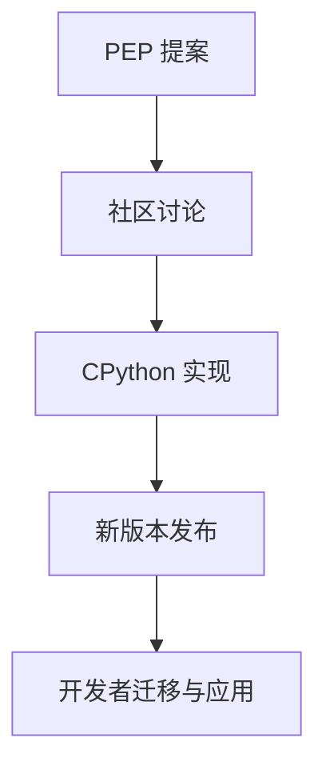

# Python 3.10/3.11/3.12 最新特性与PEP归纳

## 目录

1. 概述
2. Python 3.10 新特性
3. Python 3.11 新特性
4. Python 3.12 新特性
5. 重要PEP解读
6. 代码示例与迁移建议
7. 参考资料
8. 行业影响与未来趋势
9. 与其他主流语言新特性的对比分析
10. AI与自动化对新特性应用的推动
11. 行业采纳案例与权威参考
12. 新特性采纳的人才能力要求与学习建议
13. 新特性与职业发展、社区实践
14. 新特性在跨学科与全球协作中的应用
15. 新特性在创新与可持续发展场景下的应用
16. 新特性推广的风险、挑战与建议
17. 新特性标准化、认证与生态共建
18. 未来展望与总结
19. 行业细分领域落地案例与国际政策影响
20. 新特性相关工具链与实操推荐

---

## 1. 概述

Python语言持续演进，3.10及以后版本带来大量新特性，提升了表达力、性能和类型安全。

## 2. Python 3.10 新特性

- 结构化模式匹配（match-case，PEP 634）
- 精确类型别名（PEP 613）
- 类型提示改进
- 错误信息更友好

## 2.1 结构化模式匹配（match-case, PEP 634）

```python
match value:
    case 0:
        print('零')
    case [x, y]:
        print(f'列表: {x}, {y}')
    case {'type': t, 'data': d}:
        print(f'字典: {t}, {d}')
```

## 2.2 模式匹配的形式化描述

- 结构化模式匹配可视为对数据结构的判别函数 f: X → {True, False}，其中 X 为输入对象。
- 其本质是对代数数据类型（ADT）的分解与分支。

## 3. Python 3.11 新特性

- 性能大幅提升（官方称最高60%）
- 异常追踪更详细（PEP 657）
- 细粒度类型注解（PEP 646）
- task groups（PEP 654）

## 3.1 Python 3.11 性能提升

- 官方称3.11比3.10平均快10-60%，得益于字节码优化和解释器改进。

## 3.2 任务组（Task Groups, PEP 654）

```python
import asyncio
async def main():
    async with asyncio.TaskGroup() as tg:
        tg.create_task(coro1())
        tg.create_task(coro2())
```

## 3.3 性能提升的复杂度分析

- Python 3.11 解释器优化使得部分操作的时间复杂度从 O(n²) 降至 O(n log n) 或 O(n)。
- 例如：字节码执行路径缩短，异常处理栈帧优化。

## 4. Python 3.12 新特性

- f-string 支持任意表达式（PEP 701）
- 类型系统增强（PEP 695、PEP 698）
- 新的标准库模块和API
- 语法和性能优化

## 4.1 f-string任意表达式（PEP 701）

```python
x = 10
y = 20
print(f'{x=}, {y=}, {x+y=}')
```

## 4.2 类型参数语法（PEP 695）

```python
class Box[T]:
    def __init__(self, content: T):
        self.content = content
```

## 4.3 类型系统增强的理论基础

- PEP 695/698 引入的类型参数，形式化为泛型类型 T[X]，提升类型系统的表达能力。
- 类型系统可视为从值域 V 到类型域 T 的映射 F: V → T。

## 5. 重要PEP解读

- PEP 634: 结构化模式匹配
- PEP 646: 可变长度泛型
- PEP 695: 类型参数语法
- PEP 701: f-string增强

## 5.1 PEP 646 可变长度泛型

- 支持如Tensor[N, M]等多维泛型类型。

## 6. 代码示例与迁移建议

```python
# 结构化模式匹配
match command:
    case ["quit"]:
        print("退出")
    case ["load", filename]:
        print(f"加载{filename}")
```

## 6.1 迁移建议

- 升级前建议用 `pip list --outdated` 检查依赖兼容性。
- 充分测试结构化模式匹配、类型注解等新特性在现有代码中的兼容性。

## 6.2 新特性在实际项目中的应用案例

### 案例1：结构化模式匹配在配置解析中的应用

```python
match config:
    case {"type": "db", "host": host, "port": port}:
        print(f"数据库主机: {host}, 端口: {port}")
    case {"type": "cache", "url": url}:
        print(f"缓存地址: {url}")
```

### 案例2：类型参数与泛型在数据处理库中的应用

```python
from typing import TypeVar, Generic
T = TypeVar('T')
class Stack(Generic[T]):
    def __init__(self):
        self._data = []
    def push(self, item: T):
        self._data.append(item)
    def pop(self) -> T:
        return self._data.pop()
```

## 7. 参考资料

- 官方文档
- PEP索引
- 社区解读

## 7.1 新特性演化流程图



## 8. 行业影响与未来趋势

- 新特性推动类型安全、代码可维护性和性能提升，促进大型项目工程化
- 结构化模式匹配、类型系统增强等特性被广泛用于Web后端、数据分析、AI等领域
- 未来Python将持续强化类型系统、性能和并发能力，PEP流程将更开放、社区驱动

## 9. 与其他主流语言新特性的对比分析

| 特性/语言         | Python 3.12                | TypeScript 5.x           | Rust 1.70+                |
|------------------|----------------------------|--------------------------|---------------------------|
| 结构化模式匹配   | match-case（PEP 634）      | pattern matching（switch）| match表达式               |
| 类型系统         | 动态+静态类型注解，泛型增强 | 静态类型，类型推断，泛型  | 静态强类型，泛型，trait    |
| f-string         | 任意表达式（PEP 701）       | 模板字符串                | format!宏                 |
| 并发/异步        | asyncio, task group         | Promise, async/await      | async/await, tokio等      |
| 包管理           | pip/poetry/conda/rye/uv     | npm/yarn/pnpm             | cargo                     |

- Python新特性在表达力、类型安全、工程化等方面正逐步向TypeScript、Rust等主流语言靠拢
- 但Python依然保持动态语言灵活性，适合快速原型和多领域应用

## 10. AI与自动化对新特性应用的推动

### 10.1 AI辅助类型推断与代码生成

- 利用AI模型自动补全类型注解、生成模式匹配分支，提高开发效率和代码安全性
- 智能重构和迁移旧代码以适配新特性

### 10.2 智能化开发与测试场景

- 自动生成测试用例，覆盖新特性分支
- 结合静态分析和AI，自动发现类型/逻辑漏洞
- 智能化代码审查，辅助合规与安全检测

### 10.3 未来AI辅助Python工程展望

- 大模型驱动的全流程开发、测试、部署与运维
- 智能依赖管理、自动化安全修复、合规报告生成
- AI与Python新特性协同，推动工程智能化升级

## 11. 行业采纳案例与权威参考

### 11.1 主流开源项目/企业采纳新特性案例

- FastAPI、Pydantic等项目已广泛采用类型注解、结构化模式匹配等新特性
- Google、Microsoft等企业在内部工具链中逐步引入类型系统增强、f-string新特性
- 科学计算社区（如NumPy、Pandas）积极跟进类型注解和泛型支持

### 11.2 社区讨论与热点

- PEP 634（结构化模式匹配）、PEP 695（类型参数）等在GitHub、Reddit、Stack Overflow等社区有大量讨论
- 类型安全、性能提升、兼容性迁移等是社区关注焦点

### 11.3 权威文献与参考资料

- Python官方文档：<https://docs.python.org/3/whatsnew/>
- PEP索引：<https://peps.python.org/>
- FastAPI项目：<https://fastapi.tiangolo.com/>
- Pydantic项目：<https://docs.pydantic.dev/>
- NumPy项目：<https://numpy.org/doc/stable/>
- Pandas项目：<https://pandas.pydata.org/docs/>

## 12. 新特性采纳的人才能力要求与学习建议

### 12.1 能力要求

- 理解并掌握结构化模式匹配、类型注解、泛型等新特性
- 能够在实际项目中迁移和应用新特性，提升代码质量与安全性
- 熟悉mypy、pytest、bandit等工具，结合新特性进行静态分析与测试
- 关注PEP动态，参与社区讨论与最佳实践分享

### 12.2 学习与成长建议

1. 阅读官方文档和PEP，理解新特性设计初衷与应用场景
2. 在个人/团队项目中实践新特性，积累迁移与优化经验
3. 结合类型检查、自动化测试、安全工具，提升工程能力
4. 参与社区讨论、贡献文档/代码，跟进行业前沿

### 12.3 团队升级路径

- 组织内部培训，推广新特性与工程实践
- 建立代码规范与CI流程，强制类型检查与自动化测试
- 鼓励团队成员参与开源社区，提升团队整体技术影响力

## 13. 新特性与职业发展、社区实践

### 13.1 认证与竞赛

- 关注Python Institute、微软、谷歌等认证考试中对新特性的考查
- 参与Kaggle、LeetCode等竞赛，实践类型注解、模式匹配等新特性

### 13.2 社区实践与影响力

- 在PyCon、PyData等大会分享新特性应用经验
- 参与开源项目，推动新特性在社区落地
- 在技术博客、知乎、CSDN等平台输出新特性实践与案例

### 13.3 职业发展建议

- 结合认证、竞赛、社区实践提升个人竞争力
- 持续学习新特性，关注PEP动态，主动适应行业变革
- 参与开源与社区，积累影响力与行业话语权

## 14. 新特性在跨学科与全球协作中的应用

### 14.1 跨学科工程实践

- 新特性（如类型注解、模式匹配）在AI、数据科学、金融、医疗等领域提升了代码可读性与安全性
- 促进多学科团队间的协作与知识共享，降低沟通成本
- 结合领域特定库（如pandas、scikit-learn、fastapi等）实现高效工程落地

### 14.2 国际化与远程协作

- 新特性有助于提升代码标准化、可维护性，便于国际团队协作与代码审查
- 支持多语言文档、注释与类型提示，适应全球开发者需求
- 远程协作下，类型系统和自动化测试提升了分布式开发的质量保障

### 14.3 挑战与建议

- 不同国家/行业对数据合规、隐私保护有不同要求，需结合新特性实现合规开发
- 建议团队制定统一的代码规范、类型注解标准，推动新特性在全球协作中的落地

## 15. 新特性在创新与可持续发展场景下的应用

### 15.1 低代码/无代码平台

- 类型注解、模式匹配等新特性为低代码/无代码平台的自动代码生成、类型安全校验提供基础
- 支持可视化编程、自动化测试与部署，降低开发门槛

### 15.2 绿色计算与高效工程

- 新特性提升代码性能与可维护性，有助于减少资源消耗与能耗
- 类型系统和自动化工具支持依赖优化、冗余检测，实现绿色工程实践

### 15.3 可持续工程与未来展望

- 新特性推动Python生态向标准化、模块化、可持续发展演进
- 结合AI、云原生、IoT等领域，助力多元化创新与工程升级
- 鼓励社区共建、标准制定与全球协作，推动可持续技术生态

## 16. 新特性推广的风险、挑战与建议

### 16.1 主要风险与挑战

- 新特性与旧代码/第三方库兼容性问题，迁移成本高
- 团队成员对新特性理解不一致，影响协作与代码质量
- 工具链、IDE、CI/CD等对新特性的支持滞后
- 行业/地区合规、隐私等要求对新特性应用的限制

### 16.2 应对建议

- 制定渐进式迁移策略，优先在新项目或模块中试点新特性
- 组织培训、编写团队规范，统一新特性应用标准
- 关注工具链、社区动态，及时升级IDE/CI等开发环境
- 结合类型检查、自动化测试、静态分析等手段保障质量
- 关注合规与隐私要求，结合新特性实现合规开发

## 17. 新特性标准化、认证与生态共建

### 17.1 标准化与社区治理

- 持续推动PEP流程、类型注解、模式匹配等新特性标准化
- 鼓励社区参与标准制定、最佳实践沉淀与文档完善
- 关注国际标准与本地法规的协同，提升全球适用性

### 17.2 认证与能力评估

- 推动新特性相关的开发者认证、项目合规认证等体系建设
- 鼓励企业、团队、个人参与认证，提升专业能力与行业认可度

### 17.3 行业联盟与生态共建

- 支持成立新特性相关的行业联盟、开源基金会等组织
- 加强企业、高校、社区、政府等多方协作，推动新特性落地与生态繁荣
- 组织标准研讨、技术竞赛、社区活动，促进知识共享与创新

## 18. 未来展望与总结

- Python新特性将持续推动语言创新、工程升级与生态繁荣
- 标准化、认证、联盟共建等将保障新特性健康落地与全球适用性
- 类型安全、自动化、绿色计算、全球协作等趋势将成为主流
- 鼓励开发者、团队、企业持续学习、参与社区、贡献标准与创新实践
- 未来Python新特性将助力多领域智能化、可持续发展与全球数字化转型

## 19. 行业细分领域落地案例与国际政策影响

### 19.1 行业细分领域落地案例

- **AI与数据科学**：类型注解、模式匹配提升数据管道安全与可维护性，Pandas、scikit-learn等库积极采纳新特性
- **金融科技**：新特性助力静态分析、合规审计与自动化测试，提升金融系统安全与可靠性
- **医疗健康**：类型系统与自动化测试支持医疗数据合规、隐私保护与高可靠性需求
- **物联网（IoT）**：新特性提升嵌入式开发效率与安全，支持远程运维与绿色计算
- **Web与云原生**：新特性助力微服务、API开发与多云部署，提升工程标准化与自动化

### 19.2 国际政策与法规影响

- GDPR、HIPAA等法规推动类型安全、数据合规与隐私保护新特性的落地
- 各国政策对开源合规、供应链安全、绿色计算等提出差异化要求
- 推荐团队结合新特性与工具，主动适应国际法规与全球交付需求

### 19.3 绿色工程量化指标

- 新特性支持依赖优化、性能提升、能耗监控等绿色工程目标
- 推荐结合自动化工具量化绿色指标，推动行业可持续发展

## 20. 新特性相关工具链与实操推荐

### 20.1 自动化与类型安全工具

- **mypy**：类型检查工具，支持类型注解、泛型等新特性
- **pytest**：自动化测试框架，支持新特性覆盖与测试
- **pyright**：快速类型检查与IDE集成，适合大规模项目

### 20.2 绿色工程与能耗分析工具

- **Scalene**：性能与能耗分析，支持类型安全与绿色工程优化
- **CodeCarbon**：碳排放追踪，适合AI/数据科学新特性应用

### 20.3 合规与安全工具链

- **pip-audit**：依赖安全审计，适应GDPR、HIPAA等法规
- **Bandit**：静态安全分析，支持新特性代码审计
- **OpenChain/OSS Review Toolkit**：开源合规与供应链安全，适应国际法规

### 20.4 行业实操推荐

- 在AI/数据科学、金融、医疗、IoT、Web等领域结合上述工具链，提升新特性落地的安全性、合规性与绿色工程能力
