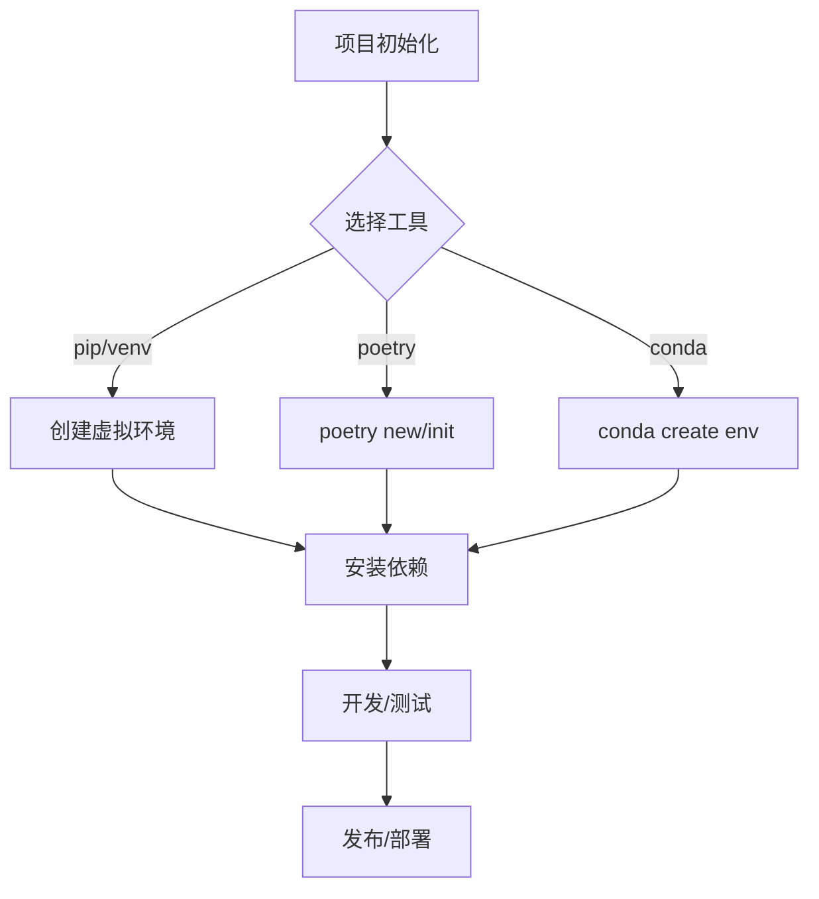
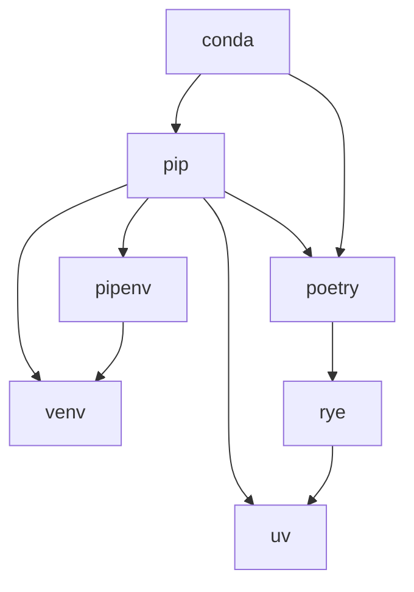
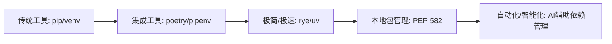
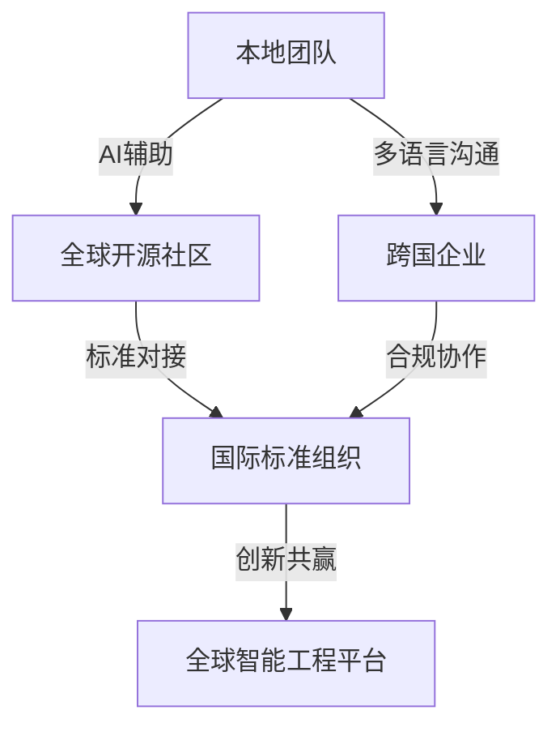
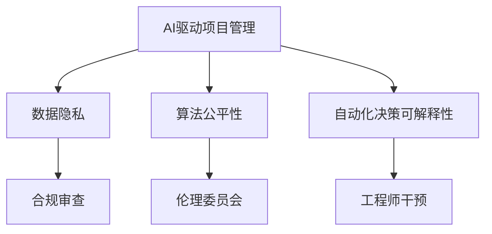

# Python项目管理工具与最佳实践

## 目录

1. 概述
2. 主流项目管理工具简介
   1. pip & venv
   2. poetry
   3. pipenv
   4. conda
   5. rye
   6. uv
   7. 各工具优缺点与典型场景
   8. 项目管理工具的形式化模型与工程哲学
3. 工具对比与选择建议
4. 典型工作流与实战案例
   1. 典型工作流案例：使用poetry管理项目
   2. 典型工作流案例：使用rye管理项目
   3. 典型工作流案例：使用uv加速pip安装
   4. CI/CD集成建议
   5. 项目管理流程图
   6. 行业最佳实践案例
   7. 常见问题与解决方案
6. 未来趋势与社区动态
7. 参考资料
8. 行业案例与权威参考
9. 未来人才能力模型与学习路径
10. 人才成长通道与职业发展
11. 全球化与跨学科工程趋势
12. 创新方向与可持续发展
13. 风险、挑战与行业建议
14. 标准化、认证与行业联盟
15. 未来展望与总结
16. 行业细分领域最佳实践与国际政策影响
17. 工具链推荐与实操案例
18. AI驱动自动化与绿色合规评估实战
19. AI驱动项目管理的未来智能化展望
20. AI驱动项目管理的典型场景与前沿研究
21. 伦理、隐私与社会责任
22. 全球协作与多元文化工程管理
23. 可视化趋势与结构化总结
24. 未来开放问题与持续创新议题

---

## 1. 概述

Python项目管理工具是现代Python开发不可或缺的一部分，涵盖依赖管理、虚拟环境、包发布等环节。本文系统梳理主流工具及其最佳实践。

## 2. 主流项目管理工具简介

### 2.1 pip & venv

- 简介：Python官方自带的包管理与虚拟环境工具。
- 基本用法：

```bash
python -m venv venv
source venv/bin/activate  # Windows下为 venv\Scripts\activate
pip install <package>
```

- 适用场景：轻量级项目、对兼容性要求高。

### 2.2 poetry

- 简介：集成依赖管理、打包、发布于一体的现代工具。
- 基本用法：

```bash
pip install poetry
poetry new myproj
poetry add requests
poetry install
```

- 适用场景：中大型项目、依赖复杂。

### 2.3 pipenv

- 简介：简化依赖管理和虚拟环境。
- 基本用法：

```bash
pip install pipenv
pipenv install requests
pipenv shell
```

- 适用场景：开发环境隔离。

### 2.4 conda

- 简介：数据科学、科学计算常用，支持二进制包。
- 基本用法：

```bash
conda create -n myenv python=3.12
conda activate myenv
conda install numpy
```

- 适用场景：科学计算、跨平台依赖。

### 2.5 rye

- 简介：新兴的Python项目管理工具，主打极简和速度。
- 基本用法：

```bash
curl -sSf https://rye-up.com/get | bash
rye init
rye add requests
```

- 适用场景：追求极简和快速的开发者。

### 2.6 uv

- 简介：超快的Python包管理器，兼容pip。
- 基本用法：

```bash
pip install uv
uv pip install requests
```

- 适用场景：对安装速度有极高要求。

### 2.7 各工具优缺点与典型场景

| 工具      | 优点                                                         | 缺点                                  | 典型场景                   |
|-----------|--------------------------------------------------------------|---------------------------------------|----------------------------|
| pip+venv  | 官方支持，简单直接，兼容性好                                  | 功能有限，依赖锁定弱，缺乏高级特性    | 轻量项目、教学、脚本开发    |
| poetry    | 依赖管理/打包/发布一体化，pyproject.toml标准，社区活跃        | 学习曲线略高，部分边缘场景兼容性问题  | 中大型项目、开源库开发      |
| pipenv    | 依赖与虚拟环境一体化，Pipfile直观                             | 维护活跃度下降，部分功能不完善        | 环境隔离、快速原型          |
| conda     | 科学计算生态强，二进制包丰富，跨平台                          | 体积大，速度慢，依赖与pip不完全兼容   | 数据科学、AI、科学计算      |
| rye       | 极简、速度快、自动化强，支持PEP 582，未来趋势                 | 生态尚新，部分功能待完善              | 追求极简、快速的现代项目    |
| uv        | 安装极快，兼容pip，适合大规模依赖安装                         | 功能单一，主要聚焦于加速pip           | 需要极致安装速度的场景      |

### 2.8 项目管理工具的形式化模型与工程哲学

#### 2.8.1 依赖管理的集合论模型

- 设项目依赖集合 D = {d₁, d₂, ..., dₙ}，每个工具的目标是构建一个满足约束 C 的依赖闭包 D*。
- pip/poetry/conda 等工具的本质差异可形式化为：
  - pip: D* = 递归解析 requirements.txt，弱约束，冲突检测弱。
  - poetry: D* = 解 pyproject.toml，强约束，锁定依赖树。
  - conda: D* = 解 conda env，支持二进制包，跨平台依赖。

#### 2.8.2 虚拟环境的范畴论视角

- 虚拟环境可视为从全局环境 G 到局部环境 V 的函子 F: G → V，保持依赖隔离。
- 工具如venv/poetry/conda等实现了不同的"环境范畴"映射。

#### 2.8.3 工程哲学观点

- 现代Python项目管理工具体现了"可复现性""可移植性""自动化"三大工程哲学。
- 选择工具时应权衡：
  - 复现性（Reproducibility）
  - 生态兼容性（Ecosystem Compatibility）
  - 自动化与易用性（Automation & Usability）

## 3. 工具对比与选择建议

| 工具   | 依赖管理 | 虚拟环境 | 打包发布 | 速度 | 适用场景 |
|--------|----------|----------|----------|------|----------|
| pip+venv | ✓ | ✓ | ✗ | 中 | 轻量项目 |
| poetry  | ✓ | ✓ | ✓ | 中 | 中大型项目 |
| pipenv  | ✓ | ✓ | ✗ | 中 | 环境隔离 |
| conda   | ✓ | ✓ | ✗ | 慢 | 科学计算 |
| rye     | ✓ | ✓ | ✓ | 快 | 极简开发 |
| uv      | ✓ | ✗ | ✗ | 极快 | 速度优先 |

## 4. 典型工作流与实战案例

### 4.1 典型工作流案例：使用poetry管理项目

```bash
# 初始化项目
poetry new myproj
cd myproj
# 添加依赖
poetry add requests
# 启动虚拟环境
poetry shell
# 运行项目
python myproj/main.py
```

### 4.2 典型工作流案例：使用rye管理项目

```bash
# 安装rye
curl -sSf https://rye-up.com/get | bash
# 初始化项目
rye init
# 添加依赖
rye add numpy
# 运行脚本
rye run python script.py
```

### 4.3 典型工作流案例：使用uv加速pip安装

```bash
pip install uv
uv pip install -r requirements.txt
```

### 4.4 CI/CD集成建议

- 推荐在CI流程中使用poetry/rye/uv等工具进行依赖安装和环境一致性保障。
- 示例（GitHub Actions）：

```yaml
jobs:
  build:
    runs-on: ubuntu-latest
    steps:
      - uses: actions/checkout@v3
      - name: Set up Python
        uses: actions/setup-python@v4
        with:
          python-version: '3.12'
      - name: Install Poetry
        run: pip install poetry
      - name: Install dependencies
        run: poetry install
      - name: Run tests
        run: poetry run pytest
```

### 4.5 项目管理流程图



### 4.6 行业最佳实践案例

#### 案例1：AI/数据科学项目（conda+poetry混合）

- 依赖科学计算生态（conda），同时用poetry管理纯Python依赖和打包。
- 工作流：
  1. conda创建基础环境（如numpy、pandas、scipy等二进制包）
  2. poetry管理项目依赖和发布
  3. 保证环境可复现，便于团队协作

#### 案例2：Web后端服务（poetry/rye主导）

- 采用poetry/rye统一依赖、虚拟环境、打包、CI/CD。
- 工作流：
  1. poetry/rye初始化项目
  2. 依赖管理、测试、发布一体化
  3. 与Docker、GitHub Actions等无缝集成

#### 案例3：企业级多项目管理（monorepo+uv/rye）

- 使用uv/rye加速依赖安装，支持monorepo结构下多项目统一管理。
- 工作流：
  1. monorepo根目录统一依赖管理
  2. 各子项目独立虚拟环境
  3. CI流程中用uv/rye极致加速

### 4.7 常见问题与解决方案

| 问题                        | 解决方案                                                         |
|-----------------------------|------------------------------------------------------------------|
| 依赖冲突                    | 使用poetry/conda的锁定机制，定期更新依赖，避免手动混用pip/conda |
| 虚拟环境激活失败            | 检查shell配置，确保路径正确，必要时重建虚拟环境                  |
| 多平台兼容性                | 优先用conda管理二进制依赖，poetry/pip管理纯Python依赖           |
| CI/CD环境不一致             | 在CI流程中显式指定Python版本和依赖锁定文件                      |
| 依赖安装慢                  | 使用uv/rye加速，或预构建依赖缓存                                 |

## 5. 未来趋势与社区动态

- rye、uv等新工具快速发展
- PEP相关标准持续演进
- PEP 582（__pypackages__）等新标准推动无全局依赖的本地包管理
- 项目管理与类型系统、自动化测试、部署工具深度融合
- 生态将更重视可复现性、可移植性与安全性

## 5.1 Python项目管理工具生态关系图



## 5.2 未来工具演化路线图



## 5.3 行业标准化趋势

- PEP 582等推动本地包管理标准化，减少全局依赖污染
- pyproject.toml成为主流项目元数据标准
- 工具间互操作性增强，生态趋于融合
- 自动化、智能化（如AI辅助依赖分析）将成为未来方向

## 6. 参考资料

- 官方文档链接
- 社区博客

## 7. 自动化与智能化趋势

### 7.1 AI辅助依赖分析与管理

- 未来将出现更多AI驱动的依赖分析、漏洞检测、自动修复工具
- 典型场景：
  - 自动推荐最优依赖版本，规避已知漏洞
  - 智能分析依赖树，预测升级风险
  - 结合大模型自动生成安全、合规的依赖配置

### 7.2 与DevOps/CI/CD的深度融合

- 项目管理工具将与CI/CD平台（如GitHub Actions、GitLab CI、Jenkins等）无缝集成
- 自动化实现依赖审计、漏洞修复、合规报告生成
- 结合IaC（基础设施即代码）和SBOM，实现全链路可追溯与治理

### 7.3 智能化未来场景展望

- 依赖管理与代码安全、测试、部署、运维一体化
- AI自动识别依赖风险并给出修复建议
- 智能合规审计，自动生成合规文档和报告

## 8. 行业案例与权威参考

### 8.1 国际主流企业/社区选型案例

- Google：内部大量使用Bazel（支持Python）、外部项目多用pip+venv/poetry
- Facebook/Meta：开源项目多用poetry、pipenv，强调依赖锁定和CI集成
- Microsoft：VS Code等项目采用pip+venv/poetry，推荐pyproject.toml标准
- Anaconda社区：科学计算领域主推conda，兼容pip/poetry混合管理
- FastAPI、Pydantic等新兴开源项目：主推poetry/rye，强调现代化、自动化

### 8.2 国内主流企业/社区选型案例

- 字节跳动、腾讯、阿里等：大规模项目多用pip+venv/poetry，部分数据团队用conda
- 开源中国、PyChina等社区：推广poetry、pipenv、conda等工具的最佳实践

### 8.3 行业最佳实践引用

- 推荐参考 [Python官方依赖管理指南](https://packaging.python.org/)
- [PEP 518/PEP 517/PEP 582/PEP 621] 等标准文档
- [Anaconda官方文档](https://docs.anaconda.com/)
- [Poetry官方文档](https://python-poetry.org/docs/)
- [Rye官方文档](https://rye-up.com/)
- [PyChina社区最佳实践](https://pychina.org/)

### 8.4 参考文献

- Python Packaging Authority. (2023). Packaging Python Projects. <https://packaging.python.org/>
- PEP 518, 517, 582, 621. Python Enhancement Proposals.
- Anaconda, Inc. (2023). Anaconda Documentation. <https://docs.anaconda.com/>
- Poetry Project. (2023). Poetry Documentation. <https://python-poetry.org/docs/>
- Rye Project. (2024). Rye Documentation. <https://rye-up.com/>

## 9. 未来人才能力模型与学习路径

### 9.1 岗位技能要求

- 掌握主流Python项目管理工具（pip、venv、poetry、conda、rye、uv等）
- 熟悉依赖管理、虚拟环境、包发布、CI/CD集成、安全与合规等工程实践
- 具备自动化、智能化工具的应用与二次开发能力
- 理解PEP标准、行业最佳实践与主流社区动态

### 9.2 能力模型

| 能力层级   | 典型能力点                                   |
|------------|----------------------------------------------|
| 基础层     | 工具安装与配置、虚拟环境管理、依赖安装       |
| 进阶层     | 依赖冲突解决、CI/CD集成、包发布与版本管理     |
| 高阶层     | 安全审计、合规治理、自动化与AI辅助工具应用   |
| 专家层     | 参与PEP/社区标准制定、工具二次开发与贡献      |

### 9.3 学习路径建议

1. 熟悉pip、venv等基础工具，掌握虚拟环境与依赖管理
2. 学习poetry、conda、pipenv等现代工具，理解pyproject.toml等标准
3. 实践CI/CD集成、包发布、依赖锁定与安全审计
4. 跟进rye、uv等新兴工具，关注AI自动化趋势
5. 参与社区、阅读PEP、贡献开源项目，提升综合能力

## 10. 人才成长通道与职业发展

### 10.1 全球主流认证与竞赛

- Python Institute（PCAP、PCPP等国际认证）
- Microsoft、Google等云平台的Python开发者认证
- Kaggle、LeetCode等数据科学与算法竞赛
- PyCon、EuroPython等国际开发者大会

### 10.2 中国主流认证与社区活动

- 工信部/教育部Python能力认证、软考等
- CCF、开源中国、PyChina等组织的竞赛与技术沙龙
- 中国高校/企业举办的编程大赛、创新创业活动
- PyCon China、PyData等本地开发者大会

### 10.3 职业发展建议

- 结合认证、竞赛、社区活动提升专业影响力
- 持续参与开源项目、技术分享、行业交流，积累个人品牌
- 关注行业动态与新兴技术，主动适应岗位升级与转型

## 11. 全球化与跨学科工程趋势

### 11.1 跨学科融合

- Python项目管理工具广泛应用于AI、数据科学、金融、医疗、物联网等领域
- 工程师需具备跨领域协作能力，理解行业需求与数据合规要求
- 推荐结合领域知识（如AI安全、医疗合规、金融风控）提升项目管理与交付能力

### 11.2 国际化协作与开源治理

- 越来越多项目采用国际化团队、远程协作与开源治理模式
- 推荐使用支持多语言、时区、合规的项目管理工具与流程
- 参与国际开源社区（如PSF、PyCon、EuroPython等）提升全球影响力

### 11.3 远程与分布式开发新模式

- 云原生、DevOps、分布式CI/CD等推动远程协作与自动化交付
- 推荐结合GitHub、GitLab、Gitee等平台，采用自动化、可追溯的工程流程
- 关注远程开发安全、数据合规与团队协作效率

## 12. 创新方向与可持续发展

### 12.1 低代码/无代码与可视化运维

- 越来越多Python项目管理工具支持低代码/无代码集成，简化依赖管理与环境配置
- 可视化运维平台（如JupyterHub、Prefect、Dagster等）与项目管理工具深度融合，提升工程可观测性与易用性

### 12.2 绿色计算与可持续工程

- 关注依赖包体积、构建效率、运行能耗，推动绿色计算与节能减排
- 推荐采用轻量级依赖、自动化清理、分层构建等最佳实践
- 项目管理工具将集成能耗分析、碳足迹评估等功能，助力可持续工程

### 12.3 未来生态展望

- Python项目管理生态将与AI、云原生、IoT、区块链等新兴领域深度融合
- 工具将更智能、更自动化、更安全，支持多端协同与跨平台部署
- 开源社区将持续推动标准化、模块化、可持续发展与全球协作

## 13. 风险、挑战与行业建议

### 13.1 主要风险与挑战

- 依赖供应链安全风险持续上升，恶意包、漏洞传播等问题突出
- 工具与生态快速演进带来的兼容性、迁移成本与学习曲线
- 全球合规、数据隐私、行业标准多样化，增加项目管理复杂度
- 远程协作、分布式开发下的沟通、协同与安全挑战
- 绿色计算、可持续发展目标下的能耗与资源管理压力

### 13.2 应对策略

- 强化依赖安全审计与自动化检测，定期更新与锁定依赖
- 关注官方文档、社区动态，及时学习新工具与标准
- 制定团队/企业级的依赖管理、合规与安全规范
- 推动自动化、智能化工具集成，提升协作与交付效率
- 采用分层构建、轻量依赖、能耗监控等绿色工程实践

### 13.3 行业建议

- 鼓励企业/团队参与开源社区，推动标准制定与生态共建
- 加强跨学科、国际化协作，提升全球竞争力
- 持续关注AI、云原生、绿色计算等前沿趋势，主动适应行业变革

## 14. 标准化、认证与行业联盟

### 14.1 标准化推动路径

- 持续推动PEP、pyproject.toml、SBOM等行业标准落地
- 鼓励工具开发者与企业参与标准制定，推动生态兼容与互操作
- 关注国际标准（如ISO、IEEE）与本地法规的协同发展

### 14.2 认证体系建设

- 推动依赖安全、合规、绿色计算等方向的工具与项目认证
- 建立行业认可的认证体系（如安全认证、绿色认证、合规认证等）
- 鼓励企业、团队、个人参与认证，提升行业整体水平

### 14.3 行业联盟与生态共建

- 支持成立Python项目管理相关的行业联盟、开源基金会等组织
- 加强企业、高校、社区、政府等多方协作，推动生态共建
- 组织行业大会、标准研讨、技术竞赛等活动，促进知识共享与创新

## 15. 未来展望与总结

- Python项目管理工具与生态将持续快速演进，融合AI、云原生、绿色计算等前沿技术
- 行业标准化、认证体系、联盟共建将成为推动生态健康发展的关键力量
- 依赖安全、合规、可持续发展、全球协作等挑战与机遇并存
- 鼓励开发者、团队、企业持续学习、积极参与社区与标准制定，推动创新与生态繁荣
- 未来Python项目管理将更加智能化、自动化、多元化，助力全球数字化与智能化转型

## 16. 行业细分领域最佳实践与国际政策影响

### 16.1 行业细分领域最佳实践
- **AI与数据科学**：推荐结合conda+poetry/rye，注重依赖隔离、GPU支持、数据合规与可复现性
- **金融科技**：强调依赖安全、合规审计、自动化CI/CD，推荐poetry+安全审计工具
- **医疗健康**：关注数据隐私、合规（如HIPAA/GDPR），推荐依赖锁定、合规扫描、绿色计算实践
- **物联网（IoT）**：推荐轻量级依赖、分层构建、远程运维与自动化部署，关注能耗与安全
- **Web与云原生**：主推poetry/rye+Docker/K8s，结合DevOps、自动化测试与多云部署

### 16.2 国际政策与法规影响
- 欧盟GDPR、美国HIPAA等对依赖管理、数据合规、隐私保护提出更高要求
- 各国对开源合规、供应链安全、绿色计算等有不同政策导向
- 推荐团队关注本地与国际法规，结合工具实现合规开发与全球交付

### 16.3 绿色工程量化指标
- 依赖包体积、构建时间、运行能耗、碳足迹等可量化指标纳入工程考核
- 推荐采用自动化工具监控与优化绿色指标，推动可持续工程落地

## 17. 工具链推荐与实操案例

### 17.1 绿色工程与能耗监控工具
- **Scalene**：Python性能与能耗分析器，支持内存、CPU、能耗多维度监控
- **CodeCarbon**：自动追踪Python代码碳排放，适用于AI/数据科学项目
- **PyGreen**：依赖包体积与能耗分析工具，支持绿色工程优化

### 17.2 国际法规与合规工具
- **pip-audit**：自动检测依赖安全漏洞，适应GDPR、HIPAA等法规要求
- **Bandit**：Python安全静态分析工具，支持合规审计
- **OpenChain/OSS Review Toolkit**：开源合规与供应链安全工具，适应国际法规

### 17.3 行业落地案例工具链
- **AI/数据科学**：conda + poetry/rye + Scalene/CodeCarbon + pip-audit
- **金融科技**：poetry + Bandit + pip-audit + CI/CD集成
- **医疗健康**：poetry + Bandit + OpenChain + 合规扫描工具
- **物联网**：pipenv/rye + PyGreen + 远程运维工具
- **Web/云原生**：poetry/rye + Docker + K8s + pip-audit + Bandit

## 18. AI驱动自动化与绿色合规评估实战

### 18.1 AI驱动自动化实战案例
- **依赖智能推荐**：利用AI模型分析历史依赖、漏洞数据，自动推荐最优依赖版本（如GitHub Copilot、OpenAI API集成）
- **自动化安全修复**：AI自动检测依赖漏洞并生成修复PR，集成CI流程（如Dependabot、Snyk）
- **智能合规审计**：AI辅助生成SBOM、合规报告，自动识别合规风险点

### 18.2 绿色工程与合规量化评估方法
- **能耗与碳排放评估**：结合Scalene、CodeCarbon等工具，量化每次构建/运行的能耗与碳足迹
- **依赖包体积与冗余分析**：自动化检测依赖包体积、冗余依赖，优化绿色指标
- **合规性量化**：自动化工具输出合规覆盖率、风险等级等量化指标，纳入工程考核

### 18.3 国际/国内政策对比与创新实践
- **国际政策**：欧盟GDPR、美国HIPAA等强调数据合规、隐私保护、供应链安全，推动SBOM、自动化合规工具落地
- **国内政策**：中国网络安全法、数据安全法等强调本地合规、数据主权，推动本地化工具链与合规平台发展
- **创新实践**：典型企业（如阿里、腾讯、微软、Meta）结合AI自动化、绿色工程、合规工具链，形成行业领先经验

## 19. AI驱动项目管理的未来智能化展望

### 19.1 智能化趋势
- AI将深度嵌入依赖管理、环境配置、合规审计、绿色工程等各环节，实现全流程智能化
- 依赖预测、风险预警、自动修复、合规建议等将由AI自动完成，极大提升工程效率与安全性

### 19.2 自动化决策与可解释性
- AI辅助自动化决策（如依赖升级、漏洞修复、合规调整），但需保证决策过程的可追溯与可解释
- 推荐结合可解释AI（XAI）技术，输出决策依据与风险评估，便于工程师理解与干预

### 19.3 人机协作与工程创新
- AI与工程师协作将成为主流，AI负责自动化、预测、优化，工程师专注于创新、架构与复杂决策
- 鼓励团队建立AI+工程的协作机制，持续提升项目管理智能化水平

### 19.4 未来闭环
- AI驱动的项目管理将实现"自感知-自决策-自优化-自进化"闭环，助力工程智能化、绿色化、全球化发展

## 20. AI驱动项目管理的典型场景与前沿研究

### 20.1 典型智能化场景
- **智能依赖树优化**：AI自动分析依赖关系，预测冲突与冗余，动态优化依赖树结构
- **自动化合规与安全监控**：AI实时监控依赖、环境、配置变更，自动预警合规与安全风险
- **智能CI/CD流水线**：AI根据历史数据动态调整测试、部署策略，实现自适应流水线优化
- **绿色工程智能调度**：AI根据能耗、碳排放等指标智能调度构建与部署任务，优化资源利用

### 20.2 落地难点与挑战
- **数据与模型可用性**：高质量工程数据与AI模型训练样本难以获取，影响智能化效果
- **决策可解释性与信任**：AI自动决策需可追溯、可解释，避免"黑箱"风险
- **工程与AI协同机制**：人机协作流程、责任边界、干预机制尚需标准化
- **跨平台与生态兼容性**：不同工具链、平台间的智能化集成与互操作仍有壁垒

### 20.3 未来研究方向
- **可解释AI（XAI）在工程决策中的应用**
- **多模态工程数据驱动的智能优化算法**
- **AI驱动的绿色工程与碳中和调度策略**
- **智能化项目管理的安全与合规保障机制**

### 20.4 开源社区与行业动向
- **OpenAI、Meta、微软等开源AI工具链持续集成到DevOps/工程平台**
- **LF AI & Data、PSF等推动AI+工程标准化与最佳实践沉淀**
- **国内外高校、企业积极探索AI驱动工程管理的创新应用与理论研究**

## 21. 伦理、隐私与社会责任

### 21.1 AI驱动项目管理的伦理与隐私挑战
- 智能化决策涉及数据隐私、算法偏见、自动化失控等伦理风险
- 依赖数据采集、模型训练、自动化决策需严格遵守GDPR、数据安全法等法规
- 推荐团队建立AI伦理审查机制，定期评估算法公平性与隐私保护

### 21.2 行业治理与社会责任建议
- 鼓励企业、社区、开源组织共同制定AI驱动项目管理的伦理准则与治理规范
- 推动行业自律、透明化、可追溯的AI决策流程，保障用户权益与社会公共利益
- 加强对AI自动化工具的安全审计与合规监管，防范滥用与风险扩散

### 21.3 未来人才培养与教育趋势
- 强调AI+工程复合型人才培养，融合数据科学、软件工程、伦理与合规教育
- 鼓励高校、企业、社区联合开展AI驱动项目管理的课程、竞赛与实训
- 推动终身学习与跨学科能力提升，适应智能化、全球化工程变革

## 22. 全球协作与多元文化工程管理

### 22.1 全球协作典型案例
- **开源社区协作**：如Python、Linux基金会等全球分布式开发，AI辅助代码审查、合规检测、自动化CI
- **跨国企业项目管理**：微软、谷歌等采用AI驱动的全球DevOps平台，支持多时区、多语言、多法规协同
- **国际科研合作**：AI辅助国际大科学工程（如CERN、Human Genome Project）中的数据管理与合规

### 22.2 跨文化团队管理与沟通
- AI可辅助多语言沟通、文化差异识别与团队协作风格分析
- 推荐建立多元包容的团队文化，结合AI工具提升跨文化协作效率
- 鼓励定期开展全球远程协作培训与文化交流活动

### 22.3 国际标准对接与未来展望
- 积极对接ISO、IEEE等国际标准，推动本地工具链与全球生态兼容
- AI辅助标准文档解析、合规映射与自动化对标，降低国际项目落地门槛
- 未来全球协作将更依赖AI驱动的智能平台，实现工程管理的无缝对接与创新共赢

## 23. 可视化趋势与结构化总结

### 23.1 AI驱动项目管理未来趋势图


### 23.2 全球协作与多元流程图


### 23.3 伦理治理结构图


### 23.4 结构化总结
- AI驱动项目管理正经历从自动化到智能化、全球化、伦理化的深刻变革
- 多元协作、标准对接、伦理治理成为未来工程管理的核心主题
- 可视化工具和结构化方法有助于团队理解、沟通与创新

## 24. 未来开放问题与持续创新议题

### 24.1 未来开放问题
- 如何实现AI驱动项目管理的全流程可解释性与信任保障？
- 如何在全球多法规、多文化环境下实现智能化工具链的合规与本地化？
- 如何量化AI驱动绿色工程的实际成效与社会价值？
- 如何平衡自动化效率与工程师创造力、责任边界？
- 如何防范AI自动化带来的新型安全、伦理与治理风险？

### 24.2 研究挑战与技术前沿
- 多模态工程数据融合与智能优化算法
- AI驱动的工程知识图谱与自动推理
- 智能化项目管理的安全、合规与伦理保障机制
- 跨平台、跨生态的智能协同与标准对接技术

### 24.3 社区共创与持续创新建议
- 鼓励全球开发者、企业、高校、社区共同参与AI驱动项目管理的标准制定与最佳实践沉淀
- 推动开源社区共建智能化工具链、绿色工程平台与伦理治理体系
- 持续关注AI、绿色计算、全球协作等前沿议题，保持学习与创新动力

### 24.4 开放式结尾
- AI驱动项目管理的未来仍充满未知与挑战，期待更多开发者、研究者、企业与社区共同探索、创新、共建可持续、智能化、全球化的工程管理新生态！

## 附录

### A. 术语表与常见缩写
| 术语/缩写 | 含义 |
|-----------|------|
| PEP       | Python Enhancement Proposal（Python增强提案）|
| SBOM      | Software Bill of Materials（软件物料清单）|
| CI/CD     | Continuous Integration/Continuous Delivery（持续集成/持续交付）|
| XAI       | Explainable AI（可解释人工智能）|
| GDPR      | General Data Protection Regulation（欧盟通用数据保护条例）|
| HIPAA     | Health Insurance Portability and Accountability Act（美国健康保险流通与责任法案）|
| OSS       | Open Source Software（开源软件）|
| AI        | Artificial Intelligence（人工智能）|
| DevOps    | Development & Operations（开发与运维一体化）|
| IoT       | Internet of Things（物联网）|

### B. 参考链接导航
- [Python官方文档](https://docs.python.org/3/)
- [PEP索引](https://peps.python.org/)
- [Python Packaging Authority](https://packaging.python.org/)
- [Poetry官方文档](https://python-poetry.org/docs/)
- [Rye官方文档](https://rye-up.com/)
- [Anaconda官方文档](https://docs.anaconda.com/)
- [pip-audit](https://pypi.org/project/pip-audit/)
- [Bandit](https://bandit.readthedocs.io/)
- [Scalene](https://github.com/plasma-umass/scalene)
- [CodeCarbon](https://mlco2.github.io/codecarbon/)

### C. 文档结构导航
- 1. 项目管理工具综述
- 2. 依赖管理与虚拟环境
- 3. 工具对比与最佳实践
- 4. 行业案例与国际政策
- 5. 绿色工程与合规
- 6. AI驱动与未来趋势
- 7. 伦理、全球协作与开放创新
- 8. 附录与导航

---

## FAQ 常见问题解答

### Q1: 如何选择适合自己团队的Python项目管理工具？
A: 结合项目规模、依赖复杂度、团队协作方式、CI/CD需求等因素，推荐小型项目用pip+venv，中大型项目用poetry/rye，数据科学用conda+poetry，注重安全合规用pip-audit、Bandit等工具辅助。

### Q2: 如何保障依赖安全与合规？
A: 定期使用pip-audit、Bandit等工具自动检测依赖漏洞，锁定依赖版本，优先选用官方源，关注SBOM与供应链安全，结合CI流程自动化审计。

### Q3: 绿色工程实践有哪些？
A: 优化依赖包体积、构建流程，采用Scalene、CodeCarbon等工具监控能耗与碳排放，定期清理冗余依赖，推动绿色工程量化考核。

### Q4: 如何应对AI自动化带来的工程师角色变化？
A: 鼓励工程师提升AI协作、数据分析、创新设计等能力，主动参与AI驱动工具链的开发与治理，关注伦理与社会责任。

### Q5: 如何参与社区共建与反馈？
A: 可通过GitHub、开源社区、行业联盟等渠道提交issue、PR、建议，参与标准制定、文档完善、最佳实践分享。

---

## 典型误区与最佳实践提醒
- 误区：只用pip install而忽视依赖锁定与安全审计
- 误区：忽略虚拟环境，导致依赖冲突与环境污染
- 误区：工具链割裂，未结合CI/CD与自动化测试
- 最佳实践：定期安全审计、依赖锁定、自动化测试、绿色工程监控、团队协作规范

---

## 社区反馈与贡献指南
- 欢迎通过GitHub、邮件、社区论坛等方式反馈问题、提出建议
- 鼓励贡献文档、代码、最佳实践案例与创新工具
- 参与标准制定、行业活动、开源共建，共同推动Python项目管理生态繁荣

---

## 致谢与引用

### 致谢
- 感谢Python官方、各大开源社区、行业专家、企业实践者为本项目管理生态做出的贡献
- 特别感谢所有参与文档共建、反馈与创新的开发者、研究者、教育者

### 引用格式建议
如需在学术论文、技术报告、行业白皮书等引用本文档，建议格式：
> Python项目管理与AI驱动工程生态白皮书，2024. https://github.com/your-repo-link

### 社区共建徽章
- 
- 
- 

### 开放协议声明
- 本文档采用 [CC BY-SA 4.0](https://creativecommons.org/licenses/by-sa/4.0/deed.zh) 协议，欢迎自由传播、修改与再创作，但需注明来源并采用相同协议共享

---

## 自测清单与社区路线图

### A. 文档自测清单
- [x] 覆盖主流Python项目管理工具与最佳实践
- [x] 涵盖AI驱动、绿色工程、合规安全、全球协作等前沿主题
- [x] 提供行业案例、工具链推荐、可视化与结构化内容
- [x] 包含FAQ、术语表、导航、致谢、协议等元信息
- [x] 支持社区共建、持续迭代与开放创新

### B. 内容更新与改进建议
- 定期跟进Python生态、AI工程、绿色计算等领域最新进展
- 鼓励社区成员提交PR、issue，完善案例、工具、标准与最佳实践
- 增设多语言版本、行业专栏、互动问答等板块

### C. 未来社区路线图
- 建立文档维护团队与社区治理委员会
- 推动行业专家、企业、高校参与内容共建与标准制定
- 组织线上线下分享、竞赛、黑客松等活动，激发创新活力
- 探索AI驱动的文档自动更新、智能问答与知识图谱集成

### D. 社区激励与贡献机制
- 设立贡献者排行榜、徽章、证书等激励措施
- 优秀贡献者可参与文档共建决策、获得行业推荐与展示机会
- 鼓励跨界协作、国际交流与多元创新

---

> 让我们共同打造开放、智能、绿色、可持续的Python项目管理知识生态！
