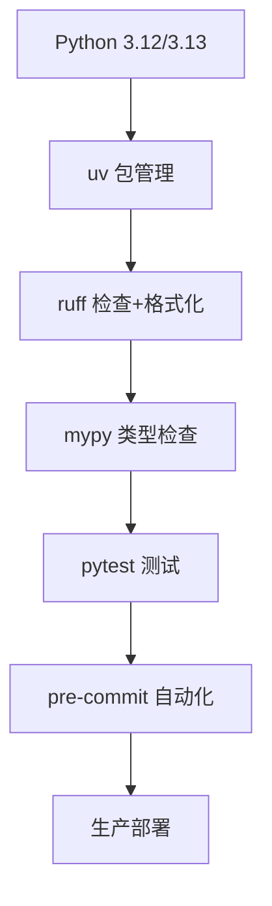

# Python 开发工具链 2025

**现代 Python 开发的完整工具生态**-

---

## 📚 目录

- [1. uv - 极速包管理器](#1-uv---极速包管理器)
- [2. ruff - 超快 Linter + Formatter](#2-ruff---超快-linter--formatter)
- [3. mypy - 类型检查](#3-mypy---类型检查)
- [4. pytest - 测试框架](#4-pytest---测试框架)
- [5. pre-commit - Git 钩子](#5-pre-commit---git-钩子)
- [6. IDE 集成](#6-ide-集成)
- [7. 完整工作流](#7-完整工作流)
- [8. 延伸阅读](#8-延伸阅读)

> **详细文档**:
> 1. [uv 工具链](01-uv-toolchain.md) - 极速包管理
> 2. [ruff 代码检查](02-ruff.md) - 超快 Linter
> 3. [mypy 类型检查](03-mypy.md) - 静态类型检查
> 4. [pytest 测试框架](04-pytest.md) - 测试工具
> 5. [black 代码格式化](05-black.md) - 代码格式化
> 6. [pre-commit 钩子](06-pre-commit.md) - Git 钩子
> 7. [IDE 集成](07-ide-integration.md) - IDE 配置

---

## 🚀 2025 现代工具链

### 核心工具栈



---

## 1. uv - 极速包管理器

**10-100x 速度提升！**

### 安装

```bash
# macOS/Linux
curl -LsSf https://astral.sh/uv/install.sh | sh

# Windows
powershell -c "irm https://astral.sh/uv/install.ps1 | iex"

# 验证
uv --version
```

### 核心命令

```bash
# 项目管理
uv init my-project          # 创建项目
uv sync                     # 安装依赖
uv add fastapi              # 添加依赖
uv remove fastapi           # 移除依赖

# Python 版本管理
uv python install 3.12      # 安装 Python
uv python pin 3.12          # 设置版本

# 运行
uv run python script.py     # 运行脚本
uv run pytest               # 运行测试
```

### 配置示例

```toml
# pyproject.toml
[project]
name = "my-project"
version = "0.1.0"
requires-python = ">=3.12"
dependencies = [
    "fastapi>=0.115.0",
    "uvicorn[standard]>=0.30.0",
]

[tool.uv]
dev-dependencies = [
    "pytest>=8.3.0",
    "mypy>=1.11.0",
    "ruff>=0.6.0",
]
```

---

## 2. ruff - 超快 Linter + Formatter

**10-100x 比 Black/Flake8/isort 更快！**

### 安装2

```bash
uv add --dev ruff
```

### 核心功能

```bash
# 代码检查
ruff check .                # 检查所有文件
ruff check --fix .          # 自动修复
ruff check --watch .        # 监视模式

# 代码格式化
ruff format .               # 格式化代码
ruff format --check .       # 检查格式
```

### 配置示例2

```toml
# pyproject.toml
[tool.ruff]
line-length = 88
target-version = "py312"

# 启用规则
[tool.ruff.lint]
select = [
    "E",      # pycodestyle errors
    "W",      # pycodestyle warnings
    "F",      # pyflakes
    "I",      # isort
    "N",      # pep8-naming
    "UP",     # pyupgrade
    "B",      # flake8-bugbear
    "C4",     # flake8-comprehensions
    "DTZ",    # flake8-datetimez
    "T10",    # flake8-debugger
    "EM",     # flake8-errmsg
    "ISC",    # flake8-implicit-str-concat
    "ICN",    # flake8-import-conventions
    "PIE",    # flake8-pie
    "PT",     # flake8-pytest-style
    "Q",      # flake8-quotes
    "RSE",    # flake8-raise
    "RET",    # flake8-return
    "SIM",    # flake8-simplify
    "TID",    # flake8-tidy-imports
    "TCH",    # flake8-type-checking
    "ARG",    # flake8-unused-arguments
    "PTH",    # flake8-use-pathlib
    "ERA",    # eradicate
    "PL",     # pylint
    "TRY",    # tryceratops
    "RUF",    # ruff-specific rules
]

# 忽略规则
ignore = [
    "E501",   # line too long (由 formatter 处理)
    "PLR0913", # too many arguments
]

# 每个文件的忽略规则
[tool.ruff.lint.per-file-ignores]
"__init__.py" = ["F401"]  # 允许未使用的导入
"tests/**" = ["S101"]     # 允许 assert

# isort 配置
[tool.ruff.lint.isort]
known-first-party = ["myproject"]
```

### 实际使用

```python
# 示例代码
from typing import Optional
import os, sys  # ❌ ruff 会提示分开导入

def calculate(x:int,y:int)->int:  # ❌ ruff 会修复空格
    return x+y

# 运行 ruff check --fix
# 自动修复为：

import os
import sys
from typing import Optional

def calculate(x: int, y: int) -> int:
    return x + y
```

---

## 🔤 3. mypy - 静态类型检查

### 安装3

```bash
uv add --dev mypy
```

### 核心命令3

```bash
# 类型检查
mypy src/                   # 检查目录
mypy --strict src/          # 严格模式
mypy --install-types        # 安装类型存根
```

### 配置示例3

```toml
# pyproject.toml
[tool.mypy]
python_version = "3.12"

# 严格模式
strict = true

# 详细配置
warn_return_any = true
warn_unused_configs = true
warn_redundant_casts = true
warn_unused_ignores = true
warn_unreachable = true
disallow_untyped_defs = true
disallow_any_generics = true
disallow_subclassing_any = true
disallow_untyped_calls = true
disallow_incomplete_defs = true
check_untyped_defs = true
no_implicit_optional = true
strict_equality = true
strict_concatenate = true

# 第三方库
[[tool.mypy.overrides]]
module = "third_party.*"
ignore_missing_imports = true
```

### 实际使用3

```python
# 示例代码
def greet(name: str) -> str:
    return f"Hello, {name}"

# ✅ 类型正确
result: str = greet("Alice")

# ❌ 类型错误 (mypy 会报错)
result: int = greet("Bob")  # error: Incompatible types

# 泛型示例
from typing import TypeVar

T = TypeVar("T")

def first[T](items: list[T]) -> T:
    return items[0]

# ✅ mypy 能推断出类型
numbers: list[int] = [1, 2, 3]
result: int = first(numbers)  # 推断为 int
```

---

## 3. mypy - 类型检查

（详见 [mypy 类型检查](03-mypy.md)）

---

## 4. pytest - 测试框架

### 安装4

```bash
uv add --dev pytest pytest-cov pytest-asyncio pytest-mock
```

### 核心命令4

```bash
# 运行测试
pytest                      # 所有测试
pytest tests/test_api.py    # 特定文件
pytest -k "test_user"       # 匹配名称
pytest -v                   # 详细输出
pytest --cov=src            # 覆盖率
pytest --cov-report=html    # HTML 报告
```

### 配置示例4

```toml
# pyproject.toml
[tool.pytest.ini_options]
testpaths = ["tests"]
python_files = ["test_*.py", "*_test.py"]
python_classes = ["Test*"]
python_functions = ["test_*"]

# 标记
markers = [
    "slow: marks tests as slow",
    "integration: marks tests as integration tests",
    "unit: marks tests as unit tests",
]

# 覆盖率
[tool.coverage.run]
source = ["src"]
omit = ["*/tests/*", "*/test_*.py"]

[tool.coverage.report]
exclude_lines = [
    "pragma: no cover",
    "def __repr__",
    "raise AssertionError",
    "raise NotImplementedError",
    "if __name__ == .__main__.:",
    "if TYPE_CHECKING:",
]
```

### 实际示例

```python
# tests/test_calculator.py
import pytest
from myproject.calculator import Calculator

class TestCalculator:
    @pytest.fixture
    def calc(self):
        return Calculator()
    
    def test_add(self, calc):
        assert calc.add(2, 3) == 5
    
    def test_divide(self, calc):
        assert calc.divide(10, 2) == 5
    
    def test_divide_by_zero(self, calc):
        with pytest.raises(ZeroDivisionError):
            calc.divide(10, 0)
    
    @pytest.mark.parametrize("a,b,expected", [
        (1, 2, 3),
        (5, 5, 10),
        (-1, 1, 0),
    ])
    def test_add_parametrized(self, calc, a, b, expected):
        assert calc.add(a, b) == expected

# 异步测试
@pytest.mark.asyncio
async def test_async_function():
    result = await async_function()
    assert result == "success"
```

---

## 5. pre-commit - Git 钩子

### 安装5

```bash
uv add --dev black
```

### 核心命令5

```bash
# 格式化
black .                     # 格式化所有文件
black --check .             # 检查格式
black --diff .              # 显示差异
```

### 配置示例5

```toml
# pyproject.toml
[tool.black]
line-length = 88
target-version = ["py312"]
include = '\.pyi?$'
extend-exclude = '''
/(
  # 排除目录
  \.git
  | \.mypy_cache
  | \.pytest_cache
  | build
  | dist
)/
'''
```

**注意**: ruff format 可以替代 black，速度更快！

---

## 🔗 6. pre-commit - Git 钩子

### 安装6

```bash
uv add --dev pre-commit
```

### 配置示例6

```yaml
# .pre-commit-config.yaml
repos:
  # Ruff (替代 black, isort, flake8)
  - repo: https://github.com/astral-sh/ruff-pre-commit
    rev: v0.6.0
    hooks:
      - id: ruff
        args: [--fix]
      - id: ruff-format
  
  # Mypy
  - repo: https://github.com/pre-commit/mirrors-mypy
    rev: v1.11.0
    hooks:
      - id: mypy
        additional_dependencies: [types-all]
  
  # 基础检查
  - repo: https://github.com/pre-commit/pre-commit-hooks
    rev: v4.6.0
    hooks:
      - id: trailing-whitespace
      - id: end-of-file-fixer
      - id: check-yaml
      - id: check-added-large-files
      - id: check-merge-conflict
      - id: detect-private-key
```

### 使用

```bash
# 安装钩子
pre-commit install

# 手动运行
pre-commit run --all-files

# 更新钩子
pre-commit autoupdate
```

---

## 💻 7. IDE 集成

### VS Code

```json
// .vscode/settings.json
{
  // Python 解释器
  "python.defaultInterpreterPath": "${workspaceFolder}/.venv/bin/python",
  
  // Ruff
  "ruff.enable": true,
  "ruff.organizeImports": true,
  
  // Mypy
  "python.linting.mypyEnabled": true,
  "python.linting.mypyArgs": ["--strict"],
  
  // 格式化
  "editor.formatOnSave": true,
  "[python]": {
    "editor.defaultFormatter": "charliermarsh.ruff"
  },
  
  // 测试
  "python.testing.pytestEnabled": true,
  "python.testing.unittestEnabled": false
}
```

### PyCharm

```text
Settings > Tools > Python Integrated Tools
- Package manager: uv
- Default test runner: pytest
- Type checker: mypy

Settings > Tools > External Tools
- 添加 ruff check
- 添加 ruff format
```

---

## 6. IDE 集成

（详见 [IDE 集成](07-ide-integration.md)）

---

## 7. 完整工作流

### 1. 项目初始化

```bash
# 创建项目
uv init my-project
cd my-project

# 安装开发工具
uv add --dev ruff mypy pytest pytest-cov pre-commit

# 配置 pre-commit
pre-commit install
```

### 2. 开发流程

```bash
# 1. 编写代码
vim src/myproject/main.py

# 2. 格式化
ruff format src/

# 3. 检查
ruff check --fix src/
mypy src/

# 4. 测试
pytest --cov=src

# 5. 提交（自动运行 pre-commit）
git add .
git commit -m "feat: add new feature"
```

### 3. CI/CD 集成

```yaml
# .github/workflows/ci.yml
name: CI

on: [push, pull_request]

jobs:
  test:
    runs-on: ubuntu-latest
    steps:
      - uses: actions/checkout@v4
      
      - name: Setup uv
        uses: astral-sh/setup-uv@v3
      
      - name: Install dependencies
        run: uv sync --all-extras
      
      - name: Ruff check
        run: uv run ruff check .
      
      - name: Ruff format
        run: uv run ruff format --check .
      
      - name: Mypy
        run: uv run mypy src/
      
      - name: Pytest
        run: uv run pytest --cov=src --cov-report=xml
      
      - name: Upload coverage
        uses: codecov/codecov-action@v4
```

---

## 📊 工具对比

### 速度对比

```text
任务: 检查 + 格式化 10,000 个 Python 文件

传统工具链 (black + isort + flake8):
  时间: 45 秒

现代工具链 (ruff):
  时间: 0.5 秒  (90x faster!)  🚀
```

### 功能对比

| 工具 | 检查 | 格式化 | 速度 | 推荐 |
|------|------|--------|------|------|
| **ruff** | ✅ | ✅ | 🚀🚀🚀 | ⭐⭐⭐⭐⭐ |
| black | ❌ | ✅ | 🚀 | ⭐⭐⭐ |
| isort | ❌ | ✅ | 🚀 | ⭐⭐ |
| flake8 | ✅ | ❌ | 🚀 | ⭐⭐ |
| pylint | ✅ | ❌ | 🐌 | ⭐⭐ |

---

## 8. 延伸阅读

### 1. 严格模式

```toml
# pyproject.toml

[tool.ruff]
target-version = "py312"

[tool.ruff.lint]
select = ["ALL"]  # 启用所有规则
ignore = [
    "D",      # pydocstyle (可选)
    "ANN101", # self 类型注解
]

[tool.mypy]
strict = true
```

### 2. 渐进式采用

```bash
# 阶段 1: 基础格式化
ruff format .

# 阶段 2: 基础检查
ruff check --select=E,W,F .

# 阶段 3: 扩展检查
ruff check --select=E,W,F,I,N,UP .

# 阶段 4: 类型检查
mypy src/ --no-strict-optional

# 阶段 5: 严格模式
mypy src/ --strict
```

### 3. 团队协作

```toml
# 统一配置文件
# pyproject.toml

[tool.ruff]
line-length = 88  # 团队统一

[tool.mypy]
strict = true     # 团队统一

[tool.pytest.ini_options]
minversion = "8.0"
```

---

## 📚 延伸阅读

- [uv 文档](https://github.com/astral-sh/uv)
- [ruff 文档](https://docs.astral.sh/ruff/)
- [mypy 文档](https://mypy.readthedocs.io/)
- [pytest 文档](https://docs.pytest.org/)
- [pre-commit 文档](https://pre-commit.com/)

---

**使用现代工具链，让开发更高效！** 🚀✨
