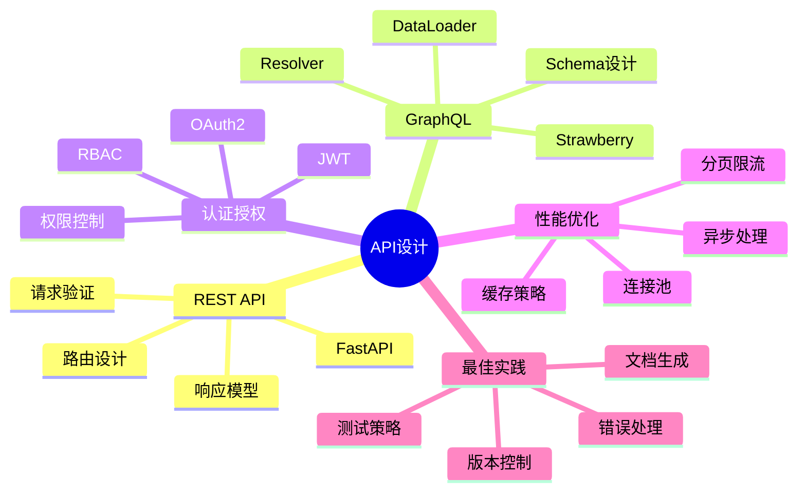

# Python API 设计完全指南 2025

**RESTful API与GraphQL最佳实践**

---

## 📊 API设计体系



---

## 1️⃣ RESTful API设计

### 1.1 FastAPI基础

```python
"""
FastAPI - 现代Python API框架
"""
from fastapi import FastAPI, HTTPException, Depends, status
from pydantic import BaseModel, EmailStr, validator
from typing import List, Optional
from datetime import datetime

# ============================================
# 1. 创建FastAPI应用
# ============================================

app = FastAPI(
    title="My API",
    description="API documentation",
    version="1.0.0",
    docs_url="/docs",  # Swagger UI
    redoc_url="/redoc"  # ReDoc
)

# ============================================
# 2. Pydantic模型定义
# ============================================

class UserBase(BaseModel):
    """用户基础模型"""
    username: str
    email: EmailStr
    full_name: Optional[str] = None
    
    @validator("username")
    def validate_username(cls, v):
        """验证用户名"""
        if len(v) < 3:
            raise ValueError("Username must be at least 3 characters")
        if not v.isalnum():
            raise ValueError("Username must be alphanumeric")
        return v

class UserCreate(UserBase):
    """用户创建模型"""
    password: str
    
    @validator("password")
    def validate_password(cls, v):
        """验证密码强度"""
        if len(v) < 8:
            raise ValueError("Password must be at least 8 characters")
        return v

class UserResponse(UserBase):
    """用户响应模型"""
    id: int
    created_at: datetime
    is_active: bool
    
    class Config:
        from_attributes = True  # 支持ORM模型

class UserUpdate(BaseModel):
    """用户更新模型"""
    email: Optional[EmailStr] = None
    full_name: Optional[str] = None
    is_active: Optional[bool] = None

# ============================================
# 3. CRUD操作
# ============================================

@app.post(
    "/users",
    response_model=UserResponse,
    status_code=status.HTTP_201_CREATED,
    tags=["users"]
)
async def create_user(user: UserCreate) -> UserResponse:
    """
    创建新用户
    
    - **username**: 用户名(3-20字符,字母数字)
    - **email**: 邮箱地址
    - **password**: 密码(至少8字符)
    """
    # 检查用户是否存在
    existing = await get_user_by_username(user.username)
    if existing:
        raise HTTPException(
            status_code=status.HTTP_400_BAD_REQUEST,
            detail="Username already exists"
        )
    
    # 创建用户
    db_user = await create_user_in_db(user)
    return UserResponse.from_orm(db_user)

@app.get(
    "/users/{user_id}",
    response_model=UserResponse,
    tags=["users"]
)
async def get_user(user_id: int) -> UserResponse:
    """获取用户详情"""
    user = await get_user_from_db(user_id)
    if not user:
        raise HTTPException(
            status_code=status.HTTP_404_NOT_FOUND,
            detail="User not found"
        )
    return UserResponse.from_orm(user)

@app.get(
    "/users",
    response_model=List[UserResponse],
    tags=["users"]
)
async def list_users(
    skip: int = 0,
    limit: int = 100,
    is_active: Optional[bool] = None
) -> List[UserResponse]:
    """
    获取用户列表
    
    - **skip**: 跳过记录数
    - **limit**: 返回记录数(最大100)
    - **is_active**: 过滤活跃用户
    """
    users = await get_users_from_db(skip, limit, is_active)
    return [UserResponse.from_orm(u) for u in users]

@app.put(
    "/users/{user_id}",
    response_model=UserResponse,
    tags=["users"]
)
async def update_user(
    user_id: int,
    user_update: UserUpdate
) -> UserResponse:
    """更新用户信息"""
    user = await get_user_from_db(user_id)
    if not user:
        raise HTTPException(
            status_code=status.HTTP_404_NOT_FOUND,
            detail="User not found"
        )
    
    # 更新用户
    updated = await update_user_in_db(user_id, user_update)
    return UserResponse.from_orm(updated)

@app.delete(
    "/users/{user_id}",
    status_code=status.HTTP_204_NO_CONTENT,
    tags=["users"]
)
async def delete_user(user_id: int):
    """删除用户"""
    user = await get_user_from_db(user_id)
    if not user:
        raise HTTPException(
            status_code=status.HTTP_404_NOT_FOUND,
            detail="User not found"
        )
    
    await delete_user_from_db(user_id)
```

### 1.2 请求验证与错误处理

```python
"""
请求验证和错误处理
"""
from fastapi import Query, Path, Body, Header, Cookie
from pydantic import Field, constr, conint
from typing import Annotated

# ============================================
# 1. 路径参数验证
# ============================================

@app.get("/users/{user_id}")
async def get_user(
    user_id: Annotated[int, Path(
        title="User ID",
        description="The ID of the user to get",
        ge=1,  # >= 1
        le=1000000  # <= 1000000
    )]
):
    """获取用户(带路径验证)"""
    return {"user_id": user_id}

# ============================================
# 2. 查询参数验证
# ============================================

@app.get("/items")
async def list_items(
    skip: Annotated[int, Query(ge=0)] = 0,
    limit: Annotated[int, Query(ge=1, le=100)] = 50,
    q: Annotated[str | None, Query(
        min_length=3,
        max_length=50,
        pattern="^[a-zA-Z0-9 ]+$"
    )] = None,
    tags: Annotated[List[str], Query()] = []
):
    """
    查询商品列表
    
    参数验证:
    - skip: >= 0
    - limit: 1-100
    - q: 3-50字符,字母数字空格
    - tags: 字符串数组
    """
    return {"skip": skip, "limit": limit, "q": q, "tags": tags}

# ============================================
# 3. 请求体验证
# ============================================

class ItemCreate(BaseModel):
    """商品创建模型"""
    name: constr(min_length=1, max_length=100)
    description: str | None = None
    price: float = Field(gt=0, description="Price must be greater than 0")
    quantity: conint(ge=0) = 0
    tags: List[str] = []
    
    @validator("tags")
    def validate_tags(cls, v):
        if len(v) > 10:
            raise ValueError("Maximum 10 tags allowed")
        return v

@app.post("/items")
async def create_item(item: ItemCreate):
    """创建商品(带请求体验证)"""
    return item

# ============================================
# 4. Header和Cookie验证
# ============================================

@app.get("/secure-data")
async def get_secure_data(
    user_agent: Annotated[str | None, Header()] = None,
    session_id: Annotated[str | None, Cookie()] = None
):
    """读取Header和Cookie"""
    return {
        "user_agent": user_agent,
        "session_id": session_id
    }

# ============================================
# 5. 自定义异常处理
# ============================================

from fastapi.responses import JSONResponse
from fastapi.exceptions import RequestValidationError

class APIException(Exception):
    """自定义API异常"""
    def __init__(self, status_code: int, detail: str, code: str = None):
        self.status_code = status_code
        self.detail = detail
        self.code = code

@app.exception_handler(APIException)
async def api_exception_handler(request, exc: APIException):
    """处理自定义异常"""
    return JSONResponse(
        status_code=exc.status_code,
        content={
            "error": {
                "code": exc.code,
                "message": exc.detail
            }
        }
    )

@app.exception_handler(RequestValidationError)
async def validation_exception_handler(request, exc: RequestValidationError):
    """处理验证错误"""
    errors = []
    for error in exc.errors():
        errors.append({
            "field": ".".join(str(x) for x in error["loc"]),
            "message": error["msg"],
            "type": error["type"]
        })
    
    return JSONResponse(
        status_code=status.HTTP_422_UNPROCESSABLE_ENTITY,
        content={"errors": errors}
    )

# 使用自定义异常
@app.get("/items/{item_id}")
async def get_item(item_id: int):
    item = await get_item_from_db(item_id)
    if not item:
        raise APIException(
            status_code=404,
            detail="Item not found",
            code="ITEM_NOT_FOUND"
        )
    return item
```

### 1.3 认证与授权

```python
"""
JWT认证与授权
"""
from fastapi.security import HTTPBearer, HTTPAuthorizationCredentials
from jose import JWTError, jwt
from passlib.context import CryptContext
from datetime import datetime, timedelta

# ============================================
# 1. 密码加密
# ============================================

pwd_context = CryptContext(schemes=["bcrypt"], deprecated="auto")

def hash_password(password: str) -> str:
    """哈希密码"""
    return pwd_context.hash(password)

def verify_password(plain_password: str, hashed_password: str) -> bool:
    """验证密码"""
    return pwd_context.verify(plain_password, hashed_password)

# ============================================
# 2. JWT令牌
# ============================================

SECRET_KEY = "your-secret-key-keep-it-secret"
ALGORITHM = "HS256"
ACCESS_TOKEN_EXPIRE_MINUTES = 30

def create_access_token(data: dict, expires_delta: timedelta | None = None) -> str:
    """创建访问令牌"""
    to_encode = data.copy()
    
    if expires_delta:
        expire = datetime.utcnow() + expires_delta
    else:
        expire = datetime.utcnow() + timedelta(minutes=15)
    
    to_encode.update({"exp": expire})
    encoded_jwt = jwt.encode(to_encode, SECRET_KEY, algorithm=ALGORITHM)
    return encoded_jwt

def decode_access_token(token: str) -> dict:
    """解码访问令牌"""
    try:
        payload = jwt.decode(token, SECRET_KEY, algorithms=[ALGORITHM])
        return payload
    except JWTError:
        raise HTTPException(
            status_code=status.HTTP_401_UNAUTHORIZED,
            detail="Could not validate credentials",
            headers={"WWW-Authenticate": "Bearer"},
        )

# ============================================
# 3. 认证依赖
# ============================================

security = HTTPBearer()

async def get_current_user(
    credentials: HTTPAuthorizationCredentials = Depends(security)
) -> User:
    """获取当前用户"""
    token = credentials.credentials
    payload = decode_access_token(token)
    
    user_id = payload.get("sub")
    if user_id is None:
        raise HTTPException(
            status_code=status.HTTP_401_UNAUTHORIZED,
            detail="Invalid authentication credentials"
        )
    
    user = await get_user_from_db(int(user_id))
    if user is None:
        raise HTTPException(
            status_code=status.HTTP_401_UNAUTHORIZED,
            detail="User not found"
        )
    
    return user

async def get_current_active_user(
    current_user: User = Depends(get_current_user)
) -> User:
    """获取当前活跃用户"""
    if not current_user.is_active:
        raise HTTPException(
            status_code=status.HTTP_400_BAD_REQUEST,
            detail="Inactive user"
        )
    return current_user

# ============================================
# 4. 角色权限控制
# ============================================

from enum import Enum

class Role(str, Enum):
    """用户角色"""
    ADMIN = "admin"
    USER = "user"
    GUEST = "guest"

def require_role(*roles: Role):
    """要求特定角色"""
    async def role_checker(
        current_user: User = Depends(get_current_active_user)
    ):
        if current_user.role not in roles:
            raise HTTPException(
                status_code=status.HTTP_403_FORBIDDEN,
                detail="Not enough permissions"
            )
        return current_user
    
    return role_checker

# ============================================
# 5. 使用认证
# ============================================

class LoginRequest(BaseModel):
    """登录请求"""
    username: str
    password: str

class TokenResponse(BaseModel):
    """令牌响应"""
    access_token: str
    token_type: str = "bearer"

@app.post("/auth/login", response_model=TokenResponse)
async def login(request: LoginRequest):
    """用户登录"""
    # 验证用户
    user = await authenticate_user(request.username, request.password)
    if not user:
        raise HTTPException(
            status_code=status.HTTP_401_UNAUTHORIZED,
            detail="Incorrect username or password"
        )
    
    # 创建令牌
    access_token = create_access_token(
        data={"sub": str(user.id)},
        expires_delta=timedelta(minutes=ACCESS_TOKEN_EXPIRE_MINUTES)
    )
    
    return TokenResponse(access_token=access_token)

# 需要认证的端点
@app.get("/me", response_model=UserResponse)
async def read_users_me(
    current_user: User = Depends(get_current_active_user)
):
    """获取当前用户信息"""
    return UserResponse.from_orm(current_user)

# 需要管理员权限
@app.delete("/users/{user_id}")
async def delete_user(
    user_id: int,
    admin: User = Depends(require_role(Role.ADMIN))
):
    """删除用户(仅管理员)"""
    await delete_user_from_db(user_id)
    return {"message": "User deleted"}
```

---

## 2️⃣ GraphQL API设计

### 2.1 Strawberry GraphQL

```python
"""
Strawberry GraphQL框架
"""
import strawberry
from typing import List, Optional
from datetime import datetime

# ============================================
# 1. 定义类型
# ============================================

@strawberry.type
class User:
    """用户类型"""
    id: int
    username: str
    email: str
    full_name: Optional[str]
    created_at: datetime
    is_active: bool
    
    @strawberry.field
    async def posts(self) -> List["Post"]:
        """用户的文章"""
        return await get_user_posts(self.id)

@strawberry.type
class Post:
    """文章类型"""
    id: int
    title: str
    content: str
    created_at: datetime
    author_id: int
    
    @strawberry.field
    async def author(self) -> User:
        """文章作者"""
        return await get_user(self.author_id)
    
    @strawberry.field
    async def comments(self) -> List["Comment"]:
        """文章评论"""
        return await get_post_comments(self.id)

@strawberry.type
class Comment:
    """评论类型"""
    id: int
    content: str
    created_at: datetime
    post_id: int
    author_id: int

# ============================================
# 2. 输入类型
# ============================================

@strawberry.input
class UserCreateInput:
    """创建用户输入"""
    username: str
    email: str
    password: str
    full_name: Optional[str] = None

@strawberry.input
class PostCreateInput:
    """创建文章输入"""
    title: str
    content: str

@strawberry.input
class PostUpdateInput:
    """更新文章输入"""
    title: Optional[str] = None
    content: Optional[str] = None

# ============================================
# 3. Query定义
# ============================================

@strawberry.type
class Query:
    """查询"""
    
    @strawberry.field
    async def user(self, id: int) -> Optional[User]:
        """获取单个用户"""
        return await get_user(id)
    
    @strawberry.field
    async def users(
        self,
        skip: int = 0,
        limit: int = 100
    ) -> List[User]:
        """获取用户列表"""
        return await get_users(skip, limit)
    
    @strawberry.field
    async def post(self, id: int) -> Optional[Post]:
        """获取单篇文章"""
        return await get_post(id)
    
    @strawberry.field
    async def posts(
        self,
        author_id: Optional[int] = None,
        skip: int = 0,
        limit: int = 100
    ) -> List[Post]:
        """获取文章列表"""
        return await get_posts(author_id, skip, limit)

# ============================================
# 4. Mutation定义
# ============================================

@strawberry.type
class Mutation:
    """变更"""
    
    @strawberry.mutation
    async def create_user(self, input: UserCreateInput) -> User:
        """创建用户"""
        user = await create_user_in_db(input)
        return user
    
    @strawberry.mutation
    async def create_post(
        self,
        input: PostCreateInput,
        info: strawberry.Info
    ) -> Post:
        """创建文章"""
        # 从上下文获取当前用户
        current_user = info.context["user"]
        post = await create_post_in_db(input, current_user.id)
        return post
    
    @strawberry.mutation
    async def update_post(
        self,
        id: int,
        input: PostUpdateInput,
        info: strawberry.Info
    ) -> Post:
        """更新文章"""
        current_user = info.context["user"]
        post = await update_post_in_db(id, input, current_user.id)
        return post
    
    @strawberry.mutation
    async def delete_post(self, id: int, info: strawberry.Info) -> bool:
        """删除文章"""
        current_user = info.context["user"]
        return await delete_post_from_db(id, current_user.id)

# ============================================
# 5. Subscription定义
# ============================================

@strawberry.type
class Subscription:
    """订阅"""
    
    @strawberry.subscription
    async def post_created(self) -> Post:
        """订阅新文章"""
        # 使用异步生成器
        async for post in post_stream():
            yield post

# ============================================
# 6. 创建Schema
# ============================================

schema = strawberry.Schema(
    query=Query,
    mutation=Mutation,
    subscription=Subscription
)

# ============================================
# 7. 集成FastAPI
# ============================================

from strawberry.fastapi import GraphQLRouter

graphql_app = GraphQLRouter(
    schema,
    graphiql=True  # 启用GraphiQL界面
)

app.include_router(graphql_app, prefix="/graphql")
```

### 2.2 DataLoader优化

```python
"""
DataLoader解决N+1查询问题
"""
from strawberry.dataloader import DataLoader
from typing import List

# ============================================
# 1. N+1查询问题
# ============================================

# ❌ 问题代码: 会产生N+1查询
@strawberry.type
class Post:
    @strawberry.field
    async def author(self) -> User:
        # 每个post都会查询一次数据库!
        return await get_user(self.author_id)

# ============================================
# 2. 使用DataLoader解决
# ============================================

async def load_users(keys: List[int]) -> List[User]:
    """批量加载用户"""
    # 一次查询获取所有用户
    users = await get_users_by_ids(keys)
    # 返回与keys顺序对应的结果
    user_map = {user.id: user for user in users}
    return [user_map.get(k) for k in keys]

# 创建DataLoader
user_loader = DataLoader(load_fn=load_users)

# ✅ 优化后的代码
@strawberry.type
class Post:
    @strawberry.field
    async def author(self, info: strawberry.Info) -> User:
        # 使用DataLoader,自动批量查询
        loader = info.context["user_loader"]
        return await loader.load(self.author_id)

# ============================================
# 3. 多个DataLoader
# ============================================

async def load_posts_by_author(author_ids: List[int]) -> List[List[Post]]:
    """批量加载用户的文章"""
    posts = await get_posts_by_author_ids(author_ids)
    
    # 按author_id分组
    posts_by_author = {}
    for post in posts:
        if post.author_id not in posts_by_author:
            posts_by_author[post.author_id] = []
        posts_by_author[post.author_id].append(post)
    
    # 返回与keys顺序对应的结果
    return [posts_by_author.get(aid, []) for aid in author_ids]

post_loader = DataLoader(load_fn=load_posts_by_author)

# ============================================
# 4. 在上下文中提供DataLoader
# ============================================

async def get_context():
    """获取GraphQL上下文"""
    return {
        "user_loader": DataLoader(load_fn=load_users),
        "post_loader": DataLoader(load_fn=load_posts_by_author),
    }

graphql_app = GraphQLRouter(
    schema,
    context_getter=get_context
)
```

---

## 📊 API设计最佳实践

### RESTful设计原则

1. **资源命名**
   - 使用名词,不用动词: `/users` not `/getUsers`
   - 复数形式: `/users` not `/user`
   - 小写字母,连字符分隔: `/user-profiles`

2. **HTTP方法**
   - GET: 获取资源
   - POST: 创建资源
   - PUT: 完整更新
   - PATCH: 部分更新
   - DELETE: 删除资源

3. **状态码**
   - 200: 成功
   - 201: 创建成功
   - 204: 无内容
   - 400: 请求错误
   - 401: 未认证
   - 403: 无权限
   - 404: 未找到
   - 422: 验证失败
   - 500: 服务器错误

4. **分页**
```python
@app.get("/users")
async def list_users(
    page: int = 1,
    page_size: int = 20
):
    total = await count_users()
    users = await get_users_page(page, page_size)
    
    return {
        "data": users,
        "pagination": {
            "page": page,
            "page_size": page_size,
            "total": total,
            "pages": (total + page_size - 1) // page_size
        }
    }
```

---

**构建优雅、高性能、可维护的API！** 🚀✨

**最后更新**: 2025年10月28日

