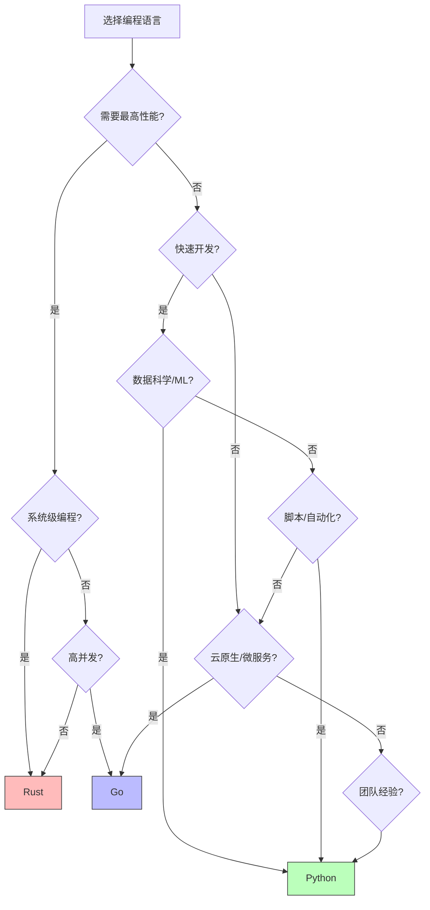

# Python vs Golang vs Rust 深度对比 2025

**三大现代语言横向纵向全面对比**

---

## 📊 概览对比

| 维度 | Python 3.12/3.13 | Go 1.22 | Rust 1.75 |
|------|-----------------|---------|-----------|
| **首次发布** | 1991 | 2009 | 2015 |
| **类型系统** | 动态+可选静态 | 静态强类型 | 静态强类型 |
| **内存管理** | GC(引用计数+标记清除) | GC(并发标记清除) | 所有权系统(零成本) |
| **并发模型** | GIL+asyncio | goroutine | async/await+线程 |
| **性能** | 中等 | 高 | 极高 |
| **学习曲线** | 平缓 | 平缓 | 陡峭 |
| **生态成熟度** | ⭐⭐⭐⭐⭐ | ⭐⭐⭐⭐ | ⭐⭐⭐⭐ |
| **主要应用** | AI/ML, 数据科学, Web | 云原生, 微服务, DevOps | 系统编程, 高性能服务, 嵌入式 |
| **编译** | 解释执行+字节码 | 编译为机器码 | 编译为机器码 |
| **启动速度** | 快(解释器) | 快(静态编译) | 快(静态编译) |
| **运行时** | 有(CPython) | 有(runtime) | 无(零成本抽象) |

---

## 1️⃣ 类型系统深度对比

### 1.1 类型系统特性矩阵

| 特性 | Python | Go | Rust |
|------|--------|-----|------|
| **类型检查时机** | 运行时+可选静态 | 编译时 | 编译时 |
| **类型推导** | 部分(mypy/pyright) | 完整(:=, var) | 完整(强大) |
| **泛型** | 类型擦除(3.12+新语法) | 1.18+支持 | 完整(单态化) |
| **联合类型** | `X \| Y` (3.10+) | 无(用interface{}) | `enum` (代数数据类型) |
| **可选类型** | `X \| None` | `*T` (指针) | `Option<T>` |
| **错误处理** | 异常 | 多返回值+error | `Result<T, E>` |
| **空值安全** | 运行时检查 | 可为nil | 编译时保证 |
| **trait/Protocol** | Protocol(结构化) | interface(结构化) | trait(名义+关联类型) |
| **生命周期** | 自动GC | 自动GC | 显式标注 |
| **所有权** | 无概念 | 无概念 | 核心概念 |

### 1.2 类型系统代码对比

#### 泛型

**Python 3.12+:**
```python
# 新语法
def first[T](items: list[T]) -> T:
    return items[0]

class Stack[T]:
    def __init__(self) -> None:
        self.items: list[T] = []
    
    def push(self, item: T) -> None:
        self.items.append(item)
    
    def pop(self) -> T:
        return self.items.pop()
```

**Go 1.18+:**
```go
// 泛型支持
func First[T any](items []T) T {
    return items[0]
}

type Stack[T any] struct {
    items []T
}

func (s *Stack[T]) Push(item T) {
    s.items = append(s.items, item)
}

func (s *Stack[T]) Pop() T {
    item := s.items[len(s.items)-1]
    s.items = s.items[:len(s.items)-1]
    return item
}
```

**Rust:**
```rust
// 强大的泛型系统
fn first<T>(items: &[T]) -> &T {
    &items[0]
}

struct Stack<T> {
    items: Vec<T>,
}

impl<T> Stack<T> {
    fn new() -> Self {
        Stack { items: Vec::new() }
    }
    
    fn push(&mut self, item: T) {
        self.items.push(item);
    }
    
    fn pop(&mut self) -> Option<T> {
        self.items.pop()
    }
}
```

#### 错误处理

**Python:**
```python
def divide(a: int, b: int) -> float:
    if b == 0:
        raise ValueError("Division by zero")
    return a / b

# 使用
try:
    result = divide(10, 0)
except ValueError as e:
    print(f"Error: {e}")
```

**Go:**
```go
func divide(a, b int) (float64, error) {
    if b == 0 {
        return 0, errors.New("division by zero")
    }
    return float64(a) / float64(b), nil
}

// 使用
result, err := divide(10, 0)
if err != nil {
    fmt.Printf("Error: %v\n", err)
}
```

**Rust:**
```rust
fn divide(a: i32, b: i32) -> Result<f64, String> {
    if b == 0 {
        Err("division by zero".to_string())
    } else {
        Ok(a as f64 / b as f64)
    }
}

// 使用
match divide(10, 0) {
    Ok(result) => println!("Result: {}", result),
    Err(e) => println!("Error: {}", e),
}

// 或使用 ? 运算符
let result = divide(10, 2)?;
```

### 1.3 类型安全性对比

| 安全维度 | Python | Go | Rust |
|---------|--------|-----|------|
| **内存安全** | ✅ GC保证 | ✅ GC保证 | ✅ 编译时保证 |
| **空指针安全** | ⚠️ None检查 | ❌ 可nil | ✅ Option<T> |
| **数据竞争** | ⚠️ GIL缓解 | ⚠️ 需手动同步 | ✅ 编译时防止 |
| **边界检查** | ✅ 运行时 | ✅ 运行时 | ✅ 编译时+运行时 |
| **类型转换** | ⚠️ 运行时检查 | ⚠️ 需手动断言 | ✅ 严格检查 |
| **整数溢出** | ❌ 自动转大整数 | ❌ 溢出未检查 | ⚠️ debug检查 |

---

## 2️⃣ 并发模型深度对比

### 2.1 并发特性矩阵

| 特性 | Python | Go | Rust |
|------|--------|-----|------|
| **并发原语** | Thread, asyncio | goroutine | thread, async/await |
| **并行性** | GIL限制(3.13+解除) | 真并行 | 真并行 |
| **调度器** | OS调度 | M:N(Go runtime) | OS调度 |
| **创建开销** | 重(线程)/轻(协程) | 极轻(~2KB) | 重(线程)/轻(async) |
| **通信方式** | Queue, 共享内存 | channel(CSP) | channel, 共享内存 |
| **同步原语** | Lock, Semaphore, Event | Mutex, RWMutex, WaitGroup | Mutex, RwLock, Barrier |
| **默认模型** | 同步+可选async | 协程优先 | 同步+可选async |
| **最大并发** | ~数千(线程)/~百万(async) | ~百万(goroutine) | ~数千(线程)/~百万(async) |

### 2.2 并发代码对比

#### 并发执行任务

**Python (asyncio):**
```python
import asyncio

async def fetch_data(id: int) -> str:
    await asyncio.sleep(1)
    return f"Data {id}"

async def main() -> None:
    tasks = [fetch_data(i) for i in range(10)]
    results = await asyncio.gather(*tasks)
    print(results)

# 运行
asyncio.run(main())
```

**Go (goroutine):**
```go
import (
    "fmt"
    "time"
)

func fetchData(id int) string {
    time.Sleep(1 * time.Second)
    return fmt.Sprintf("Data %d", id)
}

func main() {
    ch := make(chan string, 10)
    
    for i := 0; i < 10; i++ {
        go func(id int) {
            ch <- fetchData(id)
        }(i)
    }
    
    for i := 0; i < 10; i++ {
        fmt.Println(<-ch)
    }
}
```

**Rust (async):**
```rust
use tokio::time::{sleep, Duration};

async fn fetch_data(id: i32) -> String {
    sleep(Duration::from_secs(1)).await;
    format!("Data {}", id)
}

#[tokio::main]
async fn main() {
    let tasks: Vec<_> = (0..10)
        .map(|i| tokio::spawn(fetch_data(i)))
        .collect();
    
    for task in tasks {
        println!("{}", task.await.unwrap());
    }
}
```

#### 生产者-消费者模式

**Python (Queue):**
```python
from queue import Queue
from threading import Thread

def producer(q: Queue) -> None:
    for i in range(10):
        q.put(i)
    q.put(None)  # 结束信号

def consumer(q: Queue) -> None:
    while True:
        item = q.get()
        if item is None:
            break
        print(f"Consumed: {item}")

q = Queue()
Thread(target=producer, args=(q,)).start()
Thread(target=consumer, args=(q,)).start()
```

**Go (channel):**
```go
func producer(ch chan<- int) {
    for i := 0; i < 10; i++ {
        ch <- i
    }
    close(ch)
}

func consumer(ch <-chan int) {
    for item := range ch {
        fmt.Printf("Consumed: %d\n", item)
    }
}

func main() {
    ch := make(chan int)
    go producer(ch)
    consumer(ch)
}
```

**Rust (channel):**
```rust
use std::sync::mpsc;
use std::thread;

fn main() {
    let (tx, rx) = mpsc::channel();
    
    thread::spawn(move || {
        for i in 0..10 {
            tx.send(i).unwrap();
        }
    });
    
    for item in rx {
        println!("Consumed: {}", item);
    }
}
```

### 2.3 并发性能对比

| 场景 | Python | Go | Rust | 说明 |
|------|--------|-----|------|------|
| **创建100万协程** | ~10GB内存 | ~2GB内存 | ~2GB内存 | Go最轻量 |
| **上下文切换** | ~1-5μs | ~0.2μs | ~0.5μs | Go最快 |
| **Channel吞吐** | ~1M ops/s | ~10M ops/s | ~50M ops/s | Rust最快 |
| **CPU密集(单线程)** | 1x | 1x | 1x | 基准 |
| **CPU密集(多核)** | ~1x(GIL) | 8x(8核) | 8x(8核) | Python受限 |
| **I/O密集** | 100x(async) | 100x(goroutine) | 100x(async) | 相近 |

---

## 3️⃣ 内存管理深度对比

### 3.1 内存管理策略

| 维度 | Python | Go | Rust |
|------|--------|-----|------|
| **分配策略** | 引用计数 | GC(三色标记) | 所有权系统 |
| **回收策略** | 引用计数+分代GC | 并发标记清除 | 编译时确定 |
| **内存开销** | 高(对象头) | 中等 | 最低 |
| **GC暂停** | 微秒级 | 微秒-毫秒级 | 无GC |
| **内存泄漏** | 可能(循环引用) | 可能(goroutine泄漏) | 极难(编译时检查) |
| **手动控制** | 无 | 有限 | 完全控制 |
| **RAII支持** | 上下文管理器 | defer | Drop trait |

### 3.2 内存模型代码对比

#### 所有权与借用

**Python (引用语义):**
```python
def modify_list(lst: list[int]) -> None:
    lst.append(4)  # 修改原列表

data = [1, 2, 3]
modify_list(data)
print(data)  # [1, 2, 3, 4] - 被修改
```

**Go (值语义+指针):**
```go
func modifySlice(s []int) {
    s = append(s, 4)  // 可能重新分配,不影响原切片
}

func modifySlicePtr(s *[]int) {
    *s = append(*s, 4)  // 影响原切片
}

func main() {
    data := []int{1, 2, 3}
    modifySlice(data)
    fmt.Println(data)  // [1, 2, 3] - 未修改
    
    modifySlicePtr(&data)
    fmt.Println(data)  // [1, 2, 3, 4] - 被修改
}
```

**Rust (所有权系统):**
```rust
fn modify_vec(v: &mut Vec<i32>) {
    v.push(4);  // 可变借用
}

fn main() {
    let mut data = vec![1, 2, 3];
    modify_vec(&mut data);
    println!("{:?}", data);  // [1, 2, 3, 4]
    
    // 所有权转移
    let data2 = data;  // data不再可用
    // println!("{:?}", data);  // 编译错误!
    println!("{:?}", data2);  // OK
}
```

#### 资源管理(RAII)

**Python (上下文管理器):**
```python
class Resource:
    def __enter__(self):
        print("Acquire resource")
        return self
    
    def __exit__(self, *args):
        print("Release resource")

with Resource() as r:
    print("Using resource")
# 自动释放
```

**Go (defer):**
```go
func useResource() {
    file, err := os.Open("test.txt")
    if err != nil {
        return
    }
    defer file.Close()  // 函数返回时执行
    
    // 使用文件
    fmt.Println("Using resource")
}
```

**Rust (Drop trait):**
```rust
struct Resource;

impl Drop for Resource {
    fn drop(&mut self) {
        println!("Release resource");
    }
}

fn use_resource() {
    let _r = Resource;
    println!("Using resource");
}  // 自动调用 drop
```

### 3.3 内存安全性对比

| 问题类型 | Python | Go | Rust |
|---------|--------|-----|------|
| **悬垂指针** | ✅ 不可能(GC) | ✅ 不可能(GC) | ✅ 编译时防止 |
| **双重释放** | ✅ 不可能(GC) | ✅ 不可能(GC) | ✅ 编译时防止 |
| **内存泄漏** | ⚠️ 可能(循环引用) | ⚠️ 可能(goroutine) | ⚠️ 可能(Rc循环) |
| **数据竞争** | ⚠️ GIL缓解 | ⚠️ 运行时检测 | ✅ 编译时防止 |
| **越界访问** | ✅ 运行时检查 | ✅ 运行时检查 | ✅ 运行时检查 |
| **空指针解引用** | ✅ None检查 | ❌ panic | ✅ Option<T> |

---

## 4️⃣ 性能对比

### 4.1 基准性能对比

| 测试场景 | Python | Go | Rust | 最快 |
|---------|--------|-----|------|------|
| **计算斐波那契(递归)** | 1x | ~50x | ~60x | Rust |
| **HTTP服务器(10k req)** | 2k req/s | 50k req/s | 100k req/s | Rust |
| **JSON解析(1MB)** | 100ms | 10ms | 5ms | Rust |
| **字符串处理** | 1x | ~20x | ~30x | Rust |
| **文件I/O** | 1x | ~5x | ~10x | Rust |
| **启动时间** | 50ms | 10ms | 5ms | Rust |
| **内存占用(最小程序)** | 10MB | 2MB | 200KB | Rust |
| **二进制大小** | N/A | 2-10MB | 200KB-2MB | Rust |

### 4.2 Web框架性能对比

| 框架 | 语言 | 请求/秒 | 延迟(p99) | 内存 |
|------|------|--------|----------|------|
| **FastAPI** | Python | 5k | 200ms | 100MB |
| **Django** | Python | 1k | 1s | 150MB |
| **Gin** | Go | 50k | 20ms | 20MB |
| **Echo** | Go | 45k | 25ms | 18MB |
| **Actix-web** | Rust | 100k | 10ms | 10MB |
| **Axum** | Rust | 80k | 15ms | 12MB |

### 4.3 适用场景矩阵

| 场景 | Python | Go | Rust | 推荐 |
|------|--------|-----|------|------|
| **快速原型** | ⭐⭐⭐⭐⭐ | ⭐⭐⭐⭐ | ⭐⭐⭐ | Python |
| **Web后端** | ⭐⭐⭐⭐ | ⭐⭐⭐⭐⭐ | ⭐⭐⭐⭐ | Go |
| **微服务** | ⭐⭐⭐ | ⭐⭐⭐⭐⭐ | ⭐⭐⭐⭐ | Go |
| **数据科学** | ⭐⭐⭐⭐⭐ | ⭐⭐ | ⭐⭐⭐ | Python |
| **机器学习** | ⭐⭐⭐⭐⭐ | ⭐⭐ | ⭐⭐⭐⭐ | Python |
| **系统编程** | ⭐ | ⭐⭐⭐ | ⭐⭐⭐⭐⭐ | Rust |
| **嵌入式** | ⭐ | ⭐⭐ | ⭐⭐⭐⭐⭐ | Rust |
| **高性能服务** | ⭐⭐ | ⭐⭐⭐⭐ | ⭐⭐⭐⭐⭐ | Rust |
| **CLI工具** | ⭐⭐⭐⭐ | ⭐⭐⭐⭐⭐ | ⭐⭐⭐⭐⭐ | Go/Rust |
| **区块链** | ⭐⭐⭐ | ⭐⭐⭐⭐ | ⭐⭐⭐⭐⭐ | Rust |

---

## 5️⃣ 语法特性对比

### 5.1 函数式编程

**Python:**
```python
# 高阶函数
numbers = [1, 2, 3, 4, 5]
squared = list(map(lambda x: x ** 2, numbers))
evens = list(filter(lambda x: x % 2 == 0, numbers))

# 列表推导(更Pythonic)
squared = [x ** 2 for x in numbers]
evens = [x for x in numbers if x % 2 == 0]

# 函数组合
from functools import reduce
sum_all = reduce(lambda a, b: a + b, numbers)
```

**Go:**
```go
// Go缺少内置的map/filter,需手写
func Map[T, U any](slice []T, f func(T) U) []U {
    result := make([]U, len(slice))
    for i, v := range slice {
        result[i] = f(v)
    }
    return result
}

numbers := []int{1, 2, 3, 4, 5}
squared := Map(numbers, func(x int) int { return x * x })
```

**Rust:**
```rust
// 强大的迭代器
let numbers = vec![1, 2, 3, 4, 5];
let squared: Vec<_> = numbers.iter()
    .map(|x| x * x)
    .collect();

let evens: Vec<_> = numbers.iter()
    .filter(|x| *x % 2 == 0)
    .collect();

let sum: i32 = numbers.iter().sum();
```

### 5.2 面向对象编程

**Python (基于类):**
```python
class Animal:
    def __init__(self, name: str):
        self.name = name
    
    def speak(self) -> str:
        return "Some sound"

class Dog(Animal):
    def speak(self) -> str:
        return f"{self.name} says Woof!"

dog = Dog("Buddy")
print(dog.speak())
```

**Go (基于接口):**
```go
type Animal interface {
    Speak() string
}

type Dog struct {
    Name string
}

func (d Dog) Speak() string {
    return d.Name + " says Woof!"
}

func main() {
    var animal Animal = Dog{Name: "Buddy"}
    fmt.Println(animal.Speak())
}
```

**Rust (基于trait):**
```rust
trait Animal {
    fn speak(&self) -> String;
}

struct Dog {
    name: String,
}

impl Animal for Dog {
    fn speak(&self) -> String {
        format!("{} says Woof!", self.name)
    }
}

fn main() {
    let dog = Dog { name: "Buddy".to_string() };
    println!("{}", dog.speak());
}
```

### 5.3 错误处理哲学

**Python - 异常优先:**
```python
def read_file(path: str) -> str:
    try:
        with open(path) as f:
            return f.read()
    except FileNotFoundError:
        return ""
    except PermissionError as e:
        raise ValueError(f"Permission denied: {e}")
```

**Go - 显式错误返回:**
```go
func readFile(path string) (string, error) {
    data, err := os.ReadFile(path)
    if err != nil {
        return "", fmt.Errorf("failed to read file: %w", err)
    }
    return string(data), nil
}

// 使用
content, err := readFile("test.txt")
if err != nil {
    log.Fatal(err)
}
```

**Rust - Result类型:**
```rust
use std::fs;
use std::io::Result;

fn read_file(path: &str) -> Result<String> {
    fs::read_to_string(path)
}

// 使用 ? 运算符
fn main() -> Result<()> {
    let content = read_file("test.txt")?;
    println!("{}", content);
    Ok(())
}
```

---

## 6️⃣ 生态系统对比

### 6.1 包管理对比

| 维度 | Python | Go | Rust |
|------|--------|-----|------|
| **包管理器** | pip, uv, poetry | go mod | cargo |
| **中央仓库** | PyPI | pkg.go.dev | crates.io |
| **依赖解析** | 复杂(uv最快) | 简单 | 简单 |
| **版本控制** | 语义化版本 | 最小版本选择 | 语义化版本 |
| **锁文件** | requirements.txt, uv.lock | go.sum | Cargo.lock |
| **二进制分发** | wheel | 不支持 | 不支持 |
| **私有仓库** | 支持 | 支持 | 支持 |

### 6.2 工具链对比

| 工具类型 | Python | Go | Rust |
|---------|--------|-----|------|
| **格式化** | black, ruff format | gofmt | rustfmt |
| **Linting** | ruff, pylint | golangci-lint | clippy |
| **测试** | pytest | go test | cargo test |
| **文档** | Sphinx | godoc | rustdoc |
| **性能分析** | cProfile | pprof | perf, flamegraph |
| **IDE支持** | 优秀 | 优秀 | 优秀 |

### 6.3 生态成熟度

| 领域 | Python | Go | Rust |
|------|--------|-----|------|
| **Web框架** | Django, FastAPI, Flask | Gin, Echo, Fiber | Actix, Axum, Rocket |
| **ORM** | SQLAlchemy, Django ORM | GORM, sqlx | Diesel, SeaORM |
| **异步运行时** | asyncio | 原生goroutine | tokio, async-std |
| **序列化** | Pydantic, dataclasses | encoding/json | serde |
| **CLI工具** | Click, Typer | Cobra, Kingpin | clap, structopt |
| **测试框架** | pytest | testing | 内置+proptest |
| **机器学习** | PyTorch, TensorFlow | 有限 | burn, candle |
| **数据处理** | Pandas, Polars | 有限 | polars |

---

## 7️⃣ 学习曲线对比

### 7.1 学习难度矩阵

| 概念 | Python | Go | Rust |
|------|--------|-----|------|
| **基础语法** | ⭐ 简单 | ⭐⭐ 简单 | ⭐⭐⭐ 中等 |
| **类型系统** | ⭐ 可选 | ⭐⭐ 简单 | ⭐⭐⭐⭐ 复杂 |
| **内存管理** | ⭐ 自动 | ⭐ 自动 | ⭐⭐⭐⭐⭐ 复杂 |
| **并发编程** | ⭐⭐⭐ 中等 | ⭐⭐ 简单 | ⭐⭐⭐⭐ 复杂 |
| **错误处理** | ⭐⭐ 简单 | ⭐⭐ 简单 | ⭐⭐⭐ 中等 |
| **泛型编程** | ⭐⭐ 简单 | ⭐⭐⭐ 中等 | ⭐⭐⭐⭐ 复杂 |
| **元编程** | ⭐⭐⭐ 中等 | ⭐⭐⭐⭐ 有限 | ⭐⭐⭐⭐ 复杂 |
| **工具链** | ⭐⭐⭐ 分散 | ⭐ 统一 | ⭐ 统一 |

### 7.2 学习时间估计

| 阶段 | Python | Go | Rust |
|------|--------|-----|------|
| **Hello World** | 5分钟 | 10分钟 | 15分钟 |
| **基础语法** | 1-2周 | 1-2周 | 2-4周 |
| **实用项目** | 1-2个月 | 1-2个月 | 3-6个月 |
| **高级特性** | 3-6个月 | 2-3个月 | 6-12个月 |
| **生产就绪** | 6-12个月 | 3-6个月 | 12-18个月 |
| **专家级** | 2-3年 | 1-2年 | 2-4年 |

---

## 8️⃣ 互操作性

### 8.1 跨语言调用

**Python调用Rust (PyO3):**
```rust
// Rust端
use pyo3::prelude::*;

#[pyfunction]
fn fibonacci(n: u64) -> u64 {
    match n {
        0 | 1 => n,
        _ => fibonacci(n - 1) + fibonacci(n - 2),
    }
}

#[pymodule]
fn mylib(_py: Python, m: &PyModule) -> PyResult<()> {
    m.add_function(wrap_pyfunction!(fibonacci, m)?)?;
    Ok(())
}
```

```python
# Python端
import mylib

result = mylib.fibonacci(10)
print(result)
```

**Go调用Python (go-python):**
```go
import "github.com/sbinet/go-python"

func main() {
    python.Initialize()
    defer python.Finalize()
    
    code := `print("Hello from Python")`
    python.PyRun_SimpleString(code)
}
```

### 8.2 C API集成

| 语言 | C互操作 | 易用性 | 安全性 |
|------|---------|-------|-------|
| **Python** | ctypes, cffi | ⭐⭐⭐⭐ 容易 | ⚠️ 运行时 |
| **Go** | cgo | ⭐⭐⭐ 中等 | ⚠️ 运行时 |
| **Rust** | FFI | ⭐⭐⭐⭐ 容易 | ✅ 编译时 |

---

## 9️⃣ 社区与生态

### 9.1 社区规模

| 指标 | Python | Go | Rust |
|------|--------|-----|------|
| **GitHub Stars(语言)** | 60k+ | 120k+ | 90k+ |
| **Stack Overflow问题** | 2M+ | 100k+ | 50k+ |
| **包数量** | 450k+ | 500k+ | 130k+ |
| **开发者数量** | 1500万+ | 300万+ | 150万+ |
| **企业采用** | 极广泛 | 广泛 | 成长中 |

### 9.2 主要使用公司

**Python:**
- Google, Facebook, Instagram, Netflix, Uber
- 数据科学/ML: 几乎所有科技公司

**Go:**
- Google, Uber, Dropbox, Docker, Kubernetes
- 云原生: CNCF大部分项目

**Rust:**
- Mozilla, Dropbox, Cloudflare, Discord, AWS
- 系统编程: Linux内核, Windows

---

## 🔟 选型建议

### 10.1 决策树



### 10.2 使用场景推荐

| 场景 | 首选 | 备选 | 原因 |
|------|------|------|------|
| **Web API** | Go | Python(FastAPI), Rust | 性能+简单性平衡 |
| **数据分析** | Python | - | 生态无敌 |
| **机器学习** | Python | Rust(推理) | 框架支持最好 |
| **系统工具** | Rust | Go | 性能+安全性 |
| **CLI工具** | Go | Rust | 编译快+单文件 |
| **区块链** | Rust | Go | 性能+安全性 |
| **云原生** | Go | Rust | Kubernetes生态 |
| **嵌入式** | Rust | C | 安全性+零开销 |
| **游戏服务端** | Go | Rust | 高并发 |
| **自动化脚本** | Python | - | 开发效率 |

### 10.3 团队技能矩阵

| 团队背景 | 推荐语言 | 理由 |
|---------|---------|------|
| **前端工程师** | Python | 语法简单,易上手 |
| **Java/C#工程师** | Go | 语法相似,概念接近 |
| **C/C++工程师** | Rust | 控制力+安全性 |
| **数据科学家** | Python | 生态成熟 |
| **DevOps工程师** | Go | 云原生标准 |
| **系统工程师** | Rust | 性能+安全 |

---

## 1️⃣1️⃣ 2025年趋势预测

### 11.1 语言发展趋势

**Python:**
- ✅ Free-Threaded模式成熟(3.13+)
- ✅ JIT编译器持续优化
- ✅ uv包管理器普及
- ✅ AI/ML领域继续主导
- ⚠️ 性能提升但仍有差距

**Go:**
- ✅ 泛型生态成熟(1.18+)
- ✅ 云原生继续领先
- ✅ 简单性保持优势
- ⚠️ 缺少新的杀手级特性

**Rust:**
- ✅ 异步生态成熟
- ✅ 企业采用加速
- ✅ Linux内核集成
- ✅ WebAssembly首选
- ⚠️ 学习曲线仍陡峭

### 11.2 未来5年预测

| 维度 | Python | Go | Rust |
|------|--------|-----|------|
| **市场份额** | 稳定 | 增长 | 快速增长 |
| **性能改进** | 中等(GIL, JIT) | 小幅 | 持续优化 |
| **生态扩展** | 持续 | 稳定 | 快速 |
| **企业采用** | 保持 | 增长 | 快速增长 |
| **关键应用** | AI/ML | 云原生 | 系统/安全 |

---

## 📚 总结

### 核心优势

**Python:**
- 🎯 **最佳场景**: 数据科学, AI/ML, 快速原型
- ⭐ **核心优势**: 生态最成熟, 开发效率最高
- ⚠️ **主要劣势**: 性能受限, GIL限制

**Go:**
- 🎯 **最佳场景**: 云原生, 微服务, CLI工具
- ⭐ **核心优势**: 简单高效, 并发友好, 部署容易
- ⚠️ **主要劣势**: 生态相对小, 缺少高级特性

**Rust:**
- 🎯 **最佳场景**: 系统编程, 高性能服务, 安全关键
- ⭐ **核心优势**: 性能最高, 内存安全, 零成本抽象
- ⚠️ **主要劣势**: 学习曲线陡, 开发周期长

### 一句话总结

- **Python**: 最快完成任务
- **Go**: 最快部署运行
- **Rust**: 最快执行代码

---

**选择合适的工具,为正确的任务!** 🚀✨

