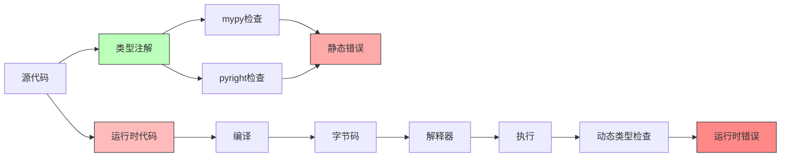
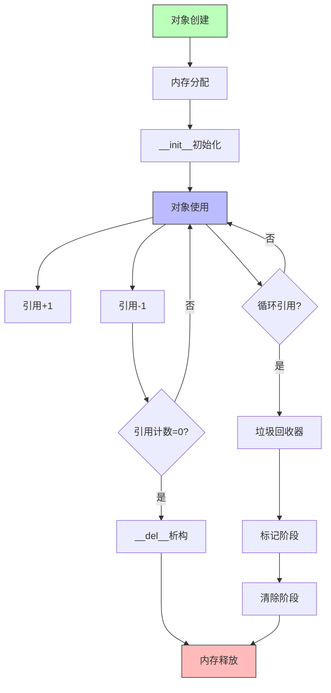
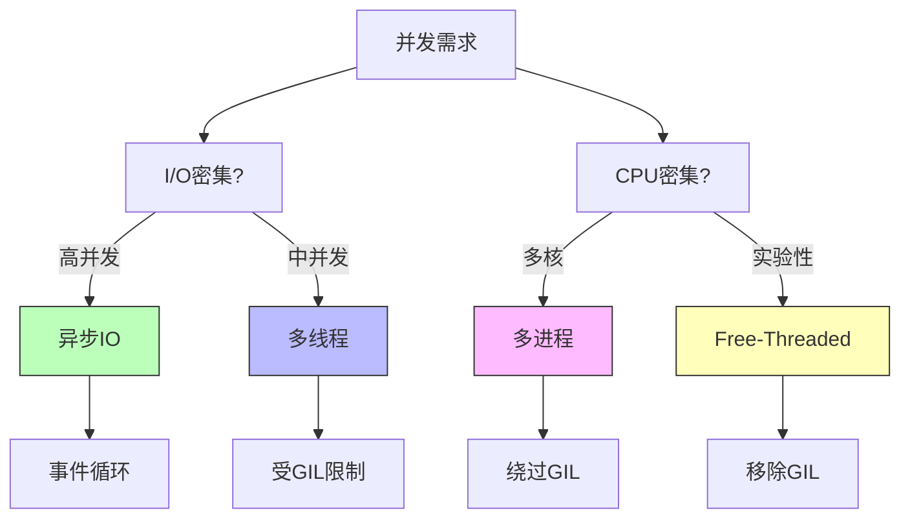
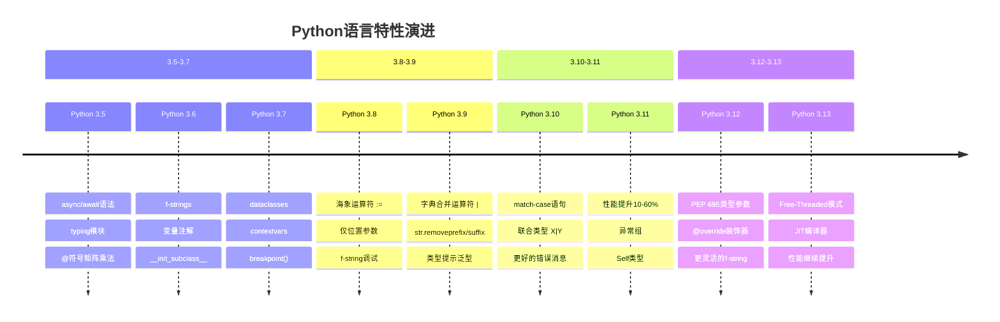

# Python 语言知识图谱 2025

**Python 3.12/3.13 核心概念全景图**

---

## 📊 知识图谱总览

```mermaid
graph TB
    Python[Python语言核心]
    
    %% 第一层：核心组件
    Python --> Syntax[语法系统]
    Python --> Type[类型系统]
    Python --> Runtime[运行时系统]
    Python --> Memory[内存模型]
    Python --> Concurrency[并发模型]
    
    %% 语法系统分支
    Syntax --> Lexical[词法分析]
    Syntax --> Grammar[语法结构]
    Syntax --> Semantics[语义模型]
    
    Lexical --> Tokens[Token类型]
    Lexical --> Keywords[关键字]
    Lexical --> Literals[字面量]
    
    Grammar --> Expressions[表达式]
    Grammar --> Statements[语句]
    Grammar --> Functions[函数定义]
    Grammar --> Classes[类定义]
    
    Semantics --> Operational[操作语义]
    Semantics --> Denotational[指称语义]
    Semantics --> Axiomatic[公理语义]
    
    %% 类型系统分支
    Type --> Dynamic[动态类型]
    Type --> Static[静态类型注解]
    Type --> Generics[泛型系统]
    Type --> Protocols[协议Protocol]
    
    Dynamic --> Duck[鸭子类型]
    Dynamic --> Reflection[反射机制]
    
    Static --> Hints[类型提示]
    Static --> Checker[类型检查器]
    
    Hints --> Basic[基础类型]
    Hints --> Union[联合类型]
    Hints --> Optional[可选类型]
    
    Checker --> Mypy[mypy]
    Checker --> Pyright[pyright]
    
    Generics --> TypeVar[类型变量]
    Generics --> Generic[泛型类]
    Generics --> PEP695[PEP 695新语法]
    
    %% 运行时系统分支
    Runtime --> Interpreter[解释器]
    Runtime --> Execution[执行模型]
    Runtime --> Objects[对象模型]
    
    Interpreter --> CPython[CPython]
    Interpreter --> PyPy[PyPy]
    Interpreter --> Jython[Jython]
    
    Execution --> Bytecode[字节码]
    Execution --> PVM[Python虚拟机]
    Execution --> JIT[JIT编译器]
    
    Objects --> DataModel[数据模型]
    Objects --> MagicMethods[特殊方法]
    Objects --> Descriptors[描述符]
    
    %% 内存模型分支
    Memory --> RefCount[引用计数]
    Memory --> GC[垃圾回收]
    Memory --> MemPool[对象池]
    
    GC --> Generational[分代回收]
    GC --> CycleDetect[循环检测]
    
    %% 并发模型分支
    Concurrency --> Threading[多线程]
    Concurrency --> Asyncio[异步IO]
    Concurrency --> Multiprocessing[多进程]
    
    Threading --> GIL[全局解释器锁]
    Threading --> FreeThreaded[Free-Threaded模式]
    
    Asyncio --> EventLoop[事件循环]
    Asyncio --> Coroutine[协程]
    Asyncio --> AsyncAwait[async/await]
    
    style Python fill:#f9f,stroke:#333,stroke-width:4px
    style Syntax fill:#bbf,stroke:#333,stroke-width:2px
    style Type fill:#bfb,stroke:#333,stroke-width:2px
    style Runtime fill:#fbb,stroke:#333,stroke-width:2px
    style Memory fill:#fbf,stroke:#333,stroke-width:2px
    style Concurrency fill:#ffb,stroke:#333,stroke-width:2px
```



---

## 🌳 核心概念树状图

### 1. 语法语义层次

```
Python语法系统
├── 词法层 (Lexical Layer)
│   ├── Token类型
│   │   ├── 关键字 (Keywords): if, for, class, def...
│   │   ├── 标识符 (Identifiers): 变量名、函数名
│   │   ├── 运算符 (Operators): +, -, *, /, ==, is...
│   │   ├── 分隔符 (Delimiters): (), [], {}, :, ;
│   │   └── 字面量 (Literals): 数字、字符串、布尔值
│   └── 编码规则
│       ├── UTF-8编码
│       ├── Unicode标识符
│       └── 字符串编码前缀 (b, r, f, u)
│
├── 语法层 (Syntactic Layer)
│   ├── 表达式 (Expressions)
│   │   ├── 原子表达式: 字面量、标识符、括号
│   │   ├── 算术表达式: +, -, *, /, //, %, **
│   │   ├── 比较表达式: ==, !=, <, >, <=, >=, is, in
│   │   ├── 逻辑表达式: and, or, not
│   │   ├── 条件表达式: x if cond else y
│   │   ├── Lambda表达式: lambda x: x + 1
│   │   └── 赋值表达式: (x := value)  # Python 3.8+
│   │
│   ├── 语句 (Statements)
│   │   ├── 简单语句
│   │   │   ├── 赋值语句: x = 1, x += 1
│   │   │   ├── 表达式语句: print("hello")
│   │   │   ├── pass语句
│   │   │   ├── del语句
│   │   │   ├── return语句
│   │   │   ├── yield语句
│   │   │   ├── raise语句
│   │   │   ├── break/continue语句
│   │   │   ├── import语句
│   │   │   ├── global/nonlocal语句
│   │   │   └── assert语句
│   │   │
│   │   └── 复合语句
│   │       ├── if-elif-else
│   │       ├── while循环
│   │       ├── for循环
│   │       ├── try-except-finally
│   │       ├── with语句
│   │       ├── match-case  # Python 3.10+
│   │       ├── 函数定义 (def/async def)
│   │       └── 类定义 (class)
│   │
│   └── 语法结构
│       ├── 缩进 (Indentation): 4空格标准
│       ├── 作用域 (Scope): LEGB规则
│       └── 命名空间 (Namespace): 局部、闭包、全局、内置
│
└── 语义层 (Semantic Layer)
    ├── 操作语义 (Operational Semantics)
    │   ├── 表达式求值顺序
    │   ├── 短路求值: and, or
    │   ├── 运算符优先级
    │   └── 副作用管理
    │
    ├── 指称语义 (Denotational Semantics)
    │   ├── 名称绑定
    │   ├── 值的不可变性
    │   ├── 引用语义 vs 值语义
    │   └── 作用域规则
    │
    └── 类型语义 (Type Semantics)
        ├── 动态类型检查
        ├── 静态类型提示
        ├── 鸭子类型 (Duck Typing)
        └── 结构化子类型 (Structural Subtyping)
```

### 2. 类型系统层次

```
Python类型系统
├── 动态类型系统 (Runtime)
│   ├── 类型推断
│   ├── 运行时类型检查
│   ├── 鸭子类型
│   └── 多态性
│       ├── 参数多态 (泛型)
│       ├── 子类型多态 (继承)
│       ├── 特设多态 (重载)
│       └── 强制多态 (类型转换)
│
├── 静态类型注解 (Type Hints)
│   ├── PEP 484: 类型注解基础
│   ├── PEP 526: 变量注解
│   ├── PEP 544: 协议 (Protocol)
│   ├── PEP 585: 标准集合泛型
│   ├── PEP 604: 联合类型 (X | Y)
│   ├── PEP 612: ParamSpec
│   ├── PEP 613: TypeAlias
│   ├── PEP 647: TypeGuard
│   ├── PEP 673: Self类型
│   ├── PEP 695: 类型参数语法  # Python 3.12
│   └── PEP 698: @override装饰器  # Python 3.12
│
├── 基础类型
│   ├── 简单类型
│   │   ├── int (整数)
│   │   ├── float (浮点数)
│   │   ├── bool (布尔)
│   │   ├── str (字符串)
│   │   ├── bytes (字节串)
│   │   └── None (空值)
│   │
│   ├── 集合类型
│   │   ├── list[T] (列表)
│   │   ├── tuple[T, ...] (元组)
│   │   ├── dict[K, V] (字典)
│   │   ├── set[T] (集合)
│   │   └── frozenset[T] (不可变集合)
│   │
│   └── 特殊类型
│       ├── Any (任意类型)
│       ├── Never/NoReturn (不返回)
│       ├── Union[X, Y] / X | Y (联合)
│       ├── Optional[X] / X | None (可选)
│       ├── Literal[value] (字面量)
│       └── Final[T] (最终类型)
│
├── 泛型系统
│   ├── 类型变量 (TypeVar)
│   │   ├── 无约束: T = TypeVar("T")
│   │   ├── 有界约束: T = TypeVar("T", bound=Base)
│   │   └── 值约束: T = TypeVar("T", int, str)
│   │
│   ├── 泛型类 (Generic)
│   │   ├── 旧语法: class Stack(Generic[T])
│   │   └── 新语法: class Stack[T]  # Python 3.12+
│   │
│   ├── 泛型函数
│   │   ├── 旧语法: T = TypeVar("T"); def func(x: T) -> T
│   │   └── 新语法: def func[T](x: T) -> T  # Python 3.12+
│   │
│   └── 泛型类型别名
│       ├── 旧语法: Matrix = list[list[float]]
│       └── 新语法: type Matrix[T] = list[list[T]]  # Python 3.12+
│
├── 协议与结构化子类型
│   ├── Protocol定义
│   ├── 结构化子类型检查
│   ├── runtime_checkable装饰器
│   └── 内置协议
│       ├── Iterable, Iterator
│       ├── Sequence, MutableSequence
│       ├── Mapping, MutableMapping
│       ├── Callable
│       └── ContextManager
│
└── 类型检查工具
    ├── mypy
    │   ├── 严格模式
    │   ├── 渐进式类型检查
    │   └── 类型推导
    │
    ├── pyright / pylance
    │   ├── 快速检查
    │   ├── IDE集成
    │   └── VS Code默认
    │
    ├── pyre
    │   ├── Facebook开发
    │   └── 增量检查
    │
    └── pytype
        ├── Google开发
        └── 类型推导强
```

### 3. 运行时系统层次

```
Python运行时系统
├── 解释器架构
│   ├── CPython (C实现，官方)
│   │   ├── 字节码解释器
│   │   ├── GIL机制
│   │   └── C扩展API
│   │
│   ├── PyPy (RPython实现)
│   │   ├── JIT编译
│   │   ├── 性能优化
│   │   └── 兼容性高
│   │
│   ├── Jython (Java实现)
│   ├── IronPython (.NET实现)
│   └── MicroPython (嵌入式)
│
├── 执行模型
│   ├── 编译阶段
│   │   ├── 词法分析 (Lexing)
│   │   ├── 语法分析 (Parsing)
│   │   ├── AST生成
│   │   ├── 字节码编译
│   │   └── .pyc文件生成
│   │
│   ├── 执行阶段
│   │   ├── 字节码加载
│   │   ├── 栈式虚拟机
│   │   ├── 指令执行
│   │   └── 结果返回
│   │
│   └── 优化技术
│       ├── 常量折叠
│       ├── 窥孔优化
│       ├── JIT编译  # Python 3.13+
│       └── 内联缓存
│
├── 对象模型
│   ├── 一切皆对象
│   │   ├── 对象三要素: id, type, value
│   │   ├── 不可变对象: int, str, tuple
│   │   └── 可变对象: list, dict, set
│   │
│   ├── 类型系统
│   │   ├── type元类
│   │   ├── object基类
│   │   ├── 类型层次
│   │   └── MRO (方法解析顺序)
│   │
│   ├── 特殊方法协议
│   │   ├── 构造: __init__, __new__
│   │   ├── 表示: __repr__, __str__
│   │   ├── 运算: __add__, __mul__, __eq__
│   │   ├── 容器: __len__, __getitem__, __iter__
│   │   ├── 上下文: __enter__, __exit__
│   │   ├── 调用: __call__
│   │   └── 属性: __get__, __set__, __delete__
│   │
│   └── 元编程
│       ├── 元类 (Metaclass)
│       ├── 描述符 (Descriptor)
│       ├── 装饰器 (Decorator)
│       ├── 属性 (property)
│       └── 动态属性 (__getattr__, __setattr__)
│
└── 命名空间与作用域
    ├── LEGB规则
    │   ├── L: Local (局部)
    │   ├── E: Enclosing (闭包)
    │   ├── G: Global (全局)
    │   └── B: Built-in (内置)
    │
    ├── 命名空间类型
    │   ├── 内置命名空间
    │   ├── 全局命名空间
    │   ├── 局部命名空间
    │   └── 对象命名空间 (__dict__)
    │
    └── 作用域控制
        ├── global声明
        ├── nonlocal声明
        └── 闭包捕获
```

### 4. 内存管理层次

```
Python内存管理
├── 内存分配器层次
│   ├── 操作系统层 (OS Allocator)
│   ├── Python内存管理器 (PyMem_*)
│   ├── 对象分配器 (PyObject_*)
│   └── 对象特定池 (Block, Arena, Pool)
│
├── 引用计数
│   ├── 引用计数机制
│   │   ├── Py_INCREF (增加引用)
│   │   ├── Py_DECREF (减少引用)
│   │   └── 引用归零时释放
│   │
│   ├── 优点
│   │   ├── 实时性: 即时回收
│   │   ├── 简单性: 易于实现
│   │   └── 确定性: 可预测
│   │
│   └── 缺点
│       ├── 循环引用问题
│       ├── 性能开销
│       └── 线程同步开销
│
├── 垃圾回收 (GC)
│   ├── 分代回收
│   │   ├── 第0代: 新对象
│   │   ├── 第1代: 存活1次GC
│   │   └── 第2代: 存活2次GC
│   │
│   ├── 循环检测
│   │   ├── 标记清除算法
│   │   ├── 可达性分析
│   │   └── 循环引用打破
│   │
│   └── GC控制
│       ├── gc.collect(): 手动回收
│       ├── gc.disable(): 禁用GC
│       ├── gc.enable(): 启用GC
│       └── gc.set_threshold(): 设置阈值
│
├── 对象池技术
│   ├── 小整数池 (-5 to 256)
│   ├── 字符串内部化 (String Interning)
│   ├── 空元组缓存
│   └── 列表/字典预分配
│
└── 内存优化技术
    ├── __slots__: 减少实例字典
    ├── 生成器: 惰性求值
    ├── 迭代器: 避免列表构建
    ├── memoryview: 零拷贝
    └── 弱引用: weakref模块
```

### 5. 并发模型层次

```
Python并发模型
├── 多线程 (Threading)
│   ├── GIL (全局解释器锁)
│   │   ├── 作用: 保护解释器状态
│   │   ├── 限制: 单线程执行Python字节码
│   │   └── 影响: CPU密集任务无并行
│   │
│   ├── Free-Threaded模式  # Python 3.13+
│   │   ├── 移除GIL
│   │   ├── 真正多核并行
│   │   ├── 性能提升: 2-4x
│   │   └── 实验性特性
│   │
│   ├── threading模块
│   │   ├── Thread类
│   │   ├── Lock, RLock
│   │   ├── Semaphore, BoundedSemaphore
│   │   ├── Event, Condition
│   │   ├── Timer
│   │   └── Barrier
│   │
│   └── 适用场景
│       ├── I/O密集型任务
│       ├── 网络请求
│       └── 文件操作
│
├── 多进程 (Multiprocessing)
│   ├── multiprocessing模块
│   │   ├── Process类
│   │   ├── Pool: 进程池
│   │   ├── Queue: 进程间通信
│   │   ├── Pipe: 管道
│   │   ├── Manager: 共享状态
│   │   └── Value, Array: 共享内存
│   │
│   ├── 优点
│   │   ├── 绕过GIL限制
│   │   ├── 真正并行
│   │   └── 多核利用
│   │
│   ├── 缺点
│   │   ├── 进程开销大
│   │   ├── 通信复杂
│   │   └── 内存占用高
│   │
│   └── 适用场景
│       ├── CPU密集型任务
│       ├── 计算密集
│       └── 数据处理
│
├── 异步IO (Asyncio)
│   ├── 核心概念
│   │   ├── Event Loop (事件循环)
│   │   ├── Coroutine (协程)
│   │   ├── Task (任务)
│   │   ├── Future (未来对象)
│   │   └── async/await语法
│   │
│   ├── asyncio模块
│   │   ├── asyncio.run(): 运行协程
│   │   ├── asyncio.create_task(): 创建任务
│   │   ├── asyncio.gather(): 并发执行
│   │   ├── asyncio.wait(): 等待完成
│   │   ├── asyncio.sleep(): 异步睡眠
│   │   └── asyncio.Queue: 异步队列
│   │
│   ├── 异步库生态
│   │   ├── aiohttp: 异步HTTP
│   │   ├── aiofiles: 异步文件IO
│   │   ├── asyncpg: 异步PostgreSQL
│   │   ├── motor: 异步MongoDB
│   │   └── aiokafka: 异步Kafka
│   │
│   ├── 优点
│   │   ├── 高并发
│   │   ├── 低开销
│   │   ├── 单线程
│   │   └── 易于推理
│   │
│   └── 适用场景
│       ├── 高并发I/O
│       ├── 网络服务
│       ├── WebSocket
│       └── 实时应用
│
└── 并发工具库
    ├── concurrent.futures
    │   ├── ThreadPoolExecutor
    │   ├── ProcessPoolExecutor
    │   └── Future对象
    │
    ├── asyncio高级特性
    │   ├── 信号量 (Semaphore)
    │   ├── 锁 (Lock)
    │   ├── 事件 (Event)
    │   └── 条件变量 (Condition)
    │
    └── 第三方库
        ├── gevent: 协程库
        ├── Trio: 异步IO框架
        ├── Curio: 异步IO库
        └── uvloop: 高性能事件循环
```

---

## 🔗 概念关系图

### 类型系统与运行时关系



### 对象生命周期



### 并发模型对比



---

## 📖 Python版本演进图



---

## 🎯 核心特性矩阵

| 特性维度 | Python实现 | 关键概念 | 版本要求 |
|---------|-----------|---------|---------|
| **类型系统** | 渐进式类型 | 动态+静态注解 | 3.5+ |
| **泛型** | 类型参数 | TypeVar, Generic | 3.5+, 3.12新语法 |
| **并发** | GIL/异步IO | threading, asyncio | 3.4+异步 |
| **并行** | 多进程/Free-Threaded | multiprocessing | 3.13+无GIL |
| **内存管理** | 引用计数+GC | 自动管理 | 全版本 |
| **元编程** | 元类/描述符 | type, __new__ | 全版本 |
| **函数式** | 一等函数 | lambda, 高阶函数 | 全版本 |
| **面向对象** | 基于类 | 继承, 多态 | 全版本 |
| **性能优化** | JIT编译 | 字节码+JIT | 3.13+ |
| **包管理** | uv/pip | pyproject.toml | uv最新 |

---

## 📚 延伸阅读

- [Python语言参考](https://docs.python.org/3/reference/)
- [Python数据模型](https://docs.python.org/3/reference/datamodel.html)
- [PEP索引](https://peps.python.org/)
- [CPython源码](https://github.com/python/cpython)

---

**理解知识图谱，构建系统认知！** 🎓✨

