# Python 语言思维导图 2025

**可视化知识体系**

---

## 🧠 核心思维导图

### 总体架构思维导图

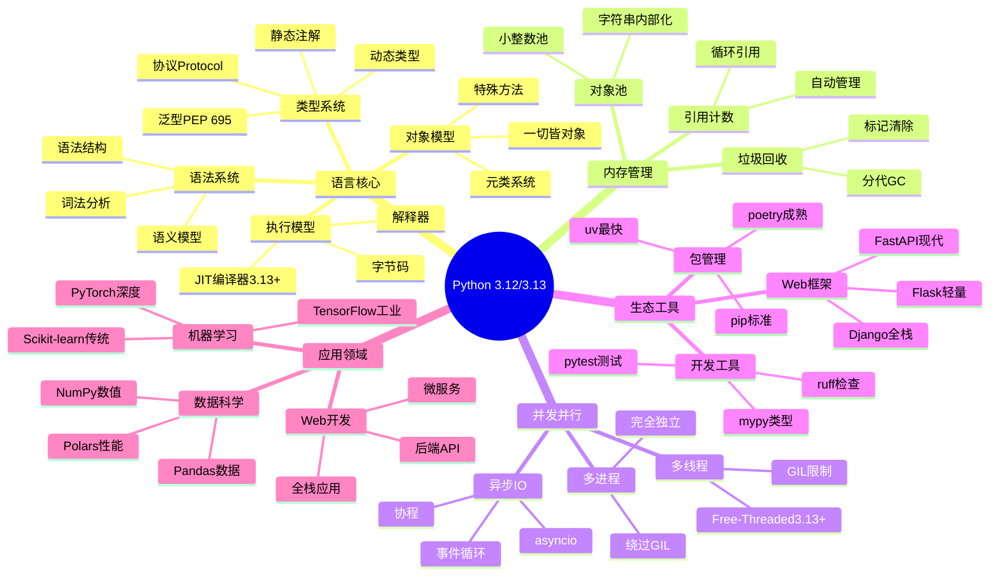

---

## 📚 语法语义思维导图

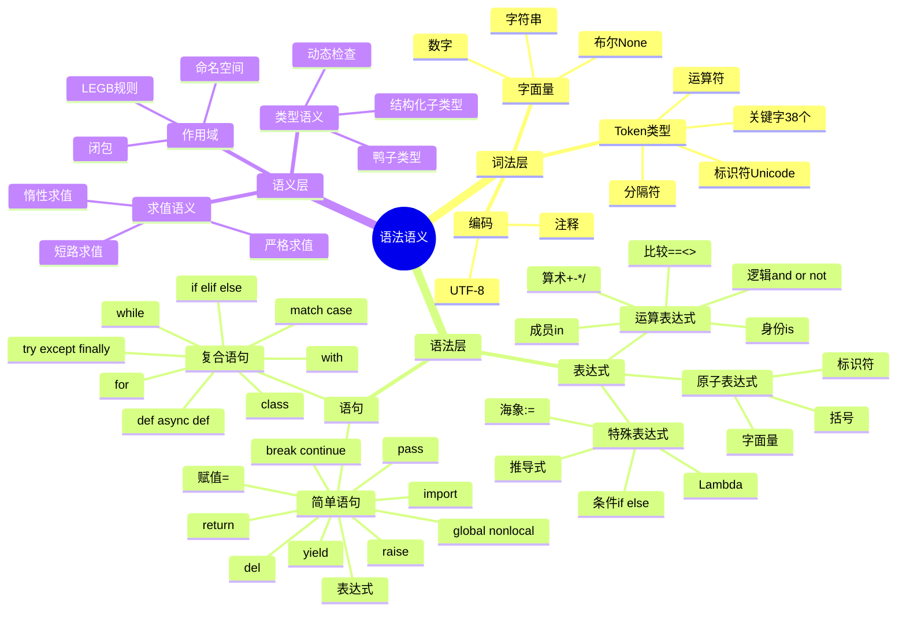

---

## 🔤 类型系统思维导图

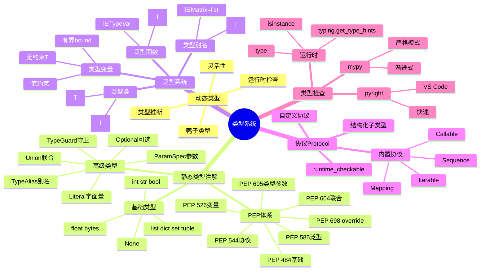

---

## ⚙️ 运行时系统思维导图

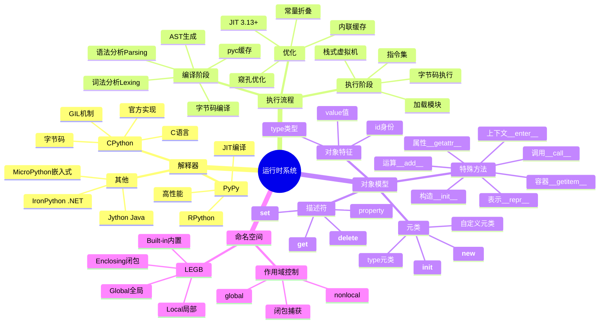

---

## 💾 内存管理思维导图

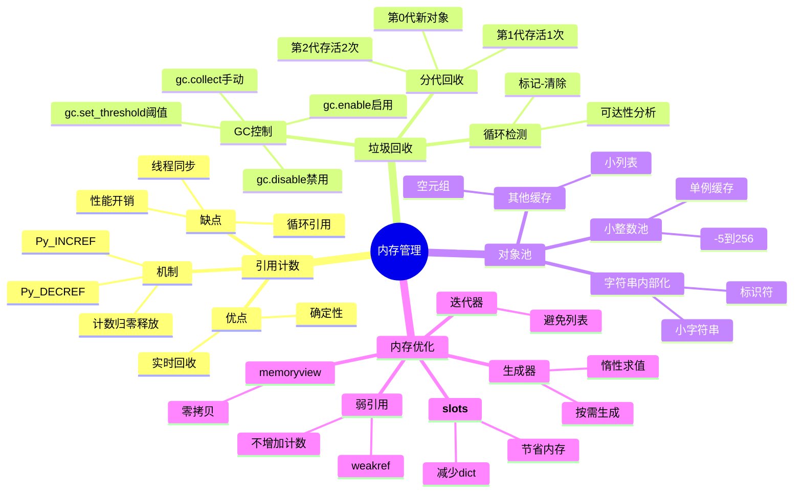

---

## 🔀 并发并行思维导图

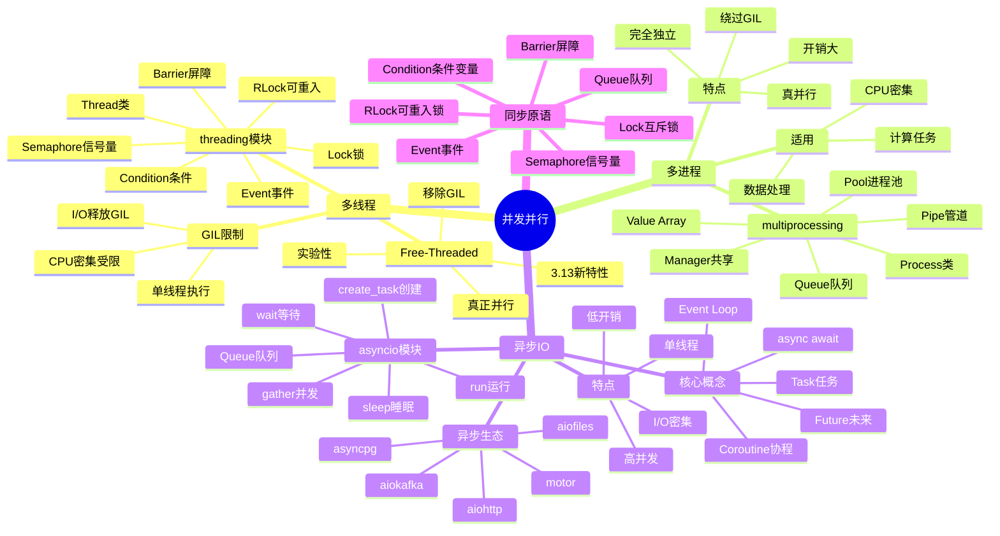

---

## 🛠️ 开发工具思维导图

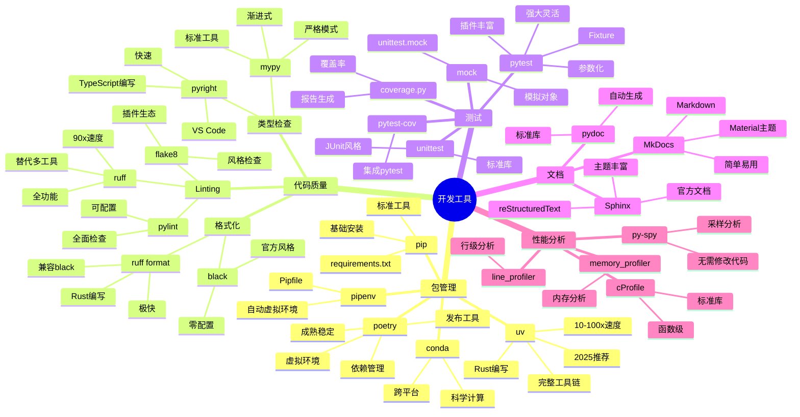

---

## 🌐 应用领域思维导图

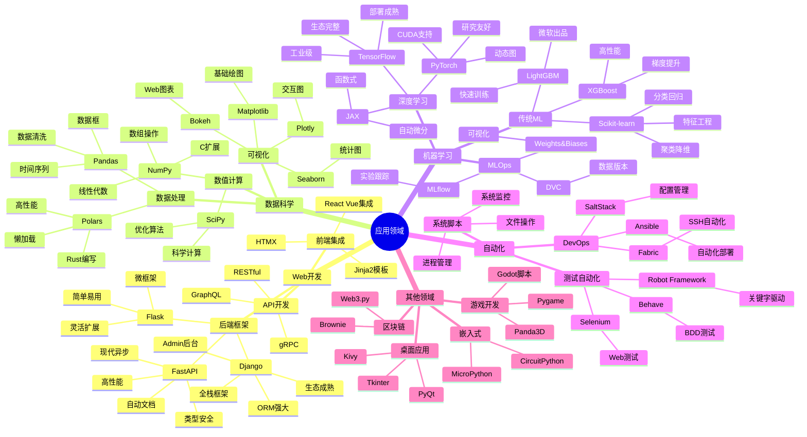

---

## 📈 学习路径思维导图

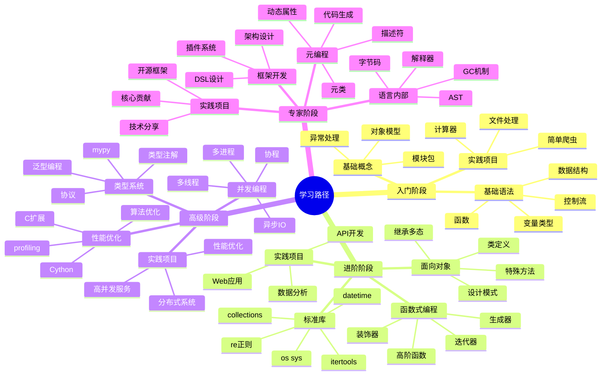

---

## 🎯 最佳实践思维导图

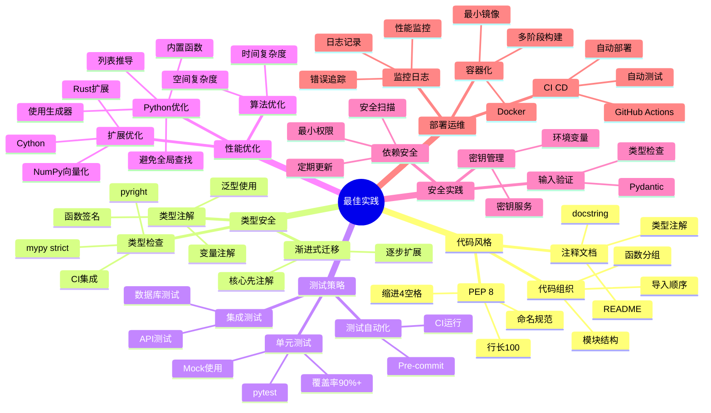

---

## 🔄 Python版本演进思维导图

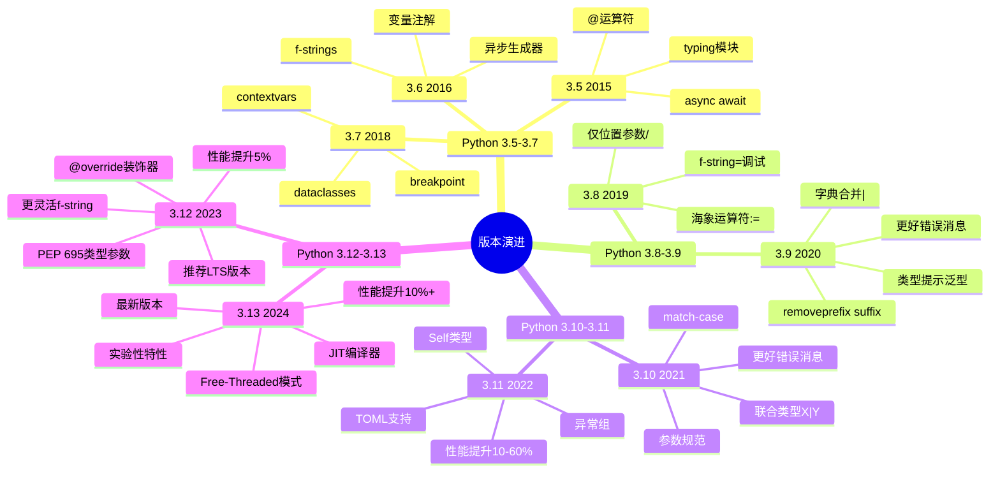

---

## 📚 知识体系总结

### 核心维度

1. **语法语义**: 词法→语法→语义三层结构
2. **类型系统**: 动态+静态渐进式类型
3. **运行时**: 解释器→字节码→执行
4. **内存管理**: 引用计数+GC
5. **并发模型**: 线程+进程+异步IO
6. **生态工具**: 包管理+开发工具
7. **应用领域**: Web+数据+ML+自动化

### 学习建议

1. **基础优先**: 掌握语法和对象模型
2. **实践驱动**: 通过项目学习
3. **类型安全**: 养成类型注解习惯
4. **工具链**: 使用现代工具(uv, ruff, mypy)
5. **持续学习**: 关注新版本特性

---

**系统化思维,构建完整认知!** 🧠✨

