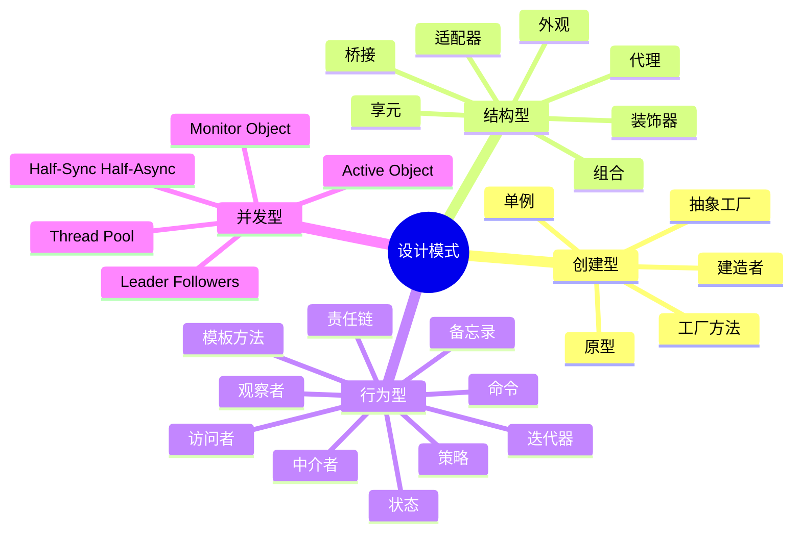

# Python 现代设计模式 2025

**结合Python 3.12/3.13特性的设计模式实现**

---

## 📊 设计模式体系



---

## 1️⃣ 创建型模式 - 现代实现

### 1.1 工厂方法 (Factory Method) - 使用Protocol

```python
"""
工厂方法模式 - 使用Protocol和泛型
"""
from typing import Protocol, TypeVar
from abc import ABC, abstractmethod

# 产品接口
class DatabaseConnection(Protocol):
    """数据库连接协议"""
    
    def connect(self) -> None: ...
    def execute(self, query: str) -> list: ...
    def close(self) -> None: ...

# 具体产品
class PostgreSQLConnection:
    """PostgreSQL连接"""
    
    def connect(self) -> None:
        print("Connecting to PostgreSQL...")
    
    def execute(self, query: str) -> list:
        print(f"Executing PostgreSQL query: {query}")
        return []
    
    def close(self) -> None:
        print("Closing PostgreSQL connection")

class MySQLConnection:
    """MySQL连接"""
    
    def connect(self) -> None:
        print("Connecting to MySQL...")
    
    def execute(self, query: str) -> list:
        print(f"Executing MySQL query: {query}")
        return []
    
    def close(self) -> None:
        print("Closing MySQL connection")

# 工厂 - 使用Python 3.12+泛型语法
T = TypeVar("T", bound=DatabaseConnection)

class DatabaseFactory[T](ABC):
    """数据库工厂基类"""
    
    @abstractmethod
    def create_connection(self) -> T:
        """创建数据库连接"""
        ...
    
    def execute_query(self, query: str) -> list:
        """模板方法"""
        conn = self.create_connection()
        conn.connect()
        try:
            return conn.execute(query)
        finally:
            conn.close()

class PostgreSQLFactory(DatabaseFactory[PostgreSQLConnection]):
    """PostgreSQL工厂"""
    
    def create_connection(self) -> PostgreSQLConnection:
        return PostgreSQLConnection()

class MySQLFactory(DatabaseFactory[MySQLConnection]):
    """MySQL工厂"""
    
    def create_connection(self) -> MySQLConnection:
        return MySQLConnection()

# 使用
def client_code(factory: DatabaseFactory) -> None:
    """客户端代码"""
    results = factory.execute_query("SELECT * FROM users")
    print(f"Results: {results}")

# 测试
pg_factory = PostgreSQLFactory()
mysql_factory = MySQLFactory()

client_code(pg_factory)
client_code(mysql_factory)
```

### 1.2 建造者 (Builder) - 使用流式接口和类型安全

```python
"""
建造者模式 - 使用流式接口和类型提示
"""
from dataclasses import dataclass, field
from typing import Self  # Python 3.11+

@dataclass
class Pizza:
    """披萨产品"""
    size: str
    cheese: bool = False
    pepperoni: bool = False
    mushrooms: bool = False
    olives: bool = False
    
    def __str__(self) -> str:
        toppings = []
        if self.cheese:
            toppings.append("cheese")
        if self.pepperoni:
            toppings.append("pepperoni")
        if self.mushrooms:
            toppings.append("mushrooms")
        if self.olives:
            toppings.append("olives")
        
        return f"{self.size} pizza with {', '.join(toppings) if toppings else 'no toppings'}"

class PizzaBuilder:
    """披萨建造者 - 使用Self类型"""
    
    def __init__(self):
        self._size: str = "medium"
        self._cheese: bool = False
        self._pepperoni: bool = False
        self._mushrooms: bool = False
        self._olives: bool = False
    
    def size(self, size: str) -> Self:
        """设置尺寸"""
        self._size = size
        return self
    
    def cheese(self) -> Self:
        """添加奶酪"""
        self._cheese = True
        return self
    
    def pepperoni(self) -> Self:
        """添加意大利辣香肠"""
        self._pepperoni = True
        return self
    
    def mushrooms(self) -> Self:
        """添加蘑菇"""
        self._mushrooms = True
        return self
    
    def olives(self) -> Self:
        """添加橄榄"""
        self._olives = True
        return self
    
    def build(self) -> Pizza:
        """构建披萨"""
        return Pizza(
            size=self._size,
            cheese=self._cheese,
            pepperoni=self._pepperoni,
            mushrooms=self._mushrooms,
            olives=self._olives
        )

# 使用流式接口
pizza = (PizzaBuilder()
    .size("large")
    .cheese()
    .pepperoni()
    .mushrooms()
    .build())

print(pizza)  # large pizza with cheese, pepperoni, mushrooms
```

### 1.3 单例 (Singleton) - 使用元类和线程安全

```python
"""
单例模式 - 多种实现方式
"""
from threading import Lock
from typing import TypeVar, Generic

# 方式1: 元类实现(线程安全)
class SingletonMeta(type):
    """单例元类"""
    
    _instances: dict[type, object] = {}
    _lock: Lock = Lock()
    
    def __call__(cls, *args, **kwargs):
        if cls not in cls._instances:
            with cls._lock:
                if cls not in cls._instances:
                    instance = super().__call__(*args, **kwargs)
                    cls._instances[cls] = instance
        return cls._instances[cls]

class DatabaseConnection(metaclass=SingletonMeta):
    """数据库连接单例"""
    
    def __init__(self):
        print("Initializing database connection...")
        self.connected = False
    
    def connect(self) -> None:
        if not self.connected:
            print("Connecting to database...")
            self.connected = True

# 方式2: 装饰器实现
def singleton[T](cls: type[T]) -> type[T]:
    """单例装饰器"""
    instances: dict[type, object] = {}
    lock = Lock()
    
    def get_instance(*args, **kwargs) -> T:
        if cls not in instances:
            with lock:
                if cls not in instances:
                    instances[cls] = cls(*args, **kwargs)
        return instances[cls]
    
    return get_instance  # type: ignore

@singleton
class ConfigManager:
    """配置管理器单例"""
    
    def __init__(self):
        print("Loading configuration...")
        self.config: dict[str, str] = {}
    
    def get(self, key: str) -> str | None:
        return self.config.get(key)
    
    def set(self, key: str, value: str) -> None:
        self.config[key] = value

# 方式3: 模块级单例(最Pythonic)
class _Logger:
    """日志器实现"""
    
    def __init__(self):
        self.logs: list[str] = []
    
    def log(self, message: str) -> None:
        self.logs.append(message)
        print(f"LOG: {message}")

# 创建全局实例
logger = _Logger()

# 测试
db1 = DatabaseConnection()
db2 = DatabaseConnection()
print(db1 is db2)  # True

config1 = ConfigManager()
config2 = ConfigManager()
print(config1 is config2)  # True

logger.log("Application started")
```

---

## 2️⃣ 结构型模式 - 现代实现

### 2.1 装饰器 (Decorator) - 使用Python装饰器和ParamSpec

```python
"""
装饰器模式 - 使用ParamSpec保持类型安全
"""
from typing import Callable, ParamSpec, TypeVar, Protocol
from functools import wraps
import time

P = ParamSpec("P")
R = TypeVar("R")

# 函数装饰器
def timer[**P, R](func: Callable[P, R]) -> Callable[P, R]:
    """计时装饰器"""
    
    @wraps(func)
    def wrapper(*args: P.args, **kwargs: P.kwargs) -> R:
        start = time.time()
        result = func(*args, **kwargs)
        end = time.time()
        print(f"{func.__name__} took {end - start:.4f}s")
        return result
    
    return wrapper

def cache[**P, R](func: Callable[P, R]) -> Callable[P, R]:
    """缓存装饰器"""
    _cache: dict = {}
    
    @wraps(func)
    def wrapper(*args: P.args, **kwargs: P.kwargs) -> R:
        # 创建缓存键
        key = str(args) + str(kwargs)
        
        if key not in _cache:
            _cache[key] = func(*args, **kwargs)
        else:
            print(f"Cache hit for {func.__name__}")
        
        return _cache[key]
    
    return wrapper

def retry[**P, R](
    max_attempts: int = 3,
    delay: float = 1.0
) -> Callable[[Callable[P, R]], Callable[P, R]]:
    """重试装饰器"""
    
    def decorator(func: Callable[P, R]) -> Callable[P, R]:
        @wraps(func)
        def wrapper(*args: P.args, **kwargs: P.kwargs) -> R:
            for attempt in range(max_attempts):
                try:
                    return func(*args, **kwargs)
                except Exception as e:
                    if attempt == max_attempts - 1:
                        raise
                    print(f"Attempt {attempt + 1} failed: {e}. Retrying...")
                    time.sleep(delay)
            raise RuntimeError("Should not reach here")
        
        return wrapper
    
    return decorator

# 使用多个装饰器
@timer
@cache
def fibonacci(n: int) -> int:
    """斐波那契数列"""
    if n < 2:
        return n
    return fibonacci(n - 1) + fibonacci(n - 2)

@retry(max_attempts=3, delay=0.5)
def fetch_data(url: str) -> dict:
    """获取数据"""
    import random
    if random.random() < 0.7:  # 70%失败率
        raise ValueError("Network error")
    return {"data": "success"}

# 组件装饰器(结构型)
class Component(Protocol):
    """组件协议"""
    def operation(self) -> str: ...

class ConcreteComponent:
    """具体组件"""
    def operation(self) -> str:
        return "ConcreteComponent"

class Decorator:
    """装饰器基类"""
    
    def __init__(self, component: Component):
        self._component = component
    
    def operation(self) -> str:
        return self._component.operation()

class LoggingDecorator(Decorator):
    """日志装饰器"""
    
    def operation(self) -> str:
        result = super().operation()
        print(f"Logging: {result}")
        return result

class ValidationDecorator(Decorator):
    """验证装饰器"""
    
    def operation(self) -> str:
        print("Validating...")
        result = super().operation()
        print("Validation passed")
        return result

# 使用
component = ConcreteComponent()
decorated = LoggingDecorator(ValidationDecorator(component))
decorated.operation()
```

### 2.2 适配器 (Adapter) - 使用Protocol

```python
"""
适配器模式 - 使用Protocol和结构化子类型
"""
from typing import Protocol

# 目标接口
class MediaPlayer(Protocol):
    """媒体播放器接口"""
    def play(self, filename: str) -> None: ...
    def stop(self) -> None: ...

# 新的接口标准
class ModernPlayer:
    """现代播放器"""
    def play_audio(self, filename: str) -> None:
        print(f"Playing {filename}")
    
    def pause_audio(self) -> None:
        print("Audio paused")

# 旧的接口
class LegacyPlayer:
    """旧版播放器"""
    def start(self, file: str) -> None:
        print(f"Starting {file}")
    
    def halt(self) -> None:
        print("Halted")

# 适配器1: 适配现代播放器
class ModernPlayerAdapter:
    """现代播放器适配器"""
    
    def __init__(self, player: ModernPlayer):
        self.player = player
    
    def play(self, filename: str) -> None:
        self.player.play_audio(filename)
    
    def stop(self) -> None:
        self.player.pause_audio()

# 适配器2: 适配旧版播放器
class LegacyPlayerAdapter:
    """旧版播放器适配器"""
    
    def __init__(self, player: LegacyPlayer):
        self.player = player
    
    def play(self, filename: str) -> None:
        self.player.start(filename)
    
    def stop(self) -> None:
        self.player.halt()

# 客户端代码
def client_code(player: MediaPlayer) -> None:
    """使用统一接口"""
    player.play("song.mp3")
    player.stop()

# 测试
modern = ModernPlayerAdapter(ModernPlayer())
legacy = LegacyPlayerAdapter(LegacyPlayer())

client_code(modern)
client_code(legacy)
```

### 2.3 代理 (Proxy) - 虚拟代理和保护代理

```python
"""
代理模式 - 多种代理类型
"""
from typing import Protocol
from functools import wraps

# 主题接口
class Image(Protocol):
    """图像接口"""
    def display(self) -> None: ...
    def get_size(self) -> tuple[int, int]: ...

# 真实主题
class RealImage:
    """真实图像"""
    
    def __init__(self, filename: str):
        self.filename = filename
        self._load_from_disk()
    
    def _load_from_disk(self) -> None:
        """从磁盘加载(耗时操作)"""
        print(f"Loading {self.filename} from disk...")
        import time
        time.sleep(1)  # 模拟加载时间
    
    def display(self) -> None:
        print(f"Displaying {self.filename}")
    
    def get_size(self) -> tuple[int, int]:
        return (1920, 1080)

# 虚拟代理(延迟加载)
class ImageProxy:
    """图像代理 - 延迟加载"""
    
    def __init__(self, filename: str):
        self.filename = filename
        self._real_image: RealImage | None = None
    
    def _get_real_image(self) -> RealImage:
        """获取真实对象"""
        if self._real_image is None:
            self._real_image = RealImage(self.filename)
        return self._real_image
    
    def display(self) -> None:
        self._get_real_image().display()
    
    def get_size(self) -> tuple[int, int]:
        # 可以不加载就返回尺寸
        return (1920, 1080)

# 保护代理(访问控制)
class ProtectedImage:
    """受保护的图像 - 访问控制"""
    
    def __init__(self, image: Image, user_role: str):
        self._image = image
        self._user_role = user_role
    
    def display(self) -> None:
        if self._user_role == "admin":
            self._image.display()
        else:
            print("Access denied: insufficient permissions")
    
    def get_size(self) -> tuple[int, int]:
        return self._image.get_size()

# 智能代理(缓存)
class CachedImage:
    """缓存图像代理"""
    
    def __init__(self, filename: str):
        self.filename = filename
        self._cache: dict[str, RealImage] = {}
    
    def display(self) -> None:
        if self.filename not in self._cache:
            self._cache[self.filename] = RealImage(self.filename)
        self._cache[self.filename].display()
    
    def get_size(self) -> tuple[int, int]:
        return (1920, 1080)

# 使用
print("=== 虚拟代理 ===")
proxy = ImageProxy("large_image.jpg")
print("Proxy created (image not loaded yet)")
print(f"Size: {proxy.get_size()}")  # 不加载
proxy.display()  # 现在才加载

print("\n=== 保护代理 ===")
image = RealImage("secret.jpg")
protected = ProtectedImage(image, "guest")
protected.display()  # 拒绝访问

admin_protected = ProtectedImage(image, "admin")
admin_protected.display()  # 允许访问
```

---

## 3️⃣ 行为型模式 - 现代实现

### 3.1 策略 (Strategy) - 使用Protocol和函数

```python
"""
策略模式 - 使用Protocol和函数式编程
"""
from typing import Protocol, Callable

# 方式1: 使用Protocol
class PaymentStrategy(Protocol):
    """支付策略协议"""
    def pay(self, amount: float) -> None: ...

class CreditCardStrategy:
    """信用卡支付"""
    
    def __init__(self, card_number: str):
        self.card_number = card_number
    
    def pay(self, amount: float) -> None:
        print(f"Paying ${amount} with credit card {self.card_number}")

class PayPalStrategy:
    """PayPal支付"""
    
    def __init__(self, email: str):
        self.email = email
    
    def pay(self, amount: float) -> None:
        print(f"Paying ${amount} via PayPal ({self.email})")

class CryptoStrategy:
    """加密货币支付"""
    
    def __init__(self, wallet_address: str):
        self.wallet_address = wallet_address
    
    def pay(self, amount: float) -> None:
        print(f"Paying ${amount} with crypto to {self.wallet_address}")

class ShoppingCart:
    """购物车"""
    
    def __init__(self):
        self.items: list[tuple[str, float]] = []
        self.payment_strategy: PaymentStrategy | None = None
    
    def add_item(self, name: str, price: float) -> None:
        self.items.append((name, price))
    
    def set_payment_strategy(self, strategy: PaymentStrategy) -> None:
        self.payment_strategy = strategy
    
    def checkout(self) -> None:
        total = sum(price for _, price in self.items)
        if self.payment_strategy:
            self.payment_strategy.pay(total)
        else:
            print("No payment method set")

# 方式2: 使用函数式方法
PaymentFunction = Callable[[float], None]

def credit_card_payment(card_number: str) -> PaymentFunction:
    """信用卡支付函数"""
    def pay(amount: float) -> None:
        print(f"Paying ${amount} with credit card {card_number}")
    return pay

def paypal_payment(email: str) -> PaymentFunction:
    """PayPal支付函数"""
    def pay(amount: float) -> None:
        print(f"Paying ${amount} via PayPal ({email})")
    return pay

class FunctionalCart:
    """函数式购物车"""
    
    def __init__(self):
        self.items: list[tuple[str, float]] = []
        self.payment_fn: PaymentFunction | None = None
    
    def add_item(self, name: str, price: float) -> None:
        self.items.append((name, price))
    
    def set_payment(self, payment_fn: PaymentFunction) -> None:
        self.payment_fn = payment_fn
    
    def checkout(self) -> None:
        total = sum(price for _, price in self.items)
        if self.payment_fn:
            self.payment_fn(total)

# 使用
cart = ShoppingCart()
cart.add_item("Book", 29.99)
cart.add_item("Pen", 4.99)

cart.set_payment_strategy(CreditCardStrategy("1234-5678"))
cart.checkout()

# 函数式方式
func_cart = FunctionalCart()
func_cart.add_item("Book", 29.99)
func_cart.set_payment(paypal_payment("user@example.com"))
func_cart.checkout()
```

### 3.2 观察者 (Observer) - 使用AsyncIO

```python
"""
观察者模式 - 异步实现
"""
from typing import Protocol, Callable, Awaitable
import asyncio

# 观察者协议
class Observer(Protocol):
    """观察者协议"""
    async def update(self, event: dict) -> None: ...

# 主题
class Subject:
    """主题(可观察对象)"""
    
    def __init__(self):
        self._observers: list[Observer] = []
    
    def attach(self, observer: Observer) -> None:
        """添加观察者"""
        if observer not in self._observers:
            self._observers.append(observer)
    
    def detach(self, observer: Observer) -> None:
        """移除观察者"""
        self._observers.remove(observer)
    
    async def notify(self, event: dict) -> None:
        """通知所有观察者"""
        tasks = [observer.update(event) for observer in self._observers]
        await asyncio.gather(*tasks)

# 具体主题
class StockPrice(Subject):
    """股票价格"""
    
    def __init__(self, symbol: str):
        super().__init__()
        self.symbol = symbol
        self._price: float = 0.0
    
    @property
    def price(self) -> float:
        return self._price
    
    async def set_price(self, price: float) -> None:
        """设置价格并通知观察者"""
        old_price = self._price
        self._price = price
        
        await self.notify({
            "symbol": self.symbol,
            "old_price": old_price,
            "new_price": price,
            "change": price - old_price
        })

# 具体观察者
class EmailAlert:
    """邮件提醒"""
    
    def __init__(self, email: str):
        self.email = email
    
    async def update(self, event: dict) -> None:
        """接收更新"""
        print(f"Email to {self.email}: {event['symbol']} "
              f"price changed to ${event['new_price']}")
        await asyncio.sleep(0.5)  # 模拟发送邮件

class SMSAlert:
    """短信提醒"""
    
    def __init__(self, phone: str):
        self.phone = phone
    
    async def update(self, event: dict) -> None:
        """接收更新"""
        print(f"SMS to {self.phone}: {event['symbol']} "
              f"price: ${event['new_price']}")
        await asyncio.sleep(0.3)  # 模拟发送短信

class Logger:
    """日志记录器"""
    
    async def update(self, event: dict) -> None:
        """记录事件"""
        print(f"LOG: {event['symbol']} changed from "
              f"${event['old_price']:.2f} to ${event['new_price']:.2f} "
              f"(change: ${event['change']:+.2f})")

# 函数式观察者
ObserverFunc = Callable[[dict], Awaitable[None]]

class FunctionalSubject:
    """支持函数式观察者的主题"""
    
    def __init__(self):
        self._observers: list[ObserverFunc] = []
    
    def subscribe(self, observer: ObserverFunc) -> None:
        """订阅"""
        self._observers.append(observer)
    
    async def notify(self, event: dict) -> None:
        """通知"""
        tasks = [obs(event) for obs in self._observers]
        await asyncio.gather(*tasks)

# 使用
async def main():
    # 创建主题
    stock = StockPrice("AAPL")
    
    # 创建观察者
    email = EmailAlert("investor@example.com")
    sms = SMSAlert("+1234567890")
    logger = Logger()
    
    # 注册观察者
    stock.attach(email)
    stock.attach(sms)
    stock.attach(logger)
    
    # 更新价格
    await stock.set_price(150.00)
    await stock.set_price(152.50)
    
    # 移除观察者
    stock.detach(email)
    await stock.set_price(148.75)

# 运行
if __name__ == "__main__":
    asyncio.run(main())
```

### 3.3 责任链 (Chain of Responsibility) - 现代实现

```python
"""
责任链模式 - 使用Protocol和异步
"""
from typing import Protocol, Self
from abc import ABC, abstractmethod

# 请求
@dataclass
class Request:
    """请求"""
    user_id: int
    action: str
    resource: str
    data: dict

# 处理器协议
class Handler(Protocol):
    """处理器协议"""
    def set_next(self, handler: "Handler") -> "Handler": ...
    async def handle(self, request: Request) -> bool: ...

# 抽象处理器
class AbstractHandler(ABC):
    """抽象处理器"""
    
    def __init__(self):
        self._next_handler: Handler | None = None
    
    def set_next(self, handler: Handler) -> Handler:
        """设置下一个处理器"""
        self._next_handler = handler
        return handler
    
    async def handle(self, request: Request) -> bool:
        """处理请求"""
        if await self._can_handle(request):
            return await self._process(request)
        elif self._next_handler:
            return await self._next_handler.handle(request)
        return False
    
    @abstractmethod
    async def _can_handle(self, request: Request) -> bool:
        """是否能处理"""
        ...
    
    @abstractmethod
    async def _process(self, request: Request) -> bool:
        """处理逻辑"""
        ...

# 具体处理器
class AuthenticationHandler(AbstractHandler):
    """认证处理器"""
    
    async def _can_handle(self, request: Request) -> bool:
        return request.user_id is not None
    
    async def _process(self, request: Request) -> bool:
        print(f"Authenticating user {request.user_id}...")
        # 模拟认证
        await asyncio.sleep(0.1)
        return request.user_id > 0

class AuthorizationHandler(AbstractHandler):
    """授权处理器"""
    
    async def _can_handle(self, request: Request) -> bool:
        return request.action in ["read", "write", "delete"]
    
    async def _process(self, request: Request) -> bool:
        print(f"Checking permissions for {request.action} on {request.resource}...")
        # 模拟权限检查
        await asyncio.sleep(0.1)
        return request.action == "read"  # 只允许读

class ValidationHandler(AbstractHandler):
    """验证处理器"""
    
    async def _can_handle(self, request: Request) -> bool:
        return request.data is not None
    
    async def _process(self, request: Request) -> bool:
        print(f"Validating request data...")
        # 模拟验证
        await asyncio.sleep(0.1)
        return len(request.data) > 0

class RateLimitHandler(AbstractHandler):
    """限流处理器"""
    
    def __init__(self):
        super().__init__()
        self._request_count: dict[int, int] = {}
    
    async def _can_handle(self, request: Request) -> bool:
        return True
    
    async def _process(self, request: Request) -> bool:
        count = self._request_count.get(request.user_id, 0)
        if count >= 10:
            print(f"Rate limit exceeded for user {request.user_id}")
            return False
        
        self._request_count[request.user_id] = count + 1
        print(f"Request count for user {request.user_id}: {count + 1}")
        return True

# 使用
async def main():
    # 构建责任链
    auth = AuthenticationHandler()
    authz = AuthorizationHandler()
    valid = ValidationHandler()
    rate = RateLimitHandler()
    
    auth.set_next(authz).set_next(valid).set_next(rate)
    
    # 测试请求
    request = Request(
        user_id=123,
        action="read",
        resource="/api/users",
        data={"query": "active"}
    )
    
    result = await auth.handle(request)
    print(f"Request handled: {result}")

if __name__ == "__main__":
    asyncio.run(main())
```

---

## 4️⃣ 并发型模式

### 4.1 Active Object模式

```python
"""
Active Object模式 - 异步消息队列
"""
import asyncio
from typing import Callable, Any
from dataclasses import dataclass

@dataclass
class MethodRequest:
    """方法请求"""
    method: Callable
    args: tuple
    kwargs: dict
    future: asyncio.Future

class ActiveObject:
    """活动对象"""
    
    def __init__(self):
        self._queue: asyncio.Queue[MethodRequest] = asyncio.Queue()
        self._running = False
        self._task: asyncio.Task | None = None
    
    async def start(self) -> None:
        """启动"""
        self._running = True
        self._task = asyncio.create_task(self._run())
    
    async def stop(self) -> None:
        """停止"""
        self._running = False
        if self._task:
            await self._task
    
    async def _run(self) -> None:
        """运行循环"""
        while self._running:
            try:
                request = await asyncio.wait_for(
                    self._queue.get(),
                    timeout=0.1
                )
                await self._execute(request)
            except asyncio.TimeoutError:
                continue
    
    async def _execute(self, request: MethodRequest) -> None:
        """执行请求"""
        try:
            result = await request.method(*request.args, **request.kwargs)
            request.future.set_result(result)
        except Exception as e:
            request.future.set_exception(e)
    
    async def enqueue(
        self,
        method: Callable,
        *args,
        **kwargs
    ) -> asyncio.Future:
        """入队请求"""
        future = asyncio.Future()
        request = MethodRequest(method, args, kwargs, future)
        await self._queue.put(request)
        return future

# 示例: 异步计数器
class AsyncCounter:
    """异步计数器"""
    
    def __init__(self):
        self._count = 0
        self._active_object = ActiveObject()
    
    async def start(self) -> None:
        await self._active_object.start()
    
    async def stop(self) -> None:
        await self._active_object.stop()
    
    async def increment(self) -> int:
        """增加计数"""
        async def _increment():
            self._count += 1
            await asyncio.sleep(0.1)  # 模拟操作
            return self._count
        
        future = await self._active_object.enqueue(_increment)
        return await future
    
    async def get_count(self) -> int:
        """获取计数"""
        async def _get_count():
            return self._count
        
        future = await self._active_object.enqueue(_get_count)
        return await future

# 使用
async def main():
    counter = AsyncCounter()
    await counter.start()
    
    # 并发增加计数
    tasks = [counter.increment() for _ in range(10)]
    results = await asyncio.gather(*tasks)
    print(f"Final count: {await counter.get_count()}")
    
    await counter.stop()

if __name__ == "__main__":
    asyncio.run(main())
```

### 4.2 线程池模式

```python
"""
线程池模式 - 使用concurrent.futures
"""
from concurrent.futures import ThreadPoolExecutor, Future
from typing import Callable, TypeVar, ParamSpec
import time

P = ParamSpec("P")
R = TypeVar("R")

class ThreadPool:
    """线程池"""
    
    def __init__(self, max_workers: int = 4):
        self._executor = ThreadPoolExecutor(max_workers=max_workers)
    
    def submit[**P, R](
        self,
        func: Callable[P, R],
        *args: P.args,
        **kwargs: P.kwargs
    ) -> Future[R]:
        """提交任务"""
        return self._executor.submit(func, *args, **kwargs)
    
    def map[T, R](
        self,
        func: Callable[[T], R],
        items: list[T]
    ) -> list[R]:
        """批量处理"""
        return list(self._executor.map(func, items))
    
    def shutdown(self, wait: bool = True) -> None:
        """关闭线程池"""
        self._executor.shutdown(wait=wait)
    
    def __enter__(self):
        return self
    
    def __exit__(self, *args):
        self.shutdown()

# 使用
def process_item(item: int) -> int:
    """处理项目"""
    print(f"Processing {item} on thread")
    time.sleep(0.5)
    return item * 2

with ThreadPool(max_workers=4) as pool:
    # 提交单个任务
    future = pool.submit(process_item, 10)
    print(f"Result: {future.result()}")
    
    # 批量处理
    items = list(range(10))
    results = pool.map(process_item, items)
    print(f"Batch results: {results}")
```

---

## 📚 设计模式选择指南

### 选择矩阵

| 问题 | 推荐模式 | Python特色实现 |
|------|---------|--------------|
| **对象创建复杂** | 工厂方法/抽象工厂 | Protocol + 泛型 |
| **配置对象** | 建造者 | 流式接口 + Self |
| **全局唯一实例** | 单例 | 元类/装饰器/模块 |
| **动态添加功能** | 装饰器 | Python装饰器 + ParamSpec |
| **接口不兼容** | 适配器 | Protocol |
| **延迟加载** | 代理 | 虚拟代理 |
| **算法族** | 策略 | Protocol/函数 |
| **事件通知** | 观察者 | AsyncIO |
| **请求处理链** | 责任链 | Protocol + 异步 |
| **并发控制** | Active Object | asyncio.Queue |

---

**运用现代Python特性，编写优雅的设计模式！** 🎨✨

**最后更新**: 2025年10月28日

