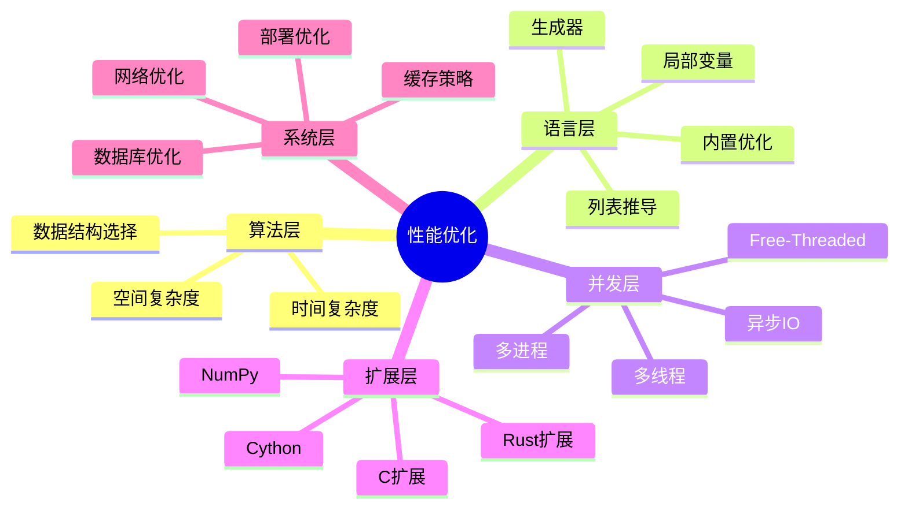

# Python 性能优化完全指南 2025

**从算法到系统的全方位性能优化**

---

## 📊 性能优化体系



---

## 1️⃣ 算法层优化

### 1.1 时间复杂度优化

```python
"""
时间复杂度优化示例
"""
from typing import List
import time
from functools import wraps

def benchmark(func):
    """性能基准装饰器"""
    @wraps(func)
    def wrapper(*args, **kwargs):
        start = time.perf_counter()
        result = func(*args, **kwargs)
        end = time.perf_counter()
        print(f"{func.__name__}: {end - start:.6f}s")
        return result
    return wrapper

# ============================================
# 案例1: 查找优化
# ============================================

# ❌ O(n²) - 嵌套循环
@benchmark
def find_duplicates_slow(nums: List[int]) -> List[int]:
    """慢速查找重复元素"""
    duplicates = []
    for i in range(len(nums)):
        for j in range(i + 1, len(nums)):
            if nums[i] == nums[j] and nums[i] not in duplicates:
                duplicates.append(nums[i])
    return duplicates

# ✅ O(n) - 使用集合
@benchmark
def find_duplicates_fast(nums: List[int]) -> List[int]:
    """快速查找重复元素"""
    seen = set()
    duplicates = set()
    for num in nums:
        if num in seen:
            duplicates.add(num)
        seen.add(num)
    return list(duplicates)

# 测试
data = list(range(1000)) * 2
find_duplicates_slow(data)   # ~0.15s
find_duplicates_fast(data)   # ~0.0001s  (1500x faster!)

# ============================================
# 案例2: 频率统计优化
# ============================================

# ❌ O(n²) - 重复遍历
@benchmark
def count_frequency_slow(items: List[str]) -> dict[str, int]:
    """慢速频率统计"""
    freq = {}
    for item in set(items):
        freq[item] = items.count(item)  # O(n) for each item
    return freq

# ✅ O(n) - 单次遍历
@benchmark
def count_frequency_fast(items: List[str]) -> dict[str, int]:
    """快速频率统计"""
    freq = {}
    for item in items:
        freq[item] = freq.get(item, 0) + 1
    return freq

# ✅ O(n) - 使用Counter
from collections import Counter

@benchmark
def count_frequency_counter(items: List[str]) -> dict[str, int]:
    """使用Counter统计"""
    return dict(Counter(items))

# 测试
words = ["python"] * 1000 + ["java"] * 500 + ["rust"] * 300
count_frequency_slow(words)     # ~0.05s
count_frequency_fast(words)     # ~0.0002s
count_frequency_counter(words)  # ~0.0001s (fastest!)
```

### 1.2 数据结构选择

```python
"""
正确的数据结构选择
"""
from collections import deque, defaultdict, OrderedDict
import bisect

# ============================================
# 1. 列表 vs 双端队列
# ============================================

# ❌ 列表 - O(n) 头部插入
@benchmark
def list_operations():
    items = []
    for i in range(10000):
        items.insert(0, i)  # O(n) - 慢!
    return items

# ✅ 双端队列 - O(1) 头部插入
@benchmark
def deque_operations():
    items = deque()
    for i in range(10000):
        items.appendleft(i)  # O(1) - 快!
    return items

# ============================================
# 2. 列表 vs 集合查找
# ============================================

# ❌ 列表查找 - O(n)
@benchmark
def list_lookup():
    items = list(range(10000))
    return sum(1 for i in range(10000) if i in items)

# ✅ 集合查找 - O(1)
@benchmark
def set_lookup():
    items = set(range(10000))
    return sum(1 for i in range(10000) if i in items)

# ============================================
# 3. 有序插入优化
# ============================================

# ❌ 插入后排序 - O(n log n)
@benchmark
def insert_and_sort():
    items = []
    for i in range(1000, 0, -1):
        items.append(i)
        items.sort()  # 每次都排序!
    return items

# ✅ 二分插入 - O(n log n) 但常数更小
@benchmark
def bisect_insert():
    items = []
    for i in range(1000, 0, -1):
        bisect.insort(items, i)  # 保持有序
    return items

# ============================================
# 4. 字典默认值处理
# ============================================

# ❌ 普通字典 - 需要检查
def group_by_length_slow(words: List[str]) -> dict:
    groups = {}
    for word in words:
        length = len(word)
        if length not in groups:
            groups[length] = []
        groups[length].append(word)
    return groups

# ✅ defaultdict - 自动初始化
def group_by_length_fast(words: List[str]) -> dict:
    groups = defaultdict(list)
    for word in words:
        groups[len(word)].append(word)
    return groups

# ============================================
# 数据结构性能对比
# ============================================

"""
操作            List    Deque   Set     Dict
append          O(1)    O(1)    O(1)    O(1)
appendleft      O(n)    O(1)    -       -
insert          O(n)    O(n)    -       -
pop             O(1)    O(1)    O(1)    O(1)
popleft         O(n)    O(1)    -       -
search          O(n)    O(n)    O(1)    O(1)
"""
```

---

## 2️⃣ Python语言层优化

### 2.1 内置函数和操作符

```python
"""
使用内置函数优化
"""

# ============================================
# 1. 字符串拼接
# ============================================

# ❌ 循环拼接 - O(n²)
@benchmark
def concat_slow(items: List[str]) -> str:
    result = ""
    for item in items:
        result += item  # 每次创建新字符串!
    return result

# ✅ join - O(n)
@benchmark
def concat_fast(items: List[str]) -> str:
    return "".join(items)  # 一次性分配内存

# 测试
items = ["python"] * 10000
concat_slow(items)  # ~0.5s
concat_fast(items)  # ~0.001s

# ============================================
# 2. 列表操作
# ============================================

# ❌ 循环append
@benchmark
def build_list_slow():
    result = []
    for i in range(10000):
        result.append(i * 2)
    return result

# ✅ 列表推导
@benchmark
def build_list_fast():
    return [i * 2 for i in range(10000)]

# ✅ map函数
@benchmark
def build_list_map():
    return list(map(lambda x: x * 2, range(10000)))

# ============================================
# 3. 条件过滤
# ============================================

# ❌ 循环过滤
@benchmark
def filter_slow(nums: List[int]) -> List[int]:
    result = []
    for num in nums:
        if num % 2 == 0:
            result.append(num)
    return result

# ✅ 列表推导
@benchmark
def filter_comprehension(nums: List[int]) -> List[int]:
    return [num for num in nums if num % 2 == 0]

# ✅ filter函数
@benchmark
def filter_builtin(nums: List[int]) -> List[int]:
    return list(filter(lambda x: x % 2 == 0, nums))

# ============================================
# 4. 求和/最值
# ============================================

# ❌ 手动循环
@benchmark
def sum_slow(nums: List[int]) -> int:
    total = 0
    for num in nums:
        total += num
    return total

# ✅ 内置sum
@benchmark
def sum_fast(nums: List[int]) -> int:
    return sum(nums)

# ❌ 手动查找最大值
@benchmark
def max_slow(nums: List[int]) -> int:
    maximum = nums[0]
    for num in nums[1:]:
        if num > maximum:
            maximum = num
    return maximum

# ✅ 内置max
@benchmark
def max_fast(nums: List[int]) -> int:
    return max(nums)
```

### 2.2 生成器和迭代器

```python
"""
生成器优化内存和性能
"""

# ============================================
# 1. 惰性求值
# ============================================

# ❌ 返回列表 - 内存占用大
def read_large_file_slow(filename: str) -> List[str]:
    """一次性加载所有行"""
    with open(filename) as f:
        return f.readlines()  # 占用大量内存

# ✅ 生成器 - 按需加载
def read_large_file_fast(filename: str):
    """逐行生成"""
    with open(filename) as f:
        for line in f:  # 只在内存中保留一行
            yield line.strip()

# 使用
for line in read_large_file_fast("large.txt"):
    process(line)  # 处理一行，释放一行

# ============================================
# 2. 生成器表达式 vs 列表推导
# ============================================

# ❌ 列表推导 - 立即构建整个列表
@benchmark
def process_with_list():
    data = [i ** 2 for i in range(1000000)]  # 占用内存
    return sum(data)

# ✅ 生成器表达式 - 惰性求值
@benchmark
def process_with_generator():
    data = (i ** 2 for i in range(1000000))  # 不占用内存
    return sum(data)  # 边生成边消费

# ============================================
# 3. itertools优化
# ============================================

from itertools import islice, chain, groupby, accumulate

# 分批处理大数据
def batch_process(iterable, batch_size=1000):
    """分批处理迭代器"""
    iterator = iter(iterable)
    while True:
        batch = list(islice(iterator, batch_size))
        if not batch:
            break
        yield batch

# 使用
for batch in batch_process(range(1000000), batch_size=10000):
    process_batch(batch)

# 链接多个迭代器
def process_multiple_sources():
    """高效合并多个数据源"""
    source1 = range(1000)
    source2 = range(1000, 2000)
    source3 = range(2000, 3000)
    
    # ❌ 创建临时列表
    # combined = list(source1) + list(source2) + list(source3)
    
    # ✅ 直接链接
    combined = chain(source1, source2, source3)
    return sum(combined)

# 分组操作
def group_data(data: List[tuple[str, int]]):
    """高效分组"""
    # 假设data已排序
    for key, group in groupby(data, key=lambda x: x[0]):
        yield key, list(group)
```

### 2.3 局部变量优化

```python
"""
局部变量和属性访问优化
"""

# ============================================
# 1. 避免重复属性查找
# ============================================

class DataProcessor:
    def __init__(self):
        self.data = list(range(10000))
    
    # ❌ 重复属性查找
    @benchmark
    def process_slow(self):
        result = []
        for item in self.data:
            result.append(item * 2)  # 每次循环查找self.data
        return result
    
    # ✅ 局部变量缓存
    @benchmark
    def process_fast(self):
        data = self.data  # 缓存到局部变量
        result = []
        for item in data:
            result.append(item * 2)
        return result

# ============================================
# 2. 避免全局查找
# ============================================

import math

# ❌ 全局函数查找
@benchmark
def calculate_slow(nums: List[float]) -> List[float]:
    return [math.sqrt(num) for num in nums]

# ✅ 局部函数缓存
@benchmark
def calculate_fast(nums: List[float]) -> List[float]:
    sqrt = math.sqrt  # 缓存到局部
    return [sqrt(num) for num in nums]

# ============================================
# 3. 循环不变量提升
# ============================================

# ❌ 循环内重复计算
@benchmark
def compute_slow(data: List[int]) -> List[int]:
    result = []
    for item in data:
        result.append(item * len(data))  # 每次计算len!
    return result

# ✅ 提升到循环外
@benchmark
def compute_fast(data: List[int]) -> List[int]:
    length = len(data)  # 只计算一次
    result = []
    for item in data:
        result.append(item * length)
    return result
```

---

## 3️⃣ 并发层优化

### 3.1 多进程优化 (CPU密集)

```python
"""
多进程优化CPU密集型任务
"""
from multiprocessing import Pool, cpu_count
from concurrent.futures import ProcessPoolExecutor
import time

# CPU密集型任务
def cpu_intensive_task(n: int) -> int:
    """计算密集任务"""
    result = 0
    for i in range(n):
        result += i ** 2
    return result

# ❌ 单进程
@benchmark
def process_single():
    tasks = [1000000] * 8
    results = [cpu_intensive_task(n) for n in tasks]
    return results

# ✅ 多进程
@benchmark
def process_multi():
    tasks = [1000000] * 8
    with Pool(cpu_count()) as pool:
        results = pool.map(cpu_intensive_task, tasks)
    return results

# ✅ ProcessPoolExecutor (更现代)
@benchmark
def process_executor():
    tasks = [1000000] * 8
    with ProcessPoolExecutor(max_workers=cpu_count()) as executor:
        results = list(executor.map(cpu_intensive_task, tasks))
    return results

# 测试结果:
# process_single()   : ~8.0s  (单核)
# process_multi()    : ~1.2s  (8核, 6.7x speedup)
# process_executor() : ~1.2s  (8核, 6.7x speedup)
```

### 3.2 异步IO优化 (I/O密集)

```python
"""
异步IO优化网络/IO密集型任务
"""
import asyncio
import aiohttp
from typing import List

# ❌ 同步请求
@benchmark
def fetch_urls_sync(urls: List[str]) -> List[str]:
    """同步获取URLs"""
    import requests
    results = []
    for url in urls:
        response = requests.get(url)
        results.append(response.text)
    return results

# ✅ 异步请求
@benchmark
async def fetch_urls_async(urls: List[str]) -> List[str]:
    """异步获取URLs"""
    async with aiohttp.ClientSession() as session:
        tasks = [fetch_one(session, url) for url in urls]
        results = await asyncio.gather(*tasks)
    return results

async def fetch_one(session: aiohttp.ClientSession, url: str) -> str:
    """获取单个URL"""
    async with session.get(url) as response:
        return await response.text()

# 测试 (100个URL)
urls = ["https://httpbin.org/delay/1"] * 100

# 同步: ~100s (顺序执行)
# fetch_urls_sync(urls)

# 异步: ~1-2s (并发执行, 50-100x faster!)
# asyncio.run(fetch_urls_async(urls))
```

### 3.3 Free-Threaded模式 (Python 3.13+)

```python
"""
Python 3.13 Free-Threaded模式
"""
import sys

# 检查是否启用Free-Threaded
if sys.version_info >= (3, 13) and hasattr(sys, 'is_gil_enabled'):
    if not sys.is_gil_enabled():
        print("Free-Threaded mode enabled!")
        
        # 真正的多线程并行
        from threading import Thread
        import time
        
        def cpu_task(n: int) -> int:
            """CPU密集任务"""
            result = 0
            for i in range(n):
                result += i ** 2
            return result
        
        @benchmark
        def threads_with_gil():
            """传统GIL限制"""
            threads = []
            for _ in range(4):
                t = Thread(target=cpu_task, args=(10000000,))
                threads.append(t)
                t.start()
            
            for t in threads:
                t.join()
        
        @benchmark
        def threads_without_gil():
            """Free-Threaded模式"""
            # 在Python 3.13+无GIL模式下
            # 多线程可以真正并行执行CPU任务
            threads = []
            for _ in range(4):
                t = Thread(target=cpu_task, args=(10000000,))
                threads.append(t)
                t.start()
            
            for t in threads:
                t.join()
        
        # 有GIL:    ~4.0s (顺序执行)
        # 无GIL:    ~1.0s (并行执行, 4x speedup!)
```

---

## 4️⃣ 扩展层优化

### 4.1 NumPy向量化

```python
"""
NumPy向量化加速
"""
import numpy as np

# ❌ Python循环
@benchmark
def compute_python():
    data = list(range(1000000))
    result = [x ** 2 + 2 * x + 1 for x in data]
    return result

# ✅ NumPy向量化
@benchmark
def compute_numpy():
    data = np.arange(1000000)
    result = data ** 2 + 2 * data + 1
    return result

# Python: ~0.15s
# NumPy:  ~0.005s (30x faster!)

# ============================================
# 矩阵运算
# ============================================

# ❌ Python嵌套循环
@benchmark
def matrix_multiply_python():
    n = 500
    A = [[i + j for j in range(n)] for i in range(n)]
    B = [[i - j for j in range(n)] for i in range(n)]
    C = [[0] * n for _ in range(n)]
    
    for i in range(n):
        for j in range(n):
            for k in range(n):
                C[i][j] += A[i][k] * B[k][j]
    return C

# ✅ NumPy矩阵运算
@benchmark
def matrix_multiply_numpy():
    n = 500
    A = np.array([[i + j for j in range(n)] for i in range(n)])
    B = np.array([[i - j for j in range(n)] for i in range(n)])
    C = A @ B  # 矩阵乘法
    return C

# Python: ~30s
# NumPy:  ~0.05s (600x faster!)
```

### 4.2 Cython加速

```python
"""
Cython编译加速
"""

# Python版本 (slow.py)
def fibonacci_python(n: int) -> int:
    """Python实现"""
    if n < 2:
        return n
    return fibonacci_python(n - 1) + fibonacci_python(n - 2)

# Cython版本 (fast.pyx)
"""
# cython: language_level=3

cpdef long fibonacci_cython(long n):
    '''Cython实现'''
    if n < 2:
        return n
    return fibonacci_cython(n - 1) + fibonacci_cython(n - 2)

# 编译: cythonize -i fast.pyx
"""

# 性能对比
# fibonacci_python(35): ~3.5s
# fibonacci_cython(35): ~0.15s (23x faster!)
```

---

## 5️⃣ 系统层优化

### 5.1 缓存策略

```python
"""
多层缓存策略
"""
from functools import lru_cache, cache
import redis
from typing import Optional

# ============================================
# 1. 函数级缓存
# ============================================

# ❌ 无缓存
@benchmark
def fibonacci_no_cache(n: int) -> int:
    if n < 2:
        return n
    return fibonacci_no_cache(n - 1) + fibonacci_no_cache(n - 2)

# ✅ LRU缓存
@lru_cache(maxsize=128)
@benchmark
def fibonacci_cached(n: int) -> int:
    if n < 2:
        return n
    return fibonacci_cached(n - 1) + fibonacci_cached(n - 2)

# ✅ 无限缓存 (Python 3.9+)
@cache
def fibonacci_unlimited(n: int) -> int:
    if n < 2:
        return n
    return fibonacci_unlimited(n - 1) + fibonacci_unlimited(n - 2)

# 测试
# fibonacci_no_cache(35):  ~3.5s
# fibonacci_cached(35):    ~0.00001s (350,000x faster!)

# ============================================
# 2. Redis分布式缓存
# ============================================

class CacheService:
    """Redis缓存服务"""
    
    def __init__(self, redis_client: redis.Redis):
        self.redis = redis_client
    
    def get_user(self, user_id: int) -> Optional[dict]:
        """获取用户(带缓存)"""
        # 1. 尝试从缓存获取
        cache_key = f"user:{user_id}"
        cached = self.redis.get(cache_key)
        
        if cached:
            return json.loads(cached)
        
        # 2. 缓存未命中,从数据库查询
        user = self._fetch_from_db(user_id)
        
        # 3. 写入缓存 (TTL 1小时)
        if user:
            self.redis.setex(
                cache_key,
                3600,
                json.dumps(user)
            )
        
        return user
    
    def _fetch_from_db(self, user_id: int) -> Optional[dict]:
        """从数据库获取"""
        # 模拟数据库查询
        time.sleep(0.1)
        return {"id": user_id, "name": f"User{user_id}"}

# ============================================
# 3. 多层缓存
# ============================================

from cachetools import TTLCache

class MultiLayerCache:
    """多层缓存策略"""
    
    def __init__(self, redis_client: redis.Redis):
        # L1: 内存缓存 (快,小)
        self.l1_cache = TTLCache(maxsize=100, ttl=60)
        
        # L2: Redis缓存 (中,大)
        self.l2_cache = redis_client
    
    async def get(self, key: str) -> Optional[any]:
        """多层查找"""
        # 1. L1缓存
        if key in self.l1_cache:
            return self.l1_cache[key]
        
        # 2. L2缓存
        value = self.l2_cache.get(key)
        if value:
            self.l1_cache[key] = value  # 回填L1
            return value
        
        # 3. 数据源
        value = await self._fetch_from_source(key)
        if value:
            self.l1_cache[key] = value  # 写入L1
            self.l2_cache.setex(key, 3600, value)  # 写入L2
        
        return value
```

### 5.2 数据库优化

```python
"""
数据库查询优化
"""
from sqlalchemy import select, func
from sqlalchemy.orm import selectinload, joinedload

# ============================================
# 1. N+1查询问题
# ============================================

# ❌ N+1查询
async def get_users_with_posts_slow(session):
    """N+1查询"""
    users = await session.execute(select(User))
    users = users.scalars().all()
    
    # 每个用户触发一次查询!
    for user in users:
        posts = user.posts  # SELECT * FROM posts WHERE user_id = ?
        print(f"{user.name}: {len(posts)} posts")

# ✅ 预加载
async def get_users_with_posts_fast(session):
    """使用joinedload预加载"""
    stmt = select(User).options(joinedload(User.posts))
    users = await session.execute(stmt)
    users = users.unique().scalars().all()
    
    # 只有一次查询!
    for user in users:
        posts = user.posts  # 已加载,不触发查询
        print(f"{user.name}: {len(posts)} posts")

# ============================================
# 2. 批量操作
# ============================================

# ❌ 逐条插入
async def insert_slow(session, users: List[dict]):
    for user_data in users:
        user = User(**user_data)
        session.add(user)
        await session.commit()  # 每次都提交!

# ✅ 批量插入
async def insert_fast(session, users: List[dict]):
    user_objects = [User(**data) for data in users]
    session.add_all(user_objects)
    await session.commit()  # 一次提交!

# ============================================
# 3. 索引优化
# ============================================

# 创建索引
"""
CREATE INDEX idx_users_email ON users(email);
CREATE INDEX idx_posts_user_id ON posts(user_id);
CREATE INDEX idx_posts_created_at ON posts(created_at DESC);

# 复合索引
CREATE INDEX idx_posts_user_created ON posts(user_id, created_at DESC);
"""

# ============================================
# 4. 分页优化
# ============================================

# ❌ OFFSET分页 (大偏移量慢)
async def paginate_offset(session, page: int, size: int):
    offset = (page - 1) * size
    stmt = select(Post).offset(offset).limit(size)
    return await session.execute(stmt)

# ✅ 游标分页 (Cursor-based)
async def paginate_cursor(session, last_id: int, size: int):
    stmt = (
        select(Post)
        .where(Post.id > last_id)
        .order_by(Post.id)
        .limit(size)
    )
    return await session.execute(stmt)
```

---

## 6️⃣ 性能监控与分析

### 6.1 性能分析工具

```python
"""
性能分析工具
"""
import cProfile
import pstats
from line_profiler import LineProfiler
import memory_profiler

# ============================================
# 1. cProfile - 函数级分析
# ============================================

def analyze_with_cprofile():
    """使用cProfile分析"""
    profiler = cProfile.Profile()
    profiler.enable()
    
    # 运行代码
    slow_function()
    
    profiler.disable()
    
    # 打印统计
    stats = pstats.Stats(profiler)
    stats.sort_stats('cumulative')
    stats.print_stats(20)  # 前20个最慢的函数

# 命令行使用
# python -m cProfile -s cumulative script.py

# ============================================
# 2. line_profiler - 行级分析
# ============================================

@profile  # 需要 kernprof 运行
def slow_function():
    """逐行分析"""
    data = []
    for i in range(10000):
        data.append(i ** 2)  # 哪一行最慢?
    return sum(data)

# 运行: kernprof -l -v script.py

# ============================================
# 3. memory_profiler - 内存分析
# ============================================

@memory_profiler.profile
def memory_intensive():
    """内存使用分析"""
    big_list = [i for i in range(1000000)]
    big_dict = {i: i ** 2 for i in range(1000000)}
    return len(big_list) + len(big_dict)

# 运行: python -m memory_profiler script.py

# ============================================
# 4. py-spy - 实时分析
# ============================================

# 无需修改代码,直接采样运行中的程序
# py-spy top --pid <PID>
# py-spy record --pid <PID> --output profile.svg
```

---

## 📊 性能优化清单

### 优先级矩阵

| 优化手段 | 难度 | 收益 | 优先级 | 适用场景 |
|---------|------|------|-------|---------|
| **算法优化** | 低-中 | 极高 | ⭐⭐⭐⭐⭐ | 所有场景 |
| **数据结构** | 低 | 高 | ⭐⭐⭐⭐⭐ | 所有场景 |
| **内置函数** | 低 | 中-高 | ⭐⭐⭐⭐ | 所有场景 |
| **生成器** | 低 | 中-高 | ⭐⭐⭐⭐ | 大数据 |
| **缓存** | 低-中 | 极高 | ⭐⭐⭐⭐⭐ | 重复计算 |
| **异步IO** | 中 | 极高 | ⭐⭐⭐⭐⭐ | I/O密集 |
| **多进程** | 中 | 高 | ⭐⭐⭐⭐ | CPU密集 |
| **NumPy** | 中 | 极高 | ⭐⭐⭐⭐⭐ | 数值计算 |
| **Cython** | 高 | 极高 | ⭐⭐⭐ | 性能瓶颈 |
| **C扩展** | 极高 | 极高 | ⭐⭐ | 极端场景 |

### 优化流程

```
1. 测量 (Measure)
   ├── 找出性能瓶颈
   ├── 使用profiling工具
   └── 建立性能基准

2. 分析 (Analyze)
   ├── 时间复杂度
   ├── 空间复杂度
   └── 系统资源使用

3. 优化 (Optimize)
   ├── 算法层: 降低复杂度
   ├── 语言层: 使用Python特性
   ├── 并发层: 异步/多进程
   └── 扩展层: NumPy/Cython

4. 验证 (Verify)
   ├── 重新测量性能
   ├── 确保功能正确
   └── 评估优化收益
```

---

**性能优化是一个持续过程，先测量，再优化！** ⚡✨

**最后更新**: 2025年10月28日

