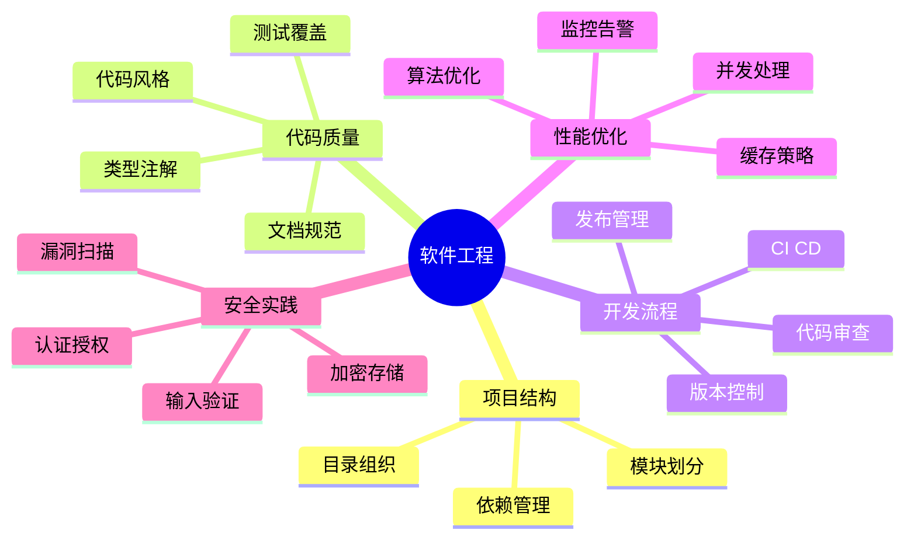

# Python 软件工程最佳实践 2025

**现代Python项目的工程化实践**

---

## 📊 最佳实践体系



---

## 1️⃣ 项目结构最佳实践

### 1.1 标准项目布局

```
my-project/
├── .github/                      # GitHub配置
│   └── workflows/               # CI/CD工作流
│       ├── test.yml
│       ├── lint.yml
│       └── deploy.yml
├── docs/                        # 文档
│   ├── api/                    # API文档
│   ├── guides/                 # 用户指南
│   └── architecture/           # 架构文档
├── src/                         # 源代码
│   └── myproject/
│       ├── __init__.py
│       ├── __main__.py         # 入口点
│       ├── cli.py              # 命令行接口
│       ├── config.py           # 配置管理
│       ├── core/               # 核心业务逻辑
│       │   ├── __init__.py
│       │   ├── domain/         # 领域模型
│       │   ├── services/       # 业务服务
│       │   └── repositories/   # 数据仓储
│       ├── api/                # API层
│       │   ├── __init__.py
│       │   ├── v1/            # API版本
│       │   │   ├── routes/
│       │   │   └── schemas/
│       │   └── dependencies.py
│       ├── infrastructure/     # 基础设施
│       │   ├── database.py
│       │   ├── cache.py
│       │   └── messaging.py
│       └── utils/              # 工具函数
│           ├── __init__.py
│           ├── logging.py
│           └── validators.py
├── tests/                       # 测试
│   ├── unit/                   # 单元测试
│   ├── integration/            # 集成测试
│   ├── e2e/                    # 端到端测试
│   ├── conftest.py            # Pytest配置
│   └── fixtures/              # 测试fixtures
├── scripts/                     # 脚本
│   ├── setup_dev.sh
│   ├── migrate.py
│   └── seed_data.py
├── docker/                      # Docker配置
│   ├── Dockerfile
│   ├── Dockerfile.dev
│   └── docker-compose.yml
├── .env.example                 # 环境变量示例
├── .gitignore
├── .pre-commit-config.yaml     # Pre-commit钩子
├── pyproject.toml              # 项目配置
├── uv.lock                     # 依赖锁定
├── README.md                   # 项目说明
├── CHANGELOG.md                # 变更日志
├── CONTRIBUTING.md             # 贡献指南
└── LICENSE                     # 许可证
```

### 1.2 pyproject.toml 完整配置

```toml
[project]
name = "myproject"
version = "0.1.0"
description = "A modern Python project"
authors = [
    {name = "Your Name", email = "you@example.com"}
]
readme = "README.md"
requires-python = ">=3.12"
license = {text = "MIT"}
keywords = ["python", "modern", "best-practices"]
classifiers = [
    "Development Status :: 4 - Beta",
    "Intended Audience :: Developers",
    "License :: OSI Approved :: MIT License",
    "Programming Language :: Python :: 3.12",
    "Programming Language :: Python :: 3.13",
]

dependencies = [
    "fastapi>=0.115.0",
    "uvicorn[standard]>=0.30.0",
    "pydantic>=2.9.0",
    "sqlalchemy[asyncio]>=2.0.0",
    "asyncpg>=0.29.0",
    "redis>=5.0.0",
    "httpx>=0.27.0",
    "python-dotenv>=1.0.0",
    "structlog>=24.0.0",
]

[project.optional-dependencies]
dev = [
    "pytest>=8.3.0",
    "pytest-cov>=5.0.0",
    "pytest-asyncio>=0.24.0",
    "pytest-mock>=3.14.0",
    "mypy>=1.11.0",
    "ruff>=0.6.0",
    "pre-commit>=3.8.0",
]
docs = [
    "mkdocs>=1.6.0",
    "mkdocs-material>=9.5.0",
]

[project.scripts]
myproject = "myproject.cli:main"

[project.urls]
Homepage = "https://github.com/yourusername/myproject"
Documentation = "https://myproject.readthedocs.io"
Repository = "https://github.com/yourusername/myproject"
Issues = "https://github.com/yourusername/myproject/issues"

[build-system]
requires = ["hatchling"]
build-backend = "hatchling.build"

[tool.uv]
dev-dependencies = [
    "pytest>=8.3.0",
    "pytest-cov>=5.0.0",
    "pytest-asyncio>=0.24.0",
    "mypy>=1.11.0",
    "ruff>=0.6.0",
]

[tool.ruff]
line-length = 100
target-version = "py312"

[tool.ruff.lint]
select = [
    "E",   # pycodestyle errors
    "W",   # pycodestyle warnings
    "F",   # pyflakes
    "I",   # isort
    "C",   # flake8-comprehensions
    "B",   # flake8-bugbear
    "UP",  # pyupgrade
]
ignore = [
    "E501",  # line too long (handled by formatter)
    "B008",  # do not perform function calls in argument defaults
]

[tool.ruff.format]
quote-style = "double"
indent-style = "space"

[tool.mypy]
python_version = "3.12"
strict = true
warn_return_any = true
warn_unused_configs = true
disallow_untyped_defs = true
disallow_any_generics = true
plugins = ["pydantic.mypy"]

[[tool.mypy.overrides]]
module = "tests.*"
disallow_untyped_defs = false

[tool.pytest.ini_options]
minversion = "8.0"
testpaths = ["tests"]
python_files = ["test_*.py", "*_test.py"]
python_classes = ["Test*"]
python_functions = ["test_*"]
addopts = [
    "-ra",
    "--strict-markers",
    "--strict-config",
    "--cov=src/myproject",
    "--cov-report=term-missing:skip-covered",
    "--cov-report=html",
    "--cov-report=xml",
]
markers = [
    "slow: marks tests as slow",
    "integration: marks integration tests",
    "e2e: marks end-to-end tests",
]

[tool.coverage.run]
branch = true
source = ["src/myproject"]
omit = [
    "*/tests/*",
    "*/__main__.py",
]

[tool.coverage.report]
exclude_lines = [
    "pragma: no cover",
    "def __repr__",
    "if TYPE_CHECKING:",
    "raise AssertionError",
    "raise NotImplementedError",
    "if __name__ == .__main__.:",
]
```

---

## 2️⃣ 代码质量最佳实践

### 2.1 类型注解标准

```python
"""
类型注解最佳实践
"""
from typing import TypeVar, Generic, Protocol, TypeAlias, Self
from collections.abc import Sequence, Mapping, Iterator
from dataclasses import dataclass

# ============================================
# 1. 使用现代类型语法 (Python 3.12+)
# ============================================

# ✅ 推荐: 使用 X | Y 联合类型
def process(value: str | int) -> str:
    return str(value)

# ❌ 避免: 旧式 Optional/Union
from typing import Optional, Union
def old_process(value: Union[str, int]) -> str:
    return str(value)

# ✅ 推荐: 使用内置泛型
def get_first(items: list[str]) -> str | None:
    return items[0] if items else None

# ❌ 避免: typing模块泛型
from typing import List
def old_get_first(items: List[str]) -> Optional[str]:
    return items[0] if items else None

# ============================================
# 2. 使用Protocol定义接口
# ============================================

class Drawable(Protocol):
    """可绘制对象协议"""
    
    def draw(self, canvas: "Canvas") -> None:
        """绘制到画布"""
        ...
    
    def get_bounds(self) -> tuple[int, int, int, int]:
        """获取边界"""
        ...

def render(obj: Drawable, canvas: "Canvas") -> None:
    """渲染对象"""
    obj.draw(canvas)

# ============================================
# 3. 使用泛型增强类型安全
# ============================================

T = TypeVar("T")
K = TypeVar("K")
V = TypeVar("V")

# Python 3.12+ 新语法
class Cache[K, V]:
    """泛型缓存"""
    
    def __init__(self):
        self._data: dict[K, V] = {}
    
    def get(self, key: K) -> V | None:
        return self._data.get(key)
    
    def set(self, key: K, value: V) -> None:
        self._data[key] = value

# ============================================
# 4. 使用TypeAlias提高可读性
# ============================================

# Python 3.12+
type UserId = int
type UserName = str
type EmailAddress = str
type UserData = dict[UserId, tuple[UserName, EmailAddress]]

def get_user_data() -> UserData:
    return {
        1: ("Alice", "alice@example.com"),
        2: ("Bob", "bob@example.com"),
    }

# ============================================
# 5. 函数签名完整注解
# ============================================

def create_user(
    *,  # 强制关键字参数
    username: str,
    email: EmailAddress,
    age: int | None = None,
    tags: Sequence[str] = (),
    metadata: Mapping[str, str] = {},
) -> "User":
    """创建用户
    
    Args:
        username: 用户名
        email: 邮箱地址
        age: 年龄(可选)
        tags: 标签列表
        metadata: 元数据
    
    Returns:
        创建的用户对象
    
    Raises:
        ValueError: 用户名或邮箱无效
    """
    if not username:
        raise ValueError("Username cannot be empty")
    
    return User(
        username=username,
        email=email,
        age=age,
        tags=list(tags),
        metadata=dict(metadata)
    )

# ============================================
# 6. 使用dataclass和类型注解
# ============================================

@dataclass(frozen=True, slots=True)
class Point:
    """点(不可变, 使用__slots__)"""
    x: float
    y: float
    
    def distance_to(self, other: Self) -> float:
        """计算到另一点的距离"""
        return ((self.x - other.x) ** 2 + (self.y - other.y) ** 2) ** 0.5

@dataclass
class User:
    """用户"""
    username: str
    email: EmailAddress
    age: int | None = None
    tags: list[str] = field(default_factory=list)
    metadata: dict[str, str] = field(default_factory=dict)
    
    def add_tag(self, tag: str) -> None:
        """添加标签"""
        if tag not in self.tags:
            self.tags.append(tag)

# ============================================
# 7. 复杂类型的类型别名
# ============================================

# JSON类型
type JSON = dict[str, "JSON"] | list["JSON"] | str | int | float | bool | None

# 回调函数类型
type Callback[T] = Callable[[T], None]
type AsyncCallback[T] = Callable[[T], Awaitable[None]]

# 配置类型
type Config = dict[str, str | int | bool | list[str]]

def parse_json(data: str) -> JSON:
    """解析JSON"""
    import json
    return json.loads(data)

# ============================================
# 8. 使用Literal精确化类型
# ============================================

from typing import Literal

type HttpMethod = Literal["GET", "POST", "PUT", "DELETE", "PATCH"]
type Environment = Literal["development", "staging", "production"]

def make_request(
    url: str,
    method: HttpMethod = "GET",
    env: Environment = "production"
) -> dict:
    """发送HTTP请求"""
    ...

# ============================================
# 9. 使用TypeGuard进行类型收窄
# ============================================

from typing import TypeGuard

def is_str_list(val: list[object]) -> TypeGuard[list[str]]:
    """检查是否是字符串列表"""
    return all(isinstance(x, str) for x in val)

def process_strings(items: list[object]) -> None:
    """处理字符串列表"""
    if is_str_list(items):
        # items的类型现在是 list[str]
        for item in items:
            print(item.upper())  # OK, item是str

# ============================================
# 10. ParamSpec保持类型信息
# ============================================

from typing import ParamSpec, Concatenate

P = ParamSpec("P")
R = TypeVar("R")

def add_logging[**P, R](
    func: Callable[P, R]
) -> Callable[P, R]:
    """添加日志装饰器"""
    from functools import wraps
    
    @wraps(func)
    def wrapper(*args: P.args, **kwargs: P.kwargs) -> R:
        print(f"Calling {func.__name__}")
        result = func(*args, **kwargs)
        print(f"Finished {func.__name__}")
        return result
    
    return wrapper

@add_logging
def greet(name: str, greeting: str = "Hello") -> str:
    """问候"""
    return f"{greeting}, {name}!"

# 类型信息得到保留
result: str = greet("World")  # OK
result = greet(name="World", greeting="Hi")  # OK
```

### 2.2 文档字符串标准 (Google Style)

```python
"""
模块级文档字符串

这个模块提供用户管理功能。

Example:
    基本用法示例::

        user = create_user(username="alice", email="alice@example.com")
        user.add_tag("admin")

Attributes:
    MAX_USERNAME_LENGTH (int): 用户名最大长度
    DEFAULT_ROLE (str): 默认角色
"""

MAX_USERNAME_LENGTH: int = 50
DEFAULT_ROLE: str = "user"

def create_user(
    *,
    username: str,
    email: str,
    age: int | None = None,
    role: str = DEFAULT_ROLE
) -> "User":
    """创建新用户
    
    创建并返回一个新的User对象。用户名和邮箱是必需的，
    年龄和角色是可选的。
    
    Args:
        username: 用户名，长度不超过50个字符
        email: 有效的邮箱地址
        age: 用户年龄，必须大于0。如果为None则表示未提供
        role: 用户角色，默认为 "user"
    
    Returns:
        创建的User对象实例
    
    Raises:
        ValueError: 如果用户名为空或过长
        ValueError: 如果邮箱格式无效
        ValueError: 如果年龄小于等于0
    
    Example:
        >>> user = create_user(username="alice", email="alice@example.com")
        >>> print(user.username)
        alice
        
        >>> user = create_user(
        ...     username="bob",
        ...     email="bob@example.com",
        ...     age=25,
        ...     role="admin"
        ... )
        >>> user.role
        'admin'
    
    Note:
        用户名必须是唯一的。如果用户名已存在，应该使用
        `update_user` 函数更新现有用户。
    
    See Also:
        update_user: 更新现有用户
        delete_user: 删除用户
    """
    # 验证用户名
    if not username:
        raise ValueError("Username cannot be empty")
    
    if len(username) > MAX_USERNAME_LENGTH:
        raise ValueError(
            f"Username too long (max {MAX_USERNAME_LENGTH} characters)"
        )
    
    # 验证邮箱
    if "@" not in email or "." not in email.split("@")[1]:
        raise ValueError(f"Invalid email address: {email}")
    
    # 验证年龄
    if age is not None and age <= 0:
        raise ValueError(f"Age must be positive, got {age}")
    
    return User(
        username=username,
        email=email,
        age=age,
        role=role
    )

class User:
    """用户类
    
    表示系统中的用户。包含用户的基本信息和操作方法。
    
    Attributes:
        username (str): 用户名
        email (str): 邮箱地址
        age (int | None): 年龄，可能为None
        role (str): 用户角色
        tags (list[str]): 用户标签列表
        created_at (datetime): 创建时间
    
    Example:
        >>> user = User(username="alice", email="alice@example.com")
        >>> user.add_tag("premium")
        >>> "premium" in user.tags
        True
    """
    
    def __init__(
        self,
        username: str,
        email: str,
        age: int | None = None,
        role: str = DEFAULT_ROLE
    ):
        """初始化用户
        
        Args:
            username: 用户名
            email: 邮箱地址
            age: 年龄(可选)
            role: 用户角色
        """
        self.username = username
        self.email = email
        self.age = age
        self.role = role
        self.tags: list[str] = []
        self.created_at = datetime.now()
    
    def add_tag(self, tag: str) -> None:
        """添加标签
        
        如果标签不存在则添加到标签列表。
        
        Args:
            tag: 要添加的标签
        
        Example:
            >>> user = User("alice", "alice@example.com")
            >>> user.add_tag("premium")
            >>> len(user.tags)
            1
        """
        if tag not in self.tags:
            self.tags.append(tag)
    
    def has_role(self, role: str) -> bool:
        """检查是否有指定角色
        
        Args:
            role: 要检查的角色
        
        Returns:
            如果用户有指定角色返回True，否则返回False
        """
        return self.role == role
```

### 2.3 测试最佳实践

```python
"""
测试最佳实践示例
"""
import pytest
from unittest.mock import Mock, patch, AsyncMock
from datetime import datetime

# ============================================
# 1. 使用Fixtures组织测试数据
# ============================================

@pytest.fixture
def sample_user() -> User:
    """创建示例用户"""
    return User(
        username="testuser",
        email="test@example.com",
        age=25,
        role="user"
    )

@pytest.fixture
def user_repository(tmp_path):
    """创建临时用户仓储"""
    db_path = tmp_path / "test.db"
    repo = UserRepository(str(db_path))
    yield repo
    repo.close()

# ============================================
# 2. 参数化测试
# ============================================

@pytest.mark.parametrize("username,email,expected_valid", [
    ("alice", "alice@example.com", True),
    ("bob", "bob@example.com", True),
    ("", "invalid@example.com", False),  # 空用户名
    ("charlie", "invalid-email", False),  # 无效邮箱
    ("x" * 51, "toolong@example.com", False),  # 用户名过长
])
def test_create_user_validation(
    username: str,
    email: str,
    expected_valid: bool
):
    """测试用户创建验证"""
    if expected_valid:
        user = create_user(username=username, email=email)
        assert user.username == username
        assert user.email == email
    else:
        with pytest.raises(ValueError):
            create_user(username=username, email=email)

# ============================================
# 3. 异步测试
# ============================================

@pytest.mark.asyncio
async def test_async_user_creation():
    """测试异步用户创建"""
    user = await create_user_async(
        username="alice",
        email="alice@example.com"
    )
    assert user.username == "alice"

# ============================================
# 4. 测试异常
# ============================================

def test_user_creation_empty_username():
    """测试空用户名抛出异常"""
    with pytest.raises(ValueError, match="Username cannot be empty"):
        create_user(username="", email="test@example.com")

def test_user_creation_invalid_email():
    """测试无效邮箱抛出异常"""
    with pytest.raises(ValueError, match="Invalid email"):
        create_user(username="alice", email="invalid")

# ============================================
# 5. Mock和Patch
# ============================================

def test_user_save_calls_repository(sample_user):
    """测试保存用户调用仓储"""
    # 创建mock对象
    mock_repo = Mock(spec=UserRepository)
    service = UserService(mock_repo)
    
    # 执行操作
    service.save_user(sample_user)
    
    # 验证调用
    mock_repo.save.assert_called_once_with(sample_user)

@patch("myproject.services.user.datetime")
def test_user_creation_time(mock_datetime, sample_user):
    """测试用户创建时间"""
    # 设置mock返回值
    fixed_time = datetime(2025, 1, 1, 12, 0, 0)
    mock_datetime.now.return_value = fixed_time
    
    # 创建用户
    user = User("alice", "alice@example.com")
    
    # 验证
    assert user.created_at == fixed_time
    mock_datetime.now.assert_called_once()

# ============================================
# 6. 异步Mock
# ============================================

@pytest.mark.asyncio
async def test_async_fetch_user():
    """测试异步获取用户"""
    # 创建异步mock
    mock_client = AsyncMock()
    mock_client.get.return_value = {
        "username": "alice",
        "email": "alice@example.com"
    }
    
    service = UserService(mock_client)
    user = await service.fetch_user(123)
    
    assert user.username == "alice"
    mock_client.get.assert_called_once_with("/users/123")

# ============================================
# 7. 测试覆盖率标记
# ============================================

@pytest.mark.slow
def test_bulk_user_creation():
    """测试批量创建用户(慢速测试)"""
    users = []
    for i in range(1000):
        user = create_user(
            username=f"user{i}",
            email=f"user{i}@example.com"
        )
        users.append(user)
    
    assert len(users) == 1000

@pytest.mark.integration
@pytest.mark.asyncio
async def test_user_service_integration():
    """集成测试: 用户服务"""
    # 使用真实数据库
    async with Database("postgresql://localhost/testdb") as db:
        repo = UserRepository(db)
        service = UserService(repo)
        
        user = await service.create_user(
            username="alice",
            email="alice@example.com"
        )
        
        # 验证持久化
        fetched = await service.get_user(user.id)
        assert fetched.username == user.username

# ============================================
# 8. 测试上下文管理器
# ============================================

def test_transaction_context():
    """测试事务上下文管理器"""
    with Transaction() as tx:
        user = create_user(username="alice", email="alice@example.com")
        tx.add(user)
    
    # 验证事务已提交
    assert user.id is not None

def test_transaction_rollback():
    """测试事务回滚"""
    with pytest.raises(ValueError):
        with Transaction() as tx:
            user = create_user(username="alice", email="alice@example.com")
            tx.add(user)
            raise ValueError("Force rollback")
    
    # 验证事务已回滚
    # 用户不应该被保存

# ============================================
# 9. 测试fixtures复用
# ============================================

@pytest.fixture(scope="session")
def database():
    """会话级数据库fixture"""
    db = Database("sqlite:///:memory:")
    db.create_tables()
    yield db
    db.close()

@pytest.fixture(scope="function")
def clean_database(database):
    """函数级清理fixture"""
    yield database
    database.clear_all_tables()

# ============================================
# 10. 配置pytest.ini
# ============================================

# pytest.ini or pyproject.toml
"""
[tool.pytest.ini_options]
testpaths = ["tests"]
python_files = ["test_*.py", "*_test.py"]
python_classes = ["Test*"]
python_functions = ["test_*"]
markers = [
    "slow: marks tests as slow",
    "integration: marks integration tests",
    "e2e: marks end-to-end tests",
]
"""
```

---

## 3️⃣ CI/CD最佳实践

### 3.1 GitHub Actions工作流

```yaml
# .github/workflows/test.yml
name: Test

on:
  push:
    branches: [ main, develop ]
  pull_request:
    branches: [ main, develop ]

jobs:
  test:
    name: Test Python ${{ matrix.python-version }}
    runs-on: ubuntu-latest
    
    strategy:
      matrix:
        python-version: ["3.12", "3.13"]
    
    steps:
      - uses: actions/checkout@v4
      
      - name: Install uv
        uses: astral-sh/setup-uv@v3
      
      - name: Set up Python ${{ matrix.python-version }}
        run: uv python install ${{ matrix.python-version }}
      
      - name: Install dependencies
        run: |
          uv sync --all-extras
      
      - name: Run linters
        run: |
          uv run ruff check .
          uv run ruff format --check .
          uv run mypy src/
      
      - name: Run tests
        run: |
          uv run pytest --cov --cov-report=xml
      
      - name: Upload coverage
        uses: codecov/codecov-action@v4
        with:
          file: ./coverage.xml
          fail_ci_if_error: true
```

### 3.2 Pre-commit配置

```yaml
# .pre-commit-config.yaml
repos:
  - repo: https://github.com/pre-commit/pre-commit-hooks
    rev: v4.6.0
    hooks:
      - id: check-yaml
      - id: end-of-file-fixer
      - id: trailing-whitespace
      - id: check-added-large-files
        args: ['--maxkb=1000']
      - id: check-merge-conflict
      - id: detect-private-key
  
  - repo: https://github.com/astral-sh/ruff-pre-commit
    rev: v0.6.0
    hooks:
      - id: ruff
        args: [--fix]
      - id: ruff-format
  
  - repo: https://github.com/pre-commit/mirrors-mypy
    rev: v1.11.0
    hooks:
      - id: mypy
        additional_dependencies:
          - pydantic>=2.0
          - types-redis
```

---

## 📚 工程化清单

### 代码质量检查清单

- [ ] 所有公共API有类型注解
- [ ] 所有函数有docstring
- [ ] 测试覆盖率 > 90%
- [ ] 通过ruff检查
- [ ] 通过mypy strict模式
- [ ] 通过安全扫描

### 项目交付清单

- [ ] README.md完整
- [ ] CHANGELOG.md更新
- [ ] 文档完善
- [ ] CI/CD配置
- [ ] Docker镜像
- [ ] 环境变量文档
- [ ] 部署文档

---

**工程化实践，构建高质量项目！** 🛠️✨

**最后更新**: 2025年10月28日

