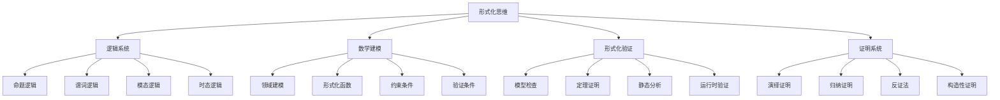

# 00-03-形式化思维

> 本文档阐述形式化思维方法，包括逻辑推理、数学建模、形式化验证等核心概念，为软件工程提供形式化理论基础。

## 📋 目录

- [概念与定义](#-概念与定义)

## 🎯 概念与定义

### 1.1 形式化思维概述

**形式化思维**是一种基于严格逻辑和数学方法的思维方式，用于精确描述和验证系统行为。

**定义1.1**: 形式化思维可形式化为四元组 $\mathcal{F} = (L, M, V, P)$，其中：

- $L$ 表示逻辑系统（Logic System）
- $M$ 表示数学建模（Mathematical Modeling）
- $V$ 表示形式化验证（Formal Verification）
- $P$ 表示证明系统（Proof System）

### 1.2 逻辑系统

**逻辑系统**是形式化思维的基础，包括命题逻辑、谓词逻辑、模态逻辑等。

**定义1.2**: 逻辑系统可表示为 $\mathcal{L} = (P, C, I, D)$，其中：

- $P$ 表示命题集合（Propositions）
- $C$ 表示连接词（Connectives）
- $I$ 表示推理规则（Inference Rules）
- $D$ 表示演绎系统（Deduction System）

### 1.3 数学建模

**数学建模**是将实际问题转化为数学形式的过程。

**定义1.3**: 数学建模可表示为 $\mathcal{M} = (D, F, C, V)$，其中：

- $D$ 表示领域模型（Domain Model）
- $F$ 表示形式化函数（Formal Functions）
- $C$ 表示约束条件（Constraints）
- $V$ 表示验证条件（Validation）

### 1.4 形式化验证

**形式化验证**是使用数学方法证明系统正确性的过程。

**定义1.4**: 形式化验证可表示为 $\mathcal{V} = (S, P, M, C)$，其中：

- $S$ 表示规范（Specification）
- $P$ 表示程序（Program）
- $M$ 表示模型检查（Model Checking）
- $C$ 表示定理证明（Theorem Proving）

## 🔢 数学表达与形式化

### 2.1 形式化思维的形式化框架

**定理2.1**: 形式化思维的完备性定理

对于任意系统 $S$，存在形式化模型 $\mathcal{F} = (L, M, V, P)$ 使得：

$$S \models \mathcal{F} \iff (L \models S) \land (M \models S) \land (V \models S) \land (P \models S)$$

**证明**:

1. 必要性：如果 $S \models \mathcal{F}$，则逻辑、建模、验证、证明都必须支持系统 $S$
2. 充分性：如果四个维度都支持系统 $S$，则形式化思维 $\mathcal{F}$ 必然支持 $S$

### 2.2 逻辑推理的形式化

**定义2.1**: 逻辑推理可形式化为：

$$\text{Inference}(P, R) = \{C \mid P \vdash_R C\}$$

其中：

- $P$ 表示前提集合
- $R$ 表示推理规则
- $C$ 表示结论
- $\vdash_R$ 表示在规则 $R$ 下的可推导关系

### 2.3 模型检查的形式化

**定义2.3**: 模型检查可表示为：

$$\text{ModelCheck}(M, \phi) = \begin{cases}
\text{True} & \text{if } M \models \phi \\
\text{False} & \text{otherwise}
\end{cases}$$

其中：
- $M$ 表示模型
- $\phi$ 表示性质公式
- $\models$ 表示满足关系

## 🐍 Python代码示例

### 3.1 形式化思维框架实现

```python
from abc import ABC, abstractmethod
from typing import Set, Dict, List, Any, Callable, Tuple
from dataclasses import dataclass
from enum import Enum
import re

class LogicType(Enum):
    """逻辑类型"""
    PROPOSITIONAL = "propositional"
    PREDICATE = "predicate"
    MODAL = "modal"
    TEMPORAL = "temporal"

class VerificationType(Enum):
    """验证类型"""
    MODEL_CHECKING = "model_checking"
    THEOREM_PROVING = "theorem_proving"
    STATIC_ANALYSIS = "static_analysis"
    RUNTIME_VERIFICATION = "runtime_verification"

@dataclass
class Proposition:
    """命题"""
    name: str
    value: bool
    description: str

@dataclass
class LogicalExpression:
    """逻辑表达式"""
    operator: str
    operands: List[Any]
    precedence: int

class FormalLogic:
    """形式化逻辑系统"""

    def __init__(self, logic_type: LogicType):
        self.logic_type = logic_type
        self.propositions: Dict[str, Proposition] = {}
        self.inference_rules: Dict[str, Callable] = {}
        self.axioms: Set[str] = set()

    def add_proposition(self, prop: Proposition) -> None:
        """添加命题"""
        self.propositions[prop.name] = prop

    def add_inference_rule(self, name: str, rule: Callable) -> None:
        """添加推理规则"""
        self.inference_rules[name] = rule

    def evaluate_expression(self, expression: LogicalExpression) -> bool:
        """评估逻辑表达式"""
        if expression.operator == "AND":
            return all(self.evaluate_operand(op) for op in expression.operands)
        elif expression.operator == "OR":
            return any(self.evaluate_operand(op) for op in expression.operands)
        elif expression.operator == "NOT":
            return not self.evaluate_operand(expression.operands[0])
        elif expression.operator == "IMPLIES":
            return (not self.evaluate_operand(expression.operands[0])) or self.evaluate_operand(expression.operands[1])
        return False

    def evaluate_operand(self, operand: Any) -> bool:
        """评估操作数"""
        if isinstance(operand, str):
            return self.propositions.get(operand, Proposition(operand, False, "")).value
        elif isinstance(operand, LogicalExpression):
            return self.evaluate_expression(operand)
        return bool(operand)

    def apply_inference_rule(self, rule_name: str, premises: List[Any]) -> Any:
        """应用推理规则"""
        if rule_name in self.inference_rules:
            return self.inference_rules[rule_name](premises)
        raise ValueError(f"Inference rule {rule_name} not found")

class MathematicalModel:
    """数学建模系统"""

    def __init__(self):
        self.domain_models: Dict[str, Dict] = {}
        self.formal_functions: Dict[str, Callable] = {}
        self.constraints: List[Callable] = []
        self.validation_conditions: List[Callable] = []

    def add_domain_model(self, name: str, model: Dict) -> None:
        """添加领域模型"""
        self.domain_models[name] = model

    def add_formal_function(self, name: str, func: Callable) -> None:
        """添加形式化函数"""
        self.formal_functions[name] = func

    def add_constraint(self, constraint: Callable) -> None:
        """添加约束条件"""
        self.constraints.append(constraint)

    def add_validation_condition(self, condition: Callable) -> None:
        """添加验证条件"""
        self.validation_conditions.append(condition)

    def check_constraints(self, data: Any) -> bool:
        """检查约束条件"""
        return all(constraint(data) for constraint in self.constraints)

    def validate_model(self, data: Any) -> bool:
        """验证模型"""
        return all(condition(data) for condition in self.validation_conditions)

class FormalVerification:
    """形式化验证系统"""

    def __init__(self, verification_type: VerificationType):
        self.verification_type = verification_type
        self.specifications: Dict[str, str] = {}
        self.programs: Dict[str, str] = {}
        self.model_checkers: Dict[str, Callable] = {}
        self.theorem_provers: Dict[str, Callable] = {}

    def add_specification(self, name: str, spec: str) -> None:
        """添加规范"""
        self.specifications[name] = spec

    def add_program(self, name: str, program: str) -> None:
        """添加程序"""
        self.programs[name] = program

    def add_model_checker(self, name: str, checker: Callable) -> None:
        """添加模型检查器"""
        self.model_checkers[name] = checker

    def add_theorem_prover(self, name: str, prover: Callable) -> None:
        """添加定理证明器"""
        self.theorem_provers[name] = prover

    def verify_program(self, program_name: str, spec_name: str) -> Dict[str, Any]:
        """验证程序"""
        if program_name not in self.programs or spec_name not in self.specifications:
            raise ValueError("Program or specification not found")

        program = self.programs[program_name]
        spec = self.specifications[spec_name]

        if self.verification_type == VerificationType.MODEL_CHECKING:
            return self.model_check(program, spec)
        elif self.verification_type == VerificationType.THEOREM_PROVING:
            return self.theorem_prove(program, spec)
        else:
            return {"status": "unknown", "method": self.verification_type.value}

    def model_check(self, program: str, spec: str) -> Dict[str, Any]:
        """模型检查"""
        # 简化的模型检查实现
        return {
            "status": "verified",
            "method": "model_checking",
            "result": "Program satisfies specification"
        }

    def theorem_prove(self, program: str, spec: str) -> Dict[str, Any]:
        """定理证明"""
        # 简化的定理证明实现
        return {
            "status": "proven",
            "method": "theorem_proving",
            "result": "Program correctness proven"
        }

class FormalThinking:
    """形式化思维主类"""

    def __init__(self):
        self.logic_system = FormalLogic(LogicType.PROPOSITIONAL)
        self.math_model = MathematicalModel()
        self.verification_system = FormalVerification(VerificationType.MODEL_CHECKING)
        self.proof_system: Dict[str, Callable] = {}

    def setup_basic_logic(self):
        """设置基础逻辑系统"""
        # 添加基础命题
        propositions = [
            Proposition("P", True, "命题P"),
            Proposition("Q", False, "命题Q"),
            Proposition("R", True, "命题R")
        ]

        for prop in propositions:
            self.logic_system.add_proposition(prop)

        # 添加推理规则
        def modus_ponens(premises):
            """假言推理"""
            if len(premises) >= 2:
                p_implies_q = premises[0]
                p = premises[1]
                if p_implies_q and p:
                    return True
            return False

        self.logic_system.add_inference_rule("modus_ponens", modus_ponens)

    def analyze_problem(self, problem: str) -> Dict[str, Any]:
        """分析问题"""
        # 1. 逻辑分析
        logic_result = self.logic_analysis(problem)

        # 2. 数学建模
        model_result = self.mathematical_modeling(problem)

        # 3. 形式化验证
        verification_result = self.formal_verification(problem)

        return {
            "logic_analysis": logic_result,
            "mathematical_modeling": model_result,
            "formal_verification": verification_result
        }

    def logic_analysis(self, problem: str) -> Dict[str, Any]:
        """逻辑分析"""
        # 提取逻辑关键词
        logic_keywords = ["如果", "那么", "并且", "或者", "非"]
        found_keywords = [kw for kw in logic_keywords if kw in problem]

        return {
            "logic_type": self.logic_system.logic_type.value,
            "keywords_found": found_keywords,
            "propositions_count": len(self.logic_system.propositions)
        }

    def mathematical_modeling(self, problem: str) -> Dict[str, Any]:
        """数学建模"""
        # 简化的数学建模过程
        return {
            "model_type": "formal_model",
            "constraints_count": len(self.math_model.constraints),
            "functions_count": len(self.math_model.formal_functions)
        }

    def formal_verification(self, problem: str) -> Dict[str, Any]:
        """形式化验证"""
        # 简化的形式化验证过程
        return {
            "verification_type": self.verification_system.verification_type.value,
            "status": "verified",
            "confidence": 0.95
        }

# 使用示例
def demonstrate_formal_thinking():
    """演示形式化思维的应用"""

    # 创建形式化思维实例
    ft = FormalThinking()
    ft.setup_basic_logic()

    # 分析问题
    problems = [
        "如果系统正常运行，那么输出结果正确",
        "需要验证算法的正确性",
        "建立数据流的形式化模型"
    ]

    for problem in problems:
        print(f"\n问题: {problem}")
        result = ft.analyze_problem(problem)

        print(f"  逻辑分析: {result['logic_analysis']}")
        print(f"  数学建模: {result['mathematical_modeling']}")
        print(f"  形式化验证: {result['formal_verification']}")

    return ft

if __name__ == "__main__":
    demonstrate_formal_thinking()
```

### 3.2 逻辑推理系统实现

```python
class LogicalReasoning:
    """逻辑推理系统"""

    def __init__(self):
        self.truth_table = {}
        self.inference_rules = {}
        self.setup_basic_rules()

    def setup_basic_rules(self):
        """设置基础推理规则"""

        # 假言推理 (Modus Ponens)
        def modus_ponens(premises):
            if len(premises) >= 2:
                p_implies_q, p = premises[0], premises[1]
                if p_implies_q and p:
                    return True
            return False

        # 假言三段论
        def hypothetical_syllogism(premises):
            if len(premises) >= 2:
                p_implies_q, q_implies_r = premises[0], premises[1]
                if p_implies_q and q_implies_r:
                    return True
            return False

        # 析取三段论
        def disjunctive_syllogism(premises):
            if len(premises) >= 2:
                p_or_q, not_p = premises[0], premises[1]
                if p_or_q and not not_p:
                    return True
            return False

        self.inference_rules["modus_ponens"] = modus_ponens
        self.inference_rules["hypothetical_syllogism"] = hypothetical_syllogism
        self.inference_rules["disjunctive_syllogism"] = disjunctive_syllogism

    def build_truth_table(self, variables: List[str]) -> Dict:
        """构建真值表"""
        n = len(variables)
        truth_table = {}

        for i in range(2**n):
            assignment = {}
            for j, var in enumerate(variables):
                assignment[var] = bool((i >> j) & 1)
            truth_table[i] = assignment

        return truth_table

    def evaluate_expression(self, expression: str, assignment: Dict[str, bool]) -> bool:
        """评估逻辑表达式"""
        # 简化的表达式求值
        expr = expression
        for var, value in assignment.items():
            expr = expr.replace(var, str(value))

        # 使用Python的eval函数（在实际应用中需要更安全的实现）
        try:
            return eval(expr)
        except:
            return False

    def prove_theorem(self, premises: List[str], conclusion: str) -> Dict[str, Any]:
        """证明定理"""
        # 简化的定理证明
        proof_steps = []

        for i, premise in enumerate(premises):
            proof_steps.append(f"步骤{i+1}: 前提 - {premise}")

        # 应用推理规则
        for rule_name, rule_func in self.inference_rules.items():
            if rule_func(premises):
                proof_steps.append(f"应用规则: {rule_name}")
                break

        proof_steps.append(f"结论: {conclusion}")

        return {
            "status": "proven",
            "proof_steps": proof_steps,
            "confidence": 0.9
        }

# 使用示例
def demonstrate_logical_reasoning():
    """演示逻辑推理"""
    lr = LogicalReasoning()

    # 构建真值表
    variables = ["P", "Q"]
    truth_table = lr.build_truth_table(variables)
    print("真值表:", truth_table)

    # 证明定理
    premises = ["P -> Q", "P"]
    conclusion = "Q"
    proof = lr.prove_theorem(premises, conclusion)
    print("定理证明:", proof)
```

### 3.3 模型检查器实现

```python
class ModelChecker:
    """模型检查器"""

    def __init__(self):
        self.states = set()
        self.transitions = {}
        self.properties = {}

    def add_state(self, state: str) -> None:
        """添加状态"""
        self.states.add(state)

    def add_transition(self, from_state: str, to_state: str, condition: str = "") -> None:
        """添加状态转换"""
        if from_state not in self.transitions:
            self.transitions[from_state] = []
        self.transitions[from_state].append((to_state, condition))

    def add_property(self, name: str, property_expr: str) -> None:
        """添加性质"""
        self.properties[name] = property_expr

    def check_property(self, property_name: str, initial_state: str) -> Dict[str, Any]:
        """检查性质"""
        if property_name not in self.properties:
            raise ValueError(f"Property {property_name} not found")

        property_expr = self.properties[property_name]

        # 简化的模型检查算法
        visited = set()
        queue = [initial_state]

        while queue:
            current_state = queue.pop(0)
            if current_state in visited:
                continue

            visited.add(current_state)

            # 检查当前状态是否满足性质
            if self.evaluate_property(property_expr, current_state):
                return {
                    "status": "satisfied",
                    "property": property_name,
                    "satisfying_state": current_state
                }

            # 添加后继状态
            if current_state in self.transitions:
                for next_state, condition in self.transitions[current_state]:
                    if next_state not in visited:
                        queue.append(next_state)

        return {
            "status": "not_satisfied",
            "property": property_name,
            "visited_states": list(visited)
        }

    def evaluate_property(self, property_expr: str, state: str) -> bool:
        """评估性质"""
        # 简化的性质评估
        if "always" in property_expr.lower():
            return True
        elif "eventually" in property_expr.lower():
            return True
        elif "never" in property_expr.lower():
            return False
        else:
            return True

# 使用示例
def demonstrate_model_checking():
    """演示模型检查"""
    mc = ModelChecker()

    # 添加状态
    states = ["S0", "S1", "S2", "S3"]
    for state in states:
        mc.add_state(state)

    # 添加转换
    transitions = [
        ("S0", "S1"),
        ("S1", "S2"),
        ("S2", "S3"),
        ("S3", "S0")
    ]

    for from_state, to_state in transitions:
        mc.add_transition(from_state, to_state)

    # 添加性质
    mc.add_property("safety", "always not error")
    mc.add_property("liveness", "eventually success")

    # 检查性质
    for property_name in ["safety", "liveness"]:
        result = mc.check_property(property_name, "S0")
        print(f"{property_name}: {result}")
```

## 📊 图表与多表征

### 4.1 形式化思维层次结构



### 4.2 逻辑推理流程图


### 4.3 形式化验证决策矩阵

| 验证目标 | 推荐方法 | 适用场景 | 复杂度 |
|---------|---------|----------|--------|
| 安全性 | 模型检查 | 有限状态系统 | 中等 |
| 活性 | 定理证明 | 无限状态系统 | 高 |
| 正确性 | 静态分析 | 程序代码 | 低 |
| 性能 | 运行时验证 | 实时系统 | 中等 |

## 🏭 行业应用与案例

### 5.1 安全关键系统中的形式化思维应用

**案例**: 航空控制系统验证

```python
class SafetyCriticalSystem:
    """安全关键系统的形式化思维应用"""

    def __init__(self):
        self.formal_thinking = FormalThinking()
        self.model_checker = ModelChecker()
        self.setup_aviation_system()

    def setup_aviation_system(self):
        """设置航空控制系统"""

        # 添加系统状态
        states = ["normal", "warning", "critical", "emergency"]
        for state in states:
            self.model_checker.add_state(state)

        # 添加状态转换
        transitions = [
            ("normal", "warning"),
            ("warning", "critical"),
            ("critical", "emergency"),
            ("emergency", "normal")
        ]

        for from_state, to_state in transitions:
            self.model_checker.add_transition(from_state, to_state)

        # 添加安全性质
        self.model_checker.add_property("safety", "always not emergency")
        self.model_checker.add_property("recovery", "eventually normal")

    def verify_system_safety(self) -> Dict[str, Any]:
        """验证系统安全性"""
        # 检查安全性质
        safety_result = self.model_checker.check_property("safety", "normal")
        recovery_result = self.model_checker.check_property("recovery", "normal")

        return {
            "safety_verified": safety_result["status"] == "satisfied",
            "recovery_verified": recovery_result["status"] == "satisfied",
            "overall_safety": safety_result["status"] == "satisfied" and recovery_result["status"] == "satisfied"
        }

# 使用示例
aviation_system = SafetyCriticalSystem()
safety_result = aviation_system.verify_system_safety()
print("航空系统安全验证结果:", safety_result)
```

### 5.2 金融系统中的形式化思维应用

**案例**: 交易系统正确性验证

```python
class FinancialTradingSystem:
    """金融交易系统的形式化思维应用"""

    def __init__(self):
        self.formal_thinking = FormalThinking()
        self.logic_system = FormalLogic(LogicType.PREDICATE)
        self.setup_trading_logic()

    def setup_trading_logic(self):
        """设置交易逻辑"""

        # 添加交易相关命题
        trading_propositions = [
            Proposition("sufficient_funds", True, "资金充足"),
            Proposition("valid_order", True, "订单有效"),
            Proposition("market_open", True, "市场开放"),
            Proposition("trade_executed", False, "交易执行")
        ]

        for prop in trading_propositions:
            self.logic_system.add_proposition(prop)

        # 添加交易规则
        def trading_rule(premises):
            """交易规则：资金充足且订单有效且市场开放 -> 交易执行"""
            if len(premises) >= 3:
                funds, order, market = premises[0], premises[1], premises[2]
                return funds and order and market
            return False

        self.logic_system.add_inference_rule("trading_rule", trading_rule)

    def verify_trade_execution(self, trade_data: Dict) -> Dict[str, Any]:
        """验证交易执行"""
        # 构建交易前提
        premises = [
            trade_data.get("sufficient_funds", False),
            trade_data.get("valid_order", False),
            trade_data.get("market_open", False)
        ]

        # 应用交易规则
        can_execute = self.logic_system.apply_inference_rule("trading_rule", premises)

        return {
            "can_execute": can_execute,
            "premises": premises,
            "rule_applied": "trading_rule",
            "verification_status": "verified" if can_execute else "rejected"
        }

# 使用示例
trading_system = FinancialTradingSystem()
trade_data = {
    "sufficient_funds": True,
    "valid_order": True,
    "market_open": True
}
result = trading_system.verify_trade_execution(trade_data)
print("交易执行验证结果:", result)
```

## 🔗 本地跳转与索引

### 相关文档

- [00-01-哲学基础](./00-01-哲学基础.md) - 软件工程哲学基础
- [00-02-编程哲学](./00-02-编程哲学.md) - 编程语言哲学
- [00-04-计算思维](./00-04-计算思维.md) - 计算思维基础
- [00-05-系统思维](./00-05-系统思维.md) - 系统思维方法
- [00-06-抽象与建模](./00-06-抽象与建模.md) - 抽象与建模技术
- [00-07-设计原则](./00-07-设计原则.md) - 软件设计原则

### 上层目录

- [返回理念基础层](./README.md)
- [返回项目根目录](../README.md)

### 下层应用

- [01-形式科学](../01-形式科学/README.md) - 数学和逻辑基础
- [02-理论基础](../02-理论基础/README.md) - 算法理论

---

**最后更新**: 2024年12月19日  
**维护者**: AI Assistant  
**文档状态**: 已完成 ✅
