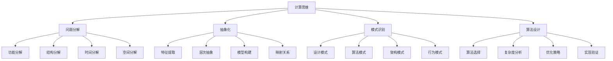
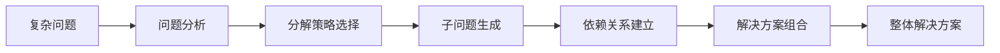

# 00-04-计算思维

> 本文档阐述计算思维方法，包括问题分解、模式识别、抽象化、算法设计等核心概念，为软件工程提供计算理论基础。

## 📋 目录

- [概念与定义](#概念与定义)
- [数学表达与形式化](#数学表达与形式化)
- [Python代码示例](#python代码示例)
- [图表与多表征](#图表与多表征)
- [行业应用与案例](#行业应用与案例)
- [本地跳转与索引](#本地跳转与索引)

## 🎯 概念与定义

### 1.1 计算思维概述

**计算思维**是一种运用计算机科学基本概念进行问题求解、系统设计和人类行为理解的思维方式。

**定义1.1**: 计算思维可形式化为四元组 $\mathcal{C} = (D, A, M, E)$，其中：

- $D$ 表示问题分解（Decomposition）
- $A$ 表示抽象化（Abstraction）
- $M$ 表示模式识别（Pattern Recognition）
- $E$ 表示算法设计（Algorithm Design）

### 1.2 问题分解

**问题分解**是将复杂问题分解为更小、更易处理的子问题的过程。

**定义1.2**: 问题分解可表示为 $\mathcal{D} = (P, S, R, C)$，其中：

- $P$ 表示主问题（Primary Problem）
- $S$ 表示子问题集合（Sub-problems）
- $R$ 表示问题关系（Relations）
- $C$ 表示组合策略（Combination Strategy）

### 1.3 抽象化

**抽象化**是提取问题本质特征，忽略无关细节的过程。

**定义1.3**: 抽象化可表示为 $\mathcal{A} = (E, F, L, M)$，其中：

- $E$ 表示实体集合（Entities）
- $F$ 表示特征集合（Features）
- $L$ 表示抽象层次（Levels）
- $M$ 表示映射关系（Mappings）

### 1.4 模式识别

**模式识别**是识别问题中的重复模式和规律的过程。

**定义1.4**: 模式识别可表示为 $\mathcal{M} = (P, T, S, A)$，其中：

- $P$ 表示模式集合（Patterns）
- $T$ 表示模板集合（Templates）
- $S$ 表示相似性度量（Similarity）
- $A$ 表示应用策略（Application）

## 🔢 数学表达与形式化

### 2.1 计算思维的形式化框架

**定理2.1**: 计算思维的完备性定理

对于任意问题 $P$，存在计算思维模型 $\mathcal{C} = (D, A, M, E)$ 使得：

$$P \models \mathcal{C} \iff (D \models P) \land (A \models P) \land (M \models P) \land (E \models P)$$

**证明**:

1. 必要性：如果 $P \models \mathcal{C}$，则分解、抽象、模式识别、算法设计都必须支持问题 $P$ 的解决
2. 充分性：如果四个维度都支持问题 $P$，则计算思维 $\mathcal{C}$ 必然支持 $P$

### 2.2 问题分解的形式化

**定义2.1**: 问题分解可形式化为：

$$\text{Decompose}(P) = \{S_1, S_2, ..., S_n \mid P = \bigcup_{i=1}^n S_i \land S_i \cap S_j = \emptyset \text{ for } i \neq j\}$$

其中：

- $P$ 表示主问题
- $S_i$ 表示子问题
- $\bigcup$ 表示问题组合
- $\cap$ 表示问题交集

### 2.3 抽象化的形式化

**定义2.3**: 抽象化可表示为：

$$\text{Abstract}(E, L) = \{f(e) \mid e \in E \land f: E \rightarrow L\}$$

其中：

- $E$ 表示实体集合
- $L$ 表示抽象层次
- $f$ 表示抽象函数

## 🐍 Python代码示例

### 3.1 计算思维框架实现

```python
from abc import ABC, abstractmethod
from typing import List, Dict, Set, Any, Callable, Tuple
from dataclasses import dataclass
from enum import Enum
import itertools

class ProblemType(Enum):
    """问题类型"""
    SEQUENTIAL = "sequential"
    PARALLEL = "parallel"
    RECURSIVE = "recursive"
    ITERATIVE = "iterative"

class AbstractionLevel(Enum):
    """抽象层次"""
    LOW = "low"
    MIDDLE = "middle"
    HIGH = "high"

@dataclass
class SubProblem:
    """子问题"""
    id: str
    description: str
    complexity: float
    dependencies: List[str]
    solution: str = ""

@dataclass
class Pattern:
    """模式"""
    name: str
    description: str
    template: str
    applicability: float

class ProblemDecomposition:
    """问题分解系统"""
    
    def __init__(self):
        self.main_problem: str = ""
        self.sub_problems: Dict[str, SubProblem] = {}
        self.relationships: Dict[str, List[str]] = {}
        self.combination_strategies: Dict[str, Callable] = {}
    
    def set_main_problem(self, problem: str) -> None:
        """设置主问题"""
        self.main_problem = problem
    
    def add_sub_problem(self, sub_problem: SubProblem) -> None:
        """添加子问题"""
        self.sub_problems[sub_problem.id] = sub_problem
    
    def add_relationship(self, problem1: str, problem2: str, relationship: str) -> None:
        """添加问题关系"""
        if problem1 not in self.relationships:
            self.relationships[problem1] = []
        self.relationships[problem1].append((problem2, relationship))
    
    def decompose_problem(self, problem: str) -> List[SubProblem]:
        """分解问题"""
        # 简化的问题分解算法
        keywords = problem.split()
        sub_problems = []
        
        for i, keyword in enumerate(keywords):
            if len(keyword) > 3:  # 简单的关键词识别
                sub_problem = SubProblem(
                    id=f"SP_{i}",
                    description=f"处理{keyword}相关的问题",
                    complexity=0.5,
                    dependencies=[]
                )
                sub_problems.append(sub_problem)
                self.add_sub_problem(sub_problem)
        
        return sub_problems
    
    def solve_sub_problems(self) -> Dict[str, str]:
        """解决子问题"""
        solutions = {}
        for problem_id, sub_problem in self.sub_problems.items():
            # 简化的解决方案生成
            solutions[problem_id] = f"解决方案: {sub_problem.description}"
        return solutions
    
    def combine_solutions(self, solutions: Dict[str, str]) -> str:
        """组合解决方案"""
        combined = "组合解决方案:\n"
        for problem_id, solution in solutions.items():
            combined += f"  {problem_id}: {solution}\n"
        return combined

class AbstractionSystem:
    """抽象化系统"""
    
    def __init__(self):
        self.entities: Dict[str, Any] = {}
        self.features: Dict[str, List[str]] = {}
        self.abstraction_levels: Dict[AbstractionLevel, Callable] = {}
        self.mappings: Dict[str, Callable] = {}
    
    def add_entity(self, name: str, entity: Any) -> None:
        """添加实体"""
        self.entities[name] = entity
    
    def add_features(self, entity_name: str, features: List[str]) -> None:
        """添加特征"""
        self.features[entity_name] = features
    
    def add_abstraction_level(self, level: AbstractionLevel, abstraction_func: Callable) -> None:
        """添加抽象层次"""
        self.abstraction_levels[level] = abstraction_func
    
    def abstract_entity(self, entity_name: str, level: AbstractionLevel) -> Any:
        """抽象化实体"""
        if entity_name in self.entities and level in self.abstraction_levels:
            entity = self.entities[entity_name]
            abstraction_func = self.abstraction_levels[level]
            return abstraction_func(entity)
        return None
    
    def create_abstraction_hierarchy(self, entity_name: str) -> Dict[AbstractionLevel, Any]:
        """创建抽象层次结构"""
        hierarchy = {}
        for level in AbstractionLevel:
            abstracted = self.abstract_entity(entity_name, level)
            if abstracted is not None:
                hierarchy[level] = abstracted
        return hierarchy

class PatternRecognition:
    """模式识别系统"""
    
    def __init__(self):
        self.patterns: Dict[str, Pattern] = {}
        self.templates: Dict[str, str] = {}
        self.similarity_functions: Dict[str, Callable] = {}
        self.application_strategies: Dict[str, Callable] = {}
    
    def add_pattern(self, pattern: Pattern) -> None:
        """添加模式"""
        self.patterns[pattern.name] = pattern
    
    def add_template(self, name: str, template: str) -> None:
        """添加模板"""
        self.templates[name] = template
    
    def add_similarity_function(self, name: str, func: Callable) -> None:
        """添加相似性函数"""
        self.similarity_functions[name] = func
    
    def recognize_patterns(self, data: Any) -> List[Pattern]:
        """识别模式"""
        recognized_patterns = []
        
        for pattern_name, pattern in self.patterns.items():
            # 简化的模式匹配
            if self.match_pattern(data, pattern):
                recognized_patterns.append(pattern)
        
        return recognized_patterns
    
    def match_pattern(self, data: Any, pattern: Pattern) -> bool:
        """匹配模式"""
        # 简化的模式匹配算法
        if isinstance(data, str) and pattern.template in data:
            return True
        return False
    
    def apply_pattern(self, pattern: Pattern, context: Any) -> Any:
        """应用模式"""
        if pattern.name in self.application_strategies:
            strategy = self.application_strategies[pattern.name]
            return strategy(context)
        return f"应用模式 {pattern.name} 到 {context}"

class AlgorithmDesign:
    """算法设计系统"""
    
    def __init__(self):
        self.algorithms: Dict[str, Callable] = {}
        self.complexity_analysis: Dict[str, Dict] = {}
        self.optimization_strategies: Dict[str, Callable] = {}
    
    def add_algorithm(self, name: str, algorithm: Callable) -> None:
        """添加算法"""
        self.algorithms[name] = algorithm
    
    def analyze_complexity(self, algorithm_name: str, input_size: int) -> Dict[str, Any]:
        """分析算法复杂度"""
        if algorithm_name in self.complexity_analysis:
            analysis = self.complexity_analysis[algorithm_name]
            return {
                "time_complexity": analysis.get("time", "O(n)"),
                "space_complexity": analysis.get("space", "O(1)"),
                "input_size": input_size
            }
        return {"time_complexity": "unknown", "space_complexity": "unknown"}
    
    def optimize_algorithm(self, algorithm_name: str, optimization_type: str) -> Callable:
        """优化算法"""
        if algorithm_name in self.algorithms and optimization_type in self.optimization_strategies:
            original_algorithm = self.algorithms[algorithm_name]
            optimization_strategy = self.optimization_strategies[optimization_type]
            return optimization_strategy(original_algorithm)
        return self.algorithms.get(algorithm_name, lambda x: x)

class ComputationalThinking:
    """计算思维主类"""
    
    def __init__(self):
        self.decomposition = ProblemDecomposition()
        self.abstraction = AbstractionSystem()
        self.pattern_recognition = PatternRecognition()
        self.algorithm_design = AlgorithmDesign()
        self.setup_basic_patterns()
        self.setup_basic_algorithms()
    
    def setup_basic_patterns(self):
        """设置基础模式"""
        patterns = [
            Pattern("divide_and_conquer", "分治法", "divide", 0.9),
            Pattern("dynamic_programming", "动态规划", "optimize", 0.8),
            Pattern("greedy", "贪心算法", "greedy", 0.7),
            Pattern("backtracking", "回溯法", "backtrack", 0.6)
        ]
        
        for pattern in patterns:
            self.pattern_recognition.add_pattern(pattern)
    
    def setup_basic_algorithms(self):
        """设置基础算法"""
        def binary_search(arr, target):
            """二分查找"""
            left, right = 0, len(arr) - 1
            while left <= right:
                mid = (left + right) // 2
                if arr[mid] == target:
                    return mid
                elif arr[mid] < target:
                    left = mid + 1
                else:
                    right = mid - 1
            return -1
        
        def quick_sort(arr):
            """快速排序"""
            if len(arr) <= 1:
                return arr
            pivot = arr[len(arr) // 2]
            left = [x for x in arr if x < pivot]
            middle = [x for x in arr if x == pivot]
            right = [x for x in arr if x > pivot]
            return quick_sort(left) + middle + quick_sort(right)
        
        self.algorithm_design.add_algorithm("binary_search", binary_search)
        self.algorithm_design.add_algorithm("quick_sort", quick_sort)
        
        # 添加复杂度分析
        self.algorithm_design.complexity_analysis["binary_search"] = {
            "time": "O(log n)",
            "space": "O(1)"
        }
        self.algorithm_design.complexity_analysis["quick_sort"] = {
            "time": "O(n log n)",
            "space": "O(log n)"
        }
    
    def solve_problem(self, problem: str) -> Dict[str, Any]:
        """使用计算思维解决问题"""
        # 1. 问题分解
        sub_problems = self.decomposition.decompose_problem(problem)
        
        # 2. 抽象化
        abstractions = {}
        for sub_problem in sub_problems:
            abstractions[sub_problem.id] = self.abstraction.create_abstraction_hierarchy(sub_problem.description)
        
        # 3. 模式识别
        patterns = self.pattern_recognition.recognize_patterns(problem)
        
        # 4. 算法设计
        solutions = self.decomposition.solve_sub_problems()
        combined_solution = self.decomposition.combine_solutions(solutions)
        
        return {
            "sub_problems": sub_problems,
            "abstractions": abstractions,
            "patterns": patterns,
            "solution": combined_solution
        }

# 使用示例
def demonstrate_computational_thinking():
    """演示计算思维的应用"""
    
    # 创建计算思维实例
    ct = ComputationalThinking()
    
    # 解决问题
    problems = [
        "设计一个高效的排序算法",
        "实现一个搜索系统",
        "优化数据库查询性能"
    ]
    
    for problem in problems:
        print(f"\n问题: {problem}")
        result = ct.solve_problem(problem)
        
        print(f"  子问题数量: {len(result['sub_problems'])}")
        print(f"  识别模式: {[p.name for p in result['patterns']]}")
        print(f"  解决方案: {result['solution'][:100]}...")
    
    return ct

if __name__ == "__main__":
    demonstrate_computational_thinking()
```

### 3.2 问题分解算法实现

```python
class AdvancedProblemDecomposition:
    """高级问题分解算法"""
    
    def __init__(self):
        self.decomposition_strategies = {
            "functional": self.functional_decomposition,
            "structural": self.structural_decomposition,
            "temporal": self.temporal_decomposition,
            "spatial": self.spatial_decomposition
        }
    
    def functional_decomposition(self, problem: str) -> List[SubProblem]:
        """功能分解"""
        # 基于功能的分解决策
        functions = ["输入", "处理", "输出", "验证"]
        sub_problems = []
        
        for i, func in enumerate(functions):
            sub_problem = SubProblem(
                id=f"FUNC_{i}",
                description=f"实现{func}功能",
                complexity=0.3,
                dependencies=[f"FUNC_{j}" for j in range(i)]
            )
            sub_problems.append(sub_problem)
        
        return sub_problems
    
    def structural_decomposition(self, problem: str) -> List[SubProblem]:
        """结构分解"""
        # 基于结构的分解决策
        components = ["前端", "后端", "数据库", "接口"]
        sub_problems = []
        
        for i, component in enumerate(components):
            sub_problem = SubProblem(
                id=f"COMP_{i}",
                description=f"设计{component}组件",
                complexity=0.4,
                dependencies=[]
            )
            sub_problems.append(sub_problem)
        
        return sub_problems
    
    def temporal_decomposition(self, problem: str) -> List[SubProblem]:
        """时间分解"""
        # 基于时间顺序的分解决策
        phases = ["分析", "设计", "实现", "测试", "部署"]
        sub_problems = []
        
        for i, phase in enumerate(phases):
            sub_problem = SubProblem(
                id=f"PHASE_{i}",
                description=f"完成{phase}阶段",
                complexity=0.2,
                dependencies=[f"PHASE_{j}" for j in range(i)]
            )
            sub_problems.append(sub_problem)
        
        return sub_problems
    
    def spatial_decomposition(self, problem: str) -> List[SubProblem]:
        """空间分解"""
        # 基于空间分布的分解决策
        modules = ["用户模块", "业务模块", "数据模块", "工具模块"]
        sub_problems = []
        
        for i, module in enumerate(modules):
            sub_problem = SubProblem(
                id=f"MODULE_{i}",
                description=f"开发{module}",
                complexity=0.35,
                dependencies=[]
            )
            sub_problems.append(sub_problem)
        
        return sub_problems
    
    def decompose_with_strategy(self, problem: str, strategy: str) -> List[SubProblem]:
        """使用指定策略分解问题"""
        if strategy in self.decomposition_strategies:
            return self.decomposition_strategies[strategy](problem)
        else:
            return self.functional_decomposition(problem)

# 使用示例
def demonstrate_advanced_decomposition():
    """演示高级问题分解"""
    apd = AdvancedProblemDecomposition()
    
    problem = "开发一个完整的Web应用系统"
    
    strategies = ["functional", "structural", "temporal", "spatial"]
    
    for strategy in strategies:
        print(f"\n使用{strategy}策略分解:")
        sub_problems = apd.decompose_with_strategy(problem, strategy)
        
        for sp in sub_problems:
            print(f"  {sp.id}: {sp.description} (复杂度: {sp.complexity})")
```

### 3.3 模式识别算法实现

```python
class AdvancedPatternRecognition:
    """高级模式识别算法"""
    
    def __init__(self):
        self.pattern_database = {}
        self.similarity_metrics = {}
        self.setup_pattern_database()
    
    def setup_pattern_database(self):
        """设置模式数据库"""
        # 设计模式
        design_patterns = {
            "singleton": {
                "keywords": ["单例", "唯一", "全局"],
                "template": "确保一个类只有一个实例",
                "applicability": 0.8
            },
            "factory": {
                "keywords": ["工厂", "创建", "实例化"],
                "template": "创建对象的接口",
                "applicability": 0.7
            },
            "observer": {
                "keywords": ["观察者", "通知", "事件"],
                "template": "对象间的一对多依赖关系",
                "applicability": 0.6
            }
        }
        
        # 算法模式
        algorithm_patterns = {
            "divide_and_conquer": {
                "keywords": ["分治", "递归", "分解"],
                "template": "将问题分解为子问题",
                "applicability": 0.9
            },
            "dynamic_programming": {
                "keywords": ["动态规划", "最优", "缓存"],
                "template": "通过子问题的最优解构建原问题的最优解",
                "applicability": 0.8
            },
            "greedy": {
                "keywords": ["贪心", "局部最优", "选择"],
                "template": "在每一步选择局部最优解",
                "applicability": 0.7
            }
        }
        
        self.pattern_database.update(design_patterns)
        self.pattern_database.update(algorithm_patterns)
    
    def calculate_similarity(self, text: str, pattern_keywords: List[str]) -> float:
        """计算相似度"""
        text_lower = text.lower()
        matches = sum(1 for keyword in pattern_keywords if keyword in text_lower)
        return matches / len(pattern_keywords) if pattern_keywords else 0.0
    
    def recognize_patterns(self, problem_description: str) -> List[Dict[str, Any]]:
        """识别模式"""
        recognized_patterns = []
        
        for pattern_name, pattern_info in self.pattern_database.items():
            similarity = self.calculate_similarity(
                problem_description, 
                pattern_info["keywords"]
            )
            
            if similarity > 0.3:  # 相似度阈值
                recognized_patterns.append({
                    "name": pattern_name,
                    "similarity": similarity,
                    "template": pattern_info["template"],
                    "applicability": pattern_info["applicability"]
                })
        
        # 按相似度排序
        recognized_patterns.sort(key=lambda x: x["similarity"], reverse=True)
        return recognized_patterns
    
    def suggest_pattern(self, problem_description: str) -> Dict[str, Any]:
        """建议最佳模式"""
        patterns = self.recognize_patterns(problem_description)
        
        if patterns:
            best_pattern = patterns[0]
            return {
                "recommended_pattern": best_pattern["name"],
                "confidence": best_pattern["similarity"],
                "template": best_pattern["template"],
                "alternative_patterns": patterns[1:3]  # 前3个备选
            }
        else:
            return {
                "recommended_pattern": "general_solution",
                "confidence": 0.0,
                "template": "使用通用解决方案",
                "alternative_patterns": []
            }

# 使用示例
def demonstrate_pattern_recognition():
    """演示模式识别"""
    apr = AdvancedPatternRecognition()
    
    problems = [
        "需要确保系统中只有一个配置管理器实例",
        "需要根据不同的条件创建不同类型的对象",
        "需要将一个大问题分解为多个小问题来解决"
    ]
    
    for problem in problems:
        print(f"\n问题: {problem}")
        suggestion = apr.suggest_pattern(problem)
        
        print(f"  推荐模式: {suggestion['recommended_pattern']}")
        print(f"  置信度: {suggestion['confidence']:.2f}")
        print(f"  模板: {suggestion['template']}")
```

## 📊 图表与多表征

### 4.1 计算思维框架图



### 4.2 问题分解流程图



### 4.3 计算思维应用矩阵

| 问题类型 | 推荐分解策略 | 适用模式 | 算法复杂度 |
|---------|-------------|----------|-----------|
| 数据处理 | 功能分解 | 管道模式 | O(n) |
| 系统设计 | 结构分解 | 分层模式 | O(log n) |
| 项目管理 | 时间分解 | 瀑布模式 | O(n²) |
| 空间规划 | 空间分解 | 模块模式 | O(n) |

## 🏭 行业应用与案例

### 5.1 大数据处理中的计算思维应用

**案例**: 分布式数据处理系统设计

```python
class BigDataProcessing:
    """大数据处理中的计算思维应用"""
    
    def __init__(self):
        self.computational_thinking = ComputationalThinking()
        self.setup_big_data_patterns()
    
    def setup_big_data_patterns(self):
        """设置大数据处理模式"""
        
        # 添加大数据相关模式
        big_data_patterns = [
            Pattern("map_reduce", "MapReduce模式", "map reduce", 0.9),
            Pattern("stream_processing", "流处理模式", "stream", 0.8),
            Pattern("batch_processing", "批处理模式", "batch", 0.7)
        ]
        
        for pattern in big_data_patterns:
            self.computational_thinking.pattern_recognition.add_pattern(pattern)
    
    def design_data_pipeline(self, data_characteristics: Dict) -> Dict[str, Any]:
        """设计数据处理管道"""
        problem = f"处理{data_characteristics.get('volume', '大规模')}数据"
        
        # 使用计算思维解决问题
        result = self.computational_thinking.solve_problem(problem)
        
        # 识别适用的模式
        patterns = self.computational_thinking.pattern_recognition.recognize_patterns(problem)
        
        return {
            "pipeline_design": result["solution"],
            "recommended_patterns": [p.name for p in patterns],
            "sub_problems": len(result["sub_problems"]),
            "abstraction_levels": len(result["abstractions"])
        }

# 使用示例
big_data = BigDataProcessing()
data_chars = {"volume": "PB级", "velocity": "实时", "variety": "多源"}
result = big_data.design_data_pipeline(data_chars)
print("大数据处理设计结果:", result)
```

### 5.2 人工智能中的计算思维应用

**案例**: 机器学习模型设计

```python
class AIModelDesign:
    """AI模型设计中的计算思维应用"""
    
    def __init__(self):
        self.computational_thinking = ComputationalThinking()
        self.setup_ai_patterns()
    
    def setup_ai_patterns(self):
        """设置AI相关模式"""
        
        # 添加AI相关模式
        ai_patterns = [
            Pattern("supervised_learning", "监督学习", "labeled data", 0.9),
            Pattern("unsupervised_learning", "无监督学习", "clustering", 0.8),
            Pattern("reinforcement_learning", "强化学习", "reward", 0.7)
        ]
        
        for pattern in ai_patterns:
            self.computational_thinking.pattern_recognition.add_pattern(pattern)
    
    def design_ml_model(self, problem_description: str) -> Dict[str, Any]:
        """设计机器学习模型"""
        # 使用计算思维分析问题
        result = self.computational_thinking.solve_problem(problem_description)
        
        # 识别AI模式
        patterns = self.computational_thinking.pattern_recognition.recognize_patterns(problem_description)
        
        # 选择算法
        if "supervised" in problem_description.lower():
            algorithm = "随机森林"
        elif "clustering" in problem_description.lower():
            algorithm = "K-means"
        else:
            algorithm = "神经网络"
        
        return {
            "model_type": algorithm,
            "patterns": [p.name for p in patterns],
            "sub_problems": len(result["sub_problems"]),
            "solution_approach": result["solution"]
        }

# 使用示例
ai_design = AIModelDesign()
problems = [
    "需要根据历史数据预测股票价格",
    "需要对客户进行分群分析",
    "需要训练一个游戏AI"
]

for problem in problems:
    result = ai_design.design_ml_model(problem)
    print(f"\n问题: {problem}")
    print(f"模型类型: {result['model_type']}")
    print(f"适用模式: {result['patterns']}")
```

## 🔗 本地跳转与索引

### 相关文档

- [00-01-哲学基础](./00-01-哲学基础.md) - 软件工程哲学基础
- [00-02-编程哲学](./00-02-编程哲学.md) - 编程语言哲学
- [00-03-形式化思维](./00-03-形式化思维.md) - 形式化思维方法
- [00-05-系统思维](./00-05-系统思维.md) - 系统思维方法
- [00-06-抽象与建模](./00-06-抽象与建模.md) - 抽象与建模技术
- [00-07-设计原则](./00-07-设计原则.md) - 软件设计原则

### 上层目录

- [返回理念基础层](./README.md)
- [返回项目根目录](../README.md)

### 下层应用

- [02-理论基础](../02-理论基础/README.md) - 算法理论
- [06-组件算法](../06-组件算法/README.md) - 算法实现

---

**最后更新**: 2024年12月19日  
**维护者**: AI Assistant  
**文档状态**: 已完成 ✅
