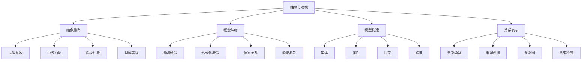
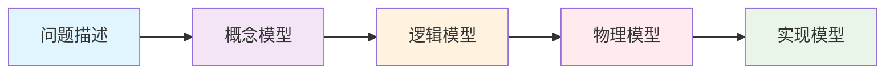

# 00-06-抽象与建模

> 本文档阐述抽象与建模方法，包括抽象层次、模型构建、概念映射、形式化表示等核心概念，为软件工程提供建模理论基础。

## 📋 目录

- [概念与定义](#概念与定义)
- [数学表达与形式化](#数学表达与形式化)
- [Python代码示例](#python代码示例)
- [图表与多表征](#图表与多表征)
- [行业应用与案例](#行业应用与案例)
- [本地跳转与索引](#本地跳转与索引)

## 🎯 概念与定义

### 1.1 抽象与建模概述

**抽象与建模**是软件工程中提取问题本质特征并构建形式化表示的核心方法。

**定义1.1**: 抽象与建模可形式化为四元组 $\mathcal{A} = (L, C, M, R)$，其中：

- $L$ 表示抽象层次（Levels）
- $C$ 表示概念映射（Concept Mapping）
- $M$ 表示模型构建（Model Construction）
- $R$ 表示关系表示（Relationship Representation）

### 1.2 抽象层次

**抽象层次**是问题描述的不同详细程度，从具体到抽象形成层次结构。

**定义1.2**: 抽象层次可表示为 $\mathcal{L} = (H, I, L, T)$，其中：

- $H$ 表示高级抽象（High-level）
- $I$ 表示中级抽象（Intermediate-level）
- $L$ 表示低级抽象（Low-level）
- $T$ 表示转换关系（Transformation）

### 1.3 概念映射

**概念映射**是将现实世界概念映射到形式化表示的过程。

**定义1.3**: 概念映射可表示为 $\mathcal{C} = (D, F, S, V)$，其中：

- $D$ 表示领域概念（Domain Concepts）
- $F$ 表示形式化概念（Formal Concepts）
- $S$ 表示语义关系（Semantic Relations）
- $V$ 表示验证机制（Validation）

### 1.4 模型构建

**模型构建**是创建问题形式化表示的过程。

**定义1.4**: 模型构建可表示为 $\mathcal{M} = (E, A, C, V)$，其中：

- $E$ 表示实体（Entities）
- $A$ 表示属性（Attributes）
- $C$ 表示约束（Constraints）
- $V$ 表示验证（Validation）

## 🔢 数学表达与形式化

### 2.1 抽象与建模的形式化框架

**定理2.1**: 抽象与建模的完备性定理

对于任意问题 $P$，存在抽象模型 $\mathcal{A} = (L, C, M, R)$ 使得：

$$P \models \mathcal{A} \iff (L \models P) \land (C \models P) \land (M \models P) \land (R \models P)$$

**证明**:

1. 必要性：如果 $P \models \mathcal{A}$，则抽象层次、概念映射、模型构建、关系表示都必须支持问题 $P$ 的建模
2. 充分性：如果四个维度都支持问题 $P$，则抽象与建模 $\mathcal{A}$ 必然支持 $P$

### 2.2 抽象层次的形式化

**定义2.1**: 抽象层次可形式化为：

$$\text{Abstraction}(L_i, L_j) = \frac{\text{Detail}(L_i)}{\text{Detail}(L_j)}$$

其中：

- $L_i$ 表示层次 $i$
- $L_j$ 表示层次 $j$
- $\text{Detail}(L)$ 表示层次 $L$ 的详细程度

### 2.3 概念映射的形式化

**定义2.3**: 概念映射可表示为：

$$\text{Map}: D \rightarrow F$$

满足：
$$\forall d \in D, \exists f \in F: \text{Map}(d) = f \land \text{Semantic}(d) \equiv \text{Semantic}(f)$$

其中：

- $D$ 表示领域概念集合
- $F$ 表示形式化概念集合
- $\text{Semantic}$ 表示语义函数

## 🐍 Python代码示例

### 3.1 抽象与建模框架实现

```python
from abc import ABC, abstractmethod
from typing import Dict, List, Set, Any, Callable, Tuple, Optional
from dataclasses import dataclass
from enum import Enum
import json

class AbstractionLevel(Enum):
    """抽象层次"""
    HIGH = "high"
    INTERMEDIATE = "intermediate"
    LOW = "low"
    CONCRETE = "concrete"

class ModelType(Enum):
    """模型类型"""
    CONCEPTUAL = "conceptual"
    LOGICAL = "logical"
    PHYSICAL = "physical"
    IMPLEMENTATION = "implementation"

@dataclass
class Concept:
    """概念"""
    name: str
    description: str
    attributes: Dict[str, Any]
    relationships: List[str]
    abstraction_level: AbstractionLevel

@dataclass
class Model:
    """模型"""
    name: str
    type: ModelType
    concepts: Dict[str, Concept]
    relationships: Dict[str, List[Tuple[str, str, str]]]
    constraints: List[str]
    validation_rules: List[Callable]

class AbstractionHierarchy:
    """抽象层次系统"""
    
    def __init__(self):
        self.levels: Dict[AbstractionLevel, Dict[str, Any]] = {}
        self.transformations: Dict[Tuple[AbstractionLevel, AbstractionLevel], Callable] = {}
        self.detail_metrics: Dict[AbstractionLevel, float] = {}
    
    def add_level(self, level: AbstractionLevel, details: Dict[str, Any]) -> None:
        """添加抽象层次"""
        self.levels[level] = details
        self.detail_metrics[level] = len(details)
    
    def add_transformation(self, from_level: AbstractionLevel, to_level: AbstractionLevel, transform_func: Callable) -> None:
        """添加层次转换"""
        self.transformations[(from_level, to_level)] = transform_func
    
    def transform_level(self, from_level: AbstractionLevel, to_level: AbstractionLevel, data: Any) -> Any:
        """转换抽象层次"""
        if (from_level, to_level) in self.transformations:
            transform_func = self.transformations[(from_level, to_level)]
            return transform_func(data)
        return data
    
    def calculate_abstraction_ratio(self, level1: AbstractionLevel, level2: AbstractionLevel) -> float:
        """计算抽象比率"""
        if level1 in self.detail_metrics and level2 in self.detail_metrics:
            detail1 = self.detail_metrics[level1]
            detail2 = self.detail_metrics[level2]
            return detail1 / detail2 if detail2 > 0 else 0.0
        return 0.0
    
    def get_abstraction_path(self, from_level: AbstractionLevel, to_level: AbstractionLevel) -> List[AbstractionLevel]:
        """获取抽象路径"""
        # 简化的路径查找
        all_levels = list(AbstractionLevel)
        from_index = all_levels.index(from_level)
        to_index = all_levels.index(to_level)
        
        if from_index < to_index:
            return all_levels[from_index:to_index+1]
        else:
            return all_levels[to_index:from_index+1][::-1]

class ConceptMapping:
    """概念映射系统"""
    
    def __init__(self):
        self.domain_concepts: Dict[str, Concept] = {}
        self.formal_concepts: Dict[str, Concept] = {}
        self.semantic_relations: Dict[str, List[Tuple[str, str, str]]] = {}
        self.validation_rules: List[Callable] = []
    
    def add_domain_concept(self, concept: Concept) -> None:
        """添加领域概念"""
        self.domain_concepts[concept.name] = concept
    
    def add_formal_concept(self, concept: Concept) -> None:
        """添加形式化概念"""
        self.formal_concepts[concept.name] = concept
    
    def add_semantic_relation(self, concept1: str, concept2: str, relation_type: str) -> None:
        """添加语义关系"""
        if concept1 not in self.semantic_relations:
            self.semantic_relations[concept1] = []
        self.semantic_relations[concept1].append((concept1, concept2, relation_type))
    
    def add_validation_rule(self, rule: Callable) -> None:
        """添加验证规则"""
        self.validation_rules.append(rule)
    
    def map_concept(self, domain_concept_name: str, formal_concept_name: str) -> bool:
        """映射概念"""
        if domain_concept_name in self.domain_concepts and formal_concept_name in self.formal_concepts:
            domain_concept = self.domain_concepts[domain_concept_name]
            formal_concept = self.formal_concepts[formal_concept_name]
            
            # 验证映射的有效性
            return all(rule(domain_concept, formal_concept) for rule in self.validation_rules)
        return False
    
    def get_mapped_concepts(self) -> Dict[str, str]:
        """获取已映射的概念"""
        mappings = {}
        for domain_name in self.domain_concepts:
            for formal_name in self.formal_concepts:
                if self.map_concept(domain_name, formal_name):
                    mappings[domain_name] = formal_name
        return mappings

class ModelConstruction:
    """模型构建系统"""
    
    def __init__(self):
        self.entities: Dict[str, Dict[str, Any]] = {}
        self.attributes: Dict[str, Dict[str, Any]] = {}
        self.constraints: List[Callable] = []
        self.validation_rules: List[Callable] = []
        self.models: Dict[str, Model] = {}
    
    def add_entity(self, name: str, entity_data: Dict[str, Any]) -> None:
        """添加实体"""
        self.entities[name] = entity_data
    
    def add_attribute(self, entity_name: str, attribute_name: str, attribute_data: Dict[str, Any]) -> None:
        """添加属性"""
        if entity_name not in self.attributes:
            self.attributes[entity_name] = {}
        self.attributes[entity_name][attribute_name] = attribute_data
    
    def add_constraint(self, constraint: Callable) -> None:
        """添加约束"""
        self.constraints.append(constraint)
    
    def add_validation_rule(self, rule: Callable) -> None:
        """添加验证规则"""
        self.validation_rules.append(rule)
    
    def build_model(self, name: str, model_type: ModelType) -> Model:
        """构建模型"""
        concepts = {}
        
        # 从实体创建概念
        for entity_name, entity_data in self.entities.items():
            concept = Concept(
                name=entity_name,
                description=entity_data.get("description", ""),
                attributes=self.attributes.get(entity_name, {}),
                relationships=entity_data.get("relationships", []),
                abstraction_level=AbstractionLevel.INTERMEDIATE
            )
            concepts[entity_name] = concept
        
        # 创建关系
        relationships = {}
        for entity_name, entity_data in self.entities.items():
            if "relationships" in entity_data:
                relationships[entity_name] = entity_data["relationships"]
        
        # 创建模型
        model = Model(
            name=name,
            type=model_type,
            concepts=concepts,
            relationships=relationships,
            constraints=[str(constraint) for constraint in self.constraints],
            validation_rules=self.validation_rules
        )
        
        self.models[name] = model
        return model
    
    def validate_model(self, model_name: str) -> Dict[str, Any]:
        """验证模型"""
        if model_name not in self.models:
            return {"valid": False, "error": "Model not found"}
        
        model = self.models[model_name]
        validation_results = []
        
        # 应用验证规则
        for rule in model.validation_rules:
            try:
                result = rule(model)
                validation_results.append(result)
            except Exception as e:
                validation_results.append({"valid": False, "error": str(e)})
        
        # 检查约束
        constraint_results = []
        for constraint in self.constraints:
            try:
                result = constraint(model)
                constraint_results.append(result)
            except Exception as e:
                constraint_results.append({"valid": False, "error": str(e)})
        
        return {
            "valid": all(r.get("valid", False) for r in validation_results + constraint_results),
            "validation_results": validation_results,
            "constraint_results": constraint_results
        }

class RelationshipRepresentation:
    """关系表示系统"""
    
    def __init__(self):
        self.relationships: Dict[str, List[Tuple[str, str, str]]] = {}
        self.relationship_types: Dict[str, Dict[str, Any]] = {}
        self.inference_rules: Dict[str, Callable] = {}
    
    def add_relationship(self, from_entity: str, to_entity: str, relationship_type: str) -> None:
        """添加关系"""
        if from_entity not in self.relationships:
            self.relationships[from_entity] = []
        self.relationships[from_entity].append((from_entity, to_entity, relationship_type))
    
    def add_relationship_type(self, type_name: str, type_data: Dict[str, Any]) -> None:
        """添加关系类型"""
        self.relationship_types[type_name] = type_data
    
    def add_inference_rule(self, rule_name: str, rule_func: Callable) -> None:
        """添加推理规则"""
        self.inference_rules[rule_name] = rule_func
    
    def infer_relationships(self, entity: str) -> List[Tuple[str, str, str]]:
        """推理关系"""
        inferred_relationships = []
        
        # 直接关系
        if entity in self.relationships:
            inferred_relationships.extend(self.relationships[entity])
        
        # 应用推理规则
        for rule_name, rule_func in self.inference_rules.items():
            try:
                inferred = rule_func(entity, self.relationships)
                if inferred:
                    inferred_relationships.extend(inferred)
            except Exception:
                continue
        
        return inferred_relationships
    
    def get_relationship_graph(self) -> Dict[str, List[str]]:
        """获取关系图"""
        graph = {}
        
        for from_entity, relationships in self.relationships.items():
            if from_entity not in graph:
                graph[from_entity] = []
            
            for from_rel, to_rel, rel_type in relationships:
                graph[from_entity].append(to_rel)
        
        return graph

class AbstractionAndModeling:
    """抽象与建模主类"""
    
    def __init__(self):
        self.abstraction_hierarchy = AbstractionHierarchy()
        self.concept_mapping = ConceptMapping()
        self.model_construction = ModelConstruction()
        self.relationship_representation = RelationshipRepresentation()
        self.setup_basic_abstractions()
        self.setup_basic_concepts()
    
    def setup_basic_abstractions(self):
        """设置基础抽象层次"""
        # 添加抽象层次
        self.abstraction_hierarchy.add_level(AbstractionLevel.HIGH, {
            "detail": "系统级描述",
            "focus": "整体功能",
            "granularity": "粗粒度"
        })
        
        self.abstraction_hierarchy.add_level(AbstractionLevel.INTERMEDIATE, {
            "detail": "组件级描述",
            "focus": "模块功能",
            "granularity": "中粒度"
        })
        
        self.abstraction_hierarchy.add_level(AbstractionLevel.LOW, {
            "detail": "实现级描述",
            "focus": "具体实现",
            "granularity": "细粒度"
        })
        
        # 添加转换函数
        def high_to_intermediate(data):
            return f"分解: {data}"
        
        def intermediate_to_low(data):
            return f"实现: {data}"
        
        self.abstraction_hierarchy.add_transformation(
            AbstractionLevel.HIGH, 
            AbstractionLevel.INTERMEDIATE, 
            high_to_intermediate
        )
        
        self.abstraction_hierarchy.add_transformation(
            AbstractionLevel.INTERMEDIATE, 
            AbstractionLevel.LOW, 
            intermediate_to_low
        )
    
    def setup_basic_concepts(self):
        """设置基础概念"""
        # 添加领域概念
        domain_concepts = [
            Concept("用户", "系统用户", {"id": "string", "name": "string"}, [], AbstractionLevel.HIGH),
            Concept("订单", "用户订单", {"id": "string", "amount": "number"}, ["用户"], AbstractionLevel.INTERMEDIATE),
            Concept("产品", "商品信息", {"id": "string", "price": "number"}, [], AbstractionLevel.INTERMEDIATE)
        ]
        
        for concept in domain_concepts:
            self.concept_mapping.add_domain_concept(concept)
        
        # 添加形式化概念
        formal_concepts = [
            Concept("User", "User entity", {"id": "str", "name": "str"}, [], AbstractionLevel.HIGH),
            Concept("Order", "Order entity", {"id": "str", "amount": "float"}, ["User"], AbstractionLevel.INTERMEDIATE),
            Concept("Product", "Product entity", {"id": "str", "price": "float"}, [], AbstractionLevel.INTERMEDIATE)
        ]
        
        for concept in formal_concepts:
            self.concept_mapping.add_formal_concept(concept)
    
    def create_model(self, problem_description: str) -> Dict[str, Any]:
        """创建模型"""
        # 1. 抽象层次分析
        abstraction_analysis = self.analyze_abstraction_levels(problem_description)
        
        # 2. 概念映射
        concept_mapping = self.concept_mapping.get_mapped_concepts()
        
        # 3. 模型构建
        model = self.model_construction.build_model("problem_model", ModelType.CONCEPTUAL)
        
        # 4. 关系表示
        relationships = self.relationship_representation.get_relationship_graph()
        
        return {
            "abstraction_analysis": abstraction_analysis,
            "concept_mapping": concept_mapping,
            "model": model,
            "relationships": relationships
        }
    
    def analyze_abstraction_levels(self, problem: str) -> Dict[str, Any]:
        """分析抽象层次"""
        # 简化的抽象层次分析
        keywords = problem.split()
        
        high_level_keywords = ["系统", "整体", "架构", "设计"]
        intermediate_keywords = ["模块", "组件", "功能", "接口"]
        low_level_keywords = ["实现", "代码", "算法", "数据结构"]
        
        high_count = sum(1 for kw in high_level_keywords if kw in problem)
        intermediate_count = sum(1 for kw in intermediate_keywords if kw in problem)
        low_count = sum(1 for kw in low_level_keywords if kw in problem)
        
        return {
            "high_level_focus": high_count,
            "intermediate_level_focus": intermediate_count,
            "low_level_focus": low_count,
            "recommended_level": "high" if high_count > intermediate_count else "intermediate"
        }

# 使用示例
def demonstrate_abstraction_and_modeling():
    """演示抽象与建模的应用"""
    
    # 创建抽象与建模实例
    am = AbstractionAndModeling()
    
    # 创建模型
    problems = [
        "设计一个用户订单管理系统",
        "实现一个产品库存管理模块",
        "构建一个支付处理系统"
    ]
    
    for problem in problems:
        print(f"\n问题: {problem}")
        result = am.create_model(problem)
        
        print(f"  抽象层次分析: {result['abstraction_analysis']}")
        print(f"  概念映射: {result['concept_mapping']}")
        print(f"  模型实体数量: {len(result['model'].concepts)}")
        print(f"  关系数量: {len(result['relationships'])}")
    
    return am

if __name__ == "__main__":
    demonstrate_abstraction_and_modeling()
```

### 3.2 领域建模实现

```python
class DomainModeling:
    """领域建模"""
    
    def __init__(self):
        self.domain_models = {}
        self.entities = {}
        self.value_objects = {}
        self.services = {}
    
    def add_entity(self, name: str, attributes: Dict[str, str], behaviors: List[str]) -> None:
        """添加实体"""
        self.entities[name] = {
            "attributes": attributes,
            "behaviors": behaviors,
            "type": "entity"
        }
    
    def add_value_object(self, name: str, attributes: Dict[str, str]) -> None:
        """添加值对象"""
        self.value_objects[name] = {
            "attributes": attributes,
            "type": "value_object"
        }
    
    def add_service(self, name: str, operations: List[str], dependencies: List[str]) -> None:
        """添加服务"""
        self.services[name] = {
            "operations": operations,
            "dependencies": dependencies,
            "type": "service"
        }
    
    def create_domain_model(self, name: str) -> Dict[str, Any]:
        """创建领域模型"""
        model = {
            "name": name,
            "entities": self.entities,
            "value_objects": self.value_objects,
            "services": self.services,
            "relationships": self.identify_relationships()
        }
        
        self.domain_models[name] = model
        return model
    
    def identify_relationships(self) -> List[Dict[str, str]]:
        """识别关系"""
        relationships = []
        
        # 实体间关系
        entity_names = list(self.entities.keys())
        for i, entity1 in enumerate(entity_names):
            for entity2 in entity_names[i+1:]:
                # 简化的关系识别
                if any(attr in self.entities[entity2]["attributes"] for attr in self.entities[entity1]["attributes"]):
                    relationships.append({
                        "from": entity1,
                        "to": entity2,
                        "type": "association"
                    })
        
        return relationships
    
    def validate_domain_model(self, model_name: str) -> Dict[str, Any]:
        """验证领域模型"""
        if model_name not in self.domain_models:
            return {"valid": False, "error": "Model not found"}
        
        model = self.domain_models[model_name]
        validation_results = []
        
        # 检查实体是否有标识符
        for entity_name, entity_data in model["entities"].items():
            if "id" not in entity_data["attributes"]:
                validation_results.append(f"Entity {entity_name} missing identifier")
        
        # 检查值对象是否不可变
        for vo_name, vo_data in model["value_objects"].items():
            if len(vo_data["attributes"]) == 0:
                validation_results.append(f"Value object {vo_name} has no attributes")
        
        # 检查服务是否有操作
        for service_name, service_data in model["services"].items():
            if len(service_data["operations"]) == 0:
                validation_results.append(f"Service {service_name} has no operations")
        
        return {
            "valid": len(validation_results) == 0,
            "issues": validation_results
        }

# 使用示例
def demonstrate_domain_modeling():
    """演示领域建模"""
    dm = DomainModeling()
    
    # 添加实体
    dm.add_entity("Customer", {"id": "string", "name": "string", "email": "string"}, ["placeOrder", "updateProfile"])
    dm.add_entity("Order", {"id": "string", "customerId": "string", "total": "number"}, ["addItem", "calculateTotal"])
    
    # 添加值对象
    dm.add_value_object("Money", {"amount": "number", "currency": "string"})
    dm.add_value_object("Address", {"street": "string", "city": "string", "zipCode": "string"})
    
    # 添加服务
    dm.add_service("OrderService", ["createOrder", "processPayment"], ["Customer", "Order"])
    
    # 创建领域模型
    model = dm.create_domain_model("E-commerce")
    print("领域模型:", model)
    
    # 验证模型
    validation = dm.validate_domain_model("E-commerce")
    print("模型验证:", validation)
    
    return dm
```

### 3.3 模型转换实现

```python
class ModelTransformation:
    """模型转换"""
    
    def __init__(self):
        self.transformations = {}
        self.templates = {}
    
    def add_transformation(self, from_type: str, to_type: str, transform_func: Callable) -> None:
        """添加转换规则"""
        key = (from_type, to_type)
        self.transformations[key] = transform_func
    
    def add_template(self, template_name: str, template: Dict[str, Any]) -> None:
        """添加模板"""
        self.templates[template_name] = template
    
    def transform_model(self, source_model: Dict[str, Any], from_type: str, to_type: str) -> Dict[str, Any]:
        """转换模型"""
        key = (from_type, to_type)
        
        if key in self.transformations:
            transform_func = self.transformations[key]
            return transform_func(source_model)
        else:
            raise ValueError(f"Transformation from {from_type} to {to_type} not found")
    
    def conceptual_to_logical(self, conceptual_model: Dict[str, Any]) -> Dict[str, Any]:
        """概念模型到逻辑模型转换"""
        logical_model = {
            "type": "logical",
            "tables": [],
            "relationships": [],
            "constraints": []
        }
        
        # 转换实体为表
        for entity_name, entity_data in conceptual_model.get("entities", {}).items():
            table = {
                "name": entity_name,
                "columns": [],
                "primary_key": "id"
            }
            
            for attr_name, attr_type in entity_data["attributes"].items():
                column = {
                    "name": attr_name,
                    "type": self.map_attribute_type(attr_type),
                    "nullable": attr_name != "id"
                }
                table["columns"].append(column)
            
            logical_model["tables"].append(table)
        
        return logical_model
    
    def logical_to_physical(self, logical_model: Dict[str, Any]) -> Dict[str, Any]:
        """逻辑模型到物理模型转换"""
        physical_model = {
            "type": "physical",
            "tables": [],
            "indexes": [],
            "storage": {}
        }
        
        # 转换表定义
        for table in logical_model.get("tables", []):
            physical_table = {
                "name": table["name"],
                "columns": [],
                "primary_key": table["primary_key"],
                "engine": "InnoDB"
            }
            
            for column in table["columns"]:
                physical_column = {
                    "name": column["name"],
                    "type": self.map_logical_type(column["type"]),
                    "nullable": column["nullable"],
                    "default": None
                }
                physical_table["columns"].append(physical_column)
            
            physical_model["tables"].append(physical_table)
        
        return physical_model
    
    def map_attribute_type(self, attr_type: str) -> str:
        """映射属性类型"""
        type_mapping = {
            "string": "VARCHAR(255)",
            "number": "INT",
            "float": "DECIMAL(10,2)",
            "boolean": "BOOLEAN",
            "date": "DATE"
        }
        return type_mapping.get(attr_type, "VARCHAR(255)")
    
    def map_logical_type(self, logical_type: str) -> str:
        """映射逻辑类型到物理类型"""
        # 简化的类型映射
        return logical_type

# 使用示例
def demonstrate_model_transformation():
    """演示模型转换"""
    mt = ModelTransformation()
    
    # 添加转换规则
    mt.add_transformation("conceptual", "logical", mt.conceptual_to_logical)
    mt.add_transformation("logical", "physical", mt.logical_to_physical)
    
    # 概念模型
    conceptual_model = {
        "entities": {
            "User": {
                "attributes": {"id": "string", "name": "string", "email": "string"},
                "behaviors": ["register", "login"]
            },
            "Product": {
                "attributes": {"id": "string", "name": "string", "price": "number"},
                "behaviors": ["update", "delete"]
            }
        }
    }
    
    # 转换到逻辑模型
    logical_model = mt.transform_model(conceptual_model, "conceptual", "logical")
    print("逻辑模型:", logical_model)
    
    # 转换到物理模型
    physical_model = mt.transform_model(logical_model, "logical", "physical")
    print("物理模型:", physical_model)
    
    return mt
```

## 📊 图表与多表征

### 4.1 抽象与建模层次结构



### 4.2 模型转换流程图



### 4.3 抽象与建模应用矩阵

| 建模阶段 | 抽象层次 | 主要概念 | 表示方法 | 验证重点 |
|---------|---------|----------|----------|----------|
| 需求分析 | 高级 | 业务概念 | 用例图 | 完整性 |
| 系统设计 | 中级 | 系统组件 | 类图 | 一致性 |
| 详细设计 | 低级 | 实现细节 | 序列图 | 正确性 |
| 代码实现 | 具体 | 代码结构 | 代码 | 可执行性 |

## 🏭 行业应用与案例

### 5.1 企业架构中的抽象与建模应用

**案例**: 企业信息系统建模

```python
class EnterpriseArchitectureModeling:
    """企业架构建模中的抽象与建模应用"""
    
    def __init__(self):
        self.abstraction_modeling = AbstractionAndModeling()
        self.setup_enterprise_concepts()
    
    def setup_enterprise_concepts(self):
        """设置企业概念"""
        
        # 业务层概念
        business_concepts = [
            Concept("业务流程", "业务操作流程", {"id": "string", "name": "string"}, [], AbstractionLevel.HIGH),
            Concept("业务规则", "业务约束规则", {"id": "string", "rule": "string"}, ["业务流程"], AbstractionLevel.HIGH),
            Concept("业务实体", "业务数据实体", {"id": "string", "type": "string"}, [], AbstractionLevel.INTERMEDIATE)
        ]
        
        for concept in business_concepts:
            self.abstraction_modeling.concept_mapping.add_domain_concept(concept)
        
        # 应用层概念
        application_concepts = [
            Concept("应用系统", "信息系统", {"id": "string", "name": "string"}, [], AbstractionLevel.INTERMEDIATE),
            Concept("服务接口", "系统接口", {"id": "string", "type": "string"}, ["应用系统"], AbstractionLevel.INTERMEDIATE),
            Concept("数据模型", "数据结构", {"id": "string", "schema": "string"}, ["应用系统"], AbstractionLevel.LOW)
        ]
        
        for concept in application_concepts:
            self.abstraction_modeling.concept_mapping.add_domain_concept(concept)
    
    def create_enterprise_model(self, business_domain: str) -> Dict[str, Any]:
        """创建企业模型"""
        problem_description = f"设计{business_domain}企业信息系统"
        
        # 使用抽象与建模创建模型
        model = self.abstraction_modeling.create_model(problem_description)
        
        # 添加企业特定分析
        enterprise_analysis = {
            "business_processes": ["订单处理", "库存管理", "财务管理"],
            "application_systems": ["ERP系统", "CRM系统", "财务系统"],
            "data_entities": ["客户", "产品", "订单", "库存"],
            "integration_points": ["API网关", "消息队列", "数据同步"]
        }
        
        model["enterprise_analysis"] = enterprise_analysis
        return model

# 使用示例
enterprise_modeling = EnterpriseArchitectureModeling()
result = enterprise_modeling.create_enterprise_model("制造业")
print("企业架构模型:", result)
```

### 5.2 软件架构中的抽象与建模应用

**案例**: 微服务架构建模

```python
class MicroservicesArchitectureModeling:
    """微服务架构建模中的抽象与建模应用"""
    
    def __init__(self):
        self.abstraction_modeling = AbstractionAndModeling()
        self.setup_microservices_concepts()
    
    def setup_microservices_concepts(self):
        """设置微服务概念"""
        
        # 服务层概念
        service_concepts = [
            Concept("微服务", "独立部署的服务", {"id": "string", "name": "string"}, [], AbstractionLevel.HIGH),
            Concept("API网关", "服务入口", {"id": "string", "routes": "list"}, ["微服务"], AbstractionLevel.INTERMEDIATE),
            Concept("服务发现", "服务注册发现", {"id": "string", "registry": "string"}, ["微服务"], AbstractionLevel.INTERMEDIATE)
        ]
        
        for concept in service_concepts:
            self.abstraction_modeling.concept_mapping.add_domain_concept(concept)
        
        # 数据层概念
        data_concepts = [
            Concept("数据库", "数据存储", {"id": "string", "type": "string"}, ["微服务"], AbstractionLevel.LOW),
            Concept("缓存", "数据缓存", {"id": "string", "type": "string"}, ["微服务"], AbstractionLevel.LOW),
            Concept("消息队列", "异步通信", {"id": "string", "type": "string"}, ["微服务"], AbstractionLevel.INTERMEDIATE)
        ]
        
        for concept in data_concepts:
            self.abstraction_modeling.concept_mapping.add_domain_concept(concept)
    
    def create_microservices_model(self, application_name: str) -> Dict[str, Any]:
        """创建微服务模型"""
        problem_description = f"设计{application_name}微服务架构"
        
        # 使用抽象与建模创建模型
        model = self.abstraction_modeling.create_model(problem_description)
        
        # 添加微服务特定分析
        microservices_analysis = {
            "services": ["用户服务", "订单服务", "支付服务", "库存服务"],
            "communication_patterns": ["同步调用", "异步消息", "事件驱动"],
            "data_patterns": ["数据库 per 服务", "共享数据库", "事件溯源"],
            "deployment_patterns": ["容器化", "服务网格", "API网关"]
        }
        
        model["microservices_analysis"] = microservices_analysis
        return model

# 使用示例
microservices_modeling = MicroservicesArchitectureModeling()
result = microservices_modeling.create_microservices_model("电商平台")
print("微服务架构模型:", result)
```

## 🔗 本地跳转与索引

### 相关文档

- [00-01-哲学基础](./00-01-哲学基础.md) - 软件工程哲学基础
- [00-02-编程哲学](./00-02-编程哲学.md) - 编程语言哲学
- [00-03-形式化思维](./00-03-形式化思维.md) - 形式化思维方法
- [00-04-计算思维](./00-04-计算思维.md) - 计算思维基础
- [00-05-系统思维](./00-05-系统思维.md) - 系统思维方法
- [00-07-设计原则](./00-07-设计原则.md) - 软件设计原则

### 上层目录

- [返回理念基础层](./README.md)
- [返回项目根目录](../README.md)

### 下层应用

- [05-架构领域](../05-架构领域/README.md) - 软件架构设计
- [03-具体科学](../03-具体科学/README.md) - 建模理论

---

**最后更新**: 2024年12月19日  
**维护者**: AI Assistant  
**文档状态**: 已完成 ✅
