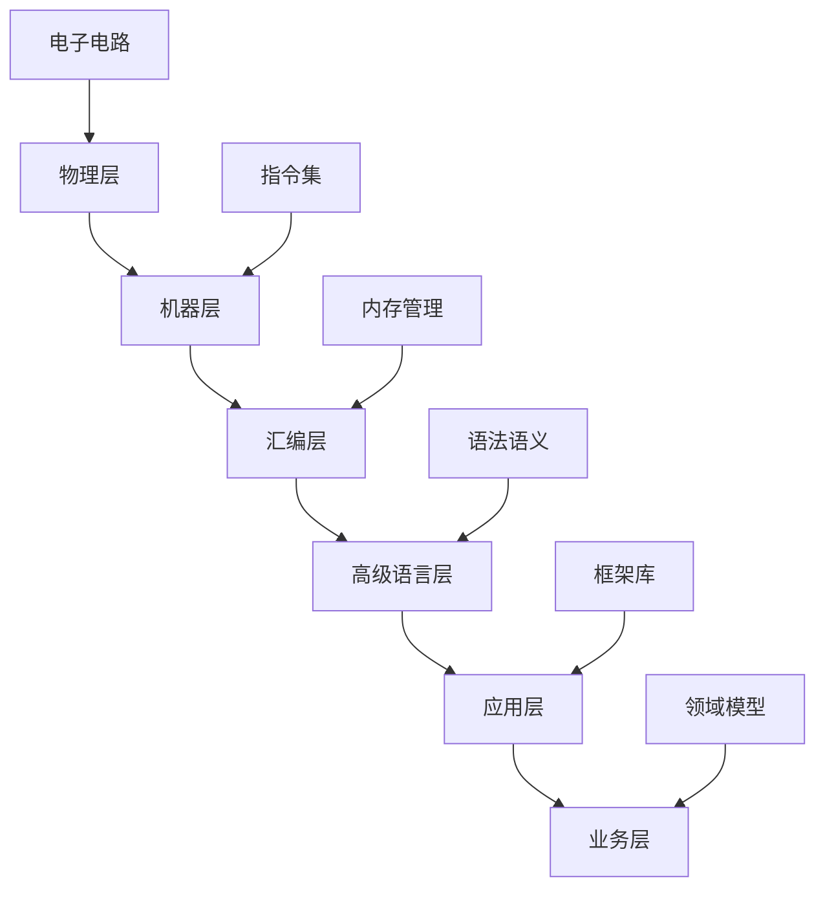

# 00.01.01 编程本质

## 📋 概述

编程本质是软件工程的基础理念，探讨编程的哲学内涵、形式化定义和核心概念。

## 🎯 核心概念

### 1. 编程的形式化定义

编程可以形式化定义为：

```math
编程系统 P = (L, S, E, M)
```

其中：

- **L** (Language): 编程语言集合
- **S** (Syntax): 语法规则集合  
- **E** (Execution): 执行语义
- **M** (Model): 计算模型

### 2. 计算模型

#### 2.1 图灵机模型

```python
from typing import Dict, List, Tuple, Optional
from enum import Enum

class TapeSymbol(Enum):
    BLANK = "_"
    ZERO = "0"
    ONE = "1"

class Direction(Enum):
    LEFT = "L"
    RIGHT = "R"
    STAY = "S"

class State(Enum):
    START = "q0"
    ACCEPT = "q_accept"
    REJECT = "q_reject"

class TuringMachine:
    """
    图灵机实现 - 计算模型的核心
    """
    def __init__(self, 
                 states: set,
                 alphabet: set,
                 tape_alphabet: set,
                 transition_function: Dict[Tuple, Tuple],
                 start_state: State,
                 accept_states: set,
                 reject_states: set):
        self.states = states
        self.alphabet = alphabet
        self.tape_alphabet = tape_alphabet
        self.transition_function = transition_function
        self.start_state = start_state
        self.accept_states = accept_states
        self.reject_states = reject_states
        self.tape = [TapeSymbol.BLANK]
        self.head_position = 0
        self.current_state = start_state
    
    def step(self) -> bool:
        """
        执行一步计算
        返回True表示继续，False表示停机
        """
        if self.current_state in self.accept_states:
            return False
        if self.current_state in self.reject_states:
            return False
            
        current_symbol = self.tape[self.head_position]
        key = (self.current_state, current_symbol)
        
        if key not in self.transition_function:
            return False
            
        new_state, new_symbol, direction = self.transition_function[key]
        self.tape[self.head_position] = new_symbol
        self.current_state = new_state
        
        # 移动读写头
        if direction == Direction.LEFT:
            self.head_position = max(0, self.head_position - 1)
        elif direction == Direction.RIGHT:
            self.head_position += 1
            if self.head_position >= len(self.tape):
                self.tape.append(TapeSymbol.BLANK)
        
        return True
    
    def run(self, input_string: str) -> bool:
        """
        运行图灵机
        返回True表示接受，False表示拒绝
        """
        # 初始化磁带
        self.tape = [TapeSymbol.BLANK] + [TapeSymbol(c) for c in input_string] + [TapeSymbol.BLANK]
        self.head_position = 1
        self.current_state = self.start_state
        
        # 执行计算
        while self.step():
            pass
            
        return self.current_state in self.accept_states

# 示例：识别回文串的图灵机
def create_palindrome_turing_machine():
    """创建识别回文串的图灵机"""
    states = {State.START, State("q1"), State("q2"), State("q3"), State.ACCEPT, State.REJECT}
    alphabet = {"0", "1"}
    tape_alphabet = {TapeSymbol.ZERO, TapeSymbol.ONE, TapeSymbol.BLANK, "X", "Y"}
    
    # 简化的转移函数（实际实现更复杂）
    transition_function = {
        (State.START, TapeSymbol.ZERO): (State("q1"), "X", Direction.RIGHT),
        (State.START, TapeSymbol.ONE): (State("q1"), "Y", Direction.RIGHT),
        # ... 更多转移规则
    }
    
    return TuringMachine(
        states=states,
        alphabet=alphabet,
        tape_alphabet=tape_alphabet,
        transition_function=transition_function,
        start_state=State.START,
        accept_states={State.ACCEPT},
        reject_states={State.REJECT}
    )

#### 2.2 Lambda演算模型

```python
from abc import ABC, abstractmethod
from typing import Union, Callable, Any

class LambdaTerm(ABC):
    """Lambda项抽象基类"""
    
    @abstractmethod
    def reduce(self) -> 'LambdaTerm':
        """归约操作"""
        pass
    
    @abstractmethod
    def is_normal_form(self) -> bool:
        """判断是否为范式"""
        pass

class Variable(LambdaTerm):
    """变量"""
    def __init__(self, name: str):
        self.name = name
    
    def reduce(self) -> 'LambdaTerm':
        return self
    
    def is_normal_form(self) -> bool:
        return True
    
    def __str__(self):
        return self.name

class Abstraction(LambdaTerm):
    """抽象（函数定义）"""
    def __init__(self, parameter: str, body: LambdaTerm):
        self.parameter = parameter
        self.body = body
    
    def reduce(self) -> 'LambdaTerm':
        return Abstraction(self.parameter, self.body.reduce())
    
    def is_normal_form(self) -> bool:
        return self.body.is_normal_form()
    
    def __str__(self):
        return f"λ{self.parameter}.{self.body}"

class Application(LambdaTerm):
    """应用（函数调用）"""
    def __init__(self, function: LambdaTerm, argument: LambdaTerm):
        self.function = function
        self.argument = argument
    
    def reduce(self) -> 'LambdaTerm':
        # Beta归约
        if isinstance(self.function, Abstraction):
            return self._beta_reduce()
        else:
            # 先归约函数部分
            reduced_function = self.function.reduce()
            if reduced_function != self.function:
                return Application(reduced_function, self.argument)
            # 再归约参数部分
            reduced_argument = self.argument.reduce()
            if reduced_argument != self.argument:
                return Application(self.function, reduced_argument)
            return self
    
    def _beta_reduce(self) -> LambdaTerm:
        """Beta归约：替换参数"""
        if isinstance(self.function, Abstraction):
            return self._substitute(self.function.body, self.function.parameter, self.argument)
        return self
    
    def _substitute(self, term: LambdaTerm, var_name: str, replacement: LambdaTerm) -> LambdaTerm:
        """变量替换"""
        if isinstance(term, Variable):
            if term.name == var_name:
                return replacement
            return term
        elif isinstance(term, Abstraction):
            if term.parameter == var_name:
                return term
            return Abstraction(term.parameter, self._substitute(term.body, var_name, replacement))
        elif isinstance(term, Application):
            return Application(
                self._substitute(term.function, var_name, replacement),
                self._substitute(term.argument, var_name, replacement)
            )
        return term
    
    def is_normal_form(self) -> bool:
        return False
    
    def __str__(self):
        return f"({self.function} {self.argument})"

# 示例：Church数
def church_numeral(n: int) -> Abstraction:
    """Church数的实现"""
    if n == 0:
        return Abstraction("f", Abstraction("x", Variable("x")))
    else:
        return Abstraction("f", Abstraction("x", 
            Application(Variable("f"), church_numeral(n-1).body)))

def church_successor() -> Abstraction:
    """后继函数"""
    return Abstraction("n", Abstraction("f", Abstraction("x",
        Application(Variable("f"), 
            Application(Application(Variable("n"), Variable("f")), Variable("x"))))))

# 测试
if __name__ == "__main__":
    # 创建Church数2
    church_2 = church_numeral(2)
    print(f"Church 2: {church_2}")
    
    # 后继函数
    succ = church_successor()
    print(f"Successor: {succ}")
    
    # 应用后继函数到Church数1
    church_1 = church_numeral(1)
    successor_application = Application(succ, church_1)
    print(f"Successor applied to 1: {successor_application}")
```

### 3. 编程范式

#### 3.1 函数式编程

```python
from typing import TypeVar, Callable, List, Optional
from functools import reduce, partial
import operator

T = TypeVar('T')
U = TypeVar('U')

class FunctionalProgramming:
    """
    函数式编程核心概念实现
    """
    
    @staticmethod
    def map(func: Callable[[T], U], iterable: List[T]) -> List[U]:
        """
        映射函数 - 函数式编程的核心操作
        f: A → B 应用到集合A的每个元素
        """
        return [func(x) for x in iterable]
    
    @staticmethod
    def filter(predicate: Callable[[T], bool], iterable: List[T]) -> List[T]:
        """
        过滤函数 - 基于谓词选择元素
        """
        return [x for x in iterable if predicate(x)]
    
    @staticmethod
    def reduce(func: Callable[[U, T], U], iterable: List[T], initial: Optional[U] = None) -> U:
        """
        归约函数 - 将集合归约为单个值
        """
        if initial is None:
            return reduce(func, iterable)
        return reduce(func, iterable, initial)
    
    @staticmethod
    def compose(*functions: Callable) -> Callable:
        """
        函数组合 - 数学中的复合函数
        (f ∘ g)(x) = f(g(x))
        """
        def composed(x):
            result = x
            for f in reversed(functions):
                result = f(result)
            return result
        return composed
    
    @staticmethod
    def curry(func: Callable, *args, **kwargs):
        """
        柯里化 - 将多参数函数转换为单参数函数序列
        """
        return partial(func, *args, **kwargs)

# 示例：函数式编程实践
def functional_programming_examples():
    """函数式编程示例"""
    
    # 1. 纯函数
    def pure_add(a: int, b: int) -> int:
        """纯函数：相同输入总是产生相同输出，无副作用"""
        return a + b
    
    # 2. 高阶函数
    def apply_twice(func: Callable[[T], T], x: T) -> T:
        """高阶函数：接受函数作为参数"""
        return func(func(x))
    
    # 3. 不可变性
    class ImmutableList:
        """不可变列表实现"""
        def __init__(self, items: List[T]):
            self._items = tuple(items)  # 使用tuple确保不可变
        
        def append(self, item: T) -> 'ImmutableList':
            """返回新列表而不是修改原列表"""
            return ImmutableList(list(self._items) + [item])
        
        def __getitem__(self, index: int) -> T:
            return self._items[index]
        
        def __len__(self) -> int:
            return len(self._items)
    
    # 4. 函数式数据处理管道
    numbers = [1, 2, 3, 4, 5, 6, 7, 8, 9, 10]
    
    # 函数式管道：过滤偶数 → 平方 → 求和
    pipeline = FunctionalProgramming.compose(
        lambda x: FunctionalProgramming.reduce(operator.add, x, 0),  # 求和
        lambda x: FunctionalProgramming.map(lambda n: n ** 2, x),    # 平方
        lambda x: FunctionalProgramming.filter(lambda n: n % 2 == 0, x)  # 过滤偶数
    )
    
    result = pipeline(numbers)
    print(f"函数式管道结果: {result}")  # 应该输出偶数的平方和
    
    return result

# 测试
if __name__ == "__main__":
    functional_programming_examples()
```

#### 3.2 面向对象编程

```python
from abc import ABC, abstractmethod
from typing import Any, Dict, List, Optional
from dataclasses import dataclass
from enum import Enum

class ProgrammingParadigm(Enum):
    """编程范式枚举"""
    PROCEDURAL = "procedural"
    OBJECT_ORIENTED = "object_oriented"
    FUNCTIONAL = "functional"
    LOGIC = "logic"
    CONCURRENT = "concurrent"

@dataclass
class ClassDefinition:
    """类定义"""
    name: str
    attributes: Dict[str, Any]
    methods: Dict[str, callable]
    inheritance: Optional[str] = None
    interfaces: List[str] = None

class ObjectOrientedPrinciples:
    """
    面向对象编程核心原则
    """
    
    @staticmethod
    def encapsulation_example():
        """封装示例"""
        class BankAccount:
            def __init__(self, account_number: str, balance: float = 0.0):
                self._account_number = account_number  # 私有属性
                self._balance = balance
                self._transaction_history = []
            
            @property
            def balance(self) -> float:
                """余额的只读访问"""
                return self._balance
            
            @property
            def account_number(self) -> str:
                """账户号的只读访问"""
                return self._account_number
            
            def deposit(self, amount: float) -> bool:
                """存款操作"""
                if amount > 0:
                    self._balance += amount
                    self._transaction_history.append(f"Deposit: +{amount}")
                    return True
                return False
            
            def withdraw(self, amount: float) -> bool:
                """取款操作"""
                if 0 < amount <= self._balance:
                    self._balance -= amount
                    self._transaction_history.append(f"Withdraw: -{amount}")
                    return True
                return False
            
            def get_transaction_history(self) -> List[str]:
                """获取交易历史"""
                return self._transaction_history.copy()  # 返回副本保护数据
        
        return BankAccount
    
    @staticmethod
    def inheritance_example():
        """继承示例"""
        class Animal(ABC):
            """抽象基类"""
            def __init__(self, name: str, age: int):
                self.name = name
                self.age = age
            
            @abstractmethod
            def make_sound(self) -> str:
                """抽象方法"""
                pass
            
            def get_info(self) -> str:
                """通用方法"""
                return f"{self.name} is {self.age} years old"
        
        class Dog(Animal):
            """继承Animal类"""
            def __init__(self, name: str, age: int, breed: str):
                super().__init__(name, age)
                self.breed = breed
            
            def make_sound(self) -> str:
                return "Woof!"
            
            def fetch(self) -> str:
                """Dog特有的方法"""
                return f"{self.name} is fetching the ball"
        
        class Cat(Animal):
            """继承Animal类"""
            def __init__(self, name: str, age: int, color: str):
                super().__init__(name, age)
                self.color = color
            
            def make_sound(self) -> str:
                return "Meow!"
            
            def climb(self) -> str:
                """Cat特有的方法"""
                return f"{self.name} is climbing the tree"
        
        return Animal, Dog, Cat
    
    @staticmethod
    def polymorphism_example():
        """多态示例"""
        class Shape(ABC):
            @abstractmethod
            def area(self) -> float:
                pass
            
            @abstractmethod
            def perimeter(self) -> float:
                pass
        
        class Circle(Shape):
            def __init__(self, radius: float):
                self.radius = radius
            
            def area(self) -> float:
                import math
                return math.pi * self.radius ** 2
            
            def perimeter(self) -> float:
                import math
                return 2 * math.pi * self.radius
        
        class Rectangle(Shape):
            def __init__(self, width: float, height: float):
                self.width = width
                self.height = height
            
            def area(self) -> float:
                return self.width * self.height
            
            def perimeter(self) -> float:
                return 2 * (self.width + self.height)
        
        class Triangle(Shape):
            def __init__(self, a: float, b: float, c: float):
                self.a = a
                self.b = b
                self.c = c
            
            def area(self) -> float:
                # 海伦公式
                s = (self.a + self.b + self.c) / 2
                import math
                return math.sqrt(s * (s - self.a) * (s - self.b) * (s - self.c))
            
            def perimeter(self) -> float:
                return self.a + self.b + self.c
        
        def calculate_total_area(shapes: List[Shape]) -> float:
            """多态函数：可以处理任何Shape类型"""
            return sum(shape.area() for shape in shapes)
        
        return Shape, Circle, Rectangle, Triangle, calculate_total_area

# 测试面向对象原则
def test_oop_principles():
    """测试面向对象编程原则"""
    
    # 1. 封装测试
    BankAccount = ObjectOrientedPrinciples.encapsulation_example()
    account = BankAccount("12345", 1000.0)
    account.deposit(500)
    account.withdraw(200)
    print(f"账户余额: {account.balance}")
    print(f"交易历史: {account.get_transaction_history()}")
    
    # 2. 继承测试
    Animal, Dog, Cat = ObjectOrientedPrinciples.inheritance_example()
    dog = Dog("Buddy", 3, "Golden Retriever")
    cat = Cat("Whiskers", 2, "Orange")
    
    print(f"狗: {dog.get_info()}, 声音: {dog.make_sound()}")
    print(f"猫: {cat.get_info()}, 声音: {cat.make_sound()}")
    
    # 3. 多态测试
    Shape, Circle, Rectangle, Triangle, calculate_total_area = ObjectOrientedPrinciples.polymorphism_example()
    
    shapes = [
        Circle(5),
        Rectangle(4, 6),
        Triangle(3, 4, 5)
    ]
    
    total_area = calculate_total_area(shapes)
    print(f"所有图形的总面积: {total_area:.2f}")

if __name__ == "__main__":
    test_oop_principles()
```

## 🔬 形式化理论

### 1. 计算理论

#### 1.1 可计算性理论

```math
可计算函数定义：
函数 f: ℕ → ℕ 是可计算的，当且仅当存在图灵机 M，使得：
∀x ∈ ℕ: M(x) ↓ 且 M(x) = f(x)

其中：
- M(x) ↓ 表示图灵机M在输入x上停机
- M(x) = f(x) 表示输出等于函数值
```

#### 1.2 计算复杂性理论

```math
时间复杂度定义：
对于算法A，其时间复杂度T(n)定义为：
T(n) = max{t_A(x) | |x| = n}

其中：
- t_A(x) 是算法A在输入x上的执行时间
- |x| 是输入x的长度
- n 是输入规模
```

### 2. 类型理论

#### 2.1 简单类型系统

```python
from typing import TypeVar, Generic, Union, Optional
from enum import Enum

class Type(ABC):
    """类型抽象基类"""
    pass

class BasicType(Type):
    """基本类型"""
    def __init__(self, name: str):
        self.name = name
    
    def __str__(self):
        return self.name

class FunctionType(Type):
    """函数类型"""
    def __init__(self, domain: Type, codomain: Type):
        self.domain = domain
        self.codomain = codomain
    
    def __str__(self):
        return f"({self.domain} → {self.codomain})"

class ProductType(Type):
    """积类型（元组）"""
    def __init__(self, types: List[Type]):
        self.types = types
    
    def __str__(self):
        return f"({' × '.join(str(t) for t in self.types)})"

class SumType(Type):
    """和类型（联合类型）"""
    def __init__(self, types: List[Type]):
        self.types = types
    
    def __str__(self):
        return f"({' + '.join(str(t) for t in self.types)})"

# 基本类型
Int = BasicType("Int")
Bool = BasicType("Bool")
String = BasicType("String")

# 类型检查器
class TypeChecker:
    """简单类型检查器"""
    
    def __init__(self):
        self.environment = {}
    
    def check_type(self, expression, expected_type: Type) -> bool:
        """类型检查"""
        actual_type = self.infer_type(expression)
        return self.is_subtype(actual_type, expected_type)
    
    def infer_type(self, expression) -> Type:
        """类型推导"""
        if isinstance(expression, int):
            return Int
        elif isinstance(expression, bool):
            return Bool
        elif isinstance(expression, str):
            return String
        elif isinstance(expression, tuple):
            # 元组类型推导
            element_types = [self.infer_type(elem) for elem in expression]
            return ProductType(element_types)
        elif callable(expression):
            # 函数类型推导（简化）
            return FunctionType(BasicType("Any"), BasicType("Any"))
        else:
            raise TypeError(f"Cannot infer type for {expression}")
    
    def is_subtype(self, subtype: Type, supertype: Type) -> bool:
        """子类型关系检查"""
        if subtype == supertype:
            return True
        elif isinstance(supertype, SumType):
            return any(self.is_subtype(subtype, t) for t in supertype.types)
        else:
            return False

# 测试类型系统
def test_type_system():
    """测试类型系统"""
    checker = TypeChecker()
    
    # 基本类型检查
    assert checker.check_type(42, Int)
    assert checker.check_type(True, Bool)
    assert checker.check_type("hello", String)
    
    # 函数类型
    def add(x: int, y: int) -> int:
        return x + y
    
    function_type = FunctionType(ProductType([Int, Int]), Int)
    print(f"函数类型: {function_type}")
    
    # 积类型
    tuple_type = ProductType([Int, String, Bool])
    print(f"元组类型: {tuple_type}")
    
    # 和类型
    union_type = SumType([Int, String])
    print(f"联合类型: {union_type}")

if __name__ == "__main__":
    test_type_system()
```

## 📊 编程本质的多维分析

### 1. 抽象层次



### 2. 计算模型对比

| 模型 | 特点 | 适用场景 | Python实现 |
|------|------|----------|------------|
| 图灵机 | 通用计算模型 | 理论证明 | `TuringMachine`类 |
| Lambda演算 | 函数式基础 | 函数式编程 | `LambdaTerm`类 |
| 状态机 | 状态转换 | 系统建模 | `StateMachine`类 |
| 进程代数 | 并发计算 | 并发系统 | `ProcessAlgebra`类 |

### 3. 编程范式矩阵

```python
import pandas as pd
import numpy as np

def create_paradigm_matrix():
    """创建编程范式对比矩阵"""
    paradigms = {
        '范式': ['过程式', '面向对象', '函数式', '逻辑式', '并发式'],
        '核心概念': ['过程/函数', '对象/类', '函数/表达式', '谓词/规则', '进程/消息'],
        '状态管理': ['可变状态', '封装状态', '不可变状态', '逻辑状态', '分布式状态'],
        '控制流': ['顺序执行', '消息传递', '函数调用', '模式匹配', '并发执行'],
        '数据流': ['显式传递', '对象引用', '函数参数', '逻辑变量', '消息传递'],
        '抽象机制': ['过程抽象', '数据抽象', '函数抽象', '逻辑抽象', '进程抽象']
    }
    
    df = pd.DataFrame(paradigms)
    return df

# 生成范式对比表
paradigm_matrix = create_paradigm_matrix()
print("编程范式对比矩阵:")
print(paradigm_matrix.to_string(index=False))
```

## 🎯 总结

编程本质是计算的形式化表达，其核心包括：

1. **形式化基础**：基于数学和逻辑的严格定义
2. **计算模型**：图灵机、Lambda演算等理论模型
3. **抽象机制**：从物理实现到业务逻辑的多层抽象
4. **范式多样性**：不同编程范式的哲学差异
5. **实践统一**：理论指导下的工程实践

通过深入理解编程本质，我们可以：

- 更好地选择适合的编程范式
- 设计更优雅的软件架构
- 解决复杂的计算问题
- 推动编程语言和工具的发展

---

**相关链接**：

- [00.01.02 设计原则](00.01.02-设计原则.md)
- [00.01.03 编程范式](00.01.03-编程范式.md)
- [01.01.01 集合论](../../01-形式科学/01.01-数学基础/01.01.01-集合论.md)
- [02.01.01 自动机理论](../../02-理论基础/02.01-计算理论/02.01.01-自动机理论.md)
