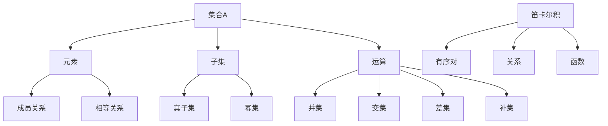
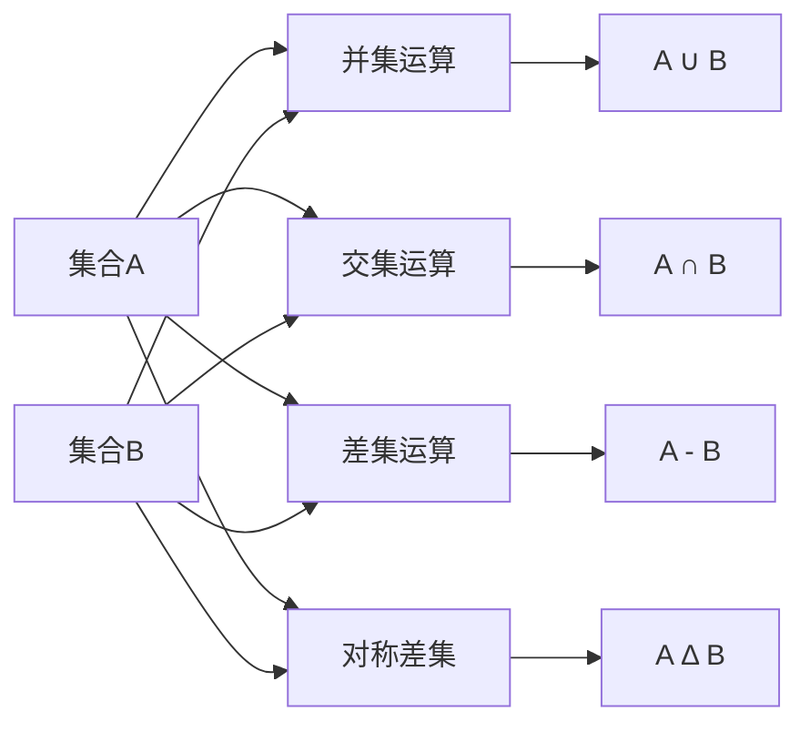
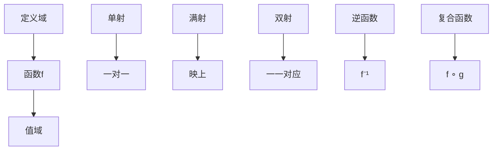

# 01-03-集合论基础

## 概述

集合论是数学的基础语言，为计算机科学提供了描述和处理离散结构的基本工具。它建立了从基本概念到复杂结构的数学框架，是数据结构、算法分析和形式化方法的重要基础。

## 1. 概念解释

### 1.1 集合的基本概念

**集合**是数学中的基本概念，表示具有某种共同特征的对象的总和。

**核心概念**：

- **元素**：集合中的个体对象
- **成员关系**：元素属于集合的关系
- **相等关系**：两个集合包含相同元素
- **包含关系**：一个集合是另一个集合的子集

### 1.2 集合的表示方法

1. **列举法**：直接列出所有元素
   - 例：$A = \{1, 2, 3, 4, 5\}$

2. **描述法**：通过性质描述元素
   - 例：$B = \{x \mid x \text{ 是正整数且 } x < 10\}$

3. **递归法**：通过规则生成元素
   - 例：$C = \{2^n \mid n \in \mathbb{N}\}$

### 1.3 在计算机科学中的应用

- **数据结构**：数组、链表、树、图等
- **算法分析**：复杂度分析和性能评估
- **数据库**：关系模型和查询语言
- **形式化方法**：系统规约和验证
- **人工智能**：知识表示和推理

## 2. 数学形式

### 2.1 集合的基本定义

**集合的定义**：

```math
A = \{x \mid P(x)\}
```

表示满足性质 $P$ 的所有元素 $x$ 组成的集合。

**成员关系**：

```math
x \in A \quad \text{表示元素 } x \text{ 属于集合 } A
```

**相等关系**：

```math
A = B \iff \forall x (x \in A \leftrightarrow x \in B)
```

### 2.2 集合运算

**基本运算**：

1. **并集**：

    ```math
    A \cup B = \{x \mid x \in A \text{ or } x \in B\}
    ```

2. **交集**：

    ```math
    A \cap B = \{x \mid x \in A \text{ and } x \in B\}
    ```

3. **差集**：

    ```math
    A - B = \{x \mid x \in A \text{ and } x \notin B\}
    ```

4. **补集**：

    ```math
    A' = \{x \mid x \notin A\}
    ```

**德摩根律**：

```math
\begin{align}
(A \cup B)' &= A' \cap B' \\
(A \cap B)' &= A' \cup B'
\end{align}
```

### 2.3 集合关系

**包含关系**：

```math
A \subseteq B \iff \forall x (x \in A \rightarrow x \in B)
```

**真包含关系**：

```math
A \subset B \iff A \subseteq B \text{ and } A \neq B
```

**幂集**：

```math
\mathcal{P}(A) = \{B \mid B \subseteq A\}
```

### 2.4 笛卡尔积

**二元笛卡尔积**：

```math
A \times B = \{(a, b) \mid a \in A, b \in B\}
```

**n元笛卡尔积**：

```math
A_1 \times A_2 \times \cdots \times A_n = \{(a_1, a_2, \ldots, a_n) \mid a_i \in A_i\}
```

### 2.5 集合的基数

**有限集合**：

```math
|A| = n \quad \text{表示集合 } A \text{ 有 } n \text{ 个元素}
```

**无限集合**：

- 可数无限：与自然数集等势
- 不可数无限：与实数集等势

**基数运算**：

```math
\begin{align}
|A \cup B| &= |A| + |B| - |A \cap B| \\
|A \times B| &= |A| \times |B| \\
|\mathcal{P}(A)| &= 2^{|A|}
\end{align}
```

## 3. 代码实现

### 3.1 集合类实现

```python
from abc import ABC, abstractmethod
from typing import List, Set, Dict, Any, Tuple, Optional, Iterator
from dataclasses import dataclass
from enum import Enum
import copy

# 集合类型
class SetType(Enum):
    FINITE = "finite"
    INFINITE = "infinite"
    COUNTABLE = "countable"
    UNCOUNTABLE = "uncountable"

# 基本集合类
class Set:
    """集合类"""
    
    def __init__(self, elements: List[Any] = None):
        self.elements = set(elements) if elements else set()
        self._type = self._determine_type()
    
    def __str__(self) -> str:
        return f"{{{', '.join(map(str, self.elements))}}}"
    
    def __repr__(self) -> str:
        return f"Set({list(self.elements)})"
    
    def __eq__(self, other: Any) -> bool:
        if not isinstance(other, Set):
            return False
        return self.elements == other.elements
    
    def __hash__(self) -> int:
        return hash(frozenset(self.elements))
    
    def __iter__(self) -> Iterator[Any]:
        return iter(self.elements)
    
    def __len__(self) -> int:
        return len(self.elements)
    
    def __contains__(self, item: Any) -> bool:
        return item in self.elements
    
    def _determine_type(self) -> SetType:
        """确定集合类型"""
        if len(self.elements) < float('inf'):
            return SetType.FINITE
        else:
            return SetType.INFINITE
    
    @property
    def cardinality(self) -> int:
        """集合的基数"""
        return len(self.elements)
    
    def add(self, element: Any):
        """添加元素"""
        self.elements.add(element)
    
    def remove(self, element: Any):
        """移除元素"""
        self.elements.discard(element)
    
    def clear(self):
        """清空集合"""
        self.elements.clear()
    
    def copy(self) -> 'Set':
        """复制集合"""
        return Set(list(self.elements))
    
    def is_subset(self, other: 'Set') -> bool:
        """判断是否为子集"""
        return self.elements.issubset(other.elements)
    
    def is_superset(self, other: 'Set') -> bool:
        """判断是否为超集"""
        return self.elements.issuperset(other.elements)
    
    def is_proper_subset(self, other: 'Set') -> bool:
        """判断是否为真子集"""
        return self.elements.issubset(other.elements) and self.elements != other.elements
    
    def union(self, other: 'Set') -> 'Set':
        """并集"""
        return Set(list(self.elements.union(other.elements)))
    
    def intersection(self, other: 'Set') -> 'Set':
        """交集"""
        return Set(list(self.elements.intersection(other.elements)))
    
    def difference(self, other: 'Set') -> 'Set':
        """差集"""
        return Set(list(self.elements.difference(other.elements)))
    
    def symmetric_difference(self, other: 'Set') -> 'Set':
        """对称差集"""
        return Set(list(self.elements.symmetric_difference(other.elements)))
    
    def complement(self, universal_set: 'Set') -> 'Set':
        """补集"""
        return universal_set.difference(self)
    
    def cartesian_product(self, other: 'Set') -> 'Set':
        """笛卡尔积"""
        result = set()
        for a in self.elements:
            for b in other.elements:
                result.add((a, b))
        return Set(list(result))
    
    def power_set(self) -> 'Set':
        """幂集"""
        elements_list = list(self.elements)
        power_set = set()
        
        for i in range(2 ** len(elements_list)):
            subset = set()
            for j in range(len(elements_list)):
                if i & (1 << j):
                    subset.add(elements_list[j])
            power_set.add(frozenset(subset))
        
        return Set([Set(list(subset)) for subset in power_set])

# 关系类
@dataclass
class Relation:
    """关系类"""
    domain: Set
    codomain: Set
    pairs: Set  # 有序对集合
    
    def __str__(self) -> str:
        return f"R: {self.domain} → {self.codomain}"
    
    def is_function(self) -> bool:
        """判断是否为函数"""
        domain_elements = set()
        for pair in self.pairs:
            if isinstance(pair, tuple) and len(pair) == 2:
                domain_elements.add(pair[0])
        
        # 检查定义域完整性
        if domain_elements != self.domain.elements:
            return False
        
        # 检查单值性
        domain_to_codomain = {}
        for pair in self.pairs:
            if isinstance(pair, tuple) and len(pair) == 2:
                if pair[0] in domain_to_codomain:
                    if domain_to_codomain[pair[0]] != pair[1]:
                        return False
                else:
                    domain_to_codomain[pair[0]] = pair[1]
        
        return True
    
    def is_injective(self) -> bool:
        """判断是否为单射"""
        if not self.is_function():
            return False
        
        codomain_elements = set()
        for pair in self.pairs:
            if isinstance(pair, tuple) and len(pair) == 2:
                if pair[1] in codomain_elements:
                    return False
                codomain_elements.add(pair[1])
        
        return True
    
    def is_surjective(self) -> bool:
        """判断是否为满射"""
        if not self.is_function():
            return False
        
        codomain_elements = set()
        for pair in self.pairs:
            if isinstance(pair, tuple) and len(pair) == 2:
                codomain_elements.add(pair[1])
        
        return codomain_elements == self.codomain.elements
    
    def is_bijective(self) -> bool:
        """判断是否为双射"""
        return self.is_injective() and self.is_surjective()

# 函数类
class Function:
    """函数类"""
    
    def __init__(self, domain: Set, codomain: Set, mapping: Dict[Any, Any]):
        self.domain = domain
        self.codomain = codomain
        self.mapping = mapping
        
        # 验证函数定义
        if not self._is_valid_function():
            raise ValueError("Invalid function definition")
    
    def _is_valid_function(self) -> bool:
        """验证函数定义的有效性"""
        # 检查定义域完整性
        if set(self.mapping.keys()) != self.domain.elements:
            return False
        
        # 检查值域
        for value in self.mapping.values():
            if value not in self.codomain.elements:
                return False
        
        return True
    
    def __call__(self, x: Any) -> Any:
        """函数调用"""
        if x not in self.domain.elements:
            raise ValueError(f"Domain element {x} not in function domain")
        return self.mapping[x]
    
    def __str__(self) -> str:
        return f"f: {self.domain} → {self.codomain}"
    
    def is_injective(self) -> bool:
        """判断是否为单射"""
        values = set(self.mapping.values())
        return len(values) == len(self.mapping)
    
    def is_surjective(self) -> bool:
        """判断是否为满射"""
        values = set(self.mapping.values())
        return values == self.codomain.elements
    
    def is_bijective(self) -> bool:
        """判断是否为双射"""
        return self.is_injective() and self.is_surjective()
    
    def inverse(self) -> Optional['Function']:
        """求逆函数"""
        if not self.is_bijective():
            return None
        
        inverse_mapping = {v: k for k, v in self.mapping.items()}
        return Function(self.codomain, self.domain, inverse_mapping)
    
    def compose(self, other: 'Function') -> 'Function':
        """函数复合"""
        if self.domain != other.codomain:
            raise ValueError("Domain mismatch for function composition")
        
        composed_mapping = {}
        for x in other.domain.elements:
            composed_mapping[x] = self(other(x))
        
        return Function(other.domain, self.codomain, composed_mapping)

# 集合运算器
class SetOperations:
    """集合运算器"""
    
    @staticmethod
    def union(*sets: Set) -> Set:
        """多个集合的并集"""
        result = set()
        for s in sets:
            result.update(s.elements)
        return Set(list(result))
    
    @staticmethod
    def intersection(*sets: Set) -> Set:
        """多个集合的交集"""
        if not sets:
            return Set()
        
        result = sets[0].elements.copy()
        for s in sets[1:]:
            result.intersection_update(s.elements)
        return Set(list(result))
    
    @staticmethod
    def cartesian_product(*sets: Set) -> Set:
        """多个集合的笛卡尔积"""
        if not sets:
            return Set()
        
        result = [()]
        for s in sets:
            new_result = []
            for item in result:
                for element in s.elements:
                    new_result.append(item + (element,))
            result = new_result
        
        return Set(result)
    
    @staticmethod
    def partition(set_obj: Set, num_parts: int) -> List[Set]:
        """集合分割"""
        elements = list(set_obj.elements)
        n = len(elements)
        
        if num_parts > n:
            raise ValueError("Number of parts cannot exceed set size")
        
        part_size = n // num_parts
        remainder = n % num_parts
        
        partitions = []
        start = 0
        
        for i in range(num_parts):
            end = start + part_size + (1 if i < remainder else 0)
            partitions.append(Set(elements[start:end]))
            start = end
        
        return partitions

# 集合分析器
class SetAnalyzer:
    """集合分析器"""
    
    def __init__(self):
        self.operations = SetOperations()
    
    def analyze_set_properties(self, set_obj: Set) -> Dict[str, Any]:
        """分析集合性质"""
        return {
            "cardinality": set_obj.cardinality,
            "type": set_obj._type.value,
            "is_empty": len(set_obj) == 0,
            "is_singleton": len(set_obj) == 1,
            "is_finite": set_obj._type == SetType.FINITE,
            "power_set_size": 2 ** set_obj.cardinality
        }
    
    def find_subsets(self, set_obj: Set, size: int) -> List[Set]:
        """查找指定大小的子集"""
        elements = list(set_obj.elements)
        n = len(elements)
        
        if size > n:
            return []
        
        subsets = []
        for i in range(2 ** n):
            subset = set()
            for j in range(n):
                if i & (1 << j):
                    subset.add(elements[j])
            if len(subset) == size:
                subsets.append(Set(list(subset)))
        
        return subsets
    
    def find_partitions(self, set_obj: Set) -> List[List[Set]]:
        """查找所有分割"""
        elements = list(set_obj.elements)
        n = len(elements)
        
        if n == 0:
            return [[]]
        if n == 1:
            return [[Set(elements)]]
        
        partitions = []
        
        # 生成所有可能的分割
        for i in range(1, 2 ** (n - 1)):
            partition = []
            current_part = [elements[0]]
            
            for j in range(1, n):
                if i & (1 << (j - 1)):
                    if current_part:
                        partition.append(Set(current_part))
                        current_part = []
                current_part.append(elements[j])
            
            if current_part:
                partition.append(Set(current_part))
            
            partitions.append(partition)
        
        return partitions
    
    def verify_set_identities(self, A: Set, B: Set, C: Set) -> Dict[str, bool]:
        """验证集合恒等式"""
        return {
            "commutative_union": A.union(B) == B.union(A),
            "commutative_intersection": A.intersection(B) == B.intersection(A),
            "associative_union": (A.union(B)).union(C) == A.union(B.union(C)),
            "associative_intersection": (A.intersection(B)).intersection(C) == A.intersection(B.intersection(C)),
            "distributive_union": A.union(B.intersection(C)) == (A.union(B)).intersection(A.union(C)),
            "distributive_intersection": A.intersection(B.union(C)) == (A.intersection(B)).union(A.intersection(C)),
            "de_morgan_union": A.union(B).complement(Set(list(A.elements.union(B.elements)))) == A.complement(Set(list(A.elements.union(B.elements)))).intersection(B.complement(Set(list(A.elements.union(B.elements))))),
            "de_morgan_intersection": A.intersection(B).complement(Set(list(A.elements.union(B.elements)))) == A.complement(Set(list(A.elements.union(B.elements)))).union(B.complement(Set(list(A.elements.union(B.elements)))))
        }

# 集合应用
class SetApplication:
    """集合应用类"""
    
    def __init__(self):
        self.analyzer = SetAnalyzer()
        self.operations = SetOperations()
    
    def solve_set_problem(self, problem_description: str) -> Dict[str, Any]:
        """解决集合问题"""
        # 简化的集合问题求解器
        if "subset" in problem_description.lower():
            return self._solve_subset_problem(problem_description)
        elif "partition" in problem_description.lower():
            return self._solve_partition_problem(problem_description)
        elif "function" in problem_description.lower():
            return self._solve_function_problem(problem_description)
        else:
            return {"error": "Unknown problem type"}
    
    def _solve_subset_problem(self, description: str) -> Dict[str, Any]:
        """解决子集问题"""
        # 示例：找到集合的所有子集
        A = Set([1, 2, 3])
        power_set = A.power_set()
        
        return {
            "original_set": A,
            "power_set": power_set,
            "power_set_size": len(power_set),
            "subsets_of_size_2": self.analyzer.find_subsets(A, 2)
        }
    
    def _solve_partition_problem(self, description: str) -> Dict[str, Any]:
        """解决分割问题"""
        # 示例：找到集合的所有分割
        A = Set([1, 2, 3])
        partitions = self.analyzer.find_partitions(A)
        
        return {
            "original_set": A,
            "partitions": partitions,
            "number_of_partitions": len(partitions)
        }
    
    def _solve_function_problem(self, description: str) -> Dict[str, Any]:
        """解决函数问题"""
        # 示例：分析函数性质
        domain = Set([1, 2, 3])
        codomain = Set(['a', 'b', 'c'])
        mapping = {1: 'a', 2: 'b', 3: 'c'}
        
        f = Function(domain, codomain, mapping)
        
        return {
            "function": f,
            "is_injective": f.is_injective(),
            "is_surjective": f.is_surjective(),
            "is_bijective": f.is_bijective(),
            "inverse": f.inverse()
        }
    
    def demonstrate_set_theory(self) -> Dict[str, Any]:
        """演示集合论应用"""
        
        # 创建示例集合
        A = Set([1, 2, 3, 4, 5])
        B = Set([4, 5, 6, 7, 8])
        C = Set([1, 3, 5, 7, 9])
        
        # 基本运算
        union_AB = A.union(B)
        intersection_AB = A.intersection(B)
        difference_AB = A.difference(B)
        symmetric_diff_AB = A.symmetric_difference(B)
        
        # 集合性质分析
        properties_A = self.analyzer.analyze_set_properties(A)
        
        # 验证恒等式
        identities = self.analyzer.verify_set_identities(A, B, C)
        
        # 函数示例
        domain = Set([1, 2, 3])
        codomain = Set(['a', 'b', 'c'])
        mapping = {1: 'a', 2: 'b', 3: 'c'}
        f = Function(domain, codomain, mapping)
        
        return {
            "sets": {"A": A, "B": B, "C": C},
            "operations": {
                "A ∪ B": union_AB,
                "A ∩ B": intersection_AB,
                "A - B": difference_AB,
                "A Δ B": symmetric_diff_AB
            },
            "properties": properties_A,
            "identities": identities,
            "function": {
                "f": f,
                "is_bijective": f.is_bijective(),
                "inverse": f.inverse()
            }
        }

# 使用示例
def demonstrate_set_theory():
    """演示集合论基础的应用"""
    
    # 创建集合应用实例
    set_app = SetApplication()
    
    # 示例1: 基本集合操作
    print("=== 基本集合操作 ===")
    A = Set([1, 2, 3, 4, 5])
    B = Set([4, 5, 6, 7, 8])
    
    print(f"A = {A}")
    print(f"B = {B}")
    print(f"A ∪ B = {A.union(B)}")
    print(f"A ∩ B = {A.intersection(B)}")
    print(f"A - B = {A.difference(B)}")
    print(f"A Δ B = {A.symmetric_difference(B)}")
    
    # 示例2: 集合性质
    print("\n=== 集合性质 ===")
    properties = set_app.analyzer.analyze_set_properties(A)
    print(f"A 的基数: {properties['cardinality']}")
    print(f"A 的类型: {properties['type']}")
    print(f"A 是否为空: {properties['is_empty']}")
    print(f"A 的幂集大小: {properties['power_set_size']}")
    
    # 示例3: 幂集
    print("\n=== 幂集 ===")
    power_set = A.power_set()
    print(f"P(A) = {power_set}")
    print(f"|P(A)| = {len(power_set)}")
    
    # 示例4: 笛卡尔积
    print("\n=== 笛卡尔积 ===")
    X = Set(['a', 'b'])
    Y = Set([1, 2])
    cartesian_product = X.cartesian_product(Y)
    print(f"X = {X}")
    print(f"Y = {Y}")
    print(f"X × Y = {cartesian_product}")
    
    # 示例5: 函数
    print("\n=== 函数 ===")
    domain = Set([1, 2, 3])
    codomain = Set(['a', 'b', 'c'])
    mapping = {1: 'a', 2: 'b', 3: 'c'}
    
    f = Function(domain, codomain, mapping)
    print(f"f: {f}")
    print(f"f(1) = {f(1)}")
    print(f"f 是双射: {f.is_bijective()}")
    
    inverse_f = f.inverse()
    if inverse_f:
        print(f"f⁻¹: {inverse_f}")
        print(f"f⁻¹('a') = {inverse_f('a')}")
    
    # 示例6: 集合恒等式验证
    print("\n=== 集合恒等式验证 ===")
    C = Set([1, 3, 5, 7, 9])
    identities = set_app.analyzer.verify_set_identities(A, B, C)
    
    for identity, result in identities.items():
        print(f"{identity}: {result}")
    
    # 示例7: 综合演示
    print("\n=== 综合演示 ===")
    demonstration = set_app.demonstrate_set_theory()
    
    print("集合运算结果:")
    for operation, result in demonstration["operations"].items():
        print(f"{operation} = {result}")
    
    print(f"\n函数性质:")
    print(f"f 是双射: {demonstration['function']['is_bijective']}")
    if demonstration['function']['inverse']:
        print(f"f 有逆函数: {demonstration['function']['inverse']}")

if __name__ == "__main__":
    demonstrate_set_theory()
```

## 4. 图表说明

### 4.1 集合关系图



### 4.2 集合运算关系



### 4.3 函数关系图



## 5. 实例分析

### 5.1 数据库关系模型中的集合应用

**问题**：分析关系数据库中的集合操作

**集合分析**：

1. **关系作为集合**：
   - 关系 $R$ 是元组的集合
   - $R \subseteq A_1 \times A_2 \times \cdots \times A_n$

2. **关系运算**：
   - 并集：$R \cup S$
   - 交集：$R \cap S$
   - 差集：$R - S$
   - 笛卡尔积：$R \times S$

3. **投影运算**：
   - $\pi_{A_1, A_2}(R) = \{t[A_1, A_2] \mid t \in R\}$

4. **选择运算**：
   - $\sigma_{P}(R) = \{t \mid t \in R \text{ and } P(t)\}$

### 5.2 图论中的集合应用

**问题**：分析图论中的集合结构

**集合分析**：

1. **图的定义**：
   - 图 $G = (V, E)$
   - $V$ 是顶点集
   - $E \subseteq V \times V$ 是边集

2. **子图**：
   - $G' = (V', E')$ 是 $G$ 的子图
   - $V' \subseteq V$ 且 $E' \subseteq E$

3. **图的运算**：
   - 并图：$G_1 \cup G_2 = (V_1 \cup V_2, E_1 \cup E_2)$
   - 交图：$G_1 \cap G_2 = (V_1 \cap V_2, E_1 \cap E_2)$

## 6. 理论证明

### 6.1 集合运算的性质证明

**定理**：集合运算满足交换律、结合律和分配律

**证明**：

1. **交换律**：

   ```math
   A \cup B = B \cup A \quad \text{and} \quad A \cap B = B \cap A
   ```

   证明：根据并集和交集的定义，元素的顺序不影响结果。

2. **结合律**：

   ```math
   (A \cup B) \cup C = A \cup (B \cup C) \quad \text{and} \quad (A \cap B) \cap C = A \cap (B \cap C)
   ```

   证明：根据集合运算的定义，括号的位置不影响结果。

3. **分配律**：

   ```math
   A \cup (B \cap C) = (A \cup B) \cap (A \cup C) \quad \text{and} \quad A \cap (B \cup C) = (A \cap B) \cup (A \cap C)
   ```

   证明：通过元素属于关系的逻辑推理可以证明。

### 6.2 德摩根律的证明

**定理**：德摩根律成立

**证明**：

```math
\begin{align}
(A \cup B)' &= \{x \mid x \notin (A \cup B)\} \\
&= \{x \mid x \notin A \text{ and } x \notin B\} \\
&= \{x \mid x \notin A\} \cap \{x \mid x \notin B\} \\
&= A' \cap B'
\end{align}
```

类似地可以证明：

```math
(A \cap B)' = A' \cup B'
```

## 7. 总结

集合论为计算机科学提供了：

1. **基础语言**：描述离散结构的基本工具
2. **运算框架**：集合运算和关系运算
3. **抽象工具**：从具体对象到抽象概念的桥梁
4. **形式化基础**：为形式化方法提供理论基础

集合论的核心价值在于：

- **精确性**：提供无歧义的数学语言
- **抽象性**：忽略具体细节，关注结构关系
- **通用性**：适用于各种离散结构
- **形式化**：支持严格的数学推理

通过掌握集合论基础，我们能够：

- **设计数据结构**：基于集合概念设计高效的数据结构
- **分析算法**：使用集合运算分析算法复杂度
- **建模系统**：用集合论方法建模复杂系统
- **验证程序**：通过集合论验证程序正确性

集合论不仅是数学基础，更是计算机科学的理论工具，为各个领域提供了坚实的理论基础。

---

**相关链接**：

- [01-01-数学基础](./01-01-数学基础.md)
- [01-02-逻辑学基础](./01-02-逻辑学基础.md)
- [01-04-图论基础](./01-04-图论基础.md)
- [02-02-数据结构理论](../02-理论基础/02-02-数据结构理论.md)
