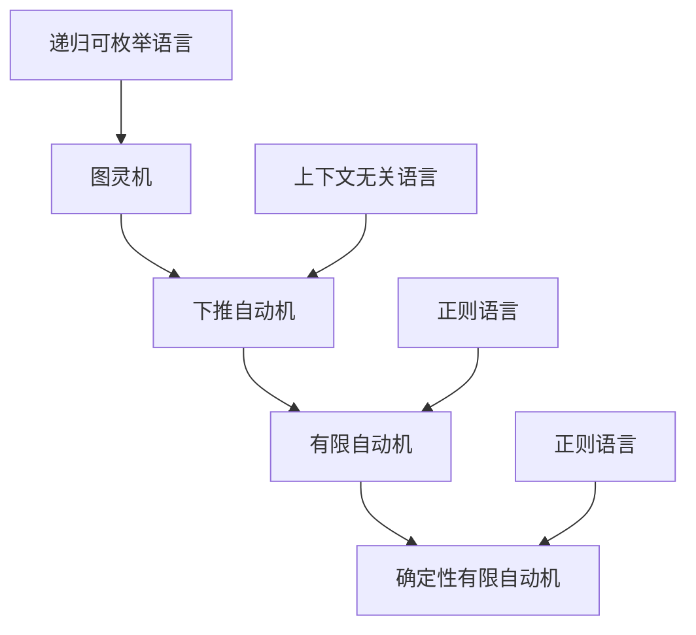

# 02.01.01 自动机理论

## 📋 概述

自动机理论是计算理论的核心，研究抽象计算模型和形式语言。

## 🎯 核心概念

### 1. 有限自动机 (Finite Automaton)

**形式化定义**：

```math
有限自动机M = (Q, Σ, δ, q₀, F)
其中：
- Q是有限状态集合
- Σ是有限输入字母表
- δ: Q × Σ → Q是转移函数
- q₀ ∈ Q是初始状态
- F ⊆ Q是接受状态集合
```

**Python实现**：

```python
from typing import Set, Dict, List, Optional, Tuple
from dataclasses import dataclass
from enum import Enum
from abc import ABC, abstractmethod

class AutomatonType(Enum):
    """自动机类型"""
    DFA = "deterministic_finite_automaton"
    NFA = "nondeterministic_finite_automaton"
    PDA = "pushdown_automaton"
    TM = "turing_machine"

@dataclass
class State:
    """状态"""
    name: str
    is_accepting: bool = False
    is_initial: bool = False

class FiniteAutomaton(ABC):
    """有限自动机抽象基类"""
    
    def __init__(self, states: Set[State], alphabet: Set[str], 
                 initial_state: State, accepting_states: Set[State]):
        self.states = states
        self.alphabet = alphabet
        self.initial_state = initial_state
        self.accepting_states = accepting_states
        self.current_state = initial_state
    
    @abstractmethod
    def transition(self, state: State, symbol: str) -> Set[State]:
        """转移函数"""
        pass
    
    def reset(self):
        """重置到初始状态"""
        self.current_state = self.initial_state
    
    def is_accepting(self) -> bool:
        """检查当前状态是否为接受状态"""
        return self.current_state in self.accepting_states
    
    def process_string(self, input_string: str) -> bool:
        """处理输入字符串"""
        self.reset()
        
        for symbol in input_string:
            if symbol not in self.alphabet:
                return False
            
            next_states = self.transition(self.current_state, symbol)
            if not next_states:
                return False
            
            # 对于DFA，只有一个下一个状态
            self.current_state = next_states.pop()
        
        return self.is_accepting()

class DeterministicFiniteAutomaton(FiniteAutomaton):
    """确定性有限自动机"""
    
    def __init__(self, states: Set[State], alphabet: Set[str], 
                 transition_function: Dict[Tuple[State, str], State],
                 initial_state: State, accepting_states: Set[State]):
        super().__init__(states, alphabet, initial_state, accepting_states)
        self.transition_function = transition_function
    
    def transition(self, state: State, symbol: str) -> Set[State]:
        """确定性转移函数"""
        next_state = self.transition_function.get((state, symbol))
        return {next_state} if next_state else set()
    
    def add_transition(self, from_state: State, symbol: str, to_state: State):
        """添加转移"""
        self.transition_function[(from_state, symbol)] = to_state
    
    def minimize(self) -> 'DeterministicFiniteAutomaton':
        """最小化DFA"""
        # 实现Hopcroft算法进行最小化
        # 简化实现：返回自身
        return self

class NondeterministicFiniteAutomaton(FiniteAutomaton):
    """非确定性有限自动机"""
    
    def __init__(self, states: Set[State], alphabet: Set[str], 
                 transition_function: Dict[Tuple[State, str], Set[State]],
                 initial_state: State, accepting_states: Set[State]):
        super().__init__(states, alphabet, initial_state, accepting_states)
        self.transition_function = transition_function
    
    def transition(self, state: State, symbol: str) -> Set[State]:
        """非确定性转移函数"""
        return self.transition_function.get((state, symbol), set())
    
    def add_transition(self, from_state: State, symbol: str, to_states: Set[State]):
        """添加转移"""
        self.transition_function[(from_state, symbol)] = to_states
    
    def to_dfa(self) -> DeterministicFiniteAutomaton:
        """NFA转DFA（子集构造法）"""
        from itertools import product
        
        # 计算ε闭包
        def epsilon_closure(states: Set[State]) -> Set[State]:
            closure = states.copy()
            stack = list(states)
            
            while stack:
                state = stack.pop()
                epsilon_transitions = self.transition_function.get((state, 'ε'), set())
                
                for next_state in epsilon_transitions:
                    if next_state not in closure:
                        closure.add(next_state)
                        stack.append(next_state)
            
            return closure
        
        # 子集构造
        dfa_states = set()
        dfa_transitions = {}
        dfa_accepting_states = set()
        
        # 初始状态
        initial_closure = epsilon_closure({self.initial_state})
        dfa_states.add(frozenset(initial_closure))
        
        unprocessed = [initial_closure]
        processed = set()
        
        while unprocessed:
            current_states = unprocessed.pop(0)
            current_states_frozen = frozenset(current_states)
            
            if current_states_frozen in processed:
                continue
            
            processed.add(current_states_frozen)
            
            # 检查是否为接受状态
            if any(state in self.accepting_states for state in current_states):
                dfa_accepting_states.add(current_states_frozen)
            
            # 对每个输入符号计算转移
            for symbol in self.alphabet:
                if symbol == 'ε':
                    continue
                
                next_states = set()
                for state in current_states:
                    transitions = self.transition_function.get((state, symbol), set())
                    next_states.update(transitions)
                
                if next_states:
                    next_closure = epsilon_closure(next_states)
                    next_closure_frozen = frozenset(next_closure)
                    
                    dfa_states.add(next_closure_frozen)
                    dfa_transitions[(current_states_frozen, symbol)] = next_closure_frozen
                    
                    if next_closure_frozen not in processed:
                        unprocessed.append(next_closure)
        
        # 创建DFA
        dfa_state_objects = {}
        for state_set in dfa_states:
            state_name = f"q_{len(dfa_state_objects)}"
            is_accepting = state_set in dfa_accepting_states
            is_initial = state_set == frozenset(initial_closure)
            
            dfa_state_objects[state_set] = State(state_name, is_accepting, is_initial)
        
        # 创建转移函数
        dfa_transition_function = {}
        for (state_set, symbol), next_state_set in dfa_transitions.items():
            from_state = dfa_state_objects[state_set]
            to_state = dfa_state_objects[next_state_set]
            dfa_transition_function[(from_state, symbol)] = to_state
        
        # 创建DFA
        dfa_states_set = set(dfa_state_objects.values())
        dfa_accepting_states_set = {state for state in dfa_states_set if state.is_accepting}
        dfa_initial_state = next(state for state in dfa_states_set if state.is_initial)
        
        dfa = DeterministicFiniteAutomaton(
            dfa_states_set, self.alphabet, dfa_transition_function,
            dfa_initial_state, dfa_accepting_states_set
        )
        
        return dfa

# 使用示例
def demonstrate_finite_automata():
    """演示有限自动机"""
    # 创建DFA：识别以'a'结尾的字符串
    q0 = State("q0", False, True)
    q1 = State("q1", True, False)
    
    dfa_states = {q0, q1}
    dfa_alphabet = {'a', 'b'}
    dfa_transitions = {
        (q0, 'a'): q1,
        (q0, 'b'): q0,
        (q1, 'a'): q1,
        (q1, 'b'): q0
    }
    
    dfa = DeterministicFiniteAutomaton(
        dfa_states, dfa_alphabet, dfa_transitions, q0, {q1}
    )
    
    # 测试DFA
    test_strings = ['a', 'ba', 'aba', 'bb', 'ab']
    print("DFA测试结果:")
    for s in test_strings:
        result = dfa.process_string(s)
        print(f"'{s}' -> {result}")
    
    # 创建NFA：识别包含'aa'或'bb'的字符串
    nfa_q0 = State("q0", False, True)
    nfa_q1 = State("q1", False, False)
    nfa_q2 = State("q2", True, False)
    
    nfa_states = {nfa_q0, nfa_q1, nfa_q2}
    nfa_alphabet = {'a', 'b'}
    nfa_transitions = {
        (nfa_q0, 'a'): {nfa_q0, nfa_q1},
        (nfa_q0, 'b'): {nfa_q0, nfa_q1},
        (nfa_q1, 'a'): {nfa_q2},
        (nfa_q1, 'b'): {nfa_q2},
        (nfa_q2, 'a'): {nfa_q2},
        (nfa_q2, 'b'): {nfa_q2}
    }
    
    nfa = NondeterministicFiniteAutomaton(
        nfa_states, nfa_alphabet, nfa_transitions, nfa_q0, {nfa_q2}
    )
    
    # 测试NFA
    test_strings = ['aa', 'bb', 'aba', 'bab', 'a', 'b']
    print("\nNFA测试结果:")
    for s in test_strings:
        result = nfa.process_string(s)
        print(f"'{s}' -> {result}")
    
    # NFA转DFA
    converted_dfa = nfa.to_dfa()
    print("\n转换后的DFA测试结果:")
    for s in test_strings:
        result = converted_dfa.process_string(s)
        print(f"'{s}' -> {result}")
```

### 2. 下推自动机 (Pushdown Automaton)

**形式化定义**：

```math
下推自动机P = (Q, Σ, Γ, δ, q₀, Z₀, F)
其中：
- Q是有限状态集合
- Σ是输入字母表
- Γ是栈字母表
- δ: Q × Σ × Γ → P(Q × Γ*)是转移函数
- q₀ ∈ Q是初始状态
- Z₀ ∈ Γ是初始栈符号
- F ⊆ Q是接受状态集合
```

**Python实现**：

```python
from typing import List, Tuple

class Stack:
    """栈实现"""
    
    def __init__(self, initial_symbol: str):
        self.stack = [initial_symbol]
    
    def push(self, symbols: str):
        """压栈"""
        for symbol in reversed(symbols):
            self.stack.append(symbol)
    
    def pop(self) -> str:
        """出栈"""
        if self.stack:
            return self.stack.pop()
        return None
    
    def peek(self) -> str:
        """查看栈顶"""
        if self.stack:
            return self.stack[-1]
        return None
    
    def is_empty(self) -> bool:
        """检查栈是否为空"""
        return len(self.stack) == 0
    
    def __str__(self) -> str:
        return ''.join(reversed(self.stack))

class PushdownAutomaton:
    """下推自动机"""
    
    def __init__(self, states: Set[State], input_alphabet: Set[str], 
                 stack_alphabet: Set[str], initial_state: State,
                 initial_stack_symbol: str, accepting_states: Set[State]):
        self.states = states
        self.input_alphabet = input_alphabet
        self.stack_alphabet = stack_alphabet
        self.initial_state = initial_state
        self.initial_stack_symbol = initial_stack_symbol
        self.accepting_states = accepting_states
        
        # 转移函数：δ(q, a, Z) = {(p, γ), ...}
        self.transition_function: Dict[Tuple[State, str, str], Set[Tuple[State, str]]] = {}
        
        self.current_state = initial_state
        self.stack = Stack(initial_stack_symbol)
    
    def add_transition(self, from_state: State, input_symbol: str, stack_symbol: str,
                      to_state: State, stack_push: str):
        """添加转移"""
        key = (from_state, input_symbol, stack_symbol)
        if key not in self.transition_function:
            self.transition_function[key] = set()
        self.transition_function[key].add((to_state, stack_push))
    
    def reset(self):
        """重置自动机"""
        self.current_state = self.initial_state
        self.stack = Stack(self.initial_stack_symbol)
    
    def step(self, input_symbol: str) -> bool:
        """执行一步转移"""
        stack_top = self.stack.peek()
        if stack_top is None:
            return False
        
        key = (self.current_state, input_symbol, stack_top)
        transitions = self.transition_function.get(key, set())
        
        if not transitions:
            return False
        
        # 选择第一个转移（非确定性）
        to_state, stack_push = next(iter(transitions))
        
        # 执行转移
        self.stack.pop()
        if stack_push != 'ε':
            self.stack.push(stack_push)
        
        self.current_state = to_state
        return True
    
    def process_string(self, input_string: str) -> bool:
        """处理输入字符串"""
        self.reset()
        
        for symbol in input_string:
            if not self.step(symbol):
                return False
        
        return self.current_state in self.accepting_states

# 使用示例：识别回文串的PDA
def create_palindrome_pda() -> PushdownAutomaton:
    """创建识别回文串的下推自动机"""
    q0 = State("q0", False, True)  # 初始状态
    q1 = State("q1", False, False)  # 读取阶段
    q2 = State("q2", True, False)   # 接受状态
    
    states = {q0, q1, q2}
    input_alphabet = {'a', 'b'}
    stack_alphabet = {'Z', 'A', 'B'}
    
    pda = PushdownAutomaton(states, input_alphabet, stack_alphabet, q0, 'Z', {q2})
    
    # 转移规则
    # 初始转移：读取第一个符号
    pda.add_transition(q0, 'a', 'Z', q1, 'AZ')
    pda.add_transition(q0, 'b', 'Z', q1, 'BZ')
    
    # 读取阶段：将符号压入栈
    pda.add_transition(q1, 'a', 'Z', q1, 'AZ')
    pda.add_transition(q1, 'b', 'Z', q1, 'BZ')
    pda.add_transition(q1, 'a', 'A', q1, 'AA')
    pda.add_transition(q1, 'b', 'A', q1, 'BA')
    pda.add_transition(q1, 'a', 'B', q1, 'AB')
    pda.add_transition(q1, 'b', 'B', q1, 'BB')
    
    # 猜测中点：开始匹配
    pda.add_transition(q1, 'a', 'A', q2, 'ε')
    pda.add_transition(q1, 'b', 'B', q2, 'ε')
    
    # 匹配阶段：弹出栈顶符号
    pda.add_transition(q2, 'a', 'A', q2, 'ε')
    pda.add_transition(q2, 'b', 'B', q2, 'ε')
    
    # 接受空串
    pda.add_transition(q0, 'ε', 'Z', q2, 'Z')
    
    return pda

def demonstrate_pushdown_automaton():
    """演示下推自动机"""
    pda = create_palindrome_pda()
    
    test_strings = ['', 'a', 'aa', 'ab', 'aba', 'abba', 'abc']
    print("PDA测试结果（回文串识别）:")
    for s in test_strings:
        result = pda.process_string(s)
        print(f"'{s}' -> {result}")
```

### 3. 图灵机 (Turing Machine)

**形式化定义**：

```math
图灵机M = (Q, Σ, Γ, δ, q₀, B, F)
其中：
- Q是有限状态集合
- Σ是输入字母表
- Γ是磁带字母表（Σ ⊆ Γ）
- δ: Q × Γ → Q × Γ × {L, R, S}是转移函数
- q₀ ∈ Q是初始状态
- B ∈ Γ是空白符号
- F ⊆ Q是接受状态集合
```

**Python实现**：

```python
from enum import Enum
from typing import Dict, List, Optional

class Direction(Enum):
    """移动方向"""
    LEFT = "L"
    RIGHT = "R"
    STAY = "S"

@dataclass
class TuringMachineConfiguration:
    """图灵机配置"""
    state: State
    tape: List[str]
    head_position: int
    
    def __str__(self) -> str:
        tape_str = ''.join(self.tape)
        head_marker = ' ' * self.head_position + '^'
        return f"State: {self.state.name}\nTape: {tape_str}\nHead:  {head_marker}"

class TuringMachine:
    """图灵机"""
    
    def __init__(self, states: Set[State], input_alphabet: Set[str], 
                 tape_alphabet: Set[str], initial_state: State,
                 blank_symbol: str, accepting_states: Set[State]):
        self.states = states
        self.input_alphabet = input_alphabet
        self.tape_alphabet = tape_alphabet
        self.initial_state = initial_state
        self.blank_symbol = blank_symbol
        self.accepting_states = accepting_states
        
        # 转移函数：δ(q, a) = (p, b, D)
        self.transition_function: Dict[Tuple[State, str], Tuple[State, str, Direction]] = {}
        
        self.current_state = initial_state
        self.tape = [blank_symbol]
        self.head_position = 0
    
    def add_transition(self, from_state: State, read_symbol: str,
                      to_state: State, write_symbol: str, direction: Direction):
        """添加转移"""
        self.transition_function[(from_state, read_symbol)] = (to_state, write_symbol, direction)
    
    def reset(self, input_string: str):
        """重置图灵机"""
        self.current_state = self.initial_state
        self.tape = list(input_string) if input_string else [self.blank_symbol]
        self.head_position = 0
    
    def step(self) -> bool:
        """执行一步计算"""
        if self.current_state in self.accepting_states:
            return False  # 停机
        
        # 读取当前符号
        current_symbol = self.tape[self.head_position]
        
        # 查找转移
        key = (self.current_state, current_symbol)
        if key not in self.transition_function:
            return False  # 停机
        
        # 执行转移
        to_state, write_symbol, direction = self.transition_function[key]
        
        # 写入符号
        self.tape[self.head_position] = write_symbol
        
        # 移动读写头
        if direction == Direction.LEFT:
            self.head_position = max(0, self.head_position - 1)
        elif direction == Direction.RIGHT:
            self.head_position += 1
            if self.head_position >= len(self.tape):
                self.tape.append(self.blank_symbol)
        
        # 更新状态
        self.current_state = to_state
        return True
    
    def run(self, input_string: str) -> bool:
        """运行图灵机"""
        self.reset(input_string)
        
        while self.step():
            pass
        
        return self.current_state in self.accepting_states
    
    def get_configuration(self) -> TuringMachineConfiguration:
        """获取当前配置"""
        return TuringMachineConfiguration(
            self.current_state, self.tape.copy(), self.head_position
        )

# 使用示例：识别a^n b^n的图灵机
def create_anbn_turing_machine() -> TuringMachine:
    """创建识别a^n b^n的图灵机"""
    q0 = State("q0", False, True)   # 初始状态
    q1 = State("q1", False, False)  # 寻找第一个a
    q2 = State("q2", False, False)  # 寻找对应的b
    q3 = State("q3", False, False)  # 返回寻找下一个a
    q4 = State("q4", True, False)   # 接受状态
    
    states = {q0, q1, q2, q3, q4}
    input_alphabet = {'a', 'b'}
    tape_alphabet = {'a', 'b', 'X', 'Y', 'B'}
    
    tm = TuringMachine(states, input_alphabet, tape_alphabet, q0, 'B', {q4})
    
    # 转移规则
    # 初始：检查第一个符号
    tm.add_transition(q0, 'a', q1, 'X', Direction.RIGHT)
    tm.add_transition(q0, 'b', q4, 'b', Direction.STAY)  # 拒绝
    tm.add_transition(q0, 'B', q4, 'B', Direction.STAY)  # 接受空串
    
    # q1：向右寻找第一个a
    tm.add_transition(q1, 'a', q1, 'a', Direction.RIGHT)
    tm.add_transition(q1, 'b', q2, 'Y', Direction.LEFT)
    tm.add_transition(q1, 'B', q4, 'B', Direction.STAY)  # 没有b，拒绝
    
    # q2：向左寻找对应的a
    tm.add_transition(q2, 'a', q3, 'X', Direction.RIGHT)
    tm.add_transition(q2, 'b', q2, 'b', Direction.LEFT)
    tm.add_transition(q2, 'X', q2, 'X', Direction.LEFT)
    tm.add_transition(q2, 'Y', q2, 'Y', Direction.LEFT)
    tm.add_transition(q2, 'B', q4, 'B', Direction.STAY)  # 没有对应的a，拒绝
    
    # q3：向右继续处理
    tm.add_transition(q3, 'a', q1, 'a', Direction.RIGHT)
    tm.add_transition(q3, 'b', q2, 'Y', Direction.LEFT)
    tm.add_transition(q3, 'X', q3, 'X', Direction.RIGHT)
    tm.add_transition(q3, 'Y', q3, 'Y', Direction.RIGHT)
    tm.add_transition(q3, 'B', q4, 'B', Direction.STAY)  # 完成
    
    return tm

def demonstrate_turing_machine():
    """演示图灵机"""
    tm = create_anbn_turing_machine()
    
    test_strings = ['', 'ab', 'aabb', 'aaabbb', 'abab', 'aab']
    print("图灵机测试结果（a^n b^n识别）:")
    for s in test_strings:
        result = tm.run(s)
        print(f"'{s}' -> {result}")
```

## 📊 自动机层次结构



## 🎯 总结

自动机理论为计算理论提供了重要的基础：

1. **有限自动机**：识别正则语言，用于词法分析
2. **下推自动机**：识别上下文无关语言，用于语法分析
3. **图灵机**：通用计算模型，定义可计算性

通过理解自动机理论，我们可以：

- 设计编译器前端
- 分析算法复杂度
- 理解计算理论
- 构建形式化验证系统

---

**相关链接**：

- [02.01.02 形式语言](02.01.02-形式语言.md)
- [02.01.03 计算复杂性](02.01.03-计算复杂性.md)
- [01.01.01 集合论](../../01-形式科学/01.01-数学基础/01.01.01-集合论.md)
- [01.02.01 命题逻辑](../../01-形式科学/01.02-逻辑学/01.02.01-命题逻辑.md)
