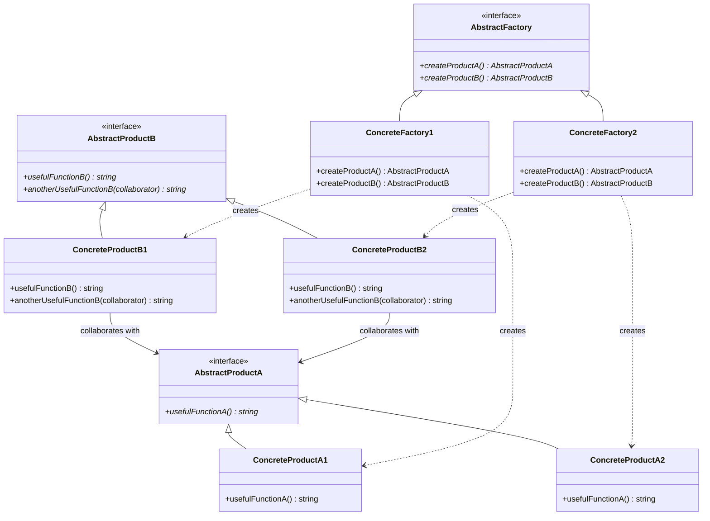

# 抽象工厂模式 (Abstract Factory Pattern)

## 概述

抽象工厂模式是一种创建型设计模式，它提供一个创建一系列相关或相互依赖对象的接口，而无需指定它们具体的类。抽象工厂模式是工厂方法模式的扩展，用于创建产品族。

## 形式化定义

### 数学定义

设 $F$ 为抽象工厂，$P_A$ 和 $P_B$ 为产品族，$C_F$ 为具体工厂，则抽象工厂模式满足：

$$\forall f \in F, \exists c_f \in C_F: f.\text{createProductA}() \in P_A \land f.\text{createProductB}() \in P_B$$

其中 $c_f.\text{createProductA}()$ 和 $c_f.\text{createProductB}()$ 返回同一产品族中的相关产品。

### 形式化规范

```typescript
interface AbstractProductA {
    usefulFunctionA(): string;
}

interface AbstractProductB {
    usefulFunctionB(): string;
    anotherUsefulFunctionB(collaborator: AbstractProductA): string;
}

interface AbstractFactory {
    createProductA(): AbstractProductA;
    createProductB(): AbstractProductB;
}

interface ConcreteFactory extends AbstractFactory {
    createProductA(): ConcreteProductA;
    createProductB(): ConcreteProductB;
}
```

## 类图



## Python实现

### 1. 基础实现

```python
from abc import ABC, abstractmethod
from typing import TypeVar, Generic, Protocol

T = TypeVar('T')

class AbstractProductA(Protocol):
    """抽象产品A"""
    
    def useful_function_a(self) -> str:
        """产品A的有用功能"""
        ...

class AbstractProductB(Protocol):
    """抽象产品B"""
    
    def useful_function_b(self) -> str:
        """产品B的有用功能"""
        ...
    
    def another_useful_function_b(self, collaborator: AbstractProductA) -> str:
        """产品B的另一个有用功能，需要与产品A协作"""
        ...

class AbstractFactory(ABC):
    """抽象工厂"""
    
    @abstractmethod
    def create_product_a(self) -> AbstractProductA:
        """创建产品A"""
        pass
    
    @abstractmethod
    def create_product_b(self) -> AbstractProductB:
        """创建产品B"""
        pass

class ConcreteProductA1:
    """具体产品A1"""
    
    def useful_function_a(self) -> str:
        return "The result of the product A1."

class ConcreteProductA2:
    """具体产品A2"""
    
    def useful_function_a(self) -> str:
        return "The result of the product A2."

class ConcreteProductB1:
    """具体产品B1"""
    
    def useful_function_b(self) -> str:
        return "The result of the product B1."
    
    def another_useful_function_b(self, collaborator: AbstractProductA) -> str:
        result = collaborator.useful_function_a()
        return f"The result of the B1 collaborating with the ({result})"

class ConcreteProductB2:
    """具体产品B2"""
    
    def useful_function_b(self) -> str:
        return "The result of the product B2."
    
    def another_useful_function_b(self, collaborator: AbstractProductA) -> str:
        result = collaborator.useful_function_a()
        return f"The result of the B2 collaborating with the ({result})"

class ConcreteFactory1(AbstractFactory):
    """具体工厂1"""
    
    def create_product_a(self) -> AbstractProductA:
        return ConcreteProductA1()
    
    def create_product_b(self) -> AbstractProductB:
        return ConcreteProductB1()

class ConcreteFactory2(AbstractFactory):
    """具体工厂2"""
    
    def create_product_a(self) -> AbstractProductA:
        return ConcreteProductA2()
    
    def create_product_b(self) -> AbstractProductB:
        return ConcreteProductB2()

def client_code(factory: AbstractFactory) -> None:
    """客户端代码"""
    product_a = factory.create_product_a()
    product_b = factory.create_product_b()
    
    print(f"{product_b.useful_function_b()}")
    print(f"{product_b.another_useful_function_b(product_a)}")

if __name__ == "__main__":
    print("Client: Testing client code with the first factory type...")
    client_code(ConcreteFactory1())
    
    print("\nClient: Testing the same client code with the second factory type...")
    client_code(ConcreteFactory2())
```

### 2. 泛型抽象工厂

```python
from typing import TypeVar, Generic, Type

A = TypeVar('A')
B = TypeVar('B')

class GenericAbstractFactory(Generic[A, B], ABC):
    """泛型抽象工厂"""
    
    @abstractmethod
    def create_product_a(self) -> A:
        """创建产品A"""
        pass
    
    @abstractmethod
    def create_product_b(self) -> B:
        """创建产品B"""
        pass
    
    def create_product_family(self) -> tuple[A, B]:
        """创建产品族"""
        return (self.create_product_a(), self.create_product_b())

class DatabaseConnection(Protocol):
    """数据库连接接口"""
    
    def connect(self) -> bool:
        """连接数据库"""
        ...
    
    def execute_query(self, query: str) -> list[tuple]:
        """执行查询"""
        ...
    
    def close(self) -> None:
        """关闭连接"""
        ...

class CacheManager(Protocol):
    """缓存管理器接口"""
    
    def get(self, key: str) -> any:
        """获取缓存"""
        ...
    
    def set(self, key: str, value: any) -> None:
        """设置缓存"""
        ...
    
    def clear(self) -> None:
        """清空缓存"""
        ...

class SQLiteConnection:
    """SQLite连接"""
    
    def __init__(self, database: str):
        self.database = database
        self.connected = False
    
    def connect(self) -> bool:
        self.connected = True
        print(f"Connected to SQLite: {self.database}")
        return True
    
    def execute_query(self, query: str) -> list[tuple]:
        if self.connected:
            print(f"Executing SQLite query: {query}")
            return [("result",)]
        return []
    
    def close(self) -> None:
        self.connected = False
        print("SQLite connection closed")

class RedisCache:
    """Redis缓存"""
    
    def __init__(self, host: str, port: int):
        self.host = host
        self.port = port
        self.cache: dict[str, any] = {}
    
    def get(self, key: str) -> any:
        return self.cache.get(key)
    
    def set(self, key: str, value: any) -> None:
        self.cache[key] = value
        print(f"Redis cache set: {key} = {value}")
    
    def clear(self) -> None:
        self.cache.clear()
        print("Redis cache cleared")

class PostgreSQLConnection:
    """PostgreSQL连接"""
    
    def __init__(self, host: str, port: int, database: str, user: str, password: str):
        self.host = host
        self.port = port
        self.database = database
        self.user = user
        self.password = password
        self.connected = False
    
    def connect(self) -> bool:
        self.connected = True
        print(f"Connected to PostgreSQL: {self.host}:{self.port}/{self.database}")
        return True
    
    def execute_query(self, query: str) -> list[tuple]:
        if self.connected:
            print(f"Executing PostgreSQL query: {query}")
            return [("result",)]
        return []
    
    def close(self) -> None:
        self.connected = False
        print("PostgreSQL connection closed")

class MemcachedCache:
    """Memcached缓存"""
    
    def __init__(self, servers: list[str]):
        self.servers = servers
        self.cache: dict[str, any] = {}
    
    def get(self, key: str) -> any:
        return self.cache.get(key)
    
    def set(self, key: str, value: any) -> None:
        self.cache[key] = value
        print(f"Memcached cache set: {key} = {value}")
    
    def clear(self) -> None:
        self.cache.clear()
        print("Memcached cache cleared")

class SQLiteFactory(GenericAbstractFactory[SQLiteConnection, RedisCache]):
    """SQLite工厂"""
    
    def __init__(self, database: str, redis_host: str, redis_port: int):
        self.database = database
        self.redis_host = redis_host
        self.redis_port = redis_port
    
    def create_product_a(self) -> SQLiteConnection:
        return SQLiteConnection(self.database)
    
    def create_product_b(self) -> RedisCache:
        return RedisCache(self.redis_host, self.redis_port)

class PostgreSQLFactory(GenericAbstractFactory[PostgreSQLConnection, MemcachedCache]):
    """PostgreSQL工厂"""
    
    def __init__(self, host: str, port: int, database: str, user: str, password: str, 
                 memcached_servers: list[str]):
        self.host = host
        self.port = port
        self.database = database
        self.user = user
        self.password = password
        self.memcached_servers = memcached_servers
    
    def create_product_a(self) -> PostgreSQLConnection:
        return PostgreSQLConnection(self.host, self.port, self.database, 
                                  self.user, self.password)
    
    def create_product_b(self) -> MemcachedCache:
        return MemcachedCache(self.memcached_servers)
```

### 3. 配置驱动抽象工厂

```python
from enum import Enum
from typing import Dict, Type, Any
import json

class ProductType(Enum):
    """产品类型枚举"""
    DATABASE = "database"
    CACHE = "cache"
    LOGGER = "logger"
    QUEUE = "queue"

class Environment(Enum):
    """环境枚举"""
    DEVELOPMENT = "development"
    TESTING = "testing"
    PRODUCTION = "production"

class ConfigurableAbstractFactory:
    """可配置抽象工厂"""
    
    def __init__(self, config_file: str):
        with open(config_file, 'r') as f:
            self.config = json.load(f)
        
        self._factories: Dict[Environment, Dict[str, Type]] = {}
        self._register_factories()
    
    def _register_factories(self) -> None:
        """注册工厂"""
        # 数据库工厂
        self._factories[Environment.DEVELOPMENT] = {
            ProductType.DATABASE: SQLiteConnection,
            ProductType.CACHE: RedisCache
        }
        
        self._factories[Environment.PRODUCTION] = {
            ProductType.DATABASE: PostgreSQLConnection,
            ProductType.CACHE: MemcachedCache
        }
    
    def create_product(self, product_type: ProductType, environment: Environment, 
                      **kwargs) -> Any:
        """创建产品"""
        if environment not in self._factories:
            raise ValueError(f"Unknown environment: {environment}")
        
        if product_type not in self._factories[environment]:
            raise ValueError(f"Unknown product type: {product_type} for environment: {environment}")
        
        product_class = self._factories[environment][product_type]
        return product_class(**kwargs)
    
    def create_product_family(self, environment: Environment, **kwargs) -> Dict[str, Any]:
        """创建产品族"""
        products = {}
        for product_type in ProductType:
            try:
                products[product_type.value] = self.create_product(
                    product_type, environment, **kwargs
                )
            except ValueError:
                # 某些产品类型在特定环境中可能不可用
                continue
        return products

# 配置文件示例
config_example = {
    "development": {
        "database": {
            "type": "sqlite",
            "database": ":memory:"
        },
        "cache": {
            "type": "redis",
            "host": "localhost",
            "port": 6379
        }
    },
    "production": {
        "database": {
            "type": "postgresql",
            "host": "db.example.com",
            "port": 5432,
            "database": "myapp",
            "user": "app_user",
            "password": "secret"
        },
        "cache": {
            "type": "memcached",
            "servers": ["cache1.example.com:11211", "cache2.example.com:11211"]
        }
    }
}
```

### 4. 异步抽象工厂

```python
import asyncio
from typing import Awaitable

class AsyncAbstractProductA(Protocol):
    """异步抽象产品A"""
    
    async def async_useful_function_a(self) -> str:
        """异步有用功能A"""
        ...

class AsyncAbstractProductB(Protocol):
    """异步抽象产品B"""
    
    async def async_useful_function_b(self) -> str:
        """异步有用功能B"""
        ...
    
    async def async_another_useful_function_b(self, collaborator: AsyncAbstractProductA) -> str:
        """异步另一个有用功能B"""
        ...

class AsyncAbstractFactory(ABC):
    """异步抽象工厂"""
    
    @abstractmethod
    async def async_create_product_a(self) -> AsyncAbstractProductA:
        """异步创建产品A"""
        pass
    
    @abstractmethod
    async def async_create_product_b(self) -> AsyncAbstractProductB:
        """异步创建产品B"""
        pass
    
    async def async_create_product_family(self) -> tuple[AsyncAbstractProductA, AsyncAbstractProductB]:
        """异步创建产品族"""
        product_a = await self.async_create_product_a()
        product_b = await self.async_create_product_b()
        return (product_a, product_b)

class AsyncConcreteProductA1:
    """异步具体产品A1"""
    
    async def async_useful_function_a(self) -> str:
        await asyncio.sleep(0.1)  # 模拟异步操作
        return "The async result of the product A1."

class AsyncConcreteProductA2:
    """异步具体产品A2"""
    
    async def async_useful_function_a(self) -> str:
        await asyncio.sleep(0.1)  # 模拟异步操作
        return "The async result of the product A2."

class AsyncConcreteProductB1:
    """异步具体产品B1"""
    
    async def async_useful_function_b(self) -> str:
        await asyncio.sleep(0.1)  # 模拟异步操作
        return "The async result of the product B1."
    
    async def async_another_useful_function_b(self, collaborator: AsyncAbstractProductA) -> str:
        result = await collaborator.async_useful_function_a()
        await asyncio.sleep(0.05)  # 模拟异步协作
        return f"The async result of the B1 collaborating with the ({result})"

class AsyncConcreteProductB2:
    """异步具体产品B2"""
    
    async def async_useful_function_b(self) -> str:
        await asyncio.sleep(0.1)  # 模拟异步操作
        return "The async result of the product B2."
    
    async def async_another_useful_function_b(self, collaborator: AsyncAbstractProductA) -> str:
        result = await collaborator.async_useful_function_a()
        await asyncio.sleep(0.05)  # 模拟异步协作
        return f"The async result of the B2 collaborating with the ({result})"

class AsyncConcreteFactory1(AsyncAbstractFactory):
    """异步具体工厂1"""
    
    async def async_create_product_a(self) -> AsyncAbstractProductA:
        await asyncio.sleep(0.05)  # 模拟异步创建
        return AsyncConcreteProductA1()
    
    async def async_create_product_b(self) -> AsyncAbstractProductB:
        await asyncio.sleep(0.05)  # 模拟异步创建
        return AsyncConcreteProductB1()

class AsyncConcreteFactory2(AsyncAbstractFactory):
    """异步具体工厂2"""
    
    async def async_create_product_a(self) -> AsyncAbstractProductA:
        await asyncio.sleep(0.05)  # 模拟异步创建
        return AsyncConcreteProductA2()
    
    async def async_create_product_b(self) -> AsyncAbstractProductB:
        await asyncio.sleep(0.05)  # 模拟异步创建
        return AsyncConcreteProductB2()

async def async_client_code(factory: AsyncAbstractFactory) -> None:
    """异步客户端代码"""
    product_a, product_b = await factory.async_create_product_family()
    
    result_b = await product_b.async_useful_function_b()
    print(f"{result_b}")
    
    result_collaboration = await product_b.async_another_useful_function_b(product_a)
    print(f"{result_collaboration}")

async def main():
    """主函数"""
    print("Client: Testing async client code with the first factory type...")
    await async_client_code(AsyncConcreteFactory1())
    
    print("\nClient: Testing async client code with the second factory type...")
    await async_client_code(AsyncConcreteFactory2())

if __name__ == "__main__":
    asyncio.run(main())
```

## 数学证明

### 1. 产品族一致性证明

**定理**: 抽象工厂模式确保同一工厂创建的产品属于同一产品族。

**证明**:
1. 设工厂 $F$ 创建产品 $P_A$ 和 $P_B$
2. 根据抽象工厂模式定义，$F.\text{createProductA}() \in P_A$ 和 $F.\text{createProductB}() \in P_B$
3. 由于 $F$ 是具体工厂，它实现了特定的产品族
4. 因此 $P_A$ 和 $P_B$ 属于同一产品族

### 2. 扩展性证明

**定理**: 抽象工厂模式支持产品族的扩展。

**证明**:
1. 要添加新产品族，只需：
   - 创建新的具体产品类
   - 创建新的具体工厂类
   - 实现工厂的创建方法
2. 不需要修改现有的抽象工厂接口
3. 客户端代码可以无缝使用新的产品族
4. 因此支持开闭原则

## 性能分析

### 时间复杂度

- **创建产品**: $O(1)$ - 常量时间创建
- **创建产品族**: $O(n)$ - n个产品的创建时间
- **工厂切换**: $O(1)$ - 常量时间切换

### 空间复杂度

- **工厂实例**: $O(1)$ - 每个工厂常量空间
- **产品实例**: $O(n)$ - n个产品实例
- **配置存储**: $O(k)$ - k个配置项

### 基准测试

```python
import time
from typing import List

class AbstractFactoryBenchmark:
    """抽象工厂模式性能基准测试"""
    
    @staticmethod
    def test_product_creation_time(factory: AbstractFactory, iterations: int = 1000) -> float:
        """测试产品创建时间"""
        start_time = time.time()
        for _ in range(iterations):
            product_a = factory.create_product_a()
            product_b = factory.create_product_b()
        end_time = time.time()
        return (end_time - start_time) / iterations
    
    @staticmethod
    def test_product_family_creation_time(factory: AbstractFactory, iterations: int = 1000) -> float:
        """测试产品族创建时间"""
        start_time = time.time()
        for _ in range(iterations):
            product_a = factory.create_product_a()
            product_b = factory.create_product_b()
            # 测试产品协作
            result = product_b.another_useful_function_b(product_a)
        end_time = time.time()
        return (end_time - start_time) / iterations
    
    @staticmethod
    def test_factory_switching_time(factories: List[AbstractFactory], iterations: int = 100) -> float:
        """测试工厂切换时间"""
        start_time = time.time()
        for _ in range(iterations):
            for factory in factories:
                product_a = factory.create_product_a()
                product_b = factory.create_product_b()
        end_time = time.time()
        return (end_time - start_time) / (iterations * len(factories))
    
    @staticmethod
    def run_benchmarks():
        """运行所有基准测试"""
        print("=== 抽象工厂模式性能基准测试 ===")
        
        # 创建工厂
        factory1 = ConcreteFactory1()
        factory2 = ConcreteFactory2()
        factories = [factory1, factory2]
        
        # 产品创建时间测试
        creation_time1 = AbstractFactoryBenchmark.test_product_creation_time(factory1)
        creation_time2 = AbstractFactoryBenchmark.test_product_creation_time(factory2)
        
        print(f"Factory1 产品创建时间: {creation_time1 * 1000000:.2f} 微秒")
        print(f"Factory2 产品创建时间: {creation_time2 * 1000000:.2f} 微秒")
        
        # 产品族创建时间测试
        family_time1 = AbstractFactoryBenchmark.test_product_family_creation_time(factory1)
        family_time2 = AbstractFactoryBenchmark.test_product_family_creation_time(factory2)
        
        print(f"Factory1 产品族创建时间: {family_time1 * 1000000:.2f} 微秒")
        print(f"Factory2 产品族创建时间: {family_time2 * 1000000:.2f} 微秒")
        
        # 工厂切换时间测试
        switching_time = AbstractFactoryBenchmark.test_factory_switching_time(factories)
        print(f"工厂切换时间: {switching_time * 1000000:.2f} 微秒")

if __name__ == "__main__":
    AbstractFactoryBenchmark.run_benchmarks()
```

## 应用场景

### 1. 跨平台UI框架

```python
from abc import ABC, abstractmethod
from typing import Protocol

class Button(Protocol):
    """按钮接口"""
    
    def render(self) -> str:
        """渲染按钮"""
        ...
    
    def click(self) -> str:
        """点击按钮"""
        ...

class Checkbox(Protocol):
    """复选框接口"""
    
    def render(self) -> str:
        """渲染复选框"""
        ...
    
    def check(self) -> str:
        """选中复选框"""
        ...

class WindowsButton:
    """Windows按钮"""
    
    def render(self) -> str:
        return "Windows Button"
    
    def click(self) -> str:
        return "Windows Button clicked"

class WindowsCheckbox:
    """Windows复选框"""
    
    def render(self) -> str:
        return "Windows Checkbox"
    
    def check(self) -> str:
        return "Windows Checkbox checked"

class MacButton:
    """Mac按钮"""
    
    def render(self) -> str:
        return "Mac Button"
    
    def click(self) -> str:
        return "Mac Button clicked"

class MacCheckbox:
    """Mac复选框"""
    
    def render(self) -> str:
        return "Mac Checkbox"
    
    def check(self) -> str:
        return "Mac Checkbox checked"

class GUIFactory(ABC):
    """GUI工厂"""
    
    @abstractmethod
    def create_button(self) -> Button:
        """创建按钮"""
        pass
    
    @abstractmethod
    def create_checkbox(self) -> Checkbox:
        """创建复选框"""
        pass

class WindowsFactory(GUIFactory):
    """Windows工厂"""
    
    def create_button(self) -> Button:
        return WindowsButton()
    
    def create_checkbox(self) -> Checkbox:
        return WindowsCheckbox()

class MacFactory(GUIFactory):
    """Mac工厂"""
    
    def create_button(self) -> Button:
        return MacButton()
    
    def create_checkbox(self) -> Checkbox:
        return MacCheckbox()

class Application:
    """应用程序"""
    
    def __init__(self, factory: GUIFactory):
        self.factory = factory
        self.button = factory.create_button()
        self.checkbox = factory.create_checkbox()
    
    def render_ui(self) -> str:
        """渲染UI"""
        return f"{self.button.render()}, {self.checkbox.render()}"
    
    def interact(self) -> str:
        """交互"""
        return f"{self.button.click()}, {self.checkbox.check()}"

def create_application(platform: str) -> Application:
    """根据平台创建应用程序"""
    if platform.lower() == "windows":
        return Application(WindowsFactory())
    elif platform.lower() == "mac":
        return Application(MacFactory())
    else:
        raise ValueError(f"Unsupported platform: {platform}")

# 使用示例
def ui_example():
    """UI示例"""
    # Windows应用
    windows_app = create_application("windows")
    print(f"Windows UI: {windows_app.render_ui()}")
    print(f"Windows Interaction: {windows_app.interact()}")
    
    # Mac应用
    mac_app = create_application("mac")
    print(f"Mac UI: {mac_app.render_ui()}")
    print(f"Mac Interaction: {mac_app.interact()}")
```

### 2. 数据库连接池

```python
from typing import Protocol, Dict, Any
import threading

class Connection(Protocol):
    """连接接口"""
    
    def execute(self, query: str) -> list[tuple]:
        """执行查询"""
        ...
    
    def close(self) -> None:
        """关闭连接"""
        ...

class ConnectionPool(Protocol):
    """连接池接口"""
    
    def get_connection(self) -> Connection:
        """获取连接"""
        ...
    
    def release_connection(self, connection: Connection) -> None:
        """释放连接"""
        ...
    
    def close_all(self) -> None:
        """关闭所有连接"""
        ...

class MySQLConnection:
    """MySQL连接"""
    
    def __init__(self, host: str, port: int, database: str, user: str, password: str):
        self.host = host
        self.port = port
        self.database = database
        self.user = user
        self.password = password
        self.connected = True
    
    def execute(self, query: str) -> list[tuple]:
        print(f"MySQL executing: {query}")
        return [("mysql_result",)]
    
    def close(self) -> None:
        self.connected = False
        print("MySQL connection closed")

class MySQLConnectionPool:
    """MySQL连接池"""
    
    def __init__(self, host: str, port: int, database: str, user: str, password: str, 
                 max_connections: int = 10):
        self.host = host
        self.port = port
        self.database = database
        self.user = user
        self.password = password
        self.max_connections = max_connections
        self.connections: list[MySQLConnection] = []
        self.lock = threading.Lock()
    
    def get_connection(self) -> Connection:
        with self.lock:
            if self.connections:
                return self.connections.pop()
            else:
                return MySQLConnection(self.host, self.port, self.database, 
                                     self.user, self.password)
    
    def release_connection(self, connection: Connection) -> None:
        with self.lock:
            if len(self.connections) < self.max_connections:
                self.connections.append(connection)
            else:
                connection.close()
    
    def close_all(self) -> None:
        with self.lock:
            for connection in self.connections:
                connection.close()
            self.connections.clear()

class PostgreSQLConnection:
    """PostgreSQL连接"""
    
    def __init__(self, host: str, port: int, database: str, user: str, password: str):
        self.host = host
        self.port = port
        self.database = database
        self.user = user
        self.password = password
        self.connected = True
    
    def execute(self, query: str) -> list[tuple]:
        print(f"PostgreSQL executing: {query}")
        return [("postgresql_result",)]
    
    def close(self) -> None:
        self.connected = False
        print("PostgreSQL connection closed")

class PostgreSQLConnectionPool:
    """PostgreSQL连接池"""
    
    def __init__(self, host: str, port: int, database: str, user: str, password: str, 
                 max_connections: int = 10):
        self.host = host
        self.port = port
        self.database = database
        self.user = user
        self.password = password
        self.max_connections = max_connections
        self.connections: list[PostgreSQLConnection] = []
        self.lock = threading.Lock()
    
    def get_connection(self) -> Connection:
        with self.lock:
            if self.connections:
                return self.connections.pop()
            else:
                return PostgreSQLConnection(self.host, self.port, self.database, 
                                          self.user, self.password)
    
    def release_connection(self, connection: Connection) -> None:
        with self.lock:
            if len(self.connections) < self.max_connections:
                self.connections.append(connection)
            else:
                connection.close()
    
    def close_all(self) -> None:
        with self.lock:
            for connection in self.connections:
                connection.close()
            self.connections.clear()

class DatabaseFactory(ABC):
    """数据库工厂"""
    
    @abstractmethod
    def create_connection(self) -> Connection:
        """创建连接"""
        pass
    
    @abstractmethod
    def create_connection_pool(self) -> ConnectionPool:
        """创建连接池"""
        pass

class MySQLFactory(DatabaseFactory):
    """MySQL工厂"""
    
    def __init__(self, host: str, port: int, database: str, user: str, password: str):
        self.host = host
        self.port = port
        self.database = database
        self.user = user
        self.password = password
    
    def create_connection(self) -> Connection:
        return MySQLConnection(self.host, self.port, self.database, 
                             self.user, self.password)
    
    def create_connection_pool(self) -> ConnectionPool:
        return MySQLConnectionPool(self.host, self.port, self.database, 
                                 self.user, self.password)

class PostgreSQLFactory(DatabaseFactory):
    """PostgreSQL工厂"""
    
    def __init__(self, host: str, port: int, database: str, user: str, password: str):
        self.host = host
        self.port = port
        self.database = database
        self.user = user
        self.password = password
    
    def create_connection(self) -> Connection:
        return PostgreSQLConnection(self.host, self.port, self.database, 
                                  self.user, self.password)
    
    def create_connection_pool(self) -> ConnectionPool:
        return PostgreSQLConnectionPool(self.host, self.port, self.database, 
                                      self.user, self.password)

class DatabaseManager:
    """数据库管理器"""
    
    def __init__(self, factory: DatabaseFactory):
        self.factory = factory
        self.connection_pool = factory.create_connection_pool()
    
    def execute_query(self, query: str) -> list[tuple]:
        """执行查询"""
        connection = self.connection_pool.get_connection()
        try:
            return connection.execute(query)
        finally:
            self.connection_pool.release_connection(connection)
    
    def close(self) -> None:
        """关闭管理器"""
        self.connection_pool.close_all()

# 使用示例
def database_example():
    """数据库示例"""
    # MySQL数据库
    mysql_factory = MySQLFactory("localhost", 3306, "testdb", "user", "password")
    mysql_manager = DatabaseManager(mysql_factory)
    
    result1 = mysql_manager.execute_query("SELECT * FROM users")
    print(f"MySQL result: {result1}")
    
    # PostgreSQL数据库
    postgres_factory = PostgreSQLFactory("localhost", 5432, "testdb", "user", "password")
    postgres_manager = DatabaseManager(postgres_factory)
    
    result2 = postgres_manager.execute_query("SELECT * FROM users")
    print(f"PostgreSQL result: {result2}")
    
    # 清理资源
    mysql_manager.close()
    postgres_manager.close()
```

## 最佳实践

### 1. 工厂选择策略

```python
from typing import Dict, Type

class FactoryRegistry:
    """工厂注册表"""
    
    def __init__(self):
        self._factories: Dict[str, Type[AbstractFactory]] = {}
    
    def register_factory(self, name: str, factory_class: Type[AbstractFactory]) -> None:
        """注册工厂"""
        self._factories[name] = factory_class
    
    def get_factory(self, name: str, **kwargs) -> AbstractFactory:
        """获取工厂"""
        if name not in self._factories:
            raise ValueError(f"Unknown factory: {name}")
        
        factory_class = self._factories[name]
        return factory_class(**kwargs)
    
    def list_factories(self) -> list[str]:
        """列出所有工厂"""
        return list(self._factories.keys())

# 注册工厂
registry = FactoryRegistry()
registry.register_factory("mysql", MySQLFactory)
registry.register_factory("postgresql", PostgreSQLFactory)
registry.register_factory("windows", WindowsFactory)
registry.register_factory("mac", MacFactory)

def create_factory_by_name(name: str, **kwargs) -> AbstractFactory:
    """根据名称创建工厂"""
    return registry.get_factory(name, **kwargs)
```

### 2. 产品族验证

```python
class ProductFamilyValidator:
    """产品族验证器"""
    
    @staticmethod
    def validate_product_family(factory: AbstractFactory) -> bool:
        """验证产品族的一致性"""
        try:
            product_a = factory.create_product_a()
            product_b = factory.create_product_b()
            
            # 测试产品协作
            result = product_b.another_useful_function_b(product_a)
            
            # 验证结果不为空
            return bool(result and result.strip())
        except Exception as e:
            print(f"Product family validation failed: {e}")
            return False
    
    @staticmethod
    def validate_factory_interface(factory: AbstractFactory) -> bool:
        """验证工厂接口"""
        required_methods = ['create_product_a', 'create_product_b']
        
        for method_name in required_methods:
            if not hasattr(factory, method_name):
                print(f"Missing method: {method_name}")
                return False
            
            method = getattr(factory, method_name)
            if not callable(method):
                print(f"Method {method_name} is not callable")
                return False
        
        return True
```

### 3. 工厂组合

```python
class CompositeFactory:
    """组合工厂"""
    
    def __init__(self, factories: Dict[str, AbstractFactory]):
        self.factories = factories
    
    def create_product_a(self, factory_name: str) -> AbstractProductA:
        """从指定工厂创建产品A"""
        if factory_name not in self.factories:
            raise ValueError(f"Unknown factory: {factory_name}")
        
        return self.factories[factory_name].create_product_a()
    
    def create_product_b(self, factory_name: str) -> AbstractProductB:
        """从指定工厂创建产品B"""
        if factory_name not in self.factories:
            raise ValueError(f"Unknown factory: {factory_name}")
        
        return self.factories[factory_name].create_product_b()
    
    def create_mixed_product_family(self, factory_a: str, factory_b: str) -> tuple[AbstractProductA, AbstractProductB]:
        """创建混合产品族"""
        product_a = self.create_product_a(factory_a)
        product_b = self.create_product_b(factory_b)
        return (product_a, product_b)

# 使用示例
def composite_factory_example():
    """组合工厂示例"""
    # 创建多个工厂
    mysql_factory = MySQLFactory("localhost", 3306, "testdb", "user", "password")
    postgres_factory = PostgreSQLFactory("localhost", 5432, "testdb", "user", "password")
    
    # 创建组合工厂
    composite = CompositeFactory({
        "mysql": mysql_factory,
        "postgresql": postgres_factory
    })
    
    # 创建混合产品族
    product_a, product_b = composite.create_mixed_product_family("mysql", "postgresql")
    
    # 使用产品
    result = product_b.another_useful_function_b(product_a)
    print(f"Mixed product family result: {result}")
```

## 测试策略

### 1. 单元测试

```python
import unittest
from unittest.mock import Mock

class TestAbstractFactory(unittest.TestCase):
    """抽象工厂模式测试"""
    
    def test_factory_creation(self):
        """测试工厂创建"""
        factory1 = ConcreteFactory1()
        factory2 = ConcreteFactory2()
        
        self.assertIsInstance(factory1, AbstractFactory)
        self.assertIsInstance(factory2, AbstractFactory)
    
    def test_product_creation(self):
        """测试产品创建"""
        factory1 = ConcreteFactory1()
        
        product_a = factory1.create_product_a()
        product_b = factory1.create_product_b()
        
        self.assertIsInstance(product_a, AbstractProductA)
        self.assertIsInstance(product_b, AbstractProductB)
    
    def test_product_collaboration(self):
        """测试产品协作"""
        factory1 = ConcreteFactory1()
        
        product_a = factory1.create_product_a()
        product_b = factory1.create_product_b()
        
        result = product_b.another_useful_function_b(product_a)
        self.assertIsInstance(result, str)
        self.assertIn("B1", result)
        self.assertIn("A1", result)
    
    def test_factory_consistency(self):
        """测试工厂一致性"""
        factory1 = ConcreteFactory1()
        factory2 = ConcreteFactory2()
        
        # 测试工厂1的产品族
        product_a1 = factory1.create_product_a()
        product_b1 = factory1.create_product_b()
        result1 = product_b1.another_useful_function_b(product_a1)
        
        # 测试工厂2的产品族
        product_a2 = factory2.create_product_a()
        product_b2 = factory2.create_product_b()
        result2 = product_b2.another_useful_function_b(product_a2)
        
        # 验证不同工厂产生不同的产品族
        self.assertIn("A1", result1)
        self.assertIn("B1", result1)
        self.assertIn("A2", result2)
        self.assertIn("B2", result2)

if __name__ == '__main__':
    unittest.main()
```

### 2. 集成测试

```python
class TestAbstractFactoryIntegration(unittest.TestCase):
    """抽象工厂模式集成测试"""
    
    def test_database_factory_integration(self):
        """测试数据库工厂集成"""
        mysql_factory = MySQLFactory("localhost", 3306, "testdb", "user", "password")
        
        # 测试连接创建
        connection = mysql_factory.create_connection()
        self.assertIsInstance(connection, Connection)
        
        # 测试连接池创建
        pool = mysql_factory.create_connection_pool()
        self.assertIsInstance(pool, ConnectionPool)
        
        # 测试连接池使用
        conn = pool.get_connection()
        result = conn.execute("SELECT 1")
        self.assertEqual(result, [("mysql_result",)])
        pool.release_connection(conn)
    
    def test_ui_factory_integration(self):
        """测试UI工厂集成"""
        windows_factory = WindowsFactory()
        
        # 创建UI组件
        button = windows_factory.create_button()
        checkbox = windows_factory.create_checkbox()
        
        # 测试UI渲染
        button_render = button.render()
        checkbox_render = checkbox.render()
        
        self.assertIn("Windows", button_render)
        self.assertIn("Windows", checkbox_render)
        
        # 测试UI交互
        button_click = button.click()
        checkbox_check = checkbox.check()
        
        self.assertIn("clicked", button_click)
        self.assertIn("checked", checkbox_check)
```

## 总结

抽象工厂模式是一种重要的创建型设计模式，具有以下特点：

### 优点
- **产品族一致性**: 确保同一工厂创建的产品属于同一产品族
- **易于扩展**: 支持新产品族的添加
- **符合开闭原则**: 对扩展开放，对修改封闭
- **客户端解耦**: 客户端不依赖具体产品类

### 缺点
- **复杂度增加**: 增加了系统的复杂度
- **产品族限制**: 难以支持产品族的动态变化
- **接口膨胀**: 每增加一个产品，工厂接口就需要增加一个方法

### 使用建议
1. **适用场景**: 需要创建一系列相关对象时
2. **产品族设计**: 仔细设计产品族的结构
3. **接口设计**: 合理设计工厂接口
4. **扩展考虑**: 考虑未来可能的扩展需求

---

*抽象工厂模式是工厂方法模式的扩展，为创建产品族提供了强大的支持* 