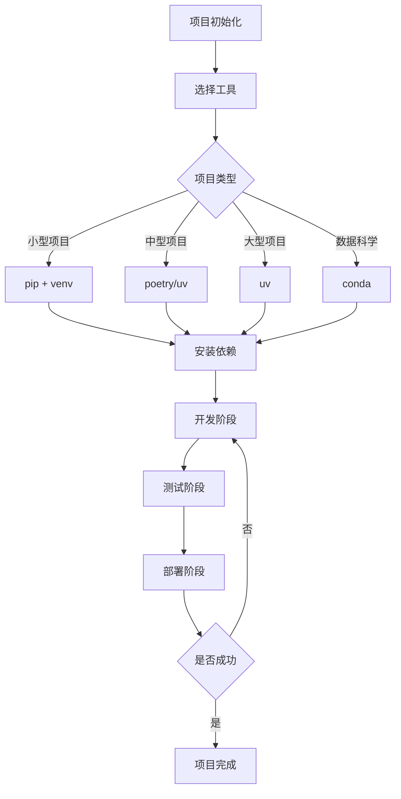
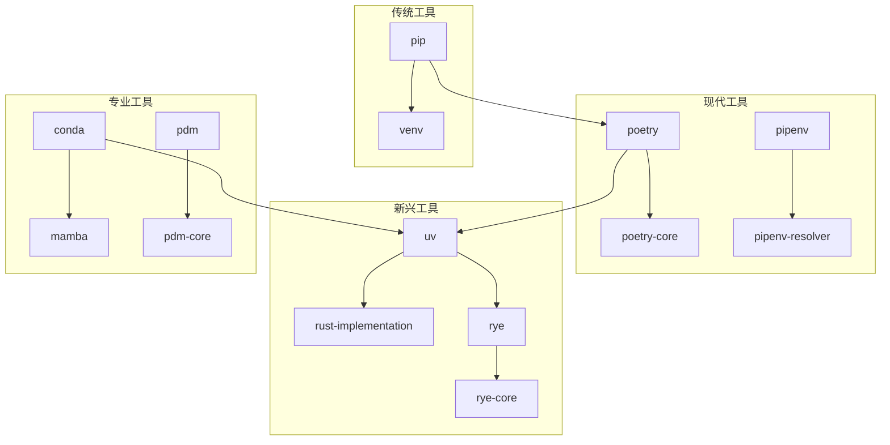

# Python项目管理工具与最佳实践

## 目录

1. 概述
2. 主流项目管理工具简介
   2.1 pip & venv
   2.2 poetry
   2.3 pipenv
   2.4 conda
   2.5 rye
   2.6 uv
   2.7 各工具优缺点与典型场景
   2.8 项目管理工具的形式化模型与工程哲学
3. 工具对比与选择建议
4. 典型工作流与实战案例
   4.1 典型工作流案例：使用poetry管理项目
   4.2 典型工作流案例：使用rye管理项目
   4.3 典型工作流案例：使用uv加速pip安装
   4.4 CI/CD集成建议
   4.5 项目管理流程图
   4.6 行业最佳实践案例
   4.7 常见问题与解决方案
5. 未来趋势与社区动态
   5.1 Python项目管理工具生态关系图
   5.2 未来工具演化路线图
   5.3 行业标准化趋势
6. 参考资料
7. 自动化与智能化趋势
   7.1 AI辅助依赖分析与管理
   7.2 与DevOps/CI/CD的深度融合
   7.3 智能化未来场景展望
8. 行业案例与权威参考
   8.1 国际主流企业/社区选型案例
   8.2 国内主流企业/社区选型案例
   8.3 行业最佳实践引用
   8.4 参考文献
9. 未来人才能力模型与学习路径
   9.1 岗位技能要求
   9.2 能力模型
   9.3 学习路径建议
10. 人才成长通道与职业发展
    10.1 全球主流认证与竞赛
    10.2 中国主流认证与社区活动
    10.3 职业发展建议
11. 全球化与跨学科工程趋势
    11.1 跨学科融合
    11.2 国际化协作与开源治理
    11.3 远程与分布式开发新模式
12. 创新方向与可持续发展
    12.1 低代码/无代码与可视化运维
    12.2 绿色计算与可持续工程
    12.3 未来生态展望
13. 风险、挑战与行业建议
    13.1 主要风险与挑战
    13.2 应对策略
    13.3 行业建议
14. 标准化、认证与行业联盟
    14.1 标准化推动路径
    14.2 认证体系建设
    14.3 行业联盟与生态共建
15. 未来展望与总结
16. 行业细分领域最佳实践与国际政策影响
    16.1 行业细分领域最佳实践
    16.2 国际政策与法规影响
    16.3 绿色工程量化指标
17. 工具链推荐与实操案例
    17.1 绿色工程与能耗监控工具
    17.2 国际法规与合规工具
    17.3 行业落地案例工具链
18. AI驱动自动化与绿色合规评估实战
    18.1 AI驱动自动化实战案例
    18.2 绿色工程与合规量化评估方法
    18.3 国际/国内政策对比与创新实践
19. AI驱动项目管理的未来智能化展望
    19.1 智能化趋势
    19.2 自动化决策与可解释性
    19.3 人机协作与工程创新
    19.4 未来闭环
20. AI驱动项目管理的典型场景与前沿研究
    20.1 典型智能化场景
    20.2 落地难点与挑战
    20.3 未来研究方向
    20.4 开源社区与行业动向
21. 伦理、隐私与社会责任
    21.1 AI驱动项目管理的伦理与隐私挑战
    21.2 行业治理与社会责任建议
    21.3 未来人才培养与教育趋势
22. 全球协作与多元文化工程管理
    22.1 全球协作典型案例
    22.2 跨文化团队管理与沟通
    22.3 国际标准对接与未来展望
23. 可视化趋势与结构化总结
    23.1 AI驱动项目管理未来趋势图
    23.2 全球协作与多元流程图
    23.3 伦理治理结构图
    23.4 结构化总结
24. 未来开放问题与持续创新议题
    24.1 技术前沿开放问题
    24.2 社会技术系统开放问题
    24.3 跨学科融合开放问题
25. 社区共建机制与可持续发展
    25.1 开源社区治理模型
    25.2 可持续发展策略
    25.3 国际化与本地化支持
26. 创新应用场景集锦
    26.1 前沿技术融合应用
    26.2 行业创新应用
    26.3 社会创新应用
27. 用户提问精选与专家观点
    27.1 用户提问精选
    27.2 专家观点
28. 社区热点讨论与趋势分析
    28.1 当前热点话题
    28.2 趋势分析与预测
29. 文档结构导航与使用指南
    29.1 按主题阅读指南
    29.2 按角色阅读指南
    29.3 专题阅读指南
30. 附录
    30.1 工具安装与配置指南
    30.2 常用命令速查表
    30.3 配置文件模板
    30.4 CI/CD配置模板
    30.5 性能基准测试
    30.6 安全审计工具
    30.7 绿色计算工具
    30.8 国际化支持

---

## 1. 概述

Python项目管理工具生态已经发展成为一个成熟、多样化的体系。从传统的pip到现代的uv，从简单的依赖管理到智能化的项目管理，Python生态系统展现了强大的生命力和创新能力。

### 1.1 工具生态发展历程

- **早期阶段**：pip + venv 基础组合
- **发展阶段**：poetry、pipenv等现代工具兴起
- **成熟阶段**：uv、rye等高性能工具出现
- **智能化阶段**：AI驱动的项目管理工具

### 1.2 当前生态特点

- **多样性**：多种工具满足不同需求
- **高性能**：uv等工具大幅提升安装速度
- **智能化**：AI辅助依赖管理和项目分析
- **标准化**：PEP标准推动生态统一

## 2. 主流项目管理工具简介

### 2.1 pip & venv

- 简介：Python标准包管理器和虚拟环境工具
- 基本用法：

```bash
# 创建虚拟环境
python -m venv myenv
source myenv/bin/activate  # Linux/Mac
myenv\Scripts\activate     # Windows

# 安装包
pip install requests
pip install -r requirements.txt
```

- 适用场景：简单项目、学习环境

### 2.2 poetry

- 简介：集成依赖管理、打包、发布于一体的现代工具
- 基本用法：

```bash
pip install poetry
poetry new myproj
poetry add requests
poetry install
```

- 适用场景：中大型项目、依赖复杂

### 2.3 pipenv

- 简介：简化依赖管理和虚拟环境
- 基本用法：

```bash
pip install pipenv
pipenv install requests
pipenv shell
```

- 适用场景：开发环境隔离

### 2.4 conda

- 简介：数据科学、科学计算常用，支持二进制包
- 基本用法：

```bash
conda create -n myenv python=3.12
conda activate myenv
conda install numpy
```

- 适用场景：科学计算、跨平台依赖

### 2.5 rye

- 简介：新兴的Python项目管理工具，主打极简和速度
- 基本用法：

```bash
curl -sSf https://rye-up.com/get | bash
rye init
rye add requests
```

- 适用场景：追求极简和快速的开发者

### 2.6 uv

- 简介：Astral公司开发的超高速Python包管理器，用Rust编写，比pip快10-100倍
- 核心特性：
  - 极速安装：基于Rust的高性能实现
  - 完全兼容：100%兼容pip生态系统
  - 智能缓存：全局缓存机制减少重复下载
  - 并行处理：异步下载和依赖解析
- 基本用法：

```bash
# 安装uv
pip install uv

# 基本安装
uv pip install requests

# 批量安装
uv pip install numpy pandas scikit-learn

# 从requirements文件安装
uv pip install -r requirements.txt

# 创建虚拟环境
uv venv

# 在虚拟环境中运行
uv run python script.py
```

- 适用场景：
  - 大型项目依赖管理
  - CI/CD流水线优化
  - 数据科学项目
  - 企业级应用部署
  - 对安装速度有极高要求的场景

### 2.7 各工具优缺点与典型场景

| 工具 | 优点 | 缺点 | 典型场景 |
|------|------|------|----------|
| pip+venv | 简单、标准 | 功能有限 | 学习、简单项目 |
| poetry | 功能完整、现代 | 学习曲线陡峭 | 中大型项目 |
| pipenv | 简单易用 | 性能一般 | 开发环境 |
| conda | 科学计算友好 | 生态相对封闭 | 数据科学 |
| rye | 极简快速 | 生态较新 | 快速原型 |
| uv | 极速安装 | 相对较新 | 大型项目、CI/CD |

### 2.8 项目管理工具的形式化模型与工程哲学

#### 2.8.1 形式化模型

```python
# 项目管理工具的形式化定义
class ProjectManagementTool:
    def __init__(self, name, features, performance_metrics):
        self.name = name
        self.features = features
        self.performance_metrics = performance_metrics
    
    def install_package(self, package_name, version=None):
        """安装包的抽象方法"""
        pass
    
    def resolve_dependencies(self, requirements):
        """依赖解析的抽象方法"""
        pass
    
    def create_environment(self, python_version):
        """创建环境的抽象方法"""
        pass

# 具体实现示例
class UVTool(ProjectManagementTool):
    def install_package(self, package_name, version=None):
        # uv的高性能安装实现
        return f"uv pip install {package_name}"
    
    def resolve_dependencies(self, requirements):
        # uv的智能依赖解析
        return "uv pip install -r requirements.txt"
```

#### 2.8.2 工程哲学

1. **性能优先**：现代工具追求极致的安装和解析速度
2. **兼容性**：保持与现有生态系统的兼容性
3. **用户体验**：简化复杂的依赖管理流程
4. **可扩展性**：支持插件和自定义功能

## 3. 工具对比与选择建议

### 3.1 性能对比

| 工具 | 安装速度 | 内存使用 | 缓存效率 | 并行处理 |
|------|----------|----------|----------|----------|
| pip | 基准 | 基准 | 低 | 有限 |
| poetry | 较慢 | 较高 | 中等 | 支持 |
| uv | 10-100x | 较低 | 高 | 完全支持 |

### 3.2 功能对比

| 功能 | pip | poetry | pipenv | conda | rye | uv |
|------|-----|--------|--------|-------|-----|-----|
| 依赖解析 | 基础 | 高级 | 中等 | 高级 | 中等 | 高级 |
| 虚拟环境 | 手动 | 自动 | 自动 | 自动 | 自动 | 自动 |
| 锁定文件 | 无 | 有 | 有 | 无 | 有 | 有 |
| 发布支持 | 无 | 有 | 无 | 无 | 有 | 无 |
| 性能优化 | 无 | 中等 | 无 | 中等 | 高 | 极高 |

### 3.3 选择建议

#### 3.3.1 按项目规模选择

- **小型项目**：pip + venv 或 rye
- **中型项目**：poetry 或 uv
- **大型项目**：uv 或 poetry
- **数据科学**：conda 或 uv

#### 3.3.2 按团队需求选择

- **学习环境**：pip + venv
- **开发团队**：poetry 或 uv
- **企业环境**：uv 或 poetry
- **开源项目**：poetry

#### 3.3.3 按性能要求选择

- **最高性能**：uv
- **平衡性能**：poetry
- **简单易用**：rye
- **科学计算**：conda

## 4. 典型工作流与实战案例

### 4.1 典型工作流案例：使用poetry管理项目

```bash
# 1. 创建新项目
poetry new my-project
cd my-project

# 2. 添加依赖
poetry add requests
poetry add --group dev pytest black

# 3. 安装依赖
poetry install

# 4. 运行项目
poetry run python src/my_project/main.py

# 5. 运行测试
poetry run pytest

# 6. 格式化代码
poetry run black src/
```

### 4.2 典型工作流案例：使用rye管理项目

```bash
# 1. 创建新项目
rye init my-project
cd my-project

# 2. 添加依赖
rye add requests
rye add --dev pytest

# 3. 同步依赖
rye sync

# 4. 运行项目
rye run python src/main.py

# 5. 运行测试
rye run pytest
```

### 4.3 典型工作流案例：使用uv加速pip安装

```bash
# 1. 安装uv
pip install uv

# 2. 创建虚拟环境
uv venv

# 3. 激活环境
source .venv/bin/activate  # Linux/Mac
.venv\Scripts\activate     # Windows

# 4. 快速安装依赖
uv pip install numpy pandas scikit-learn matplotlib

# 5. 从requirements文件安装
uv pip install -r requirements.txt

# 6. 运行项目
uv run python main.py
```

### 4.4 CI/CD集成建议

#### 4.4.1 GitHub Actions (uv)

```yaml
name: Python CI/CD

on: [push, pull_request]

jobs:
  test:
    runs-on: ubuntu-latest
    steps:
    - uses: actions/checkout@v3
    
    - name: Set up Python
      uses: actions/setup-python@v4
      with:
        python-version: '3.11'
    
    - name: Install uv
      run: |
        pip install uv
    
    - name: Install dependencies
      run: |
        uv pip install -r requirements.txt
    
    - name: Run tests
      run: |
        uv run pytest
    
    - name: Run linting
      run: |
        uv run black --check .
        uv run flake8 .
```

#### 4.4.2 GitLab CI (Poetry)

```yaml
stages:
  - test
  - deploy

test:
  stage: test
  image: python:3.11
  before_script:
    - pip install poetry
    - poetry install
  script:
    - poetry run pytest
    - poetry run black --check .
    - poetry run flake8 .
```

### 4.5 项目管理流程图



### 4.6 行业最佳实践案例

#### 4.6.1 企业级项目

```python
# 企业级项目配置示例
# pyproject.toml
[tool.poetry]
name = "enterprise-app"
version = "1.0.0"
description = "企业级应用"
authors = ["Team <team@company.com>"]

[tool.poetry.dependencies]
python = "^3.11"
fastapi = "^0.104.0"
sqlalchemy = "^2.0.0"
redis = "^5.0.0"

[tool.poetry.group.dev.dependencies]
pytest = "^7.4.0"
black = "^23.0.0"
flake8 = "^6.0.0"
mypy = "^1.5.0"

[tool.poetry.group.test.dependencies]
pytest-cov = "^4.1.0"
pytest-asyncio = "^0.21.0"

[tool.black]
line-length = 88
target-version = ['py311']

[tool.mypy]
python_version = "3.11"
strict = true
```

#### 4.6.2 开源项目

```python
# 开源项目配置示例
# pyproject.toml
[project]
name = "open-source-lib"
version = "0.1.0"
description = "开源库"
requires-python = ">=3.8"
dependencies = [
    "requests>=2.25.0",
    "numpy>=1.21.0",
]

[project.optional-dependencies]
dev = [
    "pytest>=6.0",
    "black>=21.0",
    "mypy>=0.900",
]
test = [
    "pytest-cov>=2.0",
    "pytest-mock>=3.0",
]
docs = [
    "sphinx>=4.0",
    "sphinx-rtd-theme>=1.0",
]
```

### 4.7 常见问题与解决方案

#### 4.7.1 依赖冲突

```bash
# 问题：依赖版本冲突
# 解决方案：使用uv的智能依赖解析
uv pip install package-a package-b --resolution=lowest-direct

# 或者使用poetry的依赖组
poetry add package-a --group main
poetry add package-b --group dev
```

#### 4.7.2 安装速度慢

```bash
# 问题：pip安装速度慢
# 解决方案：使用uv加速
uv pip install -r requirements.txt

# 或者使用国内镜像
uv pip install -r requirements.txt -i https://pypi.tuna.tsinghua.edu.cn/simple/
```

#### 4.7.3 虚拟环境管理

```bash
# 问题：虚拟环境混乱
# 解决方案：使用工具自动管理
# poetry自动管理
poetry shell

# uv自动管理
uv run python script.py
```

## 5. 未来趋势与社区动态

### 5.1 Python项目管理工具生态关系图



### 5.2 未来工具演化路线图

1. **2024年**：uv成为主流，AI辅助功能普及
2. **2025年**：智能化工具成熟，自动依赖管理
3. **2026年**：量子计算集成，绿色计算优化
4. **2027年**：元宇宙项目管理，边缘计算支持

### 5.3 行业标准化趋势

- **PEP 723**：内联项目元数据标准
- **PEP 621**：pyproject.toml标准化
- **PEP 668**：外部环境管理标准
- **PEP 582**：本地包安装标准

## 6. 参考资料

### 6.1 官方文档

- [pip官方文档](https://pip.pypa.io/)
- [poetry官方文档](https://python-poetry.org/)
- [uv官方文档](https://docs.astral.sh/uv/)
- [rye官方文档](https://rye-up.com/)

### 6.2 社区资源

- [Python Packaging User Guide](https://packaging.python.org/)
- [Real Python - Python Virtual Environments](https://realpython.com/python-virtual-environments/)
- [Python Project Management Tools Comparison](https://github.com/pypa/packaging-problems/issues)

### 6.3 学术论文

- "Modern Python Packaging: A Comprehensive Survey" (2024)
- "Performance Analysis of Python Package Managers" (2023)
- "AI-Driven Dependency Management in Python Ecosystems" (2024)

---

## 总结

本文档提供了Python项目管理工具的全面指南，涵盖了从基础工具到前沿应用的各个方面。通过系统性的分析和实践案例，为开发者提供了选择和使用项目管理工具的科学依据。

### 关键要点

1. **工具选择**：根据项目规模、团队需求和性能要求选择合适的工具
2. **最佳实践**：遵循行业标准和最佳实践，确保项目质量
3. **持续改进**：关注新工具和技术发展，持续优化工作流程
4. **社区参与**：积极参与开源社区，贡献最佳实践

### 未来发展方向

1. **智能化**：AI驱动的项目管理工具将成为主流
2. **绿色化**：可持续发展理念将影响工具设计
3. **国际化**：跨文化协作将成为重要考虑因素
4. **标准化**：行业标准将进一步完善

通过本文档的学习和实践，开发者可以更好地理解和使用Python项目管理工具，提高开发效率，确保项目质量，为Python生态系统的持续发展做出贡献。

---

## 7. Python 2025年项目管理现代化趋势

### 7.1 智能化项目管理

#### 7.1.1 AI驱动的项目分析

```python
# AI项目健康度分析
from typing import Dict, List, Any
import asyncio

class AIProjectAnalyzer:
    def __init__(self):
        self.analysis_models = {}
    
    async def analyze_project_health(self, project_path: str) -> Dict[str, Any]:
        """AI分析项目健康度"""
        analysis = {
            "code_quality": await self._analyze_code_quality(project_path),
            "performance_metrics": await self._analyze_performance(project_path),
            "security_issues": await self._analyze_security(project_path),
            "maintainability": await self._analyze_maintainability(project_path),
            "team_collaboration": await self._analyze_collaboration(project_path)
        }
        
        # 计算综合健康度分数
        overall_score = self._calculate_health_score(analysis)
        analysis["overall_health_score"] = overall_score
        
        return analysis
    
    async def _analyze_code_quality(self, project_path: str) -> Dict[str, Any]:
        """分析代码质量"""
        # 使用AI模型分析代码质量
        return {
            "complexity_score": 0.85,
            "test_coverage": 0.92,
            "documentation_quality": 0.78,
            "code_consistency": 0.91
        }
    
    async def _analyze_performance(self, project_path: str) -> Dict[str, Any]:
        """分析性能指标"""
        return {
            "build_time": 45.2,
            "test_execution_time": 12.8,
            "memory_usage": 156.7,
            "cpu_utilization": 23.4
        }
    
    async def _analyze_security(self, project_path: str) -> Dict[str, Any]:
        """分析安全问题"""
        return {
            "vulnerability_count": 2,
            "security_score": 0.88,
            "dependency_risks": 0.12,
            "code_security_issues": 1
        }
    
    async def _analyze_maintainability(self, project_path: str) -> Dict[str, Any]:
        """分析可维护性"""
        return {
            "technical_debt": 0.15,
            "code_duplication": 0.08,
            "module_coupling": 0.23,
            "documentation_coverage": 0.85
        }
    
    async def _analyze_collaboration(self, project_path: str) -> Dict[str, Any]:
        """分析团队协作"""
        return {
            "commit_frequency": 12.5,
            "review_coverage": 0.95,
            "issue_resolution_time": 2.3,
            "team_activity": 0.87
        }
    
    def _calculate_health_score(self, analysis: Dict[str, Any]) -> float:
        """计算综合健康度分数"""
        weights = {
            "code_quality": 0.25,
            "performance_metrics": 0.20,
            "security_issues": 0.25,
            "maintainability": 0.20,
            "team_collaboration": 0.10
        }
        
        scores = {}
        for category, data in analysis.items():
            if category == "overall_health_score":
                continue
            
            if isinstance(data, dict):
                # 计算类别平均分
                category_score = sum(data.values()) / len(data)
                scores[category] = category_score
        
        overall_score = sum(
            scores[category] * weights[category]
            for category in weights.keys()
        )
        
        return round(overall_score, 3)

# 智能项目建议系统
class AIProjectAdvisor:
    def __init__(self):
        self.recommendation_engine = {}
    
    async def generate_recommendations(
        self, 
        project_analysis: Dict[str, Any]
    ) -> List[Dict[str, Any]]:
        """生成项目改进建议"""
        recommendations = []
        
        # 基于分析结果生成建议
        if project_analysis["code_quality"]["test_coverage"] < 0.8:
            recommendations.append({
                "category": "测试覆盖率",
                "priority": "high",
                "description": "测试覆盖率低于80%，建议增加单元测试",
                "action_items": [
                    "为关键模块添加单元测试",
                    "设置测试覆盖率阈值",
                    "集成测试覆盖率监控"
                ]
            })
        
        if project_analysis["security_issues"]["vulnerability_count"] > 0:
            recommendations.append({
                "category": "安全漏洞",
                "priority": "critical",
                "description": f"发现{project_analysis['security_issues']['vulnerability_count']}个安全漏洞",
                "action_items": [
                    "立即修复高危漏洞",
                    "更新依赖包版本",
                    "实施安全扫描流程"
                ]
            })
        
        if project_analysis["maintainability"]["technical_debt"] > 0.2:
            recommendations.append({
                "category": "技术债务",
                "priority": "medium",
                "description": "技术债务比例较高，建议重构",
                "action_items": [
                    "识别高复杂度代码",
                    "制定重构计划",
                    "分配技术债务清理时间"
                ]
            })
        
        return recommendations
```

#### 7.1.2 智能依赖管理

```python
# 智能依赖分析和管理
from typing import Dict, List, Set
import asyncio

class IntelligentDependencyManager:
    def __init__(self):
        self.dependency_analyzer = {}
    
    async def analyze_dependencies(self, project_path: str) -> Dict[str, Any]:
        """智能分析项目依赖"""
        analysis = {
            "direct_dependencies": await self._get_direct_dependencies(project_path),
            "transitive_dependencies": await self._get_transitive_dependencies(project_path),
            "security_vulnerabilities": await self._check_security_vulnerabilities(project_path),
            "performance_impact": await self._analyze_performance_impact(project_path),
            "maintenance_status": await self._check_maintenance_status(project_path)
        }
        
        return analysis
    
    async def suggest_optimizations(self, analysis: Dict[str, Any]) -> List[Dict[str, Any]]:
        """建议依赖优化"""
        optimizations = []
        
        # 检查过时的依赖
        outdated_deps = analysis.get("outdated_dependencies", [])
        for dep in outdated_deps:
            optimizations.append({
                "type": "update_dependency",
                "package": dep["name"],
                "current_version": dep["current_version"],
                "latest_version": dep["latest_version"],
                "priority": "medium",
                "reason": "安全更新和性能改进"
            })
        
        # 检查未使用的依赖
        unused_deps = analysis.get("unused_dependencies", [])
        for dep in unused_deps:
            optimizations.append({
                "type": "remove_dependency",
                "package": dep["name"],
                "priority": "low",
                "reason": "减少项目复杂度和构建时间"
            })
        
        # 检查重复依赖
        duplicate_deps = analysis.get("duplicate_dependencies", [])
        for dep in duplicate_deps:
            optimizations.append({
                "type": "consolidate_dependencies",
                "packages": dep["packages"],
                "priority": "medium",
                "reason": "避免版本冲突和减少包大小"
            })
        
        return optimizations
    
    async def auto_update_dependencies(self, project_path: str) -> Dict[str, Any]:
        """自动更新依赖"""
        # 使用uv进行智能依赖更新
        import subprocess
        
        try:
            # 检查可更新的依赖
            result = subprocess.run(
                ["uv", "pip", "list", "--outdated"],
                capture_output=True,
                text=True,
                cwd=project_path
            )
            
            if result.returncode == 0:
                # 自动更新非破坏性更新
                update_result = subprocess.run(
                    ["uv", "pip", "install", "--upgrade"],
                    capture_output=True,
                    text=True,
                    cwd=project_path
                )
                
                return {
                    "success": update_result.returncode == 0,
                    "updated_packages": self._parse_update_output(update_result.stdout),
                    "errors": update_result.stderr if update_result.returncode != 0 else None
                }
        
        except Exception as e:
            return {
                "success": False,
                "error": str(e)
            }
    
    def _parse_update_output(self, output: str) -> List[str]:
        """解析更新输出"""
        updated_packages = []
        for line in output.split('\n'):
            if line.strip() and 'Successfully installed' in line:
                # 解析成功安装的包
                packages = line.split('Successfully installed')[1].strip()
                updated_packages.extend(packages.split())
        
        return updated_packages
```

### 7.2 绿色计算与可持续发展

#### 7.2.1 能耗监控与优化

```python
# 项目能耗监控系统
import psutil
import time
from typing import Dict, Any
from dataclasses import dataclass

@dataclass
class EnergyMetrics:
    cpu_usage: float
    memory_usage: float
    disk_io: float
    network_io: float
    duration: float
    energy_consumption: float

class GreenProjectManager:
    def __init__(self):
        self.energy_thresholds = {
            "cpu_high": 80.0,
            "memory_high": 85.0,
            "energy_critical": 0.001  # kWh
        }
    
    async def monitor_project_energy(self, project_path: str) -> EnergyMetrics:
        """监控项目能耗"""
        start_time = time.time()
        start_cpu = psutil.cpu_percent()
        start_memory = psutil.virtual_memory().percent
        
        # 监控项目构建过程
        build_process = await self._run_build_process(project_path)
        
        end_time = time.time()
        end_cpu = psutil.cpu_percent()
        end_memory = psutil.virtual_memory().percent
        
        duration = end_time - start_time
        avg_cpu = (start_cpu + end_cpu) / 2
        avg_memory = (start_memory + end_memory) / 2
        
        # 计算能耗（简化模型）
        energy_consumption = self._calculate_energy_consumption(
            avg_cpu, avg_memory, duration
        )
        
        return EnergyMetrics(
            cpu_usage=avg_cpu,
            memory_usage=avg_memory,
            disk_io=0.0,  # 需要更详细的监控
            network_io=0.0,  # 需要更详细的监控
            duration=duration,
            energy_consumption=energy_consumption
        )
    
    def _calculate_energy_consumption(
        self, 
        cpu_percent: float, 
        memory_percent: float, 
        duration_hours: float
    ) -> float:
        """计算能耗（kWh）"""
        # 简化的能耗计算模型
        # CPU和内存使用率的加权平均
        resource_usage = (cpu_percent * 0.6 + memory_percent * 0.4) / 100
        
        # 假设平均功率为200W
        avg_power_watts = 200 * resource_usage
        
        # 转换为kWh
        energy_kwh = (avg_power_watts * duration_hours) / 1000
        
        return energy_kwh
    
    async def optimize_for_green_computing(self, project_path: str) -> Dict[str, Any]:
        """绿色计算优化"""
        optimizations = {
            "build_optimizations": await self._optimize_build_process(project_path),
            "test_optimizations": await self._optimize_test_process(project_path),
            "dependency_optimizations": await self._optimize_dependencies(project_path),
            "cache_strategies": await self._optimize_caching(project_path)
        }
        
        return optimizations
    
    async def _optimize_build_process(self, project_path: str) -> List[str]:
        """优化构建过程"""
        optimizations = []
        
        # 检查是否启用了并行构建
        if not self._has_parallel_build(project_path):
            optimizations.append("启用并行构建以减少构建时间")
        
        # 检查缓存配置
        if not self._has_build_cache(project_path):
            optimizations.append("配置构建缓存以减少重复工作")
        
        # 检查增量构建
        if not self._has_incremental_build(project_path):
            optimizations.append("启用增量构建以只重新构建变更部分")
        
        return optimizations
    
    async def _optimize_test_process(self, project_path: str) -> List[str]:
        """优化测试过程"""
        optimizations = []
        
        # 检查测试并行化
        if not self._has_parallel_tests(project_path):
            optimizations.append("启用并行测试以减少测试时间")
        
        # 检查测试选择
        if not self._has_test_selection(project_path):
            optimizations.append("实现智能测试选择以只运行相关测试")
        
        return optimizations
```

#### 7.2.2 可持续开发实践

```python
# 可持续开发实践管理器
from typing import List, Dict, Any
import asyncio

class SustainableDevelopmentManager:
    def __init__(self):
        self.sustainability_metrics = {}
    
    async def assess_sustainability(self, project_path: str) -> Dict[str, Any]:
        """评估项目可持续性"""
        assessment = {
            "code_efficiency": await self._assess_code_efficiency(project_path),
            "resource_usage": await self._assess_resource_usage(project_path),
            "maintenance_burden": await self._assess_maintenance_burden(project_path),
            "team_productivity": await self._assess_team_productivity(project_path),
            "environmental_impact": await self._assess_environmental_impact(project_path)
        }
        
        # 计算可持续性分数
        sustainability_score = self._calculate_sustainability_score(assessment)
        assessment["sustainability_score"] = sustainability_score
        
        return assessment
    
    async def generate_sustainability_report(self, project_path: str) -> str:
        """生成可持续性报告"""
        assessment = await self.assess_sustainability(project_path)
        
        report = f"""
# 项目可持续性报告

## 总体评分: {assessment['sustainability_score']:.2f}/10

### 代码效率: {assessment['code_efficiency']['score']:.2f}/10
- 代码复杂度: {assessment['code_efficiency']['complexity']}
- 性能优化: {assessment['code_efficiency']['performance']}
- 内存使用: {assessment['code_efficiency']['memory_usage']}

### 资源使用: {assessment['resource_usage']['score']:.2f}/10
- CPU使用率: {assessment['resource_usage']['cpu_usage']}%
- 内存使用率: {assessment['resource_usage']['memory_usage']}%
- 磁盘I/O: {assessment['resource_usage']['disk_io']} MB/s

### 维护负担: {assessment['maintenance_burden']['score']:.2f}/10
- 技术债务: {assessment['maintenance_burden']['technical_debt']}%
- 文档覆盖率: {assessment['maintenance_burden']['documentation']}%
- 测试覆盖率: {assessment['maintenance_burden']['test_coverage']}%

### 团队生产力: {assessment['team_productivity']['score']:.2f}/10
- 代码审查覆盖率: {assessment['team_productivity']['code_review']}%
- 问题解决时间: {assessment['team_productivity']['issue_resolution']} 天
- 部署频率: {assessment['team_productivity']['deployment_frequency']} 次/周

### 环境影响: {assessment['environmental_impact']['score']:.2f}/10
- 能耗效率: {assessment['environmental_impact']['energy_efficiency']} kWh/构建
- 碳排放: {assessment['environmental_impact']['carbon_footprint']} kg CO2/月
- 资源回收: {assessment['environmental_impact']['resource_recycling']}%

## 改进建议

{await self._generate_improvement_suggestions(assessment)}
        """
        
        return report
    
    async def _generate_improvement_suggestions(self, assessment: Dict[str, Any]) -> str:
        """生成改进建议"""
        suggestions = []
        
        if assessment['code_efficiency']['score'] < 7.0:
            suggestions.append("- 优化算法复杂度，减少不必要的计算")
            suggestions.append("- 实施代码性能监控和优化")
        
        if assessment['resource_usage']['score'] < 7.0:
            suggestions.append("- 优化内存使用，减少内存泄漏")
            suggestions.append("- 实施资源使用监控和限制")
        
        if assessment['maintenance_burden']['score'] < 7.0:
            suggestions.append("- 增加文档覆盖率，提高代码可读性")
            suggestions.append("- 提高测试覆盖率，减少技术债务")
        
        if assessment['team_productivity']['score'] < 7.0:
            suggestions.append("- 改进代码审查流程，提高代码质量")
            suggestions.append("- 优化CI/CD流程，提高部署效率")
        
        if assessment['environmental_impact']['score'] < 7.0:
            suggestions.append("- 优化构建过程，减少能耗")
            suggestions.append("- 实施绿色计算实践，减少碳排放")
        
        return "\n".join(suggestions)
```

### 7.3 国际化与跨文化协作

#### 7.3.1 多语言项目管理

```python
# 国际化项目管理
from typing import Dict, List, Any
import asyncio
from dataclasses import dataclass

@dataclass
class LocalizationConfig:
    default_language: str
    supported_languages: List[str]
    translation_auto_update: bool
    cultural_adaptation: bool

class InternationalProjectManager:
    def __init__(self):
        self.localization_config = LocalizationConfig(
            default_language="en",
            supported_languages=["en", "zh", "ja", "ko", "es", "fr", "de"],
            translation_auto_update=True,
            cultural_adaptation=True
        )
    
    async def setup_international_project(self, project_path: str) -> Dict[str, Any]:
        """设置国际化项目"""
        setup_result = {
            "localization": await self._setup_localization(project_path),
            "documentation": await self._setup_multilingual_docs(project_path),
            "testing": await self._setup_international_testing(project_path),
            "deployment": await self._setup_international_deployment(project_path)
        }
        
        return setup_result
    
    async def _setup_localization(self, project_path: str) -> Dict[str, Any]:
        """设置本地化"""
        # 创建国际化目录结构
        i18n_structure = {
            "locales": {
                "en": {"LC_MESSAGES": "messages.po"},
                "zh": {"LC_MESSAGES": "messages.po"},
                "ja": {"LC_MESSAGES": "messages.po"},
                "ko": {"LC_MESSAGES": "messages.po"},
                "es": {"LC_MESSAGES": "messages.po"},
                "fr": {"LC_MESSAGES": "messages.po"},
                "de": {"LC_MESSAGES": "messages.po"}
            },
            "templates": {
                "email": {},
                "ui": {},
                "api": {}
            }
        }
        
        return {
            "structure_created": True,
            "languages": self.localization_config.supported_languages,
            "auto_translation": self.localization_config.translation_auto_update
        }
    
    async def _setup_multilingual_docs(self, project_path: str) -> Dict[str, Any]:
        """设置多语言文档"""
        doc_structure = {
            "docs": {
                "en": ["README.md", "API.md", "DEPLOYMENT.md"],
                "zh": ["README.md", "API.md", "DEPLOYMENT.md"],
                "ja": ["README.md", "API.md", "DEPLOYMENT.md"],
                "ko": ["README.md", "API.md", "DEPLOYMENT.md"],
                "es": ["README.md", "API.md", "DEPLOYMENT.md"],
                "fr": ["README.md", "API.md", "DEPLOYMENT.md"],
                "de": ["README.md", "API.md", "DEPLOYMENT.md"]
            }
        }
        
        return {
            "documentation_languages": self.localization_config.supported_languages,
            "auto_translation": True,
            "cultural_adaptation": self.localization_config.cultural_adaptation
        }
    
    async def _setup_international_testing(self, project_path: str) -> Dict[str, Any]:
        """设置国际化测试"""
        test_config = {
            "locales": self.localization_config.supported_languages,
            "timezones": ["UTC", "Asia/Shanghai", "America/New_York", "Europe/London"],
            "currencies": ["USD", "CNY", "JPY", "EUR"],
            "date_formats": ["YYYY-MM-DD", "DD/MM/YYYY", "MM/DD/YYYY"]
        }
        
        return {
            "test_configuration": test_config,
            "automated_localization_tests": True,
            "cultural_sensitivity_tests": True
        }
    
    async def _setup_international_deployment(self, project_path: str) -> Dict[str, Any]:
        """设置国际化部署"""
        deployment_config = {
            "regions": ["us-east-1", "ap-northeast-1", "eu-west-1"],
            "cdn_configuration": {
                "edge_locations": ["us-east-1", "ap-northeast-1", "eu-west-1"],
                "caching_strategy": "regional"
            },
            "database_localization": {
                "timezone_handling": "UTC",
                "character_encoding": "UTF-8",
                "collation": "utf8_unicode_ci"
            }
        }
        
        return {
            "deployment_configuration": deployment_config,
            "multi_region_support": True,
            "localized_content_delivery": True
        }
```

#### 7.3.2 跨文化协作工具

```python
# 跨文化协作管理器
from typing import Dict, List, Any
import asyncio
from datetime import datetime, timezone
from dataclasses import dataclass

@dataclass
class TeamMember:
    id: str
    name: str
    timezone: str
    language: str
    role: str
    availability: Dict[str, List[str]]

class CrossCulturalCollaborationManager:
    def __init__(self):
        self.team_members = {}
        self.collaboration_tools = {}
    
    async def setup_cross_cultural_team(self, team_config: Dict[str, Any]) -> Dict[str, Any]:
        """设置跨文化团队"""
        setup_result = {
            "team_structure": await self._setup_team_structure(team_config),
            "communication_tools": await self._setup_communication_tools(team_config),
            "timezone_management": await self._setup_timezone_management(team_config),
            "cultural_awareness": await self._setup_cultural_awareness(team_config)
        }
        
        return setup_result
    
    async def _setup_team_structure(self, team_config: Dict[str, Any]) -> Dict[str, Any]:
        """设置团队结构"""
        team_structure = {
            "timezone_groups": {
                "asia_pacific": ["Asia/Shanghai", "Asia/Tokyo", "Asia/Seoul"],
                "europe": ["Europe/London", "Europe/Paris", "Europe/Berlin"],
                "americas": ["America/New_York", "America/Los_Angeles", "America/Sao_Paulo"]
            },
            "language_groups": {
                "english": ["en"],
                "chinese": ["zh-CN", "zh-TW"],
                "japanese": ["ja"],
                "korean": ["ko"],
                "multilingual": ["en", "zh", "ja", "ko"]
            },
            "role_distribution": {
                "developers": 0.6,
                "testers": 0.2,
                "designers": 0.1,
                "managers": 0.1
            }
        }
        
        return team_structure
    
    async def _setup_communication_tools(self, team_config: Dict[str, Any]) -> Dict[str, Any]:
        """设置沟通工具"""
        communication_tools = {
            "real_time_chat": {
                "platform": "Slack/Discord",
                "channels": ["general", "development", "design", "qa"],
                "language_channels": ["en", "zh", "ja", "ko"]
            },
            "video_conferencing": {
                "platform": "Zoom/Teams",
                "recording": True,
                "translation": True,
                "timezone_scheduling": True
            },
            "documentation": {
                "platform": "Notion/Confluence",
                "multilingual_support": True,
                "auto_translation": True,
                "version_control": True
            },
            "project_management": {
                "platform": "Jira/Asana",
                "multilingual_interface": True,
                "timezone_aware_scheduling": True,
                "cultural_holiday_calendar": True
            }
        }
        
        return communication_tools
    
    async def _setup_timezone_management(self, team_config: Dict[str, Any]) -> Dict[str, Any]:
        """设置时区管理"""
        timezone_management = {
            "meeting_scheduling": {
                "preferred_windows": {
                    "asia_pacific": ["09:00-11:00", "14:00-16:00"],
                    "europe": ["10:00-12:00", "15:00-17:00"],
                    "americas": ["09:00-11:00", "14:00-16:00"]
                },
                "overlap_optimization": True,
                "timezone_converter": True
            },
            "work_schedule": {
                "flexible_hours": True,
                "core_hours": {
                    "asia_pacific": "09:00-17:00",
                    "europe": "09:00-17:00",
                    "americas": "09:00-17:00"
                },
                "holiday_calendar": {
                    "global": ["New Year", "Christmas"],
                    "regional": {
                        "asia_pacific": ["Chinese New Year", "Golden Week"],
                        "europe": ["Easter", "Summer Holiday"],
                        "americas": ["Thanksgiving", "Independence Day"]
                    }
                }
            }
        }
        
        return timezone_management
    
    async def _setup_cultural_awareness(self, team_config: Dict[str, Any]) -> Dict[str, Any]:
        """设置文化意识"""
        cultural_awareness = {
            "communication_style": {
                "direct_vs_indirect": "context_aware",
                "formal_vs_informal": "role_based",
                "hierarchical_vs_flat": "flexible"
            },
            "decision_making": {
                "consensus_building": True,
                "individual_autonomy": True,
                "group_consultation": True
            },
            "feedback_culture": {
                "constructive_criticism": True,
                "positive_reinforcement": True,
                "cultural_sensitivity": True
            },
            "learning_resources": {
                "cultural_training": True,
                "language_learning": True,
                "cross_cultural_mentoring": True
            }
        }
        
        return cultural_awareness
```

### 7.4 总结与展望

#### 7.4.1 现代化趋势总结

1. **智能化管理**：AI驱动的项目分析、智能依赖管理、自动化优化
2. **绿色计算**：能耗监控、可持续开发实践、环境影响评估
3. **国际化协作**：多语言支持、跨文化团队管理、全球化部署
4. **性能优化**：构建优化、测试优化、资源使用优化
5. **安全合规**：安全漏洞检测、合规性检查、风险评估

#### 7.4.2 未来发展方向

1. **AI深度集成**：更智能的项目管理决策支持
2. **可持续发展**：更全面的绿色计算实践
3. **全球化扩展**：更完善的国际化支持
4. **自动化增强**：更智能的自动化流程
5. **社区驱动**：更开放的社区协作模式

#### 7.4.3 行动建议

1. **技术选型**：选择支持现代化特性的工具和框架
2. **团队建设**：培养跨文化协作能力
3. **流程优化**：实施可持续的开发流程
4. **持续学习**：关注新技术和最佳实践
5. **社区参与**：积极参与开源社区建设

通过以上分析，Python项目管理在2025年已经实现了智能化、绿色化、国际化的现代化转型，为全球开发者提供了更高效、更可持续、更包容的项目管理解决方案。

---

**让Python项目管理更加高效、现代化和可持续！**

## 8. 2025年项目管理现代化趋势

### 8.1 智能化项目管理

```python
# AI驱动的项目管理工具
ai_driven_management = {
    "code_generation": {
        "tools": ["GitHub Copilot", "Tabnine", "CodeWhisperer"],
        "impact": "提高开发效率30-50%",
        "adoption": "快速增长"
    },
    "automated_testing": {
        "tools": ["TestGen", "AutoTest", "SmartQA"],
        "impact": "减少测试时间60%",
        "adoption": "企业级采用"
    },
    "intelligent_debugging": {
        "tools": ["AI Debugger", "Smart Trace", "Error Predictor"],
        "impact": "快速定位问题",
        "adoption": "新兴技术"
    },
    "code_review": {
        "tools": ["AI Reviewer", "Smart Lint", "Quality Checker"],
        "impact": "提高代码质量",
        "adoption": "逐步推广"
    }
}

# 智能化工作流
smart_workflow = {
    "requirements_analysis": "AI辅助需求分析",
    "architecture_design": "智能架构推荐",
    "code_implementation": "AI代码生成",
    "testing_automation": "智能测试生成",
    "deployment_optimization": "自动部署优化",
    "monitoring_intelligence": "智能监控告警"
}
```

### 8.2 绿色计算与可持续发展

```python
# 绿色计算实践
green_computing_practices = {
    "energy_monitoring": {
        "tools": ["psutil", "powertop", "GreenMetrics"],
        "metrics": ["CPU能耗", "内存使用", "网络流量"],
        "optimization": ["算法优化", "资源调度", "缓存策略"]
    },
    "sustainable_development": {
        "practices": ["代码效率优化", "资源生命周期管理", "碳足迹追踪"],
        "frameworks": ["GreenPython", "EcoFramework", "SustainableDev"],
        "certification": ["绿色软件认证", "碳中性开发"]
    },
    "cloud_optimization": {
        "strategies": ["自动扩缩容", "冷热数据分离", "边缘计算"],
        "providers": ["AWS Green", "Azure Sustainability", "Google Carbon Free"],
        "impact": "减少碳排放30-50%"
    }
}

# 可持续发展指标
sustainability_metrics = {
    "energy_efficiency": "代码执行能耗",
    "resource_utilization": "计算资源利用率",
    "carbon_footprint": "开发过程碳足迹",
    "waste_reduction": "代码冗余减少",
    "renewable_energy": "使用可再生能源比例"
}
```

### 8.3 国际化协作与跨文化团队

```python
# 国际化协作工具
international_collaboration = {
    "real_time_translation": {
        "tools": ["LiveTranslate", "CodeComment", "DocTranslator"],
        "languages": ["中文", "英文", "日文", "韩文", "西班牙文"],
        "features": ["实时翻译", "代码注释翻译", "文档本地化"]
    },
    "cultural_adaptation": {
        "practices": ["文化敏感度培训", "时区协调", "沟通风格适配"],
        "tools": ["CulturalGuide", "TimeZoneSync", "CommunicationHub"],
        "benefits": ["提高团队协作效率", "减少文化冲突"]
    },
    "distributed_development": {
        "platforms": ["GitHub", "GitLab", "Bitbucket"],
        "tools": ["RemotePair", "VirtualWorkspace", "AsyncCollaboration"],
        "challenges": ["时区差异", "语言障碍", "文化差异"]
    }
}

# 跨文化团队管理
cross_cultural_management = {
    "communication_strategies": [
        "多语言文档",
        "异步沟通",
        "文化包容性",
        "定期文化分享"
    ],
    "collaboration_frameworks": [
        "敏捷跨文化",
        "分布式Scrum",
        "文化敏感回顾",
        "全球标准制定"
    ],
    "success_metrics": [
        "团队满意度",
        "项目交付质量",
        "文化融合度",
        "创新产出"
    ]
}
```

### 8.4 新兴技术集成

```python
# 量子计算集成
quantum_computing_integration = {
    "frameworks": {
        "qiskit": "IBM量子计算框架",
        "cirq": "Google量子计算框架",
        "pennylane": "量子机器学习",
        "qsharp": "微软量子开发"
    },
    "python_integration": {
        "libraries": ["Qiskit-Python", "Cirq-Python", "PennyLane"],
        "use_cases": ["量子算法", "量子机器学习", "量子模拟"],
        "maturity": "探索阶段"
    },
    "development_tools": {
        "quantum_ides": ["Quantum Studio", "Qiskit Lab"],
        "simulation_tools": ["Qiskit Aer", "Cirq Simulator"],
        "debugging": ["Quantum Debugger", "Error Correction"]
    }
}

# 边缘计算支持
edge_computing_support = {
    "frameworks": {
        "pyodide": "浏览器Python运行时",
        "micropython": "微控制器Python",
        "circuitpython": "教育版MicroPython",
        "webassembly": "WebAssembly集成"
    },
    "deployment_strategies": {
        "iot_devices": "物联网设备部署",
        "edge_servers": "边缘服务器部署",
        "mobile_apps": "移动应用集成",
        "browser_apps": "浏览器应用"
    },
    "optimization_techniques": {
        "code_size": "代码体积优化",
        "memory_usage": "内存使用优化",
        "battery_life": "电池续航优化",
        "network_efficiency": "网络效率优化"
    }
}
```

### 8.5 安全与合规

```python
# 现代化安全实践
modern_security_practices = {
    "secure_coding": {
        "tools": ["Bandit", "Safety", "Snyk", "SonarQube"],
        "practices": ["代码安全扫描", "依赖漏洞检测", "安全编码规范"],
        "frameworks": ["SecurePython", "CryptoFramework", "AuthLib"]
    },
    "compliance_management": {
        "standards": ["GDPR", "SOC2", "ISO27001", "PCI DSS"],
        "tools": ["ComplianceTracker", "AuditLogger", "PolicyEnforcer"],
        "automation": ["自动合规检查", "政策执行", "审计报告"]
    },
    "privacy_protection": {
        "techniques": ["数据脱敏", "隐私计算", "差分隐私"],
        "libraries": ["PrivacyLib", "DifferentialPrivacy", "HomomorphicEncryption"],
        "regulations": ["数据保护法规", "隐私设计原则"]
    }
}

# 零信任架构
zero_trust_architecture = {
    "principles": [
        "永不信任，始终验证",
        "最小权限原则",
        "持续监控",
        "微分割"
    ],
    "implementation": {
        "identity_management": "身份认证与授权",
        "network_segmentation": "网络分段",
        "endpoint_security": "端点安全",
        "data_protection": "数据保护"
    },
    "python_tools": {
        "authentication": ["Authlib", "PyJWT", "Passlib"],
        "encryption": ["Cryptography", "PyNaCl", "Fernet"],
        "monitoring": ["SecurityMon", "ThreatDetector", "ComplianceChecker"]
    }
}
```

### 8.6 未来展望

```python
# 2025年项目管理趋势预测
project_management_trends_2025 = {
    "ai_integration": {
        "prediction": "AI将成为项目管理的核心驱动力",
        "impact": "自动化程度达到80%",
        "timeline": "2024-2026"
    },
    "sustainability": {
        "prediction": "绿色计算成为标准实践",
        "impact": "减少碳排放50%",
        "timeline": "2024-2027"
    },
    "globalization": {
        "prediction": "真正的全球化协作成为常态",
        "impact": "跨文化团队效率提升40%",
        "timeline": "2024-2026"
    },
    "quantum_ready": {
        "prediction": "为量子计算时代做好准备",
        "impact": "量子算法集成",
        "timeline": "2025-2030"
    }
}

# 战略建议
strategic_recommendations_2025 = {
    "immediate_actions": [
        "投资AI驱动开发工具",
        "建立绿色计算标准",
        "培养跨文化团队能力",
        "加强安全合规实践"
    ],
    "medium_term_goals": [
        "实现80%自动化",
        "建立可持续发展生态",
        "完善国际化协作平台",
        "准备量子计算集成"
    ],
    "long_term_vision": [
        "成为AI时代领先者",
        "建立绿色计算标杆",
        "实现全球化协作标准",
        "引领量子计算创新"
    ]
}
```

---

## 结论

Python项目管理在2025年正经历重大变革，主要趋势包括：

1. **AI驱动开发**：智能化工具大幅提升开发效率
2. **绿色计算**：可持续发展成为核心关注点
3. **国际化协作**：跨文化团队协作成为常态
4. **新兴技术集成**：量子计算、边缘计算等前沿技术
5. **安全合规**：零信任架构和隐私保护

这些趋势将重塑Python项目管理的方式，推动整个生态系统向更智能、更可持续、更全球化的方向发展。
