# 技术雷达监控系统设计

## 🎯 系统目标

技术雷达监控系统的核心目标是自动化地追踪、收集和评估Python生态系统中的新兴技术、工具和框架，为技术栈更新提供数据驱动的决策支持。

1. **自动化监控**: 自动发现和收录Python生态系统中的新技术和版本更新。
2. **量化评估**: 建立多维度评估模型，量化技术的影响力和成熟度。
3. **可视化展现**: 以技术雷达图的形式直观展示评估结果和技术趋势。
4. **决策支持**: 为技术更新决策提供数据支持和趋势预测。

## 🏛️ 系统架构

```mermaid
graph TD
    subgraph 数据源
        A[GitHub API]
        B[PyPI API]
        C[技术博客 RSS]
        D[学术论文库]
        E[社交媒体]
    end

    subgraph 数据处理层
        F[数据采集模块]
        G[数据清洗与标准化]
        H[特征提取与指标计算]
    end

    subgraph 分析与评估层
        I[技术评估模型]
        J[趋势分析引擎]
        K[技术雷达生成器]
    end

    subgraph 应用层
        L[技术雷达仪表板]
        M[更新预警通知]
        N[API服务]
    end

    A & B & C & D & E --> F
    F --> G
    G --> H
    H --> I
    I --> J
    J --> K
    K --> L
    I --> M
    I --> N
```

## 📊 数据源与监控指标

### 1. 核心数据源

| 数据源 | 监控内容 | 采集频率 |
|---|---|---|
| **GitHub** | 新项目、Star/Fork数量、提交频率、Issue/PR活动 | 每日 |
| **PyPI** | 新包发布、版本更新、下载量、依赖关系 | 每日 |
| **技术博客/媒体** | 新技术文章、教程、评论、提及频率 | 每周 |
| **学术会议/期刊** | 相关领域的最新研究论文和成果 | 每月 |
| **Hacker News/Reddit**| 开发者社区讨论热度和情绪分析 | 每周 |

### 2. 核心评估指标

#### a. 社区活跃度

- **GitHub Star/Fork增长率**: 反映社区关注度和参与度
- **贡献者数量与多样性**: 衡量项目的开放性和健康度
- **Issue/PR响应时间**: 体现项目维护的活跃程度
- **提交频率与代码量**: 表示项目的开发活跃度

#### b. 技术成熟度

- **版本发布历史**: 评估版本的稳定性和迭代速度
- **文档完整性与质量**: 衡量项目的易用性和支持水平
- **测试覆盖率**: 评估代码的健壮性和质量
- **下载量与依赖项目数**: 反映技术的应用广度

#### c. 市场影响力

- **技术文章和教程数量**: 衡量技术的学习资源丰富度
- **招聘市场需求**: 分析相关技术的职位数量和趋势
- **社区讨论热度**: 反映技术的讨论广度和深度
- **头部公司采用情况**: 评估技术的业界认可度

## ⚙️ 评估流程与技术分层

### 1. 评估流程

1. **自动发现 (Discover)**: 系统自动从数据源发现新的技术或项目。
2. **初步筛选 (Filter)**: 基于预设规则（如Star数、项目年龄）进行初步筛选。
3. **量化评分 (Score)**: 使用评估模型对筛选后的项目进行多维度量化评分。
4. **人工审核 (Review)**: 技术专家团队对高分项目进行深入分析和审核。
5. **分层确定 (Classify)**: 将审核通过的技术分配到雷达的不同层级。

### 2. 技术雷达分层

| 层级 | 定义 | 行动建议 | 示例 |
|---|---|---|---|
| **采用 (Adopt)** | 已经过验证，建议在项目中广泛采用的技术。 | **积极使用**: 作为标准技术栈的一部分。 | FastAPI, Pydantic |
| **试验 (Trial)** | 有潜力但需在小范围项目中验证的技术。 | **试点项目**: 在非核心业务中尝试使用。 | Polars, Mojo |
| **评估 (Assess)** | 值得关注，需要持续跟踪和评估的新兴技术。 | **保持关注**: 学习和研究，探索其应用场景。| LangGraph, Marimo |
| **暂缓 (Hold)** | 已过时或有更好替代品，不建议在新项目中使用。 | **逐步替换**: 寻找替代方案，制定迁移计划。| Flask-RESTful, aiohttp |

## 🛠️ 技术实现

### 1. 工具链

| 模块 | 技术选型 | 备注 |
|---|---|---|
| **数据采集** | `requests`, `scrapy`, `ghapi` | 用于从不同API和网站采集数据 |
| **数据存储** | PostgreSQL, Redis | 存储原始数据、处理后数据和缓存 |
| **数据处理** | Pandas, Polars, Airflow | 用于数据清洗、转换和任务调度 |
| **分析与模型**| Scikit-learn, NLTK | 用于构建评估模型和进行文本分析 |
| **前端与可视化** | React, D3.js, ECharts | 构建交互式技术雷达仪表板 |
| **后端服务** | FastAPI, Celery | 提供API服务和异步任务处理 |
| **部署** | Docker, Kubernetes | 容器化部署和管理 |

### 2. 可视化仪表板功能

- **交互式雷达图**:
  - 按象限（技术、工具、平台、框架）和层级过滤
  - 点击查看技术详情、评估分数和趋势图
- **技术列表与搜索**:
  - 按名称、标签搜索技术
  - 按不同指标（如Star数、下载量）排序
- **趋势分析视图**:
  - 查看技术随时间变化的趋势
  - 对比不同技术的评估指标
- **更新通知**:
  - 订阅特定技术的更新通知
  - 查看最近新增或层级变更的技术

## 🚀 实施计划

| 阶段 | 主要任务 | 预计时间 |
|---|---|---|
| **第一阶段: 原型开发** | - 核心数据源（GitHub/PyPI）接入\- 基本数据处理和指标计算\- 静态技术雷达图生成 | 4周 |
| **第二阶段: 系统完善** | - 完善评估模型和评分算法\- 开发交互式雷达仪表板\- 建立自动化数据更新流程 | 6周 |
| **第三阶段: 功能扩展** | - 接入更多数据源（博客、社交媒体）\- 开发趋势分析和预警功能\- 完善API服务和权限管理 | 8周 |
| **第四阶段: 社区集成** | - 开放社区提名和评估渠道\- 与内部开发者平台集成\- 持续优化和迭代 | 长期 |

---
**文档版本**: 1.0.0
**创建日期**: 2025年1月1日
**维护者**: 技术栈更新执行团队
