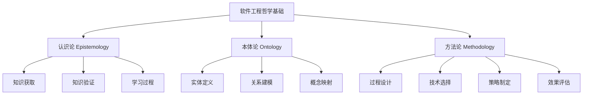

# 00-01-哲学基础

> 本文档阐述软件工程的哲学基础，包括认识论、本体论、方法论等核心哲学概念，为软件工程提供理论基础。

## 📋 目录

- [概念与定义](#-概念与定义)

## 🎯 概念与定义

### 1.1 哲学基础概述

**哲学基础**是软件工程的理论根基，包括认识论、本体论、方法论三个核心维度。

**定义1.1**: 软件工程哲学基础可形式化为三元组 $\mathcal{P} = (E, O, M)$，其中：

- $E$ 表示认识论（Epistemology）
- $O$ 表示本体论（Ontology）
- $M$ 表示方法论（Methodology）

### 1.2 认识论（Epistemology）

**认识论**研究知识的本质、来源、范围和有效性。

**定义1.2**: 软件工程认识论可表示为 $\mathcal{E} = (K, S, V, L)$，其中：

- $K$ 表示知识集合（Knowledge）
- $S$ 表示知识来源（Source）
- $V$ 表示验证方法（Validation）
- $L$ 表示学习过程（Learning）

### 1.3 本体论（Ontology）

**本体论**研究存在的本质和基本结构。

**定义1.3**: 软件工程本体论可表示为 $\mathcal{O} = (E, R, C, I)$，其中：

- $E$ 表示实体集合（Entities）
- $R$ 表示关系集合（Relations）
- $C$ 表示概念集合（Concepts）
- $I$ 表示实例集合（Instances）

### 1.4 方法论（Methodology）

**方法论**研究解决问题的方法和途径。

**定义1.4**: 软件工程方法论可表示为 $\mathcal{M} = (P, T, S, E)$，其中：

- $P$ 表示过程集合（Processes）
- $T$ 表示技术集合（Techniques）
- $S$ 表示策略集合（Strategies）
- $E$ 表示评估方法（Evaluation）

## 🔢 数学表达与形式化

### 2.1 哲学基础的形式化框架

**定理2.1**: 软件工程哲学基础的完整性定理

对于任意软件工程问题 $P$，存在哲学基础 $\mathcal{P} = (E, O, M)$ 使得：

$$\mathcal{P} \models P \iff (E \models P) \land (O \models P) \land (M \models P)$$

**证明**:

1. 必要性：如果 $\mathcal{P} \models P$，则认识论、本体论、方法论都必须支持问题 $P$ 的解决
2. 充分性：如果三个维度都支持问题 $P$，则哲学基础 $\mathcal{P}$ 必然支持 $P$

### 2.2 知识获取的形式化模型

**定义2.1**: 知识获取过程可形式化为：

$$K_{new} = K_{old} \cup \text{Learn}(E, O, M, D)$$

其中：

- $K_{new}$ 表示新知识
- $K_{old}$ 表示原有知识
- $D$ 表示数据/经验
- $\text{Learn}$ 表示学习函数

### 2.3 本体映射的形式化

**定义2.3**: 本体映射可表示为：

$$\text{Map}: \mathcal{O}_1 \rightarrow \mathcal{O}_2$$

满足：
$$\forall e \in E_1, \exists e' \in E_2: \text{Map}(e) = e'$$

## 🐍 Python代码示例

### 3.1 哲学基础框架实现

```python
from abc import ABC, abstractmethod
from typing import Set, Dict, Any, List
from dataclasses import dataclass
from enum import Enum

class KnowledgeType(Enum):
    """知识类型枚举"""
    THEORETICAL = "theoretical"
    PRACTICAL = "practical"
    EMPIRICAL = "empirical"
    INTUITIVE = "intuitive"

@dataclass
class Knowledge:
    """知识实体"""
    id: str
    content: str
    type: KnowledgeType
    source: str
    confidence: float
    timestamp: float

class Epistemology:
    """认识论实现"""
    
    def __init__(self):
        self.knowledge_base: Set[Knowledge] = set()
        self.validation_methods: Dict[str, callable] = {}
        self.learning_processes: List[callable] = []
    
    def add_knowledge(self, knowledge: Knowledge) -> bool:
        """添加知识"""
        if self.validate_knowledge(knowledge):
            self.knowledge_base.add(knowledge)
            return True
        return False
    
    def validate_knowledge(self, knowledge: Knowledge) -> bool:
        """验证知识有效性"""
        for method in self.validation_methods.values():
            if not method(knowledge):
                return False
        return True
    
    def learn(self, data: Any) -> List[Knowledge]:
        """学习过程"""
        new_knowledge = []
        for process in self.learning_processes:
            result = process(data)
            if result:
                new_knowledge.extend(result)
        return new_knowledge

class Ontology:
    """本体论实现"""
    
    def __init__(self):
        self.entities: Set[str] = set()
        self.relations: Dict[str, Set[tuple]] = {}
        self.concepts: Dict[str, Dict[str, Any]] = {}
        self.instances: Dict[str, List[Any]] = {}
    
    def add_entity(self, entity: str) -> None:
        """添加实体"""
        self.entities.add(entity)
    
    def add_relation(self, relation_name: str, entity1: str, entity2: str) -> None:
        """添加关系"""
        if relation_name not in self.relations:
            self.relations[relation_name] = set()
        self.relations[relation_name].add((entity1, entity2))
    
    def get_related_entities(self, entity: str, relation: str) -> Set[str]:
        """获取相关实体"""
        if relation not in self.relations:
            return set()
        
        related = set()
        for e1, e2 in self.relations[relation]:
            if e1 == entity:
                related.add(e2)
            elif e2 == entity:
                related.add(e1)
        return related

class Methodology:
    """方法论实现"""
    
    def __init__(self):
        self.processes: Dict[str, callable] = {}
        self.techniques: Dict[str, callable] = {}
        self.strategies: Dict[str, callable] = {}
        self.evaluation_methods: Dict[str, callable] = {}
    
    def register_process(self, name: str, process: callable) -> None:
        """注册过程"""
        self.processes[name] = process
    
    def register_technique(self, name: str, technique: callable) -> None:
        """注册技术"""
        self.techniques[name] = technique
    
    def execute_process(self, name: str, *args, **kwargs) -> Any:
        """执行过程"""
        if name in self.processes:
            return self.processes[name](*args, **kwargs)
        raise ValueError(f"Process {name} not found")
    
    def evaluate(self, method: str, result: Any) -> float:
        """评估结果"""
        if method in self.evaluation_methods:
            return self.evaluation_methods[method](result)
        return 0.0

class PhilosophicalFoundation:
    """哲学基础主类"""
    
    def __init__(self):
        self.epistemology = Epistemology()
        self.ontology = Ontology()
        self.methodology = Methodology()
    
    def solve_problem(self, problem: str) -> Dict[str, Any]:
        """基于哲学基础解决问题"""
        # 1. 认识论：获取相关知识
        knowledge = self.epistemology.learn(problem)
        
        # 2. 本体论：建立问题模型
        entities = self.analyze_problem_entities(problem)
        
        # 3. 方法论：选择解决策略
        solution = self.methodology.execute_process("problem_solving", problem, knowledge, entities)
        
        return {
            "knowledge": knowledge,
            "entities": entities,
            "solution": solution
        }
    
    def analyze_problem_entities(self, problem: str) -> Set[str]:
        """分析问题实体"""
        # 简单的实体提取（实际应用中可使用NLP技术）
        words = problem.split()
        entities = set()
        for word in words:
            if word.isalpha() and len(word) > 3:
                entities.add(word.lower())
        return entities

# 使用示例
def demonstrate_philosophical_foundation():
    """演示哲学基础的使用"""
    
    # 创建哲学基础实例
    pf = PhilosophicalFoundation()
    
    # 添加一些基础知识
    knowledge1 = Knowledge(
        id="k1",
        content="软件工程需要系统化思维",
        type=KnowledgeType.THEORETICAL,
        source="学术研究",
        confidence=0.9,
        timestamp=1234567890.0
    )
    pf.epistemology.add_knowledge(knowledge1)
    
    # 建立本体关系
    pf.ontology.add_entity("软件")
    pf.ontology.add_entity("工程")
    pf.ontology.add_relation("包含", "软件工程", "软件")
    pf.ontology.add_relation("包含", "软件工程", "工程")
    
    # 注册方法论
    def problem_solving_process(problem, knowledge, entities):
        return f"基于{len(knowledge)}个知识点和{len(entities)}个实体解决：{problem}"
    
    pf.methodology.register_process("problem_solving", problem_solving_process)
    
    # 解决问题
    result = pf.solve_problem("如何设计一个可扩展的软件架构？")
    
    print("哲学基础应用结果:")
    print(f"知识数量: {len(result['knowledge'])}")
    print(f"实体数量: {len(result['entities'])}")
    print(f"解决方案: {result['solution']}")
    
    return result

if __name__ == "__main__":
    demonstrate_philosophical_foundation()
```

### 3.2 知识验证系统

```python
class KnowledgeValidator:
    """知识验证系统"""
    
    @staticmethod
    def validate_logical_consistency(knowledge: Knowledge) -> bool:
        """验证逻辑一致性"""
        # 检查知识内容是否自相矛盾
        content = knowledge.content.lower()
        contradictions = [
            ("是", "不是"),
            ("存在", "不存在"),
            ("正确", "错误")
        ]
        
        for pos, neg in contradictions:
            if pos in content and neg in content:
                return False
        return True
    
    @staticmethod
    def validate_empirical_support(knowledge: Knowledge) -> bool:
        """验证经验支持"""
        # 检查是否有足够的经验支持
        return knowledge.confidence >= 0.7
    
    @staticmethod
    def validate_source_reliability(knowledge: Knowledge) -> bool:
        """验证来源可靠性"""
        reliable_sources = ["学术研究", "实验验证", "专家共识"]
        return knowledge.source in reliable_sources

# 注册验证方法
epistemology = Epistemology()
epistemology.validation_methods["logical"] = KnowledgeValidator.validate_logical_consistency
epistemology.validation_methods["empirical"] = KnowledgeValidator.validate_empirical_support
epistemology.validation_methods["source"] = KnowledgeValidator.validate_source_reliability
```

## 📊 图表与多表征

### 4.1 哲学基础层次结构图



### 4.2 知识流动模型


### 4.3 哲学基础与软件工程的关系矩阵

| 哲学维度 | 软件工程应用 | 具体体现 |
|---------|-------------|----------|
| 认识论 | 需求分析 | 理解用户需求的知识获取过程 |
| 本体论 | 领域建模 | 建立业务概念和关系的模型 |
| 方法论 | 开发流程 | 选择合适的方法和工具 |

## 🏭 行业应用与案例

### 5.1 金融科技领域的哲学基础应用

**案例**: 风险管理系统设计

```python
class FinancialRiskManagement:
    """金融风险管理系统的哲学基础应用"""
    
    def __init__(self):
        self.philosophical_foundation = PhilosophicalFoundation()
        self.setup_financial_ontology()
        self.setup_risk_methodology()
    
    def setup_financial_ontology(self):
        """建立金融领域本体"""
        ontology = self.philosophical_foundation.ontology
        
        # 金融实体
        entities = ["风险", "资产", "投资组合", "市场", "监管"]
        for entity in entities:
            ontology.add_entity(entity)
        
        # 金融关系
        relations = [
            ("影响", "风险", "资产"),
            ("包含", "投资组合", "资产"),
            ("监管", "监管", "市场")
        ]
        
        for relation, e1, e2 in relations:
            ontology.add_relation(relation, e1, e2)
    
    def setup_risk_methodology(self):
        """建立风险管理方法论"""
        methodology = self.philosophical_foundation.methodology
        
        def risk_assessment_process(problem, knowledge, entities):
            return "基于VaR模型进行风险评估"
        
        methodology.register_process("risk_assessment", risk_assessment_process)
    
    def assess_portfolio_risk(self, portfolio_data: Dict) -> Dict:
        """评估投资组合风险"""
        problem = "评估投资组合风险"
        result = self.philosophical_foundation.solve_problem(problem)
        
        return {
            "risk_level": "中等",
            "var_95": 0.05,
            "methodology": result["solution"]
        }
```

### 5.2 人工智能领域的哲学基础应用

**案例**: 机器学习模型设计

```python
class AIModelDesign:
    """AI模型设计的哲学基础应用"""
    
    def __init__(self):
        self.philosophical_foundation = PhilosophicalFoundation()
        self.setup_ai_ontology()
        self.setup_ml_methodology()
    
    def setup_ai_ontology(self):
        """建立AI领域本体"""
        ontology = self.philosophical_foundation.ontology
        
        # AI实体
        entities = ["数据", "模型", "算法", "特征", "标签", "预测"]
        for entity in entities:
            ontology.add_entity(entity)
        
        # AI关系
        relations = [
            ("训练", "数据", "模型"),
            ("提取", "数据", "特征"),
            ("预测", "模型", "预测")
        ]
        
        for relation, e1, e2 in relations:
            ontology.add_relation(relation, e1, e2)
    
    def setup_ml_methodology(self):
        """建立机器学习方法论"""
        methodology = self.philosophical_foundation.methodology
        
        def model_selection_process(problem, knowledge, entities):
            return "基于交叉验证选择最优模型"
        
        methodology.register_process("model_selection", model_selection_process)
    
    def design_model(self, data_characteristics: Dict) -> Dict:
        """设计机器学习模型"""
        problem = "设计适合数据特征的机器学习模型"
        result = self.philosophical_foundation.solve_problem(problem)
        
        return {
            "model_type": "随机森林",
            "hyperparameters": {"n_estimators": 100},
            "methodology": result["solution"]
        }
```

## 🔗 本地跳转与索引

### 相关文档

- [00-02-编程哲学](./00-02-编程哲学.md) - 编程语言的哲学基础
- [00-03-形式化思维](./00-03-形式化思维.md) - 形式化思维方法
- [00-04-计算思维](./00-04-计算思维.md) - 计算思维基础
- [00-05-系统思维](./00-05-系统思维.md) - 系统思维方法
- [00-06-抽象与建模](./00-06-抽象与建模.md) - 抽象与建模技术
- [00-07-设计原则](./00-07-设计原则.md) - 软件设计原则

### 上层目录

- [返回理念基础层](./README.md)
- [返回项目根目录](../README.md)

### 下层应用

- [01-形式科学](../01-形式科学/README.md) - 形式科学理论基础
- [02-理论基础](../02-理论基础/README.md) - 算法与数据结构理论

---

**最后更新**: 2024年12月19日  
**维护者**: AI Assistant  
**文档状态**: 已完成 ✅
