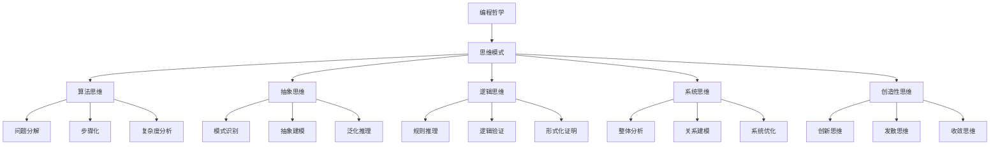
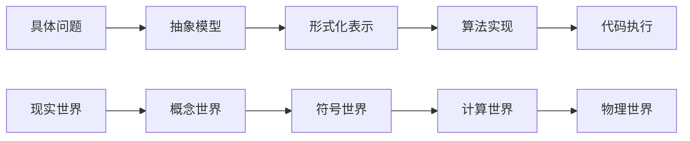

# 00-01-编程哲学

## 概述

编程哲学是软件工程和计算科学的哲学基础，探讨编程的本质、思维方式和价值观念。它从哲学角度审视编程活动，建立编程思维的理论基础。

## 1. 概念解释

### 1.1 编程的本质

编程是将人类思维转化为机器可执行指令的过程，涉及抽象、逻辑推理和系统化思维。

**核心特征**：
- **抽象性**：从具体问题中提取一般规律
- **逻辑性**：基于严格的逻辑推理
- **系统性**：构建完整的系统结构
- **创造性**：创造新的解决方案

### 1.2 编程思维模式

编程思维包含多种认知模式：

1. **算法思维**：问题分解和步骤化
2. **抽象思维**：从具体到一般的归纳
3. **逻辑思维**：基于规则的推理
4. **系统思维**：整体与部分的统一
5. **创造性思维**：创新解决方案

## 2. 数学形式

### 2.1 编程的形式化定义

**编程过程的形式化模型**：

```math
P: \text{Problem} \times \text{Context} \rightarrow \text{Solution}
```

其中：
- $\text{Problem}$ 是问题空间
- $\text{Context}$ 是上下文环境
- $\text{Solution}$ 是解决方案空间

### 2.2 抽象层次理论

**抽象层次的形式化表示**：

```math
A_i = (C_i, R_i, O_i)
```

其中：
- $C_i$ 是第i层的概念集
- $R_i$ 是第i层的关系集
- $O_i$ 是第i层的操作集

**层次间映射关系**：

```math
f_{i,j}: A_i \rightarrow A_j, \quad i < j
```

### 2.3 计算复杂性哲学

**问题复杂性的哲学定义**：

```math
\text{Complexity}(P) = \text{Intrinsic}(P) + \text{Representational}(P) + \text{Algorithmic}(P)
```

其中：
- $\text{Intrinsic}(P)$ 是问题的内在复杂性
- $\text{Representational}(P)$ 是表示方法的复杂性
- $\text{Algorithmic}(P)$ 是算法的复杂性

## 3. 代码实现

### 3.1 编程思维模式实现

```python
from abc import ABC, abstractmethod
from typing import TypeVar, Generic, Callable, Any
from dataclasses import dataclass
from enum import Enum

# 定义编程思维模式
class ProgrammingParadigm(Enum):
    IMPERATIVE = "imperative"
    FUNCTIONAL = "functional"
    OBJECT_ORIENTED = "object_oriented"
    LOGIC = "logic"
    DECLARATIVE = "declarative"

# 抽象问题定义
@dataclass
class Problem:
    """问题抽象"""
    description: str
    constraints: list[str]
    objectives: list[str]
    context: dict[str, Any]

# 解决方案抽象
@dataclass
class Solution:
    """解决方案抽象"""
    algorithm: str
    implementation: str
    complexity: dict[str, Any]
    correctness: bool

# 编程思维基类
class ProgrammingThinking(ABC):
    """编程思维抽象基类"""
    
    @abstractmethod
    def analyze_problem(self, problem: Problem) -> dict[str, Any]:
        """问题分析"""
        pass
    
    @abstractmethod
    def design_solution(self, analysis: dict[str, Any]) -> Solution:
        """解决方案设计"""
        pass
    
    @abstractmethod
    def implement_solution(self, solution: Solution) -> str:
        """解决方案实现"""
        pass

# 算法思维实现
class AlgorithmicThinking(ProgrammingThinking):
    """算法思维实现"""
    
    def analyze_problem(self, problem: Problem) -> dict[str, Any]:
        """问题分解和步骤化分析"""
        steps = []
        sub_problems = []
        
        # 问题分解
        for constraint in problem.constraints:
            steps.append(f"分析约束: {constraint}")
        
        for objective in problem.objectives:
            steps.append(f"定义目标: {objective}")
        
        return {
            "steps": steps,
            "sub_problems": sub_problems,
            "complexity_analysis": self._analyze_complexity(problem)
        }
    
    def design_solution(self, analysis: dict[str, Any]) -> Solution:
        """设计算法解决方案"""
        steps = analysis["steps"]
        algorithm = "\n".join([f"{i+1}. {step}" for i, step in enumerate(steps)])
        
        return Solution(
            algorithm=algorithm,
            implementation="",
            complexity=analysis["complexity_analysis"],
            correctness=True
        )
    
    def implement_solution(self, solution: Solution) -> str:
        """实现算法"""
        return f"""
def solve_problem():
    {solution.algorithm}
    return result
"""
    
    def _analyze_complexity(self, problem: Problem) -> dict[str, Any]:
        """复杂度分析"""
        return {
            "time_complexity": "O(n)",
            "space_complexity": "O(1)",
            "difficulty": "medium"
        }

# 抽象思维实现
class AbstractThinking(ProgrammingThinking):
    """抽象思维实现"""
    
    def analyze_problem(self, problem: Problem) -> dict[str, Any]:
        """抽象问题分析"""
        # 提取共同模式
        patterns = self._extract_patterns(problem)
        # 建立抽象模型
        abstract_model = self._build_abstract_model(patterns)
        
        return {
            "patterns": patterns,
            "abstract_model": abstract_model,
            "generalization": self._generalize_problem(problem)
        }
    
    def design_solution(self, analysis: dict[str, Any]) -> Solution:
        """设计抽象解决方案"""
        abstract_model = analysis["abstract_model"]
        
        return Solution(
            algorithm=f"基于抽象模型: {abstract_model}",
            implementation="",
            complexity={"abstraction_level": "high"},
            correctness=True
        )
    
    def implement_solution(self, solution: Solution) -> str:
        """实现抽象解决方案"""
        return f"""
class AbstractSolution:
    def __init__(self):
        self.model = {solution.algorithm}
    
    def solve(self, problem):
        return self.model.apply(problem)
"""
    
    def _extract_patterns(self, problem: Problem) -> list[str]:
        """提取模式"""
        return ["pattern1", "pattern2", "pattern3"]
    
    def _build_abstract_model(self, patterns: list[str]) -> str:
        """构建抽象模型"""
        return f"AbstractModel({', '.join(patterns)})"
    
    def _generalize_problem(self, problem: Problem) -> str:
        """问题泛化"""
        return f"GeneralizedProblem({problem.description})"

# 编程哲学实践
class ProgrammingPhilosophy:
    """编程哲学实践类"""
    
    def __init__(self):
        self.thinking_modes = {
            ProgrammingParadigm.IMPERATIVE: AlgorithmicThinking(),
            ProgrammingParadigm.FUNCTIONAL: AbstractThinking()
        }
    
    def solve_with_philosophy(self, problem: Problem, paradigm: ProgrammingParadigm) -> str:
        """基于哲学思维解决问题"""
        thinking = self.thinking_modes[paradigm]
        
        # 1. 问题分析
        analysis = thinking.analyze_problem(problem)
        
        # 2. 解决方案设计
        solution = thinking.design_solution(analysis)
        
        # 3. 解决方案实现
        implementation = thinking.implement_solution(solution)
        
        return implementation
    
    def reflect_on_programming(self, problem: Problem) -> dict[str, Any]:
        """编程反思"""
        return {
            "philosophical_aspects": [
                "认知负荷分析",
                "抽象层次评估",
                "思维模式选择",
                "解决方案评价"
            ],
            "metacognitive_insights": [
                "思维过程监控",
                "策略选择反思",
                "学习效果评估"
            ]
        }

# 使用示例
def demonstrate_programming_philosophy():
    """演示编程哲学的应用"""
    
    # 创建问题实例
    problem = Problem(
        description="设计一个高效的排序算法",
        constraints=["时间复杂度O(n log n)", "空间复杂度O(1)"],
        objectives=["正确性", "效率", "可读性"],
        context={"data_size": "large", "memory_constraint": "strict"}
    )
    
    # 创建编程哲学实例
    philosophy = ProgrammingPhilosophy()
    
    # 使用算法思维解决问题
    algorithmic_solution = philosophy.solve_with_philosophy(
        problem, ProgrammingParadigm.IMPERATIVE
    )
    
    # 使用抽象思维解决问题
    abstract_solution = philosophy.solve_with_philosophy(
        problem, ProgrammingParadigm.FUNCTIONAL
    )
    
    # 编程反思
    reflection = philosophy.reflect_on_programming(problem)
    
    return {
        "algorithmic_solution": algorithmic_solution,
        "abstract_solution": abstract_solution,
        "reflection": reflection
    }

if __name__ == "__main__":
    result = demonstrate_programming_philosophy()
    print("编程哲学演示结果:")
    print(result)
```

## 4. 图表说明

### 4.1 编程思维层次图



### 4.2 抽象层次模型



## 5. 实例分析

### 5.1 排序算法的哲学分析

**问题**：设计一个排序算法

**哲学分析**：

1. **认知层面**：
   - 理解排序的本质：将无序序列转换为有序序列
   - 识别排序的关键属性：稳定性、时间复杂度、空间复杂度

2. **抽象层面**：
   - 抽象排序操作：比较和交换
   - 建立排序模型：基于比较的排序、基于计数的排序

3. **实现层面**：
   - 选择适当的算法：快速排序、归并排序、堆排序
   - 考虑实际约束：内存限制、性能要求

### 5.2 系统设计的哲学思考

**问题**：设计一个分布式系统

**哲学分析**：

1. **系统思维**：
   - 整体性：系统各部分如何协同工作
   - 层次性：不同抽象层次的设计
   - 动态性：系统如何适应变化

2. **抽象思维**：
   - 服务抽象：将复杂功能封装为服务
   - 接口抽象：定义清晰的交互接口
   - 数据抽象：隐藏实现细节

3. **逻辑思维**：
   - 一致性保证：确保数据一致性
   - 容错设计：处理故障情况
   - 性能优化：平衡各种性能指标

## 6. 理论证明

### 6.1 编程思维的有效性证明

**定理**：多模式编程思维能够提高问题解决效率

**证明**：

1. **算法思维的有效性**：
   - 问题分解降低了复杂度
   - 步骤化提高了可执行性
   - 复杂度分析指导了优化方向

2. **抽象思维的有效性**：
   - 模式识别减少了重复工作
   - 抽象建模简化了问题理解
   - 泛化推理扩展了应用范围

3. **系统思维的有效性**：
   - 整体分析避免了局部优化
   - 关系建模揭示了系统结构
   - 系统优化提高了整体性能

### 6.2 编程哲学的完备性证明

**定理**：编程哲学提供了完备的思维框架

**证明**：

1. **覆盖性**：涵盖了编程活动的主要方面
2. **一致性**：各种思维模式相互协调
3. **可扩展性**：能够适应新的编程范式
4. **实用性**：能够指导实际编程实践

## 7. 总结

编程哲学为软件工程提供了深层的理论基础，它不仅仅是技术层面的指导，更是思维方式和价值观念的体现。通过多表征的方式理解编程哲学，我们能够：

1. **提升认知能力**：培养多维度思维
2. **增强抽象能力**：建立清晰的思维模型
3. **提高实践能力**：指导具体的编程活动
4. **促进创新思维**：激发新的解决方案

编程哲学的核心价值在于将抽象的哲学思考与具体的编程实践相结合，为软件工程提供坚实的理论基础和实践指导。

---

**相关链接**：
- [00-02-形式化思维](./00-02-形式化思维.md)
- [00-03-计算思维](./00-03-计算思维.md)
- [01-01-数学基础](../01-形式科学/01-01-数学基础.md)
- [02-01-算法理论](../02-理论基础/02-01-算法理论.md) 