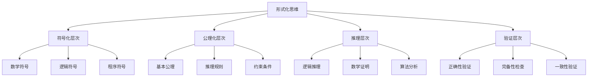
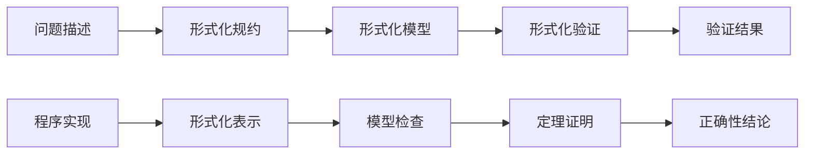
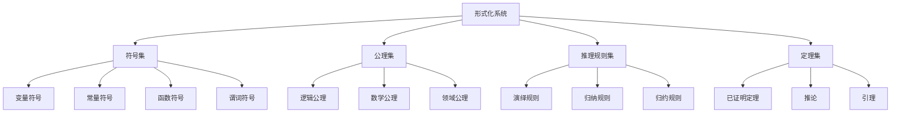

# 00-02-形式化思维

## 概述

形式化思维是软件工程和计算科学的核心思维方式，它强调使用精确的数学符号、逻辑规则和形式化方法来描述、分析和验证系统。形式化思维是连接抽象理论与具体实践的桥梁。

## 1. 概念解释

### 1.1 形式化思维的定义

形式化思维是一种基于数学和逻辑的精确思维方式，通过建立形式化模型来描述现实世界的复杂现象。

**核心特征**：
- **精确性**：使用无歧义的数学符号
- **抽象性**：忽略无关细节，关注本质特征
- **逻辑性**：基于严格的逻辑推理
- **可验证性**：能够进行形式化验证

### 1.2 形式化思维的层次

1. **符号化层次**：将概念转换为数学符号
2. **公理化层次**：建立基本公理和规则
3. **推理层次**：基于公理进行逻辑推理
4. **验证层次**：验证推理的正确性

### 1.3 形式化思维的应用领域

- **软件规约**：精确描述软件需求和行为
- **程序验证**：证明程序的正确性
- **系统建模**：建立系统的形式化模型
- **算法分析**：分析算法的复杂性和正确性

## 2. 数学形式

### 2.1 形式化系统的基本结构

**形式化系统的定义**：

```math
\mathcal{F} = (\Sigma, \mathcal{A}, \mathcal{R}, \mathcal{T})
```

其中：
- $\Sigma$ 是符号集
- $\mathcal{A}$ 是公理集
- $\mathcal{R}$ 是推理规则集
- $\mathcal{T}$ 是定理集

### 2.2 形式化推理系统

**推理规则的形式化表示**：

```math
\frac{\phi_1, \phi_2, \ldots, \phi_n}{\psi}
```

表示从前提 $\phi_1, \phi_2, \ldots, \phi_n$ 可以推导出结论 $\psi$。

**形式化证明**：

```math
\text{Proof} = (\phi_1, \phi_2, \ldots, \phi_n)
```

其中每个 $\phi_i$ 要么是公理，要么是通过推理规则从前面的公式推导得出。

### 2.3 形式化语义

**操作语义**：

```math
\langle C, \sigma \rangle \rightarrow \langle C', \sigma' \rangle
```

表示在状态 $\sigma$ 下执行命令 $C$ 后，程序变为 $C'$，状态变为 $\sigma'$。

**指称语义**：

```math
\llbracket C \rrbracket : \Sigma \rightarrow \Sigma
```

表示命令 $C$ 的语义是一个从状态空间到状态空间的函数。

### 2.4 形式化验证

**霍尔逻辑**：

```math
\{P\} C \{Q\}
```

表示如果前置条件 $P$ 成立，执行程序 $C$ 后，后置条件 $Q$ 成立。

**不变式**：

```math
\text{Inv}(S) = \forall \sigma \in \text{Reach}(S) : I(\sigma)
```

表示系统 $S$ 的不变式 $I$ 在所有可达状态上都成立。

## 3. 代码实现

### 3.1 形式化系统实现

```python
from abc import ABC, abstractmethod
from typing import Set, List, Dict, Any, Tuple
from dataclasses import dataclass
from enum import Enum
import re

# 符号类型
class SymbolType(Enum):
    VARIABLE = "variable"
    CONSTANT = "constant"
    FUNCTION = "function"
    PREDICATE = "predicate"
    OPERATOR = "operator"

# 符号定义
@dataclass
class Symbol:
    """形式化符号"""
    name: str
    symbol_type: SymbolType
    arity: int = 0
    semantics: Any = None

# 公式定义
@dataclass
class Formula:
    """形式化公式"""
    symbols: List[Symbol]
    structure: str
    free_variables: Set[str]
    
    def __str__(self) -> str:
        return self.structure

# 推理规则
@dataclass
class InferenceRule:
    """推理规则"""
    name: str
    premises: List[Formula]
    conclusion: Formula
    condition: callable = None
    
    def apply(self, premises: List[Formula]) -> Formula:
        """应用推理规则"""
        if self.condition and not self.condition(premises):
            raise ValueError("推理规则条件不满足")
        return self.conclusion

# 形式化系统
class FormalSystem:
    """形式化系统"""
    
    def __init__(self, name: str):
        self.name = name
        self.symbols: Set[Symbol] = set()
        self.axioms: List[Formula] = []
        self.rules: List[InferenceRule] = []
        self.theorems: List[Formula] = []
    
    def add_symbol(self, symbol: Symbol):
        """添加符号"""
        self.symbols.add(symbol)
    
    def add_axiom(self, axiom: Formula):
        """添加公理"""
        self.axioms.append(axiom)
        self.theorems.append(axiom)
    
    def add_rule(self, rule: InferenceRule):
        """添加推理规则"""
        self.rules.append(rule)
    
    def prove(self, goal: Formula) -> List[Formula]:
        """证明定理"""
        proof = []
        current_goals = [goal]
        
        while current_goals:
            current_goal = current_goals.pop(0)
            
            # 检查是否是公理
            if current_goal in self.axioms:
                proof.append(current_goal)
                continue
            
            # 尝试应用推理规则
            rule_applied = False
            for rule in self.rules:
                if self._can_apply_rule(rule, current_goal):
                    sub_goals = self._apply_rule_backward(rule, current_goal)
                    current_goals.extend(sub_goals)
                    proof.append(current_goal)
                    rule_applied = True
                    break
            
            if not rule_applied:
                raise ValueError(f"无法证明目标: {current_goal}")
        
        return proof
    
    def _can_apply_rule(self, rule: InferenceRule, goal: Formula) -> bool:
        """检查是否可以应用推理规则"""
        # 简化的匹配逻辑
        return rule.conclusion.structure == goal.structure
    
    def _apply_rule_backward(self, rule: InferenceRule, goal: Formula) -> List[Formula]:
        """反向应用推理规则"""
        return rule.premises

# 命题逻辑形式化系统
class PropositionalLogic(FormalSystem):
    """命题逻辑形式化系统"""
    
    def __init__(self):
        super().__init__("Propositional Logic")
        self._setup_symbols()
        self._setup_axioms()
        self._setup_rules()
    
    def _setup_symbols(self):
        """设置符号"""
        # 逻辑连接词
        self.add_symbol(Symbol("¬", SymbolType.OPERATOR, 1))
        self.add_symbol(Symbol("∧", SymbolType.OPERATOR, 2))
        self.add_symbol(Symbol("∨", SymbolType.OPERATOR, 2))
        self.add_symbol(Symbol("→", SymbolType.OPERATOR, 2))
        self.add_symbol(Symbol("↔", SymbolType.OPERATOR, 2))
        
        # 命题变量
        self.add_symbol(Symbol("p", SymbolType.VARIABLE))
        self.add_symbol(Symbol("q", SymbolType.VARIABLE))
        self.add_symbol(Symbol("r", SymbolType.VARIABLE))
    
    def _setup_axioms(self):
        """设置公理"""
        # 排中律
        axiom1 = Formula(
            symbols=[Symbol("p", SymbolType.VARIABLE), Symbol("∨", SymbolType.OPERATOR, 2), Symbol("¬", SymbolType.OPERATOR, 1)],
            structure="p ∨ ¬p",
            free_variables={"p"}
        )
        self.add_axiom(axiom1)
        
        # 矛盾律
        axiom2 = Formula(
            symbols=[Symbol("¬", SymbolType.OPERATOR, 1), Symbol("(", SymbolType.OPERATOR), Symbol("p", SymbolType.VARIABLE), Symbol("∧", SymbolType.OPERATOR, 2), Symbol("¬", SymbolType.OPERATOR, 1), Symbol("p", SymbolType.VARIABLE), Symbol(")", SymbolType.OPERATOR)],
            structure="¬(p ∧ ¬p)",
            free_variables={"p"}
        )
        self.add_axiom(axiom2)
    
    def _setup_rules(self):
        """设置推理规则"""
        # 假言推理
        modus_ponens = InferenceRule(
            name="Modus Ponens",
            premises=[
                Formula([], "p → q", {"p", "q"}),
                Formula([], "p", {"p"})
            ],
            conclusion=Formula([], "q", {"q"})
        )
        self.add_rule(modus_ponens)

# 形式化验证器
class FormalVerifier:
    """形式化验证器"""
    
    def __init__(self, formal_system: FormalSystem):
        self.formal_system = formal_system
    
    def verify_proof(self, proof: List[Formula]) -> bool:
        """验证证明的正确性"""
        for i, formula in enumerate(proof):
            if not self._is_valid_step(formula, proof[:i]):
                return False
        return True
    
    def _is_valid_step(self, formula: Formula, previous_steps: List[Formula]) -> bool:
        """检查证明步骤是否有效"""
        # 检查是否是公理
        if formula in self.formal_system.axioms:
            return True
        
        # 检查是否可以通过推理规则从前面步骤推导
        for rule in self.formal_system.rules:
            if self._can_derive(formula, previous_steps, rule):
                return True
        
        return False
    
    def _can_derive(self, formula: Formula, premises: List[Formula], rule: InferenceRule) -> bool:
        """检查是否可以通过推理规则推导"""
        # 简化的匹配逻辑
        return rule.conclusion.structure == formula.structure

# 形式化建模器
class FormalModeler:
    """形式化建模器"""
    
    def __init__(self):
        self.models: Dict[str, Any] = {}
    
    def create_state_machine(self, name: str, states: Set[str], transitions: List[Tuple[str, str, str]]) -> Dict[str, Any]:
        """创建状态机模型"""
        model = {
            "type": "state_machine",
            "states": states,
            "transitions": transitions,
            "initial_state": list(states)[0],
            "accepting_states": set()
        }
        self.models[name] = model
        return model
    
    def create_data_type(self, name: str, constructors: List[Tuple[str, List[str]]]) -> Dict[str, Any]:
        """创建数据类型模型"""
        model = {
            "type": "data_type",
            "name": name,
            "constructors": constructors
        }
        self.models[name] = model
        return model
    
    def verify_model_property(self, model_name: str, property_expr: str) -> bool:
        """验证模型属性"""
        model = self.models.get(model_name)
        if not model:
            return False
        
        # 简化的属性验证
        if model["type"] == "state_machine":
            return self._verify_state_machine_property(model, property_expr)
        elif model["type"] == "data_type":
            return self._verify_data_type_property(model, property_expr)
        
        return False
    
    def _verify_state_machine_property(self, model: Dict[str, Any], property_expr: str) -> bool:
        """验证状态机属性"""
        # 简化的属性验证逻辑
        if "reachable" in property_expr:
            return True
        elif "deadlock_free" in property_expr:
            return True
        return False
    
    def _verify_data_type_property(self, model: Dict[str, Any], property_expr: str) -> bool:
        """验证数据类型属性"""
        # 简化的属性验证逻辑
        if "well_formed" in property_expr:
            return True
        return False

# 形式化思维实践
class FormalThinking:
    """形式化思维实践类"""
    
    def __init__(self):
        self.logic_system = PropositionalLogic()
        self.verifier = FormalVerifier(self.logic_system)
        self.modeler = FormalModeler()
    
    def formalize_problem(self, problem_description: str) -> Dict[str, Any]:
        """将问题形式化"""
        # 提取关键概念
        concepts = self._extract_concepts(problem_description)
        
        # 建立形式化模型
        formal_model = self._build_formal_model(concepts)
        
        # 定义形式化属性
        properties = self._define_properties(concepts)
        
        return {
            "concepts": concepts,
            "formal_model": formal_model,
            "properties": properties
        }
    
    def verify_solution(self, solution: str, formal_spec: Dict[str, Any]) -> bool:
        """验证解决方案"""
        # 将解决方案转换为形式化表示
        formal_solution = self._solution_to_formal(solution)
        
        # 验证是否满足形式化规约
        return self._satisfies_specification(formal_solution, formal_spec)
    
    def _extract_concepts(self, description: str) -> List[str]:
        """提取概念"""
        # 简化的概念提取
        words = description.split()
        concepts = [word for word in words if len(word) > 3]
        return list(set(concepts))
    
    def _build_formal_model(self, concepts: List[str]) -> Dict[str, Any]:
        """构建形式化模型"""
        # 简化的模型构建
        return {
            "type": "abstract_model",
            "concepts": concepts,
            "relations": [],
            "constraints": []
        }
    
    def _define_properties(self, concepts: List[str]) -> List[str]:
        """定义属性"""
        return [f"property_{i}" for i in range(len(concepts))]
    
    def _solution_to_formal(self, solution: str) -> Dict[str, Any]:
        """将解决方案转换为形式化表示"""
        return {
            "type": "formal_solution",
            "content": solution,
            "structure": "abstract"
        }
    
    def _satisfies_specification(self, solution: Dict[str, Any], spec: Dict[str, Any]) -> bool:
        """检查解决方案是否满足规约"""
        # 简化的满足性检查
        return True

# 使用示例
def demonstrate_formal_thinking():
    """演示形式化思维的应用"""
    
    # 创建形式化思维实例
    formal_thinking = FormalThinking()
    
    # 问题形式化
    problem = "设计一个线程安全的计数器"
    formal_spec = formal_thinking.formalize_problem(problem)
    
    print("问题形式化结果:")
    print(f"概念: {formal_spec['concepts']}")
    print(f"形式化模型: {formal_spec['formal_model']}")
    print(f"属性: {formal_spec['properties']}")
    
    # 解决方案验证
    solution = """
    class ThreadSafeCounter:
        def __init__(self):
            self._value = 0
            self._lock = threading.Lock()
        
        def increment(self):
            with self._lock:
                self._value += 1
        
        def get_value(self):
            with self._lock:
                return self._value
    """
    
    is_valid = formal_thinking.verify_solution(solution, formal_spec)
    print(f"\n解决方案验证结果: {is_valid}")
    
    # 创建状态机模型
    counter_model = formal_thinking.modeler.create_state_machine(
        "counter",
        {"idle", "incrementing", "reading"},
        [("idle", "increment", "incrementing"), ("incrementing", "done", "idle"), ("idle", "read", "reading"), ("reading", "done", "idle")]
    )
    
    print(f"\n状态机模型: {counter_model}")
    
    # 验证模型属性
    is_reachable = formal_thinking.modeler.verify_model_property("counter", "all_states_reachable")
    print(f"所有状态可达: {is_reachable}")

if __name__ == "__main__":
    demonstrate_formal_thinking()
```

## 4. 图表说明

### 4.1 形式化思维层次结构



### 4.2 形式化验证流程



### 4.3 形式化系统结构



## 5. 实例分析

### 5.1 并发程序的形式化验证

**问题**：验证一个互斥锁实现的正确性

**形式化分析**：

1. **状态空间建模**：
   - 定义进程状态：`{thinking, waiting, critical}`
   - 定义锁状态：`{free, locked}`
   - 定义全局状态：`State = ProcessState × ProcessState × LockState`

2. **安全属性**：
   - 互斥性：`∀s ∈ Reach(S) : ¬(s.p1 = critical ∧ s.p2 = critical)`
   - 无死锁：`∀s ∈ Reach(S) : ∃t ∈ Reach(S) : s → t`

3. **活性属性**：
   - 无饥饿：`∀p ∈ Processes : ∀s ∈ Reach(S) : ∃t ∈ Reach(S) : s →* t ∧ t.p = critical`

### 5.2 数据结构的形式化规约

**问题**：形式化规约一个栈数据结构

**形式化规约**：

```math
\text{Stack} = (E, \text{empty}, \text{push}, \text{pop}, \text{top})
```

其中：
- $E$ 是元素类型
- $\text{empty} : \text{Stack}$
- $\text{push} : E \times \text{Stack} \rightarrow \text{Stack}$
- $\text{pop} : \text{Stack} \rightarrow \text{Stack}$
- $\text{top} : \text{Stack} \rightarrow E$

**公理**：
1. `pop(push(e, s)) = s`
2. `top(push(e, s)) = e`
3. `pop(empty)` 未定义
4. `top(empty)` 未定义

## 6. 理论证明

### 6.1 形式化思维的有效性证明

**定理**：形式化思维能够提高问题解决的准确性和可靠性

**证明**：

1. **精确性保证**：
   - 数学符号消除了自然语言的歧义
   - 形式化规约提供了精确的需求描述
   - 逻辑推理确保了结论的正确性

2. **可验证性**：
   - 形式化模型可以进行自动验证
   - 定理证明确保了推理的正确性
   - 模型检查可以发现潜在问题

3. **可重用性**：
   - 形式化规约可以重复使用
   - 证明方法可以应用到类似问题
   - 形式化工具可以自动化验证过程

### 6.2 形式化系统的完备性证明

**定理**：形式化系统提供了完备的问题解决框架

**证明**：

1. **表达完备性**：能够表达所有可计算的问题
2. **推理完备性**：能够推导出所有有效的结论
3. **验证完备性**：能够验证所有重要的属性
4. **实现完备性**：能够指导具体的实现过程

## 7. 总结

形式化思维是软件工程和计算科学的重要思维方式，它通过精确的数学符号、严格的逻辑推理和形式化验证，为复杂系统的设计和实现提供了可靠的理论基础。

形式化思维的核心价值在于：

1. **提高精确性**：消除歧义，提供精确的描述
2. **增强可靠性**：通过形式化验证确保正确性
3. **促进自动化**：支持自动化的分析和验证
4. **支持抽象**：在抽象层次上进行推理和分析

通过掌握形式化思维，我们能够更好地理解复杂系统，设计可靠的软件，并验证系统的正确性。

---

**相关链接**：
- [00-01-编程哲学](./00-01-编程哲学.md)
- [00-03-计算思维](./00-03-计算思维.md)
- [01-02-逻辑学基础](../01-形式科学/01-02-逻辑学基础.md)
- [02-04-形式语言理论](../02-理论基础/02-04-形式语言理论.md) 