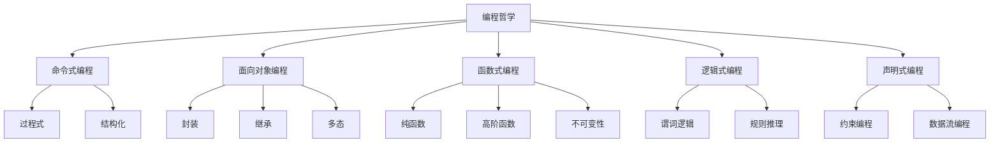
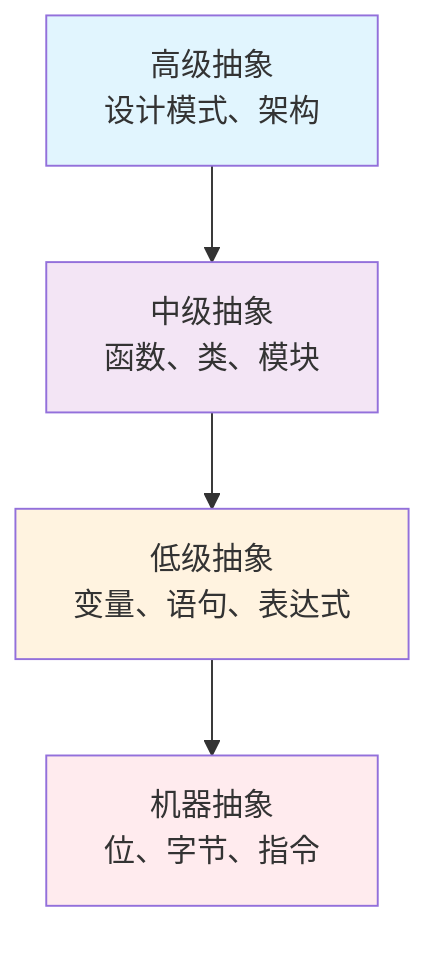

# 00-02-编程哲学

> 本文档阐述编程语言的哲学基础，包括语言设计哲学、编程范式、抽象层次等核心概念，为软件工程提供编程理论基础。

## 📋 目录

- [概念与定义](#概念与定义)
- [数学表达与形式化](#数学表达与形式化)
- [Python代码示例](#python代码示例)
- [图表与多表征](#图表与多表征)
- [行业应用与案例](#行业应用与案例)
- [本地跳转与索引](#本地跳转与索引)

## 🎯 概念与定义

### 1.1 编程哲学概述

**编程哲学**是编程语言设计和使用的理论基础，包括语言设计原则、编程范式、抽象层次等。

**定义1.1**: 编程哲学可形式化为四元组 $\mathcal{P} = (L, S, M, E)$，其中：
- $L$ 表示语言设计（Language Design）
- $S$ 表示语义模型（Semantic Model）
- $M$ 表示编程范式（Programming Paradigm）
- $E$ 表示执行模型（Execution Model）

### 1.2 语言设计哲学

**语言设计哲学**研究编程语言的设计原则和理念。

**定义1.2**: 语言设计哲学可表示为 $\mathcal{L} = (P, S, C, A)$，其中：
- $P$ 表示设计原则（Principles）
- $S$ 表示语法结构（Syntax）
- $C$ 表示概念模型（Concepts）
- $A$ 表示抽象层次（Abstraction）

### 1.3 编程范式

**编程范式**是编程的基本风格和方法论。

**定义1.3**: 编程范式可表示为 $\mathcal{M} = (I, O, F, L)$，其中：
- $I$ 表示命令式（Imperative）
- $O$ 表示面向对象（Object-Oriented）
- $F$ 表示函数式（Functional）
- $L$ 表示逻辑式（Logic）

### 1.4 抽象层次

**抽象层次**是编程中不同级别的抽象表示。

**定义1.4**: 抽象层次可表示为 $\mathcal{A} = (H, L, M, H)$，其中：
- $H$ 表示高级抽象（High-level）
- $L$ 表示低级抽象（Low-level）
- $M$ 表示中间抽象（Middle-level）
- $H$ 表示混合抽象（Hybrid）

## 🔢 数学表达与形式化

### 2.1 编程语言的形式化模型

**定理2.1**: 编程语言的完整性定理

对于任意编程语言 $L$，存在形式化模型 $\mathcal{M} = (S, E, T)$ 使得：

$$L \models \mathcal{M} \iff (S \models L) \land (E \models L) \land (T \models L)$$

其中：
- $S$ 表示语法模型（Syntax Model）
- $E$ 表示语义模型（Semantic Model）
- $T$ 表示类型模型（Type Model）

### 2.2 抽象层次的形式化

**定义2.1**: 抽象层次可形式化为：

$$\text{Abstraction}(L) = \frac{\text{Complexity}(L)}{\text{Expressiveness}(L)}$$

其中：
- $\text{Complexity}(L)$ 表示语言的复杂度
- $\text{Expressiveness}(L)$ 表示语言的表达能力

### 2.3 编程范式的形式化映射

**定义2.3**: 编程范式映射可表示为：

$$\text{Paradigm}: \mathcal{P} \rightarrow \mathcal{M}$$

满足：
$$\forall p \in \mathcal{P}, \exists m \in \mathcal{M}: \text{Paradigm}(p) = m$$

## 🐍 Python代码示例

### 3.1 编程哲学框架实现

```python
from abc import ABC, abstractmethod
from typing import Dict, List, Any, Callable
from dataclasses import dataclass
from enum import Enum
import inspect

class ParadigmType(Enum):
    """编程范式类型"""
    IMPERATIVE = "imperative"
    OBJECT_ORIENTED = "object_oriented"
    FUNCTIONAL = "functional"
    LOGIC = "logic"
    DECLARATIVE = "declarative"

class AbstractionLevel(Enum):
    """抽象层次"""
    LOW = "low"
    MIDDLE = "middle"
    HIGH = "high"
    HYBRID = "hybrid"

@dataclass
class LanguageFeature:
    """语言特性"""
    name: str
    paradigm: ParadigmType
    abstraction_level: AbstractionLevel
    complexity: float
    expressiveness: float

class ProgrammingPhilosophy:
    """编程哲学主类"""
    
    def __init__(self):
        self.language_features: Dict[str, LanguageFeature] = {}
        self.paradigms: Dict[ParadigmType, Callable] = {}
        self.abstraction_levels: Dict[AbstractionLevel, Callable] = {}
        self.design_principles: List[str] = []
    
    def add_language_feature(self, feature: LanguageFeature) -> None:
        """添加语言特性"""
        self.language_features[feature.name] = feature
    
    def register_paradigm(self, paradigm: ParadigmType, implementation: Callable) -> None:
        """注册编程范式"""
        self.paradigms[paradigm] = implementation
    
    def register_abstraction_level(self, level: AbstractionLevel, implementation: Callable) -> None:
        """注册抽象层次"""
        self.abstraction_levels[level] = implementation
    
    def calculate_abstraction_ratio(self, feature_name: str) -> float:
        """计算抽象比率"""
        if feature_name in self.language_features:
            feature = self.language_features[feature_name]
            return feature.complexity / feature.expressiveness
        return 0.0
    
    def analyze_paradigm_fit(self, problem: str) -> Dict[ParadigmType, float]:
        """分析范式适用性"""
        scores = {}
        for paradigm, implementation in self.paradigms.items():
            try:
                score = implementation(problem)
                scores[paradigm] = score
            except Exception:
                scores[paradigm] = 0.0
        return scores

class ImperativeParadigm:
    """命令式编程范式"""
    
    @staticmethod
    def analyze_fit(problem: str) -> float:
        """分析命令式范式适用性"""
        imperative_keywords = ["步骤", "顺序", "循环", "条件", "变量", "赋值"]
        score = 0.0
        for keyword in imperative_keywords:
            if keyword in problem:
                score += 0.2
        return min(score, 1.0)
    
    @staticmethod
    def implement_solution(problem: str) -> str:
        """实现命令式解决方案"""
        return f"命令式解决方案：{problem}"

class ObjectOrientedParadigm:
    """面向对象编程范式"""
    
    @staticmethod
    def analyze_fit(problem: str) -> float:
        """分析面向对象范式适用性"""
        oo_keywords = ["对象", "类", "继承", "封装", "多态", "实体"]
        score = 0.0
        for keyword in oo_keywords:
            if keyword in problem:
                score += 0.15
        return min(score, 1.0)
    
    @staticmethod
    def implement_solution(problem: str) -> str:
        """实现面向对象解决方案"""
        return f"面向对象解决方案：{problem}"

class FunctionalParadigm:
    """函数式编程范式"""
    
    @staticmethod
    def analyze_fit(problem: str) -> float:
        """分析函数式范式适用性"""
        functional_keywords = ["函数", "映射", "过滤", "归约", "不可变", "纯函数"]
        score = 0.0
        for keyword in functional_keywords:
            if keyword in problem:
                score += 0.17
        return min(score, 1.0)
    
    @staticmethod
    def implement_solution(problem: str) -> str:
        """实现函数式解决方案"""
        return f"函数式解决方案：{problem}"

# 使用示例
def demonstrate_programming_philosophy():
    """演示编程哲学的应用"""
    
    # 创建编程哲学实例
    pp = ProgrammingPhilosophy()
    
    # 添加语言特性
    features = [
        LanguageFeature("变量", ParadigmType.IMPERATIVE, AbstractionLevel.LOW, 0.3, 0.8),
        LanguageFeature("类", ParadigmType.OBJECT_ORIENTED, AbstractionLevel.HIGH, 0.7, 0.9),
        LanguageFeature("函数", ParadigmType.FUNCTIONAL, AbstractionLevel.MIDDLE, 0.5, 0.8),
        LanguageFeature("装饰器", ParadigmType.FUNCTIONAL, AbstractionLevel.HIGH, 0.8, 0.9)
    ]
    
    for feature in features:
        pp.add_language_feature(feature)
    
    # 注册编程范式
    pp.register_paradigm(ParadigmType.IMPERATIVE, ImperativeParadigm.analyze_fit)
    pp.register_paradigm(ParadigmType.OBJECT_ORIENTED, ObjectOrientedParadigm.analyze_fit)
    pp.register_paradigm(ParadigmType.FUNCTIONAL, FunctionalParadigm.analyze_fit)
    
    # 分析问题
    problems = [
        "需要按步骤处理数据",
        "需要创建对象模型",
        "需要对数据进行函数式转换"
    ]
    
    for problem in problems:
        print(f"\n问题: {problem}")
        scores = pp.analyze_paradigm_fit(problem)
        for paradigm, score in scores.items():
            print(f"  {paradigm.value}: {score:.2f}")
    
    return pp

if __name__ == "__main__":
    demonstrate_programming_philosophy()
```

### 3.2 编程范式实现示例

```python
class ProgrammingParadigmExamples:
    """编程范式实现示例"""
    
    @staticmethod
    def imperative_example():
        """命令式编程示例"""
        # 传统命令式：按步骤执行
        numbers = [1, 2, 3, 4, 5]
        result = []
        
        for num in numbers:
            if num % 2 == 0:
                result.append(num * 2)
        
        return result
    
    @staticmethod
    def functional_example():
        """函数式编程示例"""
        # 函数式：使用高阶函数
        numbers = [1, 2, 3, 4, 5]
        
        result = list(map(
            lambda x: x * 2,
            filter(lambda x: x % 2 == 0, numbers)
        ))
        
        return result
    
    @staticmethod
    def object_oriented_example():
        """面向对象编程示例"""
        class NumberProcessor:
            def __init__(self, numbers):
                self.numbers = numbers
            
            def filter_even(self):
                return [n for n in self.numbers if n % 2 == 0]
            
            def multiply_by(self, factor):
                return [n * factor for n in self.numbers]
            
            def process(self):
                even_numbers = self.filter_even()
                return self.multiply_by(2)
        
        processor = NumberProcessor([1, 2, 3, 4, 5])
        return processor.process()

# 测试不同范式
def test_paradigms():
    """测试不同编程范式"""
    examples = ProgrammingParadigmExamples()
    
    print("命令式结果:", examples.imperative_example())
    print("函数式结果:", examples.functional_example())
    print("面向对象结果:", examples.object_oriented_example())
```

### 3.3 抽象层次分析

```python
class AbstractionAnalyzer:
    """抽象层次分析器"""
    
    def __init__(self):
        self.abstraction_patterns = {
            AbstractionLevel.LOW: [
                "内存地址", "位操作", "寄存器", "汇编"
            ],
            AbstractionLevel.MIDDLE: [
                "变量", "函数", "数据结构", "算法"
            ],
            AbstractionLevel.HIGH: [
                "设计模式", "框架", "架构", "领域模型"
            ]
        }
    
    def analyze_abstraction_level(self, code: str) -> AbstractionLevel:
        """分析代码的抽象层次"""
        scores = {level: 0 for level in AbstractionLevel}
        
        for level, patterns in self.abstraction_patterns.items():
            for pattern in patterns:
                if pattern in code:
                    scores[level] += 1
        
        # 返回得分最高的抽象层次
        return max(scores, key=scores.get)
    
    def suggest_abstraction_improvement(self, current_level: AbstractionLevel) -> List[str]:
        """建议抽象层次改进"""
        improvements = {
            AbstractionLevel.LOW: [
                "使用高级语言特性",
                "引入函数抽象",
                "应用设计模式"
            ],
            AbstractionLevel.MIDDLE: [
                "使用框架和库",
                "应用架构模式",
                "引入领域驱动设计"
            ],
            AbstractionLevel.HIGH: [
                "优化性能细节",
                "简化复杂抽象",
                "平衡抽象和性能"
            ]
        }
        
        return improvements.get(current_level, [])
```

## 📊 图表与多表征

### 4.1 编程范式关系图



### 4.2 抽象层次金字塔



### 4.3 编程哲学决策矩阵

| 问题特征 | 推荐范式 | 理由 | 适用场景 |
|---------|---------|------|----------|
| 顺序处理 | 命令式 | 直观的步骤控制 | 算法实现 |
| 数据转换 | 函数式 | 无副作用，易于测试 | 数据处理 |
| 复杂状态 | 面向对象 | 封装和继承 | 业务建模 |
| 规则推理 | 逻辑式 | 声明式规则 | 专家系统 |

## 🏭 行业应用与案例

### 5.1 Web开发中的编程哲学应用

**案例**: 现代Web框架设计

```python
class WebFrameworkPhilosophy:
    """Web框架设计的编程哲学应用"""
    
    def __init__(self):
        self.philosophy = ProgrammingPhilosophy()
        self.setup_web_paradigms()
    
    def setup_web_paradigms(self):
        """设置Web开发范式"""
        
        # 注册Web开发相关范式
        def mvc_paradigm(problem: str) -> float:
            """MVC范式适用性分析"""
            mvc_keywords = ["界面", "数据", "控制", "分离", "视图", "模型"]
            score = sum(0.15 for keyword in mvc_keywords if keyword in problem)
            return min(score, 1.0)
        
        def reactive_paradigm(problem: str) -> float:
            """响应式范式适用性分析"""
            reactive_keywords = ["实时", "事件", "流", "异步", "响应"]
            score = sum(0.17 for keyword in reactive_keywords if keyword in problem)
            return min(score, 1.0)
        
        self.philosophy.register_paradigm(ParadigmType.OBJECT_ORIENTED, mvc_paradigm)
        # 可以添加更多Web开发范式
    
    def design_web_architecture(self, requirements: Dict) -> Dict:
        """设计Web架构"""
        problem = f"设计{requirements.get('type', 'Web')}应用架构"
        
        # 分析范式适用性
        paradigm_scores = self.philosophy.analyze_paradigm_fit(problem)
        
        # 选择最佳范式
        best_paradigm = max(paradigm_scores, key=paradigm_scores.get)
        
        return {
            "recommended_paradigm": best_paradigm.value,
            "confidence": paradigm_scores[best_paradigm],
            "architecture": f"基于{best_paradigm.value}的Web架构"
        }

# 使用示例
web_philosophy = WebFrameworkPhilosophy()
requirements = {"type": "电商", "features": ["用户管理", "订单处理", "支付集成"]}
result = web_philosophy.design_web_architecture(requirements)
print("Web架构设计结果:", result)
```

### 5.2 数据科学中的编程哲学应用

**案例**: 数据处理管道设计

```python
class DataSciencePhilosophy:
    """数据科学的编程哲学应用"""
    
    def __init__(self):
        self.philosophy = ProgrammingPhilosophy()
        self.setup_data_paradigms()
    
    def setup_data_paradigms(self):
        """设置数据科学范式"""
        
        def functional_data_paradigm(problem: str) -> float:
            """函数式数据处理范式"""
            data_keywords = ["转换", "过滤", "聚合", "映射", "管道"]
            score = sum(0.2 for keyword in data_keywords if keyword in problem)
            return min(score, 1.0)
        
        def imperative_data_paradigm(problem: str) -> float:
            """命令式数据处理范式"""
            imperative_keywords = ["循环", "条件", "步骤", "顺序"]
            score = sum(0.15 for keyword in imperative_keywords if keyword in problem)
            return min(score, 1.0)
        
        self.philosophy.register_paradigm(ParadigmType.FUNCTIONAL, functional_data_paradigm)
        self.philosophy.register_paradigm(ParadigmType.IMPERATIVE, imperative_data_paradigm)
    
    def design_data_pipeline(self, data_characteristics: Dict) -> Dict:
        """设计数据处理管道"""
        problem = f"处理{data_characteristics.get('size', '大规模')}数据"
        
        # 分析范式适用性
        paradigm_scores = self.philosophy.analyze_paradigm_fit(problem)
        
        # 选择最佳范式
        best_paradigm = max(paradigm_scores, key=paradigm_scores.get)
        
        return {
            "recommended_paradigm": best_paradigm.value,
            "confidence": paradigm_scores[best_paradigm],
            "pipeline_design": f"基于{best_paradigm.value}的数据管道"
        }

# 使用示例
ds_philosophy = DataSciencePhilosophy()
data_chars = {"size": "大规模", "type": "结构化", "velocity": "实时"}
result = ds_philosophy.design_data_pipeline(data_chars)
print("数据管道设计结果:", result)
```

## 🔗 本地跳转与索引

### 相关文档

- [00-01-哲学基础](./00-01-哲学基础.md) - 软件工程哲学基础
- [00-03-形式化思维](./00-03-形式化思维.md) - 形式化思维方法
- [00-04-计算思维](./00-04-计算思维.md) - 计算思维基础
- [00-05-系统思维](./00-05-系统思维.md) - 系统思维方法
- [00-06-抽象与建模](./00-06-抽象与建模.md) - 抽象与建模技术
- [00-07-设计原则](./00-07-设计原则.md) - 软件设计原则

### 上层目录

- [返回理念基础层](./README.md)
- [返回项目根目录](../README.md)

### 下层应用

- [03-具体科学](../03-具体科学/README.md) - 编程范式理论
- [06-组件算法](../06-组件算法/README.md) - 算法实现

---

**最后更新**: 2024年12月19日  
**维护者**: AI Assistant  
**文档状态**: 已完成 ✅ 