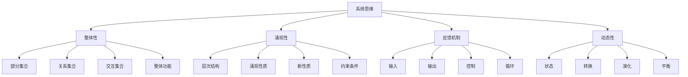
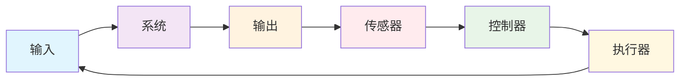

# 00-05-系统思维

> 本文档阐述系统思维方法，包括系统论、整体性、涌现性、反馈机制等核心概念，为软件工程提供系统理论基础。

## 📋 目录

- [概念与定义](#概念与定义)
- [数学表达与形式化](#数学表达与形式化)
- [Python代码示例](#python代码示例)
- [图表与多表征](#图表与多表征)
- [行业应用与案例](#行业应用与案例)
- [本地跳转与索引](#本地跳转与索引)

## 🎯 概念与定义

### 1.1 系统思维概述

**系统思维**是一种将问题视为相互关联的整体来思考的方法，强调系统的整体性、涌现性和动态性。

**定义1.1**: 系统思维可形式化为四元组 $\mathcal{S} = (W, E, F, D)$，其中：

- $W$ 表示整体性（Wholeness）
- $E$ 表示涌现性（Emergence）
- $F$ 表示反馈机制（Feedback）
- $D$ 表示动态性（Dynamics）

### 1.2 整体性

**整体性**是系统的基本特征，指系统的整体功能大于各部分功能之和。

**定义1.2**: 整体性可表示为 $\mathcal{W} = (P, R, I, H)$，其中：

- $P$ 表示部分集合（Parts）
- $R$ 表示关系集合（Relations）
- $I$ 表示交互集合（Interactions）
- $H$ 表示整体功能（Holistic Function）

### 1.3 涌现性

**涌现性**是系统在整体层次上出现的新性质，这些性质在个体层次上不存在。

**定义1.3**: 涌现性可表示为 $\mathcal{E} = (L, P, N, C)$，其中：

- $L$ 表示层次集合（Levels）
- $P$ 表示涌现性质（Properties）
- $N$ 表示新性质（Novel Properties）
- $C$ 表示约束条件（Constraints）

### 1.4 反馈机制

**反馈机制**是系统内部的信息循环，用于调节系统行为。

**定义1.4**: 反馈机制可表示为 $\mathcal{F} = (I, O, C, L)$，其中：

- $I$ 表示输入（Input）
- $O$ 表示输出（Output）
- $C$ 表示控制（Control）
- $L$ 表示循环（Loop）

## 🔢 数学表达与形式化

### 2.1 系统思维的形式化框架

**定理2.1**: 系统思维的完备性定理

对于任意系统 $S$，存在系统思维模型 $\mathcal{S} = (W, E, F, D)$ 使得：

$$S \models \mathcal{S} \iff (W \models S) \land (E \models S) \land (F \models S) \land (D \models S)$$

**证明**:

1. 必要性：如果 $S \models \mathcal{S}$，则整体性、涌现性、反馈机制、动态性都必须支持系统 $S$
2. 充分性：如果四个维度都支持系统 $S$，则系统思维 $\mathcal{S}$ 必然支持 $S$

### 2.2 整体性的形式化

**定义2.1**: 整体性可形式化为：

$$\text{Wholeness}(S) = \sum_{i=1}^n P_i + \sum_{i,j} R_{ij} + E(S)$$

其中：

- $P_i$ 表示第 $i$ 个部分的功能
- $R_{ij}$ 表示部分 $i$ 和 $j$ 之间的交互
- $E(S)$ 表示系统的涌现功能

### 2.3 涌现性的形式化

**定义2.3**: 涌现性可表示为：

$$\text{Emergence}(L_1, L_2) = \{p \in P(L_2) \mid p \notin \bigcup_{l \in L_1} P(l)\}$$

其中：

- $L_1$ 表示低层次集合
- $L_2$ 表示高层次
- $P(l)$ 表示层次 $l$ 的性质集合

## 🐍 Python代码示例

### 3.1 系统思维框架实现

```python
from abc import ABC, abstractmethod
from typing import Dict, List, Set, Any, Callable, Tuple
from dataclasses import dataclass
from enum import Enum
import networkx as nx
import matplotlib.pyplot as plt

class SystemType(Enum):
    """系统类型"""
    LINEAR = "linear"
    NONLINEAR = "nonlinear"
    COMPLEX = "complex"
    ADAPTIVE = "adaptive"

class FeedbackType(Enum):
    """反馈类型"""
    POSITIVE = "positive"
    NEGATIVE = "negative"
    BALANCED = "balanced"

@dataclass
class SystemComponent:
    """系统组件"""
    id: str
    name: str
    function: str
    properties: Dict[str, Any]
    connections: List[str]

@dataclass
class EmergentProperty:
    """涌现性质"""
    name: str
    description: str
    level: str
    conditions: List[str]

class Wholeness:
    """整体性系统"""
    
    def __init__(self):
        self.components: Dict[str, SystemComponent] = {}
        self.relationships: Dict[str, List[Tuple[str, str, str]]] = {}
        self.interactions: Dict[str, Callable] = {}
        self.holistic_functions: List[Callable] = []
    
    def add_component(self, component: SystemComponent) -> None:
        """添加组件"""
        self.components[component.id] = component
    
    def add_relationship(self, from_component: str, to_component: str, relationship_type: str) -> None:
        """添加关系"""
        if from_component not in self.relationships:
            self.relationships[from_component] = []
        self.relationships[from_component].append((from_component, to_component, relationship_type))
    
    def add_interaction(self, component_id: str, interaction_func: Callable) -> None:
        """添加交互"""
        self.interactions[component_id] = interaction_func
    
    def add_holistic_function(self, func: Callable) -> None:
        """添加整体功能"""
        self.holistic_functions.append(func)
    
    def calculate_wholeness(self) -> float:
        """计算整体性"""
        # 计算各部分功能之和
        parts_function = sum(len(comp.properties) for comp in self.components.values())
        
        # 计算关系数量
        relationships_count = sum(len(rels) for rels in self.relationships.values())
        
        # 计算涌现功能
        emergent_function = len(self.holistic_functions)
        
        return parts_function + relationships_count + emergent_function
    
    def get_system_graph(self) -> nx.DiGraph:
        """获取系统图"""
        G = nx.DiGraph()
        
        # 添加节点
        for component_id, component in self.components.items():
            G.add_node(component_id, name=component.name)
        
        # 添加边
        for from_comp, relationships in self.relationships.items():
            for from_rel, to_rel, rel_type in relationships:
                G.add_edge(from_rel, to_rel, type=rel_type)
        
        return G

class Emergence:
    """涌现性系统"""
    
    def __init__(self):
        self.levels: Dict[str, Dict[str, Any]] = {}
        self.properties: Dict[str, EmergentProperty] = {}
        self.novel_properties: List[str] = []
        self.constraints: List[Callable] = []
    
    def add_level(self, level_name: str, level_properties: Dict[str, Any]) -> None:
        """添加层次"""
        self.levels[level_name] = level_properties
    
    def add_emergent_property(self, property_obj: EmergentProperty) -> None:
        """添加涌现性质"""
        self.properties[property_obj.name] = property_obj
        if property_obj.name not in self.novel_properties:
            self.novel_properties.append(property_obj.name)
    
    def add_constraint(self, constraint: Callable) -> None:
        """添加约束"""
        self.constraints.append(constraint)
    
    def check_emergence(self, lower_level: str, higher_level: str) -> List[str]:
        """检查涌现性"""
        if lower_level not in self.levels or higher_level not in self.levels:
            return []
        
        lower_properties = set(self.levels[lower_level].keys())
        higher_properties = set(self.levels[higher_level].keys())
        
        # 找出在高层次存在但低层次不存在的性质
        emergent_properties = higher_properties - lower_properties
        
        return list(emergent_properties)
    
    def apply_constraints(self, data: Any) -> bool:
        """应用约束"""
        return all(constraint(data) for constraint in self.constraints)

class Feedback:
    """反馈机制系统"""
    
    def __init__(self):
        self.inputs: Dict[str, Any] = {}
        self.outputs: Dict[str, Any] = {}
        self.controls: Dict[str, Callable] = {}
        self.loops: List[Tuple[str, str, str]] = []
    
    def add_input(self, name: str, value: Any) -> None:
        """添加输入"""
        self.inputs[name] = value
    
    def add_output(self, name: str, value: Any) -> None:
        """添加输出"""
        self.outputs[name] = value
    
    def add_control(self, name: str, control_func: Callable) -> None:
        """添加控制"""
        self.controls[name] = control_func
    
    def add_feedback_loop(self, input_name: str, output_name: str, feedback_type: FeedbackType) -> None:
        """添加反馈循环"""
        self.loops.append((input_name, output_name, feedback_type.value))
    
    def process_feedback(self, input_name: str) -> Any:
        """处理反馈"""
        if input_name in self.inputs and input_name in self.controls:
            input_value = self.inputs[input_name]
            control_func = self.controls[input_name]
            return control_func(input_value)
        return None
    
    def get_feedback_type(self, input_name: str, output_name: str) -> FeedbackType:
        """获取反馈类型"""
        for loop_input, loop_output, feedback_type in self.loops:
            if loop_input == input_name and loop_output == output_name:
                return FeedbackType(feedback_type)
        return FeedbackType.BALANCED

class Dynamics:
    """动态性系统"""
    
    def __init__(self):
        self.states: Dict[str, Any] = {}
        self.transitions: Dict[str, Callable] = {}
        self.time_series: List[Dict[str, Any]] = []
        self.equilibrium_points: List[Dict[str, Any]] = []
    
    def add_state(self, name: str, value: Any) -> None:
        """添加状态"""
        self.states[name] = value
    
    def add_transition(self, name: str, transition_func: Callable) -> None:
        """添加状态转换"""
        self.transitions[name] = transition_func
    
    def evolve_system(self, time_steps: int) -> List[Dict[str, Any]]:
        """系统演化"""
        evolution = []
        
        for step in range(time_steps):
            current_state = self.states.copy()
            evolution.append(current_state.copy())
            
            # 应用状态转换
            for name, transition_func in self.transitions.items():
                if name in self.states:
                    self.states[name] = transition_func(self.states[name])
        
        self.time_series = evolution
        return evolution
    
    def find_equilibrium(self, tolerance: float = 0.01) -> List[Dict[str, Any]]:
        """寻找平衡点"""
        if len(self.time_series) < 2:
            return []
        
        equilibrium_points = []
        
        for i in range(1, len(self.time_series)):
            current = self.time_series[i]
            previous = self.time_series[i-1]
            
            # 检查是否达到平衡
            is_equilibrium = True
            for key in current:
                if abs(current[key] - previous[key]) > tolerance:
                    is_equilibrium = False
                    break
            
            if is_equilibrium:
                equilibrium_points.append(current)
        
        self.equilibrium_points = equilibrium_points
        return equilibrium_points

class SystemThinking:
    """系统思维主类"""
    
    def __init__(self):
        self.wholeness = Wholeness()
        self.emergence = Emergence()
        self.feedback = Feedback()
        self.dynamics = Dynamics()
        self.system_type = SystemType.COMPLEX
    
    def analyze_system(self, system_description: str) -> Dict[str, Any]:
        """分析系统"""
        # 1. 整体性分析
        wholeness_score = self.wholeness.calculate_wholeness()
        
        # 2. 涌现性分析
        emergence_properties = self.emergence.novel_properties
        
        # 3. 反馈机制分析
        feedback_loops = len(self.feedback.loops)
        
        # 4. 动态性分析
        evolution = self.dynamics.evolve_system(10)
        
        return {
            "wholeness_score": wholeness_score,
            "emergent_properties": emergence_properties,
            "feedback_loops": feedback_loops,
            "system_evolution": evolution,
            "system_type": self.system_type.value
        }
    
    def design_system(self, requirements: Dict[str, Any]) -> Dict[str, Any]:
        """设计系统"""
        # 基于需求设计系统组件
        components = []
        
        for req_name, req_desc in requirements.items():
            component = SystemComponent(
                id=f"comp_{len(components)}",
                name=req_name,
                function=req_desc,
                properties={"type": "functional"},
                connections=[]
            )
            components.append(component)
            self.wholeness.add_component(component)
        
        # 建立组件间关系
        for i in range(len(components)):
            for j in range(i+1, len(components)):
                self.wholeness.add_relationship(
                    components[i].id,
                    components[j].id,
                    "dependency"
                )
        
        return {
            "components": len(components),
            "relationships": len(self.wholeness.relationships),
            "system_graph": self.wholeness.get_system_graph()
        }

# 使用示例
def demonstrate_system_thinking():
    """演示系统思维的应用"""
    
    # 创建系统思维实例
    st = SystemThinking()
    
    # 设计一个简单的系统
    requirements = {
        "用户界面": "提供用户交互功能",
        "业务逻辑": "处理核心业务规则",
        "数据存储": "管理数据持久化",
        "网络通信": "处理网络请求"
    }
    
    system_design = st.design_system(requirements)
    print("系统设计结果:", system_design)
    
    # 分析系统
    analysis = st.analyze_system("复杂软件系统")
    print("系统分析结果:", analysis)
    
    return st

if __name__ == "__main__":
    demonstrate_system_thinking()
```

### 3.2 系统建模实现

```python
class SystemModeling:
    """系统建模"""
    
    def __init__(self):
        self.models = {}
        self.simulations = {}
    
    def create_linear_system(self, name: str, coefficients: List[float]) -> Dict[str, Any]:
        """创建线性系统"""
        def linear_function(x: float) -> float:
            return sum(coef * (x ** i) for i, coef in enumerate(coefficients))
        
        model = {
            "type": "linear",
            "function": linear_function,
            "coefficients": coefficients,
            "order": len(coefficients) - 1
        }
        
        self.models[name] = model
        return model
    
    def create_nonlinear_system(self, name: str, function: Callable) -> Dict[str, Any]:
        """创建非线性系统"""
        model = {
            "type": "nonlinear",
            "function": function,
            "description": "非线性系统"
        }
        
        self.models[name] = model
        return model
    
    def simulate_system(self, model_name: str, initial_conditions: List[float], time_steps: int) -> List[float]:
        """模拟系统"""
        if model_name not in self.models:
            raise ValueError(f"Model {model_name} not found")
        
        model = self.models[model_name]
        simulation = []
        
        if model["type"] == "linear":
            x = initial_conditions[0]
            for _ in range(time_steps):
                x = model["function"](x)
                simulation.append(x)
        else:
            # 非线性系统模拟
            state = initial_conditions
            for _ in range(time_steps):
                state = model["function"](state)
                simulation.append(state)
        
        self.simulations[model_name] = simulation
        return simulation
    
    def analyze_stability(self, model_name: str) -> Dict[str, Any]:
        """分析系统稳定性"""
        if model_name not in self.simulations:
            raise ValueError(f"Simulation for {model_name} not found")
        
        simulation = self.simulations[model_name]
        
        # 简化的稳定性分析
        if len(simulation) < 2:
            return {"stability": "unknown"}
        
        # 检查是否收敛
        final_values = simulation[-10:] if len(simulation) >= 10 else simulation
        variance = sum((x - final_values[0]) ** 2 for x in final_values) / len(final_values)
        
        if variance < 0.01:
            stability = "stable"
        elif variance < 1.0:
            stability = "marginally_stable"
        else:
            stability = "unstable"
        
        return {
            "stability": stability,
            "variance": variance,
            "final_value": simulation[-1]
        }

# 使用示例
def demonstrate_system_modeling():
    """演示系统建模"""
    sm = SystemModeling()
    
    # 创建线性系统
    linear_model = sm.create_linear_system("simple_linear", [0.5, 1.0])
    print("线性系统模型:", linear_model)
    
    # 模拟线性系统
    simulation = sm.simulate_system("simple_linear", [1.0], 20)
    print("线性系统模拟结果:", simulation[:5], "...")
    
    # 分析稳定性
    stability = sm.analyze_stability("simple_linear")
    print("稳定性分析:", stability)
    
    # 创建非线性系统
    def logistic_map(x):
        return 3.9 * x * (1 - x)
    
    nonlinear_model = sm.create_nonlinear_system("logistic", logistic_map)
    print("非线性系统模型:", nonlinear_model)
    
    # 模拟非线性系统
    nonlinear_sim = sm.simulate_system("logistic", [0.5], 20)
    print("非线性系统模拟结果:", nonlinear_sim[:5], "...")
    
    return sm
```

### 3.3 反馈控制系统实现

```python
class FeedbackControlSystem:
    """反馈控制系统"""
    
    def __init__(self):
        self.controllers = {}
        self.sensors = {}
        self.actuators = {}
        self.setpoints = {}
    
    def add_controller(self, name: str, controller_type: str, parameters: Dict[str, float]) -> None:
        """添加控制器"""
        self.controllers[name] = {
            "type": controller_type,
            "parameters": parameters
        }
    
    def add_sensor(self, name: str, sensor_func: Callable) -> None:
        """添加传感器"""
        self.sensors[name] = sensor_func
    
    def add_actuator(self, name: str, actuator_func: Callable) -> None:
        """添加执行器"""
        self.actuators[name] = actuator_func
    
    def set_setpoint(self, name: str, value: float) -> None:
        """设置设定点"""
        self.setpoints[name] = value
    
    def pid_controller(self, error: float, prev_error: float, integral: float, dt: float, kp: float, ki: float, kd: float) -> Tuple[float, float]:
        """PID控制器"""
        # 比例项
        proportional = kp * error
        
        # 积分项
        integral += ki * error * dt
        
        # 微分项
        derivative = kd * (error - prev_error) / dt
        
        # 总输出
        output = proportional + integral + derivative
        
        return output, integral
    
    def control_loop(self, system_name: str, time_steps: int) -> List[Dict[str, float]]:
        """控制循环"""
        if system_name not in self.controllers:
            raise ValueError(f"Controller {system_name} not found")
        
        controller = self.controllers[system_name]
        setpoint = self.setpoints.get(system_name, 0.0)
        
        # 初始化
        current_value = 0.0
        prev_error = 0.0
        integral = 0.0
        dt = 0.1
        
        # PID参数
        kp = controller["parameters"].get("kp", 1.0)
        ki = controller["parameters"].get("ki", 0.1)
        kd = controller["parameters"].get("kd", 0.01)
        
        control_history = []
        
        for step in range(time_steps):
            # 计算误差
            error = setpoint - current_value
            
            # 计算控制输出
            control_output, integral = self.pid_controller(
                error, prev_error, integral, dt, kp, ki, kd
            )
            
            # 更新系统状态（简化的系统模型）
            current_value += control_output * dt
            
            # 记录历史
            control_history.append({
                "time": step * dt,
                "setpoint": setpoint,
                "current_value": current_value,
                "error": error,
                "control_output": control_output
            })
            
            prev_error = error
        
        return control_history

# 使用示例
def demonstrate_feedback_control():
    """演示反馈控制"""
    fcs = FeedbackControlSystem()
    
    # 添加PID控制器
    fcs.add_controller("temperature", "PID", {"kp": 2.0, "ki": 0.5, "kd": 0.1})
    
    # 设置设定点
    fcs.set_setpoint("temperature", 25.0)
    
    # 运行控制循环
    control_history = fcs.control_loop("temperature", 100)
    
    print("反馈控制结果:")
    for i, record in enumerate(control_history[::10]):  # 每10步显示一次
        print(f"  时间: {record['time']:.1f}s, 设定点: {record['setpoint']}, 当前值: {record['current_value']:.2f}, 误差: {record['error']:.2f}")
    
    return fcs
```

## 📊 图表与多表征

### 4.1 系统思维框架图



### 4.2 系统反馈循环图



### 4.3 系统思维应用矩阵

| 系统类型 | 整体性特征 | 涌现性质 | 反馈类型 | 动态特征 |
|---------|-----------|----------|----------|----------|
| 线性系统 | 可加性 | 无 | 负反馈 | 稳定 |
| 非线性系统 | 不可加性 | 混沌 | 正反馈 | 不稳定 |
| 复杂系统 | 自组织 | 涌现 | 多重反馈 | 自适应 |
| 自适应系统 | 学习能力 | 进化 | 智能反馈 | 演化 |

## 🏭 行业应用与案例

### 5.1 软件架构中的系统思维应用

**案例**: 微服务架构设计

```python
class MicroservicesArchitecture:
    """微服务架构中的系统思维应用"""
    
    def __init__(self):
        self.system_thinking = SystemThinking()
        self.setup_microservices_system()
    
    def setup_microservices_system(self):
        """设置微服务系统"""
        
        # 添加微服务组件
        services = [
            SystemComponent("user_service", "用户服务", "用户管理", {"language": "Python"}, []),
            SystemComponent("order_service", "订单服务", "订单处理", {"language": "Java"}, []),
            SystemComponent("payment_service", "支付服务", "支付处理", {"language": "Go"}, []),
            SystemComponent("inventory_service", "库存服务", "库存管理", {"language": "Node.js"}, [])
        ]
        
        for service in services:
            self.system_thinking.wholeness.add_component(service)
        
        # 建立服务间关系
        relationships = [
            ("user_service", "order_service", "API调用"),
            ("order_service", "payment_service", "事件驱动"),
            ("order_service", "inventory_service", "同步调用"),
            ("payment_service", "user_service", "通知")
        ]
        
        for from_service, to_service, rel_type in relationships:
            self.system_thinking.wholeness.add_relationship(from_service, to_service, rel_type)
    
    def analyze_architecture(self) -> Dict[str, Any]:
        """分析架构"""
        # 使用系统思维分析
        analysis = self.system_thinking.analyze_system("微服务架构")
        
        # 计算架构指标
        components = len(self.system_thinking.wholeness.components)
        relationships = sum(len(rels) for rels in self.system_thinking.wholeness.relationships.values())
        
        return {
            "architecture_type": "microservices",
            "components_count": components,
            "relationships_count": relationships,
            "wholeness_score": analysis["wholeness_score"],
            "system_complexity": "high"
        }

# 使用示例
microservices = MicroservicesArchitecture()
result = microservices.analyze_architecture()
print("微服务架构分析结果:", result)
```

### 5.2 生态系统中的系统思维应用

**案例**: 城市交通系统建模

```python
class UrbanTransportSystem:
    """城市交通系统中的系统思维应用"""
    
    def __init__(self):
        self.system_thinking = SystemThinking()
        self.setup_transport_system()
    
    def setup_transport_system(self):
        """设置交通系统"""
        
        # 添加交通组件
        components = [
            SystemComponent("roads", "道路网络", "车辆通行", {"capacity": 1000}, []),
            SystemComponent("vehicles", "车辆", "运输", {"speed": 50}, []),
            SystemComponent("traffic_lights", "交通信号", "流量控制", {"cycle": 60}, []),
            SystemComponent("public_transport", "公共交通", "乘客运输", {"capacity": 100}, [])
        ]
        
        for component in components:
            self.system_thinking.wholeness.add_component(component)
        
        # 建立组件关系
        relationships = [
            ("roads", "vehicles", "承载"),
            ("traffic_lights", "vehicles", "控制"),
            ("public_transport", "roads", "使用"),
            ("vehicles", "traffic_lights", "响应")
        ]
        
        for from_comp, to_comp, rel_type in relationships:
            self.system_thinking.wholeness.add_relationship(from_comp, to_comp, rel_type)
    
    def simulate_traffic_flow(self, time_hours: int) -> List[Dict[str, Any]]:
        """模拟交通流量"""
        # 简化的交通流量模拟
        simulation = []
        
        for hour in range(time_hours):
            # 模拟不同时段的交通流量
            if 7 <= hour <= 9 or 17 <= hour <= 19:  # 高峰时段
                traffic_flow = 800
            else:  # 非高峰时段
                traffic_flow = 300
            
            simulation.append({
                "hour": hour,
                "traffic_flow": traffic_flow,
                "congestion_level": "high" if traffic_flow > 700 else "low"
            })
        
        return simulation
    
    def optimize_traffic_system(self) -> Dict[str, Any]:
        """优化交通系统"""
        # 使用系统思维进行优化
        analysis = self.system_thinking.analyze_system("城市交通系统")
        
        # 模拟交通流量
        traffic_simulation = self.simulate_traffic_flow(24)
        
        # 计算优化建议
        peak_hours = [record for record in traffic_simulation if record["congestion_level"] == "high"]
        
        return {
            "system_analysis": analysis,
            "traffic_simulation": traffic_simulation,
            "optimization_suggestions": [
                "增加公共交通频率",
                "优化交通信号配时",
                "建设智能交通系统"
            ],
            "peak_hours_count": len(peak_hours)
        }

# 使用示例
transport_system = UrbanTransportSystem()
optimization_result = transport_system.optimize_traffic_system()
print("交通系统优化结果:", optimization_result)
```

## 🔗 本地跳转与索引

### 相关文档

- [00-01-哲学基础](./00-01-哲学基础.md) - 软件工程哲学基础
- [00-02-编程哲学](./00-02-编程哲学.md) - 编程语言哲学
- [00-03-形式化思维](./00-03-形式化思维.md) - 形式化思维方法
- [00-04-计算思维](./00-04-计算思维.md) - 计算思维基础
- [00-06-抽象与建模](./00-06-抽象与建模.md) - 抽象与建模技术
- [00-07-设计原则](./00-07-设计原则.md) - 软件设计原则

### 上层目录

- [返回理念基础层](./README.md)
- [返回项目根目录](../README.md)

### 下层应用

- [05-架构领域](../05-架构领域/README.md) - 系统架构设计
- [03-具体科学](../03-具体科学/README.md) - 软件架构理论

---

**最后更新**: 2024年12月19日  
**维护者**: AI Assistant  
**文档状态**: 已完成 ✅
