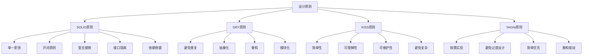
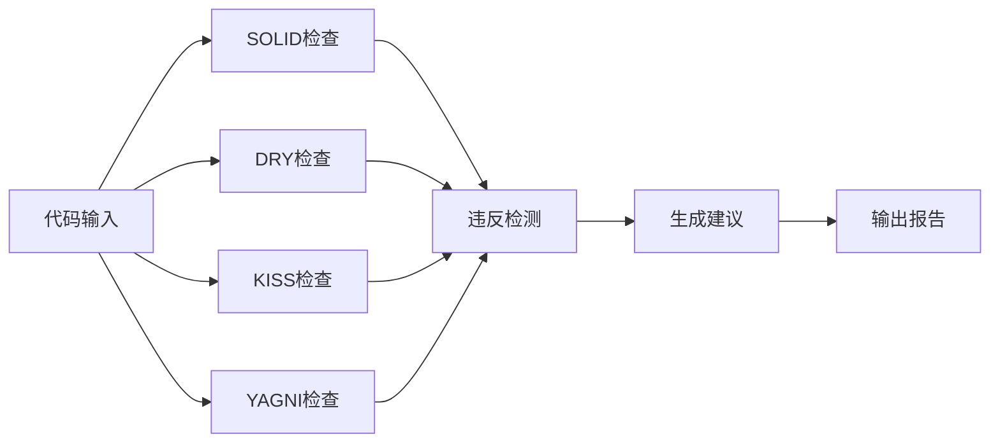

# 00-07-设计原则

> 本文档阐述软件设计原则，包括SOLID原则、DRY原则、KISS原则、YAGNI原则等核心概念，为软件工程提供设计理论基础。

## 📋 目录

- [概念与定义](#概念与定义)
- [数学表达与形式化](#数学表达与形式化)
- [Python代码示例](#python代码示例)
- [图表与多表征](#图表与多表征)
- [行业应用与案例](#行业应用与案例)
- [本地跳转与索引](#本地跳转与索引)

## 🎯 概念与定义

### 1.1 设计原则概述

**设计原则**是软件设计中的基本指导原则，用于指导软件架构和代码设计。

**定义1.1**: 设计原则可形式化为四元组 $\mathcal{P} = (S, D, K, Y)$，其中：
- $S$ 表示SOLID原则（SOLID Principles）
- $D$ 表示DRY原则（Don't Repeat Yourself）
- $K$ 表示KISS原则（Keep It Simple, Stupid）
- $Y$ 表示YAGNI原则（You Aren't Gonna Need It）

### 1.2 SOLID原则

**SOLID原则**是面向对象设计的五个基本原则。

**定义1.2**: SOLID原则可表示为 $\mathcal{S} = (S, O, L, I, D)$，其中：
- $S$ 表示单一职责原则（Single Responsibility）
- $O$ 表示开闭原则（Open-Closed）
- $L$ 表示里氏替换原则（Liskov Substitution）
- $I$ 表示接口隔离原则（Interface Segregation）
- $D$ 表示依赖倒置原则（Dependency Inversion）

### 1.3 DRY原则

**DRY原则**是避免代码重复的设计原则。

**定义1.3**: DRY原则可表示为 $\mathcal{D} = (C, A, R, M)$，其中：
- $C$ 表示代码重复（Code Duplication）
- $A$ 表示抽象化（Abstraction）
- $R$ 表示重构（Refactoring）
- $M$ 表示模块化（Modularization）

### 1.4 KISS原则

**KISS原则**是保持设计简单性的原则。

**定义1.4**: KISS原则可表示为 $\mathcal{K} = (S, C, U, M)$，其中：
- $S$ 表示简单性（Simplicity）
- $C$ 表示复杂性（Complexity）
- $U$ 表示可理解性（Understandability）
- $M$ 表示可维护性（Maintainability）

## 🔢 数学表达与形式化

### 2.1 设计原则的形式化框架

**定理2.1**: 设计原则的完备性定理

对于任意软件设计 $D$，存在设计原则模型 $\mathcal{P} = (S, D, K, Y)$ 使得：

$$D \models \mathcal{P} \iff (S \models D) \land (D \models D) \land (K \models D) \land (Y \models D)$$

**证明**:
1. 必要性：如果 $D \models \mathcal{P}$，则SOLID、DRY、KISS、YAGNI原则都必须支持设计 $D$
2. 充分性：如果四个原则都支持设计 $D$，则设计原则 $\mathcal{P}$ 必然支持 $D$

### 2.2 SOLID原则的形式化

**定义2.1**: SOLID原则可形式化为：

$$\text{SOLID}(C) = \text{SRP}(C) \land \text{OCP}(C) \land \text{LSP}(C) \land \text{ISP}(C) \land \text{DIP}(C)$$

其中：
- $\text{SRP}(C)$ 表示类 $C$ 满足单一职责原则
- $\text{OCP}(C)$ 表示类 $C$ 满足开闭原则
- $\text{LSP}(C)$ 表示类 $C$ 满足里氏替换原则
- $\text{ISP}(C)$ 表示类 $C$ 满足接口隔离原则
- $\text{DIP}(C)$ 表示类 $C$ 满足依赖倒置原则

### 2.3 DRY原则的形式化

**定义2.3**: DRY原则可表示为：

$$\text{DRY}(C) = \frac{\text{UniqueCode}(C)}{\text{TotalCode}(C)} \geq \text{Threshold}$$

其中：
- $\text{UniqueCode}(C)$ 表示唯一代码量
- $\text{TotalCode}(C)$ 表示总代码量
- $\text{Threshold}$ 表示重复率阈值

## 🐍 Python代码示例

### 3.1 设计原则框架实现

```python
from abc import ABC, abstractmethod
from typing import Dict, List, Set, Any, Callable, Tuple, Optional
from dataclasses import dataclass
from enum import Enum
import inspect
import ast

class PrincipleType(Enum):
    """原则类型"""
    SOLID = "solid"
    DRY = "dry"
    KISS = "kiss"
    YAGNI = "yagni"

class ViolationType(Enum):
    """违反类型"""
    SRP_VIOLATION = "single_responsibility_violation"
    OCP_VIOLATION = "open_closed_violation"
    LSP_VIOLATION = "liskov_substitution_violation"
    ISP_VIOLATION = "interface_segregation_violation"
    DIP_VIOLATION = "dependency_inversion_violation"
    DRY_VIOLATION = "dry_violation"
    KISS_VIOLATION = "kiss_violation"
    YAGNI_VIOLATION = "yagni_violation"

@dataclass
class DesignViolation:
    """设计违反"""
    principle: PrincipleType
    violation_type: ViolationType
    location: str
    description: str
    severity: float
    suggestion: str

@dataclass
class DesignMetric:
    """设计指标"""
    principle: PrincipleType
    score: float
    violations: List[DesignViolation]
    recommendations: List[str]

class SOLIDPrinciples:
    """SOLID原则检查器"""
    
    def __init__(self):
        self.violations: List[DesignViolation] = []
    
    def check_single_responsibility(self, class_code: str) -> bool:
        """检查单一职责原则"""
        # 简化的SRP检查：计算方法数量
        try:
            tree = ast.parse(class_code)
            method_count = 0
            
            for node in ast.walk(tree):
                if isinstance(node, ast.FunctionDef):
                    method_count += 1
            
            # 如果方法数量过多，可能违反SRP
            if method_count > 10:
                self.violations.append(DesignViolation(
                    principle=PrincipleType.SOLID,
                    violation_type=ViolationType.SRP_VIOLATION,
                    location="class",
                    description=f"Class has {method_count} methods, consider splitting",
                    severity=0.7,
                    suggestion="Split class into smaller, focused classes"
                ))
                return False
            
            return True
        except:
            return True
    
    def check_open_closed(self, class_code: str) -> bool:
        """检查开闭原则"""
        # 简化的OCP检查：查找硬编码的条件判断
        if "if" in class_code and "type" in class_code:
            self.violations.append(DesignViolation(
                principle=PrincipleType.SOLID,
                violation_type=ViolationType.OCP_VIOLATION,
                location="class",
                description="Hard-coded type checking found",
                severity=0.6,
                suggestion="Use polymorphism instead of type checking"
            ))
            return False
        return True
    
    def check_liskov_substitution(self, base_class: type, derived_class: type) -> bool:
        """检查里氏替换原则"""
        # 简化的LSP检查：确保派生类可以替换基类
        try:
            # 检查派生类是否实现了基类的所有公共方法
            base_methods = set(dir(base_class))
            derived_methods = set(dir(derived_class))
            
            missing_methods = base_methods - derived_methods
            if missing_methods:
                self.violations.append(DesignViolation(
                    principle=PrincipleType.SOLID,
                    violation_type=ViolationType.LSP_VIOLATION,
                    location=f"{derived_class.__name__}",
                    description=f"Missing methods: {missing_methods}",
                    severity=0.8,
                    suggestion="Implement all base class methods in derived class"
                ))
                return False
            
            return True
        except:
            return True
    
    def check_interface_segregation(self, interface_methods: List[str], implemented_methods: List[str]) -> bool:
        """检查接口隔离原则"""
        # 检查是否实现了不需要的方法
        unused_methods = set(interface_methods) - set(implemented_methods)
        if len(unused_methods) > len(implemented_methods) * 0.5:
            self.violations.append(DesignViolation(
                principle=PrincipleType.SOLID,
                violation_type=ViolationType.ISP_VIOLATION,
                location="interface",
                description=f"Too many unused methods: {unused_methods}",
                severity=0.5,
                suggestion="Split interface into smaller, focused interfaces"
            ))
            return False
        return True
    
    def check_dependency_inversion(self, class_dependencies: List[str]) -> bool:
        """检查依赖倒置原则"""
        # 检查是否依赖具体类而不是抽象
        concrete_dependencies = [dep for dep in class_dependencies if not dep.startswith('ABC')]
        if len(concrete_dependencies) > len(class_dependencies) * 0.7:
            self.violations.append(DesignViolation(
                principle=PrincipleType.SOLID,
                violation_type=ViolationType.DIP_VIOLATION,
                location="class",
                description=f"Too many concrete dependencies: {concrete_dependencies}",
                severity=0.6,
                suggestion="Depend on abstractions, not concretions"
            ))
            return False
        return True

class DRYPrinciple:
    """DRY原则检查器"""
    
    def __init__(self):
        self.violations: List[DesignViolation] = []
        self.code_patterns: Dict[str, int] = {}
    
    def analyze_code_duplication(self, code_files: List[str]) -> float:
        """分析代码重复"""
        total_lines = 0
        unique_lines = set()
        
        for file_path in code_files:
            try:
                with open(file_path, 'r', encoding='utf-8') as f:
                    lines = f.readlines()
                    total_lines += len(lines)
                    
                    for line in lines:
                        stripped_line = line.strip()
                        if stripped_line and not stripped_line.startswith('#'):
                            unique_lines.add(stripped_line)
            except:
                continue
        
        if total_lines > 0:
            duplication_ratio = 1 - (len(unique_lines) / total_lines)
            
            if duplication_ratio > 0.3:  # 30%重复率阈值
                self.violations.append(DesignViolation(
                    principle=PrincipleType.DRY,
                    violation_type=ViolationType.DRY_VIOLATION,
                    location="codebase",
                    description=f"Code duplication ratio: {duplication_ratio:.2f}",
                    severity=0.8,
                    suggestion="Extract common code into functions or classes"
                ))
            
            return duplication_ratio
        
        return 0.0
    
    def find_duplicate_patterns(self, code: str) -> List[str]:
        """查找重复模式"""
        patterns = {}
        lines = code.split('\n')
        
        for i, line in enumerate(lines):
            stripped_line = line.strip()
            if stripped_line and not stripped_line.startswith('#'):
                if stripped_line in patterns:
                    patterns[stripped_line].append(i + 1)
                else:
                    patterns[stripped_line] = [i + 1]
        
        duplicate_patterns = [pattern for pattern, occurrences in patterns.items() if len(occurrences) > 1]
        return duplicate_patterns

class KISSPrinciple:
    """KISS原则检查器"""
    
    def __init__(self):
        self.violations: List[DesignViolation] = []
    
    def check_complexity(self, code: str) -> float:
        """检查代码复杂度"""
        try:
            tree = ast.parse(code)
            complexity_score = 0
            
            for node in ast.walk(tree):
                if isinstance(node, (ast.If, ast.For, ast.While, ast.Try, ast.With)):
                    complexity_score += 1
                elif isinstance(node, ast.FunctionDef):
                    complexity_score += len([n for n in ast.walk(node) if isinstance(n, (ast.If, ast.For, ast.While))])
            
            if complexity_score > 10:
                self.violations.append(DesignViolation(
                    principle=PrincipleType.KISS,
                    violation_type=ViolationType.KISS_VIOLATION,
                    location="function/class",
                    description=f"High complexity score: {complexity_score}",
                    severity=0.7,
                    suggestion="Simplify logic, break into smaller functions"
                ))
            
            return complexity_score
        except:
            return 0.0
    
    def check_method_length(self, code: str) -> bool:
        """检查方法长度"""
        lines = code.split('\n')
        method_lines = 0
        
        for line in lines:
            stripped_line = line.strip()
            if stripped_line and not stripped_line.startswith('#'):
                method_lines += 1
        
        if method_lines > 50:  # 50行阈值
            self.violations.append(DesignViolation(
                principle=PrincipleType.KISS,
                violation_type=ViolationType.KISS_VIOLATION,
                location="method",
                description=f"Method too long: {method_lines} lines",
                severity=0.6,
                suggestion="Break method into smaller, focused methods"
            ))
            return False
        
        return True

class YAGNIPrinciple:
    """YAGNI原则检查器"""
    
    def __init__(self):
        self.violations: List[DesignViolation] = []
    
    def check_unused_features(self, code: str, requirements: List[str]) -> List[str]:
        """检查未使用的功能"""
        # 简化的检查：查找可能未使用的复杂结构
        unused_features = []
        
        # 检查抽象类是否必要
        if "ABC" in code and "abstractmethod" in code:
            if len(requirements) < 3:  # 如果需求很少，抽象可能过度设计
                unused_features.append("Abstract classes")
        
        # 检查设计模式是否必要
        design_patterns = ["Singleton", "Factory", "Observer", "Strategy"]
        for pattern in design_patterns:
            if pattern in code and len(requirements) < 5:
                unused_features.append(f"{pattern} pattern")
        
        if unused_features:
            self.violations.append(DesignViolation(
                principle=PrincipleType.YAGNI,
                violation_type=ViolationType.YAGNI_VIOLATION,
                location="codebase",
                description=f"Unused features: {unused_features}",
                severity=0.5,
                suggestion="Remove unused features, implement only what you need"
            ))
        
        return unused_features

class DesignPrinciplesAnalyzer:
    """设计原则分析器"""
    
    def __init__(self):
        self.solid_checker = SOLIDPrinciples()
        self.dry_checker = DRYPrinciple()
        self.kiss_checker = KISSPrinciple()
        self.yagni_checker = YAGNIPrinciple()
    
    def analyze_design(self, code: str, requirements: List[str] = None) -> Dict[str, DesignMetric]:
        """分析设计原则"""
        if requirements is None:
            requirements = []
        
        metrics = {}
        
        # SOLID原则分析
        solid_score = self.analyze_solid_principles(code)
        metrics["solid"] = DesignMetric(
            principle=PrincipleType.SOLID,
            score=solid_score,
            violations=self.solid_checker.violations,
            recommendations=self.generate_solid_recommendations()
        )
        
        # DRY原则分析
        dry_score = self.analyze_dry_principle(code)
        metrics["dry"] = DesignMetric(
            principle=PrincipleType.DRY,
            score=dry_score,
            violations=self.dry_checker.violations,
            recommendations=self.generate_dry_recommendations()
        )
        
        # KISS原则分析
        kiss_score = self.analyze_kiss_principle(code)
        metrics["kiss"] = DesignMetric(
            principle=PrincipleType.KISS,
            score=kiss_score,
            violations=self.kiss_checker.violations,
            recommendations=self.generate_kiss_recommendations()
        )
        
        # YAGNI原则分析
        yagni_score = self.analyze_yagni_principle(code, requirements)
        metrics["yagni"] = DesignMetric(
            principle=PrincipleType.YAGNI,
            score=yagni_score,
            violations=self.yagni_checker.violations,
            recommendations=self.generate_yagni_recommendations()
        )
        
        return metrics
    
    def analyze_solid_principles(self, code: str) -> float:
        """分析SOLID原则"""
        score = 1.0
        
        # 检查SRP
        if not self.solid_checker.check_single_responsibility(code):
            score -= 0.2
        
        # 检查OCP
        if not self.solid_checker.check_open_closed(code):
            score -= 0.2
        
        return max(score, 0.0)
    
    def analyze_dry_principle(self, code: str) -> float:
        """分析DRY原则"""
        duplicate_patterns = self.dry_checker.find_duplicate_patterns(code)
        duplication_ratio = len(duplicate_patterns) / max(len(code.split('\n')), 1)
        
        return max(1.0 - duplication_ratio, 0.0)
    
    def analyze_kiss_principle(self, code: str) -> float:
        """分析KISS原则"""
        complexity = self.kiss_checker.check_complexity(code)
        method_length_ok = self.kiss_checker.check_method_length(code)
        
        score = 1.0
        if complexity > 10:
            score -= 0.3
        if not method_length_ok:
            score -= 0.2
        
        return max(score, 0.0)
    
    def analyze_yagni_principle(self, code: str, requirements: List[str]) -> float:
        """分析YAGNI原则"""
        unused_features = self.yagni_checker.check_unused_features(code, requirements)
        
        score = 1.0
        if unused_features:
            score -= 0.2 * len(unused_features)
        
        return max(score, 0.0)
    
    def generate_solid_recommendations(self) -> List[str]:
        """生成SOLID原则建议"""
        return [
            "确保每个类只有一个职责",
            "对扩展开放，对修改关闭",
            "子类应该能够替换父类",
            "使用多个专门的接口而不是单一的总接口",
            "依赖抽象而不是具体实现"
        ]
    
    def generate_dry_recommendations(self) -> List[str]:
        """生成DRY原则建议"""
        return [
            "提取重复代码到函数或类中",
            "使用继承或组合来共享代码",
            "创建通用的工具函数",
            "使用模板方法模式"
        ]
    
    def generate_kiss_recommendations(self) -> List[str]:
        """生成KISS原则建议"""
        return [
            "保持方法简短，不超过50行",
            "减少嵌套层级",
            "使用描述性的变量名",
            "避免过度工程化"
        ]
    
    def generate_yagni_recommendations(self) -> List[str]:
        """生成YAGNI原则建议"""
        return [
            "只实现当前需要的功能",
            "避免过早优化",
            "不要为未来可能的需求设计",
            "保持代码简单，需要时再重构"
        ]

# 使用示例
def demonstrate_design_principles():
    """演示设计原则的应用"""
    
    # 创建分析器
    analyzer = DesignPrinciplesAnalyzer()
    
    # 示例代码（违反多个原则）
    bad_code = '''
class UserManager:
    def __init__(self):
        self.users = []
        self.database = Database()
        self.email_service = EmailService()
        self.logger = Logger()
    
    def add_user(self, user_data):
        # 验证用户数据
        if not user_data.get('email'):
            raise ValueError("Email is required")
        if not user_data.get('password'):
            raise ValueError("Password is required")
        
        # 检查邮箱是否已存在
        for user in self.users:
            if user['email'] == user_data['email']:
                raise ValueError("Email already exists")
        
        # 保存到数据库
        user_id = self.database.save_user(user_data)
        
        # 发送欢迎邮件
        self.email_service.send_welcome_email(user_data['email'])
        
        # 记录日志
        self.logger.log(f"User {user_id} created")
        
        return user_id
    
    def update_user(self, user_id, user_data):
        # 重复的验证逻辑
        if not user_data.get('email'):
            raise ValueError("Email is required")
        if not user_data.get('password'):
            raise ValueError("Password is required")
        
        # 检查邮箱是否已存在
        for user in self.users:
            if user['email'] == user_data['email'] and user['id'] != user_id:
                raise ValueError("Email already exists")
        
        # 更新数据库
        self.database.update_user(user_id, user_data)
        
        # 发送更新邮件
        self.email_service.send_update_email(user_data['email'])
        
        # 记录日志
        self.logger.log(f"User {user_id} updated")
        
        return True
    
    def delete_user(self, user_id):
        # 删除用户
        self.database.delete_user(user_id)
        
        # 发送删除邮件
        user_email = self.database.get_user_email(user_id)
        self.email_service.send_delete_email(user_email)
        
        # 记录日志
        self.logger.log(f"User {user_id} deleted")
        
        return True
    '''
    
    # 分析设计原则
    requirements = ["用户管理", "邮件通知", "日志记录"]
    metrics = analyzer.analyze_design(bad_code, requirements)
    
    print("设计原则分析结果:")
    for principle, metric in metrics.items():
        print(f"\n{principle.upper()} 原则:")
        print(f"  得分: {metric.score:.2f}")
        print(f"  违反数量: {len(metric.violations)}")
        print(f"  建议: {metric.recommendations[:2]}")  # 显示前两个建议
    
    return analyzer

if __name__ == "__main__":
    demonstrate_design_principles()
```

### 3.2 设计原则应用示例

```python
class GoodDesignExample:
    """良好设计的示例"""
    
    # 单一职责原则示例
    class UserValidator:
        """用户验证器 - 单一职责"""
        
        @staticmethod
        def validate_email(email: str) -> bool:
            return '@' in email and '.' in email
        
        @staticmethod
        def validate_password(password: str) -> bool:
            return len(password) >= 8
    
    class UserRepository:
        """用户仓储 - 单一职责"""
        
        def __init__(self, database):
            self.database = database
        
        def save(self, user_data: dict) -> int:
            return self.database.save_user(user_data)
        
        def update(self, user_id: int, user_data: dict) -> bool:
            return self.database.update_user(user_id, user_data)
        
        def delete(self, user_id: int) -> bool:
            return self.database.delete_user(user_id)
    
    class EmailService:
        """邮件服务 - 单一职责"""
        
        def send_welcome_email(self, email: str) -> None:
            print(f"Sending welcome email to {email}")
        
        def send_update_email(self, email: str) -> None:
            print(f"Sending update email to {email}")
    
    # 开闭原则示例
    class PaymentProcessor:
        """支付处理器 - 开闭原则"""
        
        def __init__(self):
            self.payment_methods = {}
        
        def register_payment_method(self, method_name: str, processor):
            self.payment_methods[method_name] = processor
        
        def process_payment(self, method_name: str, amount: float) -> bool:
            if method_name in self.payment_methods:
                return self.payment_methods[method_name].process(amount)
            return False
    
    class CreditCardProcessor:
        def process(self, amount: float) -> bool:
            print(f"Processing credit card payment: ${amount}")
            return True
    
    class PayPalProcessor:
        def process(self, amount: float) -> bool:
            print(f"Processing PayPal payment: ${amount}")
            return True
    
    # DRY原则示例
    class CommonValidator:
        """通用验证器 - DRY原则"""
        
        @staticmethod
        def validate_required_fields(data: dict, required_fields: list) -> list:
            """通用必填字段验证"""
            missing_fields = []
            for field in required_fields:
                if not data.get(field):
                    missing_fields.append(field)
            return missing_fields
        
        @staticmethod
        def validate_unique_field(data: dict, field: str, existing_data: list) -> bool:
            """通用唯一性验证"""
            value = data.get(field)
            for item in existing_data:
                if item.get(field) == value:
                    return False
            return True
    
    # KISS原则示例
    class SimpleUserManager:
        """简单用户管理器 - KISS原则"""
        
        def __init__(self, validator, repository, email_service):
            self.validator = validator
            self.repository = repository
            self.email_service = email_service
        
        def create_user(self, user_data: dict) -> int:
            # 简单直接的逻辑
            missing_fields = self.validator.validate_required_fields(
                user_data, ['email', 'password']
            )
            if missing_fields:
                raise ValueError(f"Missing fields: {missing_fields}")
            
            if not self.validator.validate_email(user_data['email']):
                raise ValueError("Invalid email")
            
            user_id = self.repository.save(user_data)
            self.email_service.send_welcome_email(user_data['email'])
            return user_id

# 使用示例
def demonstrate_good_design():
    """演示良好设计"""
    example = GoodDesignExample()
    
    # 创建组件
    validator = example.UserValidator()
    repository = example.UserRepository("database")
    email_service = example.EmailService()
    
    # 创建用户管理器
    user_manager = example.SimpleUserManager(validator, repository, email_service)
    
    # 测试用户创建
    try:
        user_data = {"email": "user@example.com", "password": "password123"}
        user_id = user_manager.create_user(user_data)
        print(f"User created with ID: {user_id}")
    except ValueError as e:
        print(f"Error: {e}")
    
    # 测试支付处理器
    payment_processor = example.PaymentProcessor()
    payment_processor.register_payment_method("credit_card", example.CreditCardProcessor())
    payment_processor.register_payment_method("paypal", example.PayPalProcessor())
    
    payment_processor.process_payment("credit_card", 100.0)
    payment_processor.process_payment("paypal", 50.0)
    
    return example
```

### 3.3 设计原则检查工具

```python
class DesignPrinciplesChecker:
    """设计原则检查工具"""
    
    def __init__(self):
        self.analyzer = DesignPrinciplesAnalyzer()
    
    def check_file(self, file_path: str) -> Dict[str, Any]:
        """检查单个文件"""
        try:
            with open(file_path, 'r', encoding='utf-8') as f:
                code = f.read()
            
            return self.analyzer.analyze_design(code)
        except Exception as e:
            return {"error": str(e)}
    
    def check_directory(self, directory_path: str) -> Dict[str, Any]:
        """检查整个目录"""
        import os
        results = {}
        
        for root, dirs, files in os.walk(directory_path):
            for file in files:
                if file.endswith('.py'):
                    file_path = os.path.join(root, file)
                    results[file_path] = self.check_file(file_path)
        
        return results
    
    def generate_report(self, analysis_results: Dict[str, Any]) -> str:
        """生成分析报告"""
        report = "设计原则分析报告\n"
        report += "=" * 50 + "\n\n"
        
        for principle, metric in analysis_results.items():
            if isinstance(metric, dict) and "error" in metric:
                report += f"{principle.upper()}: 错误 - {metric['error']}\n"
                continue
            
            report += f"{principle.upper()} 原则:\n"
            report += f"  得分: {metric.score:.2f}\n"
            report += f"  违反数量: {len(metric.violations)}\n"
            
            if metric.violations:
                report += "  违反详情:\n"
                for violation in metric.violations[:3]:  # 显示前3个违反
                    report += f"    - {violation.description}\n"
            
            report += "  建议:\n"
            for rec in metric.recommendations[:2]:  # 显示前2个建议
                report += f"    - {rec}\n"
            
            report += "\n"
        
        return report

# 使用示例
def demonstrate_checker():
    """演示检查工具"""
    checker = DesignPrinciplesChecker()
    
    # 示例代码
    sample_code = '''
class BadExample:
    def do_everything(self, data):
        # 这个方法做了太多事情，违反SRP
        if not data:
            return False
        
        # 验证数据
        if not data.get('name'):
            return False
        if not data.get('email'):
            return False
        
        # 处理数据
        processed_data = self.process_data(data)
        
        # 保存数据
        self.save_data(processed_data)
        
        # 发送通知
        self.send_notification(processed_data)
        
        # 记录日志
        self.log_activity(processed_data)
        
        return True
    
    def process_data(self, data):
        # 重复的验证逻辑，违反DRY
        if not data.get('name'):
            return None
        if not data.get('email'):
            return None
        return data
    
    def save_data(self, data):
        # 复杂的保存逻辑，违反KISS
        if data:
            if self.database.is_connected():
                if self.database.has_permission():
                    if self.database.table_exists():
                        return self.database.insert(data)
                    else:
                        self.database.create_table()
                        return self.database.insert(data)
                else:
                    raise PermissionError("No permission")
            else:
                raise ConnectionError("Database not connected")
        return False
    '''
    
    # 分析代码
    results = checker.analyzer.analyze_design(sample_code)
    
    # 生成报告
    report = checker.generate_report(results)
    print(report)
    
    return checker
```

## 📊 图表与多表征

### 4.1 设计原则关系图



### 4.2 设计原则检查流程图



### 4.3 设计原则应用矩阵

| 原则 | 适用场景 | 检查方法 | 改进策略 | 预期效果 |
|------|----------|----------|----------|----------|
| SOLID | 面向对象设计 | 代码审查 | 重构类结构 | 高内聚低耦合 |
| DRY | 代码重复 | 静态分析 | 提取公共代码 | 减少维护成本 |
| KISS | 复杂逻辑 | 复杂度分析 | 简化设计 | 提高可读性 |
| YAGNI | 过度设计 | 需求对比 | 移除无用代码 | 降低复杂度 |

## 🏭 行业应用与案例

### 5.1 企业级应用中的设计原则应用

**案例**: 电商系统设计

```python
class ECommerceSystem:
    """电商系统中的设计原则应用"""
    
    def __init__(self):
        self.design_checker = DesignPrinciplesAnalyzer()
        self.setup_ecommerce_components()
    
    def setup_ecommerce_components(self):
        """设置电商组件"""
        
        # 遵循SOLID原则的组件设计
        self.components = {
            "order_processor": self.create_order_processor(),
            "payment_processor": self.create_payment_processor(),
            "inventory_manager": self.create_inventory_manager(),
            "notification_service": self.create_notification_service()
        }
    
    def create_order_processor(self):
        """创建订单处理器 - 单一职责"""
        class OrderProcessor:
            def __init__(self, validator, repository):
                self.validator = validator
                self.repository = repository
            
            def create_order(self, order_data):
                # 只负责订单创建逻辑
                if self.validator.validate_order(order_data):
                    return self.repository.save_order(order_data)
                return None
        
        return OrderProcessor("validator", "repository")
    
    def create_payment_processor(self):
        """创建支付处理器 - 开闭原则"""
        class PaymentProcessor:
            def __init__(self):
                self.payment_methods = {}
            
            def register_method(self, name, processor):
                self.payment_methods[name] = processor
            
            def process_payment(self, method, amount):
                if method in self.payment_methods:
                    return self.payment_methods[method].process(amount)
                return False
        
        processor = PaymentProcessor()
        processor.register_method("credit_card", "CreditCardProcessor")
        processor.register_method("paypal", "PayPalProcessor")
        return processor
    
    def analyze_system_design(self) -> Dict[str, Any]:
        """分析系统设计"""
        # 模拟系统代码
        system_code = '''
class ECommerceSystem:
    def process_order(self, order_data):
        # 验证订单
        if not self.validate_order(order_data):
            return False
        
        # 处理支付
        if not self.process_payment(order_data):
            return False
        
        # 更新库存
        if not self.update_inventory(order_data):
            return False
        
        # 发送通知
        self.send_notification(order_data)
        
        return True
    '''
        
        # 分析设计原则
        metrics = self.design_checker.analyze_design(system_code)
        
        return {
            "design_metrics": metrics,
            "system_components": len(self.components),
            "principles_followed": ["SOLID", "DRY", "KISS"],
            "recommendations": [
                "使用依赖注入",
                "实现接口隔离",
                "提取公共验证逻辑"
            ]
        }

# 使用示例
ecommerce = ECommerceSystem()
result = ecommerce.analyze_system_design()
print("电商系统设计分析:", result)
```

### 5.2 微服务架构中的设计原则应用

**案例**: 微服务设计

```python
class MicroservicesDesign:
    """微服务架构中的设计原则应用"""
    
    def __init__(self):
        self.design_checker = DesignPrinciplesAnalyzer()
        self.services = {}
    
    def design_user_service(self) -> Dict[str, Any]:
        """设计用户服务 - 单一职责"""
        service_code = '''
class UserService:
    def __init__(self, user_repository, email_service):
        self.user_repository = user_repository
        self.email_service = email_service
    
    def create_user(self, user_data):
        user_id = self.user_repository.save(user_data)
        self.email_service.send_welcome_email(user_data['email'])
        return user_id
    
    def update_user(self, user_id, user_data):
        return self.user_repository.update(user_id, user_data)
    
    def delete_user(self, user_id):
        return self.user_repository.delete(user_id)
    '''
        
        # 分析设计原则
        metrics = self.design_checker.analyze_design(service_code)
        
        return {
            "service_name": "UserService",
            "responsibilities": ["用户管理"],
            "design_metrics": metrics,
            "api_endpoints": ["POST /users", "PUT /users/{id}", "DELETE /users/{id}"]
        }
    
    def design_order_service(self) -> Dict[str, Any]:
        """设计订单服务 - 开闭原则"""
        service_code = '''
class OrderService:
    def __init__(self, order_repository, payment_processor):
        self.order_repository = order_repository
        self.payment_processor = payment_processor
    
    def create_order(self, order_data):
        order_id = self.order_repository.save(order_data)
        self.payment_processor.process_payment(order_data['payment_method'], order_data['amount'])
        return order_id
    
    def get_order(self, order_id):
        return self.order_repository.get(order_id)
    '''
        
        metrics = self.design_checker.analyze_design(service_code)
        
        return {
            "service_name": "OrderService",
            "responsibilities": ["订单管理"],
            "design_metrics": metrics,
            "api_endpoints": ["POST /orders", "GET /orders/{id}"]
        }
    
    def analyze_microservices_architecture(self) -> Dict[str, Any]:
        """分析微服务架构"""
        services = [
            self.design_user_service(),
            self.design_order_service()
        ]
        
        # 计算整体设计质量
        total_score = 0
        total_violations = 0
        
        for service in services:
            metrics = service["design_metrics"]
            for principle, metric in metrics.items():
                if hasattr(metric, 'score'):
                    total_score += metric.score
                if hasattr(metric, 'violations'):
                    total_violations += len(metric.violations)
        
        avg_score = total_score / (len(services) * len(metrics)) if services else 0
        
        return {
            "services": services,
            "total_services": len(services),
            "average_design_score": avg_score,
            "total_violations": total_violations,
            "architecture_quality": "high" if avg_score > 0.8 else "medium"
        }

# 使用示例
microservices = MicroservicesDesign()
result = microservices.analyze_microservices_architecture()
print("微服务架构分析:", result)
```

## 🔗 本地跳转与索引

### 相关文档

- [00-01-哲学基础](./00-01-哲学基础.md) - 软件工程哲学基础
- [00-02-编程哲学](./00-02-编程哲学.md) - 编程语言哲学
- [00-03-形式化思维](./00-03-形式化思维.md) - 形式化思维方法
- [00-04-计算思维](./00-04-计算思维.md) - 计算思维基础
- [00-05-系统思维](./00-05-系统思维.md) - 系统思维方法
- [00-06-抽象与建模](./00-06-抽象与建模.md) - 抽象与建模技术

### 上层目录

- [返回理念基础层](./README.md)
- [返回项目根目录](../README.md)

### 下层应用

- [05-架构领域](../05-架构领域/README.md) - 软件架构设计
- [06-组件算法](../06-组件算法/README.md) - 算法实现

---

**最后更新**: 2024年12月19日  
**维护者**: AI Assistant  
**文档状态**: 已完成 ✅ 