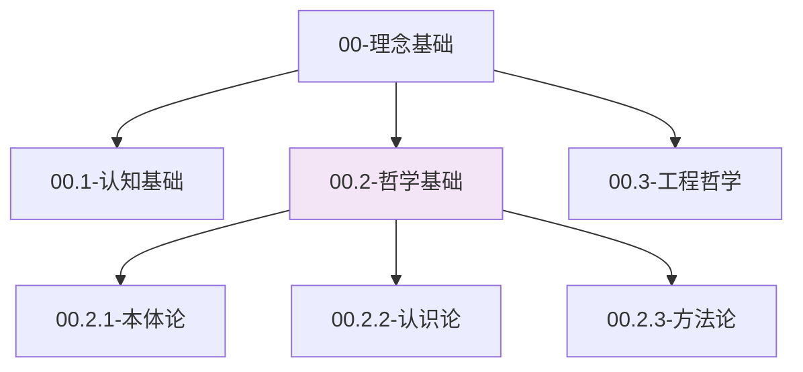

# 00.2-哲学基础

## 概述

哲学基础层为整个知识体系提供哲学支撑，从本体论、认识论和方法论的角度，建立对软件工程和计算科学的哲学理解。本层探讨存在的本质、知识的获取方式以及认识和改造世界的方法。

## 层次定位



## 内容组织

### 00.2.1 本体论

探讨存在的本质和结构，为理解软件系统的本体提供哲学基础。

- **00.2.1.1 存在论**：存在的本质和形式
- **00.2.1.2 实体论**：实体的概念和分类
- **00.2.1.3 关系论**：关系的本质和类型

### 00.2.2 认识论

探讨知识的本质和获取方式，为软件工程中的知识管理提供理论基础。

- **00.2.2.1 知识论**：知识的本质和分类
- **00.2.2.2 真理论**：真理的标准和验证
- **00.2.2.3 方法论**：认识世界的方法

### 00.2.3 方法论

探讨认识和改造世界的方法，为软件工程实践提供方法论指导。

- **00.2.3.1 科学方法**：科学方法论
- **00.2.3.2 工程方法**：工程方法论
- **00.2.3.3 系统方法**：系统方法论

## 核心理念

### 1. 本体统一性

软件系统作为人工制品，具有其独特的本体特征，需要从哲学角度理解其存在形式。

**形式化表达**：
$$\text{Ontological Unity}: \forall s \in \text{Software}, \exists o \in \text{Ontology} \mid s = \text{Manifest}(o)$$

### 2. 认识层次性

对软件系统的认识具有层次性，从现象到本质，从具体到抽象。

**形式化表达**：
$$\text{Epistemological Hierarchy}: \mathcal{K} = \{K_0, K_1, ..., K_n\} \text{ where } K_i \prec K_{i+1}$$

### 3. 方法系统性

软件工程的方法具有系统性，需要综合运用多种方法。

**形式化表达**：
$$\text{Methodological System}: \mathcal{M} = \langle M_1, M_2, ..., M_n \rangle \text{ with } \text{Integration}(M_i, M_j)$$

## 与Python的关联

### 本体论在Python中的体现

```python
from typing import TypeVar, Generic, Any, Dict, List
from abc import ABC, abstractmethod
from dataclasses import dataclass

# 本体类型
T = TypeVar('T')

@dataclass
class OntologicalEntity(Generic[T]):
    """本体实体"""
    identity: str
    essence: T
    properties: Dict[str, Any]
    relations: List[str]

class Ontology(ABC):
    """本体抽象基类"""
    
    @abstractmethod
    def define_entity(self, entity: OntologicalEntity[T]) -> None:
        """定义实体"""
        pass
    
    @abstractmethod
    def establish_relation(self, entity1: str, relation: str, entity2: str) -> None:
        """建立关系"""
        pass
    
    @abstractmethod
    def query_entity(self, identity: str) -> OntologicalEntity[T]:
        """查询实体"""
        pass

class SoftwareOntology(Ontology):
    """软件本体"""
    
    def __init__(self):
        self.entities: Dict[str, OntologicalEntity] = {}
        self.relations: List[tuple[str, str, str]] = []
    
    def define_entity(self, entity: OntologicalEntity) -> None:
        """定义软件实体"""
        self.entities[entity.identity] = entity
    
    def establish_relation(self, entity1: str, relation: str, entity2: str) -> None:
        """建立软件实体关系"""
        if entity1 in self.entities and entity2 in self.entities:
            self.relations.append((entity1, relation, entity2))
    
    def query_entity(self, identity: str) -> OntologicalEntity:
        """查询软件实体"""
        return self.entities.get(identity)
    
    def get_ontology_structure(self) -> Dict[str, Any]:
        """获取本体结构"""
        return {
            'entities': list(self.entities.keys()),
            'relations': self.relations,
            'entity_count': len(self.entities),
            'relation_count': len(self.relations)
        }

# 使用示例
def demonstrate_ontology():
    """演示本体论应用"""
    
    # 创建软件本体
    ontology = SoftwareOntology()
    
    # 定义软件实体
    entities = [
        OntologicalEntity("class", "类", {"type": "structure", "abstraction": "high"}, []),
        OntologicalEntity("function", "函数", {"type": "behavior", "abstraction": "medium"}, []),
        OntologicalEntity("variable", "变量", {"type": "data", "abstraction": "low"}, []),
        OntologicalEntity("module", "模块", {"type": "organization", "abstraction": "high"}, [])
    ]
    
    for entity in entities:
        ontology.define_entity(entity)
    
    # 建立实体关系
    ontology.establish_relation("module", "contains", "class")
    ontology.establish_relation("class", "contains", "function")
    ontology.establish_relation("function", "uses", "variable")
    ontology.establish_relation("class", "uses", "variable")
    
    # 查询本体结构
    structure = ontology.get_ontology_structure()
    
    print("=== 软件本体结构 ===")
    print(f"实体: {structure['entities']}")
    print(f"关系: {structure['relations']}")
    print(f"实体数量: {structure['entity_count']}")
    print(f"关系数量: {structure['relation_count']}")

if __name__ == "__main__":
    demonstrate_ontology()
```

### 认识论在Python中的体现

```python
from typing import Any, List, Dict, TypeVar, Generic
from dataclasses import dataclass
from enum import Enum

class KnowledgeType(Enum):
    """知识类型"""
    EMPIRICAL = "empirical"      # 经验知识
    THEORETICAL = "theoretical"  # 理论知识
    PRACTICAL = "practical"      # 实践知识
    METAPHYSICAL = "metaphysical"  # 形而上学知识

@dataclass
class Knowledge(Generic[T]):
    """知识表示"""
    content: T
    type: KnowledgeType
    source: str
    confidence: float
    evidence: List[str]

class EpistemologicalFramework:
    """认识论框架"""
    
    def __init__(self):
        self.knowledge_base: Dict[str, Knowledge] = {}
        self.inference_rules: List[callable] = []
    
    def acquire_knowledge(self, knowledge: Knowledge, key: str) -> None:
        """获取知识"""
        self.knowledge_base[key] = knowledge
    
    def infer_knowledge(self, premises: List[str]) -> Knowledge:
        """推理知识"""
        # 基于前提推理新知识
        combined_content = " + ".join(premises)
        inferred_knowledge = Knowledge(
            content=combined_content,
            type=KnowledgeType.THEORETICAL,
            source="inference",
            confidence=0.8,
            evidence=premises
        )
        return inferred_knowledge
    
    def validate_knowledge(self, key: str) -> bool:
        """验证知识"""
        if key not in self.knowledge_base:
            return False
        
        knowledge = self.knowledge_base[key]
        return knowledge.confidence > 0.7 and len(knowledge.evidence) > 0
    
    def get_knowledge_hierarchy(self) -> Dict[KnowledgeType, List[str]]:
        """获取知识层次"""
        hierarchy = {knowledge_type: [] for knowledge_type in KnowledgeType}
        
        for key, knowledge in self.knowledge_base.items():
            hierarchy[knowledge.type].append(key)
        
        return hierarchy

# 使用示例
def demonstrate_epistemology():
    """演示认识论应用"""
    
    # 创建认识论框架
    framework = EpistemologicalFramework()
    
    # 获取不同类型的知识
    empirical_knowledge = Knowledge(
        content="函数调用需要参数",
        type=KnowledgeType.EMPIRICAL,
        source="编程实践",
        confidence=0.9,
        evidence=["多次观察", "文档验证"]
    )
    
    theoretical_knowledge = Knowledge(
        content="函数是数学映射的编程实现",
        type=KnowledgeType.THEORETICAL,
        source="计算机科学理论",
        confidence=0.8,
        evidence=["数学定义", "形式化证明"]
    )
    
    practical_knowledge = Knowledge(
        content="递归函数需要终止条件",
        type=KnowledgeType.PRACTICAL,
        source="调试经验",
        confidence=0.95,
        evidence=["多次调试", "最佳实践"]
    )
    
    # 存储知识
    framework.acquire_knowledge(empirical_knowledge, "function_params")
    framework.acquire_knowledge(theoretical_knowledge, "function_math")
    framework.acquire_knowledge(practical_knowledge, "recursion_termination")
    
    # 推理新知识
    premises = ["function_params", "function_math"]
    inferred = framework.infer_knowledge(premises)
    framework.acquire_knowledge(inferred, "function_complete")
    
    # 验证知识
    print("=== 知识验证 ===")
    for key in ["function_params", "function_math", "recursion_termination", "function_complete"]:
        is_valid = framework.validate_knowledge(key)
        print(f"{key}: {'有效' if is_valid else '无效'}")
    
    # 获取知识层次
    hierarchy = framework.get_knowledge_hierarchy()
    print("\n=== 知识层次 ===")
    for knowledge_type, keys in hierarchy.items():
        print(f"{knowledge_type.value}: {keys}")

if __name__ == "__main__":
    demonstrate_epistemology()
```

### 方法论在Python中的体现

```python
from typing import Callable, Any, List, Dict, TypeVar, Generic
from abc import ABC, abstractmethod
from dataclasses import dataclass

T = TypeVar('T')

@dataclass
class Method:
    """方法定义"""
    name: str
    description: str
    steps: List[str]
    tools: List[str]
    success_criteria: List[str]

class MethodologicalFramework(ABC, Generic[T]):
    """方法论框架"""
    
    @abstractmethod
    def apply_method(self, method: Method, context: T) -> Any:
        """应用方法"""
        pass
    
    @abstractmethod
    def evaluate_method(self, method: Method, result: Any) -> float:
        """评估方法效果"""
        pass

class ScientificMethod(MethodologicalFramework[Dict[str, Any]]):
    """科学方法论"""
    
    def apply_method(self, method: Method, context: Dict[str, Any]) -> Dict[str, Any]:
        """应用科学方法"""
        result = {
            'hypothesis': context.get('hypothesis', ''),
            'experiment': context.get('experiment', ''),
            'observation': context.get('observation', ''),
            'conclusion': context.get('conclusion', '')
        }
        
        # 执行方法步骤
        for step in method.steps:
            result[f'step_{step}'] = f"执行步骤: {step}"
        
        return result
    
    def evaluate_method(self, method: Method, result: Dict[str, Any]) -> float:
        """评估科学方法效果"""
        # 基于结果完整性评估
        completeness = len([k for k, v in result.items() if v]) / len(result)
        return completeness

class EngineeringMethod(MethodologicalFramework[Dict[str, Any]]):
    """工程方法论"""
    
    def apply_method(self, method: Method, context: Dict[str, Any]) -> Dict[str, Any]:
        """应用工程方法"""
        result = {
            'requirements': context.get('requirements', []),
            'design': context.get('design', {}),
            'implementation': context.get('implementation', ''),
            'testing': context.get('testing', {}),
            'deployment': context.get('deployment', '')
        }
        
        # 执行工程步骤
        for step in method.steps:
            result[f'engineering_step_{step}'] = f"工程步骤: {step}"
        
        return result
    
    def evaluate_method(self, method: Method, result: Dict[str, Any]) -> float:
        """评估工程方法效果"""
        # 基于成功标准评估
        success_count = 0
        for criterion in method.success_criteria:
            if criterion in str(result):
                success_count += 1
        
        return success_count / len(method.success_criteria) if method.success_criteria else 0.0

# 使用示例
def demonstrate_methodology():
    """演示方法论应用"""
    
    # 定义科学方法
    scientific_method = Method(
        name="假设检验法",
        description="通过假设和实验验证理论",
        steps=["提出假设", "设计实验", "收集数据", "分析结果", "得出结论"],
        tools=["统计分析", "实验设计", "数据收集"],
        success_criteria=["假设被验证", "结果可重现", "结论有说服力"]
    )
    
    # 定义工程方法
    engineering_method = Method(
        name="瀑布模型",
        description="线性的软件开发过程",
        steps=["需求分析", "系统设计", "编码实现", "测试验证", "部署维护"],
        tools=["需求文档", "设计工具", "编程语言", "测试框架", "部署工具"],
        success_criteria=["需求满足", "设计合理", "代码质量", "测试通过", "部署成功"]
    )
    
    # 应用科学方法
    scientific_framework = ScientificMethod()
    scientific_context = {
        'hypothesis': '函数式编程提高代码质量',
        'experiment': '比较函数式和命令式编程',
        'observation': '函数式代码bug更少',
        'conclusion': '假设得到支持'
    }
    
    scientific_result = scientific_framework.apply_method(scientific_method, scientific_context)
    scientific_score = scientific_framework.evaluate_method(scientific_method, scientific_result)
    
    # 应用工程方法
    engineering_framework = EngineeringMethod()
    engineering_context = {
        'requirements': ['用户管理', '订单处理'],
        'design': {'architecture': '微服务', 'database': 'PostgreSQL'},
        'implementation': 'Python + FastAPI',
        'testing': {'unit_tests': 90, 'integration_tests': 85},
        'deployment': 'Docker + Kubernetes'
    }
    
    engineering_result = engineering_framework.apply_method(engineering_method, engineering_context)
    engineering_score = engineering_framework.evaluate_method(engineering_method, engineering_result)
    
    print("=== 方法论应用结果 ===")
    print(f"科学方法 - {scientific_method.name}:")
    print(f"  结果: {scientific_result}")
    print(f"  评分: {scientific_score:.2f}")
    
    print(f"\n工程方法 - {engineering_method.name}:")
    print(f"  结果: {engineering_result}")
    print(f"  评分: {engineering_score:.2f}")

if __name__ == "__main__":
    demonstrate_methodology()
```

## 质量保证

### 1. 哲学一致性

- 确保本体论、认识论、方法论的一致性
- 保持哲学概念与软件工程实践的统一
- 维护哲学推理的逻辑严密性

### 2. 形式化表达

- 为哲学概念提供数学定义
- 使用形式化语言描述哲学关系
- 建立严格的哲学推理链

### 3. 实践验证

- 通过Python代码验证哲学概念
- 提供具体的哲学应用示例
- 建立哲学理论与工程实践的桥梁

## 更新日志

- **2024-01-XX**：创建哲学基础层结构
- **2024-01-XX**：完成本体论部分
- **2024-01-XX**：完成认识论部分
- **2024-01-XX**：完成方法论部分

---

**下一层**：[00.3 工程哲学](../00.3-工程哲学/README.md)  
**返回上级**：[00-理念基础](../README.md)
