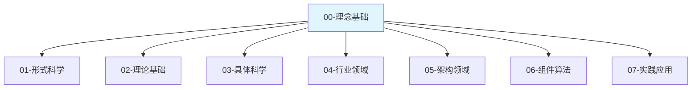

# 00-理念基础

## 概述

理念基础层是整个知识体系的哲学根基，为后续所有层次提供认知基础和思想支撑。本层从哲学、认知科学和工程哲学的角度，建立对软件工程和计算科学的根本性理解。

## 层次定位



## 内容组织

### 00.1 认知基础

认知科学视角下的思维模式和认知过程，为理解软件工程提供认知基础。

- **00.1.1 认知模型**：人类认知的基本模型和过程
- **00.1.2 抽象思维**：抽象思维的本质和特征
- **00.1.3 系统思维**：系统思维的方法和原则

### 00.2 哲学基础

哲学视角下的本体论、认识论和方法论，为软件工程提供哲学支撑。

- **00.2.1 本体论**：存在的本质和结构
- **00.2.2 认识论**：知识的本质和获取方式
- **00.2.3 方法论**：认识和改造世界的方法

### 00.3 工程哲学

工程领域的哲学思考，为软件工程提供工程哲学基础。

- **00.3.1 工程思维**：工程思维的特征和模式
- **00.3.2 设计哲学**：设计的本质和原则
- **00.3.3 质量哲学**：质量的概念和标准

## 核心理念

### 1. 认知统一性

软件工程本质上是人类认知活动的工程化表达，需要从认知科学的角度理解其本质。

**形式化表达**：
$$\text{Cognitive Unity}: \forall p \in \text{Program}, \exists c \in \text{Cognition} \mid p = \text{Express}(c)$$

### 2. 抽象层次性

软件系统具有多层次的抽象结构，每一层都有其特定的概念和规律。

**形式化表达**：
$$\text{Abstraction Hierarchy}: \mathcal{A} = \{A_0, A_1, ..., A_n\} \text{ where } A_i \prec A_{i+1}$$

### 3. 系统整体性

软件系统是一个有机整体，其性质不能完全由其组成部分的性质推导出来。

**形式化表达**：
$$\text{System Wholeness}: \text{System}(S) \neq \sum_{i=1}^{n} \text{Component}(C_i)$$

## 与Python的关联

### 认知模型在Python中的体现

```python
from typing import TypeVar, Generic, Callable, Any
from abc import ABC, abstractmethod

# 抽象思维：通过抽象基类表达概念
class CognitiveModel(ABC):
    """认知模型的抽象表示"""
    
    @abstractmethod
    def perceive(self, input_data: Any) -> Any:
        """感知过程"""
        pass
    
    @abstractmethod
    def reason(self, perceived_data: Any) -> Any:
        """推理过程"""
        pass
    
    @abstractmethod
    def act(self, reasoned_data: Any) -> Any:
        """行动过程"""
        pass

# 具体实现：感知-推理-行动循环
class SimpleCognitiveModel(CognitiveModel):
    """简单的认知模型实现"""
    
    def __init__(self, 
                 perception_func: Callable[[Any], Any],
                 reasoning_func: Callable[[Any], Any],
                 action_func: Callable[[Any], Any]):
        self.perception_func = perception_func
        self.reasoning_func = reasoning_func
        self.action_func = action_func
    
    def perceive(self, input_data: Any) -> Any:
        return self.perception_func(input_data)
    
    def reason(self, perceived_data: Any) -> Any:
        return self.reasoning_func(perceived_data)
    
    def act(self, reasoned_data: Any) -> Any:
        return self.action_func(reasoned_data)
    
    def cognitive_cycle(self, input_data: Any) -> Any:
        """完整的认知循环"""
        perceived = self.perceive(input_data)
        reasoned = self.reason(perceived)
        return self.act(reasoned)

# 使用示例
def example_cognitive_model():
    """认知模型使用示例"""
    
    # 定义感知函数：将输入转换为数值
    def perceive_numbers(data: str) -> list[int]:
        return [int(x) for x in data.split() if x.isdigit()]
    
    # 定义推理函数：计算平均值
    def reason_average(numbers: list[int]) -> float:
        return sum(numbers) / len(numbers) if numbers else 0.0
    
    # 定义行动函数：输出结果
    def act_output(result: float) -> str:
        return f"计算结果: {result:.2f}"
    
    # 创建认知模型
    model = SimpleCognitiveModel(
        perception_func=perceive_numbers,
        reasoning_func=reason_average,
        action_func=act_output
    )
    
    # 执行认知循环
    input_data = "1 2 3 4 5"
    result = model.cognitive_cycle(input_data)
    print(result)  # 输出: 计算结果: 3.00

if __name__ == "__main__":
    example_cognitive_model()
```

### 抽象层次在Python中的体现

```python
from typing import Protocol, TypeVar, Generic
from dataclasses import dataclass

# 抽象层次1：基础概念
@dataclass
class Concept:
    """基础概念"""
    name: str
    properties: dict[str, Any]

# 抽象层次2：抽象类型
T = TypeVar('T')

class AbstractType(Protocol[T]):
    """抽象类型协议"""
    
    def create(self) -> T:
        """创建实例"""
        ...
    
    def transform(self, item: T) -> T:
        """转换实例"""
        ...

# 抽象层次3：具体实现
class ConcreteType:
    """具体类型实现"""
    
    def __init__(self, value: T):
        self.value = value
    
    def create(self) -> 'ConcreteType':
        return ConcreteType(self.value)
    
    def transform(self, func: Callable[[T], T]) -> 'ConcreteType':
        return ConcreteType(func(self.value))

# 抽象层次4：系统组合
class System(Generic[T]):
    """系统组合"""
    
    def __init__(self, components: list[AbstractType[T]]):
        self.components = components
    
    def process(self, input_data: T) -> T:
        """系统处理"""
        result = input_data
        for component in self.components:
            result = component.transform(result)
        return result
```

## 质量保证

### 1. 概念一致性

- 确保所有概念定义与哲学基础一致
- 保持认知模型与实现的一致性
- 维护抽象层次间的逻辑关系

### 2. 形式化表达

- 为重要概念提供数学定义
- 使用形式化语言描述关系
- 建立严格的逻辑推理链

### 3. 实践验证

- 通过Python代码验证概念
- 提供具体的实现示例
- 建立理论与实践的桥梁

## 更新日志

- **2024-01-XX**：创建理念基础层结构
- **2024-01-XX**：完成认知基础部分
- **2024-01-XX**：完成哲学基础部分
- **2024-01-XX**：完成工程哲学部分

---

**下一层**：[01-形式科学](../01-形式科学/README.md)  
**返回上级**：[总目录](../README.md)
