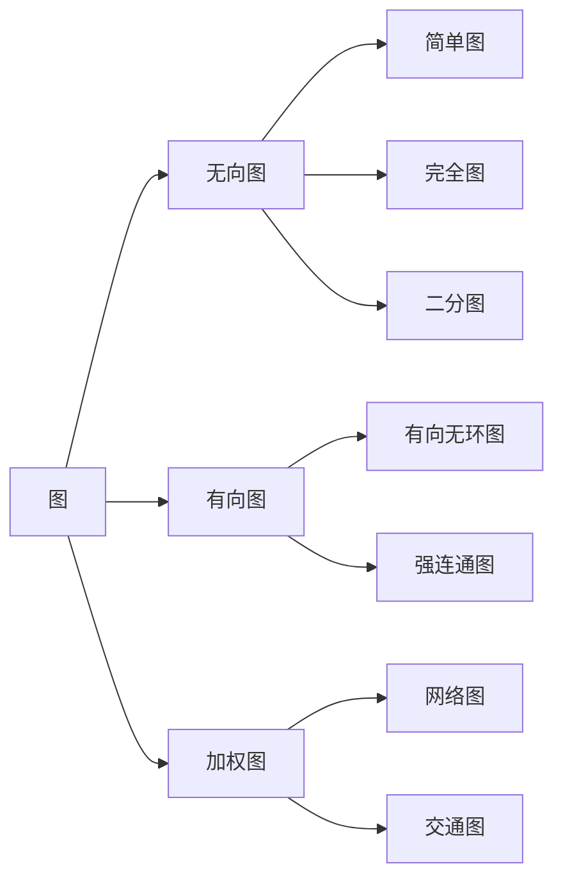
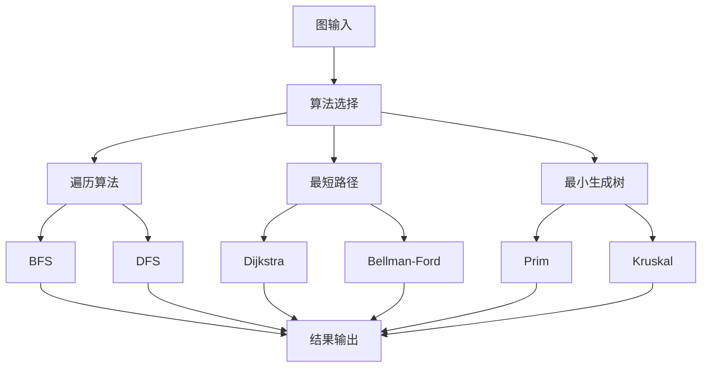

# 01-04-图论基础

## 概述

图论是研究图（Graph）的数学分支，为计算机科学提供了描述和分析网络结构、关系模型和算法设计的基本工具。它是数据结构、算法分析、网络理论和人工智能的重要基础。

## 1. 概念解释

### 1.1 图的基本概念

**图**是由顶点（Vertex）和边（Edge）组成的数学结构，用于表示对象之间的关系。

**核心概念**：

- **顶点（Vertex）**：图中的节点，表示对象
- **边（Edge）**：连接顶点的线，表示关系
- **度（Degree）**：与顶点相连的边的数量
- **路径（Path）**：顶点序列，相邻顶点间有边连接
- **连通性（Connectivity）**：图中顶点间的可达性

### 1.2 图的类型

1. **无向图**：边没有方向
2. **有向图**：边有方向
3. **加权图**：边有权重
4. **多重图**：允许重边
5. **简单图**：无重边无自环
6. **完全图**：任意两顶点间都有边

### 1.3 在计算机科学中的应用

- **网络设计**：计算机网络、社交网络
- **算法设计**：最短路径、最小生成树
- **数据结构**：树、图、网络
- **人工智能**：知识图谱、神经网络
- **数据库**：关系模型、查询优化

## 2. 数学形式

### 2.1 图的数学定义

**无向图**：

```math
G = (V, E)
```

其中：

- $V$ 是顶点集
- $E \subseteq \{\{u, v\} \mid u, v \in V, u \neq v\}$ 是边集

**有向图**：

```math
G = (V, E)
```

其中：

- $V$ 是顶点集
- $E \subseteq V \times V$ 是有向边集

**加权图**：

```math
G = (V, E, w)
```

其中：

- $V$ 是顶点集
- $E$ 是边集
- $w: E \rightarrow \mathbb{R}$ 是权重函数

### 2.2 图的基本性质

**顶点的度**：

```math
\text{deg}(v) = |\{e \in E \mid v \in e\}|
```

**图的度序列**：

```math
d_1 \geq d_2 \geq \cdots \geq d_n
```

**握手定理**：

```math
\sum_{v \in V} \text{deg}(v) = 2|E|
```

**欧拉公式**（平面图）：

```math
|V| - |E| + |F| = 2
```

其中 $F$ 是面数。

### 2.3 路径和连通性

**路径**：

```math
P = (v_0, v_1, \ldots, v_k)
```

其中 $\{v_i, v_{i+1}\} \in E$ 或 $(v_i, v_{i+1}) \in E$。

**路径长度**：

```math
\text{length}(P) = \sum_{i=0}^{k-1} w(\{v_i, v_{i+1}\})
```

**最短路径**：

```math
d(u, v) = \min\{\text{length}(P) \mid P \text{ 是从 } u \text{ 到 } v \text{ 的路径}\}
```

**连通性**：

```math
G \text{ 连通} \iff \forall u, v \in V : \exists \text{ 从 } u \text{ 到 } v \text{ 的路径}
```

### 2.4 特殊图类

**完全图**：

```math
K_n = (V, E) \quad \text{其中} \quad E = \{\{u, v\} \mid u, v \in V, u \neq v\}
```

**二分图**：

```math
G = (V_1 \cup V_2, E) \quad \text{其中} \quad E \subseteq V_1 \times V_2
```

**树**：

```math
T \text{ 是树} \iff T \text{ 连通且无环}
```

**平面图**：

```math
G \text{ 是平面图} \iff G \text{ 可以嵌入平面而不相交}
```

## 3. 代码实现

### 3.1 图的基本实现

```python
from abc import ABC, abstractmethod
from typing import List, Set, Dict, Any, Tuple, Optional, Iterator
from dataclasses import dataclass
from enum import Enum
import heapq
from collections import defaultdict, deque

# 图类型
class GraphType(Enum):
    UNDIRECTED = "undirected"
    DIRECTED = "directed"
    WEIGHTED = "weighted"
    MULTIGRAPH = "multigraph"

# 顶点类
@dataclass
class Vertex:
    """顶点类"""
    id: Any
    data: Dict[str, Any] = None
    
    def __init__(self, id: Any, **kwargs):
        self.id = id
        self.data = kwargs
    
    def __str__(self) -> str:
        return f"Vertex({self.id})"
    
    def __hash__(self) -> int:
        return hash(self.id)
    
    def __eq__(self, other: Any) -> bool:
        if not isinstance(other, Vertex):
            return False
        return self.id == other.id

# 边类
@dataclass
class Edge:
    """边类"""
    source: Vertex
    target: Vertex
    weight: float = 1.0
    data: Dict[str, Any] = None
    
    def __init__(self, source: Vertex, target: Vertex, weight: float = 1.0, **kwargs):
        self.source = source
        self.target = target
        self.weight = weight
        self.data = kwargs
    
    def __str__(self) -> str:
        return f"Edge({self.source.id} -> {self.target.id}, weight={self.weight})"
    
    def __hash__(self) -> int:
        return hash((self.source.id, self.target.id, self.weight))
    
    def __eq__(self, other: Any) -> bool:
        if not isinstance(other, Edge):
            return False
        return (self.source == other.source and 
                self.target == other.target and 
                abs(self.weight - other.weight) < 1e-10)

# 图类
class Graph:
    """图类"""
    
    def __init__(self, graph_type: GraphType = GraphType.UNDIRECTED):
        self.graph_type = graph_type
        self.vertices: Dict[Any, Vertex] = {}
        self.edges: List[Edge] = []
        self.adjacency_list: Dict[Vertex, List[Edge]] = defaultdict(list)
    
    def __str__(self) -> str:
        return f"Graph(type={self.graph_type.value}, vertices={len(self.vertices)}, edges={len(self.edges)})"
    
    def add_vertex(self, vertex_id: Any, **kwargs) -> Vertex:
        """添加顶点"""
        if vertex_id not in self.vertices:
            vertex = Vertex(vertex_id, **kwargs)
            self.vertices[vertex_id] = vertex
        return self.vertices[vertex_id]
    
    def add_edge(self, source_id: Any, target_id: Any, weight: float = 1.0, **kwargs) -> Edge:
        """添加边"""
        source = self.add_vertex(source_id)
        target = self.add_vertex(target_id)
        
        edge = Edge(source, target, weight, **kwargs)
        self.edges.append(edge)
        self.adjacency_list[source].append(edge)
        
        # 如果是无向图，添加反向边
        if self.graph_type == GraphType.UNDIRECTED:
            reverse_edge = Edge(target, source, weight, **kwargs)
            self.adjacency_list[target].append(reverse_edge)
        
        return edge
    
    def remove_vertex(self, vertex_id: Any):
        """移除顶点"""
        if vertex_id in self.vertices:
            vertex = self.vertices[vertex_id]
            
            # 移除相关边
            self.edges = [e for e in self.edges if e.source != vertex and e.target != vertex]
            
            # 更新邻接表
            if vertex in self.adjacency_list:
                del self.adjacency_list[vertex]
            
            # 移除顶点
            del self.vertices[vertex_id]
    
    def remove_edge(self, source_id: Any, target_id: Any):
        """移除边"""
        source = self.vertices.get(source_id)
        target = self.vertices.get(target_id)
        
        if source and target:
            # 移除边
            self.edges = [e for e in self.edges if not (e.source == source and e.target == target)]
            
            # 更新邻接表
            self.adjacency_list[source] = [e for e in self.adjacency_list[source] 
                                         if not (e.source == source and e.target == target)]
            
            if self.graph_type == GraphType.UNDIRECTED:
                self.adjacency_list[target] = [e for e in self.adjacency_list[target] 
                                             if not (e.source == target and e.target == source)]
    
    def get_vertex(self, vertex_id: Any) -> Optional[Vertex]:
        """获取顶点"""
        return self.vertices.get(vertex_id)
    
    def get_edge(self, source_id: Any, target_id: Any) -> Optional[Edge]:
        """获取边"""
        source = self.vertices.get(source_id)
        target = self.vertices.get(target_id)
        
        if source and target:
            for edge in self.adjacency_list[source]:
                if edge.target == target:
                    return edge
        return None
    
    def get_neighbors(self, vertex_id: Any) -> List[Vertex]:
        """获取邻居顶点"""
        vertex = self.vertices.get(vertex_id)
        if vertex:
            return [edge.target for edge in self.adjacency_list[vertex]]
        return []
    
    def get_degree(self, vertex_id: Any) -> int:
        """获取顶点度数"""
        return len(self.get_neighbors(vertex_id))
    
    def is_connected(self) -> bool:
        """判断图是否连通"""
        if not self.vertices:
            return True
        
        # 使用DFS检查连通性
        visited = set()
        start_vertex = next(iter(self.vertices.values()))
        self._dfs(start_vertex, visited)
        
        return len(visited) == len(self.vertices)
    
    def _dfs(self, vertex: Vertex, visited: Set[Vertex]):
        """深度优先搜索"""
        visited.add(vertex)
        for edge in self.adjacency_list[vertex]:
            if edge.target not in visited:
                self._dfs(edge.target, visited)
    
    def get_connected_components(self) -> List[Set[Vertex]]:
        """获取连通分量"""
        visited = set()
        components = []
        
        for vertex in self.vertices.values():
            if vertex not in visited:
                component = set()
                self._dfs(vertex, component)
                components.append(component)
                visited.update(component)
        
        return components

# 图算法类
class GraphAlgorithms:
    """图算法类"""
    
    def __init__(self, graph: Graph):
        self.graph = graph
    
    def breadth_first_search(self, start_id: Any) -> Dict[Any, int]:
        """广度优先搜索"""
        start = self.graph.get_vertex(start_id)
        if not start:
            return {}
        
        distances = {start_id: 0}
        queue = deque([start])
        visited = {start}
        
        while queue:
            current = queue.popleft()
            
            for edge in self.graph.adjacency_list[current]:
                neighbor = edge.target
                if neighbor not in visited:
                    visited.add(neighbor)
                    distances[neighbor.id] = distances[current.id] + 1
                    queue.append(neighbor)
        
        return distances
    
    def depth_first_search(self, start_id: Any) -> List[Any]:
        """深度优先搜索"""
        start = self.graph.get_vertex(start_id)
        if not start:
            return []
        
        visited = set()
        result = []
        
        def dfs_recursive(vertex: Vertex):
            visited.add(vertex)
            result.append(vertex.id)
            
            for edge in self.graph.adjacency_list[vertex]:
                if edge.target not in visited:
                    dfs_recursive(edge.target)
        
        dfs_recursive(start)
        return result
    
    def dijkstra_shortest_path(self, start_id: Any) -> Dict[Any, float]:
        """Dijkstra最短路径算法"""
        start = self.graph.get_vertex(start_id)
        if not start:
            return {}
        
        distances = {vertex_id: float('inf') for vertex_id in self.graph.vertices}
        distances[start_id] = 0
        
        pq = [(0, start)]
        visited = set()
        
        while pq:
            current_dist, current = heapq.heappop(pq)
            
            if current in visited:
                continue
            
            visited.add(current)
            
            for edge in self.graph.adjacency_list[current]:
                neighbor = edge.target
                new_dist = current_dist + edge.weight
                
                if new_dist < distances[neighbor.id]:
                    distances[neighbor.id] = new_dist
                    heapq.heappush(pq, (new_dist, neighbor))
        
        return distances
    
    def bellman_ford_shortest_path(self, start_id: Any) -> Dict[Any, float]:
        """Bellman-Ford最短路径算法"""
        start = self.graph.get_vertex(start_id)
        if not start:
            return {}
        
        distances = {vertex_id: float('inf') for vertex_id in self.graph.vertices}
        distances[start_id] = 0
        
        # 松弛操作
        for _ in range(len(self.graph.vertices) - 1):
            for edge in self.graph.edges:
                if (distances[edge.source.id] != float('inf') and 
                    distances[edge.source.id] + edge.weight < distances[edge.target.id]):
                    distances[edge.target.id] = distances[edge.source.id] + edge.weight
        
        # 检查负环
        for edge in self.graph.edges:
            if (distances[edge.source.id] != float('inf') and 
                distances[edge.source.id] + edge.weight < distances[edge.target.id]):
                raise ValueError("图中存在负环")
        
        return distances
    
    def prim_minimum_spanning_tree(self) -> Graph:
        """Prim最小生成树算法"""
        if not self.graph.vertices:
            return Graph(self.graph.graph_type)
        
        mst = Graph(self.graph.graph_type)
        start_vertex = next(iter(self.graph.vertices.values()))
        mst.add_vertex(start_vertex.id, **start_vertex.data)
        
        edges = []
        for edge in self.graph.adjacency_list[start_vertex]:
            heapq.heappush(edges, (edge.weight, edge))
        
        while edges and len(mst.vertices) < len(self.graph.vertices):
            weight, edge = heapq.heappop(edges)
            
            # 检查是否形成环
            if edge.target.id not in mst.vertices:
                mst.add_vertex(edge.target.id, **edge.target.data)
                mst.add_edge(edge.source.id, edge.target.id, edge.weight, **edge.data)
                
                # 添加新顶点的边
                for new_edge in self.graph.adjacency_list[edge.target]:
                    if new_edge.target.id not in mst.vertices:
                        heapq.heappush(edges, (new_edge.weight, new_edge))
        
        return mst
    
    def kruskal_minimum_spanning_tree(self) -> Graph:
        """Kruskal最小生成树算法"""
        mst = Graph(self.graph.graph_type)
        
        # 添加所有顶点
        for vertex in self.graph.vertices.values():
            mst.add_vertex(vertex.id, **vertex.data)
        
        # 按权重排序边
        sorted_edges = sorted(self.graph.edges, key=lambda e: e.weight)
        
        # 并查集用于检测环
        parent = {vertex_id: vertex_id for vertex_id in self.graph.vertices}
        
        def find(x: Any) -> Any:
            if parent[x] != x:
                parent[x] = find(parent[x])
            return parent[x]
        
        def union(x: Any, y: Any):
            parent[find(x)] = find(y)
        
        # 添加边
        for edge in sorted_edges:
            if find(edge.source.id) != find(edge.target.id):
                mst.add_edge(edge.source.id, edge.target.id, edge.weight, **edge.data)
                union(edge.source.id, edge.target.id)
        
        return mst
    
    def topological_sort(self) -> List[Any]:
        """拓扑排序（仅适用于有向无环图）"""
        if self.graph.graph_type != GraphType.DIRECTED:
            raise ValueError("拓扑排序仅适用于有向图")
        
        # 计算入度
        in_degree = {vertex_id: 0 for vertex_id in self.graph.vertices}
        for edge in self.graph.edges:
            in_degree[edge.target.id] += 1
        
        # Kahn算法
        queue = deque([vertex_id for vertex_id, degree in in_degree.items() if degree == 0])
        result = []
        
        while queue:
            current_id = queue.popleft()
            result.append(current_id)
            
            current = self.graph.get_vertex(current_id)
            for edge in self.graph.adjacency_list[current]:
                neighbor_id = edge.target.id
                in_degree[neighbor_id] -= 1
                if in_degree[neighbor_id] == 0:
                    queue.append(neighbor_id)
        
        if len(result) != len(self.graph.vertices):
            raise ValueError("图中存在环")
        
        return result
    
    def find_cycles(self) -> List[List[Any]]:
        """查找图中的环"""
        visited = set()
        rec_stack = set()
        cycles = []
        
        def dfs_cycle(vertex: Vertex, path: List[Any]):
            visited.add(vertex)
            rec_stack.add(vertex)
            path.append(vertex.id)
            
            for edge in self.graph.adjacency_list[vertex]:
                neighbor = edge.target
                
                if neighbor not in visited:
                    dfs_cycle(neighbor, path)
                elif neighbor in rec_stack:
                    # 找到环
                    cycle_start = path.index(neighbor.id)
                    cycles.append(path[cycle_start:] + [neighbor.id])
            
            rec_stack.remove(vertex)
            path.pop()
        
        for vertex in self.graph.vertices.values():
            if vertex not in visited:
                dfs_cycle(vertex, [])
        
        return cycles

# 图分析器
class GraphAnalyzer:
    """图分析器"""
    
    def __init__(self, graph: Graph):
        self.graph = graph
        self.algorithms = GraphAlgorithms(graph)
    
    def analyze_graph_properties(self) -> Dict[str, Any]:
        """分析图的性质"""
        properties = {
            "type": self.graph.graph_type.value,
            "vertex_count": len(self.graph.vertices),
            "edge_count": len(self.graph.edges),
            "is_connected": self.graph.is_connected(),
            "connected_components": len(self.graph.get_connected_components()),
            "density": self._calculate_density(),
            "average_degree": self._calculate_average_degree(),
            "degree_distribution": self._calculate_degree_distribution()
        }
        
        if self.graph.graph_type == GraphType.UNDIRECTED:
            properties.update({
                "is_tree": self._is_tree(),
                "is_bipartite": self._is_bipartite(),
                "is_planar": self._is_planar()
            })
        
        return properties
    
    def _calculate_density(self) -> float:
        """计算图的密度"""
        n = len(self.graph.vertices)
        if n <= 1:
            return 0.0
        
        max_edges = n * (n - 1) // 2 if self.graph.graph_type == GraphType.UNDIRECTED else n * (n - 1)
        return len(self.graph.edges) / max_edges if max_edges > 0 else 0.0
    
    def _calculate_average_degree(self) -> float:
        """计算平均度数"""
        if not self.graph.vertices:
            return 0.0
        
        total_degree = sum(self.graph.get_degree(vertex_id) for vertex_id in self.graph.vertices)
        return total_degree / len(self.graph.vertices)
    
    def _calculate_degree_distribution(self) -> Dict[int, int]:
        """计算度数分布"""
        distribution = defaultdict(int)
        for vertex_id in self.graph.vertices:
            degree = self.graph.get_degree(vertex_id)
            distribution[degree] += 1
        return dict(distribution)
    
    def _is_tree(self) -> bool:
        """判断是否为树"""
        return (self.graph.is_connected() and 
                len(self.graph.edges) == len(self.graph.vertices) - 1)
    
    def _is_bipartite(self) -> bool:
        """判断是否为二分图"""
        if not self.graph.vertices:
            return True
        
        color = {}
        start_vertex = next(iter(self.graph.vertices.values()))
        
        def dfs_bipartite(vertex: Vertex, current_color: int) -> bool:
            if vertex.id in color:
                return color[vertex.id] == current_color
            
            color[vertex.id] = current_color
            
            for edge in self.graph.adjacency_list[vertex]:
                if not dfs_bipartite(edge.target, 1 - current_color):
                    return False
            
            return True
        
        return dfs_bipartite(start_vertex, 0)
    
    def _is_planar(self) -> bool:
        """判断是否为平面图（简化实现）"""
        # 简化的平面图判定
        n = len(self.graph.vertices)
        m = len(self.graph.edges)
        
        # 欧拉公式的简化检查
        if n >= 3:
            return m <= 3 * n - 6
        return True
    
    def find_shortest_paths(self, start_id: Any) -> Dict[str, Any]:
        """查找最短路径"""
        if self.graph.graph_type == GraphType.WEIGHTED:
            try:
                distances = self.algorithms.bellman_ford_shortest_path(start_id)
            except ValueError:
                distances = self.algorithms.dijkstra_shortest_path(start_id)
        else:
            distances = self.algorithms.breadth_first_search(start_id)
        
        return {
            "start_vertex": start_id,
            "distances": distances,
            "algorithm": "Bellman-Ford" if self.graph.graph_type == GraphType.WEIGHTED else "BFS"
        }
    
    def find_minimum_spanning_tree(self) -> Dict[str, Any]:
        """查找最小生成树"""
        if self.graph.graph_type != GraphType.UNDIRECTED:
            raise ValueError("最小生成树仅适用于无向图")
        
        prim_mst = self.algorithms.prim_minimum_spanning_tree()
        kruskal_mst = self.algorithms.kruskal_minimum_spanning_tree()
        
        return {
            "prim_mst": prim_mst,
            "kruskal_mst": kruskal_mst,
            "prim_weight": sum(edge.weight for edge in prim_mst.edges),
            "kruskal_weight": sum(edge.weight for edge in kruskal_mst.edges)
        }

# 图应用
class GraphApplication:
    """图应用类"""
    
    def __init__(self):
        self.graphs = {}
    
    def create_social_network(self) -> Graph:
        """创建社交网络图"""
        graph = Graph(GraphType.UNDIRECTED)
        
        # 添加用户
        users = ["Alice", "Bob", "Charlie", "Diana", "Eve", "Frank"]
        for user in users:
            graph.add_vertex(user)
        
        # 添加友谊关系
        friendships = [
            ("Alice", "Bob"), ("Alice", "Charlie"), ("Bob", "Charlie"),
            ("Charlie", "Diana"), ("Diana", "Eve"), ("Eve", "Frank"),
            ("Alice", "Diana"), ("Bob", "Eve")
        ]
        
        for friend1, friend2 in friendships:
            graph.add_edge(friend1, friend2)
        
        return graph
    
    def create_road_network(self) -> Graph:
        """创建道路网络图"""
        graph = Graph(GraphType.WEIGHTED)
        
        # 添加城市
        cities = ["A", "B", "C", "D", "E", "F"]
        for city in cities:
            graph.add_vertex(city)
        
        # 添加道路（带距离权重）
        roads = [
            ("A", "B", 4), ("A", "C", 2), ("B", "C", 1),
            ("B", "D", 5), ("C", "D", 8), ("C", "E", 10),
            ("D", "E", 2), ("D", "F", 6), ("E", "F", 3)
        ]
        
        for city1, city2, distance in roads:
            graph.add_edge(city1, city2, distance)
        
        return graph
    
    def create_task_dependency_graph(self) -> Graph:
        """创建任务依赖图"""
        graph = Graph(GraphType.DIRECTED)
        
        # 添加任务
        tasks = ["A", "B", "C", "D", "E", "F", "G"]
        for task in tasks:
            graph.add_vertex(task)
        
        # 添加依赖关系
        dependencies = [
            ("A", "B"), ("A", "C"), ("B", "D"), ("C", "D"),
            ("D", "E"), ("D", "F"), ("E", "G"), ("F", "G")
        ]
        
        for task1, task2 in dependencies:
            graph.add_edge(task1, task2)
        
        return graph
    
    def analyze_network(self, graph: Graph) -> Dict[str, Any]:
        """分析网络"""
        analyzer = GraphAnalyzer(graph)
        
        # 基本性质
        properties = analyzer.analyze_graph_properties()
        
        # 最短路径分析
        if graph.vertices:
            start_vertex = next(iter(graph.vertices.keys()))
            shortest_paths = analyzer.find_shortest_paths(start_vertex)
        else:
            shortest_paths = {}
        
        # 最小生成树分析
        mst_analysis = {}
        if graph.graph_type == GraphType.UNDIRECTED:
            try:
                mst_analysis = analyzer.find_minimum_spanning_tree()
            except ValueError:
                mst_analysis = {"error": "无法计算最小生成树"}
        
        return {
            "properties": properties,
            "shortest_paths": shortest_paths,
            "minimum_spanning_tree": mst_analysis
        }

# 使用示例
def demonstrate_graph_theory():
    """演示图论基础的应用"""
    
    # 创建图应用实例
    graph_app = GraphApplication()
    
    # 示例1: 社交网络分析
    print("=== 社交网络分析 ===")
    social_network = graph_app.create_social_network()
    social_analysis = graph_app.analyze_network(social_network)
    
    print(f"社交网络性质: {social_analysis['properties']}")
    print(f"从Alice到其他用户的最短路径: {social_analysis['shortest_paths']['distances']}")
    
    # 示例2: 道路网络分析
    print("\n=== 道路网络分析 ===")
    road_network = graph_app.create_road_network()
    road_analysis = graph_app.analyze_network(road_network)
    
    print(f"道路网络性质: {road_analysis['properties']}")
    print(f"从A到其他城市的最短距离: {road_analysis['shortest_paths']['distances']}")
    print(f"最小生成树权重: {road_analysis['minimum_spanning_tree']['prim_weight']}")
    
    # 示例3: 任务依赖分析
    print("\n=== 任务依赖分析 ===")
    task_graph = graph_app.create_task_dependency_graph()
    
    algorithms = GraphAlgorithms(task_graph)
    try:
        topological_order = algorithms.topological_sort()
        print(f"拓扑排序结果: {topological_order}")
    except ValueError as e:
        print(f"拓扑排序错误: {e}")
    
    # 示例4: 图算法演示
    print("\n=== 图算法演示 ===")
    
    # BFS演示
    bfs_distances = algorithms.breadth_first_search("A")
    print(f"BFS距离: {bfs_distances}")
    
    # DFS演示
    dfs_order = algorithms.depth_first_search("A")
    print(f"DFS顺序: {dfs_order}")
    
    # 连通分量
    components = task_graph.get_connected_components()
    print(f"连通分量: {[list(comp) for comp in components]}")
    
    # 示例5: 环检测
    print("\n=== 环检测 ===")
    cycles = algorithms.find_cycles()
    if cycles:
        print(f"发现的环: {cycles}")
    else:
        print("图中没有环")

if __name__ == "__main__":
    demonstrate_graph_theory()
```

## 4. 图表说明

### 4.1 图的基本结构

```mermaid
graph TD
    A[图G] --> B[顶点集V]
    A --> C[边集E]
    A --> D[图的性质]
    
    B --> E[顶点v]
    B --> F[度数deg(v)]
    B --> G[邻居N(v)]
    
    C --> H[无向边]
    C --> I[有向边]
    C --> J[加权边]
    
    D --> K[连通性]
    D --> L[平面性]
    D --> M[二分性]
```

### 4.2 图的类型关系



### 4.3 图算法流程



## 5. 实例分析

### 5.1 网络路由中的图论应用

**问题**：分析计算机网络中的路由算法

**图论分析**：

1. **网络建模**：
   - 顶点：网络节点（路由器、主机）
   - 边：网络连接（链路）
   - 权重：链路延迟、带宽、成本

2. **路由算法**：
   - Dijkstra算法：单源最短路径
   - Bellman-Ford算法：处理负权边
   - Floyd-Warshall算法：全源最短路径

3. **网络性质**：
   - 连通性：网络是否完全连通
   - 冗余性：关键路径的备份
   - 负载均衡：流量分布优化

### 5.2 社交网络中的图论应用

**问题**：分析社交网络的结构和性质

**图论分析**：

1. **网络结构**：
   - 顶点：用户
   - 边：友谊关系
   - 权重：关系强度

2. **网络性质**：
   - 小世界效应：平均路径长度短
   - 无标度特性：度数分布遵循幂律
   - 社区结构：紧密连接的子网络

3. **算法应用**：
   - 社区发现：识别紧密连接的群体
   - 影响力分析：识别关键用户
   - 推荐系统：基于图结构推荐

## 6. 理论证明

### 6.1 握手定理的证明

**定理**：在无向图中，所有顶点的度数之和等于边数的两倍

**证明**：

```math
\begin{align}
\sum_{v \in V} \text{deg}(v) &= \sum_{v \in V} |\{e \in E \mid v \in e\}| \\
&= \sum_{e \in E} |\{v \in V \mid v \in e\}| \\
&= \sum_{e \in E} 2 \\
&= 2|E|
\end{align}
```

### 6.2 欧拉公式的证明

**定理**：对于连通平面图，$|V| - |E| + |F| = 2$

**证明**：

1. **基础情况**：树（无环图）
   - $|E| = |V| - 1$
   - $|F| = 1$（外部面）
   - $|V| - |E| + |F| = |V| - (|V| - 1) + 1 = 2$

2. **归纳步骤**：
   - 添加一条边，增加一个面
   - $|V| - (|E| + 1) + (|F| + 1) = |V| - |E| + |F| = 2$

### 6.3 最小生成树的性质证明

**定理**：最小生成树包含权重最小的边

**证明**：

假设最小生成树 $T$ 不包含权重最小的边 $e$，则：

1. 将 $e$ 加入 $T$ 形成环
2. 环中必有一条边 $f$ 不在 $T$ 中
3. 用 $e$ 替换 $f$ 得到更小的生成树
4. 矛盾，因此 $T$ 必须包含 $e$

## 7. 总结

图论为计算机科学提供了：

1. **网络建模**：描述复杂网络结构
2. **算法设计**：提供高效的图算法
3. **关系分析**：分析对象间的关系
4. **优化方法**：解决网络优化问题

图论的核心价值在于：

- **抽象性**：将复杂关系抽象为图结构
- **通用性**：适用于各种网络和关系问题
- **算法性**：提供丰富的图算法工具
- **应用性**：在多个领域有广泛应用

通过掌握图论基础，我们能够：

- **设计网络系统**：基于图论设计高效的网络
- **分析复杂关系**：使用图论分析复杂的关系结构
- **优化算法性能**：利用图算法优化系统性能
- **解决实际问题**：将实际问题建模为图问题

图论不仅是数学理论，更是计算机科学的实用工具，为网络分析、算法设计和系统优化提供了强大的理论基础。

---

**相关链接**：

- [01-01-数学基础](./01-01-数学基础.md)
- [01-02-逻辑学基础](./01-02-逻辑学基础.md)
- [01-03-集合论基础](./01-03-集合论基础.md)
- [02-01-算法理论](../02-理论基础/02-01-算法理论.md)
