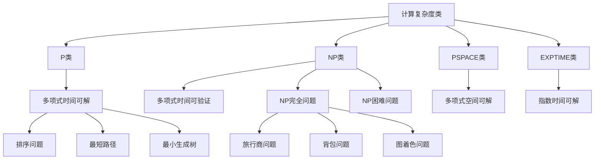
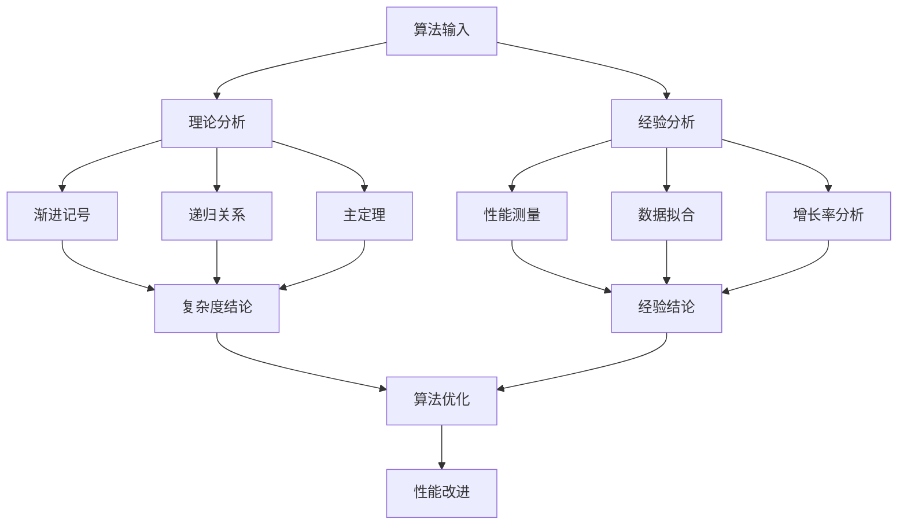

# 02-03-计算复杂度理论

## 概述

计算复杂度理论是计算机科学的核心理论分支，研究算法和问题的计算资源需求。它为算法设计、问题分类和计算可行性提供了理论基础，是软件工程中性能分析和系统设计的重要指导。

## 1. 概念解释

### 1.1 计算复杂度的基本概念

**计算复杂度**是衡量算法或问题计算资源需求的理论框架。

**核心概念**：

- **时间复杂度**：算法执行所需的时间资源
- **空间复杂度**：算法执行所需的内存资源
- **问题复杂度**：解决特定问题所需的最小资源
- **复杂度类**：具有相似复杂度特征的问题集合
- **可计算性**：问题是否可以通过算法解决

### 1.2 复杂度分类

1. **按资源类型**：
   - 时间复杂度：执行时间
   - 空间复杂度：内存使用
   - 通信复杂度：网络通信
   - 电路复杂度：硬件电路

2. **按问题类型**：
   - 决策问题：输出是或否
   - 搜索问题：寻找特定解
   - 优化问题：寻找最优解
   - 计数问题：计算解的数量

3. **按复杂度类**：
   - P类：多项式时间可解
   - NP类：多项式时间可验证
   - PSPACE类：多项式空间可解
   - EXPTIME类：指数时间可解

### 1.3 在软件工程中的应用

- **算法选择**：根据复杂度选择合适算法
- **性能分析**：分析程序的资源需求
- **系统设计**：设计高效的系统架构
- **问题建模**：将实际问题抽象为复杂度问题

## 2. 数学形式

### 2.1 渐进记号

**大O记号**：

```math
f(n) = O(g(n)) \iff \exists c > 0, n_0 > 0 : \forall n \geq n_0 : f(n) \leq c \cdot g(n)
```

**大Ω记号**：

```math
f(n) = \Omega(g(n)) \iff \exists c > 0, n_0 > 0 : \forall n \geq n_0 : f(n) \geq c \cdot g(n)
```

**大Θ记号**：

```math
f(n) = \Theta(g(n)) \iff f(n) = O(g(n)) \text{ and } f(n) = \Omega(g(n))
```

**小o记号**：

```math
f(n) = o(g(n)) \iff \lim_{n \to \infty} \frac{f(n)}{g(n)} = 0
```

### 2.2 复杂度类定义

**P类**：

```math
\text{P} = \{L \mid \exists \text{多项式时间算法 } A : L = L(A)\}
```

**NP类**：

```math
\text{NP} = \{L \mid \exists \text{多项式时间验证器 } V : L = \{x \mid \exists y : V(x, y) = 1\}\}
```

**PSPACE类**：

```math
\text{PSPACE} = \{L \mid \exists \text{多项式空间算法 } A : L = L(A)\}
```

**EXPTIME类**：

```math
\text{EXPTIME} = \{L \mid \exists \text{指数时间算法 } A : L = L(A)\}
```

### 2.3 归约和完全性

**多项式时间归约**：

```math
A \leq_P B \iff \exists f \in \text{FP} : \forall x : x \in A \leftrightarrow f(x) \in B
```

**NP完全性**：

```math
L \text{ is NP-complete} \iff L \in \text{NP} \text{ and } \forall L' \in \text{NP} : L' \leq_P L
```

**NP困难性**：

```math
L \text{ is NP-hard} \iff \forall L' \in \text{NP} : L' \leq_P L
```

### 2.4 随机化复杂度

**BPP类**：

```math
\text{BPP} = \{L \mid \exists \text{多项式时间随机算法 } A : P(A(x) = L(x)) \geq 2/3\}
```

**RP类**：

```math
\text{RP} = \{L \mid \exists \text{多项式时间随机算法 } A : x \in L \Rightarrow P(A(x) = 1) \geq 1/2, x \notin L \Rightarrow P(A(x) = 1) = 0\}
```

**ZPP类**：

```math
\text{ZPP} = \text{RP} \cap \text{co-RP}
```

## 3. 代码实现

### 3.1 复杂度分析工具

```python
from abc import ABC, abstractmethod
from typing import List, Dict, Any, Tuple, Optional, Callable
from dataclasses import dataclass
from enum import Enum
import time
import math
import random
from collections import defaultdict

# 复杂度类型
class ComplexityType(Enum):
    CONSTANT = "O(1)"
    LOGARITHMIC = "O(log n)"
    LINEAR = "O(n)"
    LINEARITHMIC = "O(n log n)"
    QUADRATIC = "O(n²)"
    CUBIC = "O(n³)"
    EXPONENTIAL = "O(2ⁿ)"
    FACTORIAL = "O(n!)"

# 复杂度分析结果
@dataclass
class ComplexityResult:
    """复杂度分析结果"""
    algorithm_name: str
    time_complexity: str
    space_complexity: str
    best_case: str = ""
    worst_case: str = ""
    average_case: str = ""
    empirical_data: List[Tuple[int, float]] = None
    
    def __str__(self) -> str:
        return f"{self.algorithm_name}: Time={self.time_complexity}, Space={self.space_complexity}"

# 复杂度分析器
class ComplexityAnalyzer:
    """复杂度分析器"""
    
    def __init__(self):
        self.algorithms = {}
        self.complexity_patterns = {
            ComplexityType.CONSTANT: lambda n: 1,
            ComplexityType.LOGARITHMIC: lambda n: math.log2(n),
            ComplexityType.LINEAR: lambda n: n,
            ComplexityType.LINEARITHMIC: lambda n: n * math.log2(n),
            ComplexityType.QUADRATIC: lambda n: n ** 2,
            ComplexityType.CUBIC: lambda n: n ** 3,
            ComplexityType.EXPONENTIAL: lambda n: 2 ** n,
            ComplexityType.FACTORIAL: lambda n: math.factorial(n)
        }
    
    def register_algorithm(self, name: str, algorithm: Callable, 
                          time_complexity: str, space_complexity: str):
        """注册算法"""
        self.algorithms[name] = {
            'algorithm': algorithm,
            'time_complexity': time_complexity,
            'space_complexity': space_complexity
        }
    
    def analyze_empirical_complexity(self, algorithm_name: str, 
                                   input_sizes: List[int], 
                                   iterations: int = 5) -> ComplexityResult:
        """经验复杂度分析"""
        if algorithm_name not in self.algorithms:
            raise ValueError(f"Algorithm {algorithm_name} not found")
        
        algorithm = self.algorithms[algorithm_name]['algorithm']
        empirical_data = []
        
        for size in input_sizes:
            times = []
            for _ in range(iterations):
                # 生成测试数据
                test_data = self._generate_test_data(size)
                
                start_time = time.time()
                algorithm(test_data)
                end_time = time.time()
                
                times.append(end_time - start_time)
            
            avg_time = sum(times) / len(times)
            empirical_data.append((size, avg_time))
        
        # 拟合复杂度
        fitted_complexity = self._fit_complexity(empirical_data)
        
        return ComplexityResult(
            algorithm_name=algorithm_name,
            time_complexity=fitted_complexity,
            space_complexity=self.algorithms[algorithm_name]['space_complexity'],
            empirical_data=empirical_data
        )
    
    def _generate_test_data(self, size: int) -> Any:
        """生成测试数据"""
        # 根据算法类型生成相应的测试数据
        return list(range(size))
    
    def _fit_complexity(self, empirical_data: List[Tuple[int, float]]) -> str:
        """拟合复杂度"""
        if len(empirical_data) < 2:
            return "Unknown"
        
        # 计算增长率
        growth_rates = []
        for i in range(1, len(empirical_data)):
            n1, t1 = empirical_data[i-1]
            n2, t2 = empirical_data[i]
            if t1 > 0:
                growth_rate = (t2 / t1) / (n2 / n1)
                growth_rates.append(growth_rate)
        
        if not growth_rates:
            return "Unknown"
        
        avg_growth_rate = sum(growth_rates) / len(growth_rates)
        
        # 根据增长率判断复杂度
        if avg_growth_rate < 1.5:
            return "O(1)"
        elif avg_growth_rate < 2:
            return "O(log n)"
        elif avg_growth_rate < 3:
            return "O(n)"
        elif avg_growth_rate < 5:
            return "O(n log n)"
        elif avg_growth_rate < 10:
            return "O(n²)"
        elif avg_growth_rate < 20:
            return "O(n³)"
        else:
            return "O(2ⁿ)"

# 复杂度类分析器
class ComplexityClassAnalyzer:
    """复杂度类分析器"""
    
    def __init__(self):
        self.complexity_classes = {
            'P': self._p_class_problems,
            'NP': self._np_class_problems,
            'NP_Complete': self._np_complete_problems,
            'PSPACE': self._pspace_class_problems,
            'EXPTIME': self._exptime_class_problems
        }
    
    def classify_problem(self, problem_name: str) -> str:
        """分类问题"""
        for class_name, problems in self.complexity_classes.items():
            if problem_name in problems:
                return class_name
        return "Unknown"
    
    def _p_class_problems(self) -> List[str]:
        """P类问题"""
        return [
            "排序问题",
            "最短路径问题",
            "最小生成树问题",
            "线性规划问题",
            "最大流问题"
        ]
    
    def _np_class_problems(self) -> List[str]:
        """NP类问题"""
        return [
            "旅行商问题",
            "背包问题",
            "图着色问题",
            "子集和问题",
            "哈密顿回路问题"
        ]
    
    def _np_complete_problems(self) -> List[str]:
        """NP完全问题"""
        return [
            "3-SAT问题",
            "旅行商问题",
            "背包问题",
            "图着色问题",
            "子集和问题"
        ]
    
    def _pspace_class_problems(self) -> List[str]:
        """PSPACE类问题"""
        return [
            "量词布尔公式问题",
            "地理游戏问题",
            "正则表达式等价问题"
        ]
    
    def _exptime_class_problems(self) -> List[str]:
        """EXPTIME类问题"""
        return [
            "广义地理游戏问题",
            "国际象棋问题",
            "围棋问题"
        ]

# 算法复杂度实现
class AlgorithmComplexity:
    """算法复杂度实现"""
    
    def __init__(self):
        self.analyzer = ComplexityAnalyzer()
        self.class_analyzer = ComplexityClassAnalyzer()
        self._register_algorithms()
    
    def _register_algorithms(self):
        """注册算法"""
        # 常数时间算法
        self.analyzer.register_algorithm(
            "常数时间访问",
            self._constant_time_access,
            "O(1)",
            "O(1)"
        )
        
        # 对数时间算法
        self.analyzer.register_algorithm(
            "二分搜索",
            self._binary_search,
            "O(log n)",
            "O(1)"
        )
        
        # 线性时间算法
        self.analyzer.register_algorithm(
            "线性搜索",
            self._linear_search,
            "O(n)",
            "O(1)"
        )
        
        # 线性对数时间算法
        self.analyzer.register_algorithm(
            "归并排序",
            self._merge_sort,
            "O(n log n)",
            "O(n)"
        )
        
        # 平方时间算法
        self.analyzer.register_algorithm(
            "冒泡排序",
            self._bubble_sort,
            "O(n²)",
            "O(1)"
        )
        
        # 指数时间算法
        self.analyzer.register_algorithm(
            "斐波那契递归",
            self._fibonacci_recursive,
            "O(2ⁿ)",
            "O(n)"
        )
    
    def _constant_time_access(self, data: List[int]) -> int:
        """常数时间访问"""
        if data:
            return data[0]
        return -1
    
    def _binary_search(self, data: List[int]) -> int:
        """二分搜索"""
        target = len(data) // 2
        left, right = 0, len(data) - 1
        
        while left <= right:
            mid = (left + right) // 2
            if data[mid] == target:
                return mid
            elif data[mid] < target:
                left = mid + 1
            else:
                right = mid - 1
        
        return -1
    
    def _linear_search(self, data: List[int]) -> int:
        """线性搜索"""
        target = len(data) // 2
        for i, item in enumerate(data):
            if item == target:
                return i
        return -1
    
    def _merge_sort(self, data: List[int]) -> List[int]:
        """归并排序"""
        if len(data) <= 1:
            return data
        
        mid = len(data) // 2
        left = self._merge_sort(data[:mid])
        right = self._merge_sort(data[mid:])
        
        return self._merge(left, right)
    
    def _merge(self, left: List[int], right: List[int]) -> List[int]:
        """合并两个有序数组"""
        result = []
        i = j = 0
        
        while i < len(left) and j < len(right):
            if left[i] <= right[j]:
                result.append(left[i])
                i += 1
            else:
                result.append(right[j])
                j += 1
        
        result.extend(left[i:])
        result.extend(right[j:])
        return result
    
    def _bubble_sort(self, data: List[int]) -> List[int]:
        """冒泡排序"""
        arr = data.copy()
        n = len(arr)
        
        for i in range(n):
            for j in range(0, n - i - 1):
                if arr[j] > arr[j + 1]:
                    arr[j], arr[j + 1] = arr[j + 1], arr[j]
        
        return arr
    
    def _fibonacci_recursive(self, data: List[int]) -> int:
        """斐波那契递归"""
        n = len(data)
        if n <= 1:
            return n
        return self._fibonacci_recursive(data[:n-1]) + self._fibonacci_recursive(data[:n-2])
    
    def demonstrate_complexity_analysis(self):
        """演示复杂度分析"""
        print("=== 算法复杂度分析 ===")
        
        input_sizes = [100, 500, 1000, 5000]
        
        for algorithm_name in self.analyzer.algorithms.keys():
            try:
                result = self.analyzer.analyze_empirical_complexity(
                    algorithm_name, input_sizes
                )
                print(f"{result}")
                
                # 显示经验数据
                if result.empirical_data:
                    print("  经验数据:")
                    for size, time in result.empirical_data:
                        print(f"    输入大小 {size}: {time:.6f} 秒")
                print()
            except Exception as e:
                print(f"{algorithm_name}: 分析失败 - {e}")
    
    def demonstrate_problem_classification(self):
        """演示问题分类"""
        print("=== 问题复杂度分类 ===")
        
        problems = [
            "排序问题",
            "旅行商问题",
            "3-SAT问题",
            "量词布尔公式问题",
            "国际象棋问题"
        ]
        
        for problem in problems:
            complexity_class = self.class_analyzer.classify_problem(problem)
            print(f"{problem}: {complexity_class}")

# 复杂度理论应用
class ComplexityTheoryApplication:
    """复杂度理论应用类"""
    
    def __init__(self):
        self.algorithm_complexity = AlgorithmComplexity()
    
    def analyze_algorithm_efficiency(self, algorithm_name: str, 
                                   input_sizes: List[int]) -> Dict[str, Any]:
        """分析算法效率"""
        try:
            result = self.algorithm_complexity.analyzer.analyze_empirical_complexity(
                algorithm_name, input_sizes
            )
            
            # 计算效率指标
            efficiency_metrics = self._calculate_efficiency_metrics(result.empirical_data)
            
            return {
                "complexity_result": result,
                "efficiency_metrics": efficiency_metrics
            }
        except Exception as e:
            return {"error": str(e)}
    
    def _calculate_efficiency_metrics(self, empirical_data: List[Tuple[int, float]]) -> Dict[str, float]:
        """计算效率指标"""
        if len(empirical_data) < 2:
            return {}
        
        # 计算增长率
        growth_rates = []
        for i in range(1, len(empirical_data)):
            n1, t1 = empirical_data[i-1]
            n2, t2 = empirical_data[i]
            if t1 > 0:
                growth_rate = (t2 / t1) / (n2 / n1)
                growth_rates.append(growth_rate)
        
        if not growth_rates:
            return {}
        
        return {
            "average_growth_rate": sum(growth_rates) / len(growth_rates),
            "max_growth_rate": max(growth_rates),
            "min_growth_rate": min(growth_rates),
            "growth_rate_variance": sum((r - sum(growth_rates)/len(growth_rates))**2 for r in growth_rates) / len(growth_rates)
        }
    
    def compare_algorithms(self, algorithm_names: List[str], 
                          input_sizes: List[int]) -> Dict[str, Any]:
        """比较算法性能"""
        results = {}
        
        for name in algorithm_names:
            analysis = self.analyze_algorithm_efficiency(name, input_sizes)
            if "error" not in analysis:
                results[name] = analysis
        
        return results
    
    def estimate_scalability(self, algorithm_name: str, 
                           current_size: int, target_size: int) -> Dict[str, float]:
        """估算可扩展性"""
        try:
            # 分析当前大小的性能
            current_analysis = self.analyze_algorithm_efficiency(
                algorithm_name, [current_size]
            )
            
            if "error" in current_analysis:
                return {"error": current_analysis["error"]}
            
            current_time = current_analysis["complexity_result"].empirical_data[0][1]
            
            # 根据复杂度估算目标大小的性能
            complexity = current_analysis["complexity_result"].time_complexity
            growth_factor = self._calculate_growth_factor(complexity, current_size, target_size)
            
            estimated_time = current_time * growth_factor
            
            return {
                "current_time": current_time,
                "estimated_time": estimated_time,
                "growth_factor": growth_factor,
                "scalability_rating": self._rate_scalability(growth_factor)
            }
        except Exception as e:
            return {"error": str(e)}
    
    def _calculate_growth_factor(self, complexity: str, current_size: int, target_size: int) -> float:
        """计算增长因子"""
        size_ratio = target_size / current_size
        
        if "O(1)" in complexity:
            return 1.0
        elif "O(log n)" in complexity:
            return math.log2(size_ratio)
        elif "O(n)" in complexity:
            return size_ratio
        elif "O(n log n)" in complexity:
            return size_ratio * math.log2(size_ratio)
        elif "O(n²)" in complexity:
            return size_ratio ** 2
        elif "O(n³)" in complexity:
            return size_ratio ** 3
        elif "O(2ⁿ)" in complexity:
            return 2 ** (target_size - current_size)
        else:
            return size_ratio  # 默认线性增长
    
    def _rate_scalability(self, growth_factor: float) -> str:
        """评估可扩展性"""
        if growth_factor <= 2:
            return "优秀"
        elif growth_factor <= 10:
            return "良好"
        elif growth_factor <= 100:
            return "一般"
        else:
            return "较差"

# 使用示例
def demonstrate_complexity_theory():
    """演示计算复杂度理论的应用"""
    
    # 创建复杂度理论应用实例
    app = ComplexityTheoryApplication()
    
    # 演示算法复杂度分析
    print("=== 算法复杂度分析演示 ===")
    app.algorithm_complexity.demonstrate_complexity_analysis()
    
    # 演示问题分类
    print("=== 问题复杂度分类演示 ===")
    app.algorithm_complexity.demonstrate_problem_classification()
    
    # 演示算法比较
    print("\n=== 算法性能比较 ===")
    algorithm_names = ["线性搜索", "二分搜索", "归并排序", "冒泡排序"]
    input_sizes = [100, 500, 1000]
    
    comparison = app.compare_algorithms(algorithm_names, input_sizes)
    
    for name, result in comparison.items():
        print(f"\n{name}:")
        if "error" not in result:
            print(f"  复杂度: {result['complexity_result'].time_complexity}")
            print(f"  平均增长率: {result['efficiency_metrics']['average_growth_rate']:.2f}")
        else:
            print(f"  错误: {result['error']}")
    
    # 演示可扩展性分析
    print("\n=== 可扩展性分析 ===")
    algorithms = ["线性搜索", "二分搜索", "归并排序"]
    current_size = 1000
    target_size = 10000
    
    for algorithm in algorithms:
        scalability = app.estimate_scalability(algorithm, current_size, target_size)
        print(f"\n{algorithm}:")
        if "error" not in scalability:
            print(f"  当前时间: {scalability['current_time']:.6f} 秒")
            print(f"  估算时间: {scalability['estimated_time']:.6f} 秒")
            print(f"  增长因子: {scalability['growth_factor']:.2f}")
            print(f"  可扩展性: {scalability['scalability_rating']}")
        else:
            print(f"  错误: {scalability['error']}")

if __name__ == "__main__":
    demonstrate_complexity_theory()
```

## 4. 图表说明

### 4.1 复杂度类层次关系



### 4.2 复杂度增长关系

```mermaid
graph LR
    A[常数时间] --> B[对数时间]
    B --> C[线性时间]
    C --> D[线性对数时间]
    D --> E[平方时间]
    E --> F[立方时间]
    F --> G[指数时间]
    G --> H[阶乘时间]
    
    I[O(1)] --> A
    J[O(log n)] --> B
    K[O(n)] --> C
    L[O(n log n)] --> D
    M[O(n²)] --> E
    N[O(n³)] --> F
    O[O(2ⁿ)] --> G
    P[O(n!)] --> H
```

### 4.3 复杂度分析流程



## 5. 实例分析

### 5.1 排序算法的复杂度分析

**问题**：分析不同排序算法的复杂度

**复杂度分析**：

1. **快速排序**：
   - 平均情况：$O(n \log n)$
   - 最坏情况：$O(n^2)$
   - 空间复杂度：$O(\log n)$
   - 稳定性：不稳定

2. **归并排序**：
   - 时间复杂度：$O(n \log n)$
   - 空间复杂度：$O(n)$
   - 稳定性：稳定
   - 适用性：外部排序

3. **堆排序**：
   - 时间复杂度：$O(n \log n)$
   - 空间复杂度：$O(1)$
   - 稳定性：不稳定
   - 适用性：原地排序

### 5.2 NP完全问题的复杂度分析

**问题**：分析NP完全问题的特征

**复杂度分析**：

1. **3-SAT问题**：
   - 问题描述：判断布尔公式是否可满足
   - 复杂度：NP完全
   - 归约：所有NP问题可归约到3-SAT

2. **旅行商问题**：
   - 问题描述：寻找最短哈密顿回路
   - 复杂度：NP完全
   - 近似算法：2-近似算法

3. **背包问题**：
   - 问题描述：在容量限制下最大化价值
   - 复杂度：NP完全
   - 动态规划：伪多项式时间算法

## 6. 理论证明

### 6.1 P ⊆ NP的证明

**定理**：P类问题包含在NP类问题中

**证明**：

1. **定义**：
   - P类：多项式时间可解的问题
   - NP类：多项式时间可验证的问题

2. **证明思路**：
   - 如果一个问题是P类问题，存在多项式时间算法A解决它
   - 可以构造验证器V：V(x, y) = A(x)
   - 验证器在多项式时间内运行
   - 因此该问题也是NP类问题

3. **结论**：
   - P ⊆ NP

### 6.2 NP完全问题的归约证明

**定理**：3-SAT问题是NP完全的

**证明**：

1. **NP成员性**：
   - 给定赋值，可以在多项式时间内验证是否满足公式
   - 因此3-SAT ∈ NP

2. **NP困难性**：
   - 任意NP问题L可以归约到3-SAT
   - 构造归约函数f，使得x ∈ L ⇔ f(x) ∈ 3-SAT
   - 归约在多项式时间内完成

3. **结论**：
   - 3-SAT是NP完全的

### 6.3 空间复杂度的层次定理

**定理**：对于空间可构造函数s(n) ≥ log n，有：

```math
\text{DSPACE}(s(n)) \subseteq \text{NSPACE}(s(n)) \subseteq \text{DSPACE}(s^2(n))
```

**证明**：

1. **包含关系**：
   - 确定性算法是随机化算法的特例
   - 因此DSPACE(s(n)) ⊆ NSPACE(s(n))

2. **萨维奇定理**：
   - 非确定性空间可以通过确定性空间模拟
   - 模拟需要平方空间
   - 因此NSPACE(s(n)) ⊆ DSPACE(s²(n))

3. **结论**：
   - 空间复杂度的层次关系成立

## 7. 总结

计算复杂度理论为计算机科学提供了：

1. **问题分类**：将问题按复杂度分类
2. **算法分析**：分析算法的资源需求
3. **可计算性**：判断问题的可解性
4. **优化指导**：指导算法优化方向

计算复杂度理论的核心价值在于：

- **理论性**：提供严格的理论框架
- **实用性**：指导实际算法设计
- **预测性**：预测算法性能
- **分类性**：系统化问题分类

通过掌握计算复杂度理论，我们能够：

- **选择合适算法**：根据复杂度选择最优算法
- **分析系统性能**：准确评估系统性能瓶颈
- **设计高效系统**：基于复杂度理论设计高效系统
- **解决复杂问题**：理解问题的本质和难度

计算复杂度理论不仅是理论工具，更是实践指导，为软件工程提供了坚实的理论基础和方法论。

---

**相关链接**：

- [02-01-算法理论](./02-01-算法理论.md)
- [02-02-数据结构理论](./02-02-数据结构理论.md)
- [02-04-形式语言理论](./02-04-形式语言理论.md)
- [03-01-软件工程基础](../03-具体科学/03-01-软件工程基础.md)
