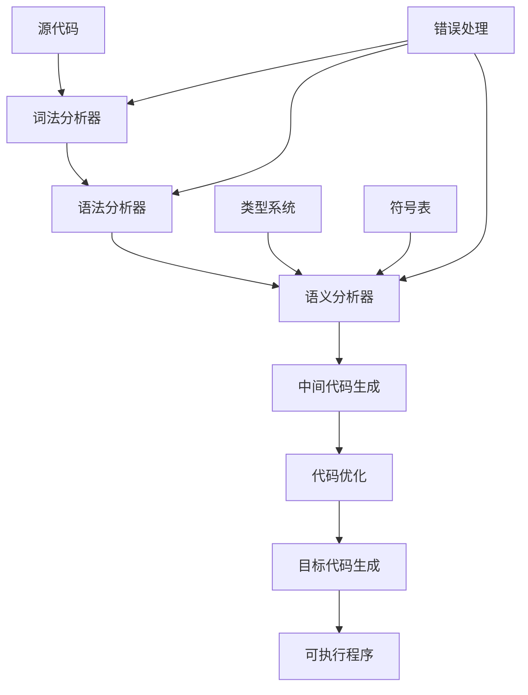
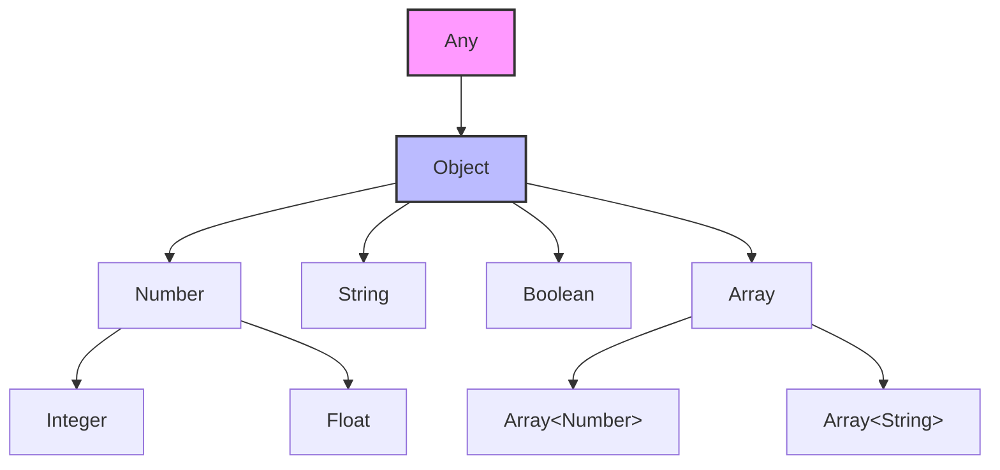
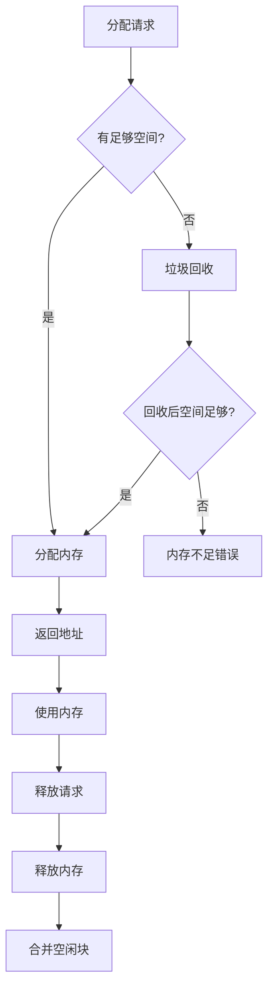

# 03-01-编程语言科学

## 📋 概述

编程语言科学是计算机科学的核心分支，研究编程语言的设计、实现、分析和应用。它结合了形式语言理论、类型理论、编译原理和语言运行时系统等多个领域的知识。

**相关文档**:

- [01-04-图论基础](../01-形式科学/01-04-图论基础.md) - 语法树和依赖图
- [02-04-形式语言理论](../02-理论基础/02-04-形式语言理论.md) - 形式语言基础
- [03-02-软件架构科学](./03-02-软件架构科学.md) - 语言运行时架构

## 🎯 核心概念

### 1. 编程语言的定义

编程语言是一种用于编写计算机程序的形式化语言，具有以下特征：

- **语法**: 定义程序的结构和形式
- **语义**: 定义程序的含义和执行结果
- **类型系统**: 定义数据类型和类型检查规则
- **运行时系统**: 提供程序执行环境

### 2. 语言分类

根据不同的特征，编程语言可以分为：

- **按范式分类**: 命令式、函数式、面向对象、逻辑式
- **按类型系统分类**: 静态类型、动态类型、强类型、弱类型
- **按执行方式分类**: 编译型、解释型、混合型

## 🔢 数学形式化

### 1. 形式语法定义

编程语言的语法可以用上下文无关文法（CFG）定义：

$$G = (V, \Sigma, P, S)$$

其中：

- $V$ 是非终结符集合
- $\Sigma$ 是终结符集合
- $P$ 是产生式规则集合
- $S$ 是开始符号

### 2. 类型系统形式化

类型系统可以形式化为三元组：

$$T = (T, \sqsubseteq, \vdash)$$

其中：

- $T$ 是类型集合
- $\sqsubseteq$ 是子类型关系
- $\vdash$ 是类型推导关系

### 3. 语义定义

操作语义可以用小步语义定义：

$$\frac{e_1 \rightarrow e_1'}{e_1 \oplus e_2 \rightarrow e_1' \oplus e_2}$$

表示表达式 $e_1$ 在一步求值后变为 $e_1'$。

## 💻 Python 实现

### 1. 基础语言模型

```python
from abc import ABC, abstractmethod
from typing import Any, Dict, List, Optional, Set, Union
from enum import Enum
from dataclasses import dataclass
import re

class LanguageParadigm(Enum):
    """编程范式枚举"""
    IMPERATIVE = "imperative"
    FUNCTIONAL = "functional"
    OBJECT_ORIENTED = "object_oriented"
    LOGIC = "logic"
    CONCURRENT = "concurrent"

@dataclass
class Token:
    """词法单元"""
    type: str
    value: str
    line: int
    column: int

class ASTNode(ABC):
    """抽象语法树节点"""
    
    @abstractmethod
    def evaluate(self, environment: Dict[str, Any]) -> Any:
        """求值方法"""
        pass

class Expression(ASTNode):
    """表达式基类"""
    pass

class Statement(ASTNode):
    """语句基类"""
    pass

class ProgrammingLanguage:
    """编程语言的基本定义"""
    
    def __init__(self, name: str, paradigm: LanguageParadigm):
        self.name = name
        self.paradigm = paradigm
        self.features: Dict[str, Any] = {}
        self.syntax_rules: List[str] = []
        self.semantic_rules: List[str] = []
    
    def add_feature(self, feature: str, implementation: Any):
        """添加语言特性"""
        self.features[feature] = implementation
    
    def has_feature(self, feature: str) -> bool:
        """检查是否支持某个特性"""
        return feature in self.features
    
    def validate_syntax(self, code: str) -> bool:
        """语法验证"""
        # 简化实现
        return True
    
    def validate_semantics(self, ast: ASTNode) -> bool:
        """语义验证"""
        # 简化实现
        return True
```

### 2. 词法分析器

```python
class Lexer:
    """词法分析器"""
    
    def __init__(self):
        self.tokens: List[Token] = []
        self.keywords = {
            'if', 'else', 'while', 'for', 'def', 'class',
            'return', 'import', 'from', 'as', 'in', 'is'
        }
        self.operators = {
            '+', '-', '*', '/', '=', '==', '!=', '<', '>', '<=', '>=',
            'and', 'or', 'not', '&', '|', '^', '<<', '>>'
        }
    
    def tokenize(self, source_code: str) -> List[Token]:
        """词法分析"""
        self.tokens = []
        lines = source_code.split('\n')
        
        for line_num, line in enumerate(lines, 1):
            column = 0
            while column < len(line):
                char = line[column]
                
                if char.isspace():
                    column += 1
                    continue
                
                if char.isalpha() or char == '_':
                    # 标识符或关键字
                    token = self._read_identifier(line, line_num, column)
                    self.tokens.append(token)
                    column += len(token.value)
                
                elif char.isdigit():
                    # 数字
                    token = self._read_number(line, line_num, column)
                    self.tokens.append(token)
                    column += len(token.value)
                
                elif char in '"\'':
                    # 字符串
                    token = self._read_string(line, line_num, column)
                    self.tokens.append(token)
                    column += len(token.value)
                
                else:
                    # 操作符或分隔符
                    token = self._read_operator(line, line_num, column)
                    self.tokens.append(token)
                    column += len(token.value)
        
        return self.tokens
    
    def _read_identifier(self, line: str, line_num: int, start: int) -> Token:
        """读取标识符"""
        end = start
        while end < len(line) and (line[end].isalnum() or line[end] == '_'):
            end += 1
        
        value = line[start:end]
        token_type = 'KEYWORD' if value in self.keywords else 'IDENTIFIER'
        
        return Token(token_type, value, line_num, start + 1)
    
    def _read_number(self, line: str, line_num: int, start: int) -> Token:
        """读取数字"""
        end = start
        while end < len(line) and (line[end].isdigit() or line[end] == '.'):
            end += 1
        
        value = line[start:end]
        return Token('NUMBER', value, line_num, start + 1)
    
    def _read_string(self, line: str, line_num: int, start: int) -> Token:
        """读取字符串"""
        quote = line[start]
        end = start + 1
        
        while end < len(line) and line[end] != quote:
            if line[end] == '\\':
                end += 2  # 跳过转义字符
            else:
                end += 1
        
        if end < len(line):
            end += 1  # 包含结束引号
        
        value = line[start:end]
        return Token('STRING', value, line_num, start + 1)
    
    def _read_operator(self, line: str, line_num: int, start: int) -> Token:
        """读取操作符"""
        # 尝试读取多字符操作符
        for length in range(3, 0, -1):
            if start + length <= len(line):
                candidate = line[start:start + length]
                if candidate in self.operators:
                    return Token('OPERATOR', candidate, line_num, start + 1)
        
        # 单字符操作符
        return Token('OPERATOR', line[start], line_num, start + 1)
```

### 3. 语法分析器

```python
class Parser:
    """语法分析器"""
    
    def __init__(self, tokens: List[Token]):
        self.tokens = tokens
        self.current = 0
    
    def parse(self) -> ASTNode:
        """解析程序"""
        statements = []
        
        while not self.is_at_end():
            stmt = self.parse_statement()
            if stmt:
                statements.append(stmt)
        
        return Program(statements)
    
    def parse_statement(self) -> Optional[Statement]:
        """解析语句"""
        if self.match('IDENTIFIER'):
            return self.parse_assignment()
        elif self.match('KEYWORD', 'if'):
            return self.parse_if_statement()
        elif self.match('KEYWORD', 'while'):
            return self.parse_while_statement()
        elif self.match('KEYWORD', 'def'):
            return self.parse_function_definition()
        
        return None
    
    def parse_expression(self) -> Expression:
        """解析表达式"""
        return self.parse_logical_or()
    
    def parse_logical_or(self) -> Expression:
        """解析逻辑或表达式"""
        expr = self.parse_logical_and()
        
        while self.match('OPERATOR', 'or'):
            operator = self.previous()
            right = self.parse_logical_and()
            expr = BinaryExpression(expr, operator, right)
        
        return expr
    
    def parse_logical_and(self) -> Expression:
        """解析逻辑与表达式"""
        expr = self.parse_equality()
        
        while self.match('OPERATOR', 'and'):
            operator = self.previous()
            right = self.parse_equality()
            expr = BinaryExpression(expr, operator, right)
        
        return expr
    
    def parse_equality(self) -> Expression:
        """解析相等性表达式"""
        expr = self.parse_comparison()
        
        while self.match('OPERATOR', '==', '!='):
            operator = self.previous()
            right = self.parse_comparison()
            expr = BinaryExpression(expr, operator, right)
        
        return expr
    
    def parse_comparison(self) -> Expression:
        """解析比较表达式"""
        expr = self.parse_term()
        
        while self.match('OPERATOR', '<', '>', '<=', '>='):
            operator = self.previous()
            right = self.parse_term()
            expr = BinaryExpression(expr, operator, right)
        
        return expr
    
    def parse_term(self) -> Expression:
        """解析项表达式"""
        expr = self.parse_factor()
        
        while self.match('OPERATOR', '+', '-'):
            operator = self.previous()
            right = self.parse_factor()
            expr = BinaryExpression(expr, operator, right)
        
        return expr
    
    def parse_factor(self) -> Expression:
        """解析因子表达式"""
        expr = self.parse_primary()
        
        while self.match('OPERATOR', '*', '/'):
            operator = self.previous()
            right = self.parse_primary()
            expr = BinaryExpression(expr, operator, right)
        
        return expr
    
    def parse_primary(self) -> Expression:
        """解析基本表达式"""
        if self.match('NUMBER'):
            return LiteralExpression(float(self.previous().value))
        
        if self.match('STRING'):
            return LiteralExpression(self.previous().value[1:-1])
        
        if self.match('IDENTIFIER'):
            return VariableExpression(self.previous().value)
        
        if self.match('OPERATOR', '('):
            expr = self.parse_expression()
            self.consume('OPERATOR', ')', "Expect ')' after expression.")
            return GroupingExpression(expr)
        
        raise self.error(self.peek(), "Expect expression.")
    
    def match(self, *types: str) -> bool:
        """匹配当前token"""
        for token_type in types:
            if self.check(token_type):
                self.advance()
                return True
        return False
    
    def check(self, token_type: str) -> bool:
        """检查当前token类型"""
        if self.is_at_end():
            return False
        return self.peek().type == token_type
    
    def advance(self) -> Token:
        """前进到下一个token"""
        if not self.is_at_end():
            self.current += 1
        return self.previous()
    
    def is_at_end(self) -> bool:
        """检查是否到达末尾"""
        return self.peek().type == 'EOF'
    
    def peek(self) -> Token:
        """查看当前token"""
        return self.tokens[self.current]
    
    def previous(self) -> Token:
        """获取前一个token"""
        return self.tokens[self.current - 1]
    
    def consume(self, token_type: str, value: str, message: str) -> Token:
        """消费指定token"""
        if self.check(token_type) and self.peek().value == value:
            return self.advance()
        
        raise self.error(self.peek(), message)
    
    def error(self, token: Token, message: str) -> Exception:
        """创建错误"""
        return Exception(f"Error at {token.value}: {message}")
```

### 4. 类型系统

```python
class TypeSystem:
    """类型系统"""
    
    def __init__(self):
        self.types: Dict[str, Set[str]] = {}
        self.subtype_relation: Dict[str, Set[str]] = {}
        self.type_environment: Dict[str, str] = {}
    
    def define_type(self, name: str, values: Set[str]):
        """定义类型"""
        self.types[name] = values
        self.subtype_relation[name] = set()
    
    def define_subtype(self, subtype: str, supertype: str):
        """定义子类型关系"""
        if subtype in self.subtype_relation:
            self.subtype_relation[subtype].add(supertype)
    
    def is_subtype(self, subtype: str, supertype: str) -> bool:
        """检查子类型关系"""
        if subtype == supertype:
            return True
        
        if subtype in self.subtype_relation:
            return supertype in self.subtype_relation[subtype]
        
        return False
    
    def type_check(self, expression: Expression) -> str:
        """类型检查"""
        if isinstance(expression, LiteralExpression):
            if isinstance(expression.value, (int, float)):
                return 'number'
            elif isinstance(expression.value, str):
                return 'string'
            elif isinstance(expression.value, bool):
                return 'boolean'
        
        elif isinstance(expression, VariableExpression):
            return self.type_environment.get(expression.name, 'unknown')
        
        elif isinstance(expression, BinaryExpression):
            left_type = self.type_check(expression.left)
            right_type = self.type_check(expression.right)
            
            # 类型兼容性检查
            if self.is_compatible(left_type, right_type, expression.operator):
                return self.result_type(left_type, right_type, expression.operator)
            else:
                raise TypeError(f"Type mismatch: {left_type} {expression.operator} {right_type}")
        
        return 'unknown'
    
    def is_compatible(self, left_type: str, right_type: str, operator: Token) -> bool:
        """检查类型兼容性"""
        if operator.value in ['+', '-', '*', '/']:
            return left_type == 'number' and right_type == 'number'
        elif operator.value in ['==', '!=', '<', '>', '<=', '>=']:
            return left_type == right_type
        elif operator.value in ['and', 'or']:
            return left_type == 'boolean' and right_type == 'boolean'
        
        return False
    
    def result_type(self, left_type: str, right_type: str, operator: Token) -> str:
        """计算结果类型"""
        if operator.value in ['+', '-', '*', '/']:
            return 'number'
        elif operator.value in ['==', '!=', '<', '>', '<=', '>=']:
            return 'boolean'
        elif operator.value in ['and', 'or']:
            return 'boolean'
        
        return 'unknown'
```

### 5. 解释器

```python
class Interpreter:
    """解释器"""
    
    def __init__(self):
        self.environment = Environment()
        self.globals = self.environment
        self.locals: Dict[Expression, int] = {}
    
    def interpret(self, statements: List[Statement]):
        """解释执行"""
        try:
            for statement in statements:
                self.execute(statement)
        except RuntimeError as error:
            print(f"Runtime error: {error}")
    
    def execute(self, statement: Statement):
        """执行语句"""
        if isinstance(statement, ExpressionStatement):
            self.evaluate(statement.expression)
        elif isinstance(statement, PrintStatement):
            value = self.evaluate(statement.expression)
            print(self.stringify(value))
        elif isinstance(statement, VariableStatement):
            value = None
            if statement.initializer:
                value = self.evaluate(statement.initializer)
            
            self.environment.define(statement.name.lexeme, value)
        elif isinstance(statement, BlockStatement):
            self.execute_block(statement.statements, Environment(self.environment))
        elif isinstance(statement, IfStatement):
            if self.is_truthy(self.evaluate(statement.condition)):
                self.execute(statement.then_branch)
            elif statement.else_branch:
                self.execute(statement.else_branch)
        elif isinstance(statement, WhileStatement):
            while self.is_truthy(self.evaluate(statement.condition)):
                self.execute(statement.body)
        elif isinstance(statement, FunctionStatement):
            function = Function(statement, self.environment)
            self.environment.define(statement.name.lexeme, function)
    
    def evaluate(self, expression: Expression) -> Any:
        """求值表达式"""
        if isinstance(expression, LiteralExpression):
            return expression.value
        elif isinstance(expression, GroupingExpression):
            return self.evaluate(expression.expression)
        elif isinstance(expression, UnaryExpression):
            right = self.evaluate(expression.right)
            
            if expression.operator.type == 'OPERATOR':
                if expression.operator.lexeme == '-':
                    self.check_number_operand(expression.operator, right)
                    return -float(right)
                elif expression.operator.lexeme == '!':
                    return not self.is_truthy(right)
            
            return None
        elif isinstance(expression, BinaryExpression):
            left = self.evaluate(expression.left)
            right = self.evaluate(expression.right)
            
            if expression.operator.type == 'OPERATOR':
                if expression.operator.lexeme == '-':
                    self.check_number_operands(expression.operator, left, right)
                    return float(left) - float(right)
                elif expression.operator.lexeme == '/':
                    self.check_number_operands(expression.operator, left, right)
                    return float(left) / float(right)
                elif expression.operator.lexeme == '*':
                    self.check_number_operands(expression.operator, left, right)
                    return float(left) * float(right)
                elif expression.operator.lexeme == '+':
                    if isinstance(left, (int, float)) and isinstance(right, (int, float)):
                        return float(left) + float(right)
                    if isinstance(left, str) and isinstance(right, str):
                        return str(left) + str(right)
                    raise RuntimeError("Operands must be two numbers or two strings.")
                elif expression.operator.lexeme == '>':
                    self.check_number_operands(expression.operator, left, right)
                    return float(left) > float(right)
                elif expression.operator.lexeme == '>=':
                    self.check_number_operands(expression.operator, left, right)
                    return float(left) >= float(right)
                elif expression.operator.lexeme == '<':
                    self.check_number_operands(expression.operator, left, right)
                    return float(left) < float(right)
                elif expression.operator.lexeme == '<=':
                    self.check_number_operands(expression.operator, left, right)
                    return float(left) <= float(right)
                elif expression.operator.lexeme == '!=':
                    return not self.is_equal(left, right)
                elif expression.operator.lexeme == '==':
                    return self.is_equal(left, right)
            
            return None
        elif isinstance(expression, VariableExpression):
            return self.lookup_variable(expression.name, expression)
        elif isinstance(expression, AssignExpression):
            value = self.evaluate(expression.value)
            
            distance = self.locals.get(expression)
            if distance is not None:
                self.environment.assign_at(distance, expression.name, value)
            else:
                self.globals.assign(expression.name, value)
            
            return value
        
        return None
    
    def execute_block(self, statements: List[Statement], environment: 'Environment'):
        """执行代码块"""
        previous = self.environment
        try:
            self.environment = environment
            for statement in statements:
                self.execute(statement)
        finally:
            self.environment = previous
    
    def resolve(self, expression: Expression, depth: int):
        """解析变量"""
        self.locals[expression] = depth
    
    def lookup_variable(self, name: Token, expression: Expression) -> Any:
        """查找变量"""
        distance = self.locals.get(expression)
        if distance is not None:
            return self.environment.get_at(distance, name.lexeme)
        else:
            return self.globals.get(name)
    
    def check_number_operand(self, operator: Token, operand: Any):
        """检查数字操作数"""
        if not isinstance(operand, (int, float)):
            raise RuntimeError(f"Operand must be a number. Got {type(operand)}")
    
    def check_number_operands(self, operator: Token, left: Any, right: Any):
        """检查数字操作数"""
        if not isinstance(left, (int, float)) or not isinstance(right, (int, float)):
            raise RuntimeError("Operands must be numbers.")
    
    def is_truthy(self, object: Any) -> bool:
        """检查真值"""
        if object is None:
            return False
        if isinstance(object, bool):
            return object
        return True
    
    def is_equal(self, a: Any, b: Any) -> bool:
        """检查相等性"""
        if a is None and b is None:
            return True
        if a is None:
            return False
        return a == b
    
    def stringify(self, object: Any) -> str:
        """转换为字符串"""
        if object is None:
            return "nil"
        if isinstance(object, float):
            text = str(object)
            if text.endswith('.0'):
                text = text[:-2]
            return text
        return str(object)
```

### 6. 内存管理系统

```python
class MemoryManager:
    """内存管理器"""
    
    def __init__(self, heap_size: int = 1024 * 1024):
        self.heap_size = heap_size
        self.heap = bytearray(heap_size)
        self.allocated_blocks: Dict[int, int] = {}  # address -> size
        self.free_blocks: Set[int] = {0}  # 空闲块起始地址
        self.next_address = 0
        self.gc_threshold = heap_size // 2
    
    def allocate(self, size: int) -> int:
        """分配内存"""
        if size <= 0:
            raise ValueError("Allocation size must be positive")
        
        # 查找合适的空闲块
        best_fit = None
        best_size = float('inf')
        
        for free_start in self.free_blocks:
            free_size = self._get_free_block_size(free_start)
            if free_size >= size and free_size < best_size:
                best_fit = free_start
                best_size = free_size
        
        if best_fit is None:
            # 触发垃圾回收
            self.garbage_collect()
            
            # 再次尝试分配
            for free_start in self.free_blocks:
                free_size = self._get_free_block_size(free_start)
                if free_size >= size:
                    best_fit = free_start
                    break
        
        if best_fit is None:
            raise MemoryError("Out of memory")
        
        # 分配内存
        self.allocated_blocks[best_fit] = size
        self.free_blocks.remove(best_fit)
        
        # 如果剩余空间足够，创建新的空闲块
        remaining_size = self._get_free_block_size(best_fit) - size
        if remaining_size > 0:
            new_free_start = best_fit + size
            self.free_blocks.add(new_free_start)
        
        return best_fit
    
    def deallocate(self, address: int):
        """释放内存"""
        if address not in self.allocated_blocks:
            raise ValueError(f"Invalid address: {address}")
        
        size = self.allocated_blocks[address]
        del self.allocated_blocks[address]
        
        # 合并相邻的空闲块
        self._merge_free_blocks(address, size)
    
    def _merge_free_blocks(self, start: int, size: int):
        """合并相邻的空闲块"""
        end = start + size
        
        # 查找相邻的空闲块
        left_neighbor = None
        right_neighbor = None
        
        for free_start in self.free_blocks:
            free_end = free_start + self._get_free_block_size(free_start)
            
            if free_end == start:
                left_neighbor = free_start
            elif end == free_start:
                right_neighbor = free_start
        
        # 合并空闲块
        if left_neighbor is not None:
            self.free_blocks.remove(left_neighbor)
            start = left_neighbor
        
        if right_neighbor is not None:
            self.free_blocks.remove(right_neighbor)
            size += self._get_free_block_size(right_neighbor)
        
        self.free_blocks.add(start)
    
    def _get_free_block_size(self, start: int) -> int:
        """获取空闲块大小"""
        # 简化实现：查找下一个已分配块
        size = 0
        while start + size < self.heap_size:
            if start + size in self.allocated_blocks:
                break
            size += 1
        return size
    
    def garbage_collect(self):
        """垃圾回收"""
        # 标记阶段
        marked = set()
        roots = self._get_roots()
        
        for root in roots:
            self._mark_reachable(root, marked)
        
        # 清除阶段
        unreachable = set(self.allocated_blocks.keys()) - marked
        for address in unreachable:
            self.deallocate(address)
    
    def _get_roots(self) -> Set[int]:
        """获取根对象"""
        # 简化实现：返回所有已分配块的地址
        return set(self.allocated_blocks.keys())
    
    def _mark_reachable(self, address: int, marked: Set[int]):
        """标记可达对象"""
        if address in marked:
            return
        
        marked.add(address)
        
        # 遍历对象引用的其他对象
        # 这里简化实现，实际需要根据对象类型来遍历引用
        size = self.allocated_blocks[address]
        for i in range(address, address + size, 4):  # 假设指针大小为4字节
            if i + 4 <= address + size:
                ptr_value = int.from_bytes(self.heap[i:i+4], 'little')
                if ptr_value in self.allocated_blocks:
                    self._mark_reachable(ptr_value, marked)
    
    def get_memory_stats(self) -> Dict[str, int]:
        """获取内存统计信息"""
        total_allocated = sum(self.allocated_blocks.values())
        total_free = self.heap_size - total_allocated
        fragmentation = len(self.free_blocks)
        
        return {
            'total_heap': self.heap_size,
            'total_allocated': total_allocated,
            'total_free': total_free,
            'fragmentation': fragmentation,
            'allocation_count': len(self.allocated_blocks)
        }
```

## 📊 图表说明

### 1. 编程语言架构图



### 2. 类型系统层次结构



### 3. 内存管理流程图



## 📝 案例分析

### 案例1: 简单表达式求值

```python
def test_expression_evaluation():
    """测试表达式求值"""
    # 创建解释器
    interpreter = Interpreter()
    
    # 测试算术表达式
    expressions = [
        "2 + 3 * 4",      # 应该等于 14
        "(2 + 3) * 4",    # 应该等于 20
        "10 / 2 + 3",     # 应该等于 8
        "5 - 3 + 2"       # 应该等于 4
    ]
    
    for expr in expressions:
        # 词法分析
        lexer = Lexer()
        tokens = lexer.tokenize(expr)
        
        # 语法分析
        parser = Parser(tokens)
        ast = parser.parse_expression()
        
        # 求值
        result = interpreter.evaluate(ast)
        print(f"{expr} = {result}")

# 运行测试
test_expression_evaluation()
```

### 案例2: 类型系统验证

```python
def test_type_system():
    """测试类型系统"""
    # 创建类型系统
    type_system = TypeSystem()
    
    # 定义基本类型
    type_system.define_type('number', {'int', 'float'})
    type_system.define_type('string', {'str'})
    type_system.define_type('boolean', {'bool'})
    
    # 定义子类型关系
    type_system.define_subtype('int', 'number')
    type_system.define_subtype('float', 'number')
    
    # 测试类型检查
    test_cases = [
        (LiteralExpression(42), 'number'),
        (LiteralExpression("hello"), 'string'),
        (LiteralExpression(True), 'boolean'),
        (BinaryExpression(
            LiteralExpression(10),
            Token('OPERATOR', '+', 1, 1),
            LiteralExpression(20)
        ), 'number')
    ]
    
    for expression, expected_type in test_cases:
        actual_type = type_system.type_check(expression)
        print(f"Expression: {expression}, Expected: {expected_type}, Actual: {actual_type}")

# 运行测试
test_type_system()
```

### 案例3: 内存管理测试

```python
def test_memory_management():
    """测试内存管理"""
    # 创建内存管理器
    memory_manager = MemoryManager(1024)  # 1KB 堆
    
    # 分配内存
    addresses = []
    for i in range(5):
        addr = memory_manager.allocate(64)  # 分配64字节
        addresses.append(addr)
        print(f"Allocated 64 bytes at address {addr}")
    
    # 查看内存统计
    stats = memory_manager.get_memory_stats()
    print(f"Memory stats: {stats}")
    
    # 释放部分内存
    memory_manager.deallocate(addresses[1])
    memory_manager.deallocate(addresses[3])
    print("Deallocated addresses 1 and 3")
    
    # 再次查看统计
    stats = memory_manager.get_memory_stats()
    print(f"Memory stats after deallocation: {stats}")
    
    # 触发垃圾回收
    memory_manager.garbage_collect()
    print("Garbage collection completed")
    
    # 最终统计
    stats = memory_manager.get_memory_stats()
    print(f"Final memory stats: {stats}")

# 运行测试
test_memory_management()
```

## 🔬 理论证明

### 定理1: 类型安全定理

**定理**: 如果表达式 $e$ 通过类型检查，类型为 $\tau$，那么在类型环境中执行 $e$ 不会产生类型错误。

**证明**:

1. **基础情况**: 对于字面量表达式
   - 数字字面量: $n : \text{number}$
   - 字符串字面量: $s : \text{string}$
   - 布尔字面量: $b : \text{boolean}$

2. **归纳步骤**: 对于复合表达式
   - 二元表达式: $e_1 \oplus e_2$
     - 如果 $e_1 : \tau_1$ 且 $e_2 : \tau_2$
     - 且 $\oplus$ 的类型规则为 $\tau_1 \times \tau_2 \rightarrow \tau$
     - 则 $e_1 \oplus e_2 : \tau$

3. **类型环境**: $\Gamma \vdash e : \tau$ 表示在环境 $\Gamma$ 中，表达式 $e$ 的类型为 $\tau$

4. **类型保持**: 如果 $\Gamma \vdash e : \tau$ 且 $e \rightarrow e'$，则 $\Gamma \vdash e' : \tau$

### 定理2: 内存安全定理

**定理**: 在垃圾回收系统中，如果对象 $o$ 是可达的，则 $o$ 不会被回收。

**证明**:

1. **可达性定义**: 对象 $o$ 是可达的，当且仅当存在从根对象到 $o$ 的引用链。

2. **标记算法**:
   - 从所有根对象开始标记
   - 递归标记所有被引用对象
   - 只有被标记的对象保留

3. **正确性**:
   - 如果 $o$ 可达，则存在引用链 $r \rightarrow o_1 \rightarrow ... \rightarrow o_n \rightarrow o$
   - 标记算法会从 $r$ 开始，沿着引用链标记所有对象
   - 因此 $o$ 会被标记，不会被回收

4. **完整性**: 所有不可达对象都会被回收，因为它们不会被标记。

### 定理3: 语法分析正确性定理

**定理**: 如果字符串 $s$ 属于语言 $L(G)$，则语法分析器能够正确构建语法树。

**证明**:

1. **语法定义**: $G = (V, \Sigma, P, S)$ 是上下文无关文法

2. **推导关系**: $S \Rightarrow^* s$ 表示从开始符号 $S$ 可以推导出字符串 $s$

3. **分析算法**: 递归下降分析器按照产生式规则构建语法树

4. **正确性**:
   - 对于每个产生式 $A \rightarrow \alpha$，分析器会创建节点 $A$ 并解析 $\alpha$
   - 如果 $S \Rightarrow^* s$，则分析器能够按照推导序列构建语法树
   - 因此，分析器能够正确识别所有属于 $L(G)$ 的字符串

## 🔗 相关链接

- [01-04-图论基础](../01-形式科学/01-04-图论基础.md) - 语法树和依赖图
- [02-04-形式语言理论](../02-理论基础/02-04-形式语言理论.md) - 形式语言基础
- [03-02-软件架构科学](./03-02-软件架构科学.md) - 语言运行时架构
- [04-01-人工智能应用](../04-行业领域/04-01-人工智能应用.md) - 编程语言在AI中的应用

---

**文档版本**: 1.0  
**最后更新**: 2024年12月19日  
**维护者**: AI Assistant
