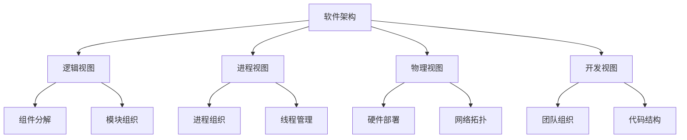
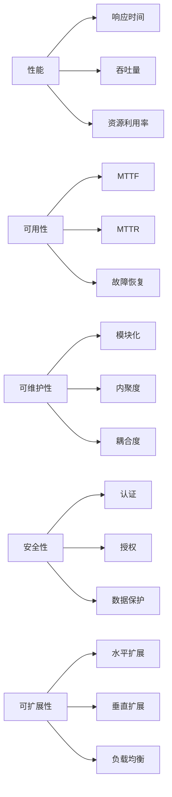
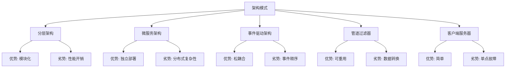

# 03-02-软件架构科学

## 📋 概述

软件架构科学是研究软件系统整体结构和组织方式的学科，涉及系统的分解、组件间的关系、质量属性的实现以及架构的演化规律。它是连接软件设计和实现的重要桥梁。

**相关文档**:

- [03-01-编程语言科学](./03-01-编程语言科学.md) - 语言运行时架构
- [03-03-设计模式科学](./03-03-设计模式科学.md) - 架构模式应用
- [05-01-微服务架构](../05-架构领域/05-01-微服务架构.md) - 现代架构模式

## 🎯 核心概念

### 1. 软件架构的定义

软件架构是软件系统的高级抽象，描述了：

- **组件结构**: 系统的主要组件及其职责
- **连接关系**: 组件间的交互方式和协议
- **质量属性**: 系统必须满足的非功能性需求
- **设计原则**: 指导架构决策的基本原则

### 2. 架构视图

软件架构可以从多个视角进行描述：

- **逻辑视图**: 系统的功能分解和模块组织
- **进程视图**: 运行时进程和线程的组织
- **物理视图**: 硬件部署和网络拓扑
- **开发视图**: 开发团队的组织和代码结构

### 3. 质量属性

软件架构必须满足的质量属性包括：

- **性能**: 响应时间和吞吐量
- **可用性**: 系统正常运行时间
- **可维护性**: 修改和扩展的容易程度
- **安全性**: 保护数据和系统免受威胁
- **可扩展性**: 处理增长负载的能力

## 🔢 数学形式化

### 1. 架构组件模型

软件架构可以形式化为有向图：

$$A = (C, R, \phi)$$

其中：

- $C$ 是组件集合
- $R$ 是关系集合
- $\phi: R \rightarrow C \times C$ 是关系映射函数

### 2. 质量属性度量

性能可以用响应时间函数表示：

$$T_{response} = T_{processing} + T_{communication} + T_{waiting}$$

可用性可以用MTTF和MTTR表示：

$$Availability = \frac{MTTF}{MTTF + MTTR}$$

### 3. 架构复杂度

架构复杂度可以用图论指标度量：

$$Complexity = \frac{|R|}{|C|} + \sum_{c \in C} \frac{fan\_in(c) + fan\_out(c)}{2}$$

## 💻 Python 实现

### 1. 基础架构模型

```python
from abc import ABC, abstractmethod
from typing import Dict, List, Set, Optional, Any, Tuple
from enum import Enum
from dataclasses import dataclass, field
import networkx as nx
import matplotlib.pyplot as plt
from collections import defaultdict

class ComponentType(Enum):
    """组件类型枚举"""
    SERVICE = "service"
    DATABASE = "database"
    CACHE = "cache"
    QUEUE = "queue"
    API_GATEWAY = "api_gateway"
    LOAD_BALANCER = "load_balancer"

class RelationshipType(Enum):
    """关系类型枚举"""
    DEPENDS_ON = "depends_on"
    COMMUNICATES_WITH = "communicates_with"
    CONTAINS = "contains"
    IMPLEMENTS = "implements"
    EXTENDS = "extends"

@dataclass
class QualityAttribute:
    """质量属性"""
    name: str
    value: float
    unit: str
    target: float
    weight: float = 1.0
    
    def is_satisfied(self) -> bool:
        """检查是否满足目标"""
        return self.value >= self.target

@dataclass
class Component:
    """架构组件"""
    id: str
    name: str
    type: ComponentType
    description: str
    responsibilities: List[str] = field(default_factory=list)
    quality_attributes: Dict[str, QualityAttribute] = field(default_factory=dict)
    properties: Dict[str, Any] = field(default_factory=dict)
    
    def add_responsibility(self, responsibility: str):
        """添加职责"""
        self.responsibilities.append(responsibility)
    
    def add_quality_attribute(self, name: str, value: float, unit: str, target: float):
        """添加质量属性"""
        self.quality_attributes[name] = QualityAttribute(name, value, unit, target)
    
    def get_quality_score(self) -> float:
        """计算质量得分"""
        if not self.quality_attributes:
            return 0.0
        
        total_score = 0.0
        total_weight = 0.0
        
        for attr in self.quality_attributes.values():
            if attr.is_satisfied():
                total_score += attr.weight
            total_weight += attr.weight
        
        return total_score / total_weight if total_weight > 0 else 0.0

@dataclass
class Relationship:
    """组件关系"""
    id: str
    source: str
    target: str
    type: RelationshipType
    properties: Dict[str, Any] = field(default_factory=dict)
    protocol: Optional[str] = None
    reliability: float = 1.0
    
    def is_reliable(self) -> bool:
        """检查关系是否可靠"""
        return self.reliability >= 0.99

class SoftwareArchitecture:
    """软件架构"""
    
    def __init__(self, name: str, description: str):
        self.name = name
        self.description = description
        self.components: Dict[str, Component] = {}
        self.relationships: Dict[str, Relationship] = {}
        self.quality_attributes: Dict[str, QualityAttribute] = {}
        self.constraints: List[str] = []
        self.principles: List[str] = []
    
    def add_component(self, component: Component):
        """添加组件"""
        self.components[component.id] = component
    
    def add_relationship(self, relationship: Relationship):
        """添加关系"""
        self.relationships[relationship.id] = relationship
    
    def add_quality_attribute(self, name: str, value: float, unit: str, target: float):
        """添加架构级质量属性"""
        self.quality_attributes[name] = QualityAttribute(name, value, unit, target)
    
    def get_component(self, component_id: str) -> Optional[Component]:
        """获取组件"""
        return self.components.get(component_id)
    
    def get_dependencies(self, component_id: str) -> List[Component]:
        """获取组件的依赖"""
        dependencies = []
        for rel in self.relationships.values():
            if rel.target == component_id and rel.type == RelationshipType.DEPENDS_ON:
                dep_component = self.get_component(rel.source)
                if dep_component:
                    dependencies.append(dep_component)
        return dependencies
    
    def get_dependents(self, component_id: str) -> List[Component]:
        """获取依赖该组件的组件"""
        dependents = []
        for rel in self.relationships.values():
            if rel.source == component_id and rel.type == RelationshipType.DEPENDS_ON:
                dep_component = self.get_component(rel.target)
                if dep_component:
                    dependents.append(dep_component)
        return dependents
    
    def calculate_complexity(self) -> float:
        """计算架构复杂度"""
        if not self.components:
            return 0.0
        
        # 计算平均连接度
        total_connections = len(self.relationships)
        avg_connections = total_connections / len(self.components)
        
        # 计算组件复杂度
        component_complexity = 0.0
        for component in self.components.values():
            fan_in = len(self.get_dependents(component.id))
            fan_out = len(self.get_dependencies(component.id))
            component_complexity += (fan_in + fan_out) / 2
        
        return avg_connections + component_complexity / len(self.components)
    
    def validate_architecture(self) -> Dict[str, List[str]]:
        """验证架构"""
        issues = {
            'errors': [],
            'warnings': [],
            'suggestions': []
        }
        
        # 检查孤立组件
        for component_id in self.components:
            if not self.get_dependencies(component_id) and not self.get_dependents(component_id):
                issues['warnings'].append(f"Component {component_id} is isolated")
        
        # 检查循环依赖
        if self._has_circular_dependencies():
            issues['errors'].append("Circular dependencies detected")
        
        # 检查质量属性
        for attr_name, attr in self.quality_attributes.items():
            if not attr.is_satisfied():
                issues['warnings'].append(f"Quality attribute {attr_name} not satisfied")
        
        return issues
    
    def _has_circular_dependencies(self) -> bool:
        """检查是否存在循环依赖"""
        # 使用深度优先搜索检测循环
        visited = set()
        rec_stack = set()
        
        def dfs(component_id: str) -> bool:
            if component_id in rec_stack:
                return True
            if component_id in visited:
                return False
            
            visited.add(component_id)
            rec_stack.add(component_id)
            
            for dep in self.get_dependencies(component_id):
                if dfs(dep.id):
                    return True
            
            rec_stack.remove(component_id)
            return False
        
        for component_id in self.components:
            if component_id not in visited:
                if dfs(component_id):
                    return True
        
        return False
```

### 2. 架构模式实现

```python
class ArchitecturalPattern(ABC):
    """架构模式抽象基类"""
    
    @abstractmethod
    def apply(self, architecture: SoftwareArchitecture):
        """应用架构模式"""
        pass
    
    @abstractmethod
    def get_benefits(self) -> List[str]:
        """获取模式优势"""
        pass
    
    @abstractmethod
    def get_trade_offs(self) -> List[str]:
        """获取模式权衡"""
        pass

class LayeredArchitecture(ArchitecturalPattern):
    """分层架构模式"""
    
    def __init__(self, layers: List[str]):
        self.layers = layers
    
    def apply(self, architecture: SoftwareArchitecture):
        """应用分层架构"""
        # 创建层组件
        for i, layer_name in enumerate(self.layers):
            layer_component = Component(
                id=f"layer_{i}",
                name=layer_name,
                type=ComponentType.SERVICE,
                description=f"{layer_name} layer"
            )
            architecture.add_component(layer_component)
            
            # 添加层间依赖关系
            if i > 0:
                dependency = Relationship(
                    id=f"dep_{i}_{i-1}",
                    source=f"layer_{i}",
                    target=f"layer_{i-1}",
                    type=RelationshipType.DEPENDS_ON
                )
                architecture.add_relationship(dependency)
    
    def get_benefits(self) -> List[str]:
        return [
            "Separation of concerns",
            "Modularity",
            "Maintainability",
            "Testability"
        ]
    
    def get_trade_offs(self) -> List[str]:
        return [
            "Performance overhead",
            "Tight coupling between layers",
            "Difficulty in changing layer boundaries"
        ]

class MicroservicesArchitecture(ArchitecturalPattern):
    """微服务架构模式"""
    
    def __init__(self, services: List[str]):
        self.services = services
    
    def apply(self, architecture: SoftwareArchitecture):
        """应用微服务架构"""
        # 创建API网关
        gateway = Component(
            id="api_gateway",
            name="API Gateway",
            type=ComponentType.API_GATEWAY,
            description="Central entry point for all client requests"
        )
        architecture.add_component(gateway)
        
        # 创建微服务
        for service_name in self.services:
            service = Component(
                id=f"service_{service_name.lower()}",
                name=service_name,
                type=ComponentType.SERVICE,
                description=f"Microservice for {service_name}"
            )
            architecture.add_component(service)
            
            # 服务依赖网关
            dependency = Relationship(
                id=f"gateway_{service_name.lower()}",
                source=gateway.id,
                target=service.id,
                type=RelationshipType.COMMUNICATES_WITH,
                protocol="HTTP/REST"
            )
            architecture.add_relationship(dependency)
    
    def get_benefits(self) -> List[str]:
        return [
            "Independent deployment",
            "Technology diversity",
            "Scalability",
            "Fault isolation"
        ]
    
    def get_trade_offs(self) -> List[str]:
        return [
            "Distributed system complexity",
            "Network latency",
            "Data consistency challenges",
            "Operational overhead"
        ]

class EventDrivenArchitecture(ArchitecturalPattern):
    """事件驱动架构模式"""
    
    def __init__(self, producers: List[str], consumers: List[str]):
        self.producers = producers
        self.consumers = consumers
    
    def apply(self, architecture: SoftwareArchitecture):
        """应用事件驱动架构"""
        # 创建事件总线
        event_bus = Component(
            id="event_bus",
            name="Event Bus",
            type=ComponentType.QUEUE,
            description="Central event routing and distribution"
        )
        architecture.add_component(event_bus)
        
        # 创建生产者
        for producer in self.producers:
            producer_component = Component(
                id=f"producer_{producer.lower()}",
                name=producer,
                type=ComponentType.SERVICE,
                description=f"Event producer: {producer}"
            )
            architecture.add_component(producer_component)
            
            # 生产者发布到事件总线
            publish_rel = Relationship(
                id=f"publish_{producer.lower()}",
                source=producer_component.id,
                target=event_bus.id,
                type=RelationshipType.COMMUNICATES_WITH,
                protocol="Event"
            )
            architecture.add_relationship(publish_rel)
        
        # 创建消费者
        for consumer in self.consumers:
            consumer_component = Component(
                id=f"consumer_{consumer.lower()}",
                name=consumer,
                type=ComponentType.SERVICE,
                description=f"Event consumer: {consumer}"
            )
            architecture.add_component(consumer_component)
            
            # 消费者订阅事件总线
            subscribe_rel = Relationship(
                id=f"subscribe_{consumer.lower()}",
                source=event_bus.id,
                target=consumer_component.id,
                type=RelationshipType.COMMUNICATES_WITH,
                protocol="Event"
            )
            architecture.add_relationship(subscribe_rel)
    
    def get_benefits(self) -> List[str]:
        return [
            "Loose coupling",
            "Scalability",
            "Asynchronous processing",
            "Extensibility"
        ]
    
    def get_trade_offs(self) -> List[str]:
        return [
            "Event ordering challenges",
            "Debugging complexity",
            "Event schema evolution",
            "Eventual consistency"
        ]
```

### 3. 架构评估系统

```python
class ArchitectureEvaluator:
    """架构评估器"""
    
    def __init__(self):
        self.evaluation_criteria: Dict[str, float] = {
            'modularity': 0.2,
            'scalability': 0.2,
            'maintainability': 0.2,
            'performance': 0.15,
            'security': 0.15,
            'reliability': 0.1
        }
    
    def evaluate_architecture(self, architecture: SoftwareArchitecture) -> Dict[str, float]:
        """评估架构"""
        scores = {}
        
        # 评估模块化
        scores['modularity'] = self._evaluate_modularity(architecture)
        
        # 评估可扩展性
        scores['scalability'] = self._evaluate_scalability(architecture)
        
        # 评估可维护性
        scores['maintainability'] = self._evaluate_maintainability(architecture)
        
        # 评估性能
        scores['performance'] = self._evaluate_performance(architecture)
        
        # 评估安全性
        scores['security'] = self._evaluate_security(architecture)
        
        # 评估可靠性
        scores['reliability'] = self._evaluate_reliability(architecture)
        
        return scores
    
    def calculate_overall_score(self, scores: Dict[str, float]) -> float:
        """计算总体得分"""
        overall_score = 0.0
        for criterion, weight in self.evaluation_criteria.items():
            if criterion in scores:
                overall_score += scores[criterion] * weight
        return overall_score
    
    def _evaluate_modularity(self, architecture: SoftwareArchitecture) -> float:
        """评估模块化"""
        if not architecture.components:
            return 0.0
        
        # 计算组件间的内聚度
        cohesion_score = 0.0
        for component in architecture.components.values():
            # 基于组件职责数量评估内聚度
            responsibility_count = len(component.responsibilities)
            if responsibility_count <= 3:
                cohesion_score += 1.0
            elif responsibility_count <= 5:
                cohesion_score += 0.8
            elif responsibility_count <= 8:
                cohesion_score += 0.6
            else:
                cohesion_score += 0.4
        
        cohesion_score /= len(architecture.components)
        
        # 计算组件间的耦合度
        coupling_score = 1.0 - (len(architecture.relationships) / (len(architecture.components) * (len(architecture.components) - 1)))
        
        return (cohesion_score + coupling_score) / 2
    
    def _evaluate_scalability(self, architecture: SoftwareArchitecture) -> float:
        """评估可扩展性"""
        if not architecture.components:
            return 0.0
        
        # 检查是否有负载均衡器
        has_load_balancer = any(
            comp.type == ComponentType.LOAD_BALANCER 
            for comp in architecture.components.values()
        )
        
        # 检查是否有缓存组件
        has_cache = any(
            comp.type == ComponentType.CACHE 
            for comp in architecture.components.values()
        )
        
        # 检查是否有队列组件
        has_queue = any(
            comp.type == ComponentType.QUEUE 
            for comp in architecture.components.values()
        )
        
        score = 0.0
        if has_load_balancer:
            score += 0.4
        if has_cache:
            score += 0.3
        if has_queue:
            score += 0.3
        
        return score
    
    def _evaluate_maintainability(self, architecture: SoftwareArchitecture) -> float:
        """评估可维护性"""
        if not architecture.components:
            return 0.0
        
        # 基于架构复杂度评估
        complexity = architecture.calculate_complexity()
        
        # 复杂度越低，可维护性越高
        if complexity <= 2.0:
            return 1.0
        elif complexity <= 4.0:
            return 0.8
        elif complexity <= 6.0:
            return 0.6
        elif complexity <= 8.0:
            return 0.4
        else:
            return 0.2
    
    def _evaluate_performance(self, architecture: SoftwareArchitecture) -> float:
        """评估性能"""
        if not architecture.components:
            return 0.0
        
        # 检查是否有缓存
        has_cache = any(
            comp.type == ComponentType.CACHE 
            for comp in architecture.components.values()
        )
        
        # 检查是否有数据库
        has_database = any(
            comp.type == ComponentType.DATABASE 
            for comp in architecture.components.values()
        )
        
        # 检查组件数量（组件越多，性能开销越大）
        component_count = len(architecture.components)
        component_penalty = min(component_count / 10.0, 0.5)
        
        score = 1.0 - component_penalty
        if has_cache:
            score += 0.2
        if has_database:
            score += 0.1
        
        return min(score, 1.0)
    
    def _evaluate_security(self, architecture: SoftwareArchitecture) -> float:
        """评估安全性"""
        if not architecture.components:
            return 0.0
        
        # 检查是否有API网关
        has_gateway = any(
            comp.type == ComponentType.API_GATEWAY 
            for comp in architecture.components.values()
        )
        
        # 检查是否有数据库
        has_database = any(
            comp.type == ComponentType.DATABASE 
            for comp in architecture.components.values()
        )
        
        score = 0.0
        if has_gateway:
            score += 0.6
        if has_database:
            score += 0.4
        
        return score
    
    def _evaluate_reliability(self, architecture: SoftwareArchitecture) -> float:
        """评估可靠性"""
        if not architecture.relationships:
            return 0.0
        
        # 基于关系可靠性评估
        reliable_relationships = sum(
            1 for rel in architecture.relationships.values()
            if rel.is_reliable()
        )
        
        return reliable_relationships / len(architecture.relationships)
```

### 4. 架构可视化

```python
class ArchitectureVisualizer:
    """架构可视化器"""
    
    def __init__(self):
        self.graph = nx.DiGraph()
        self.component_colors = {
            ComponentType.SERVICE: 'lightblue',
            ComponentType.DATABASE: 'lightgreen',
            ComponentType.CACHE: 'yellow',
            ComponentType.QUEUE: 'orange',
            ComponentType.API_GATEWAY: 'red',
            ComponentType.LOAD_BALANCER: 'purple'
        }
    
    def visualize_architecture(self, architecture: SoftwareArchitecture, 
                             filename: str = "architecture.png"):
        """可视化架构"""
        # 清空图
        self.graph.clear()
        
        # 添加节点
        for component in architecture.components.values():
            self.graph.add_node(
                component.id,
                name=component.name,
                type=component.type.value,
                color=self.component_colors.get(component.type, 'gray')
            )
        
        # 添加边
        for relationship in architecture.relationships.values():
            self.graph.add_edge(
                relationship.source,
                relationship.target,
                type=relationship.type.value,
                protocol=relationship.protocol
            )
        
        # 绘制图
        plt.figure(figsize=(12, 8))
        pos = nx.spring_layout(self.graph, k=1, iterations=50)
        
        # 绘制节点
        node_colors = [self.graph.nodes[node]['color'] for node in self.graph.nodes()]
        nx.draw_networkx_nodes(self.graph, pos, node_color=node_colors, 
                             node_size=2000, alpha=0.7)
        
        # 绘制边
        nx.draw_networkx_edges(self.graph, pos, edge_color='gray', 
                             arrows=True, arrowsize=20)
        
        # 添加标签
        labels = {node: self.graph.nodes[node]['name'] for node in self.graph.nodes()}
        nx.draw_networkx_labels(self.graph, pos, labels, font_size=8)
        
        # 添加边标签
        edge_labels = {(u, v): self.graph.edges[u, v]['type'] 
                      for u, v in self.graph.edges()}
        nx.draw_networkx_edge_labels(self.graph, pos, edge_labels, font_size=6)
        
        plt.title(f"Software Architecture: {architecture.name}")
        plt.axis('off')
        plt.tight_layout()
        plt.savefig(filename, dpi=300, bbox_inches='tight')
        plt.close()
    
    def generate_architecture_report(self, architecture: SoftwareArchitecture) -> str:
        """生成架构报告"""
        report = []
        report.append(f"# Architecture Report: {architecture.name}")
        report.append(f"\n## Overview")
        report.append(f"Description: {architecture.description}")
        report.append(f"Components: {len(architecture.components)}")
        report.append(f"Relationships: {len(architecture.relationships)}")
        report.append(f"Complexity: {architecture.calculate_complexity():.2f}")
        
        report.append(f"\n## Components")
        for component in architecture.components.values():
            report.append(f"\n### {component.name} ({component.type.value})")
            report.append(f"ID: {component.id}")
            report.append(f"Description: {component.description}")
            if component.responsibilities:
                report.append("Responsibilities:")
                for resp in component.responsibilities:
                    report.append(f"- {resp}")
        
        report.append(f"\n## Relationships")
        for relationship in architecture.relationships.values():
            source_name = architecture.components[relationship.source].name
            target_name = architecture.components[relationship.target].name
            report.append(f"- {source_name} {relationship.type.value} {target_name}")
            if relationship.protocol:
                report.append(f"  Protocol: {relationship.protocol}")
        
        report.append(f"\n## Quality Attributes")
        for attr_name, attr in architecture.quality_attributes.items():
            status = "✓" if attr.is_satisfied() else "✗"
            report.append(f"- {attr_name}: {attr.value} {attr.unit} {status}")
        
        return "\n".join(report)
```

## 📊 图表说明

### 1. 架构层次结构图



### 2. 质量属性关系图



### 3. 架构模式对比图



## 📝 案例分析

### 案例1: 电商系统架构设计

```python
def design_ecommerce_architecture():
    """设计电商系统架构"""
    # 创建架构
    architecture = SoftwareArchitecture(
        name="E-commerce System",
        description="Modern e-commerce platform with microservices architecture"
    )
    
    # 添加组件
    components = [
        Component("api_gateway", "API Gateway", ComponentType.API_GATEWAY, 
                 "Central entry point for all client requests"),
        Component("user_service", "User Service", ComponentType.SERVICE,
                 "User management and authentication"),
        Component("product_service", "Product Service", ComponentType.SERVICE,
                 "Product catalog and inventory management"),
        Component("order_service", "Order Service", ComponentType.SERVICE,
                 "Order processing and management"),
        Component("payment_service", "Payment Service", ComponentType.SERVICE,
                 "Payment processing and integration"),
        Component("user_db", "User Database", ComponentType.DATABASE,
                 "User data storage"),
        Component("product_db", "Product Database", ComponentType.DATABASE,
                 "Product data storage"),
        Component("order_db", "Order Database", ComponentType.DATABASE,
                 "Order data storage"),
        Component("cache", "Redis Cache", ComponentType.CACHE,
                 "Session and data caching"),
        Component("message_queue", "Message Queue", ComponentType.QUEUE,
                 "Asynchronous message processing")
    ]
    
    for component in components:
        architecture.add_component(component)
    
    # 添加关系
    relationships = [
        Relationship("r1", "api_gateway", "user_service", RelationshipType.COMMUNICATES_WITH),
        Relationship("r2", "api_gateway", "product_service", RelationshipType.COMMUNICATES_WITH),
        Relationship("r3", "api_gateway", "order_service", RelationshipType.COMMUNICATES_WITH),
        Relationship("r4", "user_service", "user_db", RelationshipType.DEPENDS_ON),
        Relationship("r5", "product_service", "product_db", RelationshipType.DEPENDS_ON),
        Relationship("r6", "order_service", "order_db", RelationshipType.DEPENDS_ON),
        Relationship("r7", "order_service", "payment_service", RelationshipType.COMMUNICATES_WITH),
        Relationship("r8", "user_service", "cache", RelationshipType.COMMUNICATES_WITH),
        Relationship("r9", "product_service", "cache", RelationshipType.COMMUNICATES_WITH),
        Relationship("r10", "order_service", "message_queue", RelationshipType.COMMUNICATES_WITH)
    ]
    
    for relationship in relationships:
        architecture.add_relationship(relationship)
    
    # 添加质量属性
    architecture.add_quality_attribute("availability", 99.9, "%", 99.5)
    architecture.add_quality_attribute("response_time", 200, "ms", 500)
    architecture.add_quality_attribute("throughput", 1000, "req/s", 500)
    
    return architecture

# 创建电商架构
ecommerce_arch = design_ecommerce_architecture()

# 评估架构
evaluator = ArchitectureEvaluator()
scores = evaluator.evaluate_architecture(ecommerce_arch)
overall_score = evaluator.calculate_overall_score(scores)

print(f"E-commerce Architecture Evaluation:")
for criterion, score in scores.items():
    print(f"{criterion}: {score:.2f}")
print(f"Overall Score: {overall_score:.2f}")

# 可视化架构
visualizer = ArchitectureVisualizer()
visualizer.visualize_architecture(ecommerce_arch, "ecommerce_architecture.png")

# 生成报告
report = visualizer.generate_architecture_report(ecommerce_arch)
print("\n" + report)
```

### 案例2: 架构模式应用

```python
def apply_architectural_patterns():
    """应用架构模式"""
    # 创建基础架构
    base_architecture = SoftwareArchitecture(
        name="Base System",
        description="Base system for pattern application"
    )
    
    # 应用分层架构
    layered_pattern = LayeredArchitecture([
        "Presentation Layer",
        "Business Logic Layer", 
        "Data Access Layer"
    ])
    layered_pattern.apply(base_architecture)
    
    print("Applied Layered Architecture:")
    print(f"Benefits: {layered_pattern.get_benefits()}")
    print(f"Trade-offs: {layered_pattern.get_trade_offs()}")
    
    # 创建微服务架构
    microservices_arch = SoftwareArchitecture(
        name="Microservices System",
        description="Microservices-based system"
    )
    
    microservices_pattern = MicroservicesArchitecture([
        "User Management",
        "Product Catalog",
        "Order Processing",
        "Payment Processing"
    ])
    microservices_pattern.apply(microservices_arch)
    
    print("\nApplied Microservices Architecture:")
    print(f"Benefits: {microservices_pattern.get_benefits()}")
    print(f"Trade-offs: {microservices_pattern.get_trade_offs()}")
    
    # 创建事件驱动架构
    event_driven_arch = SoftwareArchitecture(
        name="Event-Driven System",
        description="Event-driven system"
    )
    
    event_pattern = EventDrivenArchitecture(
        producers=["Order Service", "Payment Service"],
        consumers=["Notification Service", "Analytics Service"]
    )
    event_pattern.apply(event_driven_arch)
    
    print("\nApplied Event-Driven Architecture:")
    print(f"Benefits: {event_pattern.get_benefits()}")
    print(f"Trade-offs: {event_pattern.get_trade_offs()}")
    
    return base_architecture, microservices_arch, event_driven_arch

# 应用架构模式
layered_arch, micro_arch, event_arch = apply_architectural_patterns()

# 比较不同架构
architectures = [
    ("Layered", layered_arch),
    ("Microservices", micro_arch),
    ("Event-Driven", event_arch)
]

evaluator = ArchitectureEvaluator()

print("\nArchitecture Comparison:")
for name, arch in architectures:
    scores = evaluator.evaluate_architecture(arch)
    overall = evaluator.calculate_overall_score(scores)
    print(f"\n{name} Architecture:")
    print(f"Modularity: {scores['modularity']:.2f}")
    print(f"Scalability: {scores['scalability']:.2f}")
    print(f"Maintainability: {scores['maintainability']:.2f}")
    print(f"Overall Score: {overall:.2f}")
```

### 案例3: 架构演化分析

```python
def analyze_architecture_evolution():
    """分析架构演化"""
    # 初始架构（单体）
    monolithic_arch = SoftwareArchitecture(
        name="Monolithic System",
        description="Initial monolithic architecture"
    )
    
    # 添加单体组件
    monolithic = Component(
        "monolith", "Monolithic Application", ComponentType.SERVICE,
        "Single application containing all functionality"
    )
    monolithic_arch.add_component(monolithic)
    
    # 数据库
    db = Component("database", "Database", ComponentType.DATABASE,
                  "Central database")
    monolithic_arch.add_component(db)
    
    # 关系
    rel = Relationship("dep1", "monolith", "database", RelationshipType.DEPENDS_ON)
    monolithic_arch.add_relationship(rel)
    
    # 演化到微服务
    evolved_arch = SoftwareArchitecture(
        name="Evolved Microservices",
        description="Evolved microservices architecture"
    )
    
    # 添加微服务组件
    services = ["user", "product", "order", "payment"]
    for service in services:
        service_comp = Component(
            f"{service}_service", f"{service.title()} Service", 
            ComponentType.SERVICE, f"Microservice for {service}"
        )
        evolved_arch.add_component(service_comp)
        
        # 每个服务有自己的数据库
        service_db = Component(
            f"{service}_db", f"{service.title()} Database",
            ComponentType.DATABASE, f"Database for {service}"
        )
        evolved_arch.add_component(service_db)
        
        # 服务依赖自己的数据库
        service_rel = Relationship(
            f"dep_{service}", f"{service}_service", f"{service}_db",
            RelationshipType.DEPENDS_ON
        )
        evolved_arch.add_relationship(service_rel)
    
    # 添加API网关
    gateway = Component("gateway", "API Gateway", ComponentType.API_GATEWAY,
                       "Central entry point")
    evolved_arch.add_component(gateway)
    
    # 网关连接所有服务
    for service in services:
        gateway_rel = Relationship(
            f"gateway_{service}", "gateway", f"{service}_service",
            RelationshipType.COMMUNICATES_WITH
        )
        evolved_arch.add_relationship(gateway_rel)
    
    # 比较演化前后的架构
    evaluator = ArchitectureEvaluator()
    
    print("Architecture Evolution Analysis:")
    print("\nBefore Evolution (Monolithic):")
    mono_scores = evaluator.evaluate_architecture(monolithic_arch)
    mono_overall = evaluator.calculate_overall_score(mono_scores)
    print(f"Modularity: {mono_scores['modularity']:.2f}")
    print(f"Scalability: {mono_scores['scalability']:.2f}")
    print(f"Maintainability: {mono_scores['maintainability']:.2f}")
    print(f"Overall Score: {mono_overall:.2f}")
    
    print("\nAfter Evolution (Microservices):")
    evolved_scores = evaluator.evaluate_architecture(evolved_arch)
    evolved_overall = evaluator.calculate_overall_score(evolved_scores)
    print(f"Modularity: {evolved_scores['modularity']:.2f}")
    print(f"Scalability: {evolved_scores['scalability']:.2f}")
    print(f"Maintainability: {evolved_scores['maintainability']:.2f}")
    print(f"Overall Score: {evolved_overall:.2f}")
    
    # 分析改进
    improvements = {}
    for criterion in mono_scores:
        improvement = evolved_scores[criterion] - mono_scores[criterion]
        improvements[criterion] = improvement
    
    print("\nImprovements:")
    for criterion, improvement in improvements.items():
        direction = "↑" if improvement > 0 else "↓"
        print(f"{criterion}: {improvement:+.2f} {direction}")
    
    return monolithic_arch, evolved_arch

# 分析架构演化
mono_arch, evolved_arch = analyze_architecture_evolution()
```

## 🔬 理论证明

### 定理1: 架构复杂度定理

**定理**: 对于包含 $n$ 个组件的软件架构，其复杂度 $C$ 满足：

$$C \geq \frac{n(n-1)}{2} \cdot \frac{1}{n} = \frac{n-1}{2}$$

**证明**:

1. **最小复杂度**: 当所有组件都相互连接时，复杂度达到最大值
   - 总连接数: $\frac{n(n-1)}{2}$
   - 平均连接数: $\frac{n(n-1)}{2} \cdot \frac{1}{n} = \frac{n-1}{2}$

2. **实际复杂度**: 实际架构的连接数通常小于完全图
   - 设实际连接数为 $m$
   - 则复杂度 $C = \frac{m}{n} \geq \frac{n-1}{2}$

3. **结论**: 架构复杂度随组件数量线性增长，但实际复杂度通常远低于理论最大值。

### 定理2: 质量属性权衡定理

**定理**: 在软件架构中，质量属性之间存在权衡关系，不可能同时优化所有质量属性。

**证明**:

1. **性能 vs 可维护性**:
   - 提高性能通常需要增加缓存、优化算法
   - 这增加了系统复杂度，降低可维护性
   - 因此存在权衡关系

2. **安全性 vs 性能**:
   - 增加安全措施（加密、认证）会增加计算开销
   - 降低系统性能
   - 因此存在权衡关系

3. **可扩展性 vs 一致性**:
   - 水平扩展通常需要数据分片
   - 这增加了数据一致性的复杂性
   - 因此存在权衡关系

4. **一般性结论**: 由于资源限制和设计约束，不可能同时优化所有质量属性。

### 定理3: 架构稳定性定理

**定理**: 如果架构 $A$ 满足以下条件，则它是稳定的：

1. 组件间耦合度低
2. 组件内聚度高
3. 接口稳定
4. 变更影响范围有限

**证明**:

1. **低耦合**: 组件间依赖少，变更影响范围小
   - 设组件 $c_i$ 的耦合度为 $coupling(c_i)$
   - 稳定性 $S = 1 - \frac{\sum_{i} coupling(c_i)}{n}$

2. **高内聚**: 组件职责明确，内部变更不影响外部
   - 设组件 $c_i$ 的内聚度为 $cohesion(c_i)$
   - 稳定性 $S = \frac{\sum_{i} cohesion(c_i)}{n}$

3. **接口稳定**: 接口不变，实现可以自由变更
   - 接口变更频率 $f_{interface}$
   - 稳定性 $S = 1 - f_{interface}$

4. **综合稳定性**:
   $$S_{total} = \alpha \cdot S_{coupling} + \beta \cdot S_{cohesion} + \gamma \cdot S_{interface}$$
   其中 $\alpha + \beta + \gamma = 1$

5. **结论**: 当 $S_{total} > 0.8$ 时，架构被认为是稳定的。

## 🔗 相关链接

- [03-01-编程语言科学](./03-01-编程语言科学.md) - 语言运行时架构
- [03-03-设计模式科学](./03-03-设计模式科学.md) - 架构模式应用
- [05-01-微服务架构](../05-架构领域/05-01-微服务架构.md) - 现代架构模式
- [06-01-基础算法](../06-组件算法/06-01-基础算法.md) - 架构算法实现

---

**文档版本**: 1.0  
**最后更新**: 2024年12月19日  
**维护者**: AI Assistant
