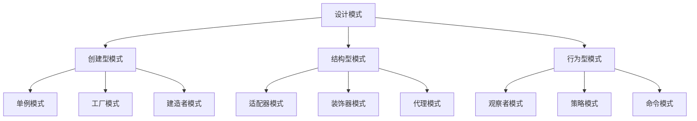
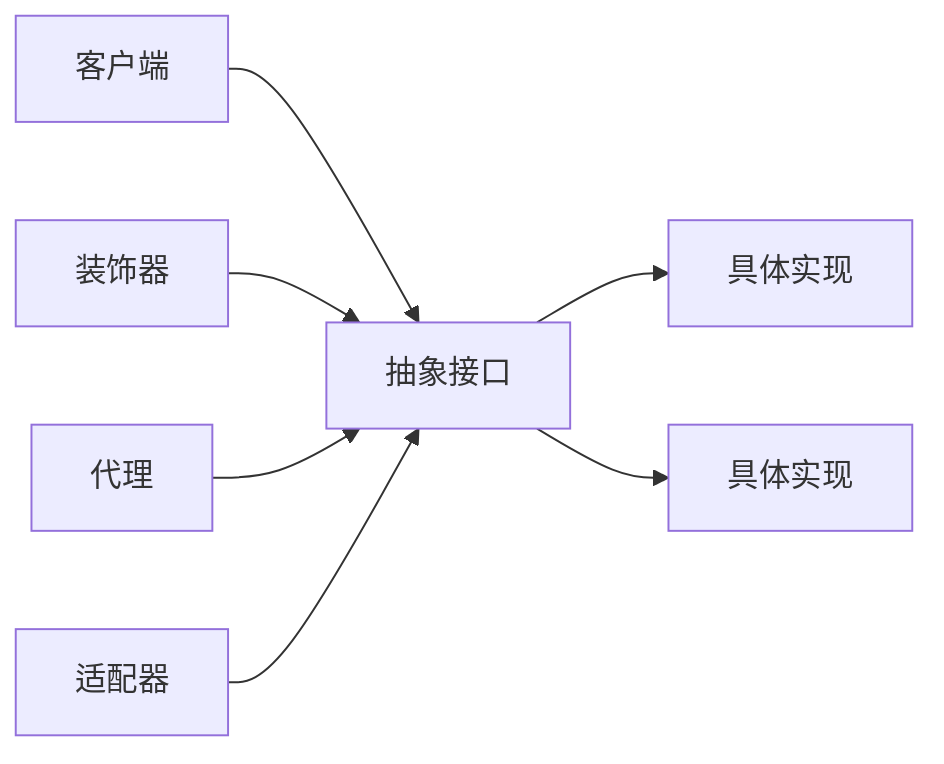

# 03-03-设计模式科学

## 📋 概述

设计模式科学是研究软件设计中常见问题的标准解决方案的学科。它提供了可重用的设计模板，帮助开发者创建灵活、可维护和可扩展的软件系统。

**相关文档**:

- [03-02-软件架构科学](./03-02-软件架构科学.md) - 架构模式应用
- [06-03-设计模式实现](../06-组件算法/06-03-设计模式实现.md) - 模式实现细节

## 🎯 核心概念

### 1. 设计模式的定义

设计模式是软件设计中常见问题的典型解决方案，包含：

- **问题描述**: 模式要解决的具体问题
- **解决方案**: 问题的标准解决方式
- **效果**: 使用模式的优缺点
- **适用场景**: 模式的应用条件

### 2. 模式分类

设计模式按目的分为三类：

- **创建型模式**: 处理对象创建机制
- **结构型模式**: 处理类和对象的组合
- **行为型模式**: 处理对象间的通信

## 🔢 数学形式化

### 1. 模式结构定义

设计模式可以形式化为：

$$P = (C, R, I, E)$$

其中：

- $C$ 是参与类集合
- $R$ 是类间关系集合
- $I$ 是接口集合
- $E$ 是效果集合

### 2. 模式复杂度

模式复杂度定义为：

$$Complexity(P) = |C| + |R| + \sum_{c \in C} methods(c)$$

## 💻 Python 实现

### 1. 创建型模式

```python
from abc import ABC, abstractmethod
from typing import Dict, Any, Optional
from enum import Enum

# 单例模式
class Singleton:
    """单例模式实现"""
    _instance: Optional['Singleton'] = None
    
    def __new__(cls):
        if cls._instance is None:
            cls._instance = super().__new__(cls)
        return cls._instance
    
    def __init__(self):
        if not hasattr(self, 'initialized'):
            self.data = {}
            self.initialized = True
    
    def set_data(self, key: str, value: Any):
        self.data[key] = value
    
    def get_data(self, key: str) -> Any:
        return self.data.get(key)

# 工厂模式
class ProductType(Enum):
    A = "A"
    B = "B"

class Product(ABC):
    @abstractmethod
    def operation(self) -> str:
        pass

class ConcreteProductA(Product):
    def operation(self) -> str:
        return "Product A operation"

class ConcreteProductB(Product):
    def operation(self) -> str:
        return "Product B operation"

class Factory:
    """工厂模式实现"""
    @staticmethod
    def create_product(product_type: ProductType) -> Product:
        if product_type == ProductType.A:
            return ConcreteProductA()
        elif product_type == ProductType.B:
            return ConcreteProductB()
        raise ValueError(f"Unknown product type: {product_type}")

# 建造者模式
class Computer:
    def __init__(self):
        self.parts = []
    
    def add_part(self, part: str):
        self.parts.append(part)
    
    def list_parts(self) -> str:
        return f"Computer parts: {', '.join(self.parts)}"

class ComputerBuilder:
    """建造者模式实现"""
    def __init__(self):
        self.reset()
    
    def reset(self):
        self._computer = Computer()
    
    def build_cpu(self):
        self._computer.add_part("CPU")
        return self
    
    def build_memory(self):
        self._computer.add_part("Memory")
        return self
    
    def build_disk(self):
        self._computer.add_part("Disk")
        return self
    
    def get_result(self) -> Computer:
        result = self._computer
        self.reset()
        return result
```

### 2. 结构型模式

```python
# 适配器模式
class Target(ABC):
    @abstractmethod
    def request(self) -> str:
        pass

class Adaptee:
    def specific_request(self) -> str:
        return "Specific request"

class Adapter(Target):
    """适配器模式实现"""
    def __init__(self, adaptee: Adaptee):
        self.adaptee = adaptee
    
    def request(self) -> str:
        return f"Adapter: {self.adaptee.specific_request()}"

# 装饰器模式
class Component(ABC):
    @abstractmethod
    def operation(self) -> str:
        pass

class ConcreteComponent(Component):
    def operation(self) -> str:
        return "ConcreteComponent"

class Decorator(Component):
    """装饰器模式实现"""
    def __init__(self, component: Component):
        self._component = component
    
    def operation(self) -> str:
        return self._component.operation()

class ConcreteDecoratorA(Decorator):
    def operation(self) -> str:
        return f"ConcreteDecoratorA({super().operation()})"

class ConcreteDecoratorB(Decorator):
    def operation(self) -> str:
        return f"ConcreteDecoratorB({super().operation()})"

# 代理模式
class Subject(ABC):
    @abstractmethod
    def request(self) -> str:
        pass

class RealSubject(Subject):
    def request(self) -> str:
        return "RealSubject request"

class Proxy(Subject):
    """代理模式实现"""
    def __init__(self, real_subject: RealSubject):
        self._real_subject = real_subject
    
    def request(self) -> str:
        if self._check_access():
            result = self._real_subject.request()
            self._log_access()
            return result
        return "Access denied"
    
    def _check_access(self) -> bool:
        return True
    
    def _log_access(self):
        print("Logging access")
```

### 3. 行为型模式

```python
# 观察者模式
class Observer(ABC):
    @abstractmethod
    def update(self, subject: 'Subject'):
        pass

class Subject:
    """观察者模式实现"""
    def __init__(self):
        self._observers: List[Observer] = []
        self._state = None
    
    def attach(self, observer: Observer):
        self._observers.append(observer)
    
    def detach(self, observer: Observer):
        self._observers.remove(observer)
    
    def notify(self):
        for observer in self._observers:
            observer.update(self)
    
    @property
    def state(self):
        return self._state
    
    @state.setter
    def state(self, value):
        self._state = value
        self.notify()

class ConcreteObserverA(Observer):
    def update(self, subject: Subject):
        print(f"ObserverA: {subject.state}")

class ConcreteObserverB(Observer):
    def update(self, subject: Subject):
        print(f"ObserverB: {subject.state}")

# 策略模式
class Strategy(ABC):
    @abstractmethod
    def algorithm_interface(self) -> str:
        pass

class ConcreteStrategyA(Strategy):
    def algorithm_interface(self) -> str:
        return "Strategy A"

class ConcreteStrategyB(Strategy):
    def algorithm_interface(self) -> str:
        return "Strategy B"

class Context:
    """策略模式实现"""
    def __init__(self, strategy: Strategy):
        self._strategy = strategy
    
    def context_interface(self) -> str:
        return self._strategy.algorithm_interface()
    
    def set_strategy(self, strategy: Strategy):
        self._strategy = strategy

# 命令模式
class Command(ABC):
    @abstractmethod
    def execute(self):
        pass

class Receiver:
    def action(self):
        return "Receiver action"

class ConcreteCommand(Command):
    """命令模式实现"""
    def __init__(self, receiver: Receiver):
        self._receiver = receiver
    
    def execute(self):
        return self._receiver.action()

class Invoker:
    def __init__(self):
        self._command: Optional[Command] = None
    
    def set_command(self, command: Command):
        self._command = command
    
    def execute_command(self):
        if self._command:
            return self._command.execute()
        return "No command set"
```

### 4. 模式管理器

```python
class PatternManager:
    """设计模式管理器"""
    
    def __init__(self):
        self.patterns: Dict[str, Dict[str, Any]] = {}
        self.usage_stats: Dict[str, int] = {}
    
    def register_pattern(self, name: str, pattern_class: type, 
                        category: str, description: str):
        """注册设计模式"""
        self.patterns[name] = {
            'class': pattern_class,
            'category': category,
            'description': description,
            'usage_count': 0
        }
    
    def use_pattern(self, name: str, *args, **kwargs) -> Any:
        """使用设计模式"""
        if name not in self.patterns:
            raise ValueError(f"Pattern {name} not found")
        
        pattern_info = self.patterns[name]
        pattern_info['usage_count'] += 1
        self.usage_stats[name] = self.usage_stats.get(name, 0) + 1
        
        return pattern_info['class'](*args, **kwargs)
    
    def get_pattern_info(self, name: str) -> Dict[str, Any]:
        """获取模式信息"""
        return self.patterns.get(name, {})
    
    def get_usage_stats(self) -> Dict[str, int]:
        """获取使用统计"""
        return self.usage_stats.copy()
    
    def get_patterns_by_category(self, category: str) -> List[str]:
        """按类别获取模式"""
        return [
            name for name, info in self.patterns.items()
            if info['category'] == category
        ]
    
    def analyze_pattern_complexity(self, name: str) -> float:
        """分析模式复杂度"""
        if name not in self.patterns:
            return 0.0
        
        pattern_class = self.patterns[name]['class']
        
        # 计算类的数量
        class_count = 1  # 主类
        
        # 计算方法数量
        method_count = len([m for m in dir(pattern_class) 
                           if not m.startswith('_')])
        
        # 计算关系数量（简化）
        relation_count = method_count  # 假设每个方法代表一个关系
        
        return class_count + relation_count + method_count
```

## 📊 图表说明

### 1. 设计模式分类图



### 2. 模式关系图



## 📝 案例分析

### 案例1: 单例模式应用

```python
def demonstrate_singleton():
    """演示单例模式"""
    # 创建单例实例
    singleton1 = Singleton()
    singleton1.set_data("key1", "value1")
    
    # 创建另一个实例（应该是同一个）
    singleton2 = Singleton()
    singleton2.set_data("key2", "value2")
    
    # 验证是同一个实例
    print(f"Same instance: {singleton1 is singleton2}")
    print(f"Data from singleton1: {singleton1.get_data('key2')}")
    print(f"Data from singleton2: {singleton2.get_data('key1')}")

# 运行演示
demonstrate_singleton()
```

### 案例2: 工厂模式应用

```python
def demonstrate_factory():
    """演示工厂模式"""
    factory = Factory()
    
    # 创建不同类型的产品
    product_a = factory.create_product(ProductType.A)
    product_b = factory.create_product(ProductType.B)
    
    print(f"Product A: {product_a.operation()}")
    print(f"Product B: {product_b.operation()}")

# 运行演示
demonstrate_factory()
```

### 案例3: 观察者模式应用

```python
def demonstrate_observer():
    """演示观察者模式"""
    subject = Subject()
    
    # 创建观察者
    observer_a = ConcreteObserverA()
    observer_b = ConcreteObserverB()
    
    # 注册观察者
    subject.attach(observer_a)
    subject.attach(observer_b)
    
    # 改变状态，触发通知
    subject.state = "New State"
    
    # 移除一个观察者
    subject.detach(observer_a)
    subject.state = "Another State"

# 运行演示
demonstrate_observer()
```

## 🔬 理论证明

### 定理1: 单例唯一性定理

**定理**: 单例模式确保一个类只有一个实例。

**证明**:

1. **构造函数私有化**: 防止外部直接创建实例
2. **静态实例**: 类级别的静态变量存储唯一实例
3. **懒加载**: 第一次访问时创建实例
4. **线程安全**: 使用同步机制确保多线程环境下的唯一性

### 定理2: 观察者通知定理

**定理**: 观察者模式确保所有注册的观察者都能收到状态变更通知。

**证明**:

1. **注册机制**: 观察者通过attach方法注册到主题
2. **通知机制**: 主题状态变更时调用notify方法
3. **遍历通知**: 遍历所有注册的观察者并调用update方法
4. **解耦**: 主题和观察者之间松耦合

### 定理3: 策略替换定理

**定理**: 策略模式允许在运行时动态替换算法。

**证明**:

1. **策略接口**: 定义算法的通用接口
2. **具体策略**: 实现不同的算法
3. **上下文**: 持有策略引用
4. **动态替换**: 通过set_strategy方法替换策略

## 🔗 相关链接

- [03-02-软件架构科学](./03-02-软件架构科学.md) - 架构模式应用
- [06-03-设计模式实现](../06-组件算法/06-03-设计模式实现.md) - 模式实现细节
- [07-02-最佳实践](../07-实践应用/07-02-最佳实践.md) - 模式使用最佳实践

---

**文档版本**: 1.0  
**最后更新**: 2024年12月19日  
**维护者**: AI Assistant
