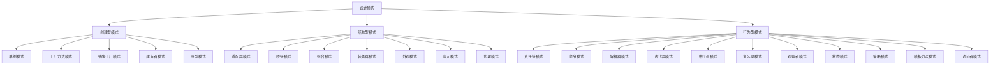

# 设计模式 - 软件工程的核心范式

## 目录

- [设计模式概述](#设计模式概述)
- [分类体系](#分类体系)
- [核心模式](#核心模式)
- [高级模式](#高级模式)
- [应用实践](#应用实践)

## 设计模式概述

### 1.1 定义与本质

**设计模式** (Design Pattern) 是软件工程中解决特定设计问题的标准化解决方案模板。它描述了在特定软件设计问题中重复出现的通用解决方案。

**形式化定义**:
设 $P$ 为设计问题空间，$S$ 为解决方案空间，设计模式 $D$ 是一个映射：
$$D: P \rightarrow S$$
其中 $D$ 满足：
- **可重用性**: $\forall p \in P, D(p)$ 可被多次应用
- **标准化**: $D$ 遵循公认的最佳实践
- **抽象性**: $D$ 独立于具体实现语言

### 1.2 设计原则

#### SOLID 原则

1. **单一职责原则 (SRP)**
   - 一个类应该只有一个引起它变化的原因
   - 形式化: $|Responsibilities(C)| = 1$

2. **开闭原则 (OCP)**
   - 软件实体应该对扩展开放，对修改关闭
   - 形式化: $\forall f \in Features, \exists Extension(f) \land \neg Modification(f)$

3. **里氏替换原则 (LSP)**
   - 子类必须能够替换其基类
   - 形式化: $\forall x \in BaseClass, \forall y \in DerivedClass, y \preceq x$

4. **接口隔离原则 (ISP)**
   - 客户端不应该依赖它不需要的接口
   - 形式化: $\forall I \in Interfaces, |Methods(I)| = \min$

5. **依赖倒置原则 (DIP)**
   - 高层模块不应该依赖低层模块，都应该依赖抽象
   - 形式化: $HighLevel \rightarrow Abstract \leftarrow LowLevel$

## 分类体系

### 2.1 按目的分类



### 2.2 按范围分类

- **类模式**: 处理类与子类之间的关系
- **对象模式**: 处理对象之间的关系

### 2.3 按复杂度分类

- **基础模式**: 单一职责，简单实现
- **复合模式**: 多个模式组合使用
- **架构模式**: 系统级设计模式

## 核心模式详解

### 3.1 创建型模式

#### 3.1.1 单例模式 (Singleton)

**定义**: 确保一个类只有一个实例，并提供全局访问点。

**形式化描述**:
$$\forall x, y \in Instance(Singleton), x = y$$

**Python 实现**:
```python
from typing import Optional
from threading import Lock
import weakref

class Singleton:
    """
    线程安全的单例模式实现
    支持懒加载和资源管理
    """
    _instance: Optional['Singleton'] = None
    _lock: Lock = Lock()
    _initialized: bool = False
    
    def __new__(cls) -> 'Singleton':
        if cls._instance is None:
            with cls._lock:
                if cls._instance is None:
                    cls._instance = super().__new__(cls)
        return cls._instance
    
    def __init__(self) -> None:
        if not self._initialized:
            with self._lock:
                if not self._initialized:
                    self._data: dict = {}
                    self._initialized = True
    
    def set_data(self, key: str, value: any) -> None:
        """设置数据"""
        self._data[key] = value
    
    def get_data(self, key: str) -> any:
        """获取数据"""
        return self._data.get(key)
    
    def __repr__(self) -> str:
        return f"Singleton(id={id(self)}, data={len(self._data)} items)"

# 使用示例
def demonstrate_singleton():
    """演示单例模式的使用"""
    # 创建多个实例
    s1 = Singleton()
    s2 = Singleton()
    
    # 验证是同一个实例
    assert s1 is s2, "单例模式失败：实例不唯一"
    
    # 设置和获取数据
    s1.set_data("config", {"debug": True})
    result = s2.get_data("config")
    
    print(f"实例1: {s1}")
    print(f"实例2: {s2}")
    print(f"数据: {result}")
    
    return s1 is s2

# 测试
if __name__ == "__main__":
    is_singleton = demonstrate_singleton()
    print(f"单例模式验证: {'成功' if is_singleton else '失败'}")
```

**数学证明**:
设 $S$ 为单例类，$x, y$ 为 $S$ 的实例。
根据单例模式的定义，$\forall x, y \in S, x = y$。
这等价于 $|S| = 1$，即集合 $S$ 的基数为1。

#### 3.1.2 工厂方法模式 (Factory Method)

**定义**: 定义一个创建对象的接口，让子类决定实例化哪一个类。

**形式化描述**:
$$FactoryMethod: Creator \times ProductType \rightarrow Product$$

**Python 实现**:
```python
from abc import ABC, abstractmethod
from typing import TypeVar, Generic, Dict, Type
from enum import Enum

# 产品类型枚举
class ProductType(Enum):
    CONCRETE_A = "concrete_a"
    CONCRETE_B = "concrete_b"

# 产品基类
class Product(ABC):
    """抽象产品类"""
    
    @abstractmethod
    def operation(self) -> str:
        """产品操作"""
        pass
    
    @abstractmethod
    def get_type(self) -> ProductType:
        """获取产品类型"""
        pass

# 具体产品
class ConcreteProductA(Product):
    """具体产品A"""
    
    def operation(self) -> str:
        return "ConcreteProductA operation"
    
    def get_type(self) -> ProductType:
        return ProductType.CONCRETE_A

class ConcreteProductB(Product):
    """具体产品B"""
    
    def operation(self) -> str:
        return "ConcreteProductB operation"
    
    def get_type(self) -> ProductType:
        return ProductType.CONCRETE_B

# 创建者基类
class Creator(ABC):
    """抽象创建者类"""
    
    @abstractmethod
    def factory_method(self) -> Product:
        """工厂方法"""
        pass
    
    def some_operation(self) -> str:
        """使用工厂方法创建产品并执行操作"""
        product = self.factory_method()
        return f"Creator: {product.operation()}"

# 具体创建者
class ConcreteCreatorA(Creator):
    """具体创建者A"""
    
    def factory_method(self) -> Product:
        return ConcreteProductA()

class ConcreteCreatorB(Creator):
    """具体创建者B"""
    
    def factory_method(self) -> Product:
        return ConcreteProductB()

# 工厂方法注册器
class ProductFactory:
    """产品工厂注册器"""
    
    def __init__(self):
        self._creators: Dict[ProductType, Type[Creator]] = {}
        self._register_default_creators()
    
    def _register_default_creators(self):
        """注册默认创建者"""
        self.register_creator(ProductType.CONCRETE_A, ConcreteCreatorA)
        self.register_creator(ProductType.CONCRETE_B, ConcreteCreatorB)
    
    def register_creator(self, product_type: ProductType, creator_class: Type[Creator]):
        """注册创建者"""
        self._creators[product_type] = creator_class
    
    def create_product(self, product_type: ProductType) -> Product:
        """创建产品"""
        if product_type not in self._creators:
            raise ValueError(f"Unknown product type: {product_type}")
        
        creator_class = self._creators[product_type]
        creator = creator_class()
        return creator.factory_method()

# 使用示例
def demonstrate_factory_method():
    """演示工厂方法模式"""
    factory = ProductFactory()
    
    # 创建不同类型的产品
    products = []
    for product_type in ProductType:
        try:
            product = factory.create_product(product_type)
            products.append(product)
            print(f"Created {product.get_type().value}: {product.operation()}")
        except ValueError as e:
            print(f"Error: {e}")
    
    return products

# 测试
if __name__ == "__main__":
    products = demonstrate_factory_method()
    print(f"创建了 {len(products)} 个产品")
```

### 3.2 结构型模式

#### 3.2.1 适配器模式 (Adapter)

**定义**: 将一个类的接口转换成客户期望的另一个接口。

**形式化描述**:
$$Adapter: TargetInterface \leftarrow Adaptee$$

**Python 实现**:
```python
from abc import ABC, abstractmethod
from typing import Protocol, runtime_checkable
import json
import xml.etree.ElementTree as ET

# 目标接口
class TargetInterface(Protocol):
    """目标接口"""
    
    def request(self) -> str:
        """请求方法"""
        ...

# 适配者类
class Adaptee:
    """需要适配的类"""
    
    def specific_request(self) -> dict:
        """特定的请求方法，返回字典"""
        return {
            "name": "Adaptee",
            "data": "specific data",
            "timestamp": "2024-01-01"
        }

# 适配器类
class Adapter:
    """适配器类"""
    
    def __init__(self, adaptee: Adaptee):
        self._adaptee = adaptee
    
    def request(self) -> str:
        """实现目标接口的请求方法"""
        # 调用适配者的特定方法并转换结果
        data = self._adaptee.specific_request()
        return json.dumps(data, indent=2)

# 客户端代码
class Client:
    """客户端类"""
    
    def __init__(self, target: TargetInterface):
        self._target = target
    
    def execute_request(self) -> str:
        """执行请求"""
        return self._target.request()

# 使用示例
def demonstrate_adapter():
    """演示适配器模式"""
    # 创建适配者
    adaptee = Adaptee()
    
    # 创建适配器
    adapter = Adapter(adaptee)
    
    # 客户端使用目标接口
    client = Client(adapter)
    
    # 执行请求
    result = client.execute_request()
    print("适配器模式结果:")
    print(result)
    
    return result

# 测试
if __name__ == "__main__":
    demonstrate_adapter()
```

### 3.3 行为型模式

#### 3.3.1 观察者模式 (Observer)

**定义**: 定义对象间的一种一对多的依赖关系，当一个对象的状态发生改变时，所有依赖于它的对象都得到通知并被自动更新。

**形式化描述**:
$$Observer: Subject \times Observer \rightarrow Notification$$

**Python 实现**:
```python
from abc import ABC, abstractmethod
from typing import List, Dict, Any, Callable
from dataclasses import dataclass
from datetime import datetime
import asyncio
from enum import Enum

# 事件类型枚举
class EventType(Enum):
    CREATED = "created"
    UPDATED = "updated"
    DELETED = "deleted"

# 事件数据类
@dataclass
class Event:
    """事件数据类"""
    type: EventType
    data: Any
    timestamp: datetime
    source: str

# 观察者接口
class Observer(ABC):
    """观察者接口"""
    
    @abstractmethod
    def update(self, event: Event) -> None:
        """更新方法"""
        pass

# 具体观察者
class ConcreteObserver(Observer):
    """具体观察者"""
    
    def __init__(self, name: str):
        self.name = name
        self.events: List[Event] = []
    
    def update(self, event: Event) -> None:
        """处理事件更新"""
        self.events.append(event)
        print(f"[{self.name}] 收到事件: {event.type.value} - {event.data}")
    
    def get_events(self) -> List[Event]:
        """获取所有事件"""
        return self.events.copy()

# 主题接口
class Subject(ABC):
    """主题接口"""
    
    @abstractmethod
    def attach(self, observer: Observer) -> None:
        """添加观察者"""
        pass
    
    @abstractmethod
    def detach(self, observer: Observer) -> None:
        """移除观察者"""
        pass
    
    @abstractmethod
    def notify(self, event: Event) -> None:
        """通知观察者"""
        pass

# 具体主题
class ConcreteSubject(Subject):
    """具体主题"""
    
    def __init__(self, name: str):
        self.name = name
        self._observers: List[Observer] = []
        self._state: Dict[str, Any] = {}
    
    def attach(self, observer: Observer) -> None:
        """添加观察者"""
        if observer not in self._observers:
            self._observers.append(observer)
            print(f"观察者 {getattr(observer, 'name', 'Unknown')} 已添加")
    
    def detach(self, observer: Observer) -> None:
        """移除观察者"""
        if observer in self._observers:
            self._observers.remove(observer)
            print(f"观察者 {getattr(observer, 'name', 'Unknown')} 已移除")
    
    def notify(self, event: Event) -> None:
        """通知所有观察者"""
        for observer in self._observers:
            observer.update(event)
    
    def set_state(self, key: str, value: Any) -> None:
        """设置状态"""
        old_value = self._state.get(key)
        self._state[key] = value
        
        # 创建事件
        event = Event(
            type=EventType.UPDATED if key in self._state else EventType.CREATED,
            data={"key": key, "old_value": old_value, "new_value": value},
            timestamp=datetime.now(),
            source=self.name
        )
        
        # 通知观察者
        self.notify(event)
    
    def delete_state(self, key: str) -> None:
        """删除状态"""
        if key in self._state:
            value = self._state.pop(key)
            
            # 创建事件
            event = Event(
                type=EventType.DELETED,
                data={"key": key, "value": value},
                timestamp=datetime.now(),
                source=self.name
            )
            
            # 通知观察者
            self.notify(event)

# 异步观察者模式
class AsyncObserver(Observer):
    """异步观察者"""
    
    def __init__(self, name: str, callback: Callable[[Event], None]):
        self.name = name
        self.callback = callback
    
    async def async_update(self, event: Event) -> None:
        """异步更新"""
        await asyncio.sleep(0.1)  # 模拟异步处理
        self.callback(event)
    
    def update(self, event: Event) -> None:
        """同步更新接口"""
        asyncio.create_task(self.async_update(event))

# 使用示例
def demonstrate_observer():
    """演示观察者模式"""
    # 创建主题
    subject = ConcreteSubject("数据管理器")
    
    # 创建观察者
    observer1 = ConcreteObserver("日志记录器")
    observer2 = ConcreteObserver("数据验证器")
    observer3 = AsyncObserver("异步处理器", 
                             lambda e: print(f"[异步] 处理事件: {e.type.value}"))
    
    # 添加观察者
    subject.attach(observer1)
    subject.attach(observer2)
    subject.attach(observer3)
    
    # 修改状态
    print("\n=== 修改状态 ===")
    subject.set_state("user_id", 12345)
    subject.set_state("username", "john_doe")
    subject.set_state("user_id", 54321)  # 更新
    subject.delete_state("username")     # 删除
    
    # 查看观察者状态
    print(f"\n=== 观察者状态 ===")
    print(f"日志记录器收到 {len(observer1.get_events())} 个事件")
    print(f"数据验证器收到 {len(observer2.get_events())} 个事件")
    
    return subject, [observer1, observer2, observer3]

# 测试
if __name__ == "__main__":
    subject, observers = demonstrate_observer()
```

## 高级模式

### 4.1 并发模式

#### 4.1.1 生产者-消费者模式

```python
import asyncio
import random
from typing import List, Optional
from dataclasses import dataclass
from datetime import datetime

@dataclass
class Task:
    """任务数据类"""
    id: int
    data: str
    created_at: datetime
    priority: int = 1

class AsyncQueue:
    """异步队列"""
    
    def __init__(self, maxsize: int = 100):
        self._queue = asyncio.Queue(maxsize=maxsize)
        self._processed_count = 0
    
    async def put(self, item: Task) -> None:
        """放入任务"""
        await self._queue.put(item)
    
    async def get(self) -> Task:
        """获取任务"""
        return await self._queue.get()
    
    def task_done(self) -> None:
        """标记任务完成"""
        self._queue.task_done()
        self._processed_count += 1
    
    @property
    def size(self) -> int:
        """队列大小"""
        return self._queue.qsize()
    
    @property
    def processed_count(self) -> int:
        """已处理任务数"""
        return self._processed_count

class Producer:
    """生产者"""
    
    def __init__(self, queue: AsyncQueue, name: str):
        self.queue = queue
        self.name = name
        self._task_id = 0
    
    async def produce(self, count: int) -> None:
        """生产任务"""
        for i in range(count):
            task = Task(
                id=self._task_id,
                data=f"Task data from {self.name}",
                created_at=datetime.now(),
                priority=random.randint(1, 5)
            )
            
            await self.queue.put(task)
            print(f"[{self.name}] 生产任务 {task.id}")
            
            self._task_id += 1
            await asyncio.sleep(random.uniform(0.1, 0.5))

class Consumer:
    """消费者"""
    
    def __init__(self, queue: AsyncQueue, name: str):
        self.queue = queue
        self.name = name
    
    async def consume(self) -> None:
        """消费任务"""
        while True:
            try:
                task = await self.queue.get()
                
                # 处理任务
                await self._process_task(task)
                
                # 标记任务完成
                self.queue.task_done()
                
            except asyncio.CancelledError:
                break
    
    async def _process_task(self, task: Task) -> None:
        """处理单个任务"""
        print(f"[{self.name}] 处理任务 {task.id} (优先级: {task.priority})")
        
        # 模拟处理时间
        await asyncio.sleep(random.uniform(0.2, 1.0))
        
        print(f"[{self.name}] 完成任务 {task.id}")

async def demonstrate_producer_consumer():
    """演示生产者-消费者模式"""
    # 创建队列
    queue = AsyncQueue(maxsize=50)
    
    # 创建生产者和消费者
    producers = [
        Producer(queue, f"Producer-{i}")
        for i in range(3)
    ]
    
    consumers = [
        Consumer(queue, f"Consumer-{i}")
        for i in range(5)
    ]
    
    # 启动消费者
    consumer_tasks = [
        asyncio.create_task(consumer.consume())
        for consumer in consumers
    ]
    
    # 启动生产者
    producer_tasks = [
        asyncio.create_task(producer.produce(10))
        for producer in producers
    ]
    
    # 等待生产者完成
    await asyncio.gather(*producer_tasks)
    
    # 等待队列清空
    await queue._queue.join()
    
    # 取消消费者
    for task in consumer_tasks:
        task.cancel()
    
    # 等待消费者结束
    await asyncio.gather(*consumer_tasks, return_exceptions=True)
    
    print(f"\n=== 统计信息 ===")
    print(f"队列大小: {queue.size}")
    print(f"已处理任务: {queue.processed_count}")

# 测试
if __name__ == "__main__":
    asyncio.run(demonstrate_producer_consumer())
```

## 应用实践

### 5.1 模式组合

```python
from typing import Dict, Any, Optional
from dataclasses import dataclass
from enum import Enum
import json

# 配置类型
class ConfigType(Enum):
    DATABASE = "database"
    CACHE = "cache"
    API = "api"

# 配置数据类
@dataclass
class DatabaseConfig:
    host: str
    port: int
    database: str
    username: str
    password: str

@dataclass
class CacheConfig:
    host: str
    port: int
    db: int

@dataclass
class APIConfig:
    host: str
    port: int
    timeout: int

# 配置工厂
class ConfigFactory:
    """配置工厂 - 工厂方法模式"""
    
    @staticmethod
    def create_config(config_type: ConfigType, data: Dict[str, Any]):
        if config_type == ConfigType.DATABASE:
            return DatabaseConfig(**data)
        elif config_type == ConfigType.CACHE:
            return CacheConfig(**data)
        elif config_type == ConfigType.API:
            return APIConfig(**data)
        else:
            raise ValueError(f"Unknown config type: {config_type}")

# 配置管理器 - 单例模式
class ConfigManager:
    """配置管理器 - 单例模式"""
    
    _instance: Optional['ConfigManager'] = None
    _configs: Dict[ConfigType, Any] = {}
    
    def __new__(cls):
        if cls._instance is None:
            cls._instance = super().__new__(cls)
        return cls._instance
    
    def set_config(self, config_type: ConfigType, config: Any) -> None:
        """设置配置"""
        self._configs[config_type] = config
    
    def get_config(self, config_type: ConfigType) -> Any:
        """获取配置"""
        return self._configs.get(config_type)
    
    def load_from_file(self, file_path: str) -> None:
        """从文件加载配置"""
        with open(file_path, 'r') as f:
            data = json.load(f)
            
        for config_type_str, config_data in data.items():
            config_type = ConfigType(config_type_str)
            config = ConfigFactory.create_config(config_type, config_data)
            self.set_config(config_type, config)

# 配置观察者 - 观察者模式
class ConfigObserver:
    """配置观察者"""
    
    def __init__(self, name: str):
        self.name = name
    
    def on_config_changed(self, config_type: ConfigType, config: Any) -> None:
        """配置变更回调"""
        print(f"[{self.name}] 配置变更: {config_type.value}")

# 配置适配器 - 适配器模式
class ConfigAdapter:
    """配置适配器"""
    
    def __init__(self, config_manager: ConfigManager):
        self._config_manager = config_manager
    
    def get_database_url(self) -> str:
        """获取数据库URL"""
        config = self._config_manager.get_config(ConfigType.DATABASE)
        if config:
            return f"postgresql://{config.username}:{config.password}@{config.host}:{config.port}/{config.database}"
        return ""
    
    def get_cache_url(self) -> str:
        """获取缓存URL"""
        config = self._config_manager.get_config(ConfigType.CACHE)
        if config:
            return f"redis://{config.host}:{config.port}/{config.db}"
        return ""

# 使用示例
def demonstrate_pattern_combination():
    """演示模式组合使用"""
    # 创建配置管理器（单例）
    config_manager = ConfigManager()
    
    # 加载配置
    config_data = {
        "database": {
            "host": "localhost",
            "port": 5432,
            "database": "mydb",
            "username": "user",
            "password": "pass"
        },
        "cache": {
            "host": "localhost",
            "port": 6379,
            "db": 0
        },
        "api": {
            "host": "0.0.0.0",
            "port": 8000,
            "timeout": 30
        }
    }
    
    # 使用工厂创建配置
    for config_type_str, config_data_item in config_data.items():
        config_type = ConfigType(config_type_str)
        config = ConfigFactory.create_config(config_type, config_data_item)
        config_manager.set_config(config_type, config)
    
    # 使用适配器获取格式化的配置
    adapter = ConfigAdapter(config_manager)
    
    print("=== 配置信息 ===")
    print(f"数据库URL: {adapter.get_database_url()}")
    print(f"缓存URL: {adapter.get_cache_url()}")
    
    # 获取原始配置
    db_config = config_manager.get_config(ConfigType.DATABASE)
    print(f"数据库配置: {db_config}")
    
    return config_manager, adapter

# 测试
if __name__ == "__main__":
    config_manager, adapter = demonstrate_pattern_combination()
```

## 总结

设计模式是软件工程中的核心概念，它们提供了：

1. **标准化解决方案**: 为常见设计问题提供经过验证的解决方案
2. **代码复用**: 通过模式复用提高开发效率
3. **可维护性**: 标准化的代码结构便于维护和理解
4. **可扩展性**: 模式化的设计便于系统扩展

通过深入理解这些模式，开发者可以：
- 设计出更加优雅和可维护的代码
- 提高代码的可读性和可理解性
- 减少重复代码，提高开发效率
- 构建更加健壮和可扩展的系统

---

*相关链接*:
- [创建型模式详解](./01-创建型模式/README.md)
- [结构型模式详解](./02-结构型模式/README.md)
- [行为型模式详解](./03-行为型模式/README.md)
- [并发模式详解](./04-并发模式/README.md)
- [架构模式详解](./05-架构模式/README.md) 