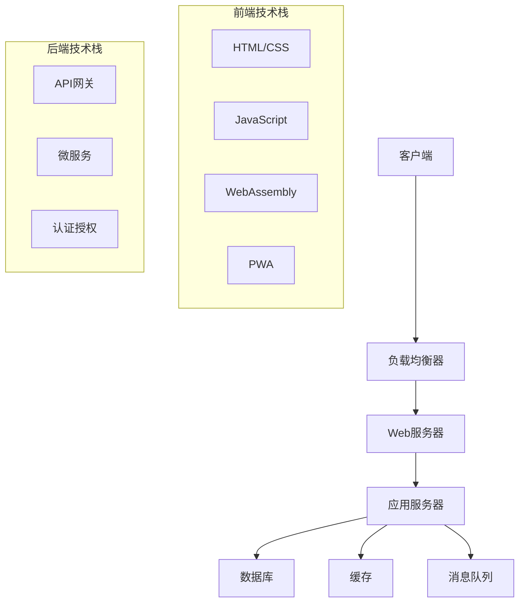

# 04-01-01 Web架构基础

## 📋 目录

- [04-01-01 Web架构基础](#04-01-01-web架构基础)
  - [📋 目录](#-目录)
  - [🎯 概述](#-概述)
  - [🔬 概念定义](#-概念定义)
  - [📐 数学形式化](#-数学形式化)
  - [🐍 Python实现](#-python实现)
  - [📊 架构模式](#-架构模式)
  - [🔄 工作流程](#-工作流程)
  - [📈 应用案例](#-应用案例)
  - [🔗 相关链接](#-相关链接)

## 🎯 概述

Web架构是现代互联网应用的基础，涵盖了从客户端到服务器的完整技术栈。本文档从形式化定义、数学基础、Python实现等多个维度全面阐述Web架构的基础理论。

## 🔬 概念定义

### 定义 1.1 (Web架构)
Web架构是构建Web应用的系统化方法，形式化定义为：

$$WA = (C, S, N, P, D)$$

其中：
- $C$ 是客户端系统
- $S$ 是服务器系统
- $N$ 是网络通信
- $P$ 是协议栈
- $D$ 是数据存储

### 定义 1.2 (客户端-服务器模型)
客户端-服务器模型是Web架构的核心模式：

$$CS = (Client, Server, Protocol)$$

其中：
- $Client$ 是请求发起方
- $Server$ 是服务提供方
- $Protocol$ 是通信协议

### 定义 1.3 (REST架构)
REST（Representational State Transfer）是一种软件架构风格：

$$REST = (Resources, Representations, State, Transitions)$$

其中：
- $Resources$ 是资源集合
- $Representations$ 是资源表示
- $State$ 是应用状态
- $Transitions$ 是状态转换

## 📐 数学形式化

### 定理 1.1 (HTTP状态码分类)
HTTP状态码遵循数学分类原则：

$$HTTP_{status} = \{1xx, 2xx, 3xx, 4xx, 5xx\}$$

其中：
- $1xx$ 是信息性响应
- $2xx$ 是成功响应
- $3xx$ 是重定向
- $4xx$ 是客户端错误
- $5xx$ 是服务器错误

### 定理 1.2 (URL解析)
URL可以形式化解析为：

$$URL = (scheme, authority, path, query, fragment)$$

其中：
- $scheme$ 是协议方案
- $authority$ 是授权信息
- $path$ 是路径
- $query$ 是查询参数
- $fragment$ 是片段标识符

### 定义 1.4 (WebAssembly虚拟机)
WebAssembly虚拟机形式化定义为：

$$WASM_{VM} = (S, I, T, M, E)$$

其中：
- $S$ 是状态空间
- $I$ 是指令集
- $T$ 是类型系统
- $M$ 是模块系统
- $E$ 是执行语义

## 🐍 Python实现

### 1. Web服务器基础实现

```python
import socket
import threading
import json
import urllib.parse
from typing import Dict, Any, Callable
from http.server import BaseHTTPRequestHandler, HTTPServer
import asyncio
import aiohttp
from aiohttp import web
import ssl

class WebServer:
    """Web服务器基础实现"""
    
    def __init__(self, host: str = 'localhost', port: int = 8000):
        self.host = host
        self.port = port
        self.routes = {}
        self.middleware = []
        self.static_files = {}
    
    def route(self, path: str, methods: list = None):
        """路由装饰器"""
        if methods is None:
            methods = ['GET']
        
        def decorator(func: Callable):
            for method in methods:
                route_key = f"{method}:{path}"
                self.routes[route_key] = func
            return func
        return decorator
    
    def add_middleware(self, middleware_func: Callable):
        """添加中间件"""
        self.middleware.append(middleware_func)
    
    def serve_static(self, path: str, content: str, content_type: str = 'text/plain'):
        """提供静态文件"""
        self.static_files[path] = {'content': content, 'type': content_type}
    
    def start(self):
        """启动服务器"""
        server = HTTPServer((self.host, self.port), self._create_handler())
        print(f"服务器启动在 http://{self.host}:{self.port}")
        
        try:
            server.serve_forever()
        except KeyboardInterrupt:
            print("\n服务器关闭")
            server.shutdown()

class HTTPRequestHandler(BaseHTTPRequestHandler):
    """HTTP请求处理器"""
    
    def __init__(self, *args, routes=None, middleware=None, static_files=None, **kwargs):
        self.routes = routes or {}
        self.middleware = middleware or []
        self.static_files = static_files or {}
        super().__init__(*args, **kwargs)
    
    def do_GET(self):
        """处理GET请求"""
        self._handle_request('GET')
    
    def do_POST(self):
        """处理POST请求"""
        self._handle_request('POST')
    
    def do_PUT(self):
        """处理PUT请求"""
        self._handle_request('PUT')
    
    def do_DELETE(self):
        """处理DELETE请求"""
        self._handle_request('DELETE')
    
    def _handle_request(self, method: str):
        """处理请求"""
        # 解析URL
        parsed_url = urllib.parse.urlparse(self.path)
        path = parsed_url.path
        query_params = urllib.parse.parse_qs(parsed_url.query)
        
        # 检查静态文件
        if path in self.static_files:
            self._serve_static_file(path)
            return
        
        # 查找路由
        route_key = f"{method}:{path}"
        handler = self.routes.get(route_key)
        
        if handler:
            # 执行中间件
            request_data = self._get_request_data()
            for middleware in self.middleware:
                request_data = middleware(request_data)
            
            # 执行处理器
            try:
                response = handler(request_data, query_params)
                self._send_response(response)
            except Exception as e:
                self._send_error_response(500, str(e))
        else:
            self._send_error_response(404, "Not Found")
    
    def _get_request_data(self) -> Dict[str, Any]:
        """获取请求数据"""
        content_length = int(self.headers.get('Content-Length', 0))
        if content_length > 0:
            body = self.rfile.read(content_length)
            try:
                return json.loads(body.decode('utf-8'))
            except json.JSONDecodeError:
                return {'raw_body': body.decode('utf-8')}
        return {}
    
    def _serve_static_file(self, path: str):
        """提供静态文件"""
        file_info = self.static_files[path]
        self.send_response(200)
        self.send_header('Content-Type', file_info['type'])
        self.end_headers()
        self.wfile.write(file_info['content'].encode('utf-8'))
    
    def _send_response(self, response: Dict[str, Any]):
        """发送响应"""
        self.send_response(200)
        self.send_header('Content-Type', 'application/json')
        self.end_headers()
        self.wfile.write(json.dumps(response).encode('utf-8'))
    
    def _send_error_response(self, status_code: int, message: str):
        """发送错误响应"""
        self.send_response(status_code)
        self.send_header('Content-Type', 'application/json')
        self.end_headers()
        error_response = {'error': message, 'status_code': status_code}
        self.wfile.write(json.dumps(error_response).encode('utf-8'))

class AsyncWebServer:
    """异步Web服务器"""
    
    def __init__(self):
        self.app = web.Application()
        self.routes = {}
    
    def route(self, path: str, methods: list = None):
        """路由装饰器"""
        if methods is None:
            methods = ['GET']
        
        def decorator(func: Callable):
            async def async_handler(request):
                try:
                    if request.method in methods:
                        data = await request.json() if request.content_type == 'application/json' else {}
                        result = await func(data, request.query)
                        return web.json_response(result)
                    else:
                        return web.json_response({'error': 'Method not allowed'}, status=405)
                except Exception as e:
                    return web.json_response({'error': str(e)}, status=500)
            
            self.app.router.add_route('*', path, async_handler)
            return func
        return decorator
    
    async def start(self, host: str = 'localhost', port: int = 8080):
        """启动异步服务器"""
        runner = web.AppRunner(self.app)
        await runner.setup()
        site = web.TCPSite(runner, host, port)
        await site.start()
        print(f"异步服务器启动在 http://{host}:{port}")
        
        try:
            await asyncio.Future()  # 保持运行
        except KeyboardInterrupt:
            await runner.cleanup()

class WebAssemblyRuntime:
    """WebAssembly运行时模拟"""
    
    def __init__(self):
        self.memory = bytearray(65536)  # 64KB内存
        self.stack = []
        self.globals = {}
        self.functions = {}
    
    def load_module(self, wasm_bytes: bytes):
        """加载WebAssembly模块"""
        # 简化的模块加载
        if wasm_bytes[:4] != b'\x00asm':
            raise ValueError("Invalid WebAssembly module")
        
        # 解析模块结构
        self._parse_module(wasm_bytes)
    
    def _parse_module(self, wasm_bytes: bytes):
        """解析模块"""
        # 跳过魔数和版本
        offset = 8
        
        while offset < len(wasm_bytes):
            section_id = wasm_bytes[offset]
            offset += 1
            
            if section_id == 1:  # 类型段
                offset = self._parse_type_section(wasm_bytes, offset)
            elif section_id == 3:  # 函数段
                offset = self._parse_function_section(wasm_bytes, offset)
            elif section_id == 10:  # 代码段
                offset = self._parse_code_section(wasm_bytes, offset)
            else:
                # 跳过其他段
                section_size = int.from_bytes(wasm_bytes[offset:offset+4], 'little')
                offset += 4 + section_size
    
    def _parse_type_section(self, wasm_bytes: bytes, offset: int) -> int:
        """解析类型段"""
        section_size = int.from_bytes(wasm_bytes[offset:offset+4], 'little')
        offset += 4
        
        # 简化的类型解析
        return offset + section_size
    
    def _parse_function_section(self, wasm_bytes: bytes, offset: int) -> int:
        """解析函数段"""
        section_size = int.from_bytes(wasm_bytes[offset:offset+4], 'little')
        offset += 4
        
        # 简化的函数解析
        return offset + section_size
    
    def _parse_code_section(self, wasm_bytes: bytes, offset: int) -> int:
        """解析代码段"""
        section_size = int.from_bytes(wasm_bytes[offset:offset+4], 'little')
        offset += 4
        
        # 简化的代码解析
        return offset + section_size
    
    def call_function(self, func_name: str, *args):
        """调用函数"""
        if func_name not in self.functions:
            raise ValueError(f"Function {func_name} not found")
        
        # 将参数压入栈
        for arg in args:
            self.stack.append(arg)
        
        # 执行函数（简化实现）
        return self.stack.pop() if self.stack else None

class RESTfulAPI:
    """RESTful API实现"""
    
    def __init__(self):
        self.resources = {}
        self.routes = {}
    
    def add_resource(self, resource_name: str, resource_data: Dict[str, Any]):
        """添加资源"""
        self.resources[resource_name] = resource_data
    
    def get_resource(self, resource_name: str) -> Dict[str, Any]:
        """获取资源"""
        return self.resources.get(resource_name, {})
    
    def update_resource(self, resource_name: str, data: Dict[str, Any]):
        """更新资源"""
        if resource_name in self.resources:
            self.resources[resource_name].update(data)
    
    def delete_resource(self, resource_name: str):
        """删除资源"""
        if resource_name in self.resources:
            del self.resources[resource_name]
    
    def list_resources(self) -> List[str]:
        """列出所有资源"""
        return list(self.resources.keys())
    
    def search_resources(self, query: str) -> Dict[str, Any]:
        """搜索资源"""
        results = {}
        for name, data in self.resources.items():
            if query.lower() in name.lower():
                results[name] = data
        return results

class WebSocketServer:
    """WebSocket服务器"""
    
    def __init__(self, host: str = 'localhost', port: int = 8080):
        self.host = host
        self.port = port
        self.clients = set()
        self.message_handlers = {}
    
    async def start(self):
        """启动WebSocket服务器"""
        async def websocket_handler(websocket, path):
            self.clients.add(websocket)
            try:
                async for message in websocket:
                    await self._handle_message(websocket, message)
            except Exception as e:
                print(f"WebSocket错误: {e}")
            finally:
                self.clients.remove(websocket)
        
        # 这里需要实际的WebSocket库实现
        print(f"WebSocket服务器启动在 ws://{self.host}:{self.port}")
    
    async def _handle_message(self, websocket, message: str):
        """处理消息"""
        try:
            data = json.loads(message)
            message_type = data.get('type')
            
            if message_type in self.message_handlers:
                await self.message_handlers[message_type](websocket, data)
            else:
                await websocket.send(json.dumps({'error': 'Unknown message type'}))
        except json.JSONDecodeError:
            await websocket.send(json.dumps({'error': 'Invalid JSON'}))
    
    def add_message_handler(self, message_type: str, handler: Callable):
        """添加消息处理器"""
        self.message_handlers[message_type] = handler
    
    async def broadcast(self, message: str):
        """广播消息"""
        for client in self.clients:
            try:
                await client.send(message)
            except Exception as e:
                print(f"广播错误: {e}")
```

### 2. 客户端实现

```python
class WebClient:
    """Web客户端"""
    
    def __init__(self, base_url: str = 'http://localhost:8000'):
        self.base_url = base_url
        self.session = None
    
    async def __aenter__(self):
        """异步上下文管理器入口"""
        self.session = aiohttp.ClientSession()
        return self
    
    async def __aexit__(self, exc_type, exc_val, exc_tb):
        """异步上下文管理器出口"""
        if self.session:
            await self.session.close()
    
    async def get(self, path: str, params: Dict[str, Any] = None) -> Dict[str, Any]:
        """GET请求"""
        url = f"{self.base_url}{path}"
        async with self.session.get(url, params=params) as response:
            return await response.json()
    
    async def post(self, path: str, data: Dict[str, Any] = None) -> Dict[str, Any]:
        """POST请求"""
        url = f"{self.base_url}{path}"
        async with self.session.post(url, json=data) as response:
            return await response.json()
    
    async def put(self, path: str, data: Dict[str, Any] = None) -> Dict[str, Any]:
        """PUT请求"""
        url = f"{self.base_url}{path}"
        async with self.session.put(url, json=data) as response:
            return await response.json()
    
    async def delete(self, path: str) -> Dict[str, Any]:
        """DELETE请求"""
        url = f"{self.base_url}{path}"
        async with self.session.delete(url) as response:
            return await response.json()

class WebAssemblyClient:
    """WebAssembly客户端模拟"""
    
    def __init__(self):
        self.modules = {}
        self.exports = {}
    
    def load_module(self, module_name: str, wasm_bytes: bytes):
        """加载WebAssembly模块"""
        runtime = WebAssemblyRuntime()
        runtime.load_module(wasm_bytes)
        self.modules[module_name] = runtime
    
    def call_function(self, module_name: str, func_name: str, *args):
        """调用WebAssembly函数"""
        if module_name not in self.modules:
            raise ValueError(f"Module {module_name} not found")
        
        return self.modules[module_name].call_function(func_name, *args)
    
    def get_export(self, module_name: str, export_name: str):
        """获取导出项"""
        if module_name not in self.modules:
            raise ValueError(f"Module {module_name} not found")
        
        return self.modules[module_name].functions.get(export_name)

class ProgressiveWebApp:
    """渐进式Web应用"""
    
    def __init__(self, name: str, version: str = "1.0.0"):
        self.name = name
        self.version = version
        self.manifest = self._create_manifest()
        self.service_worker = self._create_service_worker()
    
    def _create_manifest(self) -> Dict[str, Any]:
        """创建应用清单"""
        return {
            "name": self.name,
            "short_name": self.name,
            "version": self.version,
            "start_url": "/",
            "display": "standalone",
            "background_color": "#ffffff",
            "theme_color": "#000000",
            "icons": [
                {
                    "src": "/icon-192.png",
                    "sizes": "192x192",
                    "type": "image/png"
                },
                {
                    "src": "/icon-512.png",
                    "sizes": "512x512",
                    "type": "image/png"
                }
            ]
        }
    
    def _create_service_worker(self) -> str:
        """创建Service Worker"""
        return """
        const CACHE_NAME = 'pwa-cache-v1';
        const urlsToCache = [
            '/',
            '/static/css/style.css',
            '/static/js/app.js'
        ];

        self.addEventListener('install', event => {
            event.waitUntil(
                caches.open(CACHE_NAME)
                    .then(cache => cache.addAll(urlsToCache))
            );
        });

        self.addEventListener('fetch', event => {
            event.respondWith(
                caches.match(event.request)
                    .then(response => response || fetch(event.request))
            );
        });
        """
    
    def generate_manifest_json(self) -> str:
        """生成清单JSON"""
        return json.dumps(self.manifest, indent=2)
    
    def generate_service_worker_js(self) -> str:
        """生成Service Worker JavaScript"""
        return self.service_worker
```

## 📊 架构模式

### 常见Web架构模式

| 模式 | 适用场景 | 优点 | 缺点 | 复杂度 |
|------|----------|------|------|--------|
| 单体架构 | 小型应用 | 简单、部署容易 | 扩展性差、维护困难 | 低 |
| 微服务架构 | 大型应用 | 可扩展、独立部署 | 分布式复杂性 | 高 |
| 无服务器架构 | 事件驱动 | 自动扩展、按需付费 | 冷启动延迟 | 中 |
| JAMstack | 静态内容 | 性能好、安全性高 | 动态功能有限 | 低 |

### 架构图



## 🔄 工作流程

### Web应用开发流程

```python
def web_development_workflow():
    """Web应用开发完整流程"""
    
    # 1. 创建Web服务器
    server = WebServer(host='localhost', port=8000)
    
    # 2. 定义路由
    @server.route('/api/users', methods=['GET'])
    def get_users(request_data, query_params):
        return {'users': ['user1', 'user2', 'user3']}
    
    @server.route('/api/users', methods=['POST'])
    def create_user(request_data, query_params):
        return {'message': 'User created', 'user': request_data}
    
    # 3. 添加中间件
    def logging_middleware(request_data):
        print(f"请求数据: {request_data}")
        return request_data
    
    server.add_middleware(logging_middleware)
    
    # 4. 提供静态文件
    server.serve_static('/index.html', '''
    <!DOCTYPE html>
    <html>
    <head><title>Web应用</title></head>
    <body><h1>Hello Web!</h1></body>
    </html>
    ''', 'text/html')
    
    # 5. 创建RESTful API
    api = RESTfulAPI()
    api.add_resource('users', {'id': 1, 'name': 'John'})
    api.add_resource('products', {'id': 1, 'name': 'Product 1'})
    
    # 6. 创建WebAssembly运行时
    wasm_runtime = WebAssemblyRuntime()
    
    # 7. 创建PWA
    pwa = ProgressiveWebApp("My Web App")
    
    print("Web应用开发流程完成")
    print(f"API资源: {api.list_resources()}")
    print(f"PWA清单: {pwa.generate_manifest_json()}")
    
    return server, api, wasm_runtime, pwa

# 运行开发流程
if __name__ == "__main__":
    server, api, wasm_runtime, pwa = web_development_workflow()
```

## 📈 应用案例

### 案例1：RESTful API服务

```python
def restful_api_example():
    """RESTful API示例"""
    
    # 创建API
    api = RESTfulAPI()
    
    # 添加用户资源
    api.add_resource('users/1', {
        'id': 1,
        'name': 'John Doe',
        'email': 'john@example.com',
        'role': 'user'
    })
    
    api.add_resource('users/2', {
        'id': 2,
        'name': 'Jane Smith',
        'email': 'jane@example.com',
        'role': 'admin'
    })
    
    # 添加产品资源
    api.add_resource('products/1', {
        'id': 1,
        'name': 'Laptop',
        'price': 999.99,
        'category': 'electronics'
    })
    
    # API操作演示
    print("=== RESTful API 示例 ===")
    
    # 获取资源
    user1 = api.get_resource('users/1')
    print(f"用户1: {user1}")
    
    # 更新资源
    api.update_resource('users/1', {'name': 'John Updated'})
    updated_user = api.get_resource('users/1')
    print(f"更新后的用户1: {updated_user}")
    
    # 搜索资源
    search_results = api.search_resources('user')
    print(f"搜索'user'的结果: {search_results}")
    
    # 列出所有资源
    all_resources = api.list_resources()
    print(f"所有资源: {all_resources}")
    
    return api
```

### 案例2：WebAssembly集成

```python
def webassembly_integration_example():
    """WebAssembly集成示例"""
    
    # 创建WebAssembly客户端
    wasm_client = WebAssemblyClient()
    
    # 模拟WebAssembly模块字节码
    # 这是一个简单的加法函数模块
    wasm_module = b'\x00asm\x01\x00\x00\x00'  # 魔数和版本
    
    # 加载模块
    wasm_client.load_module('math', wasm_module)
    
    # 模拟函数调用
    try:
        result = wasm_client.call_function('math', 'add', 5, 3)
        print(f"WebAssembly计算结果: {result}")
    except Exception as e:
        print(f"WebAssembly调用错误: {e}")
    
    # 创建运行时
    runtime = WebAssemblyRuntime()
    
    # 模拟内存操作
    runtime.memory[0] = 42
    print(f"WebAssembly内存[0]: {runtime.memory[0]}")
    
    return wasm_client, runtime
```

### 案例3：PWA应用

```python
def progressive_web_app_example():
    """渐进式Web应用示例"""
    
    # 创建PWA
    pwa = ProgressiveWebApp("My PWA App", "2.0.0")
    
    # 生成文件
    manifest_json = pwa.generate_manifest_json()
    service_worker_js = pwa.generate_service_worker_js()
    
    print("=== PWA 应用示例 ===")
    print("应用清单:")
    print(manifest_json)
    print("\nService Worker:")
    print(service_worker_js)
    
    # 创建HTML文件
    html_content = f'''
    <!DOCTYPE html>
    <html lang="zh-CN">
    <head>
        <meta charset="UTF-8">
        <meta name="viewport" content="width=device-width, initial-scale=1.0">
        <title>{pwa.name}</title>
        <link rel="manifest" href="/manifest.json">
        <meta name="theme-color" content="#000000">
    </head>
    <body>
        <h1>{pwa.name}</h1>
        <p>这是一个渐进式Web应用</p>
        <script>
            if ('serviceWorker' in navigator) {{
                navigator.serviceWorker.register('/sw.js')
                    .then(registration => {{
                        console.log('Service Worker 注册成功');
                    }})
                    .catch(error => {{
                        console.log('Service Worker 注册失败:', error);
                    }});
            }}
        </script>
    </body>
    </html>
    '''
    
    print("\nHTML文件:")
    print(html_content)
    
    return pwa, html_content
```

## 🔗 相关链接

- [04-01-02-前端技术栈](./04-01-02-前端技术栈.md)
- [04-01-03-后端技术栈](./04-01-03-后端技术栈.md)
- [05-架构领域/05-01-系统架构/05-01-01-架构基础](../05-架构领域/05-01-系统架构/05-01-01-架构基础.md)
- [01-形式科学/01-01-数学基础/01-01-01-集合论基础](../01-形式科学/01-01-数学基础/01-01-01-集合论基础.md)

---

**文档版本**：1.0  
**最后更新**：2024年  
**维护者**：AI助手
