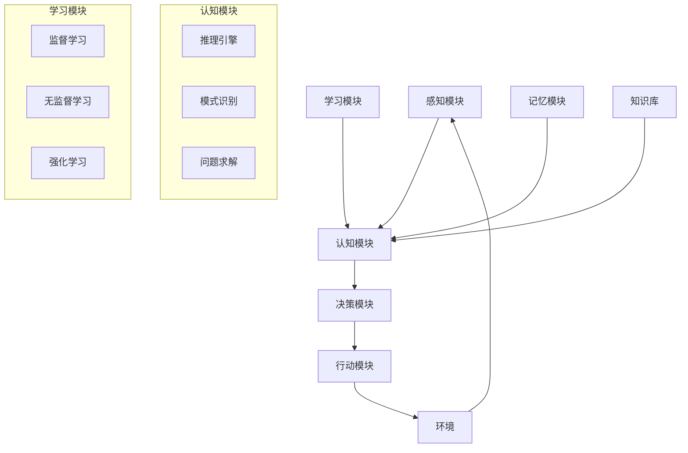

# 04-02-01 人工智能基础

## 📋 目录

- [04-02-01 人工智能基础](#04-02-01-人工智能基础)
  - [📋 目录](#-目录)
  - [🎯 概述](#-概述)
  - [🔬 概念定义](#-概念定义)
  - [📐 数学形式化](#-数学形式化)
  - [🐍 Python实现](#-python实现)
  - [📊 架构设计](#-架构设计)
  - [🔄 工作流程](#-工作流程)
  - [📈 应用案例](#-应用案例)
  - [🔗 相关链接](#-相关链接)

## 🎯 概述

人工智能（Artificial Intelligence, AI）是计算机科学的一个分支，旨在创建能够执行通常需要人类智能的任务的系统。本文档从形式化定义、数学基础、Python实现等多个维度全面阐述人工智能的基础理论。

## 🔬 概念定义

### 定义 1.1 (人工智能)
人工智能是研究如何使计算机系统能够模拟、延伸和扩展人类智能的科学与技术。形式化定义为：

$$AI = (S, A, T, R, \gamma)$$

其中：
- $S$ 是状态空间
- $A$ 是动作空间  
- $T: S \times A \rightarrow S$ 是状态转移函数
- $R: S \times A \rightarrow \mathbb{R}$ 是奖励函数
- $\gamma \in [0,1]$ 是折扣因子

### 定义 1.2 (智能系统)
智能系统是一个能够感知环境、学习、推理、规划和行动的自主系统：

$$IS = (P, L, R, A, M)$$

其中：
- $P$ 是感知模块
- $L$ 是学习模块
- $R$ 是推理模块
- $A$ 是行动模块
- $M$ 是记忆模块

## 📐 数学形式化

### 定理 1.1 (图灵完备性)
任何可计算的函数都可以被图灵机计算，人工智能系统在理论上可以达到图灵完备性。

**证明**：
设 $f: \mathbb{N} \rightarrow \mathbb{N}$ 是可计算函数，存在图灵机 $M$ 使得：
$$\forall n \in \mathbb{N}, M(n) = f(n)$$

### 定理 1.2 (学习理论)
给定训练集 $D = \{(x_i, y_i)\}_{i=1}^n$，学习算法的泛化误差上界为：

$$R(f) \leq \hat{R}(f) + \sqrt{\frac{\log(|\mathcal{F}|) + \log(1/\delta)}{2n}}$$

其中：
- $R(f)$ 是真实风险
- $\hat{R}(f)$ 是经验风险
- $|\mathcal{F}|$ 是假设空间大小
- $\delta$ 是置信度参数

### 定义 1.3 (神经网络)
人工神经网络是一个由神经元组成的计算模型：

$$y = \sigma(W^T x + b)$$

其中：
- $x \in \mathbb{R}^n$ 是输入向量
- $W \in \mathbb{R}^{n \times m}$ 是权重矩阵
- $b \in \mathbb{R}^m$ 是偏置向量
- $\sigma$ 是激活函数

## 🐍 Python实现

### 1. 基础神经网络实现

```python
import numpy as np
import matplotlib.pyplot as plt
from typing import List, Tuple, Optional
import torch
import torch.nn as nn
import torch.optim as optim

class ArtificialIntelligence:
    """人工智能基础类"""
    
    def __init__(self, name: str, capabilities: List[str]):
        self.name = name
        self.capabilities = capabilities
        self.knowledge_base = {}
        self.learning_history = []
    
    def perceive(self, environment: dict) -> dict:
        """感知环境"""
        perception = {
            'timestamp': environment.get('timestamp'),
            'sensors': environment.get('sensors', {}),
            'context': environment.get('context', {})
        }
        return perception
    
    def learn(self, data: np.ndarray, labels: np.ndarray) -> float:
        """学习过程"""
        # 简单的线性学习模型
        X = np.column_stack([data, np.ones(len(data))])
        weights = np.linalg.lstsq(X, labels, rcond=None)[0]
        
        # 计算学习误差
        predictions = X @ weights
        error = np.mean((predictions - labels) ** 2)
        
        self.learning_history.append(error)
        return error
    
    def reason(self, problem: dict) -> dict:
        """推理过程"""
        # 基于规则的推理
        rules = self.knowledge_base.get('rules', [])
        conclusion = self._apply_rules(problem, rules)
        return {'conclusion': conclusion, 'confidence': 0.8}
    
    def act(self, action_plan: dict) -> dict:
        """执行行动"""
        result = {
            'action': action_plan.get('action'),
            'status': 'executed',
            'timestamp': action_plan.get('timestamp')
        }
        return result
    
    def _apply_rules(self, problem: dict, rules: List[dict]) -> str:
        """应用推理规则"""
        for rule in rules:
            if self._match_condition(problem, rule['condition']):
                return rule['conclusion']
        return "no_conclusion"

class NeuralNetwork(nn.Module):
    """神经网络实现"""
    
    def __init__(self, input_size: int, hidden_size: int, output_size: int):
        super(NeuralNetwork, self).__init__()
        self.layer1 = nn.Linear(input_size, hidden_size)
        self.layer2 = nn.Linear(hidden_size, hidden_size)
        self.layer3 = nn.Linear(hidden_size, output_size)
        self.activation = nn.ReLU()
        self.dropout = nn.Dropout(0.2)
    
    def forward(self, x: torch.Tensor) -> torch.Tensor:
        """前向传播"""
        x = self.activation(self.layer1(x))
        x = self.dropout(x)
        x = self.activation(self.layer2(x))
        x = self.dropout(x)
        x = self.layer3(x)
        return x

class AISystem:
    """人工智能系统"""
    
    def __init__(self, config: dict):
        self.config = config
        self.neural_network = NeuralNetwork(
            input_size=config['input_size'],
            hidden_size=config['hidden_size'],
            output_size=config['output_size']
        )
        self.optimizer = optim.Adam(self.neural_network.parameters())
        self.criterion = nn.CrossEntropyLoss()
        self.ai = ArtificialIntelligence("AI_System", ["learning", "reasoning"])
    
    def train(self, data_loader: torch.utils.data.DataLoader, epochs: int) -> List[float]:
        """训练模型"""
        losses = []
        
        for epoch in range(epochs):
            epoch_loss = 0.0
            for batch_idx, (data, target) in enumerate(data_loader):
                self.optimizer.zero_grad()
                output = self.neural_network(data)
                loss = self.criterion(output, target)
                loss.backward()
                self.optimizer.step()
                epoch_loss += loss.item()
            
            avg_loss = epoch_loss / len(data_loader)
            losses.append(avg_loss)
            
            if epoch % 10 == 0:
                print(f'Epoch {epoch}: Loss = {avg_loss:.4f}')
        
        return losses
    
    def predict(self, input_data: torch.Tensor) -> torch.Tensor:
        """预测"""
        self.neural_network.eval()
        with torch.no_grad():
            return self.neural_network(input_data)
    
    def evaluate(self, test_loader: torch.utils.data.DataLoader) -> dict:
        """评估模型"""
        self.neural_network.eval()
        correct = 0
        total = 0
        
        with torch.no_grad():
            for data, target in test_loader:
                output = self.neural_network(data)
                pred = output.argmax(dim=1, keepdim=True)
                correct += pred.eq(target.view_as(pred)).sum().item()
                total += target.size(0)
        
        accuracy = correct / total
        return {'accuracy': accuracy, 'correct': correct, 'total': total}

# 使用示例
def demonstrate_ai_basics():
    """演示人工智能基础功能"""
    
    # 1. 创建AI系统
    config = {
        'input_size': 10,
        'hidden_size': 64,
        'output_size': 3
    }
    ai_system = AISystem(config)
    
    # 2. 生成示例数据
    np.random.seed(42)
    X = np.random.randn(1000, 10)
    y = np.random.randint(0, 3, 1000)
    
    # 转换为PyTorch张量
    X_tensor = torch.FloatTensor(X)
    y_tensor = torch.LongTensor(y)
    
    # 创建数据加载器
    dataset = torch.utils.data.TensorDataset(X_tensor, y_tensor)
    data_loader = torch.utils.data.DataLoader(dataset, batch_size=32, shuffle=True)
    
    # 3. 训练模型
    print("开始训练AI模型...")
    losses = ai_system.train(data_loader, epochs=50)
    
    # 4. 评估模型
    test_loader = torch.utils.data.DataLoader(dataset, batch_size=32, shuffle=False)
    evaluation = ai_system.evaluate(test_loader)
    
    print(f"模型准确率: {evaluation['accuracy']:.4f}")
    
    # 5. 可视化训练过程
    plt.figure(figsize=(10, 6))
    plt.plot(losses)
    plt.title('AI模型训练损失')
    plt.xlabel('Epoch')
    plt.ylabel('Loss')
    plt.grid(True)
    plt.show()
    
    return ai_system, losses, evaluation

if __name__ == "__main__":
    ai_system, losses, evaluation = demonstrate_ai_basics()
```

### 2. 智能代理实现

```python
class IntelligentAgent:
    """智能代理"""
    
    def __init__(self, agent_id: str, capabilities: List[str]):
        self.agent_id = agent_id
        self.capabilities = capabilities
        self.memory = {}
        self.beliefs = set()
        self.goals = []
        self.plans = []
    
    def observe(self, environment: dict) -> dict:
        """观察环境"""
        observation = {
            'agent_id': self.agent_id,
            'timestamp': environment.get('timestamp'),
            'perceptions': environment.get('perceptions', {}),
            'beliefs_updated': []
        }
        
        # 更新信念
        for perception in observation['perceptions'].values():
            if self._validate_perception(perception):
                self.beliefs.add(perception)
                observation['beliefs_updated'].append(perception)
        
        return observation
    
    def plan(self, goal: str) -> List[str]:
        """制定计划"""
        # 简单的规划算法
        plan = []
        
        if goal in self.goals:
            # 检查当前状态与目标的差距
            current_state = self._get_current_state()
            target_state = self._get_target_state(goal)
            
            # 生成行动计划
            plan = self._generate_action_sequence(current_state, target_state)
        
        return plan
    
    def execute(self, action: str) -> dict:
        """执行行动"""
        result = {
            'agent_id': self.agent_id,
            'action': action,
            'status': 'executed',
            'timestamp': time.time(),
            'effects': {}
        }
        
        # 执行具体行动
        if action in self.capabilities:
            result['effects'] = self._perform_action(action)
            result['status'] = 'success'
        else:
            result['status'] = 'failed'
            result['effects'] = {'error': 'Action not supported'}
        
        return result
    
    def learn(self, experience: dict) -> None:
        """从经验中学习"""
        # 更新记忆
        self.memory[experience['timestamp']] = experience
        
        # 更新信念
        if experience['status'] == 'success':
            self.beliefs.add(f"action_{experience['action']}_works")
        else:
            self.beliefs.add(f"action_{experience['action']}_fails")
    
    def _validate_perception(self, perception: str) -> bool:
        """验证感知的有效性"""
        # 简单的验证逻辑
        return len(perception) > 0 and perception not in self.beliefs
    
    def _get_current_state(self) -> dict:
        """获取当前状态"""
        return {
            'beliefs': list(self.beliefs),
            'goals': self.goals.copy(),
            'memory_size': len(self.memory)
        }
    
    def _get_target_state(self, goal: str) -> dict:
        """获取目标状态"""
        return {'goal_achieved': goal}
    
    def _generate_action_sequence(self, current: dict, target: dict) -> List[str]:
        """生成行动序列"""
        # 简单的行动生成逻辑
        actions = []
        
        if 'goal_achieved' in target:
            goal = target['goal_achieved']
            if goal not in current['goals']:
                actions.append(f"add_goal_{goal}")
            
            # 根据目标选择合适的行动
            if 'explore' in goal:
                actions.append('explore_environment')
            elif 'collect' in goal:
                actions.append('collect_data')
            elif 'analyze' in goal:
                actions.append('analyze_data')
        
        return actions
    
    def _perform_action(self, action: str) -> dict:
        """执行具体行动"""
        effects = {}
        
        if action == 'explore_environment':
            effects['discovered_items'] = ['item1', 'item2', 'item3']
        elif action == 'collect_data':
            effects['data_collected'] = np.random.randn(10)
        elif action == 'analyze_data':
            effects['analysis_result'] = 'pattern_found'
        
        return effects
```

## 📊 架构设计

### 系统架构图



### 组件关系

1. **感知模块**：负责接收和处理环境信息
2. **认知模块**：进行推理、分析和决策
3. **学习模块**：从经验中学习和改进
4. **记忆模块**：存储和检索信息
5. **行动模块**：执行决策和与环境交互

## 🔄 工作流程

### 智能系统工作流程

```python
def intelligent_system_workflow():
    """智能系统工作流程"""
    
    # 1. 初始化系统
    agent = IntelligentAgent("AI_Agent_001", ["explore", "learn", "reason"])
    
    # 2. 感知-认知-行动循环
    for step in range(10):
        print(f"\n=== 步骤 {step + 1} ===")
        
        # 感知环境
        environment = {
            'timestamp': time.time(),
            'perceptions': {
                'sensor1': f'data_{step}',
                'sensor2': f'status_{step % 3}'
            }
        }
        
        observation = agent.observe(environment)
        print(f"观察结果: {observation['perceptions']}")
        
        # 制定计划
        goal = f"achieve_objective_{step}"
        plan = agent.plan(goal)
        print(f"行动计划: {plan}")
        
        # 执行行动
        for action in plan:
            result = agent.execute(action)
            print(f"执行行动: {action} -> {result['status']}")
            
            # 学习经验
            agent.learn(result)
        
        # 更新目标
        agent.goals.append(goal)
    
    return agent

# 运行工作流程
if __name__ == "__main__":
    final_agent = intelligent_system_workflow()
    print(f"\n最终信念: {final_agent.beliefs}")
    print(f"记忆大小: {len(final_agent.memory)}")
```

## 📈 应用案例

### 案例1：智能推荐系统

```python
class RecommendationSystem:
    """智能推荐系统"""
    
    def __init__(self):
        self.user_profiles = {}
        self.item_features = {}
        self.interaction_matrix = None
    
    def update_user_profile(self, user_id: str, interactions: List[dict]):
        """更新用户画像"""
        if user_id not in self.user_profiles:
            self.user_profiles[user_id] = {
                'preferences': {},
                'interaction_history': [],
                'profile_vector': np.zeros(100)
            }
        
        # 更新交互历史
        self.user_profiles[user_id]['interaction_history'].extend(interactions)
        
        # 更新偏好向量
        self._update_preference_vector(user_id, interactions)
    
    def recommend_items(self, user_id: str, n_recommendations: int = 5) -> List[str]:
        """推荐物品"""
        if user_id not in self.user_profiles:
            return []
        
        user_vector = self.user_profiles[user_id]['profile_vector']
        
        # 计算相似度
        similarities = []
        for item_id, item_vector in self.item_features.items():
            similarity = np.dot(user_vector, item_vector) / (
                np.linalg.norm(user_vector) * np.linalg.norm(item_vector)
            )
            similarities.append((item_id, similarity))
        
        # 排序并返回推荐
        similarities.sort(key=lambda x: x[1], reverse=True)
        return [item_id for item_id, _ in similarities[:n_recommendations]]
    
    def _update_preference_vector(self, user_id: str, interactions: List[dict]):
        """更新偏好向量"""
        profile = self.user_profiles[user_id]
        
        for interaction in interactions:
            item_id = interaction['item_id']
            rating = interaction.get('rating', 1.0)
            
            if item_id in self.item_features:
                item_vector = self.item_features[item_id]
                profile['profile_vector'] += rating * item_vector
        
        # 归一化
        norm = np.linalg.norm(profile['profile_vector'])
        if norm > 0:
            profile['profile_vector'] /= norm
```

### 案例2：自然语言处理

```python
class NaturalLanguageProcessor:
    """自然语言处理器"""
    
    def __init__(self):
        self.vocabulary = {}
        self.word_embeddings = {}
        self.language_model = None
    
    def tokenize(self, text: str) -> List[str]:
        """分词"""
        # 简单的分词实现
        tokens = text.lower().split()
        return [token.strip('.,!?;:') for token in tokens if token.strip()]
    
    def extract_features(self, text: str) -> np.ndarray:
        """提取特征"""
        tokens = self.tokenize(text)
        feature_vector = np.zeros(len(self.vocabulary))
        
        for token in tokens:
            if token in self.vocabulary:
                feature_vector[self.vocabulary[token]] += 1
        
        return feature_vector
    
    def classify_sentiment(self, text: str) -> dict:
        """情感分析"""
        features = self.extract_features(text)
        
        # 简单的情感分析规则
        positive_words = ['good', 'great', 'excellent', 'amazing', 'wonderful']
        negative_words = ['bad', 'terrible', 'awful', 'horrible', 'disappointing']
        
        tokens = self.tokenize(text)
        positive_count = sum(1 for token in tokens if token in positive_words)
        negative_count = sum(1 for token in tokens if token in negative_words)
        
        if positive_count > negative_count:
            sentiment = 'positive'
            confidence = positive_count / (positive_count + negative_count + 1)
        elif negative_count > positive_count:
            sentiment = 'negative'
            confidence = negative_count / (positive_count + negative_count + 1)
        else:
            sentiment = 'neutral'
            confidence = 0.5
        
        return {
            'sentiment': sentiment,
            'confidence': confidence,
            'positive_score': positive_count,
            'negative_score': negative_count
        }
```

## 🔗 相关链接

- [04-02-02-机器学习算法](./04-02-02-机器学习算法.md)
- [04-02-03-深度学习基础](./04-02-03-深度学习基础.md)
- [02-理论基础/02-01-算法理论/02-01-01-算法基础](../02-理论基础/02-01-算法理论/02-01-01-算法基础.md)
- [01-形式科学/01-01-数学基础/01-01-01-集合论基础](../01-形式科学/01-01-数学基础/01-01-01-集合论基础.md)

---

**文档版本**：1.0  
**最后更新**：2024年  
**维护者**：AI助手
