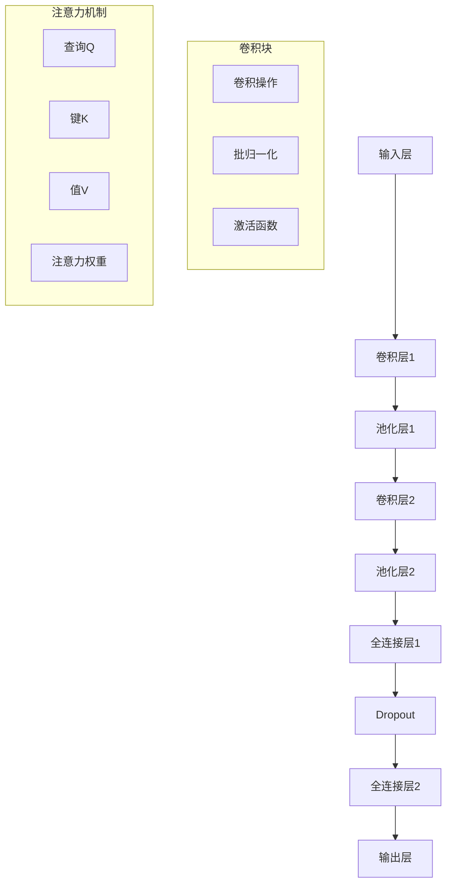

# 04-02-03 深度学习基础

## 📋 目录

- [04-02-03 深度学习基础](#04-02-03-深度学习基础)
  - [📋 目录](#-目录)
  - [🎯 概述](#-概述)
  - [🔬 概念定义](#-概念定义)
  - [📐 数学形式化](#-数学形式化)
  - [🐍 Python实现](#-python实现)
  - [📊 网络架构](#-网络架构)
  - [🔄 训练流程](#-训练流程)
  - [📈 应用案例](#-应用案例)
  - [🔗 相关链接](#-相关链接)

## 🎯 概述

深度学习是机器学习的一个子领域，使用多层神经网络来学习数据的层次化表示。本文档涵盖神经网络基础、卷积神经网络、循环神经网络、优化算法等核心概念。

## 🔬 概念定义

### 定义 3.1 (深度学习)
深度学习是使用多层神经网络进行特征学习和模式识别的机器学习方法。形式化定义为：

$$DL = (N, L, W, \sigma, \mathcal{L})$$

其中：
- $N$ 是神经网络架构
- $L$ 是层数
- $W$ 是权重参数
- $\sigma$ 是激活函数
- $\mathcal{L}$ 是损失函数

### 定义 3.2 (前馈神经网络)
前馈神经网络是一个有向无环图，信息从输入层流向输出层：

$$y = f_L \circ f_{L-1} \circ \cdots \circ f_1(x)$$

其中 $f_i(x) = \sigma_i(W_i x + b_i)$ 是第 $i$ 层的变换。

### 定义 3.3 (反向传播)
反向传播是计算梯度的高效算法：

$$\frac{\partial \mathcal{L}}{\partial W_i} = \frac{\partial \mathcal{L}}{\partial y} \cdot \frac{\partial y}{\partial W_i}$$

## 📐 数学形式化

### 定理 3.1 (通用近似定理)
对于任意连续函数 $f: [0,1]^n \rightarrow \mathbb{R}$ 和 $\epsilon > 0$，存在一个单隐藏层神经网络 $g$ 使得：

$$\sup_{x \in [0,1]^n} |f(x) - g(x)| < \epsilon$$

### 定理 3.2 (反向传播算法)
对于神经网络 $f(x) = \sigma(W_L \sigma(W_{L-1} \cdots \sigma(W_1 x + b_1) \cdots + b_{L-1}) + b_L)$，梯度计算为：

$$\frac{\partial \mathcal{L}}{\partial W_l} = \delta_l \cdot a_{l-1}^T$$

其中 $\delta_l = \frac{\partial \mathcal{L}}{\partial z_l}$ 是第 $l$ 层的误差项。

### 定义 3.4 (卷积操作)
二维卷积操作定义为：

$$(f * k)(i, j) = \sum_{m} \sum_{n} f(m, n) \cdot k(i-m, j-n)$$

其中 $f$ 是输入特征图，$k$ 是卷积核。

## 🐍 Python实现

### 1. 基础神经网络实现

```python
import numpy as np
import matplotlib.pyplot as plt
import torch
import torch.nn as nn
import torch.optim as optim
import torch.nn.functional as F
from torch.utils.data import DataLoader, TensorDataset
from typing import List, Tuple, Optional

class DeepNeuralNetwork:
    """深度神经网络基础实现"""
    
    def __init__(self, layer_sizes: List[int], activation: str = 'relu'):
        self.layer_sizes = layer_sizes
        self.activation = activation
        self.weights = []
        self.biases = []
        self.activations = []
        
        # 初始化权重和偏置
        for i in range(len(layer_sizes) - 1):
            w = np.random.randn(layer_sizes[i + 1], layer_sizes[i]) * 0.01
            b = np.zeros((layer_sizes[i + 1], 1))
            self.weights.append(w)
            self.biases.append(b)
    
    def forward(self, X: np.ndarray) -> np.ndarray:
        """前向传播"""
        self.activations = [X]
        
        for i in range(len(self.weights)):
            z = np.dot(self.weights[i], self.activations[-1]) + self.biases[i]
            a = self._apply_activation(z)
            self.activations.append(a)
        
        return self.activations[-1]
    
    def backward(self, X: np.ndarray, y: np.ndarray, learning_rate: float = 0.01):
        """反向传播"""
        m = X.shape[1]
        
        # 计算输出层误差
        delta = self.activations[-1] - y
        
        # 反向传播误差
        for i in range(len(self.weights) - 1, -1, -1):
            # 计算权重和偏置的梯度
            dW = np.dot(delta, self.activations[i].T) / m
            db = np.sum(delta, axis=1, keepdims=True) / m
            
            # 更新参数
            self.weights[i] -= learning_rate * dW
            self.biases[i] -= learning_rate * db
            
            # 计算下一层的误差（除了输入层）
            if i > 0:
                delta = np.dot(self.weights[i].T, delta) * self._apply_activation_derivative(self.activations[i])
    
    def _apply_activation(self, z: np.ndarray) -> np.ndarray:
        """应用激活函数"""
        if self.activation == 'relu':
            return np.maximum(0, z)
        elif self.activation == 'sigmoid':
            return 1 / (1 + np.exp(-np.clip(z, -500, 500)))
        elif self.activation == 'tanh':
            return np.tanh(z)
        else:
            return z
    
    def _apply_activation_derivative(self, a: np.ndarray) -> np.ndarray:
        """应用激活函数导数"""
        if self.activation == 'relu':
            return (a > 0).astype(float)
        elif self.activation == 'sigmoid':
            return a * (1 - a)
        elif self.activation == 'tanh':
            return 1 - a ** 2
        else:
            return np.ones_like(a)
    
    def train(self, X: np.ndarray, y: np.ndarray, epochs: int = 1000, learning_rate: float = 0.01) -> List[float]:
        """训练模型"""
        costs = []
        
        for epoch in range(epochs):
            # 前向传播
            output = self.forward(X)
            
            # 计算成本
            cost = self._compute_cost(output, y)
            costs.append(cost)
            
            # 反向传播
            self.backward(X, y, learning_rate)
            
            if epoch % 100 == 0:
                print(f'Epoch {epoch}: Cost = {cost:.6f}')
        
        return costs
    
    def _compute_cost(self, output: np.ndarray, y: np.ndarray) -> float:
        """计算成本函数"""
        m = y.shape[1]
        cost = -np.sum(y * np.log(output + 1e-8) + (1 - y) * np.log(1 - output + 1e-8)) / m
        return cost

class ConvolutionalNeuralNetwork(nn.Module):
    """卷积神经网络"""
    
    def __init__(self, num_classes: int = 10):
        super(ConvolutionalNeuralNetwork, self).__init__()
        
        # 卷积层
        self.conv1 = nn.Conv2d(1, 32, kernel_size=3, padding=1)
        self.conv2 = nn.Conv2d(32, 64, kernel_size=3, padding=1)
        self.conv3 = nn.Conv2d(64, 128, kernel_size=3, padding=1)
        
        # 池化层
        self.pool = nn.MaxPool2d(2, 2)
        
        # 全连接层
        self.fc1 = nn.Linear(128 * 3 * 3, 512)
        self.fc2 = nn.Linear(512, num_classes)
        
        # Dropout
        self.dropout = nn.Dropout(0.5)
    
    def forward(self, x: torch.Tensor) -> torch.Tensor:
        """前向传播"""
        # 第一个卷积块
        x = F.relu(self.conv1(x))
        x = self.pool(x)
        
        # 第二个卷积块
        x = F.relu(self.conv2(x))
        x = self.pool(x)
        
        # 第三个卷积块
        x = F.relu(self.conv3(x))
        x = self.pool(x)
        
        # 展平
        x = x.view(x.size(0), -1)
        
        # 全连接层
        x = F.relu(self.fc1(x))
        x = self.dropout(x)
        x = self.fc2(x)
        
        return x

class RecurrentNeuralNetwork(nn.Module):
    """循环神经网络"""
    
    def __init__(self, input_size: int, hidden_size: int, num_layers: int, num_classes: int):
        super(RecurrentNeuralNetwork, self).__init__()
        
        self.hidden_size = hidden_size
        self.num_layers = num_layers
        
        # LSTM层
        self.lstm = nn.LSTM(input_size, hidden_size, num_layers, batch_first=True)
        
        # 全连接层
        self.fc = nn.Linear(hidden_size, num_classes)
    
    def forward(self, x: torch.Tensor) -> torch.Tensor:
        """前向传播"""
        # 初始化隐藏状态
        h0 = torch.zeros(self.num_layers, x.size(0), self.hidden_size).to(x.device)
        c0 = torch.zeros(self.num_layers, x.size(0), self.hidden_size).to(x.device)
        
        # LSTM前向传播
        out, _ = self.lstm(x, (h0, c0))
        
        # 取最后一个时间步的输出
        out = self.fc(out[:, -1, :])
        
        return out

class LongShortTermMemory(nn.Module):
    """LSTM网络"""
    
    def __init__(self, input_size: int, hidden_size: int, num_layers: int, num_classes: int):
        super(LongShortTermMemory, self).__init__()
        
        self.hidden_size = hidden_size
        self.num_layers = num_layers
        
        # LSTM层
        self.lstm = nn.LSTM(input_size, hidden_size, num_layers, batch_first=True, dropout=0.2)
        
        # 全连接层
        self.fc = nn.Linear(hidden_size, num_classes)
    
    def forward(self, x: torch.Tensor) -> torch.Tensor:
        """前向传播"""
        # 初始化隐藏状态
        h0 = torch.zeros(self.num_layers, x.size(0), self.hidden_size).to(x.device)
        c0 = torch.zeros(self.num_layers, x.size(0), self.hidden_size).to(x.device)
        
        # LSTM前向传播
        out, _ = self.lstm(x, (h0, c0))
        
        # 取最后一个时间步的输出
        out = self.fc(out[:, -1, :])
        
        return out

class TransformerBlock(nn.Module):
    """Transformer块"""
    
    def __init__(self, d_model: int, n_heads: int, d_ff: int, dropout: float = 0.1):
        super(TransformerBlock, self).__init__()
        
        self.attention = nn.MultiheadAttention(d_model, n_heads, dropout=dropout)
        self.feed_forward = nn.Sequential(
            nn.Linear(d_model, d_ff),
            nn.ReLU(),
            nn.Dropout(dropout),
            nn.Linear(d_ff, d_model)
        )
        self.norm1 = nn.LayerNorm(d_model)
        self.norm2 = nn.LayerNorm(d_model)
        self.dropout = nn.Dropout(dropout)
    
    def forward(self, x: torch.Tensor) -> torch.Tensor:
        """前向传播"""
        # 自注意力
        attn_output, _ = self.attention(x, x, x)
        x = self.norm1(x + self.dropout(attn_output))
        
        # 前馈网络
        ff_output = self.feed_forward(x)
        x = self.norm2(x + self.dropout(ff_output))
        
        return x

class Transformer(nn.Module):
    """Transformer模型"""
    
    def __init__(self, vocab_size: int, d_model: int, n_heads: int, n_layers: int, 
                 d_ff: int, max_seq_length: int, num_classes: int):
        super(Transformer, self).__init__()
        
        self.embedding = nn.Embedding(vocab_size, d_model)
        self.pos_encoding = self._create_positional_encoding(max_seq_length, d_model)
        
        self.transformer_blocks = nn.ModuleList([
            TransformerBlock(d_model, n_heads, d_ff) for _ in range(n_layers)
        ])
        
        self.fc = nn.Linear(d_model, num_classes)
        self.dropout = nn.Dropout(0.1)
    
    def _create_positional_encoding(self, max_seq_length: int, d_model: int) -> torch.Tensor:
        """创建位置编码"""
        pe = torch.zeros(max_seq_length, d_model)
        position = torch.arange(0, max_seq_length).unsqueeze(1).float()
        
        div_term = torch.exp(torch.arange(0, d_model, 2).float() * 
                           -(np.log(10000.0) / d_model))
        
        pe[:, 0::2] = torch.sin(position * div_term)
        pe[:, 1::2] = torch.cos(position * div_term)
        
        return pe.unsqueeze(0)
    
    def forward(self, x: torch.Tensor) -> torch.Tensor:
        """前向传播"""
        seq_length = x.size(1)
        
        # 嵌入和位置编码
        x = self.embedding(x)
        x = x + self.pos_encoding[:, :seq_length, :].to(x.device)
        x = self.dropout(x)
        
        # Transformer块
        for transformer_block in self.transformer_blocks:
            x = transformer_block(x)
        
        # 取序列的平均值
        x = torch.mean(x, dim=1)
        
        # 分类
        x = self.fc(x)
        
        return x
```

### 2. 优化算法实现

```python
class Optimizer:
    """优化器基类"""
    
    def __init__(self, learning_rate: float = 0.01):
        self.learning_rate = learning_rate
    
    def update(self, params: List[np.ndarray], grads: List[np.ndarray]):
        """更新参数"""
        raise NotImplementedError

class SGD(Optimizer):
    """随机梯度下降"""
    
    def __init__(self, learning_rate: float = 0.01, momentum: float = 0.0):
        super().__init__(learning_rate)
        self.momentum = momentum
        self.velocity = None
    
    def update(self, params: List[np.ndarray], grads: List[np.ndarray]):
        """更新参数"""
        if self.velocity is None:
            self.velocity = [np.zeros_like(param) for param in params]
        
        for i in range(len(params)):
            self.velocity[i] = self.momentum * self.velocity[i] - self.learning_rate * grads[i]
            params[i] += self.velocity[i]

class Adam(Optimizer):
    """Adam优化器"""
    
    def __init__(self, learning_rate: float = 0.001, beta1: float = 0.9, beta2: float = 0.999, epsilon: float = 1e-8):
        super().__init__(learning_rate)
        self.beta1 = beta1
        self.beta2 = beta2
        self.epsilon = epsilon
        self.m = None
        self.v = None
        self.t = 0
    
    def update(self, params: List[np.ndarray], grads: List[np.ndarray]):
        """更新参数"""
        if self.m is None:
            self.m = [np.zeros_like(param) for param in params]
            self.v = [np.zeros_like(param) for param in params]
        
        self.t += 1
        
        for i in range(len(params)):
            # 更新偏置修正的一阶矩估计
            self.m[i] = self.beta1 * self.m[i] + (1 - self.beta1) * grads[i]
            
            # 更新偏置修正的二阶矩估计
            self.v[i] = self.beta2 * self.v[i] + (1 - self.beta2) * (grads[i] ** 2)
            
            # 偏置修正
            m_hat = self.m[i] / (1 - self.beta1 ** self.t)
            v_hat = self.v[i] / (1 - self.beta2 ** self.t)
            
            # 更新参数
            params[i] -= self.learning_rate * m_hat / (np.sqrt(v_hat) + self.epsilon)

class RMSprop(Optimizer):
    """RMSprop优化器"""
    
    def __init__(self, learning_rate: float = 0.001, rho: float = 0.9, epsilon: float = 1e-8):
        super().__init__(learning_rate)
        self.rho = rho
        self.epsilon = epsilon
        self.v = None
    
    def update(self, params: List[np.ndarray], grads: List[np.ndarray]):
        """更新参数"""
        if self.v is None:
            self.v = [np.zeros_like(param) for param in params]
        
        for i in range(len(params)):
            # 更新移动平均
            self.v[i] = self.rho * self.v[i] + (1 - self.rho) * (grads[i] ** 2)
            
            # 更新参数
            params[i] -= self.learning_rate * grads[i] / (np.sqrt(self.v[i]) + self.epsilon)
```

### 3. 损失函数实现

```python
class LossFunction:
    """损失函数基类"""
    
    def __call__(self, y_pred: np.ndarray, y_true: np.ndarray) -> float:
        """计算损失"""
        raise NotImplementedError
    
    def gradient(self, y_pred: np.ndarray, y_true: np.ndarray) -> np.ndarray:
        """计算梯度"""
        raise NotImplementedError

class CrossEntropyLoss(LossFunction):
    """交叉熵损失"""
    
    def __call__(self, y_pred: np.ndarray, y_true: np.ndarray) -> float:
        """计算损失"""
        epsilon = 1e-15
        y_pred = np.clip(y_pred, epsilon, 1 - epsilon)
        return -np.mean(np.sum(y_true * np.log(y_pred), axis=1))
    
    def gradient(self, y_pred: np.ndarray, y_true: np.ndarray) -> np.ndarray:
        """计算梯度"""
        epsilon = 1e-15
        y_pred = np.clip(y_pred, epsilon, 1 - epsilon)
        return y_pred - y_true

class MSELoss(LossFunction):
    """均方误差损失"""
    
    def __call__(self, y_pred: np.ndarray, y_true: np.ndarray) -> float:
        """计算损失"""
        return np.mean((y_pred - y_true) ** 2)
    
    def gradient(self, y_pred: np.ndarray, y_true: np.ndarray) -> np.ndarray:
        """计算梯度"""
        return 2 * (y_pred - y_true) / y_pred.size

class HingeLoss(LossFunction):
    """铰链损失（用于SVM）"""
    
    def __init__(self, margin: float = 1.0):
        self.margin = margin
    
    def __call__(self, y_pred: np.ndarray, y_true: np.ndarray) -> float:
        """计算损失"""
        loss = np.maximum(0, self.margin - y_true * y_pred)
        return np.mean(loss)
    
    def gradient(self, y_pred: np.ndarray, y_true: np.ndarray) -> np.ndarray:
        """计算梯度"""
        mask = (self.margin - y_true * y_pred) > 0
        return -y_true * mask
```

## 📊 网络架构

### 常见网络架构对比

| 架构 | 适用场景 | 优点 | 缺点 | 参数量 |
|------|----------|------|------|--------|
| 全连接网络 | 小规模分类 | 简单、可解释 | 参数量大、容易过拟合 | O(n²) |
| CNN | 图像处理 | 局部特征、参数共享 | 需要大量数据 | O(k²×c) |
| RNN | 序列数据 | 处理变长序列 | 梯度消失、训练慢 | O(h²) |
| LSTM | 长序列 | 长期依赖、梯度稳定 | 计算复杂 | O(h²) |
| Transformer | 自然语言 | 并行训练、注意力机制 | 内存消耗大 | O(n²×d) |

### 网络架构图



## 🔄 训练流程

### 深度学习训练流程

```python
def deep_learning_training_pipeline():
    """深度学习训练流程"""
    
    # 1. 数据准备
    np.random.seed(42)
    X = np.random.randn(1000, 784)  # 模拟MNIST数据
    y = np.random.randint(0, 10, 1000)
    
    # 转换为PyTorch张量
    X_tensor = torch.FloatTensor(X)
    y_tensor = torch.LongTensor(y)
    
    # 创建数据加载器
    dataset = TensorDataset(X_tensor, y_tensor)
    train_loader = DataLoader(dataset, batch_size=32, shuffle=True)
    
    # 2. 模型定义
    model = nn.Sequential(
        nn.Linear(784, 512),
        nn.ReLU(),
        nn.Dropout(0.2),
        nn.Linear(512, 256),
        nn.ReLU(),
        nn.Dropout(0.2),
        nn.Linear(256, 10)
    )
    
    # 3. 损失函数和优化器
    criterion = nn.CrossEntropyLoss()
    optimizer = optim.Adam(model.parameters(), lr=0.001)
    
    # 4. 训练循环
    num_epochs = 50
    train_losses = []
    
    for epoch in range(num_epochs):
        model.train()
        epoch_loss = 0.0
        
        for batch_idx, (data, target) in enumerate(train_loader):
            # 前向传播
            output = model(data)
            loss = criterion(output, target)
            
            # 反向传播
            optimizer.zero_grad()
            loss.backward()
            optimizer.step()
            
            epoch_loss += loss.item()
        
        avg_loss = epoch_loss / len(train_loader)
        train_losses.append(avg_loss)
        
        if epoch % 10 == 0:
            print(f'Epoch {epoch}: Loss = {avg_loss:.4f}')
    
    # 5. 模型评估
    model.eval()
    with torch.no_grad():
        test_output = model(X_tensor)
        _, predicted = torch.max(test_output.data, 1)
        accuracy = (predicted == y_tensor).sum().item() / len(y_tensor)
    
    print(f'最终准确率: {accuracy:.4f}')
    
    # 6. 可视化训练过程
    plt.figure(figsize=(10, 6))
    plt.plot(train_losses)
    plt.title('深度学习训练损失')
    plt.xlabel('Epoch')
    plt.ylabel('Loss')
    plt.grid(True)
    plt.show()
    
    return model, train_losses, accuracy

# 运行训练流程
if __name__ == "__main__":
    model, losses, accuracy = deep_learning_training_pipeline()
```

## 📈 应用案例

### 案例1：图像分类

```python
def image_classification_example():
    """图像分类示例"""
    
    # 生成模拟图像数据
    np.random.seed(42)
    batch_size = 32
    channels = 3
    height = 64
    width = 64
    num_classes = 10
    
    # 模拟图像数据
    X = np.random.randn(batch_size, channels, height, width)
    y = np.random.randint(0, num_classes, batch_size)
    
    # 转换为PyTorch张量
    X_tensor = torch.FloatTensor(X)
    y_tensor = torch.LongTensor(y)
    
    # 创建CNN模型
    model = nn.Sequential(
        # 第一个卷积块
        nn.Conv2d(channels, 32, kernel_size=3, padding=1),
        nn.ReLU(),
        nn.MaxPool2d(2, 2),
        
        # 第二个卷积块
        nn.Conv2d(32, 64, kernel_size=3, padding=1),
        nn.ReLU(),
        nn.MaxPool2d(2, 2),
        
        # 第三个卷积块
        nn.Conv2d(64, 128, kernel_size=3, padding=1),
        nn.ReLU(),
        nn.MaxPool2d(2, 2),
        
        # 全连接层
        nn.Flatten(),
        nn.Linear(128 * 8 * 8, 512),
        nn.ReLU(),
        nn.Dropout(0.5),
        nn.Linear(512, num_classes)
    )
    
    # 训练模型
    criterion = nn.CrossEntropyLoss()
    optimizer = optim.Adam(model.parameters(), lr=0.001)
    
    num_epochs = 20
    losses = []
    
    for epoch in range(num_epochs):
        # 前向传播
        output = model(X_tensor)
        loss = criterion(output, y_tensor)
        
        # 反向传播
        optimizer.zero_grad()
        loss.backward()
        optimizer.step()
        
        losses.append(loss.item())
        
        if epoch % 5 == 0:
            print(f'Epoch {epoch}: Loss = {loss.item():.4f}')
    
    # 评估模型
    model.eval()
    with torch.no_grad():
        output = model(X_tensor)
        _, predicted = torch.max(output.data, 1)
        accuracy = (predicted == y_tensor).sum().item() / len(y_tensor)
    
    print(f'图像分类准确率: {accuracy:.4f}')
    
    # 可视化
    plt.figure(figsize=(10, 6))
    plt.plot(losses)
    plt.title('CNN图像分类训练损失')
    plt.xlabel('Epoch')
    plt.ylabel('Loss')
    plt.grid(True)
    plt.show()
    
    return model, accuracy

### 案例2：序列预测

```python
def sequence_prediction_example():
    """序列预测示例"""
    
    # 生成模拟序列数据
    np.random.seed(42)
    seq_length = 20
    batch_size = 32
    input_size = 10
    hidden_size = 64
    num_classes = 5
    
    # 生成序列数据
    X = np.random.randn(batch_size, seq_length, input_size)
    y = np.random.randint(0, num_classes, batch_size)
    
    # 转换为PyTorch张量
    X_tensor = torch.FloatTensor(X)
    y_tensor = torch.LongTensor(y)
    
    # 创建LSTM模型
    model = nn.Sequential(
        nn.LSTM(input_size, hidden_size, num_layers=2, batch_first=True, dropout=0.2),
        nn.Linear(hidden_size, num_classes)
    )
    
    # 自定义前向传播
    class LSTMModel(nn.Module):
        def __init__(self, input_size, hidden_size, num_layers, num_classes):
            super(LSTMModel, self).__init__()
            self.lstm = nn.LSTM(input_size, hidden_size, num_layers, batch_first=True, dropout=0.2)
            self.fc = nn.Linear(hidden_size, num_classes)
        
        def forward(self, x):
            lstm_out, _ = self.lstm(x)
            # 取最后一个时间步的输出
            out = self.fc(lstm_out[:, -1, :])
            return out
    
    model = LSTMModel(input_size, hidden_size, 2, num_classes)
    
    # 训练模型
    criterion = nn.CrossEntropyLoss()
    optimizer = optim.Adam(model.parameters(), lr=0.001)
    
    num_epochs = 30
    losses = []
    
    for epoch in range(num_epochs):
        # 前向传播
        output = model(X_tensor)
        loss = criterion(output, y_tensor)
        
        # 反向传播
        optimizer.zero_grad()
        loss.backward()
        optimizer.step()
        
        losses.append(loss.item())
        
        if epoch % 5 == 0:
            print(f'Epoch {epoch}: Loss = {loss.item():.4f}')
    
    # 评估模型
    model.eval()
    with torch.no_grad():
        output = model(X_tensor)
        _, predicted = torch.max(output.data, 1)
        accuracy = (predicted == y_tensor).sum().item() / len(y_tensor)
    
    print(f'序列预测准确率: {accuracy:.4f}')
    
    # 可视化
    plt.figure(figsize=(10, 6))
    plt.plot(losses)
    plt.title('LSTM序列预测训练损失')
    plt.xlabel('Epoch')
    plt.ylabel('Loss')
    plt.grid(True)
    plt.show()
    
    return model, accuracy

### 案例3：注意力机制

```python
def attention_mechanism_example():
    """注意力机制示例"""
    
    # 生成模拟数据
    np.random.seed(42)
    batch_size = 16
    seq_length = 10
    d_model = 64
    n_heads = 8
    
    # 生成输入序列
    X = np.random.randn(batch_size, seq_length, d_model)
    X_tensor = torch.FloatTensor(X)
    
    # 创建多头注意力层
    attention = nn.MultiheadAttention(d_model, n_heads, batch_first=True)
    
    # 应用注意力机制
    with torch.no_grad():
        attn_output, attn_weights = attention(X_tensor, X_tensor, X_tensor)
    
    # 可视化注意力权重
    plt.figure(figsize=(12, 8))
    
    # 显示第一个样本的注意力权重
    sample_idx = 0
    head_idx = 0
    
    attention_matrix = attn_weights[sample_idx, head_idx].numpy()
    
    plt.imshow(attention_matrix, cmap='viridis', aspect='auto')
    plt.colorbar()
    plt.title(f'注意力权重矩阵 (样本 {sample_idx}, 头 {head_idx})')
    plt.xlabel('键位置')
    plt.ylabel('查询位置')
    plt.show()
    
    # 分析注意力模式
    print("注意力权重统计:")
    print(f"平均权重: {attn_weights.mean().item():.4f}")
    print(f"最大权重: {attn_weights.max().item():.4f}")
    print(f"最小权重: {attn_weights.min().item():.4f}")
    
    return attention, attn_weights

# 运行所有示例
if __name__ == "__main__":
    print("=== 深度学习基础示例 ===")
    
    print("\n1. 图像分类示例:")
    cnn_model, cnn_acc = image_classification_example()
    
    print("\n2. 序列预测示例:")
    lstm_model, lstm_acc = sequence_prediction_example()
    
    print("\n3. 注意力机制示例:")
    attention_model, attn_weights = attention_mechanism_example()
    
    print(f"\n=== 总结 ===")
    print(f"CNN图像分类准确率: {cnn_acc:.4f}")
    print(f"LSTM序列预测准确率: {lstm_acc:.4f}")
```

## 🔗 相关链接

- [04-02-01-人工智能基础](./04-02-01-人工智能基础.md)
- [04-02-02-机器学习算法](./04-02-02-机器学习算法.md)
- [02-理论基础/02-01-算法理论/02-01-01-算法基础](../02-理论基础/02-01-算法理论/02-01-01-算法基础.md)
- [01-形式科学/01-01-数学基础/01-01-02-数论基础](../01-形式科学/01-01-数学基础/01-01-02-数论基础.md)

---

**文档版本**：1.0  
**最后更新**：2024年  
**维护者**：AI助手
