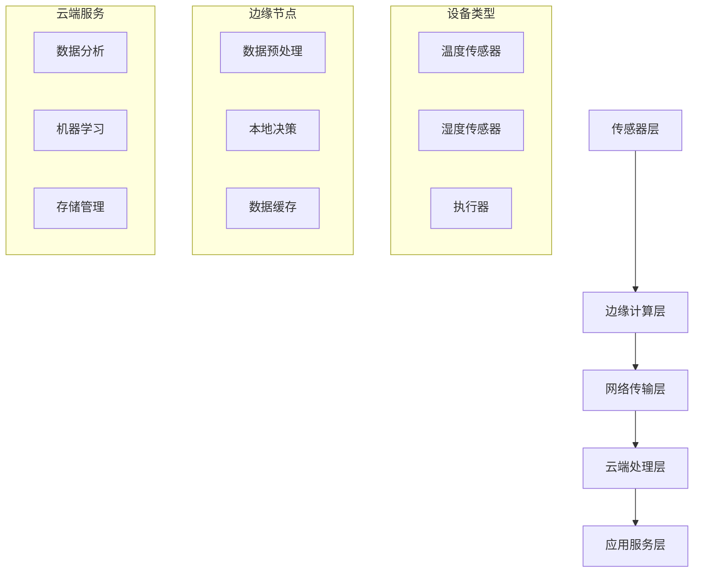

# 04-03-01 IoT基础

## 📋 目录

- [04-03-01 IoT基础](#04-03-01-iot基础)
  - [🎯 概述](#-概述)
  - [🔬 概念定义](#-概念定义)
  - [📐 数学形式化](#-数学形式化)
  - [🐍 Python实现](#-python实现)
  - [📊 架构模式](#-架构模式)
  - [🔄 工作流程](#-工作流程)
  - [📈 应用案例](#-应用案例)
  - [🔗 相关链接](#-相关链接)

## 🎯 概述

物联网(Internet of Things, IoT)是连接物理世界和数字世界的技术体系，通过传感器、网络和计算技术实现设备间的智能互联。本文档从形式化定义、数学基础、Python实现等多个维度全面阐述IoT基础理论。

## 🔬 概念定义

### 定义 1.1 (物联网)
物联网是连接物理设备的网络系统，形式化定义为：

$$IoT = (D, N, C, A, S)$$

其中：
- $D$ 是设备集合
- $N$ 是网络连接
- $C$ 是计算处理
- $A$ 是应用服务
- $S$ 是安全机制

### 定义 1.2 (IoT设备层次)
IoT设备按能力分为四个层次：

$$IoT_{layers} = \{L_1, L_2, L_3, L_4\}$$

其中：
- $L_1$ 是受限终端设备 (MCU级别)
- $L_2$ 是标准终端设备 (低功耗处理器)
- $L_3$ 是边缘网关设备 (中等计算能力)
- $L_4$ 是云端基础设施 (高计算能力)

### 定义 1.3 (IoT容错模型)
IoT容错模型确保系统可靠性：

$$FT = (R, D, I, R)$$

其中：
- $R$ 是冗余机制
- $D$ 是失效检测
- $I$ 是故障隔离
- $R$ 是快速恢复

## 📐 数学形式化

### 定理 1.1 (IoT设备数量增长)
IoT设备数量呈指数增长：

$$N(t) = N_0 \cdot e^{kt}$$

其中：
- $N(t)$ 是时间 $t$ 的设备数量
- $N_0$ 是初始设备数量
- $k$ 是增长率

### 定理 1.2 (IoT数据量)
IoT数据量随设备数量线性增长：

$$D(t) = \alpha \cdot N(t) \cdot f$$

其中：
- $D(t)$ 是时间 $t$ 的数据量
- $\alpha$ 是每设备数据系数
- $f$ 是数据频率

### 定义 1.4 (IoT安全模型)
IoT安全模型基于多层防护：

$$S = (A, C, I, M)$$

其中：
- $A$ 是认证机制
- $C$ 是加密算法
- $I$ 是完整性检查
- $M$ 是监控系统

## 🐍 Python实现

### 1. IoT设备模拟

```python
import time
import random
import json
import asyncio
from typing import Dict, Any, List, Optional
from dataclasses import dataclass
from enum import Enum

class DeviceType(Enum):
    """设备类型枚举"""
    SENSOR = "sensor"
    ACTUATOR = "actuator"
    GATEWAY = "gateway"
    CONTROLLER = "controller"

@dataclass
class DeviceConfig:
    """设备配置"""
    device_id: str
    device_type: DeviceType
    location: str
    capabilities: List[str]
    power_consumption: float
    update_interval: int

class IoTDevice:
    """IoT设备基类"""
    
    def __init__(self, config: DeviceConfig):
        self.config = config
        self.status = "offline"
        self.last_update = time.time()
        self.data_buffer = []
        self.health_score = 100.0
    
    def connect(self) -> bool:
        """连接设备"""
        try:
            # 模拟连接过程
            time.sleep(0.1)
            self.status = "online"
            self.last_update = time.time()
            return True
        except Exception as e:
            print(f"设备连接失败: {e}")
            return False
    
    def disconnect(self):
        """断开设备"""
        self.status = "offline"
        self.last_update = time.time()
    
    def get_status(self) -> Dict[str, Any]:
        """获取设备状态"""
        return {
            "device_id": self.config.device_id,
            "device_type": self.config.device_type.value,
            "status": self.status,
            "last_update": self.last_update,
            "health_score": self.health_score,
            "location": self.config.location
        }
    
    def update_health(self):
        """更新健康状态"""
        # 模拟健康检查
        if self.status == "online":
            self.health_score = max(0, self.health_score - random.uniform(0, 2))
        else:
            self.health_score = max(0, self.health_score - random.uniform(1, 5))

class Sensor(IoTDevice):
    """传感器设备"""
    
    def __init__(self, config: DeviceConfig, sensor_type: str):
        super().__init__(config)
        self.sensor_type = sensor_type
        self.calibration_data = {}
    
    def read_data(self) -> Dict[str, Any]:
        """读取传感器数据"""
        if self.status != "online":
            return {"error": "设备离线"}
        
        # 模拟传感器读数
        if self.sensor_type == "temperature":
            value = random.uniform(15, 35)
        elif self.sensor_type == "humidity":
            value = random.uniform(30, 80)
        elif self.sensor_type == "pressure":
            value = random.uniform(1000, 1020)
        else:
            value = random.uniform(0, 100)
        
        data = {
            "device_id": self.config.device_id,
            "sensor_type": self.sensor_type,
            "value": round(value, 2),
            "unit": self._get_unit(),
            "timestamp": time.time(),
            "quality": random.uniform(0.8, 1.0)
        }
        
        self.data_buffer.append(data)
        return data
    
    def _get_unit(self) -> str:
        """获取单位"""
        units = {
            "temperature": "°C",
            "humidity": "%",
            "pressure": "hPa",
            "light": "lux",
            "noise": "dB"
        }
        return units.get(self.sensor_type, "unit")
    
    def calibrate(self, reference_value: float):
        """校准传感器"""
        if self.data_buffer:
            current_value = self.data_buffer[-1]["value"]
            offset = reference_value - current_value
            self.calibration_data["offset"] = offset
            print(f"传感器校准完成，偏移量: {offset}")

class Actuator(IoTDevice):
    """执行器设备"""
    
    def __init__(self, config: DeviceConfig, actuator_type: str):
        super().__init__(config)
        self.actuator_type = actuator_type
        self.current_state = "idle"
        self.target_state = None
    
    def set_state(self, target_state: str) -> bool:
        """设置执行器状态"""
        if self.status != "online":
            return False
        
        self.target_state = target_state
        
        # 模拟状态转换
        if self.actuator_type == "relay":
            self.current_state = "on" if target_state == "on" else "off"
        elif self.actuator_type == "motor":
            self.current_state = target_state
        elif self.actuator_type == "valve":
            self.current_state = target_state
        
        return True
    
    def get_state(self) -> Dict[str, Any]:
        """获取执行器状态"""
        return {
            "device_id": self.config.device_id,
            "actuator_type": self.actuator_type,
            "current_state": self.current_state,
            "target_state": self.target_state,
            "status": self.status
        }

class Gateway(IoTDevice):
    """网关设备"""
    
    def __init__(self, config: DeviceConfig):
        super().__init__(config)
        self.connected_devices = []
        self.data_queue = []
        self.routing_table = {}
    
    def add_device(self, device: IoTDevice):
        """添加连接的设备"""
        self.connected_devices.append(device)
        self.routing_table[device.config.device_id] = device
    
    def collect_data(self) -> List[Dict[str, Any]]:
        """收集所有设备数据"""
        collected_data = []
        
        for device in self.connected_devices:
            if device.status == "online":
                if isinstance(device, Sensor):
                    data = device.read_data()
                    if "error" not in data:
                        collected_data.append(data)
                elif isinstance(device, Actuator):
                    data = device.get_state()
                    collected_data.append(data)
        
        self.data_queue.extend(collected_data)
        return collected_data
    
    def forward_data(self, destination: str) -> bool:
        """转发数据到云端"""
        if not self.data_queue:
            return False
        
        # 模拟数据转发
        data_batch = self.data_queue.copy()
        self.data_queue.clear()
        
        print(f"转发 {len(data_batch)} 条数据到 {destination}")
        return True
    
    def get_network_status(self) -> Dict[str, Any]:
        """获取网络状态"""
        online_devices = sum(1 for device in self.connected_devices if device.status == "online")
        
        return {
            "gateway_id": self.config.device_id,
            "total_devices": len(self.connected_devices),
            "online_devices": online_devices,
            "data_queue_size": len(self.data_queue),
            "status": self.status
        }
```

### 2. IoT网络通信

```python
import socket
import threading
import queue
from typing import Callable, Any

class IoTProtocol:
    """IoT通信协议基类"""
    
    def __init__(self, protocol_name: str):
        self.protocol_name = protocol_name
        self.message_queue = queue.Queue()
        self.callbacks = {}
    
    def register_callback(self, message_type: str, callback: Callable):
        """注册消息回调"""
        self.callbacks[message_type] = callback
    
    def send_message(self, message: Dict[str, Any]):
        """发送消息"""
        self.message_queue.put(message)
    
    def process_messages(self):
        """处理消息队列"""
        while not self.message_queue.empty():
            message = self.message_queue.get()
            message_type = message.get("type")
            
            if message_type in self.callbacks:
                self.callbacks[message_type](message)

class MQTTProtocol(IoTProtocol):
    """MQTT协议实现"""
    
    def __init__(self, broker_host: str = "localhost", broker_port: int = 1883):
        super().__init__("MQTT")
        self.broker_host = broker_host
        self.broker_port = broker_port
        self.topics = {}
        self.connected = False
    
    def connect(self) -> bool:
        """连接到MQTT代理"""
        try:
            # 模拟MQTT连接
            print(f"连接到MQTT代理 {self.broker_host}:{self.broker_port}")
            self.connected = True
            return True
        except Exception as e:
            print(f"MQTT连接失败: {e}")
            return False
    
    def subscribe(self, topic: str, callback: Callable):
        """订阅主题"""
        self.topics[topic] = callback
        print(f"订阅主题: {topic}")
    
    def publish(self, topic: str, message: str):
        """发布消息"""
        if not self.connected:
            return False
        
        mqtt_message = {
            "topic": topic,
            "payload": message,
            "timestamp": time.time()
        }
        
        print(f"发布消息到主题 {topic}: {message}")
        return True
    
    def disconnect(self):
        """断开连接"""
        self.connected = False
        print("断开MQTT连接")

class CoAPProtocol(IoTProtocol):
    """CoAP协议实现"""
    
    def __init__(self, port: int = 5683):
        super().__init__("CoAP")
        self.port = port
        self.resources = {}
        self.server_socket = None
    
    def start_server(self):
        """启动CoAP服务器"""
        try:
            # 模拟CoAP服务器启动
            print(f"启动CoAP服务器，端口: {self.port}")
            return True
        except Exception as e:
            print(f"CoAP服务器启动失败: {e}")
            return False
    
    def add_resource(self, path: str, handler: Callable):
        """添加资源"""
        self.resources[path] = handler
        print(f"添加CoAP资源: {path}")
    
    def get_resource(self, path: str) -> Dict[str, Any]:
        """获取资源"""
        if path in self.resources:
            return self.resources[path]()
        return {"error": "Resource not found"}
    
    def post_resource(self, path: str, data: Dict[str, Any]):
        """POST资源"""
        if path in self.resources:
            return self.resources[path](data)
        return {"error": "Resource not found"}

class IoTNetwork:
    """IoT网络管理"""
    
    def __init__(self):
        self.protocols = {}
        self.devices = {}
        self.routing_table = {}
    
    def add_protocol(self, protocol: IoTProtocol):
        """添加协议"""
        self.protocols[protocol.protocol_name] = protocol
    
    def add_device(self, device_id: str, device: IoTDevice):
        """添加设备"""
        self.devices[device_id] = device
    
    def route_message(self, source: str, destination: str, message: Dict[str, Any]):
        """路由消息"""
        if destination in self.devices:
            # 直接路由到设备
            target_device = self.devices[destination]
            if hasattr(target_device, 'receive_message'):
                target_device.receive_message(message)
        else:
            # 通过协议转发
            for protocol in self.protocols.values():
                if hasattr(protocol, 'forward_message'):
                    protocol.forward_message(destination, message)
    
    def broadcast_message(self, message: Dict[str, Any]):
        """广播消息"""
        for device in self.devices.values():
            if hasattr(device, 'receive_message'):
                device.receive_message(message)
    
    def get_network_topology(self) -> Dict[str, Any]:
        """获取网络拓扑"""
        return {
            "devices": list(self.devices.keys()),
            "protocols": list(self.protocols.keys()),
            "connections": len(self.devices)
        }
```

### 3. IoT数据处理

```python
import numpy as np
from collections import deque
import statistics

class IoTDataProcessor:
    """IoT数据处理器"""
    
    def __init__(self, window_size: int = 100):
        self.window_size = window_size
        self.data_buffers = {}
        self.processors = {}
    
    def add_data(self, device_id: str, data: Dict[str, Any]):
        """添加数据"""
        if device_id not in self.data_buffers:
            self.data_buffers[device_id] = deque(maxlen=self.window_size)
        
        self.data_buffers[device_id].append(data)
    
    def get_statistics(self, device_id: str) -> Dict[str, float]:
        """获取统计信息"""
        if device_id not in self.data_buffers:
            return {}
        
        data_buffer = self.data_buffers[device_id]
        if not data_buffer:
            return {}
        
        values = [item.get("value", 0) for item in data_buffer if "value" in item]
        
        if not values:
            return {}
        
        return {
            "mean": statistics.mean(values),
            "median": statistics.median(values),
            "std": statistics.stdev(values) if len(values) > 1 else 0,
            "min": min(values),
            "max": max(values),
            "count": len(values)
        }
    
    def detect_anomaly(self, device_id: str, threshold: float = 2.0) -> bool:
        """异常检测"""
        stats = self.get_statistics(device_id)
        if not stats:
            return False
        
        if device_id not in self.data_buffers:
            return False
        
        data_buffer = self.data_buffers[device_id]
        if len(data_buffer) < 2:
            return False
        
        latest_value = data_buffer[-1].get("value", 0)
        mean = stats["mean"]
        std = stats["std"]
        
        if std == 0:
            return False
        
        z_score = abs(latest_value - mean) / std
        return z_score > threshold
    
    def filter_data(self, device_id: str, filter_type: str = "moving_average") -> List[float]:
        """数据滤波"""
        if device_id not in self.data_buffers:
            return []
        
        data_buffer = self.data_buffers[device_id]
        values = [item.get("value", 0) for item in data_buffer if "value" in item]
        
        if filter_type == "moving_average":
            return self._moving_average(values, window=5)
        elif filter_type == "median_filter":
            return self._median_filter(values, window=5)
        else:
            return values
    
    def _moving_average(self, values: List[float], window: int) -> List[float]:
        """移动平均滤波"""
        if len(values) < window:
            return values
        
        result = []
        for i in range(len(values)):
            start = max(0, i - window + 1)
            window_values = values[start:i+1]
            result.append(sum(window_values) / len(window_values))
        
        return result
    
    def _median_filter(self, values: List[float], window: int) -> List[float]:
        """中值滤波"""
        if len(values) < window:
            return values
        
        result = []
        for i in range(len(values)):
            start = max(0, i - window + 1)
            window_values = values[start:i+1]
            result.append(statistics.median(window_values))
        
        return result

class IoTDataAggregator:
    """IoT数据聚合器"""
    
    def __init__(self):
        self.aggregation_rules = {}
        self.aggregated_data = {}
    
    def add_aggregation_rule(self, rule_name: str, rule_func: Callable):
        """添加聚合规则"""
        self.aggregation_rules[rule_name] = rule_func
    
    def aggregate_data(self, device_ids: List[str], rule_name: str, processor: IoTDataProcessor):
        """聚合数据"""
        if rule_name not in self.aggregation_rules:
            return None
        
        rule_func = self.aggregation_rules[rule_name]
        data_sets = []
        
        for device_id in device_ids:
            stats = processor.get_statistics(device_id)
            if stats:
                data_sets.append(stats)
        
        if data_sets:
            result = rule_func(data_sets)
            self.aggregated_data[rule_name] = result
            return result
        
        return None
    
    def get_aggregated_data(self, rule_name: str) -> Dict[str, Any]:
        """获取聚合数据"""
        return self.aggregated_data.get(rule_name, {})
    
    def clear_aggregated_data(self):
        """清除聚合数据"""
        self.aggregated_data.clear()
```

## 📊 架构模式

### IoT架构模式对比

| 模式 | 适用场景 | 优点 | 缺点 | 复杂度 |
|------|----------|------|------|--------|
| 集中式架构 | 小型IoT系统 | 简单、易管理 | 单点故障、扩展性差 | 低 |
| 分布式架构 | 大型IoT系统 | 高可用、可扩展 | 复杂、一致性难保证 | 高 |
| 边缘计算架构 | 实时处理需求 | 低延迟、减少带宽 | 边缘设备成本高 | 中 |
| 雾计算架构 | 中等规模系统 | 平衡性能和成本 | 管理复杂 | 中 |

### IoT架构图



## 🔄 工作流程

### IoT系统工作流程

```python
def iot_system_workflow():
    """IoT系统完整工作流程"""
    
    # 1. 创建设备
    temp_sensor_config = DeviceConfig(
        device_id="temp_001",
        device_type=DeviceType.SENSOR,
        location="room_101",
        capabilities=["temperature_reading"],
        power_consumption=0.1,
        update_interval=30
    )
    
    temp_sensor = Sensor(temp_sensor_config, "temperature")
    
    # 2. 创建网关
    gateway_config = DeviceConfig(
        device_id="gateway_001",
        device_type=DeviceType.GATEWAY,
        location="building_1",
        capabilities=["data_collection", "routing"],
        power_consumption=5.0,
        update_interval=5
    )
    
    gateway = Gateway(gateway_config)
    gateway.add_device(temp_sensor)
    
    # 3. 创建网络
    network = IoTNetwork()
    network.add_device("temp_001", temp_sensor)
    network.add_device("gateway_001", gateway)
    
    # 4. 创建通信协议
    mqtt = MQTTProtocol("mqtt.broker.com", 1883)
    network.add_protocol(mqtt)
    
    # 5. 创建数据处理器
    processor = IoTDataProcessor(window_size=50)
    aggregator = IoTDataAggregator()
    
    # 6. 系统运行
    print("=== IoT系统启动 ===")
    
    # 连接设备
    temp_sensor.connect()
    gateway.connect()
    mqtt.connect()
    
    # 模拟数据收集和处理
    for i in range(10):
        # 读取传感器数据
        sensor_data = temp_sensor.read_data()
        print(f"传感器数据: {sensor_data}")
        
        # 添加到处理器
        processor.add_data("temp_001", sensor_data)
        
        # 检查异常
        if processor.detect_anomaly("temp_001"):
            print("检测到异常数据!")
        
        # 获取统计信息
        stats = processor.get_statistics("temp_001")
        print(f"统计信息: {stats}")
        
        # 网关收集数据
        gateway_data = gateway.collect_data()
        print(f"网关数据: {gateway_data}")
        
        # 转发到云端
        gateway.forward_data("cloud.iot.com")
        
        time.sleep(1)
    
    # 7. 系统清理
    temp_sensor.disconnect()
    gateway.disconnect()
    mqtt.disconnect()
    
    print("=== IoT系统关闭 ===")
    
    return {
        "sensor": temp_sensor,
        "gateway": gateway,
        "network": network,
        "processor": processor
    }

# 运行IoT系统
if __name__ == "__main__":
    iot_system = iot_system_workflow()
```

## 📈 应用案例

### 案例1：智能家居系统

```python
def smart_home_system():
    """智能家居系统示例"""
    
    # 创建传感器
    temp_sensor = Sensor(
        DeviceConfig("temp_001", DeviceType.SENSOR, "客厅", ["temperature"], 0.1, 30),
        "temperature"
    )
    
    humidity_sensor = Sensor(
        DeviceConfig("humidity_001", DeviceType.SENSOR, "客厅", ["humidity"], 0.1, 30),
        "humidity"
    )
    
    # 创建执行器
    ac_controller = Actuator(
        DeviceConfig("ac_001", DeviceType.ACTUATOR, "客厅", ["temperature_control"], 2.0, 60),
        "relay"
    )
    
    # 创建网关
    home_gateway = Gateway(
        DeviceConfig("gateway_001", DeviceType.GATEWAY, "客厅", ["data_collection"], 5.0, 5)
    )
    
    # 连接设备
    home_gateway.add_device(temp_sensor)
    home_gateway.add_device(humidity_sensor)
    home_gateway.add_device(ac_controller)
    
    # 连接设备
    temp_sensor.connect()
    humidity_sensor.connect()
    ac_controller.connect()
    home_gateway.connect()
    
    # 智能控制逻辑
    def smart_control():
        temp_data = temp_sensor.read_data()
        humidity_data = humidity_sensor.read_data()
        
        temperature = temp_data.get("value", 25)
        
        # 温度控制逻辑
        if temperature > 28:
            ac_controller.set_state("on")
            print(f"温度过高({temperature}°C)，开启空调")
        elif temperature < 20:
            ac_controller.set_state("off")
            print(f"温度过低({temperature}°C)，关闭空调")
    
    # 运行智能家居系统
    print("=== 智能家居系统启动 ===")
    
    for i in range(5):
        smart_control()
        time.sleep(2)
    
    print("=== 智能家居系统关闭 ===")
    
    return {
        "temp_sensor": temp_sensor,
        "humidity_sensor": humidity_sensor,
        "ac_controller": ac_controller,
        "gateway": home_gateway
    }
```

### 案例2：工业监控系统

```python
def industrial_monitoring_system():
    """工业监控系统示例"""
    
    # 创建多个传感器
    sensors = []
    sensor_types = ["temperature", "pressure", "vibration", "flow"]
    
    for i, sensor_type in enumerate(sensor_types):
        sensor = Sensor(
            DeviceConfig(f"{sensor_type}_{i+1:03d}", DeviceType.SENSOR, f"machine_{i+1}", [sensor_type], 0.2, 10),
            sensor_type
        )
        sensors.append(sensor)
    
    # 创建工业网关
    industrial_gateway = Gateway(
        DeviceConfig("industrial_gateway_001", DeviceType.GATEWAY, "factory_floor", ["data_collection", "edge_computing"], 10.0, 1)
    )
    
    # 连接所有传感器
    for sensor in sensors:
        industrial_gateway.add_device(sensor)
        sensor.connect()
    
    industrial_gateway.connect()
    
    # 创建数据处理器
    processor = IoTDataProcessor(window_size=100)
    
    # 异常检测规则
    def check_industrial_anomalies():
        anomalies = []
        for sensor in sensors:
            if processor.detect_anomaly(sensor.config.device_id, threshold=3.0):
                anomalies.append(sensor.config.device_id)
        return anomalies
    
    # 运行工业监控系统
    print("=== 工业监控系统启动 ===")
    
    for i in range(20):
        # 收集所有传感器数据
        all_data = industrial_gateway.collect_data()
        
        # 处理数据
        for data in all_data:
            processor.add_data(data["device_id"], data)
        
        # 检查异常
        anomalies = check_industrial_anomalies()
        if anomalies:
            print(f"检测到异常设备: {anomalies}")
        
        # 获取统计信息
        for sensor in sensors:
            stats = processor.get_statistics(sensor.config.device_id)
            if stats:
                print(f"{sensor.config.device_id} 统计: {stats}")
        
        time.sleep(0.5)
    
    print("=== 工业监控系统关闭 ===")
    
    return {
        "sensors": sensors,
        "gateway": industrial_gateway,
        "processor": processor
    }
```

## 🔗 相关链接

- [04-03-02-设备管理](./04-03-02-设备管理.md)
- [04-03-03-边缘计算](./04-03-03-边缘计算.md)
- [05-架构领域/05-01-系统架构/05-01-01-架构基础](../05-架构领域/05-01-系统架构/05-01-01-架构基础.md)

---

**文档版本**：1.0  
**最后更新**：2024年  
**维护者**：AI助手 