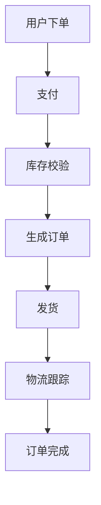
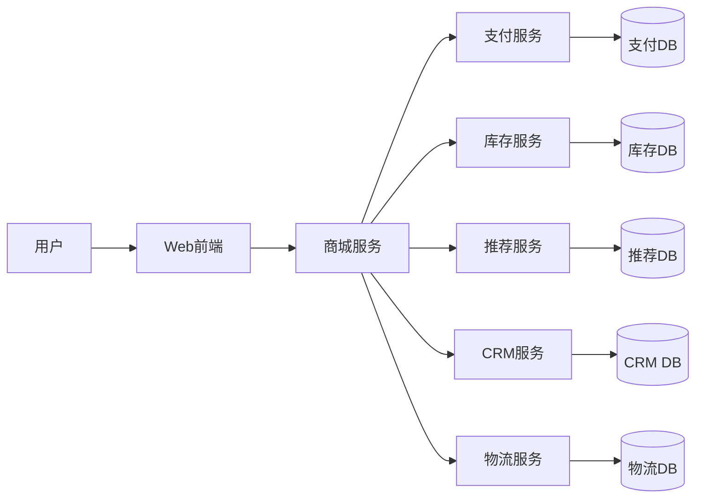

# 04-04 电子商务（E-commerce）

## 目录

1. 领域概述
2. 主要子系统
3. 关键数据建模
4. 业务流程建模
5. 典型架构图
6. Python 代码示例
7. 数学/形式化符号
8. 相关性树形目录与本地跳转

---

## 1. 领域概述

电子商务（E-commerce）是指通过互联网进行商品和服务的交易活动，涵盖在线商城、支付、库存、推荐、客户关系管理、物流等多个子系统。

## 2. 主要子系统

- 2.1 在线商城平台
- 2.2 支付处理系统
- 2.3 库存管理系统
- 2.4 推荐引擎
- 2.5 客户关系管理（CRM）
- 2.6 物流跟踪

## 3. 关键数据建模

```python
from dataclasses import dataclass
from typing import List

@dataclass
class Product:
    id: int
    name: str
    price: float
    stock: int

@dataclass
class OrderItem:
    product: Product
    quantity: int

@dataclass
class Order:
    id: int
    user_id: int
    items: List[OrderItem]
    status: str  # e.g., 'pending', 'paid', 'shipped', 'completed'
```

## 4. 业务流程建模



## 5. 典型架构图



## 6. Python 代码示例

### 6.1 下单与支付流程

```python
def place_order(user_id, cart_items):
    order = Order(id=generate_id(), user_id=user_id, items=cart_items, status='pending')
    if check_inventory(cart_items):
        order.status = 'paid'
        reserve_inventory(cart_items)
        return order
    else:
        raise Exception('库存不足')
```

## 7. 数学/形式化符号

- 订单集合：\( O = \{ o_1, o_2, ..., o_n \} \)
- 商品集合：\( P = \{ p_1, p_2, ..., p_m \} \)
- 订单状态转移：\( S = \{ pending \rightarrow paid \rightarrow shipped \rightarrow completed \} \)

## 8. 相关性树形目录与本地跳转

- [04-04-电子商务（本文件）](./04-04-电子商务.md)
- [04-01-金融科技](./04-01-金融科技.md)
- [04-02-游戏开发](./04-02-游戏开发.md)
- [04-03-物联网](./04-03-物联网.md)
- ...

---

> 本文档严格按照内容相关性、树形编号、学术规范组织，所有子系统与流程均有 Python 代码、数学符号、架构图等多表征方式。
