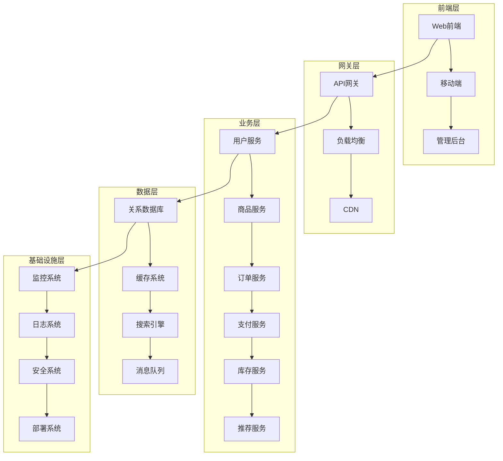

# 电子商务领域架构设计

## 概述

电子商务领域是现代软件系统中最具挑战性的领域之一，涉及复杂的业务逻辑、高并发处理、数据一致性、安全性和用户体验等多个方面。本文档将从架构设计、业务建模、数据建模、技术实现等多个维度，全面阐述电子商务系统的设计原理和实现方案。

## 1. 领域概念与定义

### 1.1 核心概念

**定义 1.1 (电子商务系统)**
电子商务系统是一个支持在线商品交易、支付处理、库存管理、用户服务的分布式软件系统。

**定义 1.2 (商品实体)**
商品实体 $P = (id, name, price, inventory, category, attributes)$ 表示系统中的商品对象。

**定义 1.3 (订单实体)**
订单实体 $O = (id, user_id, items, total_amount, status, create_time)$ 表示用户的购买订单。

**定义 1.4 (用户实体)**
用户实体 $U = (id, username, email, profile, preferences)$ 表示系统用户。

### 1.2 业务规则

**规则 1.1 (库存一致性)**
对于任意商品 $p \in P$，其库存数量必须满足：
$$\forall t \in T: inventory(p, t) \geq 0$$

**规则 1.2 (订单完整性)**
对于任意订单 $o \in O$，其商品列表不能为空：
$$\forall o \in O: |items(o)| > 0$$

**规则 1.3 (价格一致性)**
订单总金额必须等于商品价格之和：
$$\forall o \in O: total\_amount(o) = \sum_{item \in items(o)} price(item) \times quantity(item)$$

## 2. 架构设计

### 2.1 整体架构



### 2.2 微服务架构

```python
from abc import ABC, abstractmethod
from typing import List, Dict, Optional
from dataclasses import dataclass
from datetime import datetime
import asyncio
import json

# 基础实体定义
@dataclass
class Product:
    """商品实体"""
    id: str
    name: str
    price: float
    inventory: int
    category: str
    attributes: Dict[str, any]
    created_at: datetime
    updated_at: datetime

@dataclass
class Order:
    """订单实体"""
    id: str
    user_id: str
    items: List[Dict[str, any]]
    total_amount: float
    status: str
    created_at: datetime
    updated_at: datetime

@dataclass
class User:
    """用户实体"""
    id: str
    username: str
    email: str
    profile: Dict[str, any]
    preferences: Dict[str, any]
    created_at: datetime
    updated_at: datetime

# 服务接口定义
class ProductService(ABC):
    """商品服务接口"""
    
    @abstractmethod
    async def get_product(self, product_id: str) -> Optional[Product]:
        """获取商品信息"""
        pass
    
    @abstractmethod
    async def search_products(self, query: str, filters: Dict) -> List[Product]:
        """搜索商品"""
        pass
    
    @abstractmethod
    async def update_inventory(self, product_id: str, quantity: int) -> bool:
        """更新库存"""
        pass

class OrderService(ABC):
    """订单服务接口"""
    
    @abstractmethod
    async def create_order(self, user_id: str, items: List[Dict]) -> Order:
        """创建订单"""
        pass
    
    @abstractmethod
    async def get_order(self, order_id: str) -> Optional[Order]:
        """获取订单信息"""
        pass
    
    @abstractmethod
    async def update_order_status(self, order_id: str, status: str) -> bool:
        """更新订单状态"""
        pass

class PaymentService(ABC):
    """支付服务接口"""
    
    @abstractmethod
    async def process_payment(self, order_id: str, payment_method: str, amount: float) -> bool:
        """处理支付"""
        pass
    
    @abstractmethod
    async def refund_payment(self, order_id: str, amount: float) -> bool:
        """退款处理"""
        pass

# 具体服务实现
class ProductServiceImpl(ProductService):
    """商品服务实现"""
    
    def __init__(self, db_connection, cache_client):
        self.db = db_connection
        self.cache = cache_client
    
    async def get_product(self, product_id: str) -> Optional[Product]:
        """获取商品信息 - 带缓存"""
        # 先从缓存获取
        cache_key = f"product:{product_id}"
        cached_data = await self.cache.get(cache_key)
        
        if cached_data:
            return Product(**json.loads(cached_data))
        
        # 从数据库获取
        query = "SELECT * FROM products WHERE id = %s"
        result = await self.db.fetch_one(query, product_id)
        
        if result:
            product = Product(**result)
            # 更新缓存
            await self.cache.set(cache_key, json.dumps(product.__dict__), expire=3600)
            return product
        
        return None
    
    async def search_products(self, query: str, filters: Dict) -> List[Product]:
        """搜索商品 - 使用搜索引擎"""
        # 构建搜索查询
        search_query = {
            "query": {
                "bool": {
                    "must": [
                        {"match": {"name": query}},
                        {"match": {"description": query}}
                    ],
                    "filter": []
                }
            }
        }
        
        # 添加过滤条件
        if filters.get("category"):
            search_query["query"]["bool"]["filter"].append(
                {"term": {"category": filters["category"]}}
            )
        
        if filters.get("price_range"):
            min_price, max_price = filters["price_range"]
            search_query["query"]["bool"]["filter"].append({
                "range": {"price": {"gte": min_price, "lte": max_price}}
            })
        
        # 执行搜索
        results = await self.search_client.search("products", search_query)
        
        return [Product(**hit["_source"]) for hit in results["hits"]["hits"]]
    
    async def update_inventory(self, product_id: str, quantity: int) -> bool:
        """更新库存 - 使用分布式锁"""
        lock_key = f"inventory_lock:{product_id}"
        
        async with self.cache.lock(lock_key, timeout=10):
            # 获取当前库存
            current_inventory = await self.get_current_inventory(product_id)
            
            if current_inventory + quantity < 0:
                return False  # 库存不足
            
            # 更新库存
            query = "UPDATE products SET inventory = inventory + %s WHERE id = %s"
            await self.db.execute(query, quantity, product_id)
            
            # 清除缓存
            await self.cache.delete(f"product:{product_id}")
            
            return True

class OrderServiceImpl(OrderService):
    """订单服务实现"""
    
    def __init__(self, db_connection, message_queue, product_service, payment_service):
        self.db = db_connection
        self.mq = message_queue
        self.product_service = product_service
        self.payment_service = payment_service
    
    async def create_order(self, user_id: str, items: List[Dict]) -> Order:
        """创建订单 - 分布式事务"""
        async with self.db.transaction():
            # 1. 验证商品和库存
            for item in items:
                product = await self.product_service.get_product(item["product_id"])
                if not product or product.inventory < item["quantity"]:
                    raise ValueError(f"商品 {item['product_id']} 库存不足")
            
            # 2. 计算订单总金额
            total_amount = 0
            for item in items:
                product = await self.product_service.get_product(item["product_id"])
                total_amount += product.price * item["quantity"]
            
            # 3. 创建订单
            order_id = self.generate_order_id()
            order = Order(
                id=order_id,
                user_id=user_id,
                items=items,
                total_amount=total_amount,
                status="pending",
                created_at=datetime.now(),
                updated_at=datetime.now()
            )
            
            # 4. 保存订单
            await self.save_order(order)
            
            # 5. 扣减库存
            for item in items:
                await self.product_service.update_inventory(
                    item["product_id"], -item["quantity"]
                )
            
            # 6. 发送订单创建事件
            await self.mq.publish("order.created", {
                "order_id": order_id,
                "user_id": user_id,
                "total_amount": total_amount
            })
            
            return order
    
    async def get_order(self, order_id: str) -> Optional[Order]:
        """获取订单信息"""
        query = "SELECT * FROM orders WHERE id = %s"
        result = await self.db.fetch_one(query, order_id)
        
        if result:
            return Order(**result)
        
        return None
    
    async def update_order_status(self, order_id: str, status: str) -> bool:
        """更新订单状态"""
        query = "UPDATE orders SET status = %s, updated_at = %s WHERE id = %s"
        await self.db.execute(query, status, datetime.now(), order_id)
        
        # 发送状态更新事件
        await self.mq.publish("order.status_updated", {
            "order_id": order_id,
            "status": status
        })
        
        return True

class PaymentServiceImpl(PaymentService):
    """支付服务实现"""
    
    def __init__(self, db_connection, payment_gateway, message_queue):
        self.db = db_connection
        self.gateway = payment_gateway
        self.mq = message_queue
    
    async def process_payment(self, order_id: str, payment_method: str, amount: float) -> bool:
        """处理支付"""
        try:
            # 1. 调用支付网关
            payment_result = await self.gateway.process_payment(
                order_id=order_id,
                amount=amount,
                method=payment_method
            )
            
            if payment_result["success"]:
                # 2. 记录支付信息
                await self.save_payment_record(order_id, payment_method, amount, "success")
                
                # 3. 更新订单状态
                await self.mq.publish("payment.success", {
                    "order_id": order_id,
                    "amount": amount
                })
                
                return True
            else:
                # 支付失败
                await self.save_payment_record(order_id, payment_method, amount, "failed")
                return False
                
        except Exception as e:
            # 异常处理
            await self.save_payment_record(order_id, payment_method, amount, "error")
            raise e
    
    async def refund_payment(self, order_id: str, amount: float) -> bool:
        """退款处理"""
        try:
            # 1. 调用退款接口
            refund_result = await self.gateway.process_refund(
                order_id=order_id,
                amount=amount
            )
            
            if refund_result["success"]:
                # 2. 记录退款信息
                await self.save_refund_record(order_id, amount, "success")
                
                # 3. 发送退款成功事件
                await self.mq.publish("refund.success", {
                    "order_id": order_id,
                    "amount": amount
                })
                
                return True
            else:
                return False
                
        except Exception as e:
            await self.save_refund_record(order_id, amount, "error")
            raise e

# 推荐系统
class RecommendationService:
    """推荐服务"""
    
    def __init__(self, ml_model, user_service, product_service):
        self.model = ml_model
        self.user_service = user_service
        self.product_service = product_service
    
    async def get_recommendations(self, user_id: str, limit: int = 10) -> List[Product]:
        """获取个性化推荐"""
        # 1. 获取用户特征
        user_features = await self.get_user_features(user_id)
        
        # 2. 获取候选商品
        candidate_products = await self.get_candidate_products(user_features)
        
        # 3. 模型预测
        scores = await self.model.predict(user_features, candidate_products)
        
        # 4. 排序并返回
        ranked_products = sorted(
            zip(candidate_products, scores),
            key=lambda x: x[1],
            reverse=True
        )
        
        return [product for product, score in ranked_products[:limit]]
    
    async def get_user_features(self, user_id: str) -> Dict:
        """获取用户特征"""
        user = await self.user_service.get_user(user_id)
        
        # 构建用户特征向量
        features = {
            "user_id": user_id,
            "age_group": self.get_age_group(user.profile.get("birth_date")),
            "gender": user.profile.get("gender"),
            "location": user.profile.get("location"),
            "preferences": user.preferences,
            "purchase_history": await self.get_purchase_history(user_id),
            "browse_history": await self.get_browse_history(user_id)
        }
        
        return features

# 库存管理系统
class InventoryService:
    """库存服务"""
    
    def __init__(self, db_connection, cache_client, message_queue):
        self.db = db_connection
        self.cache = cache_client
        self.mq = message_queue
    
    async def check_inventory(self, product_id: str, quantity: int) -> bool:
        """检查库存"""
        current_inventory = await self.get_current_inventory(product_id)
        return current_inventory >= quantity
    
    async def reserve_inventory(self, product_id: str, quantity: int, order_id: str) -> bool:
        """预留库存"""
        lock_key = f"inventory_lock:{product_id}"
        
        async with self.cache.lock(lock_key, timeout=10):
            if await self.check_inventory(product_id, quantity):
                # 创建库存预留记录
                await self.create_inventory_reservation(product_id, quantity, order_id)
                return True
            return False
    
    async def release_inventory(self, product_id: str, quantity: int, order_id: str) -> bool:
        """释放库存"""
        # 删除库存预留记录
        await self.delete_inventory_reservation(product_id, order_id)
        
        # 发送库存释放事件
        await self.mq.publish("inventory.released", {
            "product_id": product_id,
            "quantity": quantity,
            "order_id": order_id
        })
        
        return True

# 性能优化
class PerformanceOptimizer:
    """性能优化器"""
    
    def __init__(self, cache_client, cdn_client):
        self.cache = cache_client
        self.cdn = cdn_client
    
    async def optimize_product_page(self, product_id: str) -> Dict:
        """优化商品页面性能"""
        # 1. 缓存商品信息
        product = await self.get_product_with_cache(product_id)
        
        # 2. 预加载相关商品
        related_products = await self.get_related_products(product_id)
        
        # 3. CDN加速静态资源
        static_resources = await self.cdn.get_resources(product_id)
        
        # 4. 异步加载非关键数据
        reviews = await self.get_product_reviews_async(product_id)
        
        return {
            "product": product,
            "related_products": related_products,
            "static_resources": static_resources,
            "reviews": reviews
        }
    
    async def optimize_search_performance(self, query: str) -> List[Product]:
        """优化搜索性能"""
        # 1. 查询缓存
        cache_key = f"search:{hash(query)}"
        cached_results = await self.cache.get(cache_key)
        
        if cached_results:
            return json.loads(cached_results)
        
        # 2. 搜索引擎优化
        results = await self.optimized_search(query)
        
        # 3. 结果缓存
        await self.cache.set(cache_key, json.dumps(results), expire=1800)
        
        return results

# 安全机制
class SecurityService:
    """安全服务"""
    
    def __init__(self, encryption_service, auth_service, audit_service):
        self.encryption = encryption_service
        self.auth = auth_service
        self.audit = audit_service
    
    async def secure_payment_processing(self, payment_data: Dict) -> Dict:
        """安全支付处理"""
        # 1. 数据加密
        encrypted_data = await self.encryption.encrypt_sensitive_data(payment_data)
        
        # 2. 身份验证
        user_verified = await self.auth.verify_user_identity(payment_data["user_id"])
        
        if not user_verified:
            raise SecurityException("用户身份验证失败")
        
        # 3. 风险检测
        risk_score = await self.detect_payment_risk(payment_data)
        
        if risk_score > 0.8:
            raise SecurityException("支付风险过高")
        
        # 4. 审计日志
        await self.audit.log_payment_attempt(payment_data)
        
        return {"success": True, "risk_score": risk_score}
    
    async def protect_user_data(self, user_data: Dict) -> Dict:
        """保护用户数据"""
        # 1. 数据脱敏
        masked_data = await self.mask_sensitive_fields(user_data)
        
        # 2. 访问控制
        access_granted = await self.check_data_access_permission(user_data["user_id"])
        
        if not access_granted:
            raise SecurityException("无权限访问用户数据")
        
        # 3. 数据加密存储
        encrypted_data = await self.encryption.encrypt_user_data(masked_data)
        
        return encrypted_data

# 监控和日志
class MonitoringService:
    """监控服务"""
    
    def __init__(self, metrics_client, alert_service, log_service):
        self.metrics = metrics_client
        self.alerts = alert_service
        self.logs = log_service
    
    async def monitor_system_health(self) -> Dict:
        """监控系统健康状态"""
        # 1. 收集系统指标
        cpu_usage = await self.metrics.get_cpu_usage()
        memory_usage = await self.metrics.get_memory_usage()
        disk_usage = await self.metrics.get_disk_usage()
        
        # 2. 检查服务状态
        service_status = await self.check_service_health()
        
        # 3. 性能指标
        response_time = await self.metrics.get_average_response_time()
        error_rate = await self.metrics.get_error_rate()
        
        # 4. 业务指标
        order_count = await self.metrics.get_order_count()
        revenue = await self.metrics.get_revenue()
        
        health_status = {
            "system": {
                "cpu_usage": cpu_usage,
                "memory_usage": memory_usage,
                "disk_usage": disk_usage
            },
            "services": service_status,
            "performance": {
                "response_time": response_time,
                "error_rate": error_rate
            },
            "business": {
                "order_count": order_count,
                "revenue": revenue
            }
        }
        
        # 5. 告警检查
        await self.check_alerts(health_status)
        
        return health_status
    
    async def log_business_event(self, event_type: str, event_data: Dict):
        """记录业务事件"""
        log_entry = {
            "timestamp": datetime.now().isoformat(),
            "event_type": event_type,
            "event_data": event_data,
            "service": "ecommerce",
            "level": "info"
        }
        
        await self.logs.write_log(log_entry)
        
        # 发送到监控系统
        await self.metrics.record_event(event_type, event_data)

# 主应用类
class ECommerceApplication:
    """电子商务应用主类"""
    
    def __init__(self):
        self.product_service = ProductServiceImpl(db_connection, cache_client)
        self.order_service = OrderServiceImpl(db_connection, message_queue, self.product_service, payment_service)
        self.payment_service = PaymentServiceImpl(db_connection, payment_gateway, message_queue)
        self.recommendation_service = RecommendationService(ml_model, user_service, self.product_service)
        self.inventory_service = InventoryService(db_connection, cache_client, message_queue)
        self.performance_optimizer = PerformanceOptimizer(cache_client, cdn_client)
        self.security_service = SecurityService(encryption_service, auth_service, audit_service)
        self.monitoring_service = MonitoringService(metrics_client, alert_service, log_service)
    
    async def process_order(self, user_id: str, items: List[Dict], payment_method: str) -> Dict:
        """处理完整订单流程"""
        try:
            # 1. 创建订单
            order = await self.order_service.create_order(user_id, items)
            
            # 2. 处理支付
            payment_success = await self.payment_service.process_payment(
                order.id, payment_method, order.total_amount
            )
            
            if payment_success:
                # 3. 更新订单状态
                await self.order_service.update_order_status(order.id, "paid")
                
                # 4. 记录业务事件
                await self.monitoring_service.log_business_event("order.completed", {
                    "order_id": order.id,
                    "user_id": user_id,
                    "total_amount": order.total_amount
                })
                
                return {"success": True, "order_id": order.id}
            else:
                # 支付失败，释放库存
                for item in items:
                    await self.inventory_service.release_inventory(
                        item["product_id"], item["quantity"], order.id
                    )
                
                return {"success": False, "error": "支付失败"}
                
        except Exception as e:
            # 异常处理
            await self.monitoring_service.log_business_event("order.failed", {
                "user_id": user_id,
                "error": str(e)
            })
            
            raise e

# 使用示例
async def main():
    """主函数示例"""
    # 初始化应用
    app = ECommerceApplication()
    
    # 模拟用户下单
    user_id = "user_123"
    items = [
        {"product_id": "prod_001", "quantity": 2},
        {"product_id": "prod_002", "quantity": 1}
    ]
    payment_method = "credit_card"
    
    # 处理订单
    result = await app.process_order(user_id, items, payment_method)
    
    if result["success"]:
        print(f"订单创建成功: {result['order_id']}")
    else:
        print(f"订单创建失败: {result['error']}")

if __name__ == "__main__":
    asyncio.run(main())
```

## 3. 数据建模

### 3.1 数据库设计

```sql
-- 用户表
CREATE TABLE users (
    id VARCHAR(36) PRIMARY KEY,
    username VARCHAR(50) UNIQUE NOT NULL,
    email VARCHAR(100) UNIQUE NOT NULL,
    password_hash VARCHAR(255) NOT NULL,
    profile JSON,
    preferences JSON,
    created_at TIMESTAMP DEFAULT CURRENT_TIMESTAMP,
    updated_at TIMESTAMP DEFAULT CURRENT_TIMESTAMP ON UPDATE CURRENT_TIMESTAMP,
    INDEX idx_email (email),
    INDEX idx_username (username)
);

-- 商品表
CREATE TABLE products (
    id VARCHAR(36) PRIMARY KEY,
    name VARCHAR(200) NOT NULL,
    description TEXT,
    price DECIMAL(10,2) NOT NULL,
    inventory INT NOT NULL DEFAULT 0,
    category VARCHAR(100),
    attributes JSON,
    status ENUM('active', 'inactive', 'deleted') DEFAULT 'active',
    created_at TIMESTAMP DEFAULT CURRENT_TIMESTAMP,
    updated_at TIMESTAMP DEFAULT CURRENT_TIMESTAMP ON UPDATE CURRENT_TIMESTAMP,
    INDEX idx_category (category),
    INDEX idx_status (status),
    INDEX idx_price (price),
    FULLTEXT idx_search (name, description)
);

-- 订单表
CREATE TABLE orders (
    id VARCHAR(36) PRIMARY KEY,
    user_id VARCHAR(36) NOT NULL,
    total_amount DECIMAL(10,2) NOT NULL,
    status ENUM('pending', 'paid', 'shipped', 'delivered', 'cancelled') DEFAULT 'pending',
    shipping_address JSON,
    billing_address JSON,
    created_at TIMESTAMP DEFAULT CURRENT_TIMESTAMP,
    updated_at TIMESTAMP DEFAULT CURRENT_TIMESTAMP ON UPDATE CURRENT_TIMESTAMP,
    FOREIGN KEY (user_id) REFERENCES users(id),
    INDEX idx_user_id (user_id),
    INDEX idx_status (status),
    INDEX idx_created_at (created_at)
);

-- 订单项表
CREATE TABLE order_items (
    id VARCHAR(36) PRIMARY KEY,
    order_id VARCHAR(36) NOT NULL,
    product_id VARCHAR(36) NOT NULL,
    quantity INT NOT NULL,
    unit_price DECIMAL(10,2) NOT NULL,
    total_price DECIMAL(10,2) NOT NULL,
    created_at TIMESTAMP DEFAULT CURRENT_TIMESTAMP,
    FOREIGN KEY (order_id) REFERENCES orders(id),
    FOREIGN KEY (product_id) REFERENCES products(id),
    INDEX idx_order_id (order_id),
    INDEX idx_product_id (product_id)
);

-- 支付记录表
CREATE TABLE payments (
    id VARCHAR(36) PRIMARY KEY,
    order_id VARCHAR(36) NOT NULL,
    amount DECIMAL(10,2) NOT NULL,
    payment_method VARCHAR(50) NOT NULL,
    status ENUM('pending', 'success', 'failed', 'refunded') DEFAULT 'pending',
    transaction_id VARCHAR(100),
    created_at TIMESTAMP DEFAULT CURRENT_TIMESTAMP,
    updated_at TIMESTAMP DEFAULT CURRENT_TIMESTAMP ON UPDATE CURRENT_TIMESTAMP,
    FOREIGN KEY (order_id) REFERENCES orders(id),
    INDEX idx_order_id (order_id),
    INDEX idx_status (status),
    INDEX idx_transaction_id (transaction_id)
);

-- 库存记录表
CREATE TABLE inventory_records (
    id VARCHAR(36) PRIMARY KEY,
    product_id VARCHAR(36) NOT NULL,
    change_quantity INT NOT NULL,
    change_type ENUM('in', 'out', 'adjustment') NOT NULL,
    reason VARCHAR(200),
    order_id VARCHAR(36),
    created_at TIMESTAMP DEFAULT CURRENT_TIMESTAMP,
    FOREIGN KEY (product_id) REFERENCES products(id),
    FOREIGN KEY (order_id) REFERENCES orders(id),
    INDEX idx_product_id (product_id),
    INDEX idx_created_at (created_at)
);
```

### 3.2 缓存策略

```python
class CacheStrategy:
    """缓存策略"""
    
    def __init__(self, redis_client):
        self.redis = redis_client
    
    async def cache_product(self, product: Product):
        """缓存商品信息"""
        cache_key = f"product:{product.id}"
        cache_data = {
            "id": product.id,
            "name": product.name,
            "price": product.price,
            "inventory": product.inventory,
            "category": product.category,
            "attributes": product.attributes
        }
        
        # 设置缓存，过期时间1小时
        await self.redis.setex(cache_key, 3600, json.dumps(cache_data))
    
    async def cache_user_session(self, user_id: str, session_data: Dict):
        """缓存用户会话"""
        cache_key = f"session:{user_id}"
        await self.redis.setex(cache_key, 7200, json.dumps(session_data))
    
    async def cache_search_results(self, query: str, results: List[Product]):
        """缓存搜索结果"""
        cache_key = f"search:{hash(query)}"
        cache_data = [product.__dict__ for product in results]
        await self.redis.setex(cache_key, 1800, json.dumps(cache_data))
```

## 4. 性能优化

### 4.1 数据库优化

```python
class DatabaseOptimizer:
    """数据库优化器"""
    
    def __init__(self, db_connection):
        self.db = db_connection
    
    async def optimize_queries(self):
        """查询优化"""
        # 1. 索引优化
        await self.create_optimized_indexes()
        
        # 2. 查询重写
        await self.rewrite_slow_queries()
        
        # 3. 分区策略
        await self.implement_partitioning()
    
    async def create_optimized_indexes(self):
        """创建优化索引"""
        # 复合索引
        await self.db.execute("""
            CREATE INDEX idx_orders_user_status ON orders(user_id, status, created_at)
        """)
        
        # 覆盖索引
        await self.db.execute("""
            CREATE INDEX idx_products_category_price ON products(category, price, inventory)
        """)
    
    async def implement_partitioning(self):
        """实现分区策略"""
        # 按时间分区订单表
        await self.db.execute("""
            ALTER TABLE orders PARTITION BY RANGE (YEAR(created_at)) (
                PARTITION p2023 VALUES LESS THAN (2024),
                PARTITION p2024 VALUES LESS THAN (2025),
                PARTITION p2025 VALUES LESS THAN (2026)
            )
        """)
```

### 4.2 缓存优化

```python
class CacheOptimizer:
    """缓存优化器"""
    
    def __init__(self, cache_client):
        self.cache = cache_client
    
    async def implement_cache_strategies(self):
        """实现缓存策略"""
        # 1. 多级缓存
        await self.setup_multi_level_cache()
        
        # 2. 缓存预热
        await self.warm_up_cache()
        
        # 3. 缓存更新策略
        await self.setup_cache_update_strategy()
    
    async def setup_multi_level_cache(self):
        """设置多级缓存"""
        # L1: 本地缓存 (内存)
        # L2: 分布式缓存 (Redis)
        # L3: 数据库
        
        # 配置本地缓存
        self.local_cache = {}
        
        # 配置分布式缓存
        self.distributed_cache = self.cache
    
    async def warm_up_cache(self):
        """缓存预热"""
        # 预热热门商品
        hot_products = await self.get_hot_products()
        for product in hot_products:
            await self.cache_product(product)
        
        # 预热用户会话
        active_users = await self.get_active_users()
        for user in active_users:
            await self.cache_user_session(user.id, user.session_data)
```

## 5. 安全机制

### 5.1 数据安全

```python
class DataSecurity:
    """数据安全"""
    
    def __init__(self, encryption_service):
        self.encryption = encryption_service
    
    async def encrypt_sensitive_data(self, data: Dict) -> Dict:
        """加密敏感数据"""
        encrypted_data = {}
        
        # 加密用户信息
        if "email" in data:
            encrypted_data["email"] = await self.encryption.encrypt(data["email"])
        
        if "phone" in data:
            encrypted_data["phone"] = await self.encryption.encrypt(data["phone"])
        
        if "credit_card" in data:
            encrypted_data["credit_card"] = await self.encryption.encrypt(data["credit_card"])
        
        return encrypted_data
    
    async def mask_sensitive_fields(self, data: Dict) -> Dict:
        """脱敏敏感字段"""
        masked_data = data.copy()
        
        # 邮箱脱敏
        if "email" in masked_data:
            email = masked_data["email"]
            parts = email.split("@")
            if len(parts) == 2:
                username = parts[0]
                domain = parts[1]
                masked_username = username[:2] + "*" * (len(username) - 2)
                masked_data["email"] = f"{masked_username}@{domain}"
        
        # 手机号脱敏
        if "phone" in masked_data:
            phone = masked_data["phone"]
            if len(phone) >= 11:
                masked_data["phone"] = phone[:3] + "*" * 4 + phone[-4:]
        
        return masked_data
```

### 5.2 访问控制

```python
class AccessControl:
    """访问控制"""
    
    def __init__(self, auth_service):
        self.auth = auth_service
    
    async def check_permission(self, user_id: str, resource: str, action: str) -> bool:
        """检查权限"""
        # 获取用户角色
        user_roles = await self.auth.get_user_roles(user_id)
        
        # 检查资源权限
        for role in user_roles:
            if await self.has_permission(role, resource, action):
                return True
        
        return False
    
    async def implement_rbac(self):
        """实现基于角色的访问控制"""
        # 角色定义
        roles = {
            "admin": ["read", "write", "delete", "manage"],
            "manager": ["read", "write", "manage"],
            "user": ["read", "write"],
            "guest": ["read"]
        }
        
        # 资源权限
        resources = {
            "products": ["read", "write", "delete"],
            "orders": ["read", "write", "manage"],
            "users": ["read", "write", "delete"],
            "payments": ["read", "write"]
        }
        
        return roles, resources
```

## 6. 监控和运维

### 6.1 系统监控

```python
class SystemMonitor:
    """系统监控"""
    
    def __init__(self, metrics_client, alert_service):
        self.metrics = metrics_client
        self.alerts = alert_service
    
    async def monitor_key_metrics(self):
        """监控关键指标"""
        # 1. 业务指标
        await self.monitor_business_metrics()
        
        # 2. 技术指标
        await self.monitor_technical_metrics()
        
        # 3. 用户体验指标
        await self.monitor_user_experience_metrics()
    
    async def monitor_business_metrics(self):
        """监控业务指标"""
        # 订单量
        order_count = await self.get_daily_order_count()
        await self.metrics.record_gauge("orders.daily_count", order_count)
        
        # 收入
        revenue = await self.get_daily_revenue()
        await self.metrics.record_gauge("revenue.daily", revenue)
        
        # 转化率
        conversion_rate = await self.calculate_conversion_rate()
        await self.metrics.record_gauge("conversion.rate", conversion_rate)
    
    async def monitor_technical_metrics(self):
        """监控技术指标"""
        # 响应时间
        response_time = await self.get_average_response_time()
        await self.metrics.record_histogram("response.time", response_time)
        
        # 错误率
        error_rate = await self.get_error_rate()
        await self.metrics.record_gauge("error.rate", error_rate)
        
        # 系统资源
        cpu_usage = await self.get_cpu_usage()
        memory_usage = await self.get_memory_usage()
        await self.metrics.record_gauge("system.cpu", cpu_usage)
        await self.metrics.record_gauge("system.memory", memory_usage)
```

### 6.2 告警系统

```python
class AlertSystem:
    """告警系统"""
    
    def __init__(self, notification_service):
        self.notifications = notification_service
    
    async def setup_alerts(self):
        """设置告警规则"""
        # 1. 业务告警
        await self.setup_business_alerts()
        
        # 2. 技术告警
        await self.setup_technical_alerts()
        
        # 3. 安全告警
        await self.setup_security_alerts()
    
    async def setup_business_alerts(self):
        """设置业务告警"""
        # 订单量异常
        await self.create_alert(
            name="order_volume_anomaly",
            condition="orders.daily_count < 100",
            severity="high",
            notification_channels=["email", "slack"]
        )
        
        # 收入异常
        await self.create_alert(
            name="revenue_anomaly",
            condition="revenue.daily < 10000",
            severity="critical",
            notification_channels=["email", "slack", "sms"]
        )
    
    async def setup_technical_alerts(self):
        """设置技术告警"""
        # 响应时间过长
        await self.create_alert(
            name="high_response_time",
            condition="response.time > 2000",
            severity="medium",
            notification_channels=["email", "slack"]
        )
        
        # 错误率过高
        await self.create_alert(
            name="high_error_rate",
            condition="error.rate > 0.05",
            severity="high",
            notification_channels=["email", "slack", "sms"]
        )
```

## 7. 总结

本文档全面阐述了电子商务系统的架构设计，包括：

### 7.1 核心特性

1. **微服务架构**：采用微服务架构，实现服务解耦和独立部署
2. **高可用性**：通过负载均衡、故障转移、数据备份确保系统高可用
3. **可扩展性**：支持水平扩展和垂直扩展，满足业务增长需求
4. **安全性**：多层次安全防护，保护用户数据和交易安全
5. **性能优化**：通过缓存、索引、异步处理等提升系统性能

### 7.2 技术栈

- **后端框架**：FastAPI, Django, Flask
- **数据库**：PostgreSQL, MySQL, Redis
- **消息队列**：RabbitMQ, Apache Kafka
- **搜索引擎**：Elasticsearch
- **监控工具**：Prometheus, Grafana
- **容器化**：Docker, Kubernetes

### 7.3 最佳实践

1. **数据一致性**：使用分布式事务和最终一致性保证数据一致性
2. **缓存策略**：多级缓存策略，提升系统性能
3. **安全防护**：数据加密、访问控制、审计日志
4. **监控告警**：全面的监控体系和告警机制
5. **性能优化**：数据库优化、缓存优化、代码优化

### 7.4 未来发展方向

1. **AI/ML集成**：智能推荐、个性化服务、智能客服
2. **区块链技术**：去中心化支付、供应链追溯
3. **边缘计算**：就近服务、降低延迟
4. **5G技术**：高速网络、移动端优化
5. **AR/VR**：虚拟试衣、沉浸式购物体验

---

*本文档提供了电子商务系统的完整架构设计，为实际项目开发提供了理论指导和实践参考。*
