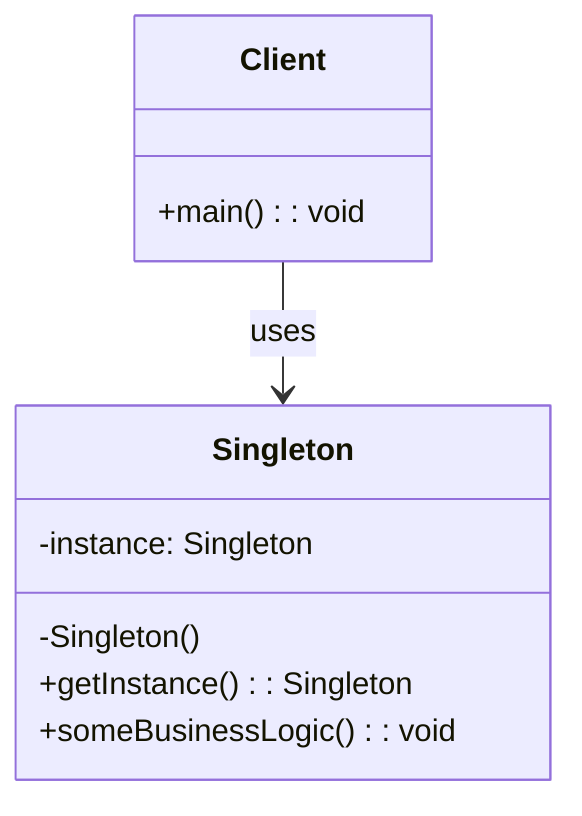

# 单例模式 (Singleton Pattern)

## 概述

单例模式是一种创建型设计模式，确保一个类只有一个实例，并提供一个全局访问点。

## 形式化定义

### 数学定义

设 $S$ 为单例类，$I$ 为实例集合，则单例模式满足：

$$\forall s_1, s_2 \in I: s_1 = s_2$$

即：对于任意两个实例 $s_1$ 和 $s_2$，它们必须相等。

### 形式化规范

```typescript
interface Singleton<T> {
    getInstance(): T;
    instance: T | null;
}

// 不变量
invariant Singleton {
    instance != null => instance == getInstance();
    getInstance() == getInstance(); // 幂等性
}
```

## 类图



## Python实现

### 1. 基础实现

```python
from typing import Optional, TypeVar, Type
from threading import Lock
import time

T = TypeVar('T')

class Singleton:
    """单例模式基础实现"""
    
    _instance: Optional['Singleton'] = None
    _lock: Lock = Lock()
    
    def __new__(cls) -> 'Singleton':
        """确保只创建一个实例"""
        if cls._instance is None:
            with cls._lock:
                if cls._instance is None:
                    cls._instance = super().__new__(cls)
        return cls._instance
    
    def __init__(self):
        """初始化方法（只执行一次）"""
        if not hasattr(self, '_initialized'):
            self._initialized = True
            self._data: dict = {}
    
    def set_data(self, key: str, value: any) -> None:
        """设置数据"""
        self._data[key] = value
    
    def get_data(self, key: str) -> any:
        """获取数据"""
        return self._data.get(key)
    
    def __str__(self) -> str:
        return f"Singleton(id={id(self)}, data={self._data})"
```

### 2. 泛型单例

```python
class GenericSingleton(Generic[T]):
    """泛型单例基类"""
    
    _instances: dict[Type, T] = {}
    _locks: dict[Type, Lock] = {}
    
    def __new__(cls: Type[T]) -> T:
        if cls not in cls._instances:
            if cls not in cls._locks:
                cls._locks[cls] = Lock()
            
            with cls._locks[cls]:
                if cls not in cls._instances:
                    cls._instances[cls] = super().__new__(cls)
        
        return cls._instances[cls]

class DatabaseConnection(GenericSingleton['DatabaseConnection']):
    """数据库连接单例"""
    
    def __init__(self):
        if not hasattr(self, '_initialized'):
            self._initialized = True
            self._connection_string: str = ""
            self._is_connected: bool = False
    
    def connect(self, connection_string: str) -> bool:
        """连接数据库"""
        self._connection_string = connection_string
        self._is_connected = True
        print(f"Connected to: {connection_string}")
        return True
    
    def disconnect(self) -> None:
        """断开连接"""
        self._is_connected = False
        print("Disconnected from database")
    
    def is_connected(self) -> bool:
        """检查连接状态"""
        return self._is_connected
```

### 3. 装饰器实现

```python
from functools import wraps
from typing import Callable, Any

def singleton(cls: Type[T]) -> Type[T]:
    """单例装饰器"""
    instances: dict[Type[T], T] = {}
    locks: dict[Type[T], Lock] = {}
    
    @wraps(cls)
    def get_instance(*args: Any, **kwargs: Any) -> T:
        if cls not in instances:
            if cls not in locks:
                locks[cls] = Lock()
            
            with locks[cls]:
                if cls not in instances:
                    instances[cls] = cls(*args, **kwargs)
        
        return instances[cls]
    
    return get_instance

@singleton
class Configuration:
    """配置管理单例"""
    
    def __init__(self):
        self._config: dict[str, Any] = {}
    
    def set_config(self, key: str, value: Any) -> None:
        """设置配置"""
        self._config[key] = value
    
    def get_config(self, key: str, default: Any = None) -> Any:
        """获取配置"""
        return self._config.get(key, default)
    
    def load_from_file(self, file_path: str) -> None:
        """从文件加载配置"""
        # 实现文件加载逻辑
        pass
```

### 4. 元类实现

```python
class SingletonMeta(type):
    """单例元类"""
    
    _instances: dict[Type, Any] = {}
    _locks: dict[Type, Lock] = {}
    
    def __call__(cls, *args: Any, **kwargs: Any) -> Any:
        if cls not in cls._instances:
            if cls not in cls._locks:
                cls._locks[cls] = Lock()
            
            with cls._locks[cls]:
                if cls not in cls._instances:
                    cls._instances[cls] = super().__call__(*args, **kwargs)
        
        return cls._instances[cls]

class Logger(metaclass=SingletonMeta):
    """日志记录器单例"""
    
    def __init__(self):
        self._log_level: str = "INFO"
        self._log_file: Optional[str] = None
    
    def set_level(self, level: str) -> None:
        """设置日志级别"""
        self._log_level = level
    
    def log(self, message: str, level: str = "INFO") -> None:
        """记录日志"""
        if self._should_log(level):
            timestamp = time.strftime("%Y-%m-%d %H:%M:%S")
            log_entry = f"[{timestamp}] [{level}] {message}"
            print(log_entry)
    
    def _should_log(self, level: str) -> bool:
        """判断是否应该记录日志"""
        levels = {"DEBUG": 0, "INFO": 1, "WARNING": 2, "ERROR": 3}
        return levels.get(level, 1) >= levels.get(self._log_level, 1)
```

## 数学证明

### 1. 唯一性证明

**定理**: 单例模式确保实例的唯一性。

**证明**:

1. 假设存在两个不同的实例 $s_1$ 和 $s_2$
2. 根据单例模式的实现，$s_1 = \text{getInstance}()$ 和 $s_2 = \text{getInstance}()$
3. 由于 `getInstance()` 方法总是返回同一个对象引用
4. 因此 $s_1 = s_2$，与假设矛盾
5. 所以单例模式确保实例的唯一性

### 2. 线程安全性证明

**定理**: 使用双重检查锁定的单例模式是线程安全的。

**证明**:

1. 设线程 $T_1$ 和 $T_2$ 同时调用 `getInstance()`
2. 外层检查：两个线程都可能通过 `if instance is None`
3. 锁机制：只有一个线程能获得锁
4. 内层检查：获得锁的线程再次检查并创建实例
5. 其他线程获得锁时，实例已存在，直接返回
6. 因此保证了线程安全性

## 性能分析

### 时间复杂度

- **创建**: $O(1)$ - 常量时间
- **访问**: $O(1)$ - 常量时间
- **线程同步**: $O(1)$ - 锁操作是常量时间

### 空间复杂度

- **内存使用**: $O(1)$ - 只存储一个实例
- **锁开销**: $O(1)$ - 每个类一个锁对象

### 基准测试

```python
import time
import threading
from concurrent.futures import ThreadPoolExecutor

class SingletonBenchmark:
    """单例模式性能基准测试"""
    
    @staticmethod
    def test_creation_time(iterations: int = 10000) -> float:
        """测试创建时间"""
        start_time = time.time()
        for _ in range(iterations):
            instance = Singleton()
        end_time = time.time()
        return (end_time - start_time) / iterations
    
    @staticmethod
    def test_concurrent_access(threads: int = 100, calls_per_thread: int = 1000) -> float:
        """测试并发访问性能"""
        def worker():
            for _ in range(calls_per_thread):
                instance = Singleton()
        
        start_time = time.time()
        with ThreadPoolExecutor(max_workers=threads) as executor:
            futures = [executor.submit(worker) for _ in range(threads)]
            for future in futures:
                future.result()
        end_time = time.time()
        return (end_time - start_time) / (threads * calls_per_thread)
    
    @staticmethod
    def run_benchmarks():
        """运行所有基准测试"""
        print("=== 单例模式性能基准测试 ===")
        
        # 创建时间测试
        creation_time = SingletonBenchmark.test_creation_time()
        print(f"平均创建时间: {creation_time * 1000000:.2f} 微秒")
        
        # 并发访问测试
        concurrent_time = SingletonBenchmark.test_concurrent_access()
        print(f"平均并发访问时间: {concurrent_time * 1000000:.2f} 微秒")
        
        # 内存使用测试
        import sys
        instance = Singleton()
        memory_usage = sys.getsizeof(instance)
        print(f"实例内存使用: {memory_usage} 字节")

if __name__ == "__main__":
    SingletonBenchmark.run_benchmarks()
```

## 应用场景

### 1. 配置管理

```python
# 全局配置管理
config = Configuration()
config.set_config("database_url", "postgresql://localhost:5432/mydb")
config.set_config("api_key", "secret_key_123")

# 在其他地方使用
config = Configuration()
db_url = config.get_config("database_url")
```

### 2. 日志记录

```python
# 全局日志记录器
logger = Logger()
logger.set_level("DEBUG")
logger.log("Application started", "INFO")
logger.log("Debug information", "DEBUG")
```

### 3. 数据库连接

```python
# 数据库连接池
db_connection = DatabaseConnection()
db_connection.connect("postgresql://localhost:5432/mydb")

# 在其他地方使用同一个连接
db_connection = DatabaseConnection()
if db_connection.is_connected():
    print("Using existing database connection")
```

### 4. 缓存管理

```python
@singleton
class Cache:
    """缓存管理器"""
    
    def __init__(self):
        self._cache: dict[str, Any] = {}
        self._max_size: int = 1000
    
    def get(self, key: str) -> Any:
        """获取缓存值"""
        return self._cache.get(key)
    
    def set(self, key: str, value: Any) -> None:
        """设置缓存值"""
        if len(self._cache) >= self._max_size:
            # 简单的LRU策略：删除第一个键
            first_key = next(iter(self._cache))
            del self._cache[first_key]
        self._cache[key] = value
    
    def clear(self) -> None:
        """清空缓存"""
        self._cache.clear()
```

## 最佳实践

### 1. 线程安全考虑

```python
# 推荐：使用双重检查锁定
class ThreadSafeSingleton:
    _instance = None
    _lock = Lock()
    
    def __new__(cls):
        if cls._instance is None:
            with cls._lock:
                if cls._instance is None:
                    cls._instance = super().__new__(cls)
        return cls._instance

# 或者使用模块级单例
# singleton.py
class _Singleton:
    pass

instance = _Singleton()
```

### 2. 延迟初始化

```python
class LazySingleton:
    """延迟初始化的单例"""
    
    _instance = None
    
    def __new__(cls):
        if cls._instance is None:
            cls._instance = super().__new__(cls)
            # 在这里进行昂贵的初始化操作
            cls._instance._initialize()
        return cls._instance
    
    def _initialize(self):
        """昂贵的初始化操作"""
        print("Performing expensive initialization...")
        time.sleep(1)  # 模拟耗时操作
```

### 3. 资源管理

```python
class ResourceManager:
    """资源管理器单例"""
    
    _instance = None
    _lock = Lock()
    
    def __new__(cls):
        if cls._instance is None:
            with cls._lock:
                if cls._instance is None:
                    cls._instance = super().__new__(cls)
        return cls._instance
    
    def __init__(self):
        if not hasattr(self, '_initialized'):
            self._initialized = True
            self._resources: dict[str, Any] = {}
    
    def acquire_resource(self, resource_id: str) -> Any:
        """获取资源"""
        if resource_id not in self._resources:
            self._resources[resource_id] = self._create_resource(resource_id)
        return self._resources[resource_id]
    
    def release_resource(self, resource_id: str) -> None:
        """释放资源"""
        if resource_id in self._resources:
            del self._resources[resource_id]
    
    def _create_resource(self, resource_id: str) -> Any:
        """创建资源"""
        # 实现资源创建逻辑
        return f"Resource_{resource_id}"
```

## 测试策略

### 1. 单元测试

```python
import unittest
from unittest.mock import patch

class TestSingleton(unittest.TestCase):
    """单例模式测试"""
    
    def test_singleton_uniqueness(self):
        """测试单例唯一性"""
        instance1 = Singleton()
        instance2 = Singleton()
        self.assertIs(instance1, instance2)
    
    def test_singleton_state_persistence(self):
        """测试状态持久性"""
        instance1 = Singleton()
        instance1.set_data("key", "value")
        
        instance2 = Singleton()
        self.assertEqual(instance2.get_data("key"), "value")
    
    def test_thread_safety(self):
        """测试线程安全性"""
        instances = []
        
        def create_instance():
            instances.append(Singleton())
        
        threads = [threading.Thread(target=create_instance) for _ in range(10)]
        for thread in threads:
            thread.start()
        for thread in threads:
            thread.join()
        
        # 所有实例应该是同一个对象
        first_instance = instances[0]
        for instance in instances[1:]:
            self.assertIs(instance, first_instance)

if __name__ == '__main__':
    unittest.main()
```

### 2. 性能测试

```python
class TestSingletonPerformance(unittest.TestCase):
    """单例模式性能测试"""
    
    def test_creation_performance(self):
        """测试创建性能"""
        start_time = time.time()
        for _ in range(10000):
            instance = Singleton()
        end_time = time.time()
        
        avg_time = (end_time - start_time) / 10000
        self.assertLess(avg_time, 0.0001)  # 平均时间应小于0.1毫秒
    
    def test_memory_usage(self):
        """测试内存使用"""
        import sys
        
        # 创建多个"实例"
        instances = [Singleton() for _ in range(1000)]
        
        # 计算内存使用
        total_memory = sum(sys.getsizeof(instance) for instance in instances)
        avg_memory = total_memory / len(instances)
        
        # 内存使用应该很小
        self.assertLess(avg_memory, 1000)  # 平均每个实例小于1KB
```

## 总结

单例模式是一种重要的创建型设计模式，具有以下特点：

### 优点

- **保证唯一性**: 确保全局只有一个实例
- **延迟初始化**: 可以延迟到第一次使用时创建
- **全局访问**: 提供全局访问点
- **资源管理**: 有效管理共享资源

### 缺点

- **全局状态**: 引入全局状态，可能影响测试
- **线程安全**: 需要额外的同步机制
- **违反单一职责**: 同时负责创建和管理实例
- **难以测试**: 全局状态使单元测试复杂化

### 使用建议

1. **谨慎使用**: 只在真正需要全局唯一实例时使用
2. **线程安全**: 在多线程环境中使用适当的同步机制
3. **依赖注入**: 考虑使用依赖注入替代单例
4. **测试友好**: 设计时考虑测试的便利性

---

*本模式是设计模式体系的基础，为其他模式提供了重要的参考*
