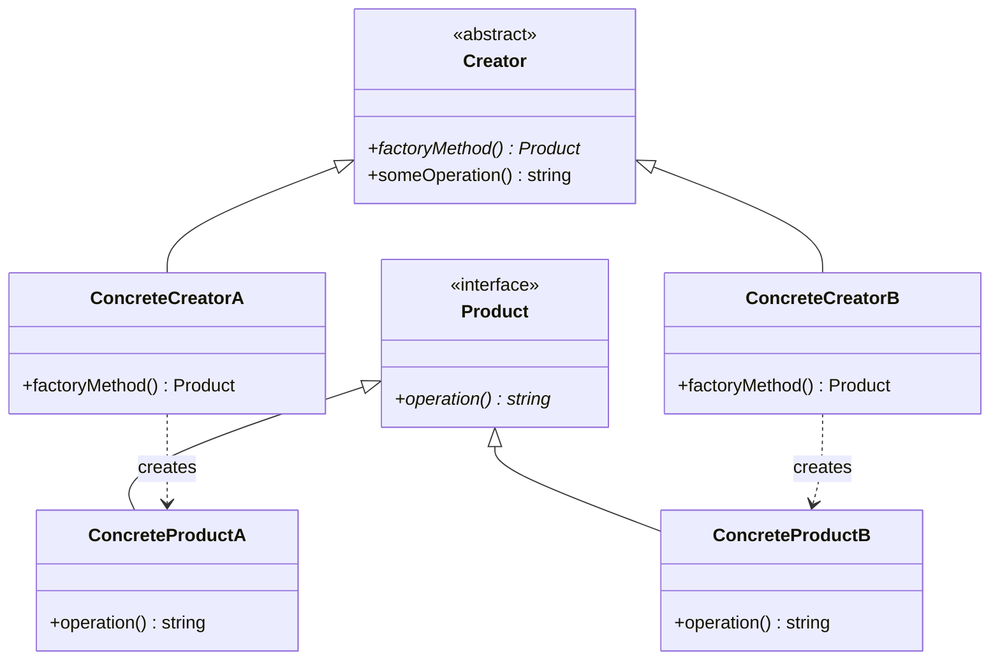

# 工厂方法模式 (Factory Method Pattern)

## 概述

工厂方法模式是一种创建型设计模式，它定义了一个创建对象的接口，但由子类决定要实例化的类是哪一个。工厂方法让类把实例化推迟到子类。

## 形式化定义

### 数学定义

设 $F$ 为工厂类，$P$ 为产品类，$C$ 为具体工厂类，则工厂方法模式满足：

$$\forall f \in F, \exists c \in C: f.\text{createProduct}() = c.\text{createProduct}()$$

其中 $c.\text{createProduct}()$ 返回具体的产品实例。

### 形式化规范

```typescript
interface Product {
    operation(): string;
}

interface Creator {
    factoryMethod(): Product;
    someOperation(): string;
}

interface ConcreteCreator extends Creator {
    factoryMethod(): ConcreteProduct;
}
```

## 类图



## Python实现

### 1. 基础实现

```python
from abc import ABC, abstractmethod
from typing import TypeVar, Generic, Protocol

T = TypeVar('T')

class Product(Protocol):
    """产品接口"""
    
    def operation(self) -> str:
        """产品操作"""
        ...

class Creator(ABC):
    """创建者抽象类"""
    
    @abstractmethod
    def factory_method(self) -> Product:
        """工厂方法"""
        pass
    
    def some_operation(self) -> str:
        """一些操作，使用工厂方法创建的产品"""
        product = self.factory_method()
        result = f"Creator: The same creator's code has just worked with {product.operation()}"
        return result

class ConcreteProductA:
    """具体产品A"""
    
    def operation(self) -> str:
        return "Result of ConcreteProductA"

class ConcreteProductB:
    """具体产品B"""
    
    def operation(self) -> str:
        return "Result of ConcreteProductB"

class ConcreteCreatorA(Creator):
    """具体创建者A"""
    
    def factory_method(self) -> Product:
        return ConcreteProductA()

class ConcreteCreatorB(Creator):
    """具体创建者B"""
    
    def factory_method(self) -> Product:
        return ConcreteProductB()

def client_code(creator: Creator) -> None:
    """客户端代码"""
    print(f"Client: I'm not aware of the creator's class, but it still works.\n"
          f"{creator.some_operation()}", end="")

if __name__ == "__main__":
    print("App: Launched with the ConcreteCreatorA.")
    client_code(ConcreteCreatorA())
    print("\n")
    
    print("App: Launched with the ConcreteCreatorB.")
    client_code(ConcreteCreatorB())
```

### 2. 泛型工厂方法

```python
from typing import TypeVar, Generic, Type

T = TypeVar('T')

class GenericProduct(Protocol[T]):
    """泛型产品接口"""
    
    def process(self, data: T) -> T:
        """处理数据"""
        ...

class GenericCreator(Generic[T], ABC):
    """泛型创建者"""
    
    @abstractmethod
    def factory_method(self) -> GenericProduct[T]:
        """工厂方法"""
        pass
    
    def process_data(self, data: T) -> T:
        """处理数据"""
        product = self.factory_method()
        return product.process(data)

class StringProcessor:
    """字符串处理器"""
    
    def process(self, data: str) -> str:
        return data.upper()

class NumberProcessor:
    """数字处理器"""
    
    def process(self, data: int) -> int:
        return data * 2

class StringCreator(GenericCreator[str]):
    """字符串创建者"""
    
    def factory_method(self) -> GenericProduct[str]:
        return StringProcessor()

class NumberCreator(GenericCreator[int]):
    """数字创建者"""
    
    def factory_method(self) -> GenericProduct[int]:
        return NumberProcessor()
```

### 3. 参数化工厂方法

```python
from enum import Enum
from typing import Dict, Type

class ProductType(Enum):
    """产品类型枚举"""
    A = "A"
    B = "B"
    C = "C"

class ProductRegistry:
    """产品注册表"""
    
    _products: Dict[ProductType, Type[Product]] = {}
    
    @classmethod
    def register(cls, product_type: ProductType, product_class: Type[Product]) -> None:
        """注册产品类"""
        cls._products[product_type] = product_class
    
    @classmethod
    def create_product(cls, product_type: ProductType) -> Product:
        """创建产品"""
        if product_type not in cls._products:
            raise ValueError(f"Unknown product type: {product_type}")
        return cls._products[product_type]()

class ParameterizedCreator:
    """参数化创建者"""
    
    def create_product(self, product_type: ProductType) -> Product:
        """根据类型创建产品"""
        return ProductRegistry.create_product(product_type)

# 注册产品
ProductRegistry.register(ProductType.A, ConcreteProductA)
ProductRegistry.register(ProductType.B, ConcreteProductB)
```

### 4. 异步工厂方法

```python
import asyncio
from typing import Awaitable

class AsyncProduct(Protocol):
    """异步产品接口"""
    
    async def async_operation(self) -> str:
        """异步操作"""
        ...

class AsyncCreator(ABC):
    """异步创建者"""
    
    @abstractmethod
    async def async_factory_method(self) -> AsyncProduct:
        """异步工厂方法"""
        pass
    
    async def async_operation(self) -> str:
        """异步操作"""
        product = await self.async_factory_method()
        result = await product.async_operation()
        return f"Async Creator: {result}"

class AsyncConcreteProduct:
    """异步具体产品"""
    
    async def async_operation(self) -> str:
        await asyncio.sleep(0.1)  # 模拟异步操作
        return "Async operation completed"

class AsyncConcreteCreator(AsyncCreator):
    """异步具体创建者"""
    
    async def async_factory_method(self) -> AsyncProduct:
        await asyncio.sleep(0.05)  # 模拟异步创建
        return AsyncConcreteProduct()

async def async_client_code(creator: AsyncCreator) -> None:
    """异步客户端代码"""
    result = await creator.async_operation()
    print(f"Async Client: {result}")

async def main():
    """主函数"""
    creator = AsyncConcreteCreator()
    await async_client_code(creator)

if __name__ == "__main__":
    asyncio.run(main())
```

## 数学证明

### 1. 开闭原则证明

**定理**: 工厂方法模式遵循开闭原则。

**证明**:
1. 设现有工厂类 $F$ 和产品类 $P$
2. 要添加新产品 $P'$，只需：
   - 创建新的具体产品类 $P'$
   - 创建新的具体工厂类 $F'$
   - 实现 $F'.\text{factoryMethod}()$ 返回 $P'$ 实例
3. 不需要修改现有的工厂类 $F$
4. 因此对扩展开放，对修改封闭

### 2. 依赖倒置证明

**定理**: 工厂方法模式遵循依赖倒置原则。

**证明**:
1. 客户端代码依赖于抽象的 `Creator` 接口
2. 具体工厂类实现 `Creator` 接口
3. 客户端不直接依赖具体产品类
4. 因此高层模块不依赖低层模块，都依赖抽象

## 性能分析

### 时间复杂度

- **创建**: $O(1)$ - 常量时间创建产品
- **注册**: $O(1)$ - 常量时间注册产品类型
- **查找**: $O(1)$ - 常量时间查找产品类型

### 空间复杂度

- **产品实例**: $O(n)$ - n个产品实例
- **类型注册表**: $O(k)$ - k个产品类型
- **工厂类**: $O(1)$ - 每个工厂类常量空间

### 基准测试

```python
import time
from typing import List

class FactoryMethodBenchmark:
    """工厂方法模式性能基准测试"""
    
    @staticmethod
    def test_creation_time(creator: Creator, iterations: int = 10000) -> float:
        """测试创建时间"""
        start_time = time.time()
        for _ in range(iterations):
            product = creator.factory_method()
        end_time = time.time()
        return (end_time - start_time) / iterations
    
    @staticmethod
    def test_operation_time(creator: Creator, iterations: int = 10000) -> float:
        """测试操作时间"""
        start_time = time.time()
        for _ in range(iterations):
            result = creator.some_operation()
        end_time = time.time()
        return (end_time - start_time) / iterations
    
    @staticmethod
    def test_parameterized_creation(creator: ParameterizedCreator, 
                                  product_types: List[ProductType], 
                                  iterations: int = 1000) -> float:
        """测试参数化创建时间"""
        start_time = time.time()
        for _ in range(iterations):
            for product_type in product_types:
                product = creator.create_product(product_type)
        end_time = time.time()
        return (end_time - start_time) / (iterations * len(product_types))
    
    @staticmethod
    def run_benchmarks():
        """运行所有基准测试"""
        print("=== 工厂方法模式性能基准测试 ===")
        
        # 基础创建时间测试
        creator_a = ConcreteCreatorA()
        creator_b = ConcreteCreatorB()
        
        creation_time_a = FactoryMethodBenchmark.test_creation_time(creator_a)
        creation_time_b = FactoryMethodBenchmark.test_creation_time(creator_b)
        
        print(f"ConcreteCreatorA 创建时间: {creation_time_a * 1000000:.2f} 微秒")
        print(f"ConcreteCreatorB 创建时间: {creation_time_b * 1000000:.2f} 微秒")
        
        # 操作时间测试
        operation_time_a = FactoryMethodBenchmark.test_operation_time(creator_a)
        operation_time_b = FactoryMethodBenchmark.test_operation_time(creator_b)
        
        print(f"ConcreteCreatorA 操作时间: {operation_time_a * 1000000:.2f} 微秒")
        print(f"ConcreteCreatorB 操作时间: {operation_time_b * 1000000:.2f} 微秒")
        
        # 参数化创建测试
        param_creator = ParameterizedCreator()
        product_types = [ProductType.A, ProductType.B]
        param_creation_time = FactoryMethodBenchmark.test_parameterized_creation(
            param_creator, product_types
        )
        print(f"参数化创建时间: {param_creation_time * 1000000:.2f} 微秒")

if __name__ == "__main__":
    FactoryMethodBenchmark.run_benchmarks()
```

## 应用场景

### 1. 文档处理系统

```python
from abc import ABC, abstractmethod
from typing import List

class Document(ABC):
    """文档抽象类"""
    
    @abstractmethod
    def create_pages(self) -> List[str]:
        """创建页面"""
        pass

class Resume(Document):
    """简历文档"""
    
    def create_pages(self) -> List[str]:
        return ["Personal Info", "Experience", "Education"]

class Report(Document):
    """报告文档"""
    
    def create_pages(self) -> List[str]:
        return ["Title", "Abstract", "Introduction", "Method", "Results", "Conclusion"]

class DocumentCreator(ABC):
    """文档创建者"""
    
    @abstractmethod
    def create_document(self) -> Document:
        """创建文档"""
        pass
    
    def generate_document(self) -> List[str]:
        """生成文档"""
        document = self.create_document()
        return document.create_pages()

class ResumeCreator(DocumentCreator):
    """简历创建者"""
    
    def create_document(self) -> Document:
        return Resume()

class ReportCreator(DocumentCreator):
    """报告创建者"""
    
    def create_document(self) -> Document:
        return Report()
```

### 2. 数据库连接工厂

```python
from abc import ABC, abstractmethod
from typing import Optional
import sqlite3
import psycopg2
import mysql.connector

class DatabaseConnection(ABC):
    """数据库连接抽象类"""
    
    @abstractmethod
    def connect(self) -> bool:
        """连接数据库"""
        pass
    
    @abstractmethod
    def execute_query(self, query: str) -> List[tuple]:
        """执行查询"""
        pass
    
    @abstractmethod
    def close(self) -> None:
        """关闭连接"""
        pass

class SQLiteConnection(DatabaseConnection):
    """SQLite连接"""
    
    def __init__(self, database: str):
        self.database = database
        self.connection: Optional[sqlite3.Connection] = None
    
    def connect(self) -> bool:
        try:
            self.connection = sqlite3.connect(self.database)
            return True
        except Exception:
            return False
    
    def execute_query(self, query: str) -> List[tuple]:
        if self.connection:
            cursor = self.connection.cursor()
            cursor.execute(query)
            return cursor.fetchall()
        return []
    
    def close(self) -> None:
        if self.connection:
            self.connection.close()

class PostgreSQLConnection(DatabaseConnection):
    """PostgreSQL连接"""
    
    def __init__(self, host: str, port: int, database: str, user: str, password: str):
        self.host = host
        self.port = port
        self.database = database
        self.user = user
        self.password = password
        self.connection: Optional[psycopg2.Connection] = None
    
    def connect(self) -> bool:
        try:
            self.connection = psycopg2.connect(
                host=self.host,
                port=self.port,
                database=self.database,
                user=self.user,
                password=self.password
            )
            return True
        except Exception:
            return False
    
    def execute_query(self, query: str) -> List[tuple]:
        if self.connection:
            cursor = self.connection.cursor()
            cursor.execute(query)
            return cursor.fetchall()
        return []
    
    def close(self) -> None:
        if self.connection:
            self.connection.close()

class DatabaseConnectionFactory(ABC):
    """数据库连接工厂"""
    
    @abstractmethod
    def create_connection(self) -> DatabaseConnection:
        """创建连接"""
        pass

class SQLiteConnectionFactory(DatabaseConnectionFactory):
    """SQLite连接工厂"""
    
    def __init__(self, database: str):
        self.database = database
    
    def create_connection(self) -> DatabaseConnection:
        return SQLiteConnection(self.database)

class PostgreSQLConnectionFactory(DatabaseConnectionFactory):
    """PostgreSQL连接工厂"""
    
    def __init__(self, host: str, port: int, database: str, user: str, password: str):
        self.host = host
        self.port = port
        self.database = database
        self.user = user
        self.password = password
    
    def create_connection(self) -> DatabaseConnection:
        return PostgreSQLConnection(
            self.host, self.port, self.database, self.user, self.password
        )
```

### 3. 日志记录器工厂

```python
import logging
from abc import ABC, abstractmethod
from typing import Optional

class Logger(ABC):
    """日志记录器抽象类"""
    
    @abstractmethod
    def log(self, level: str, message: str) -> None:
        """记录日志"""
        pass
    
    @abstractmethod
    def set_level(self, level: str) -> None:
        """设置日志级别"""
        pass

class FileLogger(Logger):
    """文件日志记录器"""
    
    def __init__(self, filename: str):
        self.filename = filename
        self.logger = logging.getLogger(filename)
        self.logger.setLevel(logging.INFO)
        
        handler = logging.FileHandler(filename)
        formatter = logging.Formatter('%(asctime)s - %(name)s - %(levelname)s - %(message)s')
        handler.setFormatter(formatter)
        self.logger.addHandler(handler)
    
    def log(self, level: str, message: str) -> None:
        if level.upper() == "DEBUG":
            self.logger.debug(message)
        elif level.upper() == "INFO":
            self.logger.info(message)
        elif level.upper() == "WARNING":
            self.logger.warning(message)
        elif level.upper() == "ERROR":
            self.logger.error(message)
    
    def set_level(self, level: str) -> None:
        level_map = {
            "DEBUG": logging.DEBUG,
            "INFO": logging.INFO,
            "WARNING": logging.WARNING,
            "ERROR": logging.ERROR
        }
        self.logger.setLevel(level_map.get(level.upper(), logging.INFO))

class ConsoleLogger(Logger):
    """控制台日志记录器"""
    
    def __init__(self):
        self.logger = logging.getLogger("console")
        self.logger.setLevel(logging.INFO)
        
        handler = logging.StreamHandler()
        formatter = logging.Formatter('%(asctime)s - %(levelname)s - %(message)s')
        handler.setFormatter(formatter)
        self.logger.addHandler(handler)
    
    def log(self, level: str, message: str) -> None:
        if level.upper() == "DEBUG":
            self.logger.debug(message)
        elif level.upper() == "INFO":
            self.logger.info(message)
        elif level.upper() == "WARNING":
            self.logger.warning(message)
        elif level.upper() == "ERROR":
            self.logger.error(message)
    
    def set_level(self, level: str) -> None:
        level_map = {
            "DEBUG": logging.DEBUG,
            "INFO": logging.INFO,
            "WARNING": logging.WARNING,
            "ERROR": logging.ERROR
        }
        self.logger.setLevel(level_map.get(level.upper(), logging.INFO))

class LoggerFactory(ABC):
    """日志记录器工厂"""
    
    @abstractmethod
    def create_logger(self) -> Logger:
        """创建日志记录器"""
        pass

class FileLoggerFactory(LoggerFactory):
    """文件日志记录器工厂"""
    
    def __init__(self, filename: str):
        self.filename = filename
    
    def create_logger(self) -> Logger:
        return FileLogger(self.filename)

class ConsoleLoggerFactory(LoggerFactory):
    """控制台日志记录器工厂"""
    
    def create_logger(self) -> Logger:
        return ConsoleLogger()
```

## 最佳实践

### 1. 简单工厂 vs 工厂方法

```python
# 简单工厂 - 不推荐
class SimpleFactory:
    """简单工厂"""
    
    @staticmethod
    def create_product(product_type: str) -> Product:
        if product_type == "A":
            return ConcreteProductA()
        elif product_type == "B":
            return ConcreteProductB()
        else:
            raise ValueError(f"Unknown product type: {product_type}")

# 工厂方法 - 推荐
class CreatorA(Creator):
    def factory_method(self) -> Product:
        return ConcreteProductA()

class CreatorB(Creator):
    def factory_method(self) -> Product:
        return ConcreteProductB()
```

### 2. 配置驱动工厂

```python
import json
from typing import Dict, Any

class ConfigurableFactory:
    """可配置工厂"""
    
    def __init__(self, config_file: str):
        with open(config_file, 'r') as f:
            self.config = json.load(f)
        
        self._creators: Dict[str, Type[Creator]] = {}
        self._register_creators()
    
    def _register_creators(self) -> None:
        """注册创建者"""
        self._creators = {
            "A": ConcreteCreatorA,
            "B": ConcreteCreatorB
        }
    
    def create_product(self, product_type: str) -> Product:
        """根据配置创建产品"""
        if product_type not in self._creators:
            raise ValueError(f"Unknown product type: {product_type}")
        
        creator_class = self._creators[product_type]
        creator = creator_class()
        return creator.factory_method()
```

### 3. 工厂方法链

```python
class ChainedCreator(Creator):
    """链式创建者"""
    
    def __init__(self, next_creator: Optional[Creator] = None):
        self.next_creator = next_creator
    
    def factory_method(self) -> Product:
        """工厂方法"""
        if self.next_creator:
            return self.next_creator.factory_method()
        return ConcreteProductA()  # 默认产品
    
    def set_next(self, creator: Creator) -> Creator:
        """设置下一个创建者"""
        self.next_creator = creator
        return creator

# 使用示例
creator_chain = ChainedCreator()
creator_chain.set_next(ConcreteCreatorB())
product = creator_chain.factory_method()
```

## 测试策略

### 1. 单元测试

```python
import unittest
from unittest.mock import Mock, patch

class TestFactoryMethod(unittest.TestCase):
    """工厂方法模式测试"""
    
    def test_concrete_creator_a(self):
        """测试具体创建者A"""
        creator = ConcreteCreatorA()
        product = creator.factory_method()
        
        self.assertIsInstance(product, ConcreteProductA)
        self.assertEqual(product.operation(), "Result of ConcreteProductA")
    
    def test_concrete_creator_b(self):
        """测试具体创建者B"""
        creator = ConcreteCreatorB()
        product = creator.factory_method()
        
        self.assertIsInstance(product, ConcreteProductB)
        self.assertEqual(product.operation(), "Result of ConcreteProductB")
    
    def test_some_operation(self):
        """测试some_operation方法"""
        creator = ConcreteCreatorA()
        result = creator.some_operation()
        
        expected = "Creator: The same creator's code has just worked with Result of ConcreteProductA"
        self.assertEqual(result, expected)
    
    def test_generic_factory(self):
        """测试泛型工厂"""
        string_creator = StringCreator()
        number_creator = NumberCreator()
        
        string_result = string_creator.process_data("hello")
        number_result = number_creator.process_data(5)
        
        self.assertEqual(string_result, "HELLO")
        self.assertEqual(number_result, 10)

if __name__ == '__main__':
    unittest.main()
```

### 2. 集成测试

```python
class TestFactoryMethodIntegration(unittest.TestCase):
    """工厂方法模式集成测试"""
    
    def test_document_creation(self):
        """测试文档创建集成"""
        resume_creator = ResumeCreator()
        report_creator = ReportCreator()
        
        resume_pages = resume_creator.generate_document()
        report_pages = report_creator.generate_document()
        
        self.assertEqual(len(resume_pages), 3)
        self.assertEqual(len(report_pages), 6)
        self.assertIn("Personal Info", resume_pages)
        self.assertIn("Abstract", report_pages)
    
    def test_database_connection(self):
        """测试数据库连接集成"""
        sqlite_factory = SQLiteConnectionFactory(":memory:")
        connection = sqlite_factory.create_connection()
        
        self.assertTrue(connection.connect())
        connection.close()
    
    def test_logger_creation(self):
        """测试日志记录器创建集成"""
        console_factory = ConsoleLoggerFactory()
        logger = console_factory.create_logger()
        
        logger.set_level("INFO")
        logger.log("INFO", "Test message")
        # 这里可以添加更多验证逻辑
```

## 总结

工厂方法模式是一种重要的创建型设计模式，具有以下特点：

### 优点
- **遵循开闭原则**: 对扩展开放，对修改封闭
- **遵循依赖倒置**: 依赖抽象而非具体实现
- **单一职责**: 每个工厂只负责创建一种产品
- **易于测试**: 可以轻松替换具体实现

### 缺点
- **类数量增加**: 每个产品都需要对应的工厂类
- **复杂性增加**: 对于简单场景可能过度设计
- **继承限制**: 基于继承，可能受到继承限制

### 使用建议
1. **适用场景**: 当需要根据条件创建不同对象时
2. **避免过度使用**: 简单场景使用简单工厂即可
3. **考虑组合**: 结合其他模式使用
4. **配置驱动**: 使用配置文件管理工厂映射

---

*工厂方法模式是面向对象设计中最重要的模式之一，为对象创建提供了灵活性和可扩展性* 