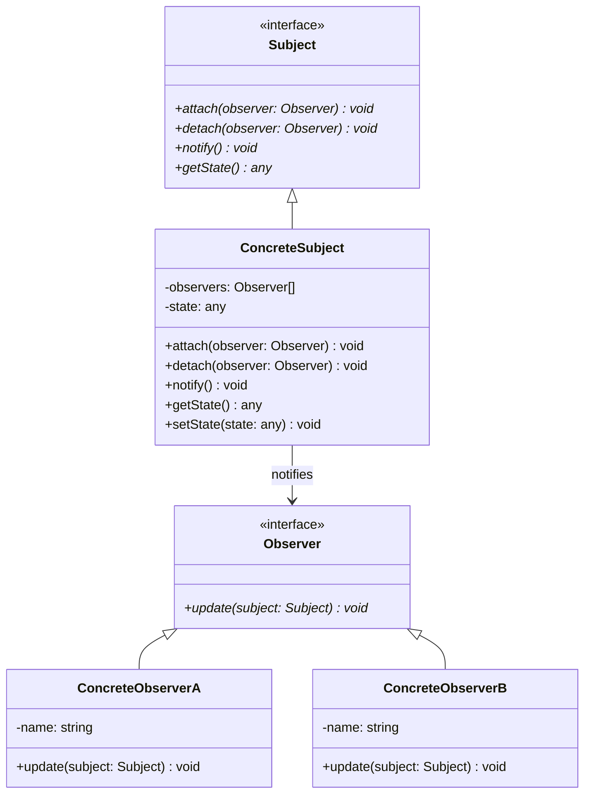

# 观察者模式 (Observer Pattern)

## 概述

观察者模式是一种行为型设计模式，它定义了一种一对多的依赖关系，让多个观察者对象同时监听某一个主题对象。当主题对象发生变化时，它的所有依赖者（观察者）都会收到通知并自动更新。

## 形式化定义

### 数学定义

设 $S$ 为主题集合，$O$ 为观察者集合，$N$ 为通知函数，则观察者模式满足：

$$\forall s \in S, \forall o \in O: s.\text{notify}() \rightarrow o.\text{update}(s.\text{getState}())$$

即：当主题状态改变时，所有观察者都会收到通知并更新。

### 形式化规范

```typescript
interface Subject {
    attach(observer: Observer): void;
    detach(observer: Observer): void;
    notify(): void;
    getState(): any;
}

interface Observer {
    update(subject: Subject): void;
}

interface ConcreteSubject extends Subject {
    setState(state: any): void;
}

interface ConcreteObserver extends Observer {
    update(subject: Subject): void;
}
```

## 类图



## Python实现

### 1. 基础实现

```python
from abc import ABC, abstractmethod
from typing import List, Any
from dataclasses import dataclass
from datetime import datetime

class Observer(ABC):
    """观察者抽象类"""
    
    @abstractmethod
    def update(self, subject: 'Subject') -> None:
        """更新方法"""
        pass

class Subject(ABC):
    """主题抽象类"""
    
    def __init__(self):
        self._observers: List[Observer] = []
    
    def attach(self, observer: Observer) -> None:
        """添加观察者"""
        if observer not in self._observers:
            self._observers.append(observer)
    
    def detach(self, observer: Observer) -> None:
        """移除观察者"""
        try:
            self._observers.remove(observer)
        except ValueError:
            pass
    
    def notify(self) -> None:
        """通知所有观察者"""
        for observer in self._observers:
            observer.update(self)
    
    @abstractmethod
    def get_state(self) -> Any:
        """获取状态"""
        pass

class ConcreteSubject(Subject):
    """具体主题"""
    
    def __init__(self):
        super().__init__()
        self._state: Any = None
    
    def get_state(self) -> Any:
        """获取状态"""
        return self._state
    
    def set_state(self, state: Any) -> None:
        """设置状态"""
        self._state = state
        self.notify()  # 状态改变时自动通知

class ConcreteObserverA(Observer):
    """具体观察者A"""
    
    def __init__(self, name: str):
        self.name = name
    
    def update(self, subject: Subject) -> None:
        """更新方法"""
        state = subject.get_state()
        print(f"ObserverA {self.name}: Reacted to the event. State: {state}")

class ConcreteObserverB(Observer):
    """具体观察者B"""
    
    def __init__(self, name: str):
        self.name = name
    
    def update(self, subject: Subject) -> None:
        """更新方法"""
        state = subject.get_state()
        print(f"ObserverB {self.name}: Reacted to the event. State: {state}")

def client_code():
    """客户端代码"""
    subject = ConcreteSubject()
    
    observer_a1 = ConcreteObserverA("1")
    observer_a2 = ConcreteObserverA("2")
    observer_b1 = ConcreteObserverB("1")
    
    subject.attach(observer_a1)
    subject.attach(observer_a2)
    subject.attach(observer_b1)
    
    print("Setting state to 'First'")
    subject.set_state("First")
    
    print("\nSetting state to 'Second'")
    subject.set_state("Second")
    
    print("\nDetaching observer_a2")
    subject.detach(observer_a2)
    
    print("Setting state to 'Third'")
    subject.set_state("Third")

if __name__ == "__main__":
    client_code()
```

### 2. 事件驱动实现

```python
from typing import Dict, List, Callable, Any
from dataclasses import dataclass
from enum import Enum

class EventType(Enum):
    """事件类型枚举"""
    DATA_CHANGED = "data_changed"
    STATUS_UPDATED = "status_updated"
    ERROR_OCCURRED = "error_occurred"

@dataclass
class Event:
    """事件数据类"""
    type: EventType
    data: Any
    timestamp: datetime
    source: str

class EventSubject:
    """事件主题"""
    
    def __init__(self):
        self._observers: Dict[EventType, List[Callable[[Event], None]]] = {
            event_type: [] for event_type in EventType
        }
    
    def subscribe(self, event_type: EventType, callback: Callable[[Event], None]) -> None:
        """订阅事件"""
        if callback not in self._observers[event_type]:
            self._observers[event_type].append(callback)
    
    def unsubscribe(self, event_type: EventType, callback: Callable[[Event], None]) -> None:
        """取消订阅"""
        try:
            self._observers[event_type].remove(callback)
        except ValueError:
            pass
    
    def publish(self, event: Event) -> None:
        """发布事件"""
        for callback in self._observers[event.type]:
            try:
                callback(event)
            except Exception as e:
                print(f"Error in observer callback: {e}")

class DataProcessor:
    """数据处理器"""
    
    def __init__(self, event_subject: EventSubject):
        self.event_subject = event_subject
        self.data: Dict[str, Any] = {}
    
    def update_data(self, key: str, value: Any) -> None:
        """更新数据"""
        self.data[key] = value
        event = Event(
            type=EventType.DATA_CHANGED,
            data={"key": key, "value": value},
            timestamp=datetime.now(),
            source="DataProcessor"
        )
        self.event_subject.publish(event)
    
    def set_status(self, status: str) -> None:
        """设置状态"""
        event = Event(
            type=EventType.STATUS_UPDATED,
            data={"status": status},
            timestamp=datetime.now(),
            source="DataProcessor"
        )
        self.event_subject.publish(event)
    
    def report_error(self, error: str) -> None:
        """报告错误"""
        event = Event(
            type=EventType.ERROR_OCCURRED,
            data={"error": error},
            timestamp=datetime.now(),
            source="DataProcessor"
        )
        self.event_subject.publish(event)

class Logger:
    """日志记录器"""
    
    def __init__(self, name: str):
        self.name = name
    
    def log_data_change(self, event: Event) -> None:
        """记录数据变化"""
        print(f"[{self.name}] Data changed: {event.data}")
    
    def log_status_update(self, event: Event) -> None:
        """记录状态更新"""
        print(f"[{self.name}] Status updated: {event.data}")
    
    def log_error(self, event: Event) -> None:
        """记录错误"""
        print(f"[{self.name}] Error occurred: {event.data}")

class MetricsCollector:
    """指标收集器"""
    
    def __init__(self):
        self.metrics: Dict[str, int] = {}
    
    def collect_data_change(self, event: Event) -> None:
        """收集数据变化指标"""
        key = event.data["key"]
        self.metrics[f"data_change_{key}"] = self.metrics.get(f"data_change_{key}", 0) + 1
        print(f"Metrics: Data change count for '{key}': {self.metrics[f'data_change_{key}']}")
    
    def collect_error(self, event: Event) -> None:
        """收集错误指标"""
        self.metrics["error_count"] = self.metrics.get("error_count", 0) + 1
        print(f"Metrics: Total error count: {self.metrics['error_count']}")
```

### 3. 异步观察者模式

```python
import asyncio
from typing import List, Callable, Awaitable, Any
from abc import ABC, abstractmethod

class AsyncObserver(ABC):
    """异步观察者抽象类"""
    
    @abstractmethod
    async def update(self, subject: 'AsyncSubject') -> None:
        """异步更新方法"""
        pass

class AsyncSubject(ABC):
    """异步主题抽象类"""
    
    def __init__(self):
        self._observers: List[AsyncObserver] = []
    
    def attach(self, observer: AsyncObserver) -> None:
        """添加观察者"""
        if observer not in self._observers:
            self._observers.append(observer)
    
    def detach(self, observer: AsyncObserver) -> None:
        """移除观察者"""
        try:
            self._observers.remove(observer)
        except ValueError:
            pass
    
    async def notify(self) -> None:
        """异步通知所有观察者"""
        tasks = [observer.update(self) for observer in self._observers]
        await asyncio.gather(*tasks, return_exceptions=True)
    
    @abstractmethod
    def get_state(self) -> Any:
        """获取状态"""
        pass

class AsyncConcreteSubject(AsyncSubject):
    """异步具体主题"""
    
    def __init__(self):
        super().__init__()
        self._state: Any = None
    
    def get_state(self) -> Any:
        """获取状态"""
        return self._state
    
    async def set_state(self, state: Any) -> None:
        """异步设置状态"""
        self._state = state
        await self.notify()

class AsyncConcreteObserver(AsyncObserver):
    """异步具体观察者"""
    
    def __init__(self, name: str, delay: float = 0.1):
        self.name = name
        self.delay = delay
    
    async def update(self, subject: AsyncSubject) -> None:
        """异步更新方法"""
        await asyncio.sleep(self.delay)  # 模拟异步处理
        state = subject.get_state()
        print(f"AsyncObserver {self.name}: Processed state: {state}")

async def async_client_code():
    """异步客户端代码"""
    subject = AsyncConcreteSubject()
    
    observer1 = AsyncConcreteObserver("1", 0.1)
    observer2 = AsyncConcreteObserver("2", 0.2)
    observer3 = AsyncConcreteObserver("3", 0.05)
    
    subject.attach(observer1)
    subject.attach(observer2)
    subject.attach(observer3)
    
    print("Setting state to 'Async First'")
    await subject.set_state("Async First")
    
    print("\nSetting state to 'Async Second'")
    await subject.set_state("Async Second")

if __name__ == "__main__":
    asyncio.run(async_client_code())
```

### 4. 响应式观察者模式

```python
from typing import Generic, TypeVar, List, Callable
from dataclasses import dataclass
from datetime import datetime

T = TypeVar('T')

@dataclass
class ObservableValue(Generic[T]):
    """可观察值"""
    value: T
    timestamp: datetime
    
    def __post_init__(self):
        if self.timestamp is None:
            self.timestamp = datetime.now()

class ReactiveSubject(Generic[T]):
    """响应式主题"""
    
    def __init__(self, initial_value: T):
        self._value = ObservableValue(initial_value, datetime.now())
        self._observers: List[Callable[[ObservableValue[T]], None]] = []
    
    def subscribe(self, callback: Callable[[ObservableValue[T]], None]) -> None:
        """订阅变化"""
        if callback not in self._observers:
            self._observers.append(callback)
    
    def unsubscribe(self, callback: Callable[[ObservableValue[T]], None]) -> None:
        """取消订阅"""
        try:
            self._observers.remove(callback)
        except ValueError:
            pass
    
    def set_value(self, value: T) -> None:
        """设置值"""
        self._value = ObservableValue(value, datetime.now())
        self._notify()
    
    def get_value(self) -> T:
        """获取当前值"""
        return self._value.value
    
    def get_observable_value(self) -> ObservableValue[T]:
        """获取可观察值"""
        return self._value
    
    def _notify(self) -> None:
        """通知观察者"""
        for observer in self._observers:
            try:
                observer(self._value)
            except Exception as e:
                print(f"Error in reactive observer: {e}")

class ReactiveObserver:
    """响应式观察者"""
    
    def __init__(self, name: str):
        self.name = name
        self.history: List[ObservableValue] = []
    
    def on_value_change(self, observable_value: ObservableValue) -> None:
        """值变化回调"""
        self.history.append(observable_value)
        print(f"[{self.name}] Value changed to: {observable_value.value} "
              f"at {observable_value.timestamp}")
    
    def get_history(self) -> List[ObservableValue]:
        """获取历史记录"""
        return self.history.copy()

# 使用示例
def reactive_example():
    """响应式示例"""
    # 创建响应式主题
    counter = ReactiveSubject(0)
    
    # 创建观察者
    observer1 = ReactiveObserver("CounterLogger")
    observer2 = ReactiveObserver("CounterAnalyzer")
    
    # 订阅变化
    counter.subscribe(observer1.on_value_change)
    counter.subscribe(observer2.on_value_change)
    
    # 模拟值变化
    for i in range(1, 4):
        counter.set_value(i)
    
    # 查看历史记录
    print(f"\nObserver1 history: {len(observer1.get_history())} changes")
    print(f"Observer2 history: {len(observer2.get_history())} changes")
```

## 数学证明

### 1. 通知完整性证明

**定理**: 观察者模式确保所有观察者都能收到通知。

**证明**:
1. 设主题 $S$ 有观察者集合 $O = \{o_1, o_2, ..., o_n\}$
2. 当 $S$ 状态改变时，调用 `notify()` 方法
3. `notify()` 方法遍历所有观察者：$\forall o \in O$
4. 对每个观察者调用 `update()` 方法
5. 因此所有观察者都会收到通知

### 2. 解耦性证明

**定理**: 观察者模式实现了主题和观察者的解耦。

**证明**:
1. 主题只依赖观察者接口，不依赖具体实现
2. 观察者只依赖主题接口，不依赖具体实现
3. 主题和观察者可以独立变化
4. 因此实现了松耦合

## 性能分析

### 时间复杂度

- **添加观察者**: $O(1)$ - 常量时间
- **移除观察者**: $O(n)$ - 线性时间查找
- **通知观察者**: $O(n)$ - 线性时间遍历所有观察者

### 空间复杂度

- **观察者列表**: $O(n)$ - n个观察者
- **事件数据**: $O(1)$ - 常量空间存储事件

### 基准测试

```python
import time
from typing import List

class ObserverBenchmark:
    """观察者模式性能基准测试"""
    
    @staticmethod
    def test_notification_time(subject: Subject, observers: List[Observer], 
                             iterations: int = 1000) -> float:
        """测试通知时间"""
        # 添加观察者
        for observer in observers:
            subject.attach(observer)
        
        start_time = time.time()
        for _ in range(iterations):
            subject.notify()
        end_time = time.time()
        
        return (end_time - start_time) / iterations
    
    @staticmethod
    def test_attachment_time(subject: Subject, observers: List[Observer]) -> float:
        """测试添加观察者时间"""
        start_time = time.time()
        for observer in observers:
            subject.attach(observer)
        end_time = time.time()
        return (end_time - start_time) / len(observers)
    
    @staticmethod
    def test_detachment_time(subject: Subject, observers: List[Observer]) -> float:
        """测试移除观察者时间"""
        # 先添加观察者
        for observer in observers:
            subject.attach(observer)
        
        start_time = time.time()
        for observer in observers:
            subject.detach(observer)
        end_time = time.time()
        return (end_time - start_time) / len(observers)
    
    @staticmethod
    def run_benchmarks():
        """运行所有基准测试"""
        print("=== 观察者模式性能基准测试 ===")
        
        # 创建测试对象
        subject = ConcreteSubject()
        observers = [ConcreteObserverA(f"Observer{i}") for i in range(100)]
        
        # 通知时间测试
        notification_time = ObserverBenchmark.test_notification_time(subject, observers)
        print(f"平均通知时间: {notification_time * 1000000:.2f} 微秒")
        
        # 添加观察者时间测试
        attachment_time = ObserverBenchmark.test_attachment_time(subject, observers)
        print(f"平均添加观察者时间: {attachment_time * 1000000:.2f} 微秒")
        
        # 移除观察者时间测试
        detachment_time = ObserverBenchmark.test_detachment_time(subject, observers)
        print(f"平均移除观察者时间: {detachment_time * 1000000:.2f} 微秒")

if __name__ == "__main__":
    ObserverBenchmark.run_benchmarks()
```

## 应用场景

### 1. 用户界面事件处理

```python
from typing import Dict, Any
from dataclasses import dataclass

@dataclass
class UIEvent:
    """UI事件"""
    event_type: str
    component_id: str
    data: Dict[str, Any]
    timestamp: datetime

class UIComponent:
    """UI组件基类"""
    
    def __init__(self, component_id: str):
        self.component_id = component_id
        self._observers: List[Callable[[UIEvent], None]] = []
    
    def add_event_listener(self, callback: Callable[[UIEvent], None]) -> None:
        """添加事件监听器"""
        self._observers.append(callback)
    
    def remove_event_listener(self, callback: Callable[[UIEvent], None]) -> None:
        """移除事件监听器"""
        try:
            self._observers.remove(callback)
        except ValueError:
            pass
    
    def _emit_event(self, event_type: str, data: Dict[str, Any]) -> None:
        """发出事件"""
        event = UIEvent(event_type, self.component_id, data, datetime.now())
        for observer in self._observers:
            observer(event)

class Button(UIComponent):
    """按钮组件"""
    
    def __init__(self, component_id: str, text: str):
        super().__init__(component_id)
        self.text = text
        self.enabled = True
    
    def click(self) -> None:
        """点击事件"""
        if self.enabled:
            self._emit_event("click", {"text": self.text})
    
    def set_enabled(self, enabled: bool) -> None:
        """设置启用状态"""
        self.enabled = enabled
        self._emit_event("state_changed", {"enabled": enabled})

class TextField(UIComponent):
    """文本字段组件"""
    
    def __init__(self, component_id: str, placeholder: str = ""):
        super().__init__(component_id)
        self.placeholder = placeholder
        self.value = ""
    
    def set_value(self, value: str) -> None:
        """设置值"""
        old_value = self.value
        self.value = value
        self._emit_event("value_changed", {
            "old_value": old_value,
            "new_value": value
        })
    
    def focus(self) -> None:
        """获得焦点"""
        self._emit_event("focus", {"value": self.value})

class UIEventHandler:
    """UI事件处理器"""
    
    def __init__(self):
        self.event_log: List[UIEvent] = []
    
    def handle_event(self, event: UIEvent) -> None:
        """处理事件"""
        self.event_log.append(event)
        print(f"UI Event: {event.event_type} on {event.component_id}")
        if event.data:
            print(f"  Data: {event.data}")

# 使用示例
def ui_example():
    """UI示例"""
    handler = UIEventHandler()
    
    # 创建组件
    button = Button("submit-btn", "Submit")
    text_field = TextField("name-field", "Enter your name")
    
    # 添加事件监听器
    button.add_event_listener(handler.handle_event)
    text_field.add_event_listener(handler.handle_event)
    
    # 模拟用户交互
    text_field.set_value("John Doe")
    text_field.focus()
    button.click()
    
    print(f"\nTotal events: {len(handler.event_log)}")
```

### 2. 数据流处理

```python
from typing import List, Dict, Any
from dataclasses import dataclass

@dataclass
class DataEvent:
    """数据事件"""
    source: str
    data: Any
    timestamp: datetime
    metadata: Dict[str, Any]

class DataStream:
    """数据流"""
    
    def __init__(self, name: str):
        self.name = name
        self._observers: List[Callable[[DataEvent], None]] = []
        self._data_buffer: List[DataEvent] = []
    
    def subscribe(self, callback: Callable[[DataEvent], None]) -> None:
        """订阅数据流"""
        self._observers.append(callback)
    
    def unsubscribe(self, callback: Callable[[DataEvent], None]) -> None:
        """取消订阅"""
        try:
            self._observers.remove(callback)
        except ValueError:
            pass
    
    def emit_data(self, data: Any, metadata: Dict[str, Any] = None) -> None:
        """发出数据"""
        event = DataEvent(
            source=self.name,
            data=data,
            timestamp=datetime.now(),
            metadata=metadata or {}
        )
        self._data_buffer.append(event)
        self._notify_observers(event)
    
    def _notify_observers(self, event: DataEvent) -> None:
        """通知观察者"""
        for observer in self._observers:
            try:
                observer(event)
            except Exception as e:
                print(f"Error in data stream observer: {e}")
    
    def get_recent_data(self, count: int = 10) -> List[DataEvent]:
        """获取最近的数据"""
        return self._data_buffer[-count:]

class DataProcessor:
    """数据处理器"""
    
    def __init__(self, name: str):
        self.name = name
        self.processed_count = 0
    
    def process_data(self, event: DataEvent) -> None:
        """处理数据"""
        self.processed_count += 1
        print(f"[{self.name}] Processed data from {event.source}: {event.data}")
    
    def get_stats(self) -> Dict[str, Any]:
        """获取统计信息"""
        return {
            "name": self.name,
            "processed_count": self.processed_count
        }

class DataAggregator:
    """数据聚合器"""
    
    def __init__(self):
        self.aggregated_data: Dict[str, List[Any]] = {}
    
    def aggregate_data(self, event: DataEvent) -> None:
        """聚合数据"""
        source = event.source
        if source not in self.aggregated_data:
            self.aggregated_data[source] = []
        self.aggregated_data[source].append(event.data)
        
        print(f"Aggregator: Added data from {source}, "
              f"total items: {len(self.aggregated_data[source])}")

# 使用示例
def data_stream_example():
    """数据流示例"""
    # 创建数据流
    sensor_stream = DataStream("TemperatureSensor")
    gps_stream = DataStream("GPSLocation")
    
    # 创建处理器
    temp_processor = DataProcessor("TemperatureProcessor")
    gps_processor = DataProcessor("GPSProcessor")
    aggregator = DataAggregator()
    
    # 订阅数据流
    sensor_stream.subscribe(temp_processor.process_data)
    sensor_stream.subscribe(aggregator.aggregate_data)
    gps_stream.subscribe(gps_processor.process_data)
    gps_stream.subscribe(aggregator.aggregate_data)
    
    # 模拟数据流
    for i in range(5):
        sensor_stream.emit_data(f"temp_{i}°C", {"sensor_id": "TEMP001"})
        gps_stream.emit_data(f"location_{i}", {"lat": 40.7128, "lng": -74.0060})
    
    # 查看统计信息
    print(f"\nTemperature processor stats: {temp_processor.get_stats()}")
    print(f"GPS processor stats: {gps_processor.get_stats()}")
    print(f"Aggregated data sources: {list(aggregator.aggregated_data.keys())}")
```

### 3. 配置管理

```python
from typing import Dict, Any, Optional
import json

class ConfigurationManager:
    """配置管理器"""
    
    def __init__(self):
        self._config: Dict[str, Any] = {}
        self._observers: List[Callable[[str, Any, Any], None]] = []
    
    def add_config_change_listener(self, callback: Callable[[str, Any, Any], None]) -> None:
        """添加配置变化监听器"""
        self._observers.append(callback)
    
    def remove_config_change_listener(self, callback: Callable[[str, Any, Any], None]) -> None:
        """移除配置变化监听器"""
        try:
            self._observers.remove(callback)
        except ValueError:
            pass
    
    def set_config(self, key: str, value: Any) -> None:
        """设置配置"""
        old_value = self._config.get(key)
        self._config[key] = value
        self._notify_config_change(key, old_value, value)
    
    def get_config(self, key: str, default: Any = None) -> Any:
        """获取配置"""
        return self._config.get(key, default)
    
    def load_from_file(self, file_path: str) -> None:
        """从文件加载配置"""
        try:
            with open(file_path, 'r') as f:
                new_config = json.load(f)
            
            # 通知所有配置变化
            for key, value in new_config.items():
                old_value = self._config.get(key)
                self._config[key] = value
                self._notify_config_change(key, old_value, value)
        except Exception as e:
            print(f"Error loading config from file: {e}")
    
    def save_to_file(self, file_path: str) -> None:
        """保存配置到文件"""
        try:
            with open(file_path, 'w') as f:
                json.dump(self._config, f, indent=2)
        except Exception as e:
            print(f"Error saving config to file: {e}")
    
    def _notify_config_change(self, key: str, old_value: Any, new_value: Any) -> None:
        """通知配置变化"""
        for observer in self._observers:
            try:
                observer(key, old_value, new_value)
            except Exception as e:
                print(f"Error in config change observer: {e}")

class ConfigLogger:
    """配置日志记录器"""
    
    def __init__(self, name: str):
        self.name = name
    
    def on_config_change(self, key: str, old_value: Any, new_value: Any) -> None:
        """配置变化回调"""
        print(f"[{self.name}] Config changed: {key} = {old_value} -> {new_value}")

class ConfigValidator:
    """配置验证器"""
    
    def __init__(self):
        self.validation_rules: Dict[str, Callable[[Any], bool]] = {}
    
    def add_validation_rule(self, key: str, validator: Callable[[Any], bool]) -> None:
        """添加验证规则"""
        self.validation_rules[key] = validator
    
    def on_config_change(self, key: str, old_value: Any, new_value: Any) -> None:
        """配置变化回调"""
        if key in self.validation_rules:
            validator = self.validation_rules[key]
            if not validator(new_value):
                print(f"Config validation failed for key '{key}' with value '{new_value}'")

# 使用示例
def config_example():
    """配置管理示例"""
    # 创建配置管理器
    config_manager = ConfigurationManager()
    
    # 创建观察者
    logger = ConfigLogger("ConfigLogger")
    validator = ConfigValidator()
    
    # 添加验证规则
    validator.add_validation_rule("port", lambda x: isinstance(x, int) and 1 <= x <= 65535)
    validator.add_validation_rule("timeout", lambda x: isinstance(x, (int, float)) and x > 0)
    
    # 添加观察者
    config_manager.add_config_change_listener(logger.on_config_change)
    config_manager.add_config_change_listener(validator.on_config_change)
    
    # 设置配置
    config_manager.set_config("host", "localhost")
    config_manager.set_config("port", 8080)
    config_manager.set_config("timeout", 30.0)
    
    # 测试验证
    config_manager.set_config("port", 70000)  # 无效端口
    config_manager.set_config("timeout", -1)  # 无效超时
    
    # 保存配置
    config_manager.save_to_file("config.json")
```

## 最佳实践

### 1. 避免循环依赖

```python
class SafeObserver:
    """安全的观察者基类"""
    
    def __init__(self):
        self._is_updating = False
    
    def safe_update(self, subject: Subject) -> None:
        """安全的更新方法"""
        if not self._is_updating:
            self._is_updating = True
            try:
                self.update(subject)
            finally:
                self._is_updating = False
    
    def update(self, subject: Subject) -> None:
        """更新方法"""
        pass
```

### 2. 批量通知

```python
class BatchSubject(Subject):
    """批量通知主题"""
    
    def __init__(self):
        super().__init__()
        self._batch_mode = False
        self._pending_notifications = False
    
    def begin_batch(self) -> None:
        """开始批量模式"""
        self._batch_mode = True
        self._pending_notifications = False
    
    def end_batch(self) -> None:
        """结束批量模式"""
        self._batch_mode = False
        if self._pending_notifications:
            self.notify()
            self._pending_notifications = False
    
    def notify(self) -> None:
        """通知观察者"""
        if self._batch_mode:
            self._pending_notifications = True
        else:
            super().notify()
```

### 3. 弱引用观察者

```python
import weakref
from typing import List

class WeakRefSubject(Subject):
    """弱引用主题"""
    
    def __init__(self):
        self._observers: List[weakref.ref] = []
    
    def attach(self, observer: Observer) -> None:
        """添加观察者（使用弱引用）"""
        weak_observer = weakref.ref(observer)
        if weak_observer not in self._observers:
            self._observers.append(weak_observer)
    
    def detach(self, observer: Observer) -> None:
        """移除观察者"""
        weak_observer = weakref.ref(observer)
        try:
            self._observers.remove(weak_observer)
        except ValueError:
            pass
    
    def notify(self) -> None:
        """通知观察者（自动清理失效的弱引用）"""
        dead_refs = []
        for weak_observer in self._observers:
            observer = weak_observer()
            if observer is not None:
                observer.update(self)
            else:
                dead_refs.append(weak_observer)
        
        # 清理失效的弱引用
        for dead_ref in dead_refs:
            self._observers.remove(dead_ref)
```

## 测试策略

### 1. 单元测试

```python
import unittest
from unittest.mock import Mock

class TestObserverPattern(unittest.TestCase):
    """观察者模式测试"""
    
    def test_attach_detach(self):
        """测试添加和移除观察者"""
        subject = ConcreteSubject()
        observer = ConcreteObserverA("test")
        
        # 测试添加观察者
        subject.attach(observer)
        self.assertIn(observer, subject._observers)
        
        # 测试移除观察者
        subject.detach(observer)
        self.assertNotIn(observer, subject._observers)
    
    def test_notification(self):
        """测试通知机制"""
        subject = ConcreteSubject()
        observer = Mock(spec=Observer)
        
        subject.attach(observer)
        subject.set_state("test_state")
        
        # 验证观察者被调用
        observer.update.assert_called_once_with(subject)
    
    def test_multiple_observers(self):
        """测试多个观察者"""
        subject = ConcreteSubject()
        observer1 = Mock(spec=Observer)
        observer2 = Mock(spec=Observer)
        
        subject.attach(observer1)
        subject.attach(observer2)
        subject.set_state("test_state")
        
        # 验证所有观察者都被调用
        observer1.update.assert_called_once_with(subject)
        observer2.update.assert_called_once_with(subject)
    
    def test_state_persistence(self):
        """测试状态持久性"""
        subject = ConcreteSubject()
        subject.set_state("test_state")
        
        self.assertEqual(subject.get_state(), "test_state")

if __name__ == '__main__':
    unittest.main()
```

### 2. 性能测试

```python
class TestObserverPerformance(unittest.TestCase):
    """观察者模式性能测试"""
    
    def test_notification_performance(self):
        """测试通知性能"""
        subject = ConcreteSubject()
        observers = [ConcreteObserverA(f"Observer{i}") for i in range(1000)]
        
        # 添加观察者
        for observer in observers:
            subject.attach(observer)
        
        # 测试通知性能
        start_time = time.time()
        subject.set_state("performance_test")
        end_time = time.time()
        
        notification_time = end_time - start_time
        self.assertLess(notification_time, 0.1)  # 应该在100ms内完成
    
    def test_memory_usage(self):
        """测试内存使用"""
        import sys
        
        subject = ConcreteSubject()
        observers = [ConcreteObserverA(f"Observer{i}") for i in range(100)]
        
        # 计算内存使用
        initial_memory = sys.getsizeof(subject)
        for observer in observers:
            subject.attach(observer)
        
        final_memory = sys.getsizeof(subject)
        memory_increase = final_memory - initial_memory
        
        # 内存增长应该合理
        self.assertLess(memory_increase, 10000)  # 小于10KB
```

## 总结

观察者模式是一种重要的行为型设计模式，具有以下特点：

### 优点
- **松耦合**: 主题和观察者之间松耦合
- **可扩展性**: 易于添加新的观察者
- **实时性**: 状态变化立即通知所有观察者
- **灵活性**: 支持一对多的依赖关系

### 缺点
- **内存泄漏**: 可能导致内存泄漏（需要弱引用）
- **通知顺序**: 观察者通知顺序不确定
- **性能问题**: 大量观察者可能影响性能
- **循环依赖**: 可能导致循环依赖

### 使用建议
1. **合理使用**: 避免过度使用观察者模式
2. **内存管理**: 使用弱引用避免内存泄漏
3. **性能考虑**: 大量观察者时考虑批量通知
4. **错误处理**: 在观察者回调中添加错误处理

---

*观察者模式是实现事件驱动架构的基础，广泛应用于GUI、数据流处理、配置管理等场景* 