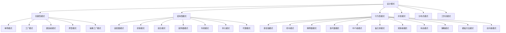

# 设计模式形式化体系

## 概述

设计模式是软件工程中解决常见设计问题的标准化解决方案。本体系采用严格的形式化方法，结合Python技术栈，对设计模式进行系统性重构和规范化。

## 形式化定义

### 设计模式的基本结构

设 $P = (C, R, O)$ 为一个设计模式，其中：

- $C = \{c_1, c_2, ..., c_n\}$ 是组件集合
- $R = \{r_1, r_2, ..., r_m\}$ 是关系集合
- $O = \{o_1, o_2, ..., o_k\}$ 是操作集合

### 模式分类



## 目录结构

### 1. [创建型模式](./01-创建型模式/)

- [单例模式](./01-创建型模式/01-单例模式.md)
- [工厂方法模式](./01-创建型模式/02-工厂方法模式.md)
- [抽象工厂模式](./01-创建型模式/03-抽象工厂模式.md)
- [建造者模式](./01-创建型模式/04-建造者模式.md)
- [原型模式](./01-创建型模式/05-原型模式.md)

### 2. [结构型模式](./02-结构型模式/)

- [适配器模式](./02-结构型模式/01-适配器模式.md)
- [桥接模式](./02-结构型模式/02-桥接模式.md)
- [组合模式](./02-结构型模式/03-组合模式.md)
- [装饰器模式](./02-结构型模式/04-装饰器模式.md)
- [外观模式](./02-结构型模式/05-外观模式.md)
- [享元模式](./02-结构型模式/06-享元模式.md)
- [代理模式](./02-结构型模式/07-代理模式.md)

### 3. [行为型模式](./03-行为型模式/)

- [责任链模式](./03-行为型模式/01-责任链模式.md)
- [命令模式](./03-行为型模式/02-命令模式.md)
- [解释器模式](./03-行为型模式/03-解释器模式.md)
- [迭代器模式](./03-行为型模式/04-迭代器模式.md)
- [中介者模式](./03-行为型模式/05-中介者模式.md)
- [备忘录模式](./03-行为型模式/06-备忘录模式.md)
- [观察者模式](./03-行为型模式/07-观察者模式.md)
- [状态模式](./03-行为型模式/08-状态模式.md)
- [策略模式](./03-行为型模式/09-策略模式.md)
- [模板方法模式](./03-行为型模式/10-模板方法模式.md)
- [访问者模式](./03-行为型模式/11-访问者模式.md)

### 4. [并发模式](./04-并发模式/)

- [活动对象模式](./04-并发模式/01-活动对象模式.md)
- [管程模式](./04-并发模式/02-管程模式.md)
- [线程池模式](./04-并发模式/03-线程池模式.md)
- [生产者-消费者模式](./04-并发模式/04-生产者-消费者模式.md)
- [读写锁模式](./04-并发模式/05-读写锁模式.md)
- [Future/Promise模式](./04-并发模式/06-Future-Promise模式.md)
- [Actor模型](./04-并发模式/07-Actor模型.md)

### 5. [分布式模式](./05-分布式模式/)

- [服务发现模式](./05-分布式模式/01-服务发现模式.md)
- [熔断器模式](./05-分布式模式/02-熔断器模式.md)
- [API网关模式](./05-分布式模式/03-API网关模式.md)
- [Saga模式](./05-分布式模式/04-Saga模式.md)
- [领导者选举模式](./05-分布式模式/05-领导者选举模式.md)
- [分片/分区模式](./05-分布式模式/06-分片-分区模式.md)
- [复制模式](./05-分布式模式/07-复制模式.md)
- [消息队列模式](./05-分布式模式/08-消息队列模式.md)

### 6. [工作流模式](./06-工作流模式/)

- [状态机模式](./06-工作流模式/01-状态机模式.md)
- [工作流引擎模式](./06-工作流模式/02-工作流引擎模式.md)
- [任务队列模式](./06-工作流模式/03-任务队列模式.md)
- [编排vs协同模式](./06-工作流模式/04-编排vs协同模式.md)

## 形式化验证

### 类型系统

使用Python的类型系统进行形式化验证：

```python
from typing import TypeVar, Generic, Protocol, runtime_checkable
from abc import ABC, abstractmethod

T = TypeVar('T')

@runtime_checkable
class Pattern(Protocol):
    """设计模式的基础协议"""
    
    @abstractmethod
    def apply(self, context: dict) -> dict:
        """应用模式到上下文"""
        pass
    
    @abstractmethod
    def validate(self, context: dict) -> bool:
        """验证模式是否适用于给定上下文"""
        pass
```

### 模式验证框架

```python
class PatternValidator:
    """模式验证器"""
    
    def __init__(self):
        self.patterns: dict[str, Pattern] = {}
    
    def register_pattern(self, name: str, pattern: Pattern):
        """注册模式"""
        self.patterns[name] = pattern
    
    def validate_application(self, pattern_name: str, context: dict) -> bool:
        """验证模式应用"""
        if pattern_name not in self.patterns:
            return False
        return self.patterns[pattern_name].validate(context)
```

## 性能分析

### 复杂度分析

每个模式都包含：

- **时间复杂度**: $O(f(n))$ 分析
- **空间复杂度**: $O(g(n))$ 分析
- **并发复杂度**: 线程安全性和性能影响

### 基准测试

```python
import time
import asyncio
from typing import Callable, Any

class PatternBenchmark:
    """模式性能基准测试"""
    
    @staticmethod
    def measure_time(func: Callable[[], Any], iterations: int = 1000) -> float:
        """测量函数执行时间"""
        start_time = time.time()
        for _ in range(iterations):
            func()
        end_time = time.time()
        return (end_time - start_time) / iterations
    
    @staticmethod
    async def measure_async_time(func: Callable[[], Any], iterations: int = 1000) -> float:
        """测量异步函数执行时间"""
        start_time = time.time()
        tasks = [func() for _ in range(iterations)]
        await asyncio.gather(*tasks)
        end_time = time.time()
        return (end_time - start_time) / iterations
```

## 应用场景

### 1. 系统架构设计

- 微服务架构模式
- 分层架构模式
- 事件驱动架构

### 2. 并发编程

- 异步编程模式
- 并发控制模式
- 资源管理模式

### 3. 分布式系统

- 服务治理模式
- 数据一致性模式
- 容错模式

### 4. 业务建模

- 领域驱动设计
- 事件溯源模式
- CQRS模式

## 最佳实践

### 1. 模式选择原则

- **单一职责**: 每个模式只解决一个特定问题
- **开闭原则**: 对扩展开放，对修改封闭
- **依赖倒置**: 依赖抽象而非具体实现

### 2. 实现指导

- **类型安全**: 充分利用Python类型系统
- **错误处理**: 完善的异常处理机制
- **文档化**: 详细的文档和示例

### 3. 测试策略

- **单元测试**: 每个模式组件都有测试
- **集成测试**: 模式组合的测试
- **性能测试**: 基准测试和压力测试

---

*本体系持续更新，确保与最新Python技术栈同步*
