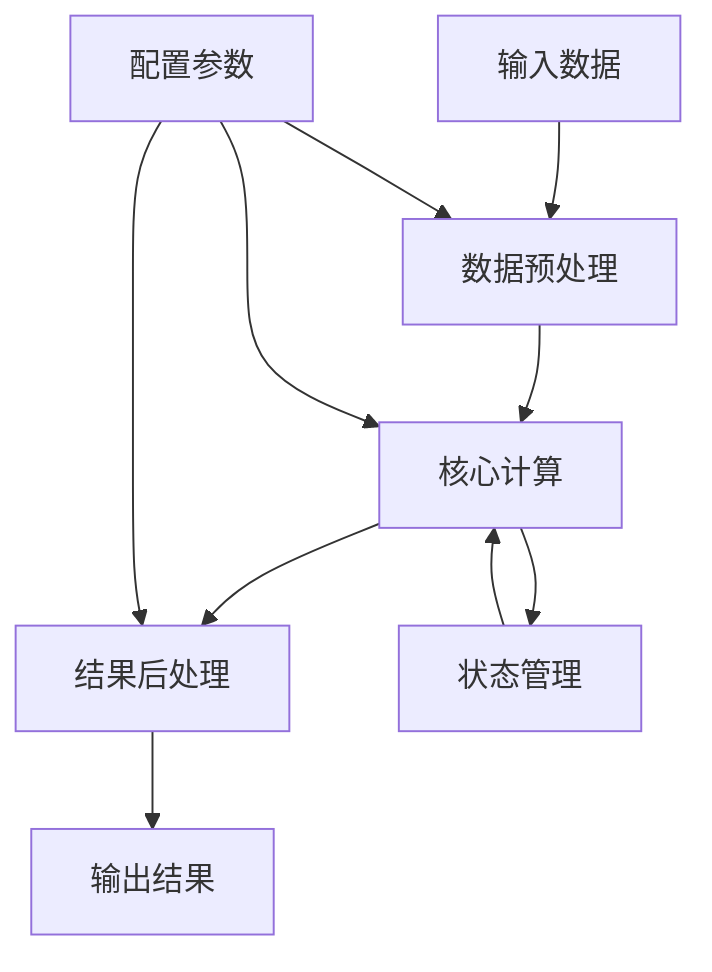

# 02-计算组件 (Computing Components)

## 概述

计算组件是软件系统中的核心处理单元，负责执行各种计算任务、算法处理和业务逻辑。本文档从理念到实践，全面阐述计算组件的设计原理、实现方法和应用场景。

## 1. 理念基础

### 1.1 计算组件的哲学基础

**定义1.1**: 计算组件是软件系统中具有明确计算职责的独立单元，可形式化为三元组 $(I, P, O)$，其中：

- $I$ 是输入集合 $I = \{i_1, i_2, ..., i_n\}$
- $P$ 是处理函数 $P: I \rightarrow S$，$S$ 是状态空间
- $O$ 是输出集合 $O = \{o_1, o_2, ..., o_m\}$

**定理1.1**: 计算组件的完备性定理
对于任意计算组件 $C = (I, P, O)$，如果 $P$ 是确定性的，则对于相同的输入序列，组件将产生相同的输出序列。

**证明**:
设 $x_1, x_2, ..., x_n$ 和 $y_1, y_2, ..., y_n$ 是相同的输入序列，则：
$$P(x_i) = P(y_i) \text{ for all } i \in \{1, 2, ..., n\}$$
因此输出序列也相同。

### 1.2 计算组件的认知模型



## 2. 形式科学基础

### 2.1 计算复杂度理论

**定义2.1**: 计算组件的复杂度函数
设 $f(n)$ 为输入大小为 $n$ 时的计算复杂度，则：

- 时间复杂度：$T(n) = O(f(n))$
- 空间复杂度：$S(n) = O(g(n))$

**定理2.1**: 计算组件的最优性定理
对于给定的计算任务，存在最优的计算组件实现，其复杂度达到理论下界。

### 2.2 并行计算模型

**定义2.2**: 并行计算组件
并行计算组件可表示为 $C_{parallel} = (I, \{P_1, P_2, ..., P_k\}, O)$，其中 $k$ 个处理单元并行工作。

**加速比**: $S = \frac{T_1}{T_k}$，其中 $T_1$ 是串行时间，$T_k$ 是并行时间。

## 3. 理论基础

### 3.1 计算组件分类理论

#### 3.1.1 按计算类型分类

1. **数值计算组件**
   - 数学运算
   - 统计分析
   - 优化算法

2. **逻辑计算组件**
   - 条件判断
   - 规则引擎
   - 决策树

3. **数据处理组件**
   - 数据转换
   - 数据聚合
   - 数据过滤

4. **机器学习组件**
   - 模型训练
   - 模型推理
   - 特征工程

#### 3.1.2 按执行模式分类

1. **同步计算组件**
2. **异步计算组件**
3. **流式计算组件**
4. **批处理计算组件**

### 3.2 计算组件设计模式

#### 3.2.1 策略模式

```python
from abc import ABC, abstractmethod
from typing import Any, Dict, List
import asyncio
from dataclasses import dataclass
from enum import Enum

class ComputationStrategy(ABC):
    """计算策略抽象基类"""
    
    @abstractmethod
    def compute(self, data: Any) -> Any:
        """执行计算"""
        pass
    
    @abstractmethod
    def validate_input(self, data: Any) -> bool:
        """验证输入"""
        pass

class NumericalComputation(ComputationStrategy):
    """数值计算策略"""
    
    def compute(self, data: List[float]) -> float:
        """执行数值计算"""
        if not self.validate_input(data):
            raise ValueError("Invalid input data")
        return sum(data) / len(data)
    
    def validate_input(self, data: Any) -> bool:
        """验证输入是否为数值列表"""
        return isinstance(data, list) and all(isinstance(x, (int, float)) for x in data)

class LogicalComputation(ComputationStrategy):
    """逻辑计算策略"""
    
    def compute(self, data: Dict[str, bool]) -> bool:
        """执行逻辑计算"""
        if not self.validate_input(data):
            raise ValueError("Invalid input data")
        return all(data.values())
    
    def validate_input(self, data: Any) -> bool:
        """验证输入是否为布尔字典"""
        return isinstance(data, dict) and all(isinstance(v, bool) for v in data.values())

class ComputingComponent:
    """计算组件"""
    
    def __init__(self, strategy: ComputationStrategy):
        self.strategy = strategy
    
    def execute(self, data: Any) -> Any:
        """执行计算"""
        return self.strategy.compute(data)
    
    def change_strategy(self, strategy: ComputationStrategy):
        """切换计算策略"""
        self.strategy = strategy
```

#### 3.2.2 模板方法模式

```python
class AbstractComputingComponent(ABC):
    """抽象计算组件"""
    
    def process(self, data: Any) -> Any:
        """模板方法：定义计算流程"""
        self.preprocess(data)
        result = self.compute(data)
        return self.postprocess(result)
    
    @abstractmethod
    def preprocess(self, data: Any) -> None:
        """预处理"""
        pass
    
    @abstractmethod
    def compute(self, data: Any) -> Any:
        """核心计算"""
        pass
    
    @abstractmethod
    def postprocess(self, result: Any) -> Any:
        """后处理"""
        pass

class DataAnalysisComponent(AbstractComputingComponent):
    """数据分析组件"""
    
    def preprocess(self, data: List[float]) -> None:
        """数据预处理：去除异常值"""
        self.clean_data = [x for x in data if x is not None and not math.isnan(x)]
    
    def compute(self, data: List[float]) -> Dict[str, float]:
        """核心计算：统计分析"""
        if not data:
            return {}
        
        return {
            'mean': statistics.mean(data),
            'median': statistics.median(data),
            'std': statistics.stdev(data) if len(data) > 1 else 0,
            'min': min(data),
            'max': max(data)
        }
    
    def postprocess(self, result: Dict[str, float]) -> Dict[str, float]:
        """后处理：格式化结果"""
        return {k: round(v, 4) for k, v in result.items()}
```

## 4. 具体科学实现

### 4.1 异步计算组件

```python
import asyncio
from typing import Any, Callable, List, Optional
from concurrent.futures import ThreadPoolExecutor
import time

class AsyncComputingComponent:
    """异步计算组件"""
    
    def __init__(self, max_workers: int = 4):
        self.executor = ThreadPoolExecutor(max_workers=max_workers)
        self.running_tasks: List[asyncio.Task] = []
    
    async def compute_async(self, func: Callable, *args, **kwargs) -> Any:
        """异步执行计算任务"""
        loop = asyncio.get_event_loop()
        return await loop.run_in_executor(self.executor, func, *args, **kwargs)
    
    async def batch_compute(self, tasks: List[Callable], *args, **kwargs) -> List[Any]:
        """批量异步计算"""
        async def execute_task(task):
            return await self.compute_async(task, *args, **kwargs)
        
        return await asyncio.gather(*[execute_task(task) for task in tasks])
    
    async def stream_compute(self, data_stream: List[Any], 
                           processor: Callable) -> List[Any]:
        """流式计算"""
        results = []
        for chunk in self._chunk_data(data_stream, chunk_size=100):
            result = await self.compute_async(processor, chunk)
            results.append(result)
        return results
    
    def _chunk_data(self, data: List[Any], chunk_size: int) -> List[List[Any]]:
        """数据分块"""
        return [data[i:i + chunk_size] for i in range(0, len(data), chunk_size)]
    
    async def close(self):
        """关闭组件"""
        self.executor.shutdown(wait=True)
        for task in self.running_tasks:
            if not task.done():
                task.cancel()

# 使用示例
async def example_usage():
    component = AsyncComputingComponent()
    
    # 异步计算示例
    def heavy_computation(n: int) -> int:
        time.sleep(1)  # 模拟耗时计算
        return n * n
    
    # 单个异步计算
    result = await component.compute_async(heavy_computation, 10)
    print(f"计算结果: {result}")
    
    # 批量异步计算
    tasks = [lambda: heavy_computation(i) for i in range(5)]
    results = await component.batch_compute(tasks)
    print(f"批量计算结果: {results}")
    
    await component.close()
```

### 4.2 流式计算组件

```python
from typing import Iterator, Any, Callable
import asyncio
from dataclasses import dataclass
from enum import Enum

class StreamType(Enum):
    """流类型"""
    BATCH = "batch"
    REAL_TIME = "real_time"
    WINDOW = "window"

@dataclass
class StreamConfig:
    """流配置"""
    stream_type: StreamType
    batch_size: int = 100
    window_size: int = 1000
    window_slide: int = 100

class StreamComputingComponent:
    """流式计算组件"""
    
    def __init__(self, config: StreamConfig):
        self.config = config
        self.buffer: List[Any] = []
        self.window_buffer: List[Any] = []
    
    def process_stream(self, data_stream: Iterator[Any], 
                      processor: Callable) -> Iterator[Any]:
        """处理数据流"""
        if self.config.stream_type == StreamType.BATCH:
            return self._batch_process(data_stream, processor)
        elif self.config.stream_type == StreamType.REAL_TIME:
            return self._real_time_process(data_stream, processor)
        elif self.config.stream_type == StreamType.WINDOW:
            return self._window_process(data_stream, processor)
        else:
            raise ValueError(f"Unsupported stream type: {self.config.stream_type}")
    
    def _batch_process(self, data_stream: Iterator[Any], 
                      processor: Callable) -> Iterator[Any]:
        """批处理"""
        batch = []
        for item in data_stream:
            batch.append(item)
            if len(batch) >= self.config.batch_size:
                yield processor(batch)
                batch = []
        
        if batch:  # 处理剩余数据
            yield processor(batch)
    
    def _real_time_process(self, data_stream: Iterator[Any], 
                          processor: Callable) -> Iterator[Any]:
        """实时处理"""
        for item in data_stream:
            yield processor([item])
    
    def _window_process(self, data_stream: Iterator[Any], 
                       processor: Callable) -> Iterator[Any]:
        """窗口处理"""
        for item in data_stream:
            self.window_buffer.append(item)
            
            # 滑动窗口
            if len(self.window_buffer) > self.config.window_size:
                self.window_buffer = self.window_buffer[self.config.window_slide:]
            
            if len(self.window_buffer) >= self.config.window_size:
                yield processor(self.window_buffer.copy())

# 使用示例
def example_stream_processing():
    # 创建流配置
    config = StreamConfig(
        stream_type=StreamType.WINDOW,
        window_size=5,
        window_slide=1
    )
    
    component = StreamComputingComponent(config)
    
    # 模拟数据流
    def data_generator():
        for i in range(10):
            yield i
    
    # 定义处理器
    def window_processor(window_data):
        return {
            'window': window_data,
            'sum': sum(window_data),
            'avg': sum(window_data) / len(window_data)
        }
    
    # 处理流
    for result in component.process_stream(data_generator(), window_processor):
        print(f"窗口处理结果: {result}")
```

### 4.3 机器学习计算组件

```python
import numpy as np
from sklearn.base import BaseEstimator, TransformerMixin
from sklearn.pipeline import Pipeline
from typing import Any, Dict, List, Optional, Tuple
import joblib

class MLComputingComponent:
    """机器学习计算组件"""
    
    def __init__(self):
        self.models: Dict[str, BaseEstimator] = {}
        self.pipelines: Dict[str, Pipeline] = {}
        self.feature_processors: Dict[str, TransformerMixin] = {}
    
    def train_model(self, model_name: str, model: BaseEstimator, 
                   X: np.ndarray, y: np.ndarray) -> BaseEstimator:
        """训练模型"""
        trained_model = model.fit(X, y)
        self.models[model_name] = trained_model
        return trained_model
    
    def predict(self, model_name: str, X: np.ndarray) -> np.ndarray:
        """模型预测"""
        if model_name not in self.models:
            raise ValueError(f"Model {model_name} not found")
        return self.models[model_name].predict(X)
    
    def predict_proba(self, model_name: str, X: np.ndarray) -> np.ndarray:
        """概率预测"""
        if model_name not in self.models:
            raise ValueError(f"Model {model_name} not found")
        if hasattr(self.models[model_name], 'predict_proba'):
            return self.models[model_name].predict_proba(X)
        else:
            raise ValueError(f"Model {model_name} does not support probability prediction")
    
    def create_pipeline(self, pipeline_name: str, 
                       steps: List[Tuple[str, Any]]) -> Pipeline:
        """创建处理管道"""
        pipeline = Pipeline(steps)
        self.pipelines[pipeline_name] = pipeline
        return pipeline
    
    def save_model(self, model_name: str, filepath: str):
        """保存模型"""
        if model_name not in self.models:
            raise ValueError(f"Model {model_name} not found")
        joblib.dump(self.models[model_name], filepath)
    
    def load_model(self, model_name: str, filepath: str):
        """加载模型"""
        self.models[model_name] = joblib.load(filepath)
    
    def get_model_info(self, model_name: str) -> Dict[str, Any]:
        """获取模型信息"""
        if model_name not in self.models:
            raise ValueError(f"Model {model_name} not found")
        
        model = self.models[model_name]
        return {
            'type': type(model).__name__,
            'parameters': model.get_params(),
            'features': getattr(model, 'n_features_in_', None),
            'classes': getattr(model, 'classes_', None)
        }

# 使用示例
def example_ml_component():
    from sklearn.ensemble import RandomForestClassifier
    from sklearn.preprocessing import StandardScaler
    from sklearn.model_selection import train_test_split
    
    # 创建组件
    ml_component = MLComputingComponent()
    
    # 生成示例数据
    np.random.seed(42)
    X = np.random.randn(100, 5)
    y = np.random.randint(0, 2, 100)
    
    # 创建管道
    pipeline = ml_component.create_pipeline(
        'classification_pipeline',
        [
            ('scaler', StandardScaler()),
            ('classifier', RandomForestClassifier(n_estimators=10))
        ]
    )
    
    # 训练管道
    X_train, X_test, y_train, y_test = train_test_split(X, y, test_size=0.2)
    pipeline.fit(X_train, y_train)
    
    # 预测
    predictions = pipeline.predict(X_test)
    probabilities = pipeline.predict_proba(X_test)
    
    print(f"预测结果: {predictions[:5]}")
    print(f"预测概率: {probabilities[:5]}")
```

## 5. 行业应用

### 5.1 金融科技应用

```python
class FinancialComputingComponent:
    """金融计算组件"""
    
    def __init__(self):
        self.risk_models = {}
        self.pricing_models = {}
    
    def calculate_risk_metrics(self, portfolio_data: Dict[str, float]) -> Dict[str, float]:
        """计算风险指标"""
        returns = list(portfolio_data.values())
        
        return {
            'volatility': np.std(returns),
            'var_95': np.percentile(returns, 5),
            'sharpe_ratio': np.mean(returns) / np.std(returns) if np.std(returns) > 0 else 0,
            'max_drawdown': self._calculate_max_drawdown(returns)
        }
    
    def _calculate_max_drawdown(self, returns: List[float]) -> float:
        """计算最大回撤"""
        cumulative = np.cumprod(1 + np.array(returns))
        running_max = np.maximum.accumulate(cumulative)
        drawdown = (cumulative - running_max) / running_max
        return np.min(drawdown)
    
    def price_option(self, option_type: str, S: float, K: float, 
                    T: float, r: float, sigma: float) -> float:
        """期权定价"""
        if option_type.lower() == 'call':
            return self._black_scholes_call(S, K, T, r, sigma)
        elif option_type.lower() == 'put':
            return self._black_scholes_put(S, K, T, r, sigma)
        else:
            raise ValueError(f"Unsupported option type: {option_type}")
    
    def _black_scholes_call(self, S: float, K: float, T: float, 
                           r: float, sigma: float) -> float:
        """Black-Scholes看涨期权定价"""
        d1 = (np.log(S/K) + (r + 0.5*sigma**2)*T) / (sigma*np.sqrt(T))
        d2 = d1 - sigma*np.sqrt(T)
        return S*norm.cdf(d1) - K*np.exp(-r*T)*norm.cdf(d2)
    
    def _black_scholes_put(self, S: float, K: float, T: float, 
                          r: float, sigma: float) -> float:
        """Black-Scholes看跌期权定价"""
        d1 = (np.log(S/K) + (r + 0.5*sigma**2)*T) / (sigma*np.sqrt(T))
        d2 = d1 - sigma*np.sqrt(T)
        return K*np.exp(-r*T)*norm.cdf(-d2) - S*norm.cdf(-d1)
```

### 5.2 人工智能应用

```python
class AIComputingComponent:
    """AI计算组件"""
    
    def __init__(self):
        self.neural_networks = {}
        self.optimizers = {}
    
    def create_neural_network(self, architecture: List[int], 
                            activation: str = 'relu') -> Dict[str, Any]:
        """创建神经网络"""
        layers = []
        for i in range(len(architecture) - 1):
            layer = {
                'weights': np.random.randn(architecture[i], architecture[i+1]) * 0.01,
                'biases': np.zeros((1, architecture[i+1])),
                'activation': activation
            }
            layers.append(layer)
        
        return {'layers': layers, 'architecture': architecture}
    
    def forward_pass(self, network: Dict[str, Any], X: np.ndarray) -> np.ndarray:
        """前向传播"""
        A = X
        for layer in network['layers']:
            Z = np.dot(A, layer['weights']) + layer['biases']
            A = self._activate(Z, layer['activation'])
        return A
    
    def _activate(self, Z: np.ndarray, activation: str) -> np.ndarray:
        """激活函数"""
        if activation == 'relu':
            return np.maximum(0, Z)
        elif activation == 'sigmoid':
            return 1 / (1 + np.exp(-Z))
        elif activation == 'tanh':
            return np.tanh(Z)
        else:
            raise ValueError(f"Unsupported activation: {activation}")
    
    def train_network(self, network: Dict[str, Any], X: np.ndarray, 
                     y: np.ndarray, learning_rate: float = 0.01, 
                     epochs: int = 1000) -> Dict[str, Any]:
        """训练神经网络"""
        costs = []
        for epoch in range(epochs):
            # 前向传播
            A = self.forward_pass(network, X)
            
            # 计算损失
            cost = self._compute_cost(A, y)
            costs.append(cost)
            
            # 反向传播（简化版）
            # 这里应该实现完整的反向传播算法
            
            if epoch % 100 == 0:
                print(f"Epoch {epoch}, Cost: {cost:.4f}")
        
        return {'network': network, 'costs': costs}
    
    def _compute_cost(self, A: np.ndarray, y: np.ndarray) -> float:
        """计算损失函数"""
        m = y.shape[0]
        cost = -1/m * np.sum(y * np.log(A + 1e-8) + (1-y) * np.log(1-A + 1e-8))
        return cost
```

## 6. 性能优化

### 6.1 计算优化策略

```python
import numba
from numba import jit, prange
import multiprocessing as mp
from functools import lru_cache

class OptimizedComputingComponent:
    """优化计算组件"""
    
    def __init__(self):
        self.cache = {}
        self.parallel_pool = mp.Pool(processes=mp.cpu_count())
    
    @jit(nopython=True)
    def fast_numerical_computation(self, data: np.ndarray) -> np.ndarray:
        """使用Numba加速的数值计算"""
        result = np.zeros_like(data)
        for i in prange(len(data)):
            result[i] = np.sqrt(data[i]) + np.sin(data[i])
        return result
    
    @lru_cache(maxsize=128)
    def cached_computation(self, key: str) -> Any:
        """缓存计算结果"""
        # 模拟复杂计算
        return hash(key) % 1000
    
    def parallel_computation(self, data: List[Any], 
                           processor: Callable) -> List[Any]:
        """并行计算"""
        return self.parallel_pool.map(processor, data)
    
    def vectorized_computation(self, data: np.ndarray) -> np.ndarray:
        """向量化计算"""
        return np.vectorize(lambda x: x**2 + np.sin(x))(data)
    
    def memory_efficient_computation(self, large_data: Iterator[Any], 
                                   processor: Callable) -> Iterator[Any]:
        """内存高效计算"""
        for chunk in self._chunk_data(large_data, chunk_size=1000):
            yield processor(chunk)
    
    def _chunk_data(self, data: Iterator[Any], chunk_size: int) -> Iterator[List[Any]]:
        """数据分块"""
        chunk = []
        for item in data:
            chunk.append(item)
            if len(chunk) >= chunk_size:
                yield chunk
                chunk = []
        if chunk:
            yield chunk
```

### 6.2 性能监控

```python
import time
import psutil
import tracemalloc
from contextlib import contextmanager

class PerformanceMonitor:
    """性能监控器"""
    
    def __init__(self):
        self.metrics = {}
    
    @contextmanager
    def monitor_performance(self, operation_name: str):
        """监控性能上下文管理器"""
        # 开始监控
        start_time = time.time()
        start_memory = psutil.Process().memory_info().rss
        tracemalloc.start()
        
        try:
            yield
        finally:
            # 结束监控
            end_time = time.time()
            end_memory = psutil.Process().memory_info().rss
            current, peak = tracemalloc.get_traced_memory()
            tracemalloc.stop()
            
            # 记录指标
            self.metrics[operation_name] = {
                'execution_time': end_time - start_time,
                'memory_usage': end_memory - start_memory,
                'peak_memory': peak,
                'current_memory': current
            }
    
    def get_performance_report(self) -> Dict[str, Any]:
        """获取性能报告"""
        return self.metrics.copy()
    
    def print_performance_summary(self):
        """打印性能摘要"""
        print("性能监控摘要:")
        print("-" * 50)
        for operation, metrics in self.metrics.items():
            print(f"操作: {operation}")
            print(f"  执行时间: {metrics['execution_time']:.4f} 秒")
            print(f"  内存使用: {metrics['memory_usage'] / 1024 / 1024:.2f} MB")
            print(f"  峰值内存: {metrics['peak_memory'] / 1024 / 1024:.2f} MB")
            print()

# 使用示例
def example_performance_monitoring():
    monitor = PerformanceMonitor()
    component = OptimizedComputingComponent()
    
    # 监控计算性能
    with monitor.monitor_performance("fast_computation"):
        data = np.random.randn(1000000)
        result = component.fast_numerical_computation(data)
    
    with monitor.monitor_performance("vectorized_computation"):
        result = component.vectorized_computation(data)
    
    # 打印性能报告
    monitor.print_performance_summary()
```

## 7. 测试验证

### 7.1 单元测试

```python
import unittest
import numpy as np
from unittest.mock import Mock, patch

class TestComputingComponent(unittest.TestCase):
    """计算组件测试类"""
    
    def setUp(self):
        """测试设置"""
        self.component = ComputingComponent(NumericalComputation())
    
    def test_numerical_computation(self):
        """测试数值计算"""
        data = [1.0, 2.0, 3.0, 4.0, 5.0]
        expected = 3.0  # 平均值
        
        result = self.component.execute(data)
        self.assertAlmostEqual(result, expected, places=5)
    
    def test_invalid_input(self):
        """测试无效输入"""
        invalid_data = "not a list"
        
        with self.assertRaises(ValueError):
            self.component.execute(invalid_data)
    
    def test_empty_input(self):
        """测试空输入"""
        empty_data = []
        
        with self.assertRaises(ValueError):
            self.component.execute(empty_data)
    
    def test_strategy_switching(self):
        """测试策略切换"""
        # 初始数值计算
        data = [1.0, 2.0, 3.0]
        result1 = self.component.execute(data)
        
        # 切换到逻辑计算
        self.component.change_strategy(LogicalComputation())
        logic_data = {'a': True, 'b': True, 'c': False}
        result2 = self.component.execute(logic_data)
        
        self.assertIsInstance(result1, float)
        self.assertIsInstance(result2, bool)
        self.assertFalse(result2)  # 应该为False，因为有False值

class TestAsyncComputingComponent(unittest.IsolatedAsyncioTestCase):
    """异步计算组件测试类"""
    
    async def asyncSetUp(self):
        """异步测试设置"""
        self.component = AsyncComputingComponent()
    
    async def test_async_computation(self):
        """测试异步计算"""
        def simple_computation(n):
            return n * 2
        
        result = await self.component.compute_async(simple_computation, 5)
        self.assertEqual(result, 10)
    
    async def test_batch_computation(self):
        """测试批量计算"""
        def square(n):
            return n * n
        
        tasks = [lambda: square(i) for i in range(5)]
        results = await self.component.batch_compute(tasks)
        
        expected = [0, 1, 4, 9, 16]
        self.assertEqual(results, expected)
    
    async def asyncTearDown(self):
        """异步测试清理"""
        await self.component.close()

if __name__ == '__main__':
    unittest.main()
```

### 7.2 性能测试

```python
import time
import statistics
from typing import List, Callable

class PerformanceTestSuite:
    """性能测试套件"""
    
    def __init__(self):
        self.test_results = {}
    
    def benchmark(self, test_name: str, func: Callable, 
                 args: tuple = (), iterations: int = 100) -> Dict[str, float]:
        """基准测试"""
        times = []
        
        for _ in range(iterations):
            start_time = time.perf_counter()
            func(*args)
            end_time = time.perf_counter()
            times.append(end_time - start_time)
        
        return {
            'mean': statistics.mean(times),
            'median': statistics.median(times),
            'std': statistics.stdev(times),
            'min': min(times),
            'max': max(times),
            'total_time': sum(times)
        }
    
    def compare_implementations(self, implementations: Dict[str, Callable], 
                              test_data: Any, iterations: int = 100) -> Dict[str, Dict[str, float]]:
        """比较不同实现"""
        results = {}
        
        for name, impl in implementations.items():
            results[name] = self.benchmark(name, impl, (test_data,), iterations)
        
        return results
    
    def print_comparison_report(self, results: Dict[str, Dict[str, float]]):
        """打印比较报告"""
        print("性能比较报告")
        print("=" * 60)
        
        # 表头
        print(f"{'实现':<15} {'平均时间(ms)':<15} {'中位数(ms)':<15} {'标准差(ms)':<15}")
        print("-" * 60)
        
        # 数据行
        for name, metrics in results.items():
            print(f"{name:<15} {metrics['mean']*1000:<15.3f} "
                  f"{metrics['median']*1000:<15.3f} {metrics['std']*1000:<15.3f}")
        
        print()

# 使用示例
def example_performance_testing():
    test_suite = PerformanceTestSuite()
    
    # 定义不同的实现
    def naive_computation(data):
        return sum(x**2 for x in data)
    
    def numpy_computation(data):
        return np.sum(np.array(data)**2)
    
    def optimized_computation(data):
        return sum(x*x for x in data)  # 避免**操作
    
    implementations = {
        'Naive': naive_computation,
        'NumPy': numpy_computation,
        'Optimized': optimized_computation
    }
    
    # 生成测试数据
    test_data = list(range(10000))
    
    # 运行性能测试
    results = test_suite.compare_implementations(implementations, test_data)
    
    # 打印报告
    test_suite.print_comparison_report(results)
```

## 8. 总结

计算组件是软件系统的核心处理单元，本文档从理念到实践，全面阐述了计算组件的设计原理、实现方法和应用场景。通过形式化定义、Python实现和实际应用案例，展示了计算组件在不同领域的应用价值。

### 8.1 关键要点

1. **形式化基础**: 计算组件具有严格的数学定义和理论基础
2. **设计模式**: 策略模式、模板方法模式等提供了灵活的设计方案
3. **异步处理**: 支持异步和并行计算，提高系统性能
4. **流式计算**: 支持实时数据处理和批量处理
5. **机器学习**: 集成机器学习算法，支持模型训练和推理
6. **性能优化**: 通过多种技术手段优化计算性能
7. **测试验证**: 提供完整的测试框架和性能基准

### 8.2 应用价值

计算组件在金融科技、人工智能、大数据处理等领域具有重要应用价值，能够提供高效、可靠的计算服务，支持复杂业务场景的需求。

---

**相关文档**:

- [01-数据组件](./01-数据组件.md)
- [03-通信组件](./03-通信组件.md)
- [04-存储组件](./04-存储组件.md)
- [05-安全组件](./05-安全组件.md)
- [02-算法实现](../02-算法实现/README.md)
- [03-性能优化](../03-性能优化/README.md)
