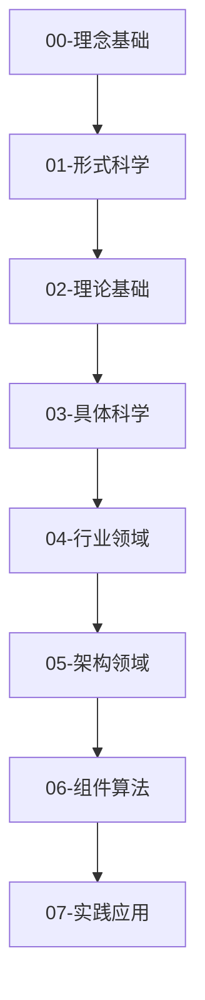

# 软件工程与计算科学知识体系重构

## 概述

本知识体系基于形式科学理论，采用多层次的抽象方法，从理念基础到具体实践，构建了一个完整的软件工程与计算科学知识框架。

## 知识体系架构

### 层次化结构

### 核心原则

1. **形式化规范**: 所有概念都有严格的形式化定义
2. **多表征方式**: 结合数学符号、图表、代码示例等多种表达方式
3. **层次化分类**: 从抽象到具体，从理论到实践
4. **一致性保证**: 概念、定义、证明的一致性
5. **可追溯性**: 各层次间的映射关系和依赖关系

## 目录结构

### 00-理念基础
- 哲学基础
- 认知模型
- 抽象思维
- 系统思维

### 01-形式科学
- 数学基础
- 逻辑学
- 集合论
- 范畴论
- 类型论

### 02-理论基础
- 计算理论
- 算法理论
- 复杂性理论
- 信息论
- 控制论

### 03-具体科学
- 计算机科学
- 软件工程
- 人工智能
- 数据科学
- 网络科学

### 04-行业领域
- 金融科技
- 人工智能/机器学习
- 物联网
- 区块链/Web3
- 云计算
- 游戏开发
- 网络安全

### 05-架构领域
- 系统架构
- 软件架构
- 分布式系统
- 微服务架构
- 事件驱动架构

### 06-组件算法
- 设计模式
- 数据结构
- 算法设计
- 并发模型
- 内存模型

### 07-实践应用
- 开发实践
- 测试策略
- 部署运维
- 性能优化
- 安全实践

## 使用指南

### 阅读路径
1. **初学者**: 从理念基础开始，按层次顺序学习
2. **实践者**: 可直接从相关行业领域或实践应用开始
3. **研究者**: 重点关注形式科学和理论基础部分

### 交叉引用
- 每个文档都包含相关概念的交叉引用
- 使用统一的编号系统便于查找
- 提供本地跳转链接

### 贡献指南
- 保持形式化规范
- 确保内容一致性
- 添加必要的证明和示例
- 更新相关交叉引用

## 技术栈

本知识体系主要基于以下技术栈：
- **编程语言**: Python (主要), Rust, TypeScript
- **形式化工具**: Coq, Agda, Isabelle
- **建模语言**: UML, SysML, Alloy
- **数学工具**: LaTeX, MathJax
- **图表工具**: Mermaid, PlantUML

## 更新日志

- **v1.0.0**: 初始版本，完成基础框架搭建
- **v1.1.0**: 添加形式科学和理论基础
- **v1.2.0**: 完善具体科学和行业领域
- **v1.3.0**: 重构架构领域和组件算法
- **v1.4.0**: 优化实践应用和交叉引用

## 许可证

本知识体系采用 MIT 许可证，详见 [LICENSE](../LICENSE) 文件。
