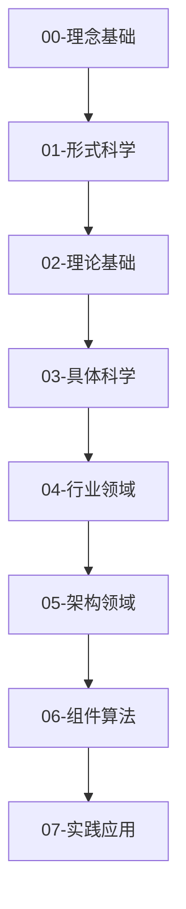

# 软件工程与计算科学知识体系

## 概述

本知识体系基于形式科学理论，采用多层次的抽象方法，从理念基础到具体实践，构建了一个完整的软件工程与计算科学知识框架。

## 知识体系架构

### 层次化结构

### 核心原则

1. **形式化规范**: 所有概念都有严格的形式化定义
2. **多表征方式**: 结合数学符号、图表、代码示例等多种表达方式
3. **层次化分类**: 从抽象到具体，从理论到实践
4. **一致性保证**: 概念、定义、证明的一致性
5. **可追溯性**: 各层次间的映射关系和依赖关系

## 目录结构

### 00-理念基础

- [README](./00-理念基础/README.md)
- 哲学基础
- 认知模型
- 抽象思维
- 系统思维

### 01-形式科学

- [README](./01-形式科学/README.md)
- [01-数学基础](./01-形式科学/01-数学基础/)
  - [01-集合论](./01-形式科学/01-数学基础/01-集合论.md)
  - 02-关系与函数
  - 03-代数结构
  - 04-拓扑学基础
- [02-逻辑学](./01-形式科学/02-逻辑学/)
  - 01-命题逻辑
  - 02-谓词逻辑
  - 03-模态逻辑
  - 04-直觉逻辑
- [03-范畴论](./01-形式科学/03-范畴论/)
  - 01-范畴基础
  - 02-函子与自然变换
  - 03-极限与余极限
  - 04-伴随函子
- [04-类型论](./01-形式科学/04-类型论/)
  - 01-简单类型论
  - 02-依赖类型论
  - 03-同伦类型论
  - 04-线性类型论
- [05-计算理论](./01-形式科学/05-计算理论/)
  - 01-可计算性理论
  - 02-计算复杂度
  - 03-形式语言理论
  - 04-自动机理论

### 02-理论基础

- [README](./02-理论基础/README.md)
- [01-计算理论](./02-理论基础/01-计算理论/)
  - 01-可计算性理论
  - 02-计算模型
  - 03-递归函数理论
  - 04-λ演算
- [02-算法理论](./02-理论基础/02-算法理论/)
  - 01-算法设计
  - 02-算法分析
  - 03-分治算法
  - 04-动态规划
  - 05-贪心算法
  - 06-随机算法
- [03-复杂性理论](./02-理论基础/03-复杂性理论/)
  - 01-时间复杂度
  - 02-空间复杂度
  - 03-复杂度类
  - 04-NP完全性
  - 05-近似算法
- [04-信息论](./02-理论基础/04-信息论/)
  - 01-信息度量
  - 02-熵与编码
  - 03-信道容量
  - 04-数据压缩
- [05-控制论](./02-理论基础/05-控制论/)
  - 01-系统控制
  - 02-反馈控制
  - 03-自适应控制
  - 04-最优控制

### 03-具体科学

- [README](./03-具体科学/README.md)
- [01-编程语言](./03-具体科学/01-编程语言/)
  - 01-语言设计原理
  - 02-类型系统
  - 03-内存管理
  - 04-并发模型
  - 05-语言实现
- [02-软件架构](./03-具体科学/02-软件架构/)
  - 01-架构模式
  - 02-设计原则
  - 03-质量属性
  - 04-架构评估
  - 05-架构演化
- [03-设计模式](./03-具体科学/03-设计模式/)
  - 01-创建型模式
  - 02-结构型模式
  - 03-行为型模式
  - 04-并发模式
  - 05-架构模式
- [04-并发编程](./03-具体科学/04-并发编程/)
  - 01-并发基础
  - 02-同步机制
  - 03-内存模型
  - 04-并发模式
  - 05-并发安全
- [05-分布式系统](./03-具体科学/05-分布式系统/)
  - 01-分布式基础
  - 02-一致性协议
  - 03-容错机制
  - 04-分布式算法
  - 05-系统设计

### 04-行业领域

- [README](./04-行业领域/README.md)
- [01-金融科技](./04-行业领域/01-金融科技/)
  - 支付系统架构
  - 银行核心系统
  - 保险系统
  - 投资交易系统
  - 风控系统
  - 合规和审计
- [02-人工智能/机器学习](./04-行业领域/02-人工智能机器学习/)
  - 模型训练平台
  - 推理服务
  - 数据处理管道
  - 特征工程
  - 模型部署
  - MLOps架构
- [03-物联网](./04-行业领域/03-物联网/)
  - 设备管理平台
  - 数据采集系统
  - 边缘计算
  - 传感器网络
  - 智能家居
  - 安全机制
- [04-区块链/Web3](./04-行业领域/04-区块链Web3/)
  - 智能合约平台
  - 去中心化应用
  - 加密货币系统
  - NFT平台
  - DeFi应用
  - 共识机制
- [05-云计算/基础设施](./04-行业领域/05-云计算基础设施/)
  - 云原生应用
  - 容器编排
  - 服务网格
  - 分布式存储
  - 网络服务
  - 微服务架构
- [06-游戏开发](./04-行业领域/06-游戏开发/)
  - 游戏引擎架构
  - 网络游戏服务器
  - 实时渲染系统
  - 物理引擎
  - 音频系统
  - 性能优化
- [07-网络安全](./04-行业领域/07-网络安全/)
  - 安全扫描工具
  - 入侵检测系统
  - 加密系统
  - 身份认证
  - 安全监控
  - 威胁情报

### 05-架构领域

- [README](./05-架构领域/README.md)
- [01-微服务架构](./05-架构领域/01-微服务架构/)
  - 服务拆分策略
  - 服务通信
  - 服务发现
  - 负载均衡
  - 熔断降级
  - 分布式事务
- [02-事件驱动架构](./05-架构领域/02-事件驱动架构/)
  - 事件建模
  - 事件流处理
  - 事件存储
  - 事件溯源
  - CQRS模式
  - 事件编排
- [03-领域驱动设计](./05-架构领域/03-领域驱动设计/)
  - 战略设计
  - 战术设计
  - 聚合设计
  - 领域服务
  - 领域事件
  - 限界上下文
- [04-响应式架构](./05-架构领域/04-响应式架构/)
  - 响应式编程
  - 背压处理
  - 流处理
  - 异步编程
  - 非阻塞I/O
  - 弹性设计
- [05-云原生架构](./05-架构领域/05-云原生架构/)
  - 容器化
  - 编排管理
  - 服务网格
  - 可观测性
  - 混沌工程
  - GitOps

### 06-组件算法

- [README](./06-组件算法/README.md)
- [01-核心算法](./06-组件算法/01-核心算法/)
  - 排序算法
  - 搜索算法
  - 图算法
  - 字符串算法
  - 数值算法
  - 机器学习算法
- [02-数据结构实现](./06-组件算法/02-数据结构实现/)
  - 线性数据结构
  - 树形数据结构
  - 图数据结构
  - 散列数据结构
  - 高级数据结构
  - 并发数据结构
- [03-并发原语](./06-组件算法/03-并发原语/)
  - 锁机制
  - 信号量
  - 条件变量
  - 原子操作
  - 内存屏障
  - 无锁数据结构
- [04-网络协议](./06-组件算法/04-网络协议/)
  - 传输层协议
  - 应用层协议
  - 路由协议
  - 安全协议
  - 实时协议
  - 自定义协议
- [05-存储引擎](./06-组件算法/05-存储引擎/)
  - 关系型存储
  - 键值存储
  - 文档存储
  - 图数据库
  - 时序数据库
  - 分布式存储

### 07-实践应用

- [README](./07-实践应用/README.md)
- [01-项目案例](./07-实践应用/01-项目案例/)
  - 微服务项目
  - 大数据项目
  - AI/ML项目
  - 区块链项目
  - 游戏项目
  - 安全项目
- [02-最佳实践](./07-实践应用/02-最佳实践/)
  - 代码规范
  - 架构设计
  - 性能优化
  - 安全实践
  - 测试策略
  - 部署运维
- [03-性能优化](./07-实践应用/03-性能优化/)
  - 算法优化
  - 数据结构优化
  - 并发优化
  - 内存优化
  - 网络优化
  - 系统优化
- [04-测试策略](./07-实践应用/04-测试策略/)
  - 单元测试
  - 集成测试
  - 系统测试
  - 性能测试
  - 安全测试
  - 自动化测试
- [05-部署运维](./07-实践应用/05-部署运维/)
  - 持续集成
  - 持续部署
  - 容器化部署
  - 云原生部署
  - 监控告警
  - 故障处理

### 08-项目进度

- [01-任务清单](./08-项目进度/01-任务清单.md)
- [02-进度报告](./08-项目进度/02-进度报告.md)
- [03-上下文管理](./08-项目进度/03-上下文管理.md)

## 使用指南

### 阅读路径

#### 初学者路径

1. **理念基础** → **形式科学** → **理论基础** → **具体科学** → **实践应用**
2. 适合没有计算机科学背景的学习者
3. 重点理解基础概念和原理

#### 实践者路径

1. **具体科学** → **行业领域** → **架构领域** → **组件算法** → **实践应用**
2. 适合有编程经验但缺乏理论基础的开发者
3. 重点学习实际应用和最佳实践

#### 研究者路径

1. **形式科学** → **理论基础** → **具体科学** → **架构领域**
2. 适合深入理解理论基础的学者
3. 重点研究形式化方法和理论证明

#### 领域专家路径

1. **行业领域** → **架构领域** → **组件算法** → **实践应用**
2. 适合特定领域的专家
3. 重点学习领域特定的技术和架构

### 交叉引用

每个文档都包含相关概念的交叉引用，使用统一的编号系统便于查找：

- **同层引用**: 同一层次内的相关概念
- **上下层引用**: 抽象层与具体层之间的映射
- **跨层引用**: 不同层次间的关联关系

### 贡献指南

#### 内容贡献

1. 保持形式化规范
2. 确保内容一致性
3. 添加必要的证明和示例
4. 更新相关交叉引用

#### 代码贡献

1. 遵循Python PEP8规范
2. 包含完整文档
3. 提供测试用例
4. 确保可运行性

## 技术栈

本知识体系主要基于以下技术栈：

### 编程语言

- **Python**: 主要编程语言，用于算法实现和示例代码
- **Rust**: 系统级编程，用于性能关键组件
- **TypeScript**: 前端开发，用于Web应用示例

### 形式化工具

- **Coq**: 定理证明系统
- **Agda**: 依赖类型编程语言
- **Isabelle**: 形式化证明工具

### 建模语言

- **UML**: 统一建模语言
- **SysML**: 系统建模语言
- **Alloy**: 形式化建模语言

### 数学工具

- **LaTeX**: 数学公式排版
- **MathJax**: 网页数学公式渲染
- **SymPy**: Python符号计算库

### 图表工具

- **Mermaid**: 流程图和时序图
- **PlantUML**: UML图表生成
- **Matplotlib**: Python绘图库

## 质量保证

### 内容质量

- **概念定义**: 清晰准确的概念定义
- **形式化表达**: 规范的数学符号和公式
- **代码示例**: 可运行的代码示例
- **证明过程**: 完整的理论证明
- **应用场景**: 明确的实际应用

### 结构质量

- **层次分类**: 合理的层次化分类
- **交叉引用**: 完整的引用关系
- **导航结构**: 清晰的导航路径
- **文件组织**: 规范的文件组织

### 一致性质量

- **概念使用**: 一致的概念使用
- **符号表示**: 统一的符号表示
- **引用关系**: 正确的引用关系
- **格式风格**: 统一的格式风格

## 更新日志

### v1.0.0 (2024-12-19)

- 初始版本发布
- 完成基础框架搭建
- 建立8层知识体系架构
- 创建形式科学层基础内容
- 创建理论基础层框架
- 创建具体科学层框架
- 建立项目进度跟踪机制

### 下一步计划

- 完成形式科学层所有内容
- 完成理论基础层核心内容
- 开始行业领域层重构
- 完善交叉引用关系
- 建立自动化质量检查

## 许可证

本知识体系采用 MIT 许可证，详见 [LICENSE](../LICENSE) 文件。

## 联系方式

如有问题或建议，请通过以下方式联系：

- 项目仓库: [GitHub Repository]
- 问题反馈: [Issues]
- 讨论交流: [Discussions]

---

*最后更新时间: 2024-12-19*
*版本: 1.0.0*
