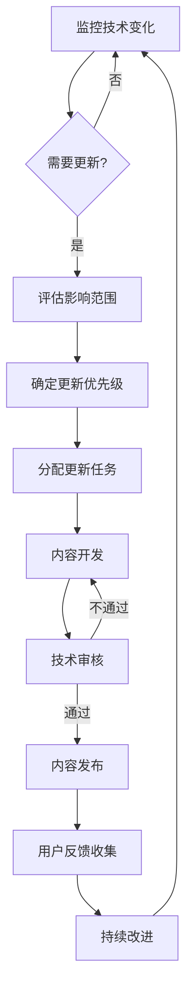

# 技术栈更新团队组织与职责

## 👥 团队组织结构

### 核心团队

| 角色 | 职责 | 人员配置 |
|------|------|----------|
| **技术总监** | 统筹规划、决策制定、资源协调 | 1人 |
| **内容架构师** | 知识体系设计、内容标准制定 | 1人 |
| **技术专家** | 技术评估、难点攻关、质量把控 | 3-5人 |
| **内容编辑** | 内容撰写、格式规范、一致性检查 | 2-3人 |
| **技术作者** | 专题内容开发、代码示例编写 | 5-8人 |

### 专家顾问团

| 领域 | 职责 | 人员配置 |
|------|------|----------|
| **Python核心开发** | 语言特性咨询、标准库更新指导 | 1-2人 |
| **Web开发专家** | Web框架评估、最佳实践指导 | 1-2人 |
| **数据科学专家** | 数据分析工具评估、算法更新 | 1-2人 |
| **AI/ML专家** | AI框架评估、模型应用指导 | 1-2人 |
| **DevOps专家** | 部署策略、容器化最佳实践 | 1-2人 |
| **安全专家** | 安全最佳实践、漏洞评估 | 1人 |

### 社区协作团队

| 角色 | 职责 | 人员配置 |
|------|------|----------|
| **社区经理** | 社区互动、贡献者管理、活动组织 | 1人 |
| **开源协调员** | PR管理、贡献流程优化、冲突解决 | 1人 |
| **文档工程师** | 自动化文档、工具开发、格式转换 | 1-2人 |
| **质量保证** | 内容测试、错误修复、反馈处理 | 2人 |

## 🎯 团队职责

### 1. 技术监控与评估

- **技术雷达维护**
  - 建立并维护Python生态系统技术雷达
  - 定期评估新兴技术的成熟度和适用性
  - 识别需要更新的技术领域和优先级

- **趋势分析**
  - 跟踪Python社区动态和发展趋势
  - 分析GitHub项目活跃度和采用情况
  - 评估技术栈各组件的生命周期状态

- **兼容性测试**
  - 验证不同Python版本的兼容性问题
  - 测试跨平台兼容性和依赖关系
  - 识别潜在的破坏性变更和解决方案

### 2. 内容开发与更新

- **内容规划**
  - 制定季度和年度内容更新计划
  - 分配内容开发任务和时间表
  - 协调不同主题和领域的更新进度

- **内容创作**
  - 撰写技术文档和教程
  - 开发代码示例和实践案例
  - 创建图表和可视化解释材料

- **内容审核**
  - 实施多级内容审核机制
  - 确保技术准确性和教学有效性
  - 维护内容风格和格式一致性

### 3. 质量保证

- **技术验证**
  - 验证代码示例的正确性和最佳实践
  - 测试教程在不同环境中的可执行性
  - 确认API文档与实际行为一致

- **用户体验测试**
  - 评估内容的可理解性和学习曲线
  - 测试导航结构和信息架构
  - 收集并分析用户学习路径数据

- **错误修复**
  - 建立错误报告和修复流程
  - 优先处理关键内容的错误
  - 维护勘误表和更新日志

### 4. 社区互动

- **反馈收集**
  - 设计并实施用户反馈机制
  - 组织用户调查和访谈
  - 分析使用数据和学习模式

- **社区贡献**
  - 管理外部贡献者流程
  - 组织内容审核和合并
  - 建立贡献者激励机制

- **知识共享**
  - 组织技术分享会和工作坊
  - 建立专家问答平台
  - 促进学习社区的形成和发展

## 📈 工作流程

### 1. 技术更新流程

### 2. 内容开发流程

1. **需求分析**
   - 识别知识点和学习目标
   - 定义目标受众和先决条件
   - 确定内容范围和深度

2. **内容设计**
   - 创建内容大纲和结构
   - 设计学习路径和进阶模式
   - 规划代码示例和实践项目

3. **内容开发**
   - 撰写技术文档和解释
   - 开发代码示例和练习
   - 创建配套资源和参考资料

4. **内容审核**
   - 技术准确性审核
   - 教学有效性审核
   - 风格和格式一致性审核

5. **发布与迭代**
   - 内容发布和版本控制
   - 用户反馈收集和分析
   - 内容更新和优化

### 3. 质量保证流程

- **预防性质量保证**
  - 内容模板和风格指南
  - 作者培训和最佳实践分享
  - 自动化检查工具应用

- **开发中质量保证**
  - 同行评审和技术审核
  - 代码示例自动化测试
  - 内容一致性检查

- **发布后质量保证**
  - 用户反馈分析和处理
  - A/B测试不同内容形式
  - 使用数据分析和优化

## 🛠️ 工作工具

### 1. 协作工具

- **内容管理系统**: GitBook/MkDocs
- **版本控制**: Git/GitHub
- **项目管理**: Jira/Trello
- **沟通协作**: Slack/Discord

### 2. 技术工具

- **代码测试**: pytest/tox
- **文档生成**: Sphinx/pdoc
- **代码质量**: flake8/black
- **依赖管理**: Poetry/pip-tools

### 3. 分析工具

- **用户分析**: Google Analytics/Matomo
- **内容分析**: 自定义仪表板
- **反馈系统**: GitHub Issues/表单
- **性能监控**: Lighthouse/WebPageTest

## 📝 绩效指标

### 1. 内容质量指标

- **技术准确率**: 技术内容的错误率和修正速度
- **更新及时性**: 新技术覆盖的速度和完整性
- **代码质量**: 示例代码的可运行性和最佳实践符合度
- **内容一致性**: 风格和格式的一致性评分

### 2. 用户价值指标

- **学习效果**: 用户完成率和技能掌握度
- **用户满意度**: NPS和满意度评分
- **实用性评分**: 内容在实际工作中的应用价值
- **参与度**: 用户互动和贡献度

### 3. 团队效能指标

- **更新速度**: 内容开发和更新的周转时间
- **覆盖完整性**: 技术栈覆盖的广度和深度
- **协作效率**: 团队协作和知识共享效率
- **创新指数**: 新内容形式和教学方法的应用

## 🔄 持续改进机制

1. **季度回顾会议**
   - 回顾过去季度的工作成果
   - 分析挑战和成功因素
   - 调整下一季度的工作计划

2. **年度战略评审**
   - 评估年度目标完成情况
   - 分析技术趋势和用户需求变化
   - 更新长期技术栈演进路线图

3. **能力建设计划**
   - 团队技能提升培训
   - 专业知识共享机制
   - 创新实验和研究项目

---

**文档版本**: 1.0.0
**创建日期**: 2025年1月1日
**维护者**: 技术栈更新管理团队
