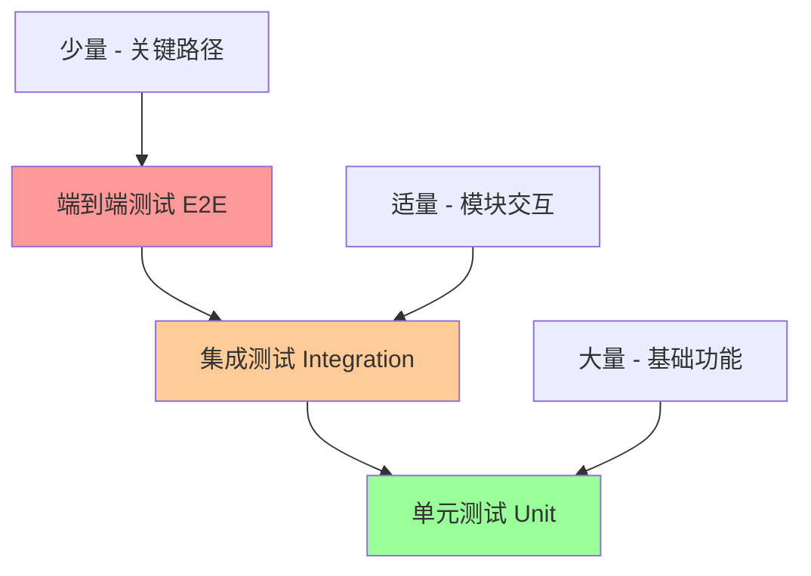

# 测试策略与方法论

## 1. 测试金字塔理论

### 1.1 测试层次结构



### 1.2 测试比例分配

| 测试类型 | 比例 | 执行速度 | 维护成本 | 覆盖范围 |
|---------|------|----------|----------|----------|
| 单元测试 | 70% | 极快 | 低 | 函数/方法 |
| 集成测试 | 20% | 中等 | 中等 | 模块/组件 |
| 端到端测试 | 10% | 慢 | 高 | 完整流程 |

## 2. pytest 核心概念

### 2.1 测试发现与执行

```python
# test_discovery.py
"""
pytest 自动发现规则：
- 文件名：test_*.py 或 *_test.py
- 函数名：test_*
- 类名：Test*
- 方法名：test_*
"""

def test_basic_function():
    """基础测试函数"""
    assert 1 + 1 == 2

class TestCalculator:
    """测试类"""
    
    def test_addition(self):
        """测试加法"""
        assert 2 + 3 == 5
    
    def test_subtraction(self):
        """测试减法"""
        assert 5 - 3 == 2
```

### 2.2 参数化测试

```python
# test_parametrized.py
import pytest

@pytest.mark.parametrize("input,expected", [
    (1, 2),
    (2, 4),
    (3, 6),
])
def test_double(input, expected):
    """参数化测试示例"""
    assert input * 2 == expected

@pytest.mark.parametrize("a,b,expected", [
    (1, 2, 3),
    (0, 0, 0),
    (-1, 1, 0),
])
def test_addition(a, b, expected):
    """多参数参数化测试"""
    assert a + b == expected
```

### 2.3 夹具（Fixtures）

```python
# test_fixtures.py
import pytest
import tempfile
import os

@pytest.fixture
def temp_file():
    """临时文件夹具"""
    with tempfile.NamedTemporaryFile(mode='w', delete=False) as f:
        f.write("test content")
        temp_path = f.name
    
    yield temp_path
    
    # 清理
    os.unlink(temp_path)

@pytest.fixture(scope="session")
def database():
    """会话级数据库夹具"""
    # 创建测试数据库
    db = create_test_database()
    yield db
    # 清理
    db.cleanup()

def test_file_operations(temp_file):
    """使用临时文件夹具的测试"""
    assert os.path.exists(temp_file)
    with open(temp_file, 'r') as f:
        content = f.read()
    assert content == "test content"
```

## 3. 测试标记与分类

### 3.1 内置标记

```python
# test_markers.py
import pytest

@pytest.mark.skip(reason="功能未实现")
def test_unimplemented():
    """跳过测试"""
    assert False

@pytest.mark.skipif(condition=True, reason="条件不满足")
def test_conditional_skip():
    """条件跳过测试"""
    assert True

@pytest.mark.xfail(reason="已知问题")
def test_known_failure():
    """预期失败的测试"""
    assert False

@pytest.mark.slow
def test_slow_operation():
    """慢速测试"""
    import time
    time.sleep(1)
    assert True
```

### 3.2 自定义标记

```python
# conftest.py
def pytest_configure(config):
    """配置自定义标记"""
    config.addinivalue_line("markers", "integration: 集成测试")
    config.addinivalue_line("markers", "unit: 单元测试")
    config.addinivalue_line("markers", "slow: 慢速测试")

# test_custom_markers.py
import pytest

@pytest.mark.integration
def test_database_integration():
    """集成测试标记"""
    assert True

@pytest.mark.unit
def test_unit_function():
    """单元测试标记"""
    assert True
```

## 4. 测试配置与插件

### 4.1 pytest.ini 配置

```ini
# pytest.ini
[tool:pytest]
minversion = 6.0
addopts = 
    -ra
    -q
    --strict-markers
    --strict-config
    --cov=src
    --cov-report=term-missing
    --cov-report=html
testpaths = tests
python_files = test_*.py
python_classes = Test*
python_functions = test_*
markers =
    slow: 慢速测试
    integration: 集成测试
    unit: 单元测试
filterwarnings =
    ignore::DeprecationWarning
    ignore::PendingDeprecationWarning
```

### 4.2 pyproject.toml 配置

```toml
# pyproject.toml
[tool.pytest.ini_options]
minversion = "6.0"
addopts = [
    "-ra",
    "-q",
    "--strict-markers",
    "--strict-config",
    "--cov=src",
    "--cov-report=term-missing",
    "--cov-report=html",
]
testpaths = ["tests"]
python_files = ["test_*.py"]
python_classes = ["Test*"]
python_functions = ["test_*"]
markers = [
    "slow: 慢速测试",
    "integration: 集成测试",
    "unit: 单元测试",
]
filterwarnings = [
    "ignore::DeprecationWarning",
    "ignore::PendingDeprecationWarning",
]
```

## 5. 测试覆盖率

### 5.1 覆盖率配置

```toml
# pyproject.toml
[tool.coverage.run]
source = ["src"]
omit = [
    "*/tests/*",
    "*/test_*",
    "*/__pycache__/*",
    "*/migrations/*",
]

[tool.coverage.report]
exclude_lines = [
    "pragma: no cover",
    "def __repr__",
    "if self.debug:",
    "if settings.DEBUG",
    "raise AssertionError",
    "raise NotImplementedError",
    "if 0:",
    "if __name__ == .__main__.:",
    "class .*\\bProtocol\\):",
    "@(abc\\.)?abstractmethod",
]

[tool.coverage.html]
directory = "htmlcov"
```

### 5.2 覆盖率报告

```bash
# 运行测试并生成覆盖率报告
pytest --cov=src --cov-report=html --cov-report=term-missing

# 只运行单元测试
pytest -m unit --cov=src

# 运行所有测试但排除慢速测试
pytest -m "not slow" --cov=src
```

## 6. 测试最佳实践

### 6.1 测试命名规范

```python
# 好的测试命名
def test_calculate_tax_with_valid_input_returns_correct_amount():
    """测试有效输入时计算税额返回正确金额"""
    pass

def test_user_registration_with_duplicate_email_raises_validation_error():
    """测试重复邮箱注册时抛出验证错误"""
    pass

# 避免的测试命名
def test1():
    """无意义的命名"""
    pass

def test_calc():
    """缩写命名"""
    pass
```

### 6.2 测试结构（AAA模式）

```python
def test_user_creation():
    """测试用户创建 - AAA模式"""
    # Arrange - 准备测试数据
    user_data = {
        "name": "John Doe",
        "email": "john@example.com",
        "age": 30
    }
    
    # Act - 执行被测试的操作
    user = create_user(user_data)
    
    # Assert - 验证结果
    assert user.name == "John Doe"
    assert user.email == "john@example.com"
    assert user.age == 30
    assert user.id is not None
```

### 6.3 测试隔离

```python
# test_isolation.py
import pytest
from unittest.mock import patch, MagicMock

class TestUserService:
    """用户服务测试类"""
    
    def setup_method(self):
        """每个测试方法前的设置"""
        self.user_service = UserService()
    
    def teardown_method(self):
        """每个测试方法后的清理"""
        # 清理测试数据
        pass
    
    @patch('user_service.database')
    def test_create_user_with_mocked_database(self, mock_db):
        """使用模拟数据库的测试"""
        # 配置模拟对象
        mock_db.save.return_value = {"id": 1, "name": "Test User"}
        
        # 执行测试
        result = self.user_service.create_user("Test User")
        
        # 验证结果
        assert result["id"] == 1
        assert result["name"] == "Test User"
        mock_db.save.assert_called_once()
```

## 7. 性能测试

### 7.1 基准测试

```python
# test_performance.py
import pytest
import time

def test_function_performance():
    """性能测试示例"""
    start_time = time.time()
    
    # 执行被测试的函数
    result = expensive_function()
    
    end_time = time.time()
    execution_time = end_time - start_time
    
    # 验证性能要求
    assert execution_time < 1.0  # 应在1秒内完成
    assert result is not None

@pytest.mark.benchmark
def test_benchmark_function(benchmark):
    """使用pytest-benchmark的性能测试"""
    result = benchmark(expensive_function)
    assert result is not None
```

### 7.2 内存测试

```python
# test_memory.py
import pytest
import psutil
import os

def test_memory_usage():
    """内存使用测试"""
    process = psutil.Process(os.getpid())
    initial_memory = process.memory_info().rss
    
    # 执行可能消耗内存的操作
    large_data = [i for i in range(1000000)]
    
    current_memory = process.memory_info().rss
    memory_increase = current_memory - initial_memory
    
    # 验证内存使用在合理范围内
    assert memory_increase < 100 * 1024 * 1024  # 小于100MB
    
    # 清理
    del large_data
```

## 8. 测试数据管理

### 8.1 测试数据工厂

```python
# test_factories.py
import factory
from factory.fuzzy import FuzzyText, FuzzyInteger

class UserFactory(factory.Factory):
    """用户测试数据工厂"""
    class Meta:
        model = User
    
    name = factory.Faker('name')
    email = factory.Faker('email')
    age = FuzzyInteger(18, 65)
    is_active = True

def test_user_creation_with_factory():
    """使用工厂创建测试数据"""
    user = UserFactory()
    assert user.name is not None
    assert user.email is not None
    assert 18 <= user.age <= 65
    assert user.is_active is True
```

### 8.2 测试数据清理

```python
# test_data_cleanup.py
import pytest
from sqlalchemy import create_engine
from sqlalchemy.orm import sessionmaker

@pytest.fixture(scope="function")
def db_session():
    """数据库会话夹具，自动清理"""
    engine = create_engine("sqlite:///:memory:")
    Session = sessionmaker(bind=engine)
    session = Session()
    
    # 创建表
    Base.metadata.create_all(engine)
    
    yield session
    
    # 清理
    session.close()
    engine.dispose()

def test_database_operations(db_session):
    """数据库操作测试"""
    user = User(name="Test User", email="test@example.com")
    db_session.add(user)
    db_session.commit()
    
    # 验证数据
    saved_user = db_session.query(User).first()
    assert saved_user.name == "Test User"
```

## 9. 持续集成配置

### 9.1 GitHub Actions

```yaml
# .github/workflows/test.yml
name: Tests

on:
  push:
    branches: [ main, develop ]
  pull_request:
    branches: [ main ]

jobs:
  test:
    runs-on: ubuntu-latest
    strategy:
      matrix:
        python-version: [3.9, 3.10, 3.11, 3.12]
    
    steps:
    - uses: actions/checkout@v4
    
    - name: Set up Python ${{ matrix.python-version }}
      uses: actions/setup-python@v5
      with:
        python-version: ${{ matrix.python-version }}
    
    - name: Install uv
      run: pipx install uv
    
    - name: Install dependencies
      run: |
        uv pip install -e .
        uv pip install pytest pytest-cov pytest-xdist
    
    - name: Run tests
      run: |
        pytest --cov=src --cov-report=xml --cov-report=html -n auto
    
    - name: Upload coverage to Codecov
      uses: codecov/codecov-action@v3
      with:
        file: ./coverage.xml
```

## 10. 总结

### 10.1 测试策略要点

1. **测试金字塔**：70%单元测试，20%集成测试，10%端到端测试
2. **快速反馈**：单元测试应快速执行，提供即时反馈
3. **测试隔离**：每个测试应独立运行，不依赖其他测试
4. **清晰命名**：测试名称应清楚描述测试场景和预期结果
5. **适当覆盖**：追求有意义的覆盖率，而非100%覆盖率

### 10.2 工具链推荐

- **测试框架**：pytest
- **覆盖率工具**：pytest-cov
- **性能测试**：pytest-benchmark
- **并行执行**：pytest-xdist
- **模拟工具**：unittest.mock, pytest-mock
- **数据工厂**：factory_boy

---

## 返回与相关

- 返回目录：[02-测试与质量/README](../README.md)
- 相关文档：[质量检查](./质量检查.md)
- 示例项目：[minimal_project](../examples/minimal_project/)
