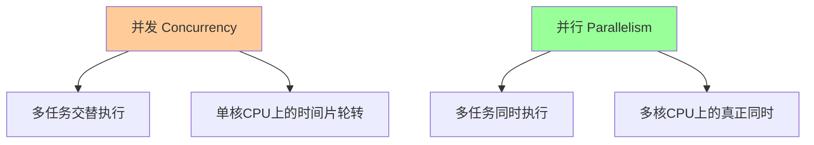

# 并发模式与最佳实践

## 1. 并发模型概述

### 1.1 并发 vs 并行



### 1.2 Python并发模型对比

| 模型 | 适用场景 | 优势 | 劣势 | GIL影响 |
|------|----------|------|------|---------|
| 线程 | I/O密集型 | 共享内存，轻量级 | 受GIL限制 | 严重 |
| 进程 | CPU密集型 | 真正并行，隔离性好 | 内存开销大 | 无 |
| 协程 | I/O密集型 | 高效，资源占用少 | 单线程执行 | 无 |

## 2. 线程编程

### 2.1 基础线程操作

```python
# threading_basic.py
import threading
import time
from concurrent.futures import ThreadPoolExecutor

def worker(name: str, duration: int) -> str:
    """工作线程函数"""
    print(f"线程 {name} 开始工作")
    time.sleep(duration)
    print(f"线程 {name} 完成工作")
    return f"线程 {name} 的结果"

# 基础线程创建
def basic_threading():
    """基础线程操作"""
    threads = []
    
    # 创建线程
    for i in range(3):
        thread = threading.Thread(
            target=worker,
            args=(f"Worker-{i}", 2)
        )
        threads.append(thread)
        thread.start()
    
    # 等待所有线程完成
    for thread in threads:
        thread.join()
    
    print("所有线程完成")

# 使用ThreadPoolExecutor
def thread_pool_example():
    """线程池示例"""
    with ThreadPoolExecutor(max_workers=3) as executor:
        # 提交任务
        futures = [
            executor.submit(worker, f"Pool-{i}", 2)
            for i in range(5)
        ]
        
        # 获取结果
        for future in futures:
            result = future.result()
            print(f"收到结果: {result}")

if __name__ == "__main__":
    print("=== 基础线程操作 ===")
    basic_threading()
    
    print("\n=== 线程池操作 ===")
    thread_pool_example()
```

### 2.2 线程同步

```python
# threading_sync.py
import threading
import time
from typing import List

class ThreadSafeCounter:
    """线程安全的计数器"""
    
    def __init__(self):
        self._value = 0
        self._lock = threading.Lock()
    
    def increment(self) -> int:
        """原子递增操作"""
        with self._lock:
            self._value += 1
            return self._value
    
    def get_value(self) -> int:
        """获取当前值"""
        with self._lock:
            return self._value

def worker_with_sync(counter: ThreadSafeCounter, worker_id: int):
    """使用同步的工作线程"""
    for _ in range(1000):
        value = counter.increment()
        if value % 100 == 0:
            print(f"Worker {worker_id}: 计数器值 = {value}")

# 条件变量示例
class ProducerConsumer:
    """生产者-消费者模式"""
    
    def __init__(self, max_size: int = 5):
        self.queue: List[int] = []
        self.max_size = max_size
        self.lock = threading.Lock()
        self.not_empty = threading.Condition(self.lock)
        self.not_full = threading.Condition(self.lock)
    
    def produce(self, item: int):
        """生产者"""
        with self.not_full:
            while len(self.queue) >= self.max_size:
                self.not_full.wait()
            
            self.queue.append(item)
            print(f"生产: {item}, 队列大小: {len(self.queue)}")
            self.not_empty.notify()
    
    def consume(self) -> int:
        """消费者"""
        with self.not_empty:
            while not self.queue:
                self.not_empty.wait()
            
            item = self.queue.pop(0)
            print(f"消费: {item}, 队列大小: {len(self.queue)}")
            self.not_full.notify()
            return item

def producer_consumer_example():
    """生产者-消费者示例"""
    pc = ProducerConsumer()
    
    def producer():
        for i in range(10):
            pc.produce(i)
            time.sleep(0.1)
    
    def consumer():
        for _ in range(10):
            item = pc.consume()
            time.sleep(0.15)
    
    # 创建线程
    producer_thread = threading.Thread(target=producer)
    consumer_thread = threading.Thread(target=consumer)
    
    # 启动线程
    producer_thread.start()
    consumer_thread.start()
    
    # 等待完成
    producer_thread.join()
    consumer_thread.join()

if __name__ == "__main__":
    print("=== 线程安全计数器 ===")
    counter = ThreadSafeCounter()
    threads = []
    
    for i in range(3):
        thread = threading.Thread(target=worker_with_sync, args=(counter, i))
        threads.append(thread)
        thread.start()
    
    for thread in threads:
        thread.join()
    
    print(f"最终计数器值: {counter.get_value()}")
    
    print("\n=== 生产者-消费者模式 ===")
    producer_consumer_example()
```

## 3. 进程编程

### 3.1 基础进程操作

```python
# multiprocessing_basic.py
import multiprocessing
import time
from concurrent.futures import ProcessPoolExecutor
import os

def cpu_intensive_task(n: int) -> int:
    """CPU密集型任务"""
    print(f"进程 {os.getpid()} 处理任务 {n}")
    
    # 模拟CPU密集型计算
    result = 0
    for i in range(n * 1000000):
        result += i
    
    return result

def basic_multiprocessing():
    """基础多进程操作"""
    processes = []
    
    # 创建进程
    for i in range(3):
        process = multiprocessing.Process(
            target=cpu_intensive_task,
            args=(i + 1,)
        )
        processes.append(process)
        process.start()
    
    # 等待所有进程完成
    for process in processes:
        process.join()
    
    print("所有进程完成")

def process_pool_example():
    """进程池示例"""
    with ProcessPoolExecutor(max_workers=4) as executor:
        # 提交任务
        futures = [
            executor.submit(cpu_intensive_task, i)
            for i in range(1, 6)
        ]
        
        # 获取结果
        for future in futures:
            result = future.result()
            print(f"任务结果: {result}")

if __name__ == "__main__":
    print("=== 基础多进程操作 ===")
    basic_multiprocessing()
    
    print("\n=== 进程池操作 ===")
    process_pool_example()
```

### 3.2 进程间通信

```python
# multiprocessing_communication.py
import multiprocessing
import time
from multiprocessing import Queue, Pipe, Value, Array

def worker_with_queue(input_queue: Queue, output_queue: Queue):
    """使用队列的工作进程"""
    while True:
        try:
            # 从输入队列获取任务
            task = input_queue.get(timeout=1)
            if task is None:  # 结束信号
                break
            
            # 处理任务
            result = task * 2
            print(f"进程 {os.getpid()} 处理任务 {task} -> {result}")
            
            # 将结果放入输出队列
            output_queue.put(result)
            
        except:
            break

def worker_with_pipe(conn):
    """使用管道的工作进程"""
    while True:
        try:
            # 接收数据
            data = conn.recv()
            if data is None:  # 结束信号
                break
            
            # 处理数据
            result = data * 3
            print(f"进程 {os.getpid()} 处理数据 {data} -> {result}")
            
            # 发送结果
            conn.send(result)
            
        except:
            break

def worker_with_shared_memory(shared_value, shared_array):
    """使用共享内存的工作进程"""
    # 修改共享值
    with shared_value.get_lock():
        shared_value.value += 1
    
    # 修改共享数组
    for i in range(len(shared_array)):
        shared_array[i] *= 2
    
    print(f"进程 {os.getpid()} 修改共享内存")

def queue_communication():
    """队列通信示例"""
    input_queue = Queue()
    output_queue = Queue()
    
    # 创建进程
    process = multiprocessing.Process(
        target=worker_with_queue,
        args=(input_queue, output_queue)
    )
    process.start()
    
    # 发送任务
    for i in range(5):
        input_queue.put(i)
    
    # 发送结束信号
    input_queue.put(None)
    
    # 获取结果
    results = []
    while True:
        try:
            result = output_queue.get(timeout=1)
            results.append(result)
        except:
            break
    
    process.join()
    print(f"队列通信结果: {results}")

def pipe_communication():
    """管道通信示例"""
    parent_conn, child_conn = Pipe()
    
    # 创建进程
    process = multiprocessing.Process(
        target=worker_with_pipe,
        args=(child_conn,)
    )
    process.start()
    
    # 发送数据
    for i in range(3):
        parent_conn.send(i)
        result = parent_conn.recv()
        print(f"管道通信结果: {i} -> {result}")
    
    # 发送结束信号
    parent_conn.send(None)
    process.join()

def shared_memory_communication():
    """共享内存通信示例"""
    # 创建共享值
    shared_value = Value('i', 0)
    
    # 创建共享数组
    shared_array = Array('i', [1, 2, 3, 4, 5])
    
    print(f"初始共享值: {shared_value.value}")
    print(f"初始共享数组: {list(shared_array)}")
    
    # 创建进程
    processes = []
    for _ in range(3):
        process = multiprocessing.Process(
            target=worker_with_shared_memory,
            args=(shared_value, shared_array)
        )
        processes.append(process)
        process.start()
    
    # 等待所有进程完成
    for process in processes:
        process.join()
    
    print(f"最终共享值: {shared_value.value}")
    print(f"最终共享数组: {list(shared_array)}")

if __name__ == "__main__":
    print("=== 队列通信 ===")
    queue_communication()
    
    print("\n=== 管道通信 ===")
    pipe_communication()
    
    print("\n=== 共享内存通信 ===")
    shared_memory_communication()
```

## 4. 异步编程基础

### 4.1 asyncio核心概念

```python
# asyncio_basic.py
import asyncio
import time
from typing import List

async def async_task(name: str, duration: int) -> str:
    """异步任务"""
    print(f"任务 {name} 开始")
    await asyncio.sleep(duration)
    print(f"任务 {name} 完成")
    return f"任务 {name} 的结果"

async def basic_async():
    """基础异步操作"""
    # 创建任务
    tasks = [
        async_task(f"Task-{i}", 2)
        for i in range(3)
    ]
    
    # 并发执行
    results = await asyncio.gather(*tasks)
    print(f"所有任务完成: {results}")

async def async_with_timeout():
    """带超时的异步操作"""
    try:
        # 设置超时
        result = await asyncio.wait_for(
            async_task("Timeout-Task", 5),
            timeout=3.0
        )
        print(f"任务完成: {result}")
    except asyncio.TimeoutError:
        print("任务超时")

async def async_cancellation():
    """异步任务取消"""
    # 创建任务
    task = asyncio.create_task(async_task("Cancel-Task", 10))
    
    # 等待一段时间后取消
    await asyncio.sleep(2)
    task.cancel()
    
    try:
        result = await task
        print(f"任务完成: {result}")
    except asyncio.CancelledError:
        print("任务被取消")

if __name__ == "__main__":
    print("=== 基础异步操作 ===")
    asyncio.run(basic_async())
    
    print("\n=== 异步超时 ===")
    asyncio.run(async_with_timeout())
    
    print("\n=== 异步取消 ===")
    asyncio.run(async_cancellation())
```

### 4.2 异步上下文管理

```python
# asyncio_context.py
import asyncio
import aiohttp
from contextlib import asynccontextmanager
from typing import AsyncGenerator

class AsyncResource:
    """异步资源类"""
    
    def __init__(self, name: str):
        self.name = name
        self.is_open = False
    
    async def open(self):
        """打开资源"""
        print(f"打开资源: {self.name}")
        await asyncio.sleep(0.1)  # 模拟异步操作
        self.is_open = True
    
    async def close(self):
        """关闭资源"""
        print(f"关闭资源: {self.name}")
        await asyncio.sleep(0.1)  # 模拟异步操作
        self.is_open = False
    
    async def use(self):
        """使用资源"""
        if not self.is_open:
            raise RuntimeError("资源未打开")
        print(f"使用资源: {self.name}")
        await asyncio.sleep(0.5)

@asynccontextmanager
async def async_resource_manager(name: str) -> AsyncGenerator[AsyncResource, None]:
    """异步资源管理器"""
    resource = AsyncResource(name)
    try:
        await resource.open()
        yield resource
    finally:
        await resource.close()

async def use_async_resource():
    """使用异步资源管理器"""
    async with async_resource_manager("Database") as db:
        await db.use()
    
    async with async_resource_manager("File") as file:
        await file.use()

# 异步HTTP客户端示例
async def async_http_example():
    """异步HTTP请求示例"""
    async with aiohttp.ClientSession() as session:
        # 并发请求
        tasks = [
            session.get(f"https://httpbin.org/delay/{i}")
            for i in range(1, 4)
        ]
        
        responses = await asyncio.gather(*tasks)
        
        for i, response in enumerate(responses):
            data = await response.json()
            print(f"请求 {i+1} 完成: {data['url']}")
            await response.close()

if __name__ == "__main__":
    print("=== 异步资源管理 ===")
    asyncio.run(use_async_resource())
    
    print("\n=== 异步HTTP请求 ===")
    asyncio.run(async_http_example())
```

## 5. 高级异步模式

### 5.1 异步队列与生产者-消费者

```python
# asyncio_queue.py
import asyncio
import random
from typing import Any

async def producer(queue: asyncio.Queue, producer_id: int, count: int):
    """异步生产者"""
    for i in range(count):
        item = f"Producer-{producer_id}-Item-{i}"
        await queue.put(item)
        print(f"生产者 {producer_id} 生产: {item}")
        await asyncio.sleep(random.uniform(0.1, 0.5))
    
    # 发送结束信号
    await queue.put(None)

async def consumer(queue: asyncio.Queue, consumer_id: int):
    """异步消费者"""
    while True:
        item = await queue.get()
        if item is None:  # 结束信号
            queue.task_done()
            break
        
        print(f"消费者 {consumer_id} 消费: {item}")
        await asyncio.sleep(random.uniform(0.2, 0.8))
        queue.task_done()

async def async_producer_consumer():
    """异步生产者-消费者模式"""
    queue = asyncio.Queue(maxsize=5)
    
    # 创建生产者
    producers = [
        asyncio.create_task(producer(queue, i, 3))
        for i in range(2)
    ]
    
    # 创建消费者
    consumers = [
        asyncio.create_task(consumer(queue, i))
        for i in range(2)
    ]
    
    # 等待生产者完成
    await asyncio.gather(*producers)
    
    # 发送结束信号给消费者
    for _ in consumers:
        await queue.put(None)
    
    # 等待消费者完成
    await asyncio.gather(*consumers)
    
    print("所有任务完成")

# 异步信号量示例
async def worker_with_semaphore(semaphore: asyncio.Semaphore, worker_id: int):
    """使用信号量的工作协程"""
    async with semaphore:
        print(f"工作者 {worker_id} 开始工作")
        await asyncio.sleep(2)
        print(f"工作者 {worker_id} 完成工作")

async def semaphore_example():
    """信号量示例"""
    semaphore = asyncio.Semaphore(3)  # 最多3个并发
    
    tasks = [
        asyncio.create_task(worker_with_semaphore(semaphore, i))
        for i in range(10)
    ]
    
    await asyncio.gather(*tasks)

if __name__ == "__main__":
    print("=== 异步生产者-消费者 ===")
    asyncio.run(async_producer_consumer())
    
    print("\n=== 异步信号量 ===")
    asyncio.run(semaphore_example())
```

### 5.2 异步事件与条件

```python
# asyncio_events.py
import asyncio
import random

async def waiter(event: asyncio.Event, waiter_id: int):
    """等待事件的协程"""
    print(f"等待者 {waiter_id} 等待事件")
    await event.wait()
    print(f"等待者 {waiter_id} 收到事件")

async def event_setter(event: asyncio.Event):
    """设置事件的协程"""
    await asyncio.sleep(3)
    print("设置事件")
    event.set()

async def event_example():
    """事件示例"""
    event = asyncio.Event()
    
    # 创建等待者
    waiters = [
        asyncio.create_task(waiter(event, i))
        for i in range(3)
    ]
    
    # 创建事件设置者
    setter = asyncio.create_task(event_setter(event))
    
    # 等待所有任务完成
    await asyncio.gather(*waiters, setter)

# 异步条件变量示例
class AsyncCondition:
    """异步条件变量"""
    
    def __init__(self):
        self._condition = asyncio.Condition()
        self._data = None
    
    async def wait_for_data(self, waiter_id: int):
        """等待数据"""
        async with self._condition:
            print(f"等待者 {waiter_id} 等待数据")
            await self._condition.wait_for(lambda: self._data is not None)
            print(f"等待者 {waiter_id} 收到数据: {self._data}")
    
    async def set_data(self, data: str):
        """设置数据"""
        async with self._condition:
            self._data = data
            print(f"设置数据: {data}")
            self._condition.notify_all()

async def condition_example():
    """条件变量示例"""
    condition = AsyncCondition()
    
    # 创建等待者
    waiters = [
        asyncio.create_task(condition.wait_for_data(i))
        for i in range(3)
    ]
    
    # 等待一段时间后设置数据
    await asyncio.sleep(2)
    await condition.set_data("Hello World!")
    
    # 等待所有任务完成
    await asyncio.gather(*waiters)

if __name__ == "__main__":
    print("=== 异步事件 ===")
    asyncio.run(event_example())
    
    print("\n=== 异步条件变量 ===")
    asyncio.run(condition_example())
```

## 6. 性能优化策略

### 6.1 异步性能优化

```python
# asyncio_performance.py
import asyncio
import time
import aiohttp
from typing import List

async def fetch_url(session: aiohttp.ClientSession, url: str) -> dict:
    """获取URL内容"""
    async with session.get(url) as response:
        return {
            "url": url,
            "status": response.status,
            "content_length": len(await response.text())
        }

async def sequential_requests(urls: List[str]):
    """顺序请求"""
    start_time = time.time()
    
    async with aiohttp.ClientSession() as session:
        results = []
        for url in urls:
            result = await fetch_url(session, url)
            results.append(result)
    
    end_time = time.time()
    print(f"顺序请求耗时: {end_time - start_time:.2f}秒")
    return results

async def concurrent_requests(urls: List[str]):
    """并发请求"""
    start_time = time.time()
    
    async with aiohttp.ClientSession() as session:
        tasks = [fetch_url(session, url) for url in urls]
        results = await asyncio.gather(*tasks)
    
    end_time = time.time()
    print(f"并发请求耗时: {end_time - start_time:.2f}秒")
    return results

async def semaphore_limited_requests(urls: List[str], limit: int = 5):
    """信号量限制的并发请求"""
    start_time = time.time()
    semaphore = asyncio.Semaphore(limit)
    
    async def fetch_with_semaphore(session: aiohttp.ClientSession, url: str):
        async with semaphore:
            return await fetch_url(session, url)
    
    async with aiohttp.ClientSession() as session:
        tasks = [fetch_with_semaphore(session, url) for url in urls]
        results = await asyncio.gather(*tasks)
    
    end_time = time.time()
    print(f"信号量限制请求耗时: {end_time - start_time:.2f}秒")
    return results

async def performance_comparison():
    """性能对比"""
    urls = [
        "https://httpbin.org/delay/1",
        "https://httpbin.org/delay/1",
        "https://httpbin.org/delay/1",
        "https://httpbin.org/delay/1",
        "https://httpbin.org/delay/1",
    ]
    
    print("=== 性能对比 ===")
    
    # 顺序请求
    await sequential_requests(urls)
    
    # 并发请求
    await concurrent_requests(urls)
    
    # 信号量限制请求
    await semaphore_limited_requests(urls, limit=3)

if __name__ == "__main__":
    asyncio.run(performance_comparison())
```

### 6.2 内存优化

```python
# memory_optimization.py
import asyncio
import gc
import psutil
import os
from typing import List

class MemoryMonitor:
    """内存监控器"""
    
    def __init__(self):
        self.process = psutil.Process(os.getpid())
    
    def get_memory_usage(self) -> float:
        """获取内存使用量（MB）"""
        return self.process.memory_info().rss / 1024 / 1024
    
    def log_memory(self, stage: str):
        """记录内存使用"""
        memory = self.get_memory_usage()
        print(f"{stage}: 内存使用 {memory:.2f} MB")

async def memory_intensive_task(data_size: int):
    """内存密集型任务"""
    # 创建大量数据
    data = [i for i in range(data_size)]
    
    # 模拟处理
    await asyncio.sleep(0.1)
    
    # 显式删除数据
    del data
    gc.collect()

async def memory_optimized_task(data_size: int):
    """内存优化任务"""
    # 使用生成器而不是列表
    data = (i for i in range(data_size))
    
    # 模拟处理
    await asyncio.sleep(0.1)
    
    # 生成器会自动清理
    del data
    gc.collect()

async def memory_comparison():
    """内存使用对比"""
    monitor = MemoryMonitor()
    data_size = 1000000
    
    monitor.log_memory("开始")
    
    # 内存密集型任务
    await memory_intensive_task(data_size)
    monitor.log_memory("内存密集型任务后")
    
    # 内存优化任务
    await memory_optimized_task(data_size)
    monitor.log_memory("内存优化任务后")

if __name__ == "__main__":
    asyncio.run(memory_comparison())
```

## 7. 错误处理与调试

### 7.1 异步错误处理

```python
# asyncio_error_handling.py
import asyncio
import logging
from typing import List

# 配置日志
logging.basicConfig(level=logging.INFO)
logger = logging.getLogger(__name__)

async def risky_task(task_id: int, should_fail: bool = False):
    """可能失败的任务"""
    await asyncio.sleep(1)
    
    if should_fail:
        raise ValueError(f"任务 {task_id} 失败")
    
    return f"任务 {task_id} 成功"

async def error_handling_examples():
    """错误处理示例"""
    
    # 1. 基本错误处理
    try:
        result = await risky_task(1, should_fail=True)
        print(f"结果: {result}")
    except ValueError as e:
        print(f"捕获错误: {e}")
    
    # 2. 并发任务的错误处理
    tasks = [
        risky_task(i, should_fail=(i % 2 == 0))
        for i in range(5)
    ]
    
    results = []
    errors = []
    
    for task in asyncio.as_completed(tasks):
        try:
            result = await task
            results.append(result)
        except Exception as e:
            errors.append(e)
    
    print(f"成功结果: {results}")
    print(f"错误: {errors}")
    
    # 3. 使用gather的错误处理
    tasks = [
        risky_task(i, should_fail=(i % 3 == 0))
        for i in range(6)
    ]
    
    try:
        results = await asyncio.gather(*tasks, return_exceptions=True)
        print(f"所有结果: {results}")
    except Exception as e:
        print(f"Gather错误: {e}")

# 异步重试机制
async def retry_task(task_func, max_retries: int = 3, delay: float = 1.0):
    """重试机制"""
    for attempt in range(max_retries):
        try:
            return await task_func()
        except Exception as e:
            if attempt == max_retries - 1:
                raise e
            
            logger.warning(f"尝试 {attempt + 1} 失败: {e}, {delay}秒后重试")
            await asyncio.sleep(delay)
            delay *= 2  # 指数退避

async def retry_example():
    """重试示例"""
    async def unreliable_task():
        import random
        if random.random() < 0.7:  # 70%失败率
            raise RuntimeError("随机失败")
        return "成功"
    
    try:
        result = await retry_task(unreliable_task, max_retries=5)
        print(f"重试成功: {result}")
    except Exception as e:
        print(f"重试失败: {e}")

if __name__ == "__main__":
    print("=== 错误处理示例 ===")
    asyncio.run(error_handling_examples())
    
    print("\n=== 重试机制示例 ===")
    asyncio.run(retry_example())
```

## 8. 最佳实践总结

### 8.1 选择并发模型

```python
# concurrency_decision_tree.py
"""
并发模型选择决策树：

1. 任务类型：
   - CPU密集型 -> 多进程
   - I/O密集型 -> 多线程或异步

2. 数据共享：
   - 需要共享状态 -> 多线程
   - 独立处理 -> 多进程或异步

3. 性能要求：
   - 高并发 -> 异步
   - 简单并行 -> 多进程

4. 复杂度：
   - 简单 -> 多线程
   - 复杂 -> 异步
"""

def choose_concurrency_model(task_type: str, data_sharing: bool, 
                           performance_requirement: str, complexity: str) -> str:
    """选择并发模型"""
    
    if task_type == "CPU密集型":
        return "多进程"
    
    if task_type == "I/O密集型":
        if data_sharing:
            return "多线程"
        elif performance_requirement == "高并发":
            return "异步"
        else:
            return "多线程"
    
    return "多线程"  # 默认选择

# 使用示例
examples = [
    ("CPU密集型", False, "中等", "简单"),
    ("I/O密集型", True, "高并发", "复杂"),
    ("I/O密集型", False, "高并发", "复杂"),
    ("I/O密集型", True, "中等", "简单"),
]

for example in examples:
    model = choose_concurrency_model(*example)
    print(f"场景 {example} -> {model}")
```

### 8.2 性能监控

```python
# performance_monitoring.py
import asyncio
import time
import psutil
import os
from typing import Dict, Any

class PerformanceMonitor:
    """性能监控器"""
    
    def __init__(self):
        self.process = psutil.Process(os.getpid())
        self.metrics: Dict[str, Any] = {}
    
    def start_monitoring(self, task_name: str):
        """开始监控"""
        self.metrics[task_name] = {
            "start_time": time.time(),
            "start_memory": self.process.memory_info().rss,
            "start_cpu": self.process.cpu_percent()
        }
    
    def stop_monitoring(self, task_name: str):
        """停止监控"""
        if task_name in self.metrics:
            metrics = self.metrics[task_name]
            metrics["end_time"] = time.time()
            metrics["end_memory"] = self.process.memory_info().rss
            metrics["end_cpu"] = self.process.cpu_percent()
            
            # 计算差值
            metrics["duration"] = metrics["end_time"] - metrics["start_time"]
            metrics["memory_delta"] = metrics["end_memory"] - metrics["start_memory"]
            metrics["cpu_delta"] = metrics["end_cpu"] - metrics["start_cpu"]
    
    def get_report(self) -> Dict[str, Any]:
        """获取监控报告"""
        return self.metrics

async def monitored_task(monitor: PerformanceMonitor, task_name: str, duration: float):
    """被监控的任务"""
    monitor.start_monitoring(task_name)
    
    # 模拟工作
    await asyncio.sleep(duration)
    
    monitor.stop_monitoring(task_name)

async def performance_monitoring_example():
    """性能监控示例"""
    monitor = PerformanceMonitor()
    
    # 监控多个任务
    tasks = [
        monitored_task(monitor, f"Task-{i}", 1.0)
        for i in range(3)
    ]
    
    await asyncio.gather(*tasks)
    
    # 获取报告
    report = monitor.get_report()
    
    print("=== 性能监控报告 ===")
    for task_name, metrics in report.items():
        print(f"{task_name}:")
        print(f"  持续时间: {metrics['duration']:.2f}秒")
        print(f"  内存变化: {metrics['memory_delta'] / 1024 / 1024:.2f}MB")
        print(f"  CPU变化: {metrics['cpu_delta']:.2f}%")

if __name__ == "__main__":
    asyncio.run(performance_monitoring_example())
```

## 9. 总结

### 9.1 并发编程要点

1. **选择合适的模型**：根据任务类型选择线程、进程或异步
2. **避免竞态条件**：使用适当的同步原语
3. **资源管理**：正确管理资源，避免泄漏
4. **错误处理**：妥善处理并发环境中的错误
5. **性能监控**：监控并发程序的性能指标

### 9.2 工具推荐

- **线程**：`threading`, `concurrent.futures.ThreadPoolExecutor`
- **进程**：`multiprocessing`, `concurrent.futures.ProcessPoolExecutor`
- **异步**：`asyncio`, `aiohttp`, `asyncpg`
- **监控**：`psutil`, `memory_profiler`
- **调试**：`asyncio.run()`, `logging`

---

## 返回与相关

- 返回目录：[04-并发与异步/README](../README.md)
- 相关文档：[异步编程模式](./异步编程模式.md)
- 示例项目：[asyncio_rate_limit](../examples/asyncio_rate_limit/)
