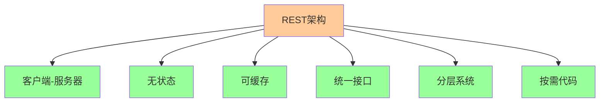

# API设计与架构

## 1. RESTful API设计原则

### 1.1 REST架构约束



### 1.2 HTTP方法语义

| 方法 | 语义 | 幂等性 | 安全性 | 用途 |
|------|------|--------|--------|------|
| GET | 获取资源 | 是 | 是 | 查询数据 |
| POST | 创建资源 | 否 | 否 | 创建新资源 |
| PUT | 更新资源 | 是 | 否 | 完整更新 |
| PATCH | 部分更新 | 否 | 否 | 部分更新 |
| DELETE | 删除资源 | 是 | 否 | 删除资源 |
| HEAD | 获取头信息 | 是 | 是 | 检查资源 |
| OPTIONS | 获取选项 | 是 | 是 | 跨域预检 |

## 2. FastAPI核心概念

### 2.1 基础应用结构

```python
# app_basic.py
from fastapi import FastAPI, HTTPException, Depends
from pydantic import BaseModel, Field
from typing import List, Optional
import uvicorn

# 创建FastAPI应用
app = FastAPI(
    title="用户管理API",
    description="用户管理系统的RESTful API",
    version="1.0.0",
    docs_url="/docs",
    redoc_url="/redoc"
)

# 数据模型
class UserBase(BaseModel):
    """用户基础模型"""
    name: str = Field(..., min_length=1, max_length=100, description="用户姓名")
    email: str = Field(..., regex=r'^[\w\.-]+@[\w\.-]+\.\w+$', description="邮箱地址")
    age: Optional[int] = Field(None, ge=0, le=150, description="年龄")

class UserCreate(UserBase):
    """创建用户模型"""
    password: str = Field(..., min_length=8, description="密码")

class UserUpdate(BaseModel):
    """更新用户模型"""
    name: Optional[str] = Field(None, min_length=1, max_length=100)
    email: Optional[str] = Field(None, regex=r'^[\w\.-]+@[\w\.-]+\.\w+$')
    age: Optional[int] = Field(None, ge=0, le=150)

class User(UserBase):
    """用户响应模型"""
    id: int
    is_active: bool = True
    
    class Config:
        from_attributes = True

# 模拟数据库
users_db = []
user_id_counter = 1

# 依赖注入
def get_current_user_id() -> int:
    """获取当前用户ID（模拟）"""
    return 1

# 路由定义
@app.get("/", summary="根路径")
async def root():
    """根路径"""
    return {"message": "欢迎使用用户管理API"}

@app.get("/health", summary="健康检查")
async def health_check():
    """健康检查端点"""
    return {"status": "healthy", "timestamp": "2024-01-01T00:00:00Z"}

@app.post("/users", response_model=User, status_code=201, summary="创建用户")
async def create_user(user: UserCreate):
    """创建新用户"""
    global user_id_counter
    
    # 检查邮箱是否已存在
    if any(u["email"] == user.email for u in users_db):
        raise HTTPException(status_code=400, detail="邮箱已存在")
    
    # 创建用户
    new_user = {
        "id": user_id_counter,
        "name": user.name,
        "email": user.email,
        "age": user.age,
        "is_active": True
    }
    
    users_db.append(new_user)
    user_id_counter += 1
    
    return new_user

@app.get("/users", response_model=List[User], summary="获取用户列表")
async def get_users(
    skip: int = 0,
    limit: int = 100,
    search: Optional[str] = None
):
    """获取用户列表"""
    result = users_db[skip:skip + limit]
    
    if search:
        result = [u for u in result if search.lower() in u["name"].lower()]
    
    return result

@app.get("/users/{user_id}", response_model=User, summary="获取用户详情")
async def get_user(user_id: int):
    """根据ID获取用户详情"""
    user = next((u for u in users_db if u["id"] == user_id), None)
    
    if not user:
        raise HTTPException(status_code=404, detail="用户不存在")
    
    return user

@app.put("/users/{user_id}", response_model=User, summary="更新用户")
async def update_user(user_id: int, user_update: UserUpdate):
    """更新用户信息"""
    user_index = next((i for i, u in enumerate(users_db) if u["id"] == user_id), None)
    
    if user_index is None:
        raise HTTPException(status_code=404, detail="用户不存在")
    
    # 更新用户信息
    user = users_db[user_index]
    update_data = user_update.dict(exclude_unset=True)
    
    for field, value in update_data.items():
        user[field] = value
    
    return user

@app.delete("/users/{user_id}", summary="删除用户")
async def delete_user(user_id: int):
    """删除用户"""
    user_index = next((i for i, u in enumerate(users_db) if u["id"] == user_id), None)
    
    if user_index is None:
        raise HTTPException(status_code=404, detail="用户不存在")
    
    del users_db[user_index]
    return {"message": "用户删除成功"}

if __name__ == "__main__":
    uvicorn.run(app, host="0.0.0.0", port=8000)
```

### 2.2 高级路由配置

```python
# app_advanced.py
from fastapi import FastAPI, APIRouter, Depends, HTTPException, status
from fastapi.security import HTTPBearer, HTTPAuthorizationCredentials
from fastapi.middleware.cors import CORSMiddleware
from fastapi.middleware.trustedhost import TrustedHostMiddleware
from fastapi.responses import JSONResponse
from pydantic import BaseModel
from typing import List, Optional
import time

app = FastAPI(
    title="高级API示例",
    description="展示FastAPI高级功能",
    version="2.0.0"
)

# 中间件配置
app.add_middleware(
    CORSMiddleware,
    allow_origins=["http://localhost:3000", "https://example.com"],
    allow_credentials=True,
    allow_methods=["*"],
    allow_headers=["*"],
)

app.add_middleware(
    TrustedHostMiddleware,
    allowed_hosts=["localhost", "127.0.0.1", "*.example.com"]
)

# 安全配置
security = HTTPBearer()

# 子路由器
api_v1 = APIRouter(prefix="/api/v1", tags=["API v1"])
api_v2 = APIRouter(prefix="/api/v2", tags=["API v2"])

# 数据模型
class Item(BaseModel):
    id: Optional[int] = None
    name: str
    description: Optional[str] = None
    price: float
    is_available: bool = True

class ItemResponse(BaseModel):
    id: int
    name: str
    description: Optional[str]
    price: float
    is_available: bool
    created_at: str

# 依赖注入
async def get_current_user(credentials: HTTPAuthorizationCredentials = Depends(security)):
    """获取当前用户（模拟）"""
    if not credentials.credentials:
        raise HTTPException(
            status_code=status.HTTP_401_UNAUTHORIZED,
            detail="未提供认证信息"
        )
    
    # 模拟用户验证
    if credentials.credentials != "valid-token":
        raise HTTPException(
            status_code=status.HTTP_401_UNAUTHORIZED,
            detail="无效的认证信息"
        )
    
    return {"user_id": 1, "username": "admin"}

# 异常处理器
@app.exception_handler(HTTPException)
async def http_exception_handler(request, exc):
    """HTTP异常处理器"""
    return JSONResponse(
        status_code=exc.status_code,
        content={
            "error": {
                "code": exc.status_code,
                "message": exc.detail,
                "timestamp": time.time()
            }
        }
    )

# 中间件：请求日志
@app.middleware("http")
async def log_requests(request, call_next):
    """请求日志中间件"""
    start_time = time.time()
    
    response = await call_next(request)
    
    process_time = time.time() - start_time
    
    print(f"{request.method} {request.url} - {response.status_code} - {process_time:.3f}s")
    
    return response

# API v1 路由
@api_v1.get("/items", response_model=List[ItemResponse])
async def get_items_v1():
    """获取商品列表 v1"""
    return [
        ItemResponse(
            id=1,
            name="商品1",
            description="这是商品1",
            price=99.99,
            is_available=True,
            created_at="2024-01-01T00:00:00Z"
        )
    ]

@api_v1.post("/items", response_model=ItemResponse, status_code=201)
async def create_item_v1(item: Item, current_user=Depends(get_current_user)):
    """创建商品 v1"""
    return ItemResponse(
        id=1,
        name=item.name,
        description=item.description,
        price=item.price,
        is_available=item.is_available,
        created_at="2024-01-01T00:00:00Z"
    )

# API v2 路由
@api_v2.get("/items", response_model=List[ItemResponse])
async def get_items_v2():
    """获取商品列表 v2"""
    return [
        ItemResponse(
            id=1,
            name="商品1",
            description="这是商品1",
            price=99.99,
            is_available=True,
            created_at="2024-01-01T00:00:00Z"
        )
    ]

@api_v2.post("/items", response_model=ItemResponse, status_code=201)
async def create_item_v2(item: Item, current_user=Depends(get_current_user)):
    """创建商品 v2"""
    return ItemResponse(
        id=1,
        name=item.name,
        description=item.description,
        price=item.price,
        is_available=item.is_available,
        created_at="2024-01-01T00:00:00Z"
    )

# 注册子路由器
app.include_router(api_v1)
app.include_router(api_v2)

# 根路由
@app.get("/")
async def root():
    """根路径"""
    return {
        "message": "欢迎使用高级API",
        "version": "2.0.0",
        "docs": "/docs",
        "redoc": "/redoc"
    }
```

## 3. 数据验证与序列化

### 3.1 Pydantic模型设计

```python
# models.py
from pydantic import BaseModel, Field, validator, root_validator
from typing import List, Optional, Union
from datetime import datetime
from enum import Enum

class UserRole(str, Enum):
    """用户角色枚举"""
    ADMIN = "admin"
    USER = "user"
    GUEST = "guest"

class UserStatus(str, Enum):
    """用户状态枚举"""
    ACTIVE = "active"
    INACTIVE = "inactive"
    SUSPENDED = "suspended"

class UserBase(BaseModel):
    """用户基础模型"""
    username: str = Field(..., min_length=3, max_length=50, description="用户名")
    email: str = Field(..., description="邮箱地址")
    full_name: Optional[str] = Field(None, max_length=100, description="全名")
    age: Optional[int] = Field(None, ge=0, le=150, description="年龄")
    
    @validator('email')
    def validate_email(cls, v):
        """邮箱验证"""
        if '@' not in v:
            raise ValueError('邮箱格式无效')
        return v.lower()
    
    @validator('username')
    def validate_username(cls, v):
        """用户名验证"""
        if not v.isalnum():
            raise ValueError('用户名只能包含字母和数字')
        return v.lower()

class UserCreate(UserBase):
    """创建用户模型"""
    password: str = Field(..., min_length=8, description="密码")
    confirm_password: str = Field(..., description="确认密码")
    
    @root_validator
    def validate_passwords(cls, values):
        """密码确认验证"""
        password = values.get('password')
        confirm_password = values.get('confirm_password')
        
        if password != confirm_password:
            raise ValueError('密码不匹配')
        
        return values

class UserUpdate(BaseModel):
    """更新用户模型"""
    full_name: Optional[str] = Field(None, max_length=100)
    age: Optional[int] = Field(None, ge=0, le=150)
    status: Optional[UserStatus] = None

class User(UserBase):
    """用户响应模型"""
    id: int
    role: UserRole = UserRole.USER
    status: UserStatus = UserStatus.ACTIVE
    created_at: datetime
    updated_at: datetime
    
    class Config:
        from_attributes = True
        use_enum_values = True

class UserList(BaseModel):
    """用户列表响应模型"""
    users: List[User]
    total: int
    page: int
    size: int
    has_next: bool
    has_prev: bool

class LoginRequest(BaseModel):
    """登录请求模型"""
    username: str
    password: str

class LoginResponse(BaseModel):
    """登录响应模型"""
    access_token: str
    token_type: str = "bearer"
    expires_in: int
    user: User

class ErrorResponse(BaseModel):
    """错误响应模型"""
    error: str
    message: str
    details: Optional[dict] = None
    timestamp: datetime = Field(default_factory=datetime.now)
```

### 3.2 自定义验证器

```python
# validators.py
from pydantic import BaseModel, validator, root_validator
from typing import List, Optional
import re

class ProductBase(BaseModel):
    """商品基础模型"""
    name: str
    price: float
    category: str
    tags: List[str] = []

class ProductCreate(ProductBase):
    """创建商品模型"""
    sku: str
    inventory: int = 0
    
    @validator('sku')
    def validate_sku(cls, v):
        """SKU验证"""
        if not re.match(r'^[A-Z0-9-]+$', v):
            raise ValueError('SKU格式无效，只能包含大写字母、数字和连字符')
        return v
    
    @validator('price')
    def validate_price(cls, v):
        """价格验证"""
        if v <= 0:
            raise ValueError('价格必须大于0')
        return round(v, 2)
    
    @validator('inventory')
    def validate_inventory(cls, v):
        """库存验证"""
        if v < 0:
            raise ValueError('库存不能为负数')
        return v
    
    @validator('tags')
    def validate_tags(cls, v):
        """标签验证"""
        if len(v) > 10:
            raise ValueError('标签数量不能超过10个')
        
        for tag in v:
            if len(tag) > 20:
                raise ValueError('标签长度不能超过20个字符')
        
        return list(set(v))  # 去重

class OrderItem(BaseModel):
    """订单项模型"""
    product_id: int
    quantity: int
    price: float
    
    @validator('quantity')
    def validate_quantity(cls, v):
        """数量验证"""
        if v <= 0:
            raise ValueError('数量必须大于0')
        return v

class OrderCreate(BaseModel):
    """创建订单模型"""
    items: List[OrderItem]
    shipping_address: str
    billing_address: Optional[str] = None
    
    @validator('items')
    def validate_items(cls, v):
        """订单项验证"""
        if not v:
            raise ValueError('订单不能为空')
        
        if len(v) > 50:
            raise ValueError('订单项数量不能超过50个')
        
        return v
    
    @root_validator
    def validate_addresses(cls, values):
        """地址验证"""
        shipping_address = values.get('shipping_address')
        billing_address = values.get('billing_address')
        
        if not shipping_address:
            raise ValueError('配送地址不能为空')
        
        if not billing_address:
            values['billing_address'] = shipping_address
        
        return values
```

## 4. 中间件与安全

### 4.1 认证与授权

```python
# auth.py
from fastapi import FastAPI, Depends, HTTPException, status
from fastapi.security import HTTPBearer, HTTPAuthorizationCredentials
from jose import JWTError, jwt
from passlib.context import CryptContext
from datetime import datetime, timedelta
from typing import Optional
import os

# 配置
SECRET_KEY = os.getenv("SECRET_KEY", "your-secret-key")
ALGORITHM = "HS256"
ACCESS_TOKEN_EXPIRE_MINUTES = 30

# 密码加密
pwd_context = CryptContext(schemes=["bcrypt"], deprecated="auto")

# 安全方案
security = HTTPBearer()

class AuthService:
    """认证服务"""
    
    @staticmethod
    def verify_password(plain_password: str, hashed_password: str) -> bool:
        """验证密码"""
        return pwd_context.verify(plain_password, hashed_password)
    
    @staticmethod
    def get_password_hash(password: str) -> str:
        """获取密码哈希"""
        return pwd_context.hash(password)
    
    @staticmethod
    def create_access_token(data: dict, expires_delta: Optional[timedelta] = None):
        """创建访问令牌"""
        to_encode = data.copy()
        if expires_delta:
            expire = datetime.utcnow() + expires_delta
        else:
            expire = datetime.utcnow() + timedelta(minutes=15)
        
        to_encode.update({"exp": expire})
        encoded_jwt = jwt.encode(to_encode, SECRET_KEY, algorithm=ALGORITHM)
        return encoded_jwt
    
    @staticmethod
    def verify_token(token: str) -> dict:
        """验证令牌"""
        try:
            payload = jwt.decode(token, SECRET_KEY, algorithms=[ALGORITHM])
            return payload
        except JWTError:
            raise HTTPException(
                status_code=status.HTTP_401_UNAUTHORIZED,
                detail="无效的令牌",
                headers={"WWW-Authenticate": "Bearer"},
            )

# 依赖注入
async def get_current_user(credentials: HTTPAuthorizationCredentials = Depends(security)):
    """获取当前用户"""
    token = credentials.credentials
    payload = AuthService.verify_token(token)
    
    user_id = payload.get("sub")
    if user_id is None:
        raise HTTPException(
            status_code=status.HTTP_401_UNAUTHORIZED,
            detail="无效的令牌",
            headers={"WWW-Authenticate": "Bearer"},
        )
    
    # 这里应该从数据库获取用户信息
    return {"user_id": user_id, "username": "admin"}

async def get_current_active_user(current_user: dict = Depends(get_current_user)):
    """获取当前活跃用户"""
    if not current_user.get("is_active", True):
        raise HTTPException(
            status_code=status.HTTP_400_BAD_REQUEST,
            detail="用户已被禁用"
        )
    return current_user

# 权限装饰器
def require_permission(permission: str):
    """权限要求装饰器"""
    def decorator(func):
        async def wrapper(*args, **kwargs):
            current_user = kwargs.get("current_user")
            if not current_user:
                raise HTTPException(
                    status_code=status.HTTP_401_UNAUTHORIZED,
                    detail="需要认证"
                )
            
            # 这里应该检查用户权限
            user_permissions = current_user.get("permissions", [])
            if permission not in user_permissions:
                raise HTTPException(
                    status_code=status.HTTP_403_FORBIDDEN,
                    detail="权限不足"
                )
            
            return await func(*args, **kwargs)
        return wrapper
    return decorator
```

### 4.2 中间件配置

```python
# middleware.py
from fastapi import FastAPI, Request, Response
from fastapi.middleware.cors import CORSMiddleware
from fastapi.middleware.trustedhost import TrustedHostMiddleware
from fastapi.middleware.gzip import GZipMiddleware
import time
import logging

# 配置日志
logging.basicConfig(level=logging.INFO)
logger = logging.getLogger(__name__)

def setup_middleware(app: FastAPI):
    """设置中间件"""
    
    # CORS中间件
    app.add_middleware(
        CORSMiddleware,
        allow_origins=[
            "http://localhost:3000",
            "http://localhost:8080",
            "https://example.com"
        ],
        allow_credentials=True,
        allow_methods=["GET", "POST", "PUT", "DELETE", "PATCH", "OPTIONS"],
        allow_headers=["*"],
        expose_headers=["*"]
    )
    
    # 可信主机中间件
    app.add_middleware(
        TrustedHostMiddleware,
        allowed_hosts=["localhost", "127.0.0.1", "*.example.com"]
    )
    
    # Gzip压缩中间件
    app.add_middleware(GZipMiddleware, minimum_size=1000)
    
    # 请求日志中间件
    @app.middleware("http")
    async def log_requests(request: Request, call_next):
        """请求日志中间件"""
        start_time = time.time()
        
        # 记录请求信息
        logger.info(f"请求开始: {request.method} {request.url}")
        
        # 处理请求
        response = await call_next(request)
        
        # 计算处理时间
        process_time = time.time() - start_time
        
        # 记录响应信息
        logger.info(
            f"请求完成: {request.method} {request.url} - "
            f"{response.status_code} - {process_time:.3f}s"
        )
        
        # 添加响应头
        response.headers["X-Process-Time"] = str(process_time)
        
        return response
    
    # 错误处理中间件
    @app.middleware("http")
    async def error_handler(request: Request, call_next):
        """错误处理中间件"""
        try:
            response = await call_next(request)
            return response
        except Exception as e:
            logger.error(f"请求处理错误: {request.method} {request.url} - {str(e)}")
            
            return Response(
                content='{"error": "内部服务器错误"}',
                status_code=500,
                media_type="application/json"
            )
    
    # 限流中间件（简单实现）
    @app.middleware("http")
    async def rate_limit(request: Request, call_next):
        """限流中间件"""
        # 这里应该实现更复杂的限流逻辑
        # 例如使用Redis存储请求计数
        
        client_ip = request.client.host
        current_time = time.time()
        
        # 简单的内存限流（生产环境应使用Redis）
        if not hasattr(rate_limit, 'requests'):
            rate_limit.requests = {}
        
        if client_ip not in rate_limit.requests:
            rate_limit.requests[client_ip] = []
        
        # 清理过期请求
        rate_limit.requests[client_ip] = [
            req_time for req_time in rate_limit.requests[client_ip]
            if current_time - req_time < 60  # 1分钟窗口
        ]
        
        # 检查限流
        if len(rate_limit.requests[client_ip]) >= 100:  # 每分钟100次请求
            return Response(
                content='{"error": "请求过于频繁"}',
                status_code=429,
                media_type="application/json"
            )
        
        # 记录请求
        rate_limit.requests[client_ip].append(current_time)
        
        response = await call_next(request)
        return response
```

## 5. 数据库集成

### 5.1 SQLAlchemy集成

```python
# database.py
from sqlalchemy import create_engine, Column, Integer, String, DateTime, Boolean
from sqlalchemy.ext.declarative import declarative_base
from sqlalchemy.orm import sessionmaker, Session
from sqlalchemy.sql import func
from typing import Generator
import os

# 数据库配置
DATABASE_URL = os.getenv("DATABASE_URL", "sqlite:///./app.db")

# 创建引擎
engine = create_engine(
    DATABASE_URL,
    echo=True,  # 开发环境显示SQL
    pool_pre_ping=True,  # 连接池预检查
    pool_recycle=300,    # 连接回收时间
)

# 创建会话
SessionLocal = sessionmaker(autocommit=False, autoflush=False, bind=engine)

# 创建基础模型
Base = declarative_base()

# 数据库模型
class User(Base):
    """用户模型"""
    __tablename__ = "users"
    
    id = Column(Integer, primary_key=True, index=True)
    username = Column(String(50), unique=True, index=True, nullable=False)
    email = Column(String(100), unique=True, index=True, nullable=False)
    full_name = Column(String(100), nullable=True)
    age = Column(Integer, nullable=True)
    is_active = Column(Boolean, default=True)
    created_at = Column(DateTime(timezone=True), server_default=func.now())
    updated_at = Column(DateTime(timezone=True), onupdate=func.now())

class Product(Base):
    """商品模型"""
    __tablename__ = "products"
    
    id = Column(Integer, primary_key=True, index=True)
    name = Column(String(100), nullable=False)
    description = Column(String(500), nullable=True)
    price = Column(Integer, nullable=False)  # 以分为单位
    sku = Column(String(50), unique=True, index=True, nullable=False)
    inventory = Column(Integer, default=0)
    is_available = Column(Boolean, default=True)
    created_at = Column(DateTime(timezone=True), server_default=func.now())
    updated_at = Column(DateTime(timezone=True), onupdate=func.now())

# 数据库依赖
def get_db() -> Generator[Session, None, None]:
    """获取数据库会话"""
    db = SessionLocal()
    try:
        yield db
    finally:
        db.close()

# 创建表
def create_tables():
    """创建数据库表"""
    Base.metadata.create_all(bind=engine)

# 初始化数据库
def init_db():
    """初始化数据库"""
    create_tables()
    
    # 创建默认数据
    db = SessionLocal()
    try:
        # 检查是否已有数据
        if db.query(User).first() is None:
            # 创建默认用户
            default_user = User(
                username="admin",
                email="admin@example.com",
                full_name="管理员",
                is_active=True
            )
            db.add(default_user)
            db.commit()
    finally:
        db.close()
```

### 5.2 数据库操作

```python
# crud.py
from sqlalchemy.orm import Session
from sqlalchemy import and_, or_
from typing import List, Optional
from models import User, UserCreate, UserUpdate, Product, ProductCreate

class UserCRUD:
    """用户CRUD操作"""
    
    @staticmethod
    def create_user(db: Session, user: UserCreate) -> User:
        """创建用户"""
        db_user = User(
            username=user.username,
            email=user.email,
            full_name=user.full_name,
            age=user.age
        )
        db.add(db_user)
        db.commit()
        db.refresh(db_user)
        return db_user
    
    @staticmethod
    def get_user(db: Session, user_id: int) -> Optional[User]:
        """根据ID获取用户"""
        return db.query(User).filter(User.id == user_id).first()
    
    @staticmethod
    def get_user_by_username(db: Session, username: str) -> Optional[User]:
        """根据用户名获取用户"""
        return db.query(User).filter(User.username == username).first()
    
    @staticmethod
    def get_user_by_email(db: Session, email: str) -> Optional[User]:
        """根据邮箱获取用户"""
        return db.query(User).filter(User.email == email).first()
    
    @staticmethod
    def get_users(
        db: Session,
        skip: int = 0,
        limit: int = 100,
        search: Optional[str] = None
    ) -> List[User]:
        """获取用户列表"""
        query = db.query(User)
        
        if search:
            query = query.filter(
                or_(
                    User.username.contains(search),
                    User.full_name.contains(search),
                    User.email.contains(search)
                )
            )
        
        return query.offset(skip).limit(limit).all()
    
    @staticmethod
    def update_user(db: Session, user_id: int, user_update: UserUpdate) -> Optional[User]:
        """更新用户"""
        db_user = db.query(User).filter(User.id == user_id).first()
        
        if not db_user:
            return None
        
        update_data = user_update.dict(exclude_unset=True)
        for field, value in update_data.items():
            setattr(db_user, field, value)
        
        db.commit()
        db.refresh(db_user)
        return db_user
    
    @staticmethod
    def delete_user(db: Session, user_id: int) -> bool:
        """删除用户"""
        db_user = db.query(User).filter(User.id == user_id).first()
        
        if not db_user:
            return False
        
        db.delete(db_user)
        db.commit()
        return True
    
    @staticmethod
    def count_users(db: Session) -> int:
        """统计用户数量"""
        return db.query(User).count()

class ProductCRUD:
    """商品CRUD操作"""
    
    @staticmethod
    def create_product(db: Session, product: ProductCreate) -> Product:
        """创建商品"""
        db_product = Product(
            name=product.name,
            description=product.description,
            price=int(product.price * 100),  # 转换为分
            sku=product.sku,
            inventory=product.inventory
        )
        db.add(db_product)
        db.commit()
        db.refresh(db_product)
        return db_product
    
    @staticmethod
    def get_product(db: Session, product_id: int) -> Optional[Product]:
        """根据ID获取商品"""
        return db.query(Product).filter(Product.id == product_id).first()
    
    @staticmethod
    def get_products(
        db: Session,
        skip: int = 0,
        limit: int = 100,
        category: Optional[str] = None,
        min_price: Optional[float] = None,
        max_price: Optional[float] = None
    ) -> List[Product]:
        """获取商品列表"""
        query = db.query(Product)
        
        if category:
            query = query.filter(Product.category == category)
        
        if min_price is not None:
            query = query.filter(Product.price >= int(min_price * 100))
        
        if max_price is not None:
            query = query.filter(Product.price <= int(max_price * 100))
        
        return query.offset(skip).limit(limit).all()
    
    @staticmethod
    def update_inventory(db: Session, product_id: int, quantity: int) -> Optional[Product]:
        """更新库存"""
        db_product = db.query(Product).filter(Product.id == product_id).first()
        
        if not db_product:
            return None
        
        db_product.inventory += quantity
        db.commit()
        db.refresh(db_product)
        return db_product
```

## 6. 测试策略

### 6.1 单元测试

```python
# test_api.py
import pytest
from fastapi.testclient import TestClient
from sqlalchemy import create_engine
from sqlalchemy.orm import sessionmaker
from database import Base, get_db
from app import app

# 测试数据库
SQLALCHEMY_DATABASE_URL = "sqlite:///./test.db"
engine = create_engine(SQLALCHEMY_DATABASE_URL, connect_args={"check_same_thread": False})
TestingSessionLocal = sessionmaker(autocommit=False, autoflush=False, bind=engine)

def override_get_db():
    """覆盖数据库依赖"""
    try:
        db = TestingSessionLocal()
        yield db
    finally:
        db.close()

app.dependency_overrides[get_db] = override_get_db

@pytest.fixture(scope="module")
def client():
    """测试客户端"""
    Base.metadata.create_all(bind=engine)
    with TestClient(app) as c:
        yield c
    Base.metadata.drop_all(bind=engine)

@pytest.fixture
def test_user():
    """测试用户数据"""
    return {
        "username": "testuser",
        "email": "test@example.com",
        "full_name": "Test User",
        "age": 25
    }

def test_create_user(client, test_user):
    """测试创建用户"""
    response = client.post("/users", json=test_user)
    assert response.status_code == 201
    
    data = response.json()
    assert data["username"] == test_user["username"]
    assert data["email"] == test_user["email"]
    assert "id" in data

def test_get_users(client):
    """测试获取用户列表"""
    response = client.get("/users")
    assert response.status_code == 200
    
    data = response.json()
    assert isinstance(data, list)

def test_get_user_not_found(client):
    """测试获取不存在的用户"""
    response = client.get("/users/999")
    assert response.status_code == 404

def test_update_user(client, test_user):
    """测试更新用户"""
    # 先创建用户
    create_response = client.post("/users", json=test_user)
    user_id = create_response.json()["id"]
    
    # 更新用户
    update_data = {"full_name": "Updated Name"}
    response = client.put(f"/users/{user_id}", json=update_data)
    assert response.status_code == 200
    
    data = response.json()
    assert data["full_name"] == "Updated Name"

def test_delete_user(client, test_user):
    """测试删除用户"""
    # 先创建用户
    create_response = client.post("/users", json=test_user)
    user_id = create_response.json()["id"]
    
    # 删除用户
    response = client.delete(f"/users/{user_id}")
    assert response.status_code == 200
    
    # 验证用户已删除
    get_response = client.get(f"/users/{user_id}")
    assert get_response.status_code == 404
```

### 6.2 集成测试

```python
# test_integration.py
import pytest
from fastapi.testclient import TestClient
from app import app

@pytest.fixture
def client():
    """测试客户端"""
    return TestClient(app)

def test_user_workflow(client):
    """测试完整的用户工作流"""
    # 1. 创建用户
    user_data = {
        "username": "workflow_user",
        "email": "workflow@example.com",
        "full_name": "Workflow User",
        "age": 30
    }
    
    create_response = client.post("/users", json=user_data)
    assert create_response.status_code == 201
    user_id = create_response.json()["id"]
    
    # 2. 获取用户
    get_response = client.get(f"/users/{user_id}")
    assert get_response.status_code == 200
    assert get_response.json()["username"] == user_data["username"]
    
    # 3. 更新用户
    update_data = {"age": 31}
    update_response = client.put(f"/users/{user_id}", json=update_data)
    assert update_response.status_code == 200
    assert update_response.json()["age"] == 31
    
    # 4. 获取用户列表
    list_response = client.get("/users")
    assert list_response.status_code == 200
    assert len(list_response.json()) >= 1
    
    # 5. 删除用户
    delete_response = client.delete(f"/users/{user_id}")
    assert delete_response.status_code == 200
    
    # 6. 验证用户已删除
    get_deleted_response = client.get(f"/users/{user_id}")
    assert get_deleted_response.status_code == 404

def test_error_handling(client):
    """测试错误处理"""
    # 测试创建重复用户
    user_data = {
        "username": "duplicate_user",
        "email": "duplicate@example.com",
        "full_name": "Duplicate User"
    }
    
    # 第一次创建
    response1 = client.post("/users", json=user_data)
    assert response1.status_code == 201
    
    # 第二次创建（应该失败）
    response2 = client.post("/users", json=user_data)
    assert response2.status_code == 400
    
    # 测试无效数据
    invalid_data = {
        "username": "a",  # 太短
        "email": "invalid-email",  # 无效邮箱
        "age": -1  # 负数年龄
    }
    
    response = client.post("/users", json=invalid_data)
    assert response.status_code == 422  # 验证错误
```

## 7. 部署与运维

### 7.1 Docker配置

```dockerfile
# Dockerfile
FROM python:3.11-slim

# 设置工作目录
WORKDIR /app

# 安装系统依赖
RUN apt-get update && apt-get install -y \
    gcc \
    && rm -rf /var/lib/apt/lists/*

# 复制依赖文件
COPY requirements.txt .

# 安装Python依赖
RUN pip install --no-cache-dir -r requirements.txt

# 复制应用代码
COPY . .

# 创建非root用户
RUN useradd --create-home --shell /bin/bash app
USER app

# 暴露端口
EXPOSE 8000

# 启动命令
CMD ["uvicorn", "app:app", "--host", "0.0.0.0", "--port", "8000"]
```

### 7.2 Docker Compose

```yaml
# docker-compose.yml
version: '3.8'

services:
  app:
    build: .
    ports:
      - "8000:8000"
    environment:
      - DATABASE_URL=postgresql://user:password@db:5432/appdb
      - SECRET_KEY=your-secret-key
    depends_on:
      - db
    volumes:
      - ./logs:/app/logs

  db:
    image: postgres:15
    environment:
      - POSTGRES_DB=appdb
      - POSTGRES_USER=user
      - POSTGRES_PASSWORD=password
    volumes:
      - postgres_data:/var/lib/postgresql/data
    ports:
      - "5432:5432"

  redis:
    image: redis:7-alpine
    ports:
      - "6379:6379"
    volumes:
      - redis_data:/data

  nginx:
    image: nginx:alpine
    ports:
      - "80:80"
      - "443:443"
    volumes:
      - ./nginx.conf:/etc/nginx/nginx.conf
      - ./ssl:/etc/nginx/ssl
    depends_on:
      - app

volumes:
  postgres_data:
  redis_data:
```

### 7.3 生产环境配置

```python
# config.py
import os
from typing import Optional

class Settings:
    """应用配置"""
    
    # 应用配置
    APP_NAME: str = "FastAPI应用"
    APP_VERSION: str = "1.0.0"
    DEBUG: bool = os.getenv("DEBUG", "False").lower() == "true"
    
    # 数据库配置
    DATABASE_URL: str = os.getenv("DATABASE_URL", "sqlite:///./app.db")
    
    # 安全配置
    SECRET_KEY: str = os.getenv("SECRET_KEY", "your-secret-key")
    ALGORITHM: str = "HS256"
    ACCESS_TOKEN_EXPIRE_MINUTES: int = int(os.getenv("ACCESS_TOKEN_EXPIRE_MINUTES", "30"))
    
    # Redis配置
    REDIS_URL: str = os.getenv("REDIS_URL", "redis://localhost:6379")
    
    # 日志配置
    LOG_LEVEL: str = os.getenv("LOG_LEVEL", "INFO")
    LOG_FILE: Optional[str] = os.getenv("LOG_FILE")
    
    # 限流配置
    RATE_LIMIT_REQUESTS: int = int(os.getenv("RATE_LIMIT_REQUESTS", "100"))
    RATE_LIMIT_WINDOW: int = int(os.getenv("RATE_LIMIT_WINDOW", "60"))
    
    # CORS配置
    CORS_ORIGINS: list = os.getenv("CORS_ORIGINS", "http://localhost:3000").split(",")
    
    # 文件上传配置
    MAX_FILE_SIZE: int = int(os.getenv("MAX_FILE_SIZE", "10485760"))  # 10MB
    UPLOAD_DIR: str = os.getenv("UPLOAD_DIR", "./uploads")

settings = Settings()
```

## 8. 总结

### 8.1 API设计最佳实践

1. **RESTful设计**：遵循REST原则，使用标准HTTP方法
2. **版本控制**：使用URL路径或请求头进行API版本控制
3. **错误处理**：统一的错误响应格式和状态码
4. **数据验证**：使用Pydantic进行请求和响应数据验证
5. **文档化**：自动生成API文档，保持文档与代码同步

### 8.2 安全考虑

1. **认证授权**：实现JWT令牌认证和基于角色的访问控制
2. **输入验证**：严格验证所有输入数据
3. **HTTPS**：生产环境必须使用HTTPS
4. **限流**：实现API限流防止滥用
5. **日志审计**：记录所有API访问和操作

### 8.3 性能优化

1. **数据库优化**：使用连接池、索引优化、查询优化
2. **缓存策略**：使用Redis缓存频繁访问的数据
3. **异步处理**：使用异步数据库操作和HTTP客户端
4. **压缩**：启用Gzip压缩减少传输数据量
5. **CDN**：使用CDN加速静态资源访问

---

## 返回与相关

- 返回目录：[05-Web开发/README](../README.md)
- 相关文档：[现代Web框架](./现代Web框架.md)
- 示例项目：[fastapi_min](../examples/fastapi_min/)
